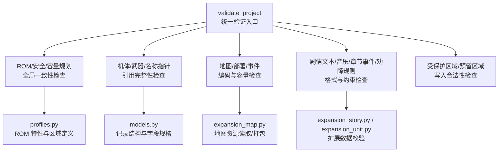
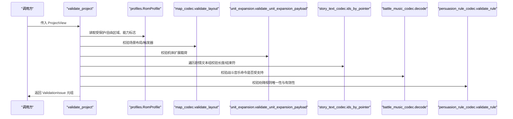
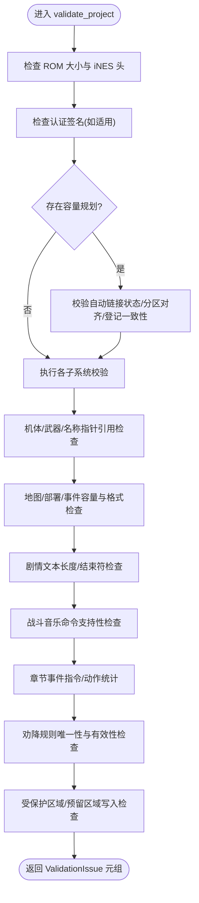
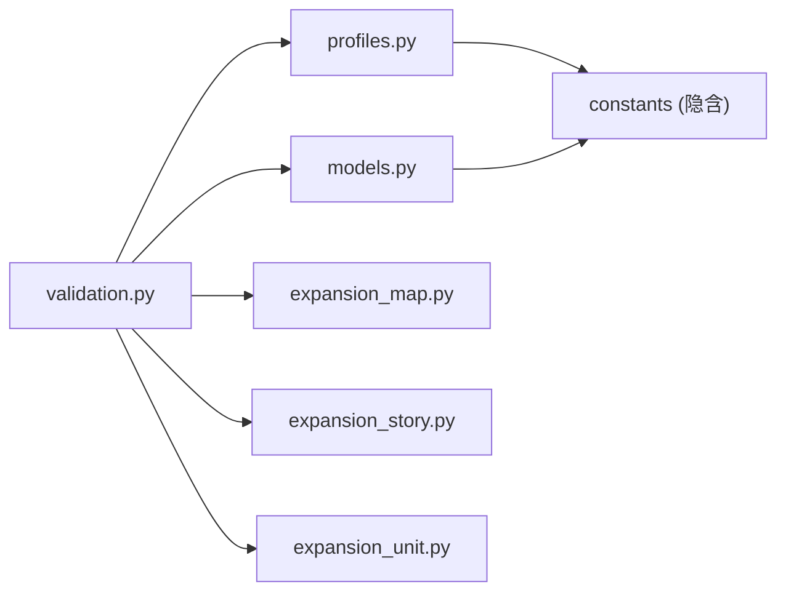

# 验证规则扩展

<cite>
**本文引用的文件**
- [validation.py](file://src/fc_editor/services/validation.py)
- [profiles.py](file://src/fc_editor/profiles.py)
- [models.py](file://src/fc_editor/models.py)
- [errors.py](file://src/fc_editor/errors.py)
- [expansion_map.py](file://src/fc_editor/expansion_map.py)
- [expansion_story.py](file://src/fc_editor/expansion_story.py)
- [expansion_unit.py](file://src/fc_editor/expansion_unit.py)
</cite>

## 目录
1. [简介](#简介)
2. [项目结构](#项目结构)
3. [核心组件](#核心组件)
4. [架构总览](#架构总览)
5. [详细组件分析](#详细组件分析)
6. [依赖关系分析](#依赖关系分析)
7. [性能考虑](#性能考虑)
8. [故障排查指南](#故障排查指南)
9. [结论](#结论)
10. [附录](#附录)

## 简介
本指南面向为 DC 修改器开发“验证规则扩展”的工程师与高级用户，系统阐述现有验证框架的设计与实现，并给出如何新增业务验证规则的完整方法。内容覆盖：
- 验证器接口、规则引擎与错误处理机制
- 新规则定义（语法、条件表达式、自定义验证函数）
- 数据完整性检查（跨字段、引用完整性、约束检查）
- 规则注册与执行流程
- 从简单字段校验到复杂业务逻辑的示例
- 性能优化、错误消息定制与调试技巧

## 项目结构
DC 修改器的验证能力集中在 fc_editor 子模块中，关键位置如下：
- 服务层：services/validation.py 提供统一的 validate_project 入口，串联所有领域验证
- 模型与常量：models.py 定义记录结构与字段规格，用于长度/范围/边界等基础校验
- 配置与特性：profiles.py 描述 ROM 布局、受保护区域、自由区域、编解码器能力等
- 异常类型：errors.py 定义 RomFormatError、ProjectFormatError、ChangeConflictError
- 扩展子系统：expansion_*.py 提供地图、剧情、机体等扩展数据的读取、打包与校验辅助

图表来源
- [validation.py:142-682](file://src/fc_editor/services/validation.py#L142-L682)
- [profiles.py:276-327](file://src/fc_editor/profiles.py#L276-L327)
- [models.py:13-58](file://src/fc_editor/models.py#L13-L58)
- [expansion_map.py:1-200](file://src/fc_editor/expansion_map.py#L1-L200)
- [expansion_story.py:1-200](file://src/fc_editor/expansion_story.py#L1-L200)
- [expansion_unit.py:1-200](file://src/fc_editor/expansion_unit.py#L1-L200)

章节来源
- [validation.py:142-682](file://src/fc_editor/services/validation.py#L142-L682)
- [profiles.py:276-327](file://src/fc_editor/profiles.py#L276-L327)
- [models.py:13-58](file://src/fc_editor/models.py#L13-L58)

## 核心组件
- ValidationIssue：统一的验证问题对象，包含严重级别、模块来源与人类可读消息
- ProjectView：验证器对上层工作视图的抽象，屏蔽具体数据来源差异，仅通过只读访问获取 ROM 数据与编解码能力
- validate_project：规则引擎主函数，按顺序执行 ROM 头/签名、容量规划、扩展分区、各子系统格式与引用完整性检查，汇总为 ValidationIssue 列表
- profiles.RomProfile：以数据类形式声明 ROM 布局、受保护区域、自由区域、编解码器能力等，驱动不同 ROM 变体的差异化验证
- models.FieldSpec/WeaponFieldSpec：以声明式方式定义字段宽度、范围、掩码、位移、显示缩放等，提供 decode/encode_into 进行强约束读写
- errors：集中异常类型，便于在验证链中抛出并转换为 ValidationIssue

章节来源
- [validation.py:85-141](file://src/fc_editor/services/validation.py#L85-L141)
- [validation.py:142-682](file://src/fc_editor/services/validation.py#L142-L682)
- [profiles.py:276-327](file://src/fc_editor/profiles.py#L276-L327)
- [models.py:13-58](file://src/fc_editor/models.py#L13-L58)
- [errors.py:1-11](file://src/fc_editor/errors.py#L1-L11)

## 架构总览
验证框架采用“声明式配置 + 命令式编排”的组合：
- 声明式：profiles.py 用数据类描述 ROM 布局、区域、能力；models.py 用 FieldSpec 描述字段约束
- 命令式：validation.py 中的 validate_project 按固定顺序调用各子系统校验，将异常转换为 ValidationIssue
- 扩展点：ProjectView 协议允许替换数据来源；各 codec 的 validate_* 方法作为可插拔校验钩子

图表来源
- [validation.py:142-682](file://src/fc_editor/services/validation.py#L142-L682)
- [profiles.py:276-327](file://src/fc_editor/profiles.py#L276-L327)

## 详细组件分析

### 验证器接口与规则引擎
- 统一入口：validate_project(project) 接收 ProjectView，内部维护 issues 列表，按模块顺序追加 ValidationIssue
- 严重级别：error/warning/info，由 Severity 类型限定
- 模块化：每个子系统（ROM、容量规划、地图、部署、事件、剧情、音乐、章节事件、劝降、安全/空间）独立分支，便于扩展与维护
- 异常转换：捕获 ValueError/RomFormatError 等并转为 ValidationIssue，保证调用方无需感知底层异常细节

图表来源
- [validation.py:142-682](file://src/fc_editor/services/validation.py#L142-L682)

章节来源
- [validation.py:142-682](file://src/fc_editor/services/validation.py#L142-L682)

### 数据模型与字段约束
- FieldSpec/WeaponFieldSpec：声明字段偏移、宽度、范围、掩码、位移、显示缩放、证据等级等，并提供 decode/encode_into 进行强约束读写
- UnitRecord/WeaponRecord/MapRecord/ScenarioLayout/StoryTextRecord：封装原始字节与容量，构造时进行基本合法性检查（如长度、ID 范围、宽高、图块值域等）
- 这些模型为验证器提供结构化数据，减少重复解析与边界判断

章节来源
- [models.py:13-58](file://src/fc_editor/models.py#L13-L58)
- [models.py:165-426](file://src/fc_editor/models.py#L165-L426)

### 扩展子系统校验
- 地图扩展：读取地形/场景/触发器布局，校验引用 Bank 是否在计划范围内，计算压缩后占用并与容量对比
- 机体扩展：校验资源选择器绑定、核心/配置代码镜像一致性、载荷有效性
- 剧情扩展：校验故事选择器绑定到分配的 Bank pair
- 剧情文本：逐条检查长度不变、独立 FF 结束符存在且位于末尾
- 战斗音乐：校验命令是否在受支持的 tracks 集合中
- 章节事件：统计指令与可视化动作数量，捕获格式异常
- 劝降规则：校验规则有效性并去重

章节来源
- [validation.py:228-356](file://src/fc_editor/services/validation.py#L228-L356)
- [validation.py:513-623](file://src/fc_editor/services/validation.py#L513-L623)
- [expansion_map.py:1-200](file://src/fc_editor/expansion_map.py#L1-L200)
- [expansion_unit.py:1-200](file://src/fc_editor/expansion_unit.py#L1-L200)
- [expansion_story.py:1-200](file://src/fc_editor/expansion_story.py#L1-L200)

### 安全与空间管理
- 受保护区域：比对 original 与 working，排除 allowed_protected_offsets 后报告任何差异
- 预留区域：仅在已登记的 allocation 之间允许写入，否则视为未管理的直接修改
- 容量信息：输出托管扩展空间总量、已分配与剩余字节，便于审计

章节来源
- [validation.py:625-678](file://src/fc_editor/services/validation.py#L625-L678)
- [profiles.py:256-327](file://src/fc_editor/profiles.py#L256-L327)

### 错误处理机制
- 统一异常：RomFormatError、ProjectFormatError、ChangeConflictError
- 验证器内捕获 ValueError/RomFormatError，转换为 ValidationIssue 并继续执行后续检查，避免单点失败阻断整体验证
- 严重级别区分：错误级用于阻止构建，警告/信息用于提示与审计

章节来源
- [errors.py:1-11](file://src/fc_editor/errors.py#L1-L11)
- [validation.py:142-682](file://src/fc_editor/services/validation.py#L142-L682)

## 依赖关系分析
- validation.py 依赖 profiles.py 提供的 ROM 特性与区域定义，以及各 codec 的校验能力
- models.py 提供通用字段规格与记录模型，被多个子系统复用
- expansion_*.py 提供扩展数据的读取、打包与校验辅助，降低验证器复杂度
- 耦合度：validation.py 与各 codec 通过 Protocol/方法名约定解耦，易于替换或扩展

图表来源
- [validation.py:142-682](file://src/fc_editor/services/validation.py#L142-L682)
- [profiles.py:276-327](file://src/fc_editor/profiles.py#L276-L327)
- [models.py:13-58](file://src/fc_editor/models.py#L13-L58)

章节来源
- [validation.py:142-682](file://src/fc_editor/services/validation.py#L142-L682)
- [profiles.py:276-327](file://src/fc_editor/profiles.py#L276-L327)
- [models.py:13-58](file://src/fc_editor/models.py#L13-L58)

## 性能考虑
- 批量比较：使用范围比较与跳过可变池的方式减少不必要的全量比对
- 早退策略：遇到致命错误（如 ROM 大小变化、iNES 头被修改）立即报告，但继续收集其他问题以便一次性反馈
- 分模块校验：将高开销操作（如地图资源打包、剧情文本遍历）放在合适阶段，避免重复计算
- 内存友好：尽量使用切片与迭代，避免创建大型中间结构

[本节为通用指导，不直接分析具体文件]

## 故障排查指南
- 常见错误定位
  - ROM 大小变化/iNES 头被修改：检查是否误改头部或容量
  - 认证签名不匹配：确认未改动受保护 Bank 或未通过认证流程
  - 容量规划不一致：核对自动链接状态、分区对齐与登记一致性
  - 地图/部署/事件溢出：检查压缩后长度与容量限制
  - 名称指针无效：确保指针指向已验证的原生名称
  - 剧情文本缺少结束符或长度改变：检查文本编辑工具与编码
  - 音乐命令不受支持：确认当前音频引擎支持的 tracks
  - 劝降规则重复：检查唯一性约束
  - 受保护/预留区域被直接修改：确认写入是否通过受管理的资源分配

- 调试建议
  - 关注 ValidationIssue 的 module 字段，快速定位问题来源
  - 结合 info 级消息了解容量使用情况，辅助定位溢出风险
  - 利用 models.FieldSpec 的 encode_into 抛出的范围错误，反向定位非法输入

章节来源
- [validation.py:142-682](file://src/fc_editor/services/validation.py#L142-L682)
- [models.py:13-58](file://src/fc_editor/models.py#L13-L58)

## 结论
DC 修改器的验证框架以声明式配置与命令式编排相结合，提供了可扩展、可维护且健壮的验证体系。通过 ProjectView 协议与 profiles 配置，验证器能够适配多种 ROM 变体；通过 FieldSpec 与记录模型，实现了严格的字段与边界约束；通过统一的 ValidationIssue 与异常转换，保证了错误处理的清晰与一致。在此基础上，开发者可以便捷地扩展新的业务验证规则，提升修改器的安全性与可靠性。

[本节为总结，不直接分析具体文件]

## 附录

### 如何定义新的业务验证规则
- 步骤概览
  - 在 validate_project 中添加新的校验分支，遵循现有模块划分
  - 使用 ProjectView 提供的只读接口获取数据，避免直接操作 ROM
  - 使用 models.FieldSpec/WeaponFieldSpec 进行字段级约束校验
  - 捕获 ValueError/RomFormatError 并转换为 ValidationIssue
  - 根据业务需要设置 severity（error/warning/info）与 module 标签

- 规则语法与条件表达式
  - 基于 profiles 配置的条件：如 flags、region、selector 等
  - 基于 models 的范围/掩码/位移条件：如 minimum/maximum/mask/shift
  - 基于 codec 的 validate_* 方法：如 validate_layout、validate_entries、validate_rule

- 自定义验证函数
  - 将复杂逻辑封装为独立函数，返回 bool 或抛出 ValueError
  - 在 validate_project 中调用并转换异常为 ValidationIssue
  - 复用已有工具函数（如 _first_difference_excluding）减少重复代码

- 数据完整性检查
  - 跨字段验证：在同一记录内关联多个字段进行一致性检查
  - 引用完整性：确保指针/ID 指向有效范围或已验证资源
  - 约束检查：长度、容量、对齐、唯一性等

- 注册与执行流程
  - 注册：在 validate_project 中按顺序添加校验分支
  - 执行：调用 ProjectView 接口，收集 ValidationIssue
  - 输出：最终返回 tuple[ValidationIssue, ...]

- 完整示例（路径指引）
  - 简单字段验证：参考 models.FieldSpec.encode_into 的范围检查
  - 复杂业务逻辑：参考 validate_project 中对地图/部署/事件/剧情/音乐/劝降的校验流程

章节来源
- [validation.py:142-682](file://src/fc_editor/services/validation.py#L142-L682)
- [models.py:13-58](file://src/fc_editor/models.py#L13-L58)

### 性能优化与调试技巧
- 性能优化
  - 使用范围比较与跳过可变池减少全量比对
  - 将高开销操作延迟到必要时再执行
  - 避免重复编解码，缓存中间结果（如 map 资源打包结果）

- 错误消息定制
  - 使用 module 字段分类问题来源
  - 使用 severity 区分错误级别
  - 提供人类可读的消息，包含关键上下文（如地址、容量、ID）

- 调试工具使用
  - 关注 info 级消息了解容量使用情况
  - 结合 models 的 decode/encode_into 快速定位非法输入
  - 利用 profiles 的区域定义定位受保护/预留区域的写入问题

章节来源
- [validation.py:142-682](file://src/fc_editor/services/validation.py#L142-L682)
- [profiles.py:256-327](file://src/fc_editor/profiles.py#L256-L327)
- [models.py:13-58](file://src/fc_editor/models.py#L13-L58)