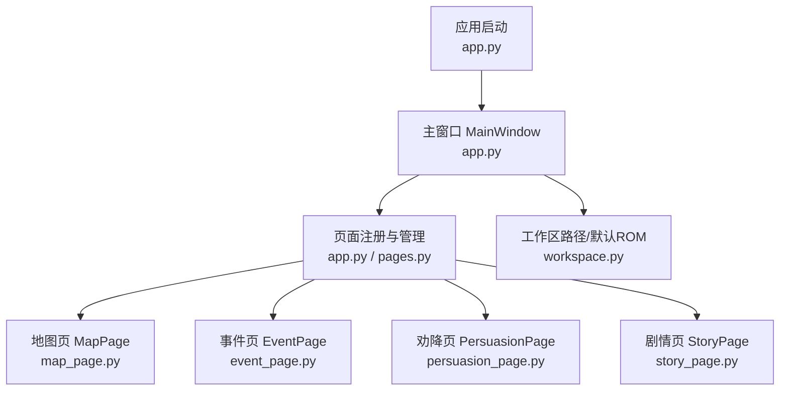
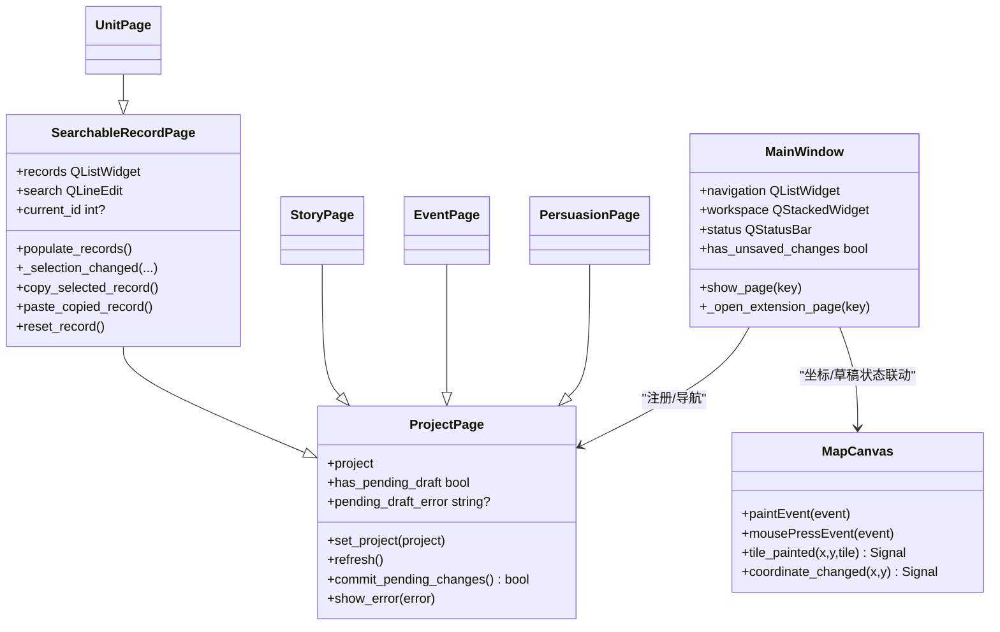
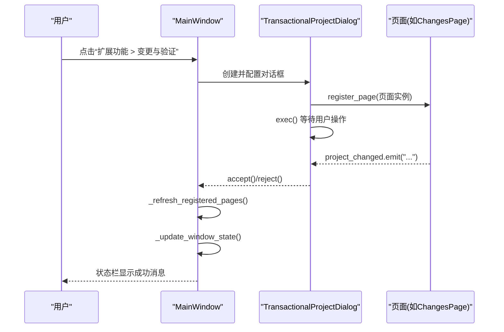
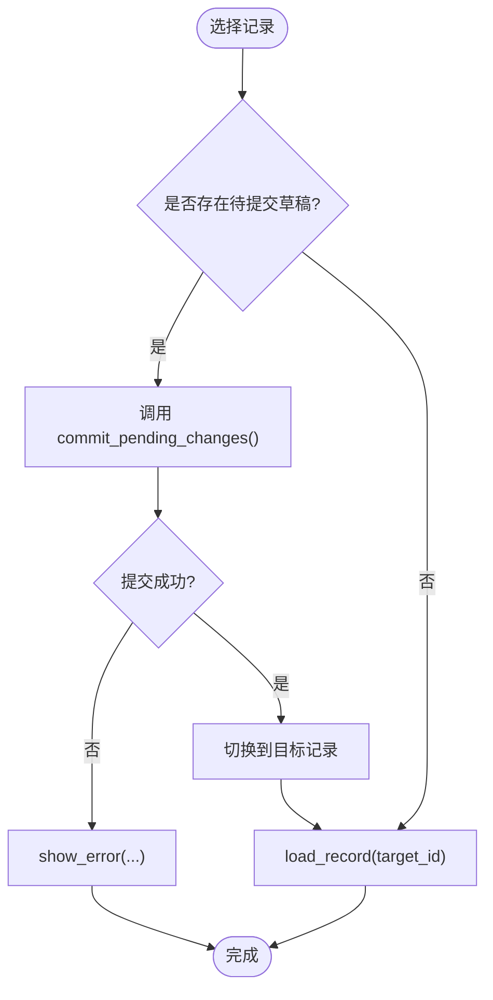
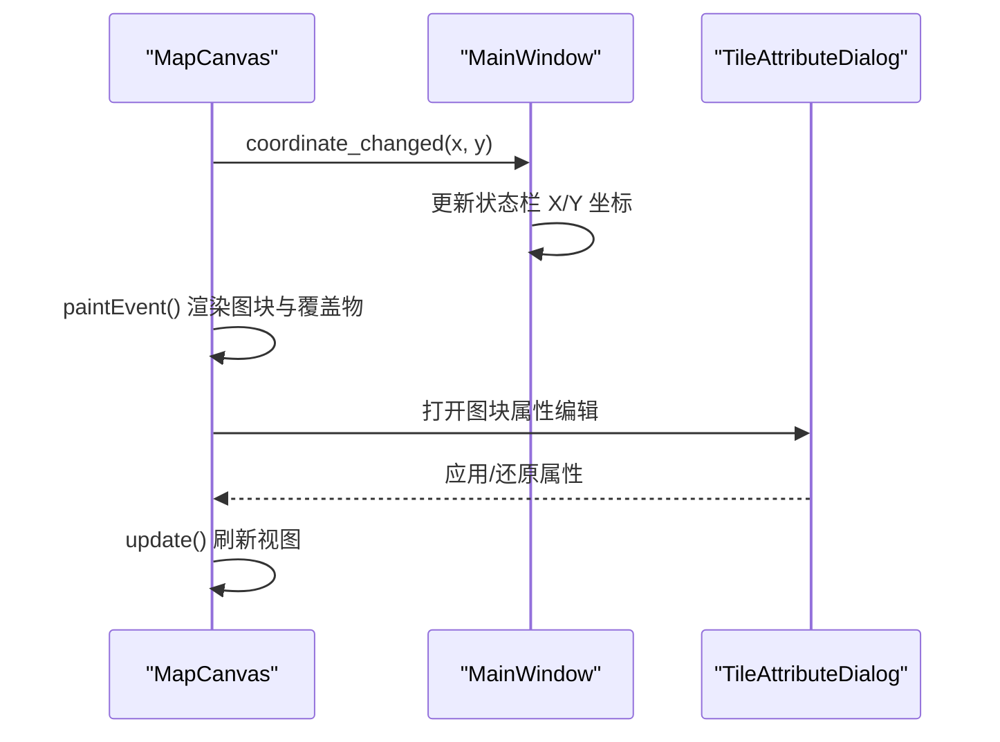
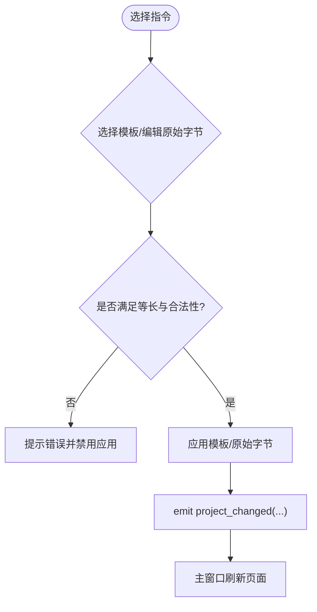
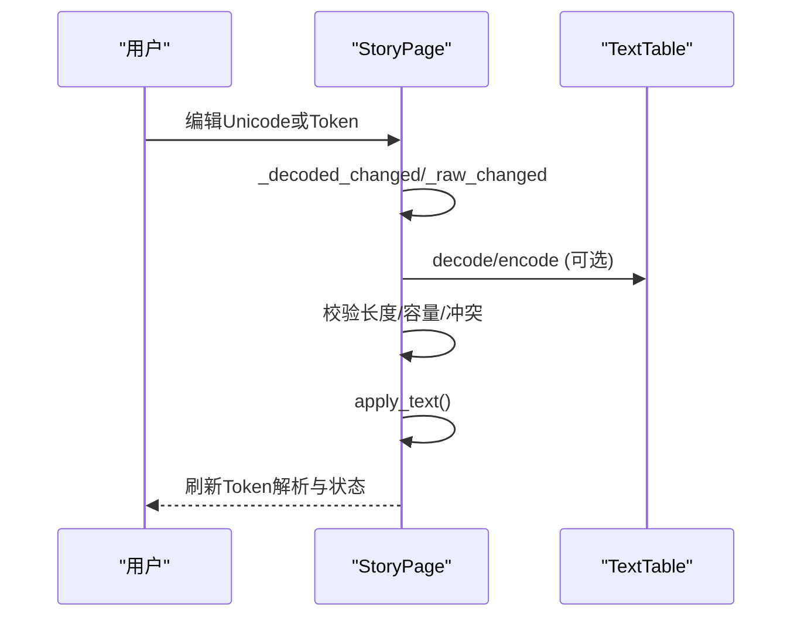
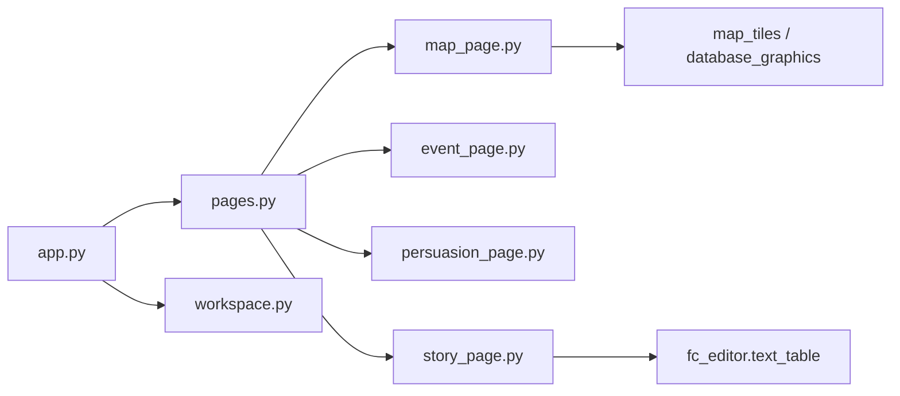
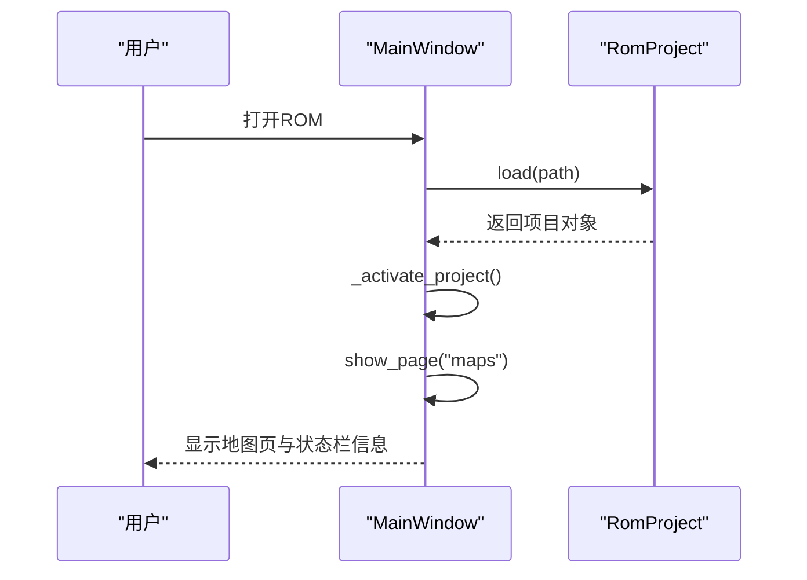
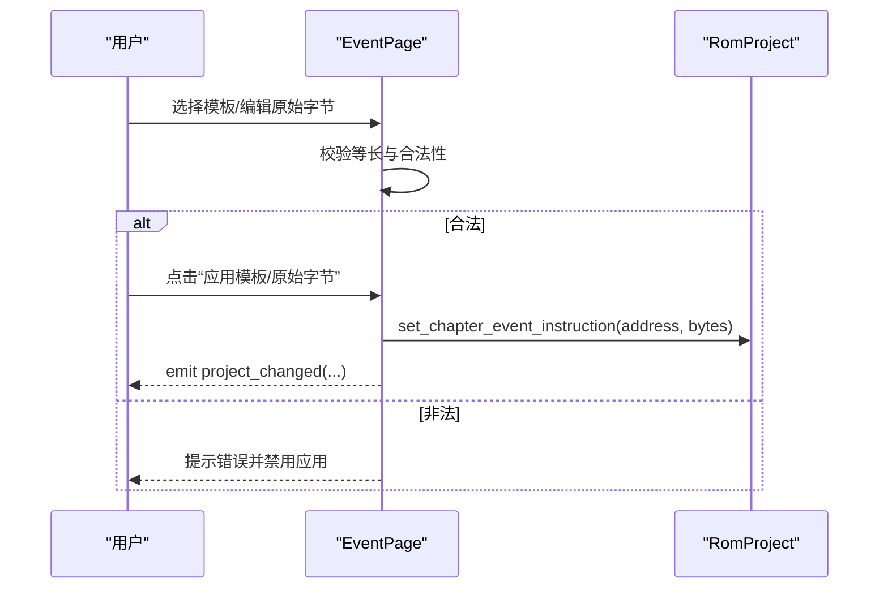

# GUI层设计

<cite>
**本文引用的文件**
- [app.py](file://src/dc_modifier/app.py)
- [pages.py](file://src/dc_modifier/pages.py)
- [map_page.py](file://src/dc_modifier/map_page.py)
- [event_page.py](file://src/dc_modifier/event_page.py)
- [persuasion_page.py](file://src/dc_modifier/persuasion_page.py)
- [story_page.py](file://src/dc_modifier/story_page.py)
- [workspace.py](file://src/dc_modifier/workspace.py)
</cite>

## 目录
1. [简介](#简介)
2. [项目结构](#项目结构)
3. [核心组件](#核心组件)
4. [架构总览](#架构总览)
5. [详细组件分析](#详细组件分析)
6. [依赖关系分析](#依赖关系分析)
7. [性能与响应式优化](#性能与响应式优化)
8. [故障排查指南](#故障排查指南)
9. [结论](#结论)
10. [附录：关键流程时序图](#附录：关键流程时序图)

## 简介
本设计文档面向DC修改器的PySide6图形界面层，聚焦主窗口布局、页面管理系统、用户交互流程与事件处理机制。文档从架构到实现细节逐层展开，说明MainWindow、PageManager（以ProjectPage体系体现）与各编辑器页面的职责边界；解释状态同步、数据绑定模式、错误处理与用户反馈策略；并通过流程图与时序图展示典型工作流。所有分析与图示均基于仓库中实际代码文件。

## 项目结构
DC修改器GUI采用“主窗口 + 多页面”的模块化组织方式：
- 应用入口与主窗口：app.py
- 页面基类与通用记录编辑能力：pages.py
- 地图绘制与交互：map_page.py
- 章节事件编辑：event_page.py
- 劝降条件编辑：persuasion_page.py
- 剧情文本编辑：story_page.py
- 工作区路径与默认ROM定位：workspace.py

图表来源
- [app.py:276-365](file://src/dc_modifier/app.py#L276-L365)
- [pages.py:103-152](file://src/dc_modifier/pages.py#L103-L152)
- [map_page.py:595-800](file://src/dc_modifier/map_page.py#L595-L800)
- [event_page.py:66-228](file://src/dc_modifier/event_page.py#L66-L228)
- [persuasion_page.py:25-127](file://src/dc_modifier/persuasion_page.py#L25-L127)
- [story_page.py:35-171](file://src/dc_modifier/story_page.py#L35-L171)
- [workspace.py:7-43](file://src/dc_modifier/workspace.py#L7-L43)

章节来源
- [app.py:276-365](file://src/dc_modifier/app.py#L276-L365)
- [workspace.py:7-43](file://src/dc_modifier/workspace.py#L7-L43)

## 核心组件
- MainWindow：应用主窗口，负责菜单、工具栏、状态栏、页面导航、工程生命周期（打开/保存/构建）、扩展对话框管理、未保存变更检测与提示。
- ProjectPage：页面抽象基类，定义set_project、refresh、has_pending_draft、commit_pending_changes、show_error等统一接口，使各页面具备一致的待提交草稿与错误上报能力。
- SearchableRecordPage：在ProjectPage基础上提供搜索、列表选择、复制/粘贴/还原记录的通用能力，被UnitPage等复用。
- 具体页面：
  - MapPage：地图画布、地形调色板、图块属性编辑、部署/触发上下文菜单。
  - EventPage：章节事件指令筛选与等长替换、模板参数编辑、原始字节编辑。
  - PersuasionPage：四条可编辑劝降规则表项的可视化编辑。
  - StoryPage：剧情文本组浏览、Unicode与Token双向编辑、码表载入与导出、长度校验与自动重排提示。
- 工作区：workspace.py提供默认ROM路径、输出目录保护等。

章节来源
- [app.py:276-800](file://src/dc_modifier/app.py#L276-L800)
- [pages.py:103-513](file://src/dc_modifier/pages.py#L103-L513)
- [map_page.py:595-800](file://src/dc_modifier/map_page.py#L595-L800)
- [event_page.py:66-701](file://src/dc_modifier/event_page.py#L66-L701)
- [persuasion_page.py:25-295](file://src/dc_modifier/persuasion_page.py#L25-L295)
- [story_page.py:35-800](file://src/dc_modifier/story_page.py#L35-L800)
- [workspace.py:7-43](file://src/dc_modifier/workspace.py#L7-L43)

## 架构总览
GUI采用“主窗口集中调度 + 页面自治编辑”的分层架构：
- 主窗口负责工程加载、全局菜单、扩展对话框包装、状态栏消息与未保存变更提示。
- 页面通过统一的ProjectPage接口暴露“待提交草稿”和“错误信息”，由框架在切换页面或关闭时强制提交或阻止。
- 数据流向：用户输入 → 页面内部状态 → commit_pending_changes → RomProject写入 → 刷新UI并通知主窗口更新状态。

图表来源
- [pages.py:103-513](file://src/dc_modifier/pages.py#L103-L513)
- [map_page.py:595-800](file://src/dc_modifier/map_page.py#L595-L800)
- [app.py:276-365](file://src/dc_modifier/app.py#L276-L365)

## 详细组件分析

### 主窗口 MainWindow
- 职责
  - 构建菜单与动作（文件、数据、扩展功能、工程、帮助）。
  - 注册页面并维护导航列表与QStackedWidget显示。
  - 打开/保存ROM、工程、导出IPS、一键构建。
  - 打开扩展对话框（数据库、字体库、地图动画、文字转换、存档修改器等），并在对话框确认后刷新已注册页面。
  - 未保存变更检测：比较ROM快照、资源分配、地图草稿。
  - 状态栏：会话状态、坐标、模块名、变更计数。
- 关键流程
  - 打开ROM后设置项目并激活地图页。
  - 通过_create_extension_dialog创建事务型对话框，封装页面与确认按钮。
  - 通过_run_project_dialog统一处理对话框生命周期与结果回调。

图表来源
- [app.py:583-653](file://src/dc_modifier/app.py#L583-L653)
- [app.py:494-540](file://src/dc_modifier/app.py#L494-L540)

章节来源
- [app.py:276-800](file://src/dc_modifier/app.py#L276-L800)

### 页面基类 ProjectPage 与 SearchableRecordPage
- ProjectPage
  - 统一接口：set_project、refresh、has_pending_draft、pending_draft_error、commit_pending_changes、show_error。
  - 通过apply_button的存在与启用状态判断是否有待提交表单改动。
- SearchableRecordPage
  - 提供搜索框、上一条/下一条、结果计数、右键菜单（复制/粘贴/复制到其他ID/还原/导出）。
  - 列表选择变化时，若存在待提交草稿，先尝试提交再切换目标记录，避免丢失编辑。
  - 支持record_ids、record_text、preferred_record_id等钩子供子类定制。

图表来源
- [pages.py:243-513](file://src/dc_modifier/pages.py#L243-L513)

章节来源
- [pages.py:103-513](file://src/dc_modifier/pages.py#L103-L513)

### 地图页 MapPage
- 职责
  - 地图画布MapCanvas：渲染地形/图块、叠加单位图标、处理鼠标绘制与拾取、发射坐标变化信号。
  - 图块属性编辑TileAttributeDialog：颜色表、防御补正、海属性、空/陆/海移动补正，支持预览与只读公用表。
  - NES调色板选择NesPaletteDialog与NesColorButton。
- 交互
  - 左键绘制、右键拾取或进入部署/触发上下文菜单。
  - 坐标变化通过signal传回主窗口状态栏。

图表来源
- [map_page.py:595-800](file://src/dc_modifier/map_page.py#L595-L800)
- [map_page.py:310-593](file://src/dc_modifier/map_page.py#L310-L593)
- [app.py:328-332](file://src/dc_modifier/app.py#L328-L332)

章节来源
- [map_page.py:595-800](file://src/dc_modifier/map_page.py#L595-L800)
- [map_page.py:310-593](file://src/dc_modifier/map_page.py#L310-L593)
- [app.py:328-332](file://src/dc_modifier/app.py#L328-L332)

### 事件页 EventPage
- 职责
  - 按章节、阶段、类型筛选事件指令，表格展示地址、上下文、动作、参数、原始字节。
  - 模板参数编辑与等长原始字节编辑双通道，保证不改变脚本长度。
  - 高级面板支持复制/粘贴等长指令。
- 交互
  - 切换筛选或选择其他指令前，若有待提交草稿则先提交或报错阻止。
  - 应用模板/原始字节后发出project_changed消息，主窗口刷新。

图表来源
- [event_page.py:66-701](file://src/dc_modifier/event_page.py#L66-L701)

章节来源
- [event_page.py:66-701](file://src/dc_modifier/event_page.py#L66-L701)

### 劝降页 PersuasionPage
- 职责
  - 展示并编辑四条可编辑的劝降规则：章节、劝说者、目标、脚本地址与原始字节（只读）。
  - 切换行前若有待提交草稿则先提交或阻止。
- 交互
  - 应用/还原后发出project_changed消息。

章节来源
- [persuasion_page.py:25-295](file://src/dc_modifier/persuasion_page.py#L25-L295)

### 剧情页 StoryPage
- 职责
  - 文本组选择与索引列表，支持搜索与上下条导航。
  - Unicode文字编辑与原始Token编辑双通道，保持控制参数可逆。
  - 载入外部字库表、导出字库模板、Token解析表。
  - 在未规划空间时强制等长；已规划空间时进行容量使用统计与自动重排提示。
- 交互
  - 切换文本组/索引前若有待提交草稿则先提交或阻止。
  - 应用文本后发出project_changed消息。

图表来源
- [story_page.py:35-800](file://src/dc_modifier/story_page.py#L35-L800)

章节来源
- [story_page.py:35-800](file://src/dc_modifier/story_page.py#L35-L800)

## 依赖关系分析
- 主窗口依赖页面注册与导航，页面通过信号与主窗口通信。
- 页面依赖RomProject进行数据读写；部分页面依赖fc_editor提供的编解码与模型。
- 地图页依赖map_tiles与database_graphics进行图块与调色板渲染。
- workspace提供默认ROM与输出路径保护，防止误写参考目录。

图表来源
- [app.py:276-365](file://src/dc_modifier/app.py#L276-L365)
- [pages.py:103-513](file://src/dc_modifier/pages.py#L103-L513)
- [map_page.py:45-53](file://src/dc_modifier/map_page.py#L45-L53)
- [story_page.py:28-32](file://src/dc_modifier/story_page.py#L28-L32)
- [workspace.py:7-43](file://src/dc_modifier/workspace.py#L7-L43)

章节来源
- [app.py:276-365](file://src/dc_modifier/app.py#L276-L365)
- [pages.py:103-513](file://src/dc_modifier/pages.py#L103-L513)
- [map_page.py:45-53](file://src/dc_modifier/map_page.py#L45-L53)
- [story_page.py:28-32](file://src/dc_modifier/story_page.py#L28-L32)
- [workspace.py:7-43](file://src/dc_modifier/workspace.py#L7-L43)

## 性能与响应式优化
- 批量更新与信号屏蔽
  - 列表重建时使用blockSignals与setUpdatesEnabled(False)减少重绘与信号风暴，完成后恢复。
  - 示例：SearchableRecordPage.populate_records、EventPage._populate_table、PersuasionPage.refresh。
- 延迟渲染与按需计算
  - 地图画布仅在必要时update局部区域；图块属性编辑仅对可见图块生成预览。
- 状态同步最小化
  - 页面在切换前才提交草稿，避免频繁写盘；主窗口在对话框结束后统一刷新已注册页面。
- 用户体验
  - 高对比箭头样式VisibleArrowStyle提升数值控件易用性。
  - 统一样式表StyleSheet提供一致视觉反馈与禁用态。
  - 状态栏实时显示坐标、模块、变更计数与操作结果消息。

章节来源
- [app.py:66-127](file://src/dc_modifier/app.py#L66-L127)
- [app.py:128-233](file://src/dc_modifier/app.py#L128-L233)
- [pages.py:396-434](file://src/dc_modifier/pages.py#L396-L434)
- [event_page.py:426-454](file://src/dc_modifier/event_page.py#L426-L454)
- [map_page.py:656-750](file://src/dc_modifier/map_page.py#L656-L750)

## 故障排查指南
- 常见错误与提示
  - 未保存工程：关闭或切换时弹出确认对话框，允许放弃或取消。
  - 非法输入：事件页原始字节必须等长且合法；剧情页Token必须完整十六进制；劝降页需选择有效槽位。
  - 容量限制：未规划空间时剧情文本必须保持原长度；已规划空间会提示预计占用与自动重排能力。
  - 输出保护：禁止写入references目录，writable_output_path会抛出异常。
- 定位方法
  - 查看状态栏消息与页面“编辑状态”标签。
  - 检查页面pending_draft_error与has_pending_draft。
  - 使用“高级”面板查看原始字节与地址，便于比对差异。

章节来源
- [app.py:731-754](file://src/dc_modifier/app.py#L731-L754)
- [event_page.py:566-636](file://src/dc_modifier/event_page.py#L566-L636)
- [story_page.py:517-530](file://src/dc_modifier/story_page.py#L517-L530)
- [workspace.py:37-43](file://src/dc_modifier/workspace.py#L37-L43)

## 结论
该GUI层以ProjectPage为统一契约，将复杂的数据编辑任务下沉到各页面自治实现，主窗口专注于工程生命周期与跨页面协调。通过严格的草稿提交机制、等长约束与容量校验，既保证了安全性，又提供了高效的编辑体验。结合批量更新、信号屏蔽与统一样式，整体具备良好的性能与一致性。后续可扩展更多页面，只需遵循ProjectPage接口即可无缝集成。

## 附录：关键流程时序图

### 打开ROM并激活地图页

图表来源
- [app.py:774-793](file://src/dc_modifier/app.py#L774-L793)
- [app.py:794-800](file://src/dc_modifier/app.py#L794-L800)

章节来源
- [app.py:774-800](file://src/dc_modifier/app.py#L774-L800)

### 事件页等长替换流程

图表来源
- [event_page.py:655-689](file://src/dc_modifier/event_page.py#L655-L689)

章节来源
- [event_page.py:655-689](file://src/dc_modifier/event_page.py#L655-L689)