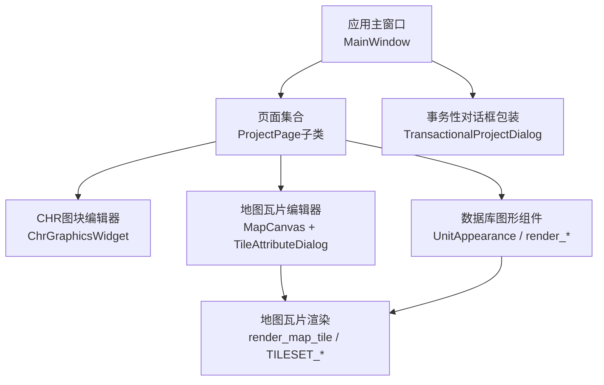
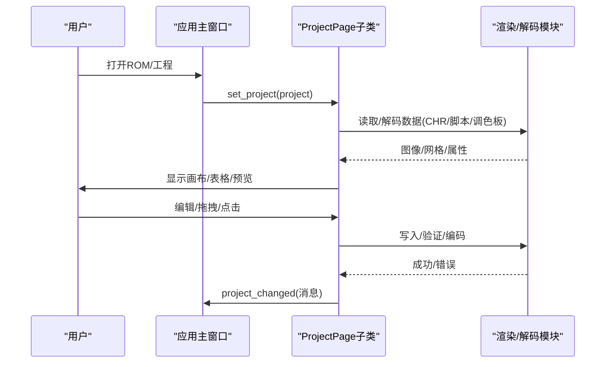
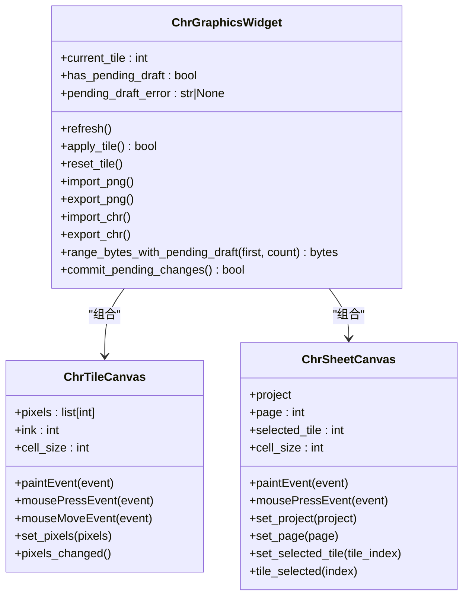
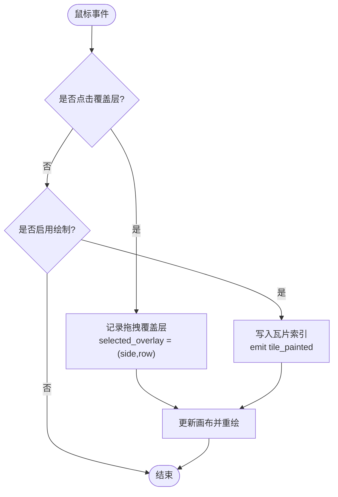
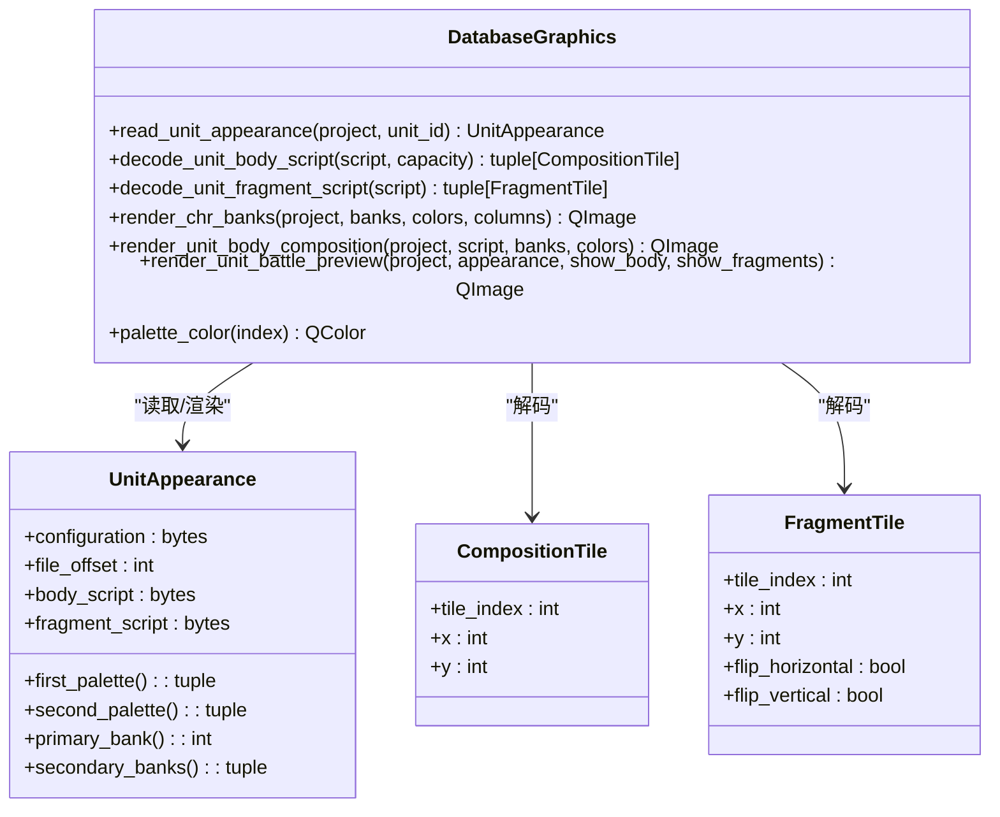
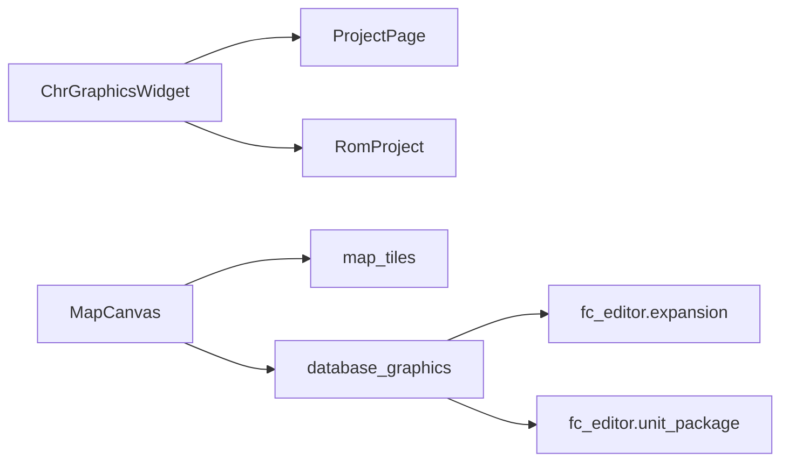

# UI组件库

<cite>
**本文引用的文件**
- [app.py](file://src/dc_modifier/app.py)
- [pages.py](file://src/dc_modifier/pages.py)
- [chr_widget.py](file://src/dc_modifier/chr_widget.py)
- [map_page.py](file://src/dc_modifier/map_page.py)
- [map_tiles.py](file://src/dc_modifier/map_tiles.py)
- [database_graphics.py](file://src/dc_modifier/database_graphics.py)
- [legacy_windows.py](file://src/dc_modifier/legacy_windows.py)
</cite>

## 目录
1. [简介](#简介)
2. [项目结构](#项目结构)
3. [核心组件](#核心组件)
4. [架构总览](#架构总览)
5. [详细组件分析](#详细组件分析)
6. [依赖关系分析](#依赖关系分析)
7. [性能与内存优化](#性能与内存优化)
8. [故障排查指南](#故障排查指南)
9. [结论](#结论)
10. [附录：API与使用示例](#附录api与使用示例)

## 简介
本设计文档面向DC修改器UI组件库，聚焦以下自定义Qt组件的设计与实现：CHR图块编辑器、地图瓦片编辑器、数据库图形组件。文档从系统架构、组件职责、数据流、事件机制、样式主题、响应式布局、性能与兼容性等维度展开，并提供可操作的创建、配置与使用指引（以代码片段路径形式给出）。目标是帮助开发者快速理解并扩展这些组件，同时保证在NES/FC ROM编辑场景下的正确性与稳定性。

## 项目结构
DC修改器的UI层由应用主窗口、页面基类与具体功能页组成；渲染与数据解码集中在专用模块中。关键组织方式如下：
- 应用壳与主题：应用主窗口负责菜单、状态栏、全局样式表与对话框生命周期管理。
- 页面基类与通用控件：提供统一的“待提交草稿”语义、记录列表、搜索过滤、导出与复制粘贴能力。
- 自定义绘制组件：针对CHR图块、地图瓦片、机体外观预览的像素级绘制与交互。
- 数据解码与调色板：将ROM中的CHR、调色板、脚本指令解码为可视图像或网格。

图表来源
- [app.py:276-365](file://src/dc_modifier/app.py#L276-L365)
- [pages.py:103-152](file://src/dc_modifier/pages.py#L103-L152)
- [chr_widget.py:162-273](file://src/dc_modifier/chr_widget.py#L162-L273)
- [map_page.py:595-800](file://src/dc_modifier/map_page.py#L595-L800)
- [map_tiles.py:108-153](file://src/dc_modifier/map_tiles.py#L108-L153)
- [database_graphics.py:249-438](file://src/dc_modifier/database_graphics.py#L249-L438)
- [legacy_windows.py:71-200](file://src/dc_modifier/legacy_windows.py#L71-L200)

章节来源
- [app.py:276-365](file://src/dc_modifier/app.py#L276-L365)
- [pages.py:103-152](file://src/dc_modifier/pages.py#L103-L152)

## 核心组件
- CHR图块编辑器：提供8×8图块的像素级绘制、选择、导入/导出PNG与批量CHR数据读写，支持草稿校验与回滚。
- 地图瓦片编辑器：提供战场地图的瓦片绘制、地形属性编辑、单位图标叠加与拖拽、触发点上下文操作。
- 数据库图形组件：解析机体外观配置、背景拼装脚本与碎片精灵脚本，渲染战斗预览与图库预览，统一调色板映射。

章节来源
- [chr_widget.py:33-160](file://src/dc_modifier/chr_widget.py#L33-L160)
- [map_page.py:595-800](file://src/dc_modifier/map_page.py#L595-L800)
- [database_graphics.py:78-247](file://src/dc_modifier/database_graphics.py#L78-L247)

## 架构总览
组件通过“页面”模式接入应用：每个功能页继承自ProjectPage，暴露统一的刷新、草稿提交、错误提示接口；应用主窗口负责加载ROM、注册页面、处理菜单与工具对话框。渲染逻辑与业务数据分离，确保UI可复用且易于测试。

图表来源
- [app.py:276-365](file://src/dc_modifier/app.py#L276-L365)
- [pages.py:103-152](file://src/dc_modifier/pages.py#L103-L152)
- [database_graphics.py:249-438](file://src/dc_modifier/database_graphics.py#L249-L438)

## 详细组件分析

### CHR图块编辑器（ChrGraphicsWidget）
- 功能特性
  - 左侧：16×16图块浏览器（每页256个图块），支持页码切换与选中高亮。
  - 右侧：8×8放大编辑画布，支持左键画笔、右键取色、局部重绘。
  - 底部：单个图块控制区（应用/还原/导入PNG/导出PNG）、批量CHR导入导出、范围数量设置。
  - 草稿机制：未提交的图块变化会阻止切换图块或提交，直到通过编码器校验。
- API与事件
  - 信号：pixels_changed（像素变更）、tile_selected（浏览器选中图块）。
  - 方法：refresh()、apply_tile()、reset_tile()、import_png()/export_png()、import_chr()/export_chr()、range_bytes_with_pending_draft()、commit_pending_changes()。
  - 属性：current_tile、has_pending_draft、pending_draft_error、pending_draft_tile_bytes()。
- 样式与主题
  - 使用全局样式表定义按钮、输入框、标签等外观；画布禁用抗锯齿以提升像素精度。
- 响应式设计
  - 固定尺寸画布基于cell_size计算sizeHint；浏览器与画布并列布局，便于同时浏览与编辑。
- 性能与内存
  - 仅对修改单元格进行局部update；导入PNG时按8×8缩放并量化到4色索引；批量CHR读写通过工作缓冲避免重复编解码。
- 错误处理
  - 非法PNG、越界图块、长度非16倍数等均抛出明确异常并通过show_error展示。

图表来源
- [chr_widget.py:33-160](file://src/dc_modifier/chr_widget.py#L33-L160)
- [chr_widget.py:162-630](file://src/dc_modifier/chr_widget.py#L162-L630)

章节来源
- [chr_widget.py:33-160](file://src/dc_modifier/chr_widget.py#L33-L160)
- [chr_widget.py:162-630](file://src/dc_modifier/chr_widget.py#L162-L630)

### 地图瓦片编辑器（MapCanvas与TileAttributeDialog）
- 功能特性
  - 地图画布：支持瓦片绘制、覆盖层（单位/事件/商店等）拖拽与选择、坐标状态栏更新。
  - 地形属性编辑：颜色表1（可编辑）、颜色表2/3（只读）、防御补正、海属性、空/陆/海移动补正。
  - 单位图标：按阵营配色渲染四图块图标，支持透明通道与边框高亮。
- API与事件
  - 信号：tile_painted(x,y,tile)、tile_picked(tile)、right_tile_picked(tile)、coordinate_changed(x,y)、overlay_*系列。
  - 方法：set_content()、set_cell_size()、set_tile_images()、set_overlay_images()。
  - 属性：map_width/height、tiles、overlays、selected_tile/right_selected_tile、dragged_overlay等。
- 样式与主题
  - 使用全局样式表；地图网格线、覆盖层边框与选中态使用高对比色。
- 响应式设计
  - cell_size可调，sizeHint随宽高与单元格大小动态计算；覆盖层与瓦片图层分离绘制。
- 性能与内存
  - 仅重绘受影响单元格；瓦片图像缓存于tile_images；覆盖层图像按需生成与缓存。
- 错误处理
  - 未知位图、无效逻辑图块范围、未验证指令等抛出异常；属性保存失败时弹窗提示。

图表来源
- [map_page.py:731-800](file://src/dc_modifier/map_page.py#L731-L800)

章节来源
- [map_page.py:595-800](file://src/dc_modifier/map_page.py#L595-L800)
- [map_page.py:238-593](file://src/dc_modifier/map_page.py#L238-L593)

### 数据库图形组件（UnitAppearance与渲染函数）
- 功能特性
  - 读取机体外观配置（主/次调色板、主/次图库页号）、背景拼装脚本与碎片精灵脚本。
  - 渲染函数：render_unit_battle_preview（战斗预览）、render_chr_banks（图库预览）、render_unit_body_composition（背景拼装）、palette_color（调色板映射）。
- API与事件
  - 数据结构：UnitAppearance（configuration、file_offset、body_script、fragment_script）、CompositionTile、FragmentTile。
  - 解码函数：decode_unit_body_script、decode_unit_fragment_script。
  - 渲染函数：read_unit_appearance、render_chr_banks、render_unit_body_composition、render_unit_battle_preview。
- 样式与主题
  - 使用FCEUX调色板映射为QColor，确保预览与游戏一致；背景填充透明或指定底色。
- 响应式设计
  - 根据图库页号与调色板动态计算图像尺寸；支持列数参数控制预览布局。
- 性能与内存
  - 仅在必要时解码脚本与生成图像；对超出范围的引用进行快速校验以避免无效绘制。
- 错误处理
  - 非法脚本、越界图块、未验证指令均抛出异常；运行时保护（如加载代码校验）防止误用。

图表来源
- [database_graphics.py:29-76](file://src/dc_modifier/database_graphics.py#L29-L76)
- [database_graphics.py:78-247](file://src/dc_modifier/database_graphics.py#L78-L247)
- [database_graphics.py:249-438](file://src/dc_modifier/database_graphics.py#L249-L438)

章节来源
- [database_graphics.py:29-76](file://src/dc_modifier/database_graphics.py#L29-L76)
- [database_graphics.py:78-247](file://src/dc_modifier/database_graphics.py#L78-L247)
- [database_graphics.py:249-438](file://src/dc_modifier/database_graphics.py#L249-L438)

## 依赖关系分析
- 组件耦合
  - ChrGraphicsWidget依赖ProjectPage基类与工作空间路径工具；与RomProject通过codec进行数据读写。
  - MapCanvas依赖map_tiles的瓦片渲染与调色板路由；与database_graphics共享调色板映射。
  - DatabaseGraphics依赖fc_editor.expansion与unit_package进行资源定位与校验。
- 外部依赖
  - PySide6.QtCore/QtGui/QtWidgets用于UI与绘制。
  - fc_rom_editor_core.RomProject提供ROM工作缓冲、编解码与事务能力。
- 循环依赖
  - 当前模块间无直接循环依赖；通过页面基类与工具函数解耦。

图表来源
- [chr_widget.py:162-273](file://src/dc_modifier/chr_widget.py#L162-L273)
- [map_page.py:595-800](file://src/dc_modifier/map_page.py#L595-L800)
- [map_tiles.py:108-153](file://src/dc_modifier/map_tiles.py#L108-L153)
- [database_graphics.py:249-438](file://src/dc_modifier/database_graphics.py#L249-L438)

章节来源
- [chr_widget.py:162-273](file://src/dc_modifier/chr_widget.py#L162-L273)
- [map_page.py:595-800](file://src/dc_modifier/map_page.py#L595-L800)
- [map_tiles.py:108-153](file://src/dc_modifier/map_tiles.py#L108-L153)
- [database_graphics.py:249-438](file://src/dc_modifier/database_graphics.py#L249-L438)

## 性能与内存优化
- 局部重绘：ChrTileCanvas与MapCanvas仅重绘受影响区域，减少整体刷新开销。
- 图像缓存：MapCanvas缓存瓦片图像与覆盖层图像；DatabaseGraphics按需生成预览图像。
- 像素级优化：禁用抗锯齿以保证NES像素对齐；导入PNG时快速缩放与量化。
- 批量IO：CHR批量导入/导出通过工作缓冲一次性读写，避免多次编解码。
- 内存管理：图像对象在不再使用时由Qt自动回收；对话框关闭后及时deleteLater。
- 兼容性：严格校验ROM布局与指令集，防止在非基准ROM上产生不可预期行为。

## 故障排查指南
- 常见错误
  - 非法PNG：无法解码或颜色数超限导致转换失败。
  - 越界图块：CHR索引超出活动范围或逻辑图块不在$0-$F。
  - 未验证指令：机体拼图/碎片脚本包含未知命令或缺少结束码。
  - 属性保存失败：地图属性写入时报错，需检查颜色表与字段范围。
- 诊断步骤
  - 查看状态栏与错误弹窗信息；确认当前图块/属性值是否在有效范围。
  - 使用“原始记录”视图核对字节序列；尝试还原默认值。
  - 在事务性对话框中取消操作以回滚会话快照。
- 恢复策略
  - 使用“还原图块/属性”恢复至打开ROM时的值。
  - 通过“撤销/重做”或工程文件恢复历史状态。

章节来源
- [chr_widget.py:459-547](file://src/dc_modifier/chr_widget.py#L459-L547)
- [map_page.py:310-593](file://src/dc_modifier/map_page.py#L310-L593)
- [database_graphics.py:78-247](file://src/dc_modifier/database_graphics.py#L78-L247)
- [legacy_windows.py:71-200](file://src/dc_modifier/legacy_windows.py#L71-L200)

## 结论
本组件库围绕NES/FC ROM编辑的核心需求，提供了高保真、可交互、可扩展的UI组件。通过清晰的职责划分、严格的校验与良好的性能优化，确保了编辑体验的稳定与高效。建议在新功能开发中遵循现有模式：以ProjectPage为入口、以渲染/解码模块为支撑、以事务性对话框保障一致性。

## 附录：API与使用示例
- 创建CHR图块编辑器
  - 实例化ChrGraphicsWidget并加入页面布局；调用refresh()绑定项目；监听project_changed获取操作反馈。
  - 参考路径：[chr_widget.py:162-273](file://src/dc_modifier/chr_widget.py#L162-L273)
- 配置地图瓦片编辑器
  - 初始化MapCanvas，设置瓦片图像与覆盖层图像；连接tile_painted与overlay_*信号处理编辑结果。
  - 参考路径：[map_page.py:595-800](file://src/dc_modifier/map_page.py#L595-L800)
- 渲染数据库图形
  - 调用read_unit_appearance获取外观；使用render_unit_battle_preview生成战斗预览；palette_color映射调色板。
  - 参考路径：[database_graphics.py:249-438](file://src/dc_modifier/database_graphics.py#L249-L438)
- 主题与样式
  - 应用全局样式表以统一外观；自定义NesColorButton与TerrainButton增强交互。
  - 参考路径：[app.py:128-233](file://src/dc_modifier/app.py#L128-L233)
- 事务性编辑
  - 使用TransactionalProjectDialog包裹多页面编辑；提交时合并草稿，取消时回滚会话快照。
  - 参考路径：[legacy_windows.py:71-200](file://src/dc_modifier/legacy_windows.py#L71-L200)