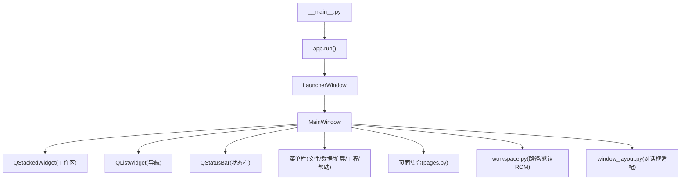
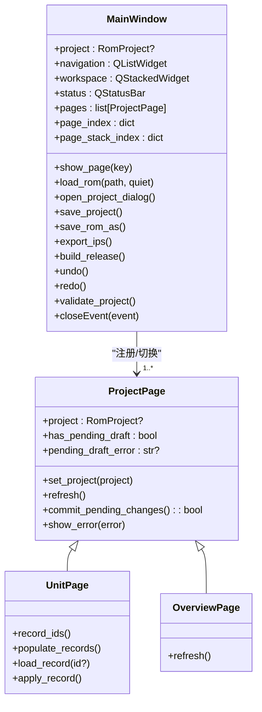
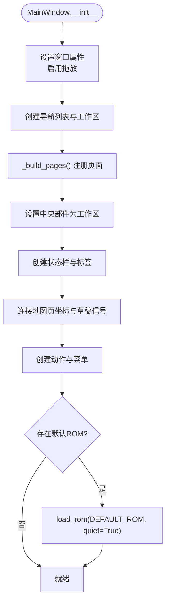
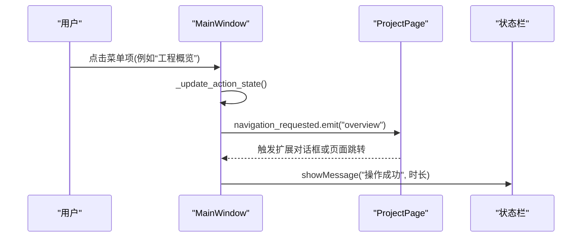
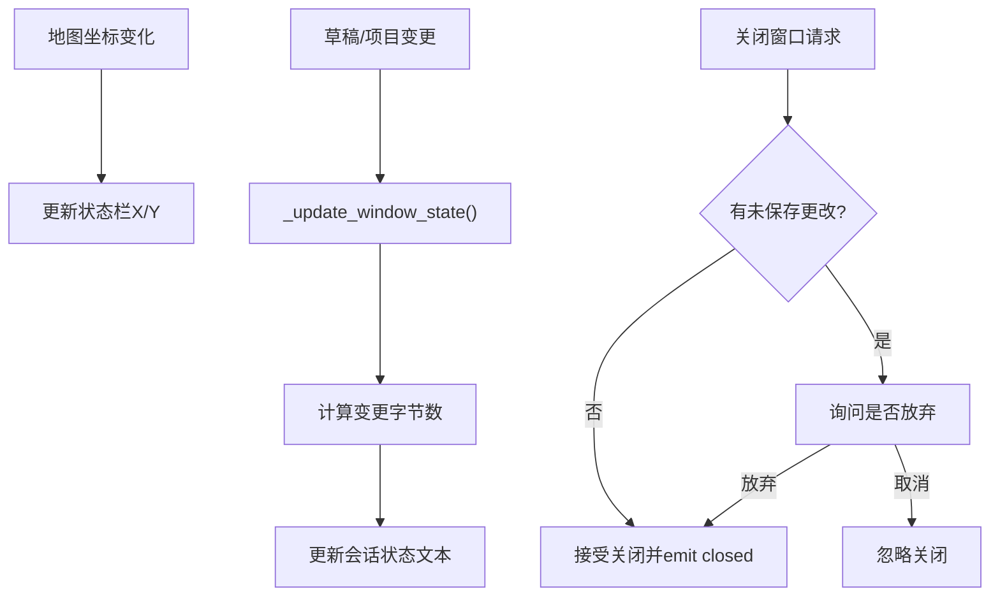
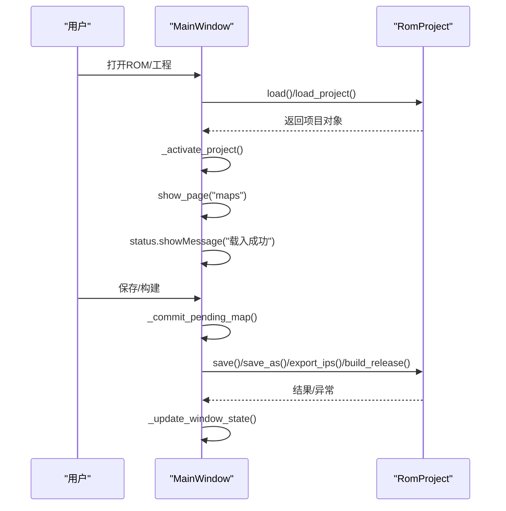
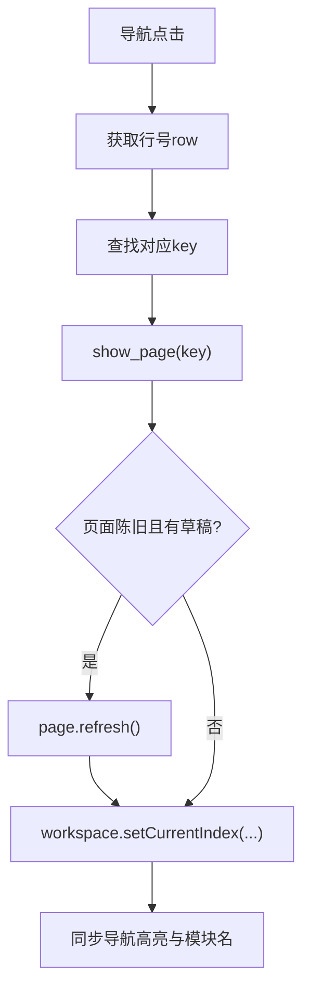
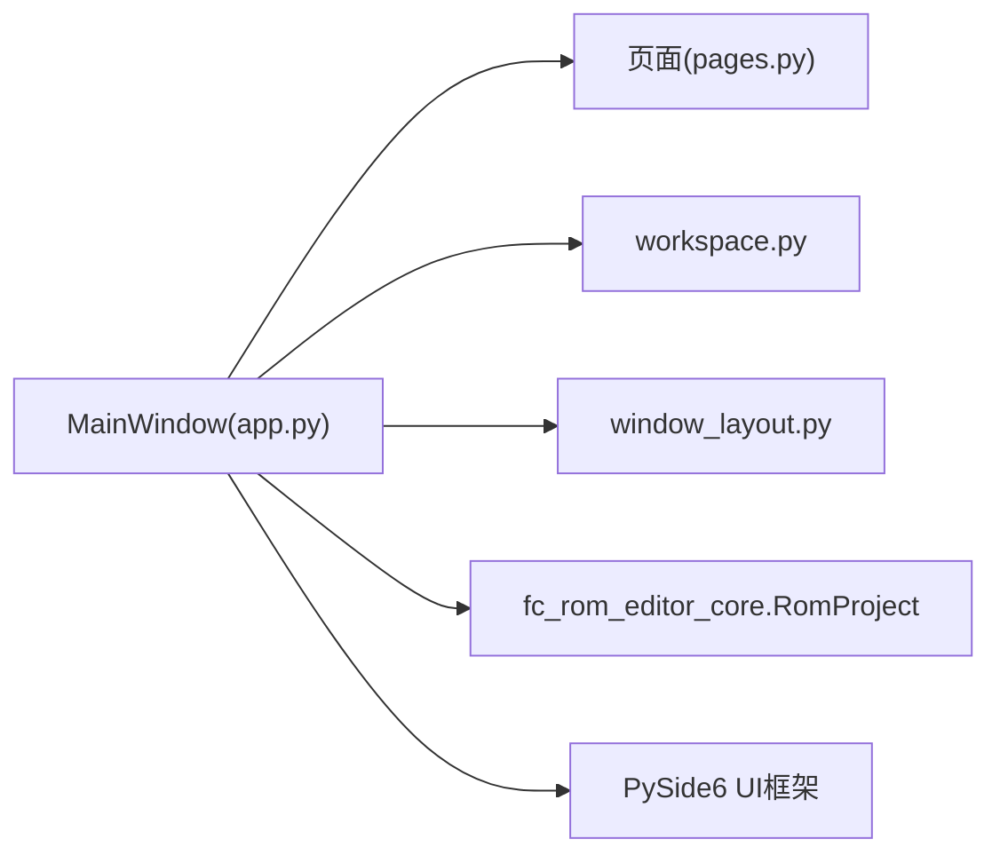

# 主窗口架构

<cite>
**本文引用的文件**
- [app.py](file://src/dc_modifier/app.py)
- [pages.py](file://src/dc_modifier/pages.py)
- [workspace.py](file://src/dc_modifier/workspace.py)
- [window_layout.py](file://src/dc_modifier/window_layout.py)
- [__main__.py](file://src/dc_modifier/__main__.py)
</cite>

## 目录
1. [简介](#简介)
2. [项目结构](#项目结构)
3. [核心组件](#核心组件)
4. [架构总览](#架构总览)
5. [详细组件分析](#详细组件分析)
6. [依赖关系分析](#依赖关系分析)
7. [性能考虑](#性能考虑)
8. [故障排查指南](#故障排查指南)
9. [结论](#结论)
10. [附录：创建、配置与扩展示例](#附录创建配置与扩展示例)

## 简介
本文件为DC修改器主窗口的架构文档，聚焦于MainWindow类的设计模式与实现细节。内容涵盖窗口初始化、菜单系统、状态栏管理、事件处理机制；主窗口生命周期（ROM加载、项目激活、会话状态维护）；工作区布局（QStackedWidget页面切换与导航）；以及响应式设计与用户体验优化、错误处理和用户反馈机制。同时提供代码级图示与“代码片段路径”以便快速定位实现位置。

## 项目结构
- 入口与启动流程
  - __main__.py：程序入口，调用app.run()启动应用。
  - app.py：定义LauncherWindow、MainWindow、样式表、动作与菜单、页面注册、拖放与保存构建等核心逻辑。
  - pages.py：定义ProjectPage基类及多个具体页面（如UnitPage、OverviewPage等），统一编辑表单与草稿提交机制。
  - workspace.py：工作区根路径、默认ROM路径、输出路径保护策略。
  - window_layout.py：对话框自适应屏幕尺寸与滚动包裹，提升小屏/高DPI体验。

**图表来源**
- [__main__.py:1-6](file://src/dc_modifier/__main__.py#L1-L6)
- [app.py:236-273](file://src/dc_modifier/app.py#L236-L273)
- [app.py:276-341](file://src/dc_modifier/app.py#L276-L341)
- [workspace.py:7-26](file://src/dc_modifier/workspace.py#L7-L26)
- [window_layout.py:5-25](file://src/dc_modifier/window_layout.py#L5-L25)

**章节来源**
- [__main__.py:1-6](file://src/dc_modifier/__main__.py#L1-L6)
- [app.py:236-341](file://src/dc_modifier/app.py#L236-L341)
- [workspace.py:7-26](file://src/dc_modifier/workspace.py#L7-L26)
- [window_layout.py:5-25](file://src/dc_modifier/window_layout.py#L5-L25)

## 核心组件
- LauncherWindow：启动前展示界面，点击后创建并显示MainWindow，隐藏自身。
- MainWindow：主窗口容器，负责：
  - 初始化：设置标题、尺寸、最小尺寸、接受拖放、创建导航列表与工作区堆栈。
  - 页面注册：将各功能页加入QStackedWidget，建立key到索引的映射。
  - 状态栏：会话状态、坐标、路径、模块名、变更字节数等。
  - 菜单与动作：文件、数据、扩展、工程、帮助五大菜单，绑定快捷键与槽函数。
  - 生命周期：打开ROM/工程、激活项目、保存工程/ROM、导出IPS、一键构建、撤销/重做、校验。
  - 事件：地图坐标变化、草稿提交、未保存变更确认、关闭事件。
- ProjectPage及其子类：统一的页面基类，提供set_project、refresh、has_pending_draft、commit_pending_changes等接口，确保表单草稿在切换或保存时安全提交。
- workspace：提供ROOT、DEFAULT_ROM、默认导出路径与writable_output_path保护策略，防止覆盖参考目录。
- window_layout：对话框自适应屏幕，必要时用滚动区域包裹，保证控件可见。

**章节来源**
- [app.py:236-341](file://src/dc_modifier/app.py#L236-L341)
- [app.py:342-489](file://src/dc_modifier/app.py#L342-L489)
- [app.py:490-815](file://src/dc_modifier/app.py#L490-L815)
- [app.py:816-1153](file://src/dc_modifier/app.py#L816-L1153)
- [pages.py:103-152](file://src/dc_modifier/pages.py#L103-L152)
- [workspace.py:7-43](file://src/dc_modifier/workspace.py#L7-L43)
- [window_layout.py:5-25](file://src/dc_modifier/window_layout.py#L5-L25)

## 架构总览
主窗口采用“容器+页面”的分层架构：
- 容器（MainWindow）负责全局状态、菜单、导航、状态栏、生命周期与跨页面协调。
- 页面（ProjectPage及其子类）封装各自业务UI与数据交互，通过信号与主窗口通信。
- 工作区使用QStackedWidget承载页面，配合QListWidget作为导航，实现页面切换与同步高亮。
- 工具对话框通过TransactionalProjectDialog包装，支持事务性编辑与统一确认/取消流程。

**图表来源**
- [app.py:276-341](file://src/dc_modifier/app.py#L276-L341)
- [app.py:342-489](file://src/dc_modifier/app.py#L342-L489)
- [pages.py:103-152](file://src/dc_modifier/pages.py#L103-L152)
- [pages.py:514-800](file://src/dc_modifier/pages.py#L514-L800)

## 详细组件分析

### 主窗口初始化与布局
- 窗口属性：标题、尺寸、最小尺寸、接受拖放。
- 导航与工作区：QListWidget用于侧边导航（隐藏但用于状态同步），QStackedWidget承载页面，初始显示空白页。
- 状态栏：会话状态、X/Y坐标、路径、模块名、变更字节数等标签，部分兼容标签隐藏。
- 页面注册：_build_pages集中注册所有功能页，建立key到索引映射，并将页面加入工作区。
- 默认行为：若存在默认ROM则静默加载。

**图表来源**
- [app.py:276-341](file://src/dc_modifier/app.py#L276-L341)

**章节来源**
- [app.py:276-341](file://src/dc_modifier/app.py#L276-L341)

### 菜单系统与动作绑定
- 文件菜单：打开ROM、保存ROM、退出。
- 数据菜单：数据库、完整ROM数据读取、文字库、地图动画、文字转换、剧情事件、导出机体/头像、属性计算器、存档修改器、其他设置。
- 扩展功能菜单：音乐、导入与图像、容量规划、工程概览、变更与验证。
- 工程菜单：打开/保存工程、另存为、ROM另存为、导出IPS、一键构建、撤销/重做、完整检查。
- 帮助菜单：关于与安全说明。
- 动作状态：根据是否已加载项目动态启用/禁用相关动作。

**图表来源**
- [app.py:399-489](file://src/dc_modifier/app.py#L399-L489)
- [app.py:1057-1092](file://src/dc_modifier/app.py#L1057-L1092)

**章节来源**
- [app.py:399-489](file://src/dc_modifier/app.py#L399-L489)
- [app.py:1057-1092](file://src/dc_modifier/app.py#L1057-L1092)

### 状态栏管理与事件处理
- 坐标更新：地图页坐标变化信号驱动状态栏X/Y坐标更新。
- 草稿与变更：地图草稿、项目变更信号触发窗口状态更新，计算变更字节数。
- 未保存变更：has_unsaved_changes综合项目工作区快照、资源分配快照与地图草稿判断。
- 关闭保护：closeEvent中先确认丢弃未保存更改，再关闭窗口并发送closed信号。

**图表来源**
- [app.py:490-510](file://src/dc_modifier/app.py#L490-L510)
- [app.py:731-754](file://src/dc_modifier/app.py#L731-L754)
- [app.py:1093-1115](file://src/dc_modifier/app.py#L1093-L1115)
- [app.py:1147-1153](file://src/dc_modifier/app.py#L1147-L1153)

**章节来源**
- [app.py:490-510](file://src/dc_modifier/app.py#L490-L510)
- [app.py:731-754](file://src/dc_modifier/app.py#L731-L754)
- [app.py:1093-1115](file://src/dc_modifier/app.py#L1093-L1115)
- [app.py:1147-1153](file://src/dc_modifier/app.py#L1147-L1153)

### 生命周期管理：ROM加载、项目激活与会话状态
- ROM加载：load_rom执行RomProject.load，校验基准哈希与自动容量布局，成功后进入_activate_project。
- 项目激活：_activate_project设置只读输出根、保存快照、刷新页面、切换到地图页，并在特定ROM布局下提示后续步骤。
- 工程加载：open_project_dialog加载工程，必要时选择基准ROM，成功后激活并提示。
- 保存与构建：save_project/save_rom/save_rom_as/export_ips/build_release均会先尝试提交地图草稿，再进行持久化或构建。
- 撤销/重做：undo/redo调用项目能力，刷新页面并通知状态。

**图表来源**
- [app.py:794-815](file://src/dc_modifier/app.py#L794-L815)
- [app.py:827-849](file://src/dc_modifier/app.py#L827-L849)
- [app.py:850-989](file://src/dc_modifier/app.py#L850-L989)
- [app.py:991-1026](file://src/dc_modifier/app.py#L991-L1026)

**章节来源**
- [app.py:794-815](file://src/dc_modifier/app.py#L794-L815)
- [app.py:827-849](file://src/dc_modifier/app.py#L827-L849)
- [app.py:850-989](file://src/dc_modifier/app.py#L850-L989)
- [app.py:991-1026](file://src/dc_modifier/app.py#L991-L1026)

### 工作区布局与导航系统
- QStackedWidget：承载所有页面，当前页面通过setCurrentIndex切换。
- QListWidget：隐藏导航列表，记录当前行以同步状态栏模块名。
- 页面切换：show_page(key)根据key获取页面，若页面标记为陈旧且无草稿则刷新，然后切换工作区并同步导航高亮。
- 扩展页面：对于不在主工作区的页面（如音乐、容量规划等），通过_create_extension_dialog创建事务性对话框，支持内部导航与确认后回到主窗口。

**图表来源**
- [app.py:342-385](file://src/dc_modifier/app.py#L342-L385)
- [app.py:583-653](file://src/dc_modifier/app.py#L583-L653)

**章节来源**
- [app.py:342-385](file://src/dc_modifier/app.py#L342-L385)
- [app.py:583-653](file://src/dc_modifier/app.py#L583-L653)

### 响应式设计与用户体验优化
- 样式表：统一背景、菜单、标签、按钮、输入框风格，增强可读性与一致性。
- 自定义样式：VisibleArrowStyle提高数值控件箭头对比度，改善可访问性。
- 对话框适配：fit_dialog_to_screen在小屏/高DPI环境下自动包裹滚动区域，避免控件不可见。
- 拖放支持：允许拖入.nes/.dcmod/.json文件直接打开ROM或工程。
- 即时反馈：状态栏消息、未保存变更提示、错误弹窗、构建结果信息。

**章节来源**
- [app.py:66-127](file://src/dc_modifier/app.py#L66-L127)
- [app.py:128-233](file://src/dc_modifier/app.py#L128-L233)
- [window_layout.py:5-25](file://src/dc_modifier/window_layout.py#L5-L25)
- [app.py:1128-1146](file://src/dc_modifier/app.py#L1128-L1146)

### 错误处理与用户反馈机制
- 打开ROM失败：弹出错误提示，不中断应用。
- 工程打开失败：提示无法打开工程。
- 保存/构建失败：捕获异常并提示。
- 地图草稿无效：阻止保存/构建，提示具体错误。
- 覆盖保护：禁止覆盖基准ROM与references目录。
- 未保存变更：关闭或切换前提示，避免误丢改动。

**章节来源**
- [app.py:794-815](file://src/dc_modifier/app.py#L794-L815)
- [app.py:827-849](file://src/dc_modifier/app.py#L827-L849)
- [app.py:850-989](file://src/dc_modifier/app.py#L850-L989)
- [app.py:894-913](file://src/dc_modifier/app.py#L894-L913)
- [workspace.py:37-43](file://src/dc_modifier/workspace.py#L37-L43)
- [app.py:731-754](file://src/dc_modifier/app.py#L731-L754)

## 依赖关系分析
- MainWindow依赖：
  - PySide6 UI组件：QMainWindow、QStackedWidget、QListWidget、QStatusBar、QAction、QFileDialog、QMessageBox等。
  - 页面模块：pages.py中的各类页面（MapPage、UnitPage、CharacterPage、WeaponPage、StoryPage、EventPage、PersuasionPage、MusicPage、OverviewPage、ResourcePage、ChangesPage）。
  - 工作区路径：workspace.py提供默认ROM与输出路径保护。
  - 对话框适配：window_layout.py用于工具对话框的屏幕适配。
  - 核心项目：fc_rom_editor_core.RomProject用于ROM/工程加载、保存、构建、撤销/重做、校验等。

**图表来源**
- [app.py:33-58](file://src/dc_modifier/app.py#L33-L58)
- [app.py:342-365](file://src/dc_modifier/app.py#L342-L365)
- [workspace.py:7-43](file://src/dc_modifier/workspace.py#L7-L43)
- [window_layout.py:5-25](file://src/dc_modifier/window_layout.py#L5-L25)

**章节来源**
- [app.py:33-58](file://src/dc_modifier/app.py#L33-L58)
- [app.py:342-365](file://src/dc_modifier/app.py#L342-L365)
- [workspace.py:7-43](file://src/dc_modifier/workspace.py#L7-L43)
- [window_layout.py:5-25](file://src/dc_modifier/window_layout.py#L5-L25)

## 性能考虑
- 延迟刷新：非当前页面的刷新推迟到下次访问，减少频繁重建导致的卡顿。
- 计数快照：变更字节数计算使用工作区快照比较，避免重复枚举。
- 列表批量更新：记录列表填充时阻塞信号与更新，减少重绘开销。
- 对话框自适应：避免大固定尺寸导致不可见控件，改用滚动区域提升可用性。

**章节来源**
- [app.py:1042-1056](file://src/dc_modifier/app.py#L1042-L1056)
- [app.py:1106-1115](file://src/dc_modifier/app.py#L1106-L1115)
- [pages.py:396-438](file://src/dc_modifier/pages.py#L396-L438)
- [window_layout.py:5-25](file://src/dc_modifier/window_layout.py#L5-L25)

## 故障排查指南
- 无法打开ROM：检查ROM是否为受支持的基准哈希；查看错误提示详情。
- 工程无法打开：确认工程文件与基准ROM匹配；必要时重新选择基准ROM。
- 保存失败：检查目标路径是否可写；避免写入references目录；确认磁盘空间。
- 构建失败：检查输出目录权限与名称；查看构建报告与异常信息。
- 地图草稿无法提交：修正地图、部署或事件输入错误后再试。
- 覆盖保护：不要覆盖基准ROM或references目录，使用“另存为”输出新文件。

**章节来源**
- [app.py:794-815](file://src/dc_modifier/app.py#L794-L815)
- [app.py:827-849](file://src/dc_modifier/app.py#L827-L849)
- [app.py:850-989](file://src/dc_modifier/app.py#L850-L989)
- [workspace.py:37-43](file://src/dc_modifier/workspace.py#L37-L43)

## 结论
MainWindow通过清晰的职责划分与模块化设计，实现了ROM/工程的全生命周期管理、多页面工作区与丰富的扩展功能。借助ProjectPage的统一接口，页面间解耦且易于扩展；结合状态栏、菜单与对话框适配，提供了良好的用户体验与健壮的错误处理。整体架构兼顾了可维护性与可扩展性，适合持续迭代与功能增强。

## 附录：创建、配置与扩展示例
以下示例以“代码片段路径”形式给出，便于快速定位实现位置：
- 创建主窗口实例
  - 入口与运行：[__main__.py:1-6](file://src/dc_modifier/__main__.py#L1-L6)
  - 应用启动与样式：[app.py:1155-1183](file://src/dc_modifier/app.py#L1155-L1183)
  - 主窗口构造与默认加载：[app.py:276-341](file://src/dc_modifier/app.py#L276-L341)
- 配置菜单与动作
  - 动作创建与快捷键：[app.py:399-441](file://src/dc_modifier/app.py#L399-L441)
  - 菜单组装：[app.py:443-489](file://src/dc_modifier/app.py#L443-L489)
- 页面注册与工作区切换
  - 页面注册：[app.py:342-365](file://src/dc_modifier/app.py#L342-L365)
  - 页面切换逻辑：[app.py:366-385](file://src/dc_modifier/app.py#L366-L385)
- 扩展功能对话框
  - 扩展对话框创建：[app.py:583-653](file://src/dc_modifier/app.py#L583-L653)
  - 对话框屏幕适配：[window_layout.py:5-25](file://src/dc_modifier/window_layout.py#L5-L25)
- 生命周期与保存构建
  - 打开ROM/工程：[app.py:794-849](file://src/dc_modifier/app.py#L794-L849)
  - 保存工程/ROM/导出IPS/构建：[app.py:850-989](file://src/dc_modifier/app.py#L850-L989)
  - 撤销/重做：[app.py:991-1026](file://src/dc_modifier/app.py#L991-L1026)
- 路径与输出保护
  - 默认ROM与输出路径：[workspace.py:7-43](file://src/dc_modifier/workspace.py#L7-L43)