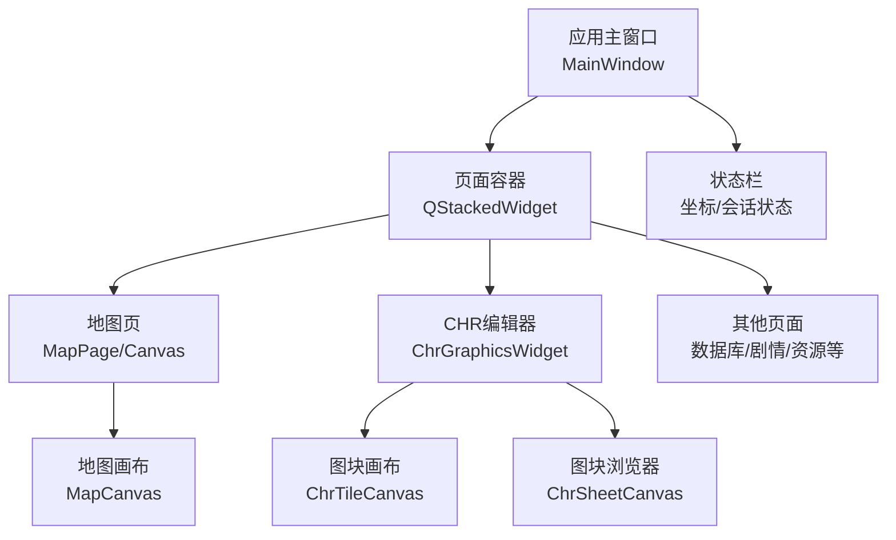
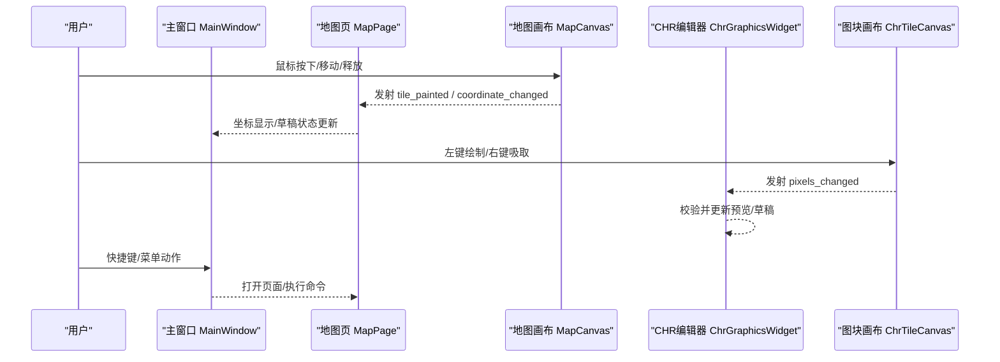
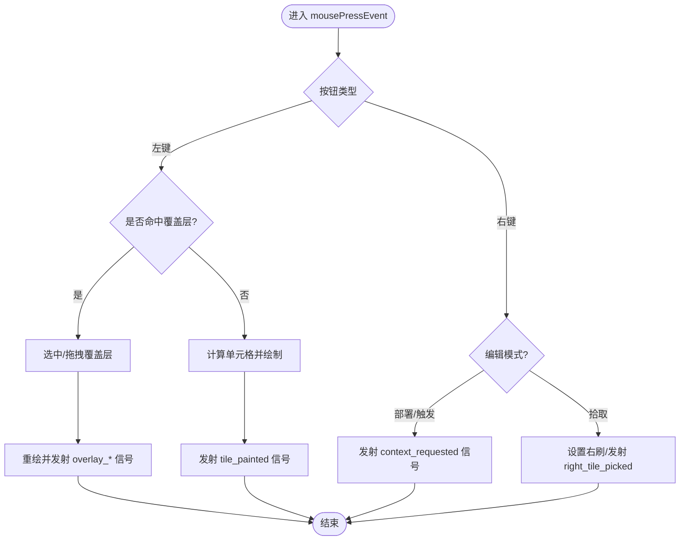
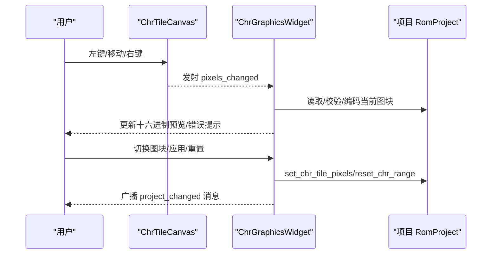
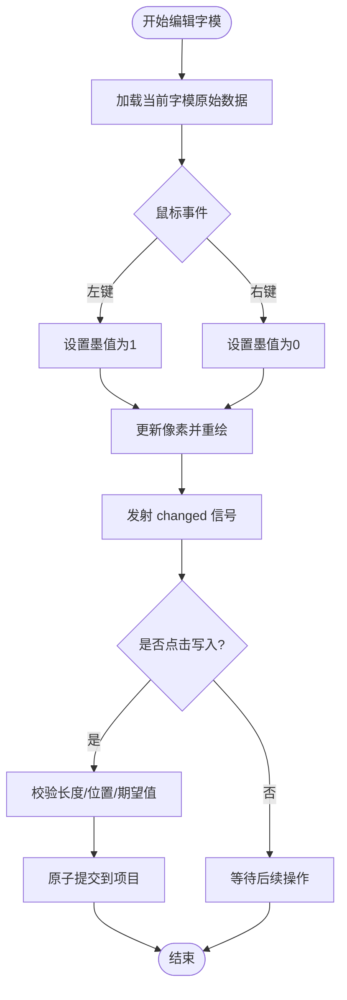
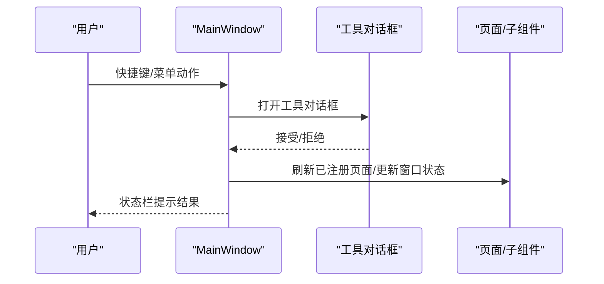
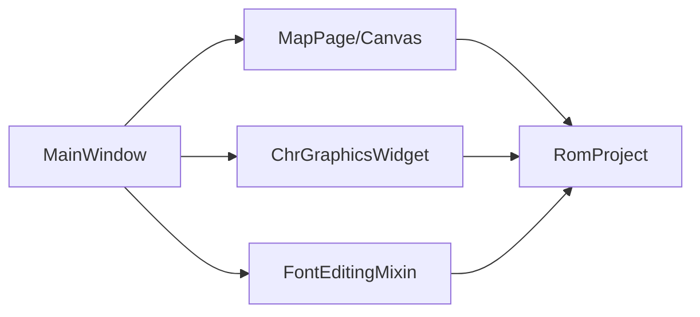

# 事件处理机制

<cite>
**本文引用的文件**
- [app.py](file://src/dc_modifier/app.py)
- [chr_widget.py](file://src/dc_modifier/chr_widget.py)
- [map_page.py](file://src/dc_modifier/map_page.py)
- [font_edit.py](file://src/dc_modifier/font_edit.py)
</cite>

## 目录
1. [简介](#简介)
2. [项目结构](#项目结构)
3. [核心组件](#核心组件)
4. [架构总览](#架构总览)
5. [详细组件分析](#详细组件分析)
6. [依赖关系分析](#依赖关系分析)
7. [性能考虑](#性能考虑)
8. [故障排查指南](#故障排查指南)
9. [结论](#结论)
10. [附录](#附录)

## 简介
本技术文档聚焦于DC修改器的事件处理机制，围绕PySide6的信号槽体系，系统阐述自定义信号定义、事件传播路径与处理器注册方式；深入说明用户输入捕获（鼠标点击、拖拽、移动）、键盘快捷键与菜单动作的绑定模式；解释事件冒泡、事件过滤与优先级管理策略；并通过复杂交互场景展示异步事件处理、性能优化与调试技巧。

## 项目结构
DC修改器的UI与事件处理主要分布在以下模块：
- 应用主窗口与全局动作/快捷键：app.py
- 地图编辑画布与覆盖层交互：map_page.py
- CHR图块编辑与像素级绘制：chr_widget.py
- 字体字模编辑与点阵写入：font_edit.py

图表来源
- [app.py:276-365](file://src/dc_modifier/app.py#L276-L365)
- [map_page.py:595-800](file://src/dc_modifier/map_page.py#L595-L800)
- [chr_widget.py:33-160](file://src/dc_modifier/chr_widget.py#L33-L160)

章节来源
- [app.py:276-365](file://src/dc_modifier/app.py#L276-L365)

## 核心组件
- 应用主窗口（MainWindow）
  - 负责创建菜单、动作、快捷键，统一调度页面与工具对话框。
  - 通过信号连接将子组件的状态变化反馈到主窗口（如坐标更新、草稿变更）。
- 地图画布（MapCanvas）
  - 封装地图渲染与交互，发射“已绘制”“拾取”“坐标变化”“覆盖层操作”等信号。
  - 支持左键绘制、右键拾取、Shift+右键切换右刷、拖拽覆盖层、上下文菜单触发。
- CHR编辑器（ChrGraphicsWidget + ChrTileCanvas + ChrSheetCanvas）
  - 提供8x8图块的像素级编辑与批量导入导出。
  - 使用自定义信号通知像素变化、图块选择变化，驱动预览与提交逻辑。
- 字体编辑（GlyphCanvas + FontEditingMixin）
  - 提供12x12字模的点阵编辑、暂存与原子提交，避免并发冲突。

章节来源
- [app.py:399-488](file://src/dc_modifier/app.py#L399-L488)
- [map_page.py:595-800](file://src/dc_modifier/map_page.py#L595-L800)
- [chr_widget.py:33-160](file://src/dc_modifier/chr_widget.py#L33-L160)
- [font_edit.py:14-110](file://src/dc_modifier/font_edit.py#L14-L110)

## 架构总览
下图展示了从用户输入到业务处理的完整事件流：

图表来源
- [map_page.py:595-800](file://src/dc_modifier/map_page.py#L595-L800)
- [chr_widget.py:33-160](file://src/dc_modifier/chr_widget.py#L33-L160)
- [app.py:399-488](file://src/dc_modifier/app.py#L399-L488)

## 详细组件分析

### 地图画布事件模型（MapCanvas）
- 自定义信号
  - 绘制完成：tile_painted(x, y, tile)
  - 拾取图块：tile_picked(tile)、right_tile_picked(tile)
  - 坐标变化：coordinate_changed(x, y)
  - 覆盖层操作：overlay_moved、overlay_selected、overlay_activated
  - 上下文请求：deployment_context_requested、trigger_context_requested
- 事件处理要点
  - 左键：若命中覆盖层则选中/拖拽；否则按当前画笔绘制。
  - 右键：根据编辑模式弹出部署/触发上下文菜单；否则拾取右刷或配合Shift拾取右色。
  - 坐标变化：实时上报至主窗口状态栏。
  - 绘制区域：仅对有效单元格生效，局部刷新提升性能。

图表来源
- [map_page.py:765-800](file://src/dc_modifier/map_page.py#L765-L800)

章节来源
- [map_page.py:595-800](file://src/dc_modifier/map_page.py#L595-L800)

### CHR图块编辑事件模型（ChrGraphicsWidget / ChrTileCanvas / ChrSheetCanvas）
- 自定义信号
  - 像素变化：pixels_changed
  - 图块选择：tile_selected
- 事件处理要点
  - 左键绘制：将目标像素索引写入缓冲区，发射变化信号，局部重绘。
  - 右键吸取：以点击处像素作为当前笔触颜色。
  - 拖动绘制：按住左键移动时持续绘制。
  - 图块浏览器：点击网格选择对应图块，联动放大编辑区。
  - 数据一致性：切换图块前自动提交草稿并校验编码，失败回滚选择。

图表来源
- [chr_widget.py:33-160](file://src/dc_modifier/chr_widget.py#L33-L160)
- [chr_widget.py:162-459](file://src/dc_modifier/chr_widget.py#L162-L459)

章节来源
- [chr_widget.py:33-160](file://src/dc_modifier/chr_widget.py#L33-L160)
- [chr_widget.py:162-459](file://src/dc_modifier/chr_widget.py#L162-L459)

### 字体字模编辑事件模型（GlyphCanvas / FontEditingMixin）
- 自定义信号
  - 字模变化：changed
- 事件处理要点
  - 左键画点、右键擦除，拖动连续绘制。
  - 暂存机制：仅在确认提交时写入工程，取消时丢弃。
  - 并发保护：记录期望值，提交前校验未被其他编辑覆盖。
  - 批量操作：导入/导出整页点阵，确保长度与格式正确。

图表来源
- [font_edit.py:14-110](file://src/dc_modifier/font_edit.py#L14-L110)
- [font_edit.py:163-273](file://src/dc_modifier/font_edit.py#L163-L273)

章节来源
- [font_edit.py:14-110](file://src/dc_modifier/font_edit.py#L14-L110)
- [font_edit.py:163-273](file://src/dc_modifier/font_edit.py#L163-L273)

### 主窗口动作与快捷键（MainWindow）
- 动作与快捷键
  - 文件：打开/保存/退出（Ctrl+O/S/X）
  - 数据：数据库/ROM数据浏览/文字库/地图动画/文字转换/剧情事件/导出机体/头像/属性计算器/存档修改器/其他设置
  - 工程：打开/保存工程/另存为/导出IPS/一键构建/撤销/重做/完整检查
- 事件传播
  - 菜单项触发后调用对应方法，必要时打开工具对话框或扩展页面。
  - 通过信号连接将子组件状态变化同步到主窗口（如坐标、草稿状态）。

图表来源
- [app.py:399-488](file://src/dc_modifier/app.py#L399-L488)
- [app.py:494-540](file://src/dc_modifier/app.py#L494-L540)

章节来源
- [app.py:399-488](file://src/dc_modifier/app.py#L399-L488)
- [app.py:494-540](file://src/dc_modifier/app.py#L494-L540)

## 依赖关系分析
- 组件耦合
  - 主窗口依赖各页面与工具对话框，通过信号解耦状态更新。
  - 地图画布与CHR编辑器各自维护独立的数据视图与交互状态，通过信号向父组件汇报。
- 外部依赖
  - PySide6信号槽用于事件分发与回调。
  - 项目对象RomProject提供数据读写能力，保证数据一致性与可撤销性。
- 潜在循环依赖
  - 通过延迟导入（在方法内import）避免启动时循环依赖，例如工具对话框按需引入。

图表来源
- [app.py:276-365](file://src/dc_modifier/app.py#L276-L365)
- [map_page.py:595-800](file://src/dc_modifier/map_page.py#L595-L800)
- [chr_widget.py:162-459](file://src/dc_modifier/chr_widget.py#L162-L459)
- [font_edit.py:163-273](file://src/dc_modifier/font_edit.py#L163-L273)

章节来源
- [app.py:276-365](file://src/dc_modifier/app.py#L276-L365)

## 性能考虑
- 局部重绘
  - 地图与CHR画布在绘制完成后仅重绘受影响矩形，减少全屏刷新开销。
- 关闭抗锯齿
  - 像素级绘制关闭抗锯齿以提升渲染速度。
- 批量操作
  - CHR范围导入/导出与字体整页导入/导出，减少多次I/O与校验。
- 状态快照
  - 主窗口维护未保存变更快照，避免频繁比较全量数据。
- 延迟导入
  - 工具对话框按需导入，降低启动时间与内存占用。

[本节为通用指导，不直接分析具体文件]

## 故障排查指南
- 常见问题定位
  - 地图绘制无效：检查paint_enabled标志与单元格边界判断。
  - 右键行为异常：确认编辑模式（部署/触发）与Shift组合键逻辑。
  - CHR切换失败：查看pending_draft_error与commit_pending_changes返回值。
  - 字体提交失败：核对期望值与实际值是否一致，避免并发覆盖。
- 调试技巧
  - 利用状态栏与提示信息观察事件传播与中间状态。
  - 在关键信号发射前后添加日志，追踪调用链。
  - 使用最小复现步骤隔离问题组件（如单独打开CHR编辑器）。

章节来源
- [map_page.py:765-800](file://src/dc_modifier/map_page.py#L765-L800)
- [chr_widget.py:373-459](file://src/dc_modifier/chr_widget.py#L373-L459)
- [font_edit.py:163-273](file://src/dc_modifier/font_edit.py#L163-L273)

## 结论
DC修改器基于PySide6的信号槽机制构建了清晰、可扩展的事件处理体系：通过自定义信号实现组件间松耦合通信，结合主窗口的动作与快捷键统一管理用户输入；地图与CHR编辑器采用像素级绘制与局部刷新保障交互流畅；字体编辑通过暂存与原子提交确保数据一致性。整体设计兼顾了易用性、性能与可维护性，适合进一步扩展更多复杂交互场景。

[本节为总结性内容，不直接分析具体文件]

## 附录
- 事件优先级建议
  - 覆盖层交互优先于地图绘制，避免误操作。
  - 右键上下文菜单优先于拾取，便于快速配置。
- 异步处理建议
  - 大文件导入/导出建议在后台线程执行，完成后通过信号通知UI更新。
- 最佳实践
  - 所有可能影响数据的操作均应提供撤销/还原能力。
  - 对用户可见的错误进行友好提示，并提供重试入口。

[本节为通用指导，不直接分析具体文件]