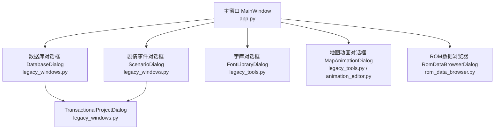
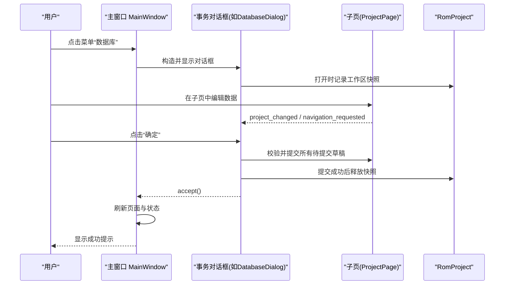
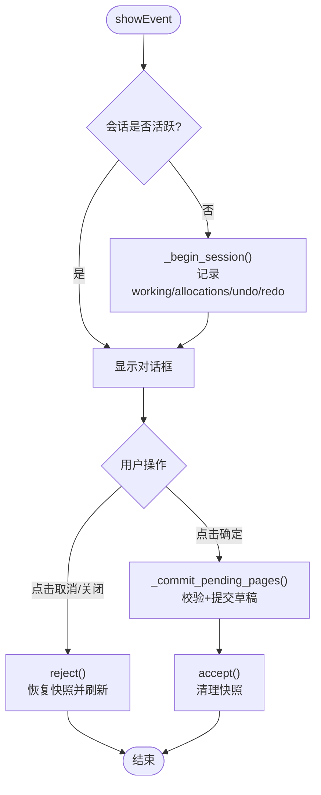
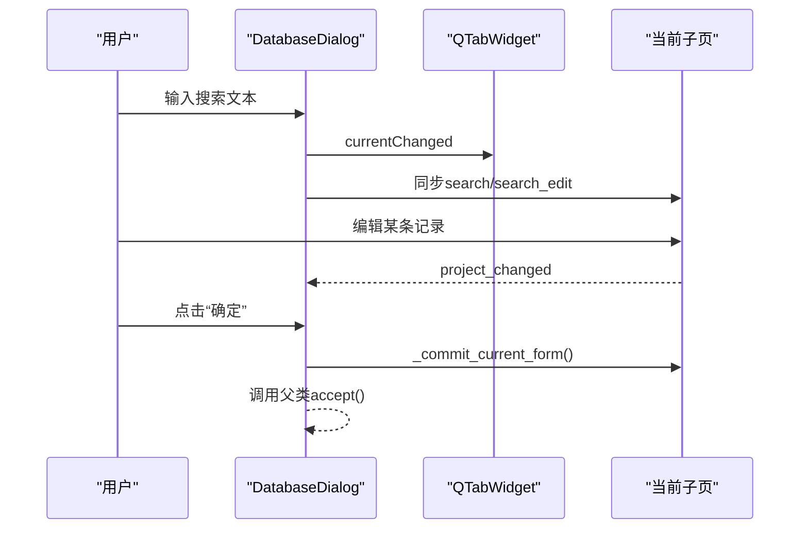
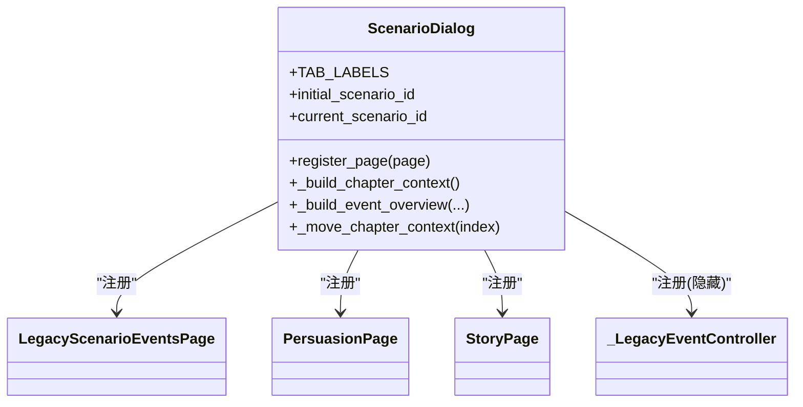
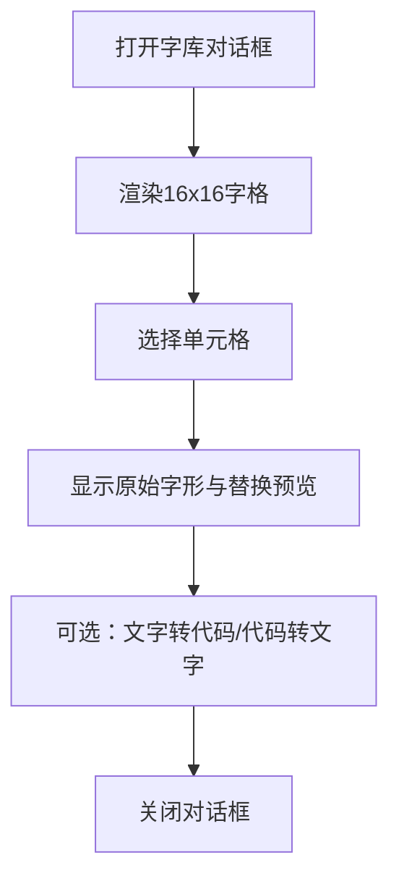
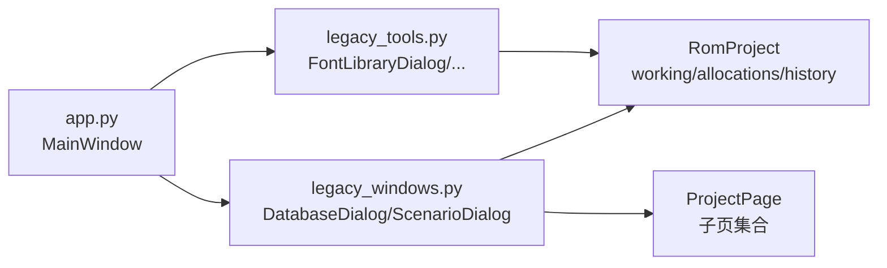

# 对话框系统

<cite>
**本文引用的文件**
- [legacy_windows.py](file://src/dc_modifier/legacy_windows.py)
- [legacy_tools.py](file://src/dc_modifier/legacy_tools.py)
- [app.py](file://src/dc_modifier/app.py)
- [animation_editor.py](file://src/dc_modifier/animation_editor.py)
- [rom_data_browser.py](file://src/dc_modifier/rom_data_browser.py)
- [unit_appearance_dialog.py](file://src/dc_modifier/unit_appearance_dialog.py)
- [map_page.py](file://src/dc_modifier/map_page.py)
</cite>

## 目录
1. [简介](#简介)
2. [项目结构](#项目结构)
3. [核心组件](#核心组件)
4. [架构总览](#架构总览)
5. [详细组件分析](#详细组件分析)
6. [依赖关系分析](#依赖关系分析)
7. [性能与交互特性](#性能与交互特性)
8. [故障排查指南](#故障排查指南)
9. [结论](#结论)
10. [附录：自定义对话框开发指南](#附录自定义对话框开发指南)

## 简介
本设计文档围绕 DC 修改器的对话框系统，重点解释事务型编辑窗口的设计理念与实现模式。核心目标是：
- 以“整窗会话”为单位进行事务包装，支持取消时完整回滚（包括工作区 ROM、资源分配器与撤销/重做栈）。
- 为多页编辑器提供统一的暂存、冲突检测、提交与撤销语义。
- 明确各类专用对话框的职责边界与交互流程，如数据库、剧情事件、字库、地图动画等。
- 说明对话框与主窗口的通信机制、数据传递方式与状态同步策略。
- 给出扩展新对话框的集成模式与最佳实践，涵盖模态行为、用户体验优化与错误处理。

## 项目结构
对话框系统主要分布在以下模块：
- 事务型基类与通用对话框容器：legacy_windows.py
- 工具型对话框（只读或独立生命周期）：legacy_tools.py
- 主窗口与菜单入口：app.py
- 辅助对话框与页面：animation_editor.py、rom_data_browser.py、unit_appearance_dialog.py、map_page.py 等

**图表来源**
- [app.py:494-581](file://src/dc_modifier/app.py#L494-L581)
- [legacy_windows.py:71-259](file://src/dc_modifier/legacy_windows.py#L71-L259)
- [legacy_windows.py:1587-1790](file://src/dc_modifier/legacy_windows.py#L1587-L1790)
- [legacy_windows.py:1793-1888](file://src/dc_modifier/legacy_windows.py#L1793-L1888)
- [legacy_tools.py:109-227](file://src/dc_modifier/legacy_tools.py#L109-L227)
- [legacy_tools.py:300-301](file://src/dc_modifier/legacy_tools.py#L300-L301)
- [rom_data_browser.py:492](file://src/dc_modifier/rom_data_browser.py#L492)

**章节来源**
- [app.py:276-600](file://src/dc_modifier/app.py#L276-L600)
- [legacy_windows.py:71-259](file://src/dc_modifier/legacy_windows.py#L71-L259)
- [legacy_tools.py:109-227](file://src/dc_modifier/legacy_tools.py#L109-L227)

## 核心组件
- TransactionalProjectDialog：事务型编辑窗口基类，封装“打开即快照、关闭可回滚”的整窗会话语义；统一注册子页、冲突检测、草稿提交流程与导航信号转发。
- DatabaseDialog：六标签数据库窗口，组合多个 ProjectPage，提供跨页搜索、选择联动与底部确认/取消。
- ScenarioDialog：剧情事件窗口，将多种事件编辑页（行动事件、劝降、地图事件、剧情对话、胜利文字）整合为多标签视图，并维护关卡上下文。
- FontLibraryDialog：字库浏览与预览对话框，基于已验证的 DC Token 映射展示字形，当前写入能力受限。
- MapAnimationDialog：地图动画编辑对话框，复用 animation_editor 中的实现。
- 其他工具对话框：TextConverterDialog、AttributeCalculatorDialog、SaveEditorDialog、OtherSettingsDialog 等，多为只读或独立生命周期工具。

**章节来源**
- [legacy_windows.py:71-259](file://src/dc_modifier/legacy_windows.py#L71-L259)
- [legacy_windows.py:1587-1790](file://src/dc_modifier/legacy_windows.py#L1587-L1790)
- [legacy_windows.py:1793-1888](file://src/dc_modifier/legacy_windows.py#L1793-L1888)
- [legacy_tools.py:109-227](file://src/dc_modifier/legacy_tools.py#L109-L227)
- [legacy_tools.py:300-301](file://src/dc_modifier/legacy_tools.py#L300-L301)
- [legacy_tools.py:304-385](file://src/dc_modifier/legacy_tools.py#L304-L385)
- [legacy_tools.py:553-635](file://src/dc_modifier/legacy_tools.py#L553-L635)
- [legacy_tools.py:637-730](file://src/dc_modifier/legacy_tools.py#L637-L730)
- [legacy_tools.py:732-800](file://src/dc_modifier/legacy_tools.py#L732-L800)

## 架构总览
对话框系统采用“主窗口 + 事务型对话框 + 子页”的分层架构：
- 主窗口负责加载工程、创建菜单项、调用对话框并刷新全局状态。
- 事务型对话框负责会话级事务、子页注册、草稿冲突检测与提交/回滚。
- 子页（ProjectPage 及其子类）负责具体数据的编辑与局部暂存，通过信号与对话框/主窗口通信。

**图表来源**
- [app.py:494-517](file://src/dc_modifier/app.py#L494-L517)
- [legacy_windows.py:177-259](file://src/dc_modifier/legacy_windows.py#L177-L259)
- [legacy_windows.py:102-129](file://src/dc_modifier/legacy_windows.py#L102-L129)

## 详细组件分析

### 事务型对话框基类 TransactionalProjectDialog
- 设计理念：将整个对话框视为一次编辑会话，打开时捕获 RomProject.working、资源分配器 allocations、撤销/重做栈的快照；取消时恢复这些状态，避免部分修改污染后续操作。
- 关键职责：
  - register_page：注册子页，桥接 project_changed 与 navigation_requested 信号，注入冲突检查器。
  - _begin_session/_refresh_pages：会话开始时的快照与刷新。
  - _commit_pending_pages：收集所有有草稿的子页，逐项校验与提交，失败则阻止确认。
  - accept/reject：确认后清理快照；取消时恢复 ROM、分配器与历史栈，并通知主窗口。
  - pending_draft_error：跨页草稿冲突检测，防止同一资源被多处未提交草稿同时修改。

**图表来源**
- [legacy_windows.py:177-259](file://src/dc_modifier/legacy_windows.py#L177-L259)

**章节来源**
- [legacy_windows.py:71-259](file://src/dc_modifier/legacy_windows.py#L71-L259)

### 数据库对话框 DatabaseDialog
- 功能边界：六标签数据库窗口，包含机体、人物、武器、战斗对话、其他修改1/2等页面；底部提供统一搜索与查找上下条目。
- 交互流程：
  - 注册各子页并通过 QTabWidget 组织界面。
  - 跨页联动：从机体跳转到武器、从武器跳转到机体。
  - 提交前强制提交当前表单内容，确保一致性。
  - 搜索框同步到当前活动子页的搜索控件。

**图表来源**
- [legacy_windows.py:1587-1790](file://src/dc_modifier/legacy_windows.py#L1587-L1790)

**章节来源**
- [legacy_windows.py:1587-1790](file://src/dc_modifier/legacy_windows.py#L1587-L1790)

### 剧情事件对话框 ScenarioDialog
- 功能边界：将关卡设置、行动事件、劝降事件、地图事件、剧情对话、胜利文字整合为多标签视图；维护当前关卡上下文。
- 交互流程：
  - 隐藏式注册事件编辑页（行动/地图事件使用 _LegacyEventController），保证事务冲突检测生效。
  - 构建章节上下文与概览列表，切换标签时移动上下文。
  - 底部提供“检查剧情剩余空间”、“确定/取消”。

**图表来源**
- [legacy_windows.py:1793-1888](file://src/dc_modifier/legacy_windows.py#L1793-L1888)

**章节来源**
- [legacy_windows.py:1793-1888](file://src/dc_modifier/legacy_windows.py#L1793-L1888)

### 字库对话框 FontLibraryDialog
- 功能边界：基于 DC Token 映射的字库浏览与预览；当前写入能力受限（只读提示），用于查看与核对字形。
- 交互流程：
  - 16x16 网格展示字形图标，右侧面板提供页面选择、替换字符预览与原始/替换字形对比。
  - 通过 text_table 编码/解码，不直接修改 ROM。

**图表来源**
- [legacy_tools.py:109-227](file://src/dc_modifier/legacy_tools.py#L109-L227)
- [legacy_tools.py:304-385](file://src/dc_modifier/legacy_tools.py#L304-L385)

**章节来源**
- [legacy_tools.py:109-227](file://src/dc_modifier/legacy_tools.py#L109-L227)
- [legacy_tools.py:304-385](file://src/dc_modifier/legacy_tools.py#L304-L385)

### 地图动画对话框 MapAnimationDialog
- 功能边界：地图动画编辑，继承自 animation_editor.MapAnimationEditorDialog。
- 交互流程：由主窗口通过工具对话框方式打开，执行后刷新主窗口状态。

**章节来源**
- [legacy_tools.py:300-301](file://src/dc_modifier/legacy_tools.py#L300-L301)
- [animation_editor.py:213](file://src/dc_modifier/animation_editor.py#L213)

### 其他工具对话框
- TextConverterDialog：双向无损转换（文字↔代码），使用与剧情文本相同的表，不修改 ROM。
- AttributeCalculatorDialog：非破坏性战斗属性估算计算器，提供公式说明与结果表格。
- SaveEditorDialog：存档编辑器外壳，具备独立文件生命周期与安全上限，当前写入禁用。
- OtherSettingsDialog：参考形状的全局参数与初始阵容查看器，按原界面展示但不写入 ROM。

**章节来源**
- [legacy_tools.py:304-385](file://src/dc_modifier/legacy_tools.py#L304-L385)
- [legacy_tools.py:553-635](file://src/dc_modifier/legacy_tools.py#L553-L635)
- [legacy_tools.py:637-730](file://src/dc_modifier/legacy_tools.py#L637-L730)
- [legacy_tools.py:732-800](file://src/dc_modifier/legacy_tools.py#L732-L800)

## 依赖关系分析
- 主窗口 app.py 通过菜单动作触发对话框，统一通过 _run_project_dialog 或 _run_tool_dialog 管理对话框生命周期与状态刷新。
- 事务型对话框依赖 RomProject 的工作区与资源分配器，并在会话开始时快照；子页通过 ProjectPage 接口与对话框协作。
- 专用对话框之间通过信号与回调进行联动（如 DatabaseDialog 中机体与武器的互相跳转）。

**图表来源**
- [app.py:494-581](file://src/dc_modifier/app.py#L494-L581)
- [legacy_windows.py:71-259](file://src/dc_modifier/legacy_windows.py#L71-L259)
- [legacy_tools.py:109-227](file://src/dc_modifier/legacy_tools.py#L109-L227)

**章节来源**
- [app.py:494-581](file://src/dc_modifier/app.py#L494-L581)
- [legacy_windows.py:71-259](file://src/dc_modifier/legacy_windows.py#L71-L259)

## 性能与交互特性
- 事务快照仅在 showEvent 时建立，避免重复开销；取消时批量恢复 ROM、分配器与历史栈，减少多次 UI 刷新成本。
- 子页草稿冲突检测在提交阶段集中进行，降低频繁校验带来的性能损耗。
- 主窗口在对话框结束后统一刷新注册页面与状态，减少中间态闪烁。
- 字体与图形预览采用按需渲染与缓存策略（如字形图块、单位外观），提升响应速度。

[本节为通用性能讨论，无需特定文件引用]

## 故障排查指南
- 无法确认修改：
  - 检查是否有未提交的草稿存在冲突或无效输入；DatabaseDialog 会在确认前尝试提交当前表单并提示错误。
  - 参考路径：[legacy_windows.py:202-223](file://src/dc_modifier/legacy_windows.py#L202-L223)、[legacy_windows.py:1761-1790](file://src/dc_modifier/legacy_windows.py#L1761-L1790)
- 取消后状态未恢复：
  - 确认 reject 分支是否执行了快照恢复；若 working/allocations 未变化，不会触发通知消息。
  - 参考路径：[legacy_windows.py:232-259](file://src/dc_modifier/legacy_windows.py#L232-L259)
- 跨页草稿冲突：
  - 当两个子页的 pending_draft_keys 存在交集时会拒绝提交；需先保留一份并还原另一份。
  - 参考路径：[legacy_windows.py:131-160](file://src/dc_modifier/legacy_windows.py#L131-L160)
- 字库/存档写入限制：
  - 字库对话框当前仅预览，写入按钮禁用；存档编辑器因编解码器未验证而禁止写入。
  - 参考路径：[legacy_tools.py:182-194](file://src/dc_modifier/legacy_tools.py#L182-L194)、[legacy_tools.py:664-677](file://src/dc_modifier/legacy_tools.py#L664-L677)

**章节来源**
- [legacy_windows.py:131-160](file://src/dc_modifier/legacy_windows.py#L131-L160)
- [legacy_windows.py:202-259](file://src/dc_modifier/legacy_windows.py#L202-L259)
- [legacy_windows.py:1761-1790](file://src/dc_modifier/legacy_windows.py#L1761-L1790)
- [legacy_tools.py:182-194](file://src/dc_modifier/legacy_tools.py#L182-L194)
- [legacy_tools.py:664-677](file://src/dc_modifier/legacy_tools.py#L664-L677)

## 结论
DC 修改器的对话框系统通过事务型基类实现了“整窗会话”的安全编辑体验，结合子页草稿机制与冲突检测，保证了复杂编辑场景下的数据一致性与可回滚性。主窗口作为调度中心，统一管理对话框生命周期与全局状态刷新。专用对话框各司其职，既满足现有工作流，又便于扩展新的编辑工具。

[本节为总结性内容，无需特定文件引用]

## 附录：自定义对话框开发指南
- 选择对话框类型：
  - 需要事务包装与撤销/重做保护：继承 TransactionalProjectDialog，并使用 register_page 注册子页。
  - 只读或独立生命周期工具：直接继承 QDialog，遵循主窗口工具对话框调用约定。
- 与主窗口集成：
  - 在主窗口菜单中定义 QAction，调用 _run_project_dialog 或 _run_tool_dialog 打开对话框。
  - 如需接收 project_changed 通知，可在对话框上连接该信号至主窗口的 _dialog_edit_notice。
- 子页开发要点：
  - 实现 ProjectPage 接口，暴露 has_pending_draft、pending_draft_error、commit_pending_changes、discard_pending_changes 等方法。
  - 如需跨页冲突检测，实现 transaction_sync_group 与 pending_draft_key(s)。
- 模态与用户体验：
  - 使用 setModal(True) 保持模态行为；合理设置最小尺寸与大小手柄。
  - 提供明确的“确定/取消”按钮与提示信息，必要时禁用写入按钮并给出只读说明。
- 错误处理策略：
  - 在提交前集中校验，使用 QMessageBox 提示错误并阻止关闭。
  - 对异常进行捕获并转换为友好提示，避免崩溃。

**章节来源**
- [app.py:494-581](file://src/dc_modifier/app.py#L494-L581)
- [legacy_windows.py:71-259](file://src/dc_modifier/legacy_windows.py#L71-L259)
- [legacy_tools.py:109-227](file://src/dc_modifier/legacy_tools.py#L109-L227)