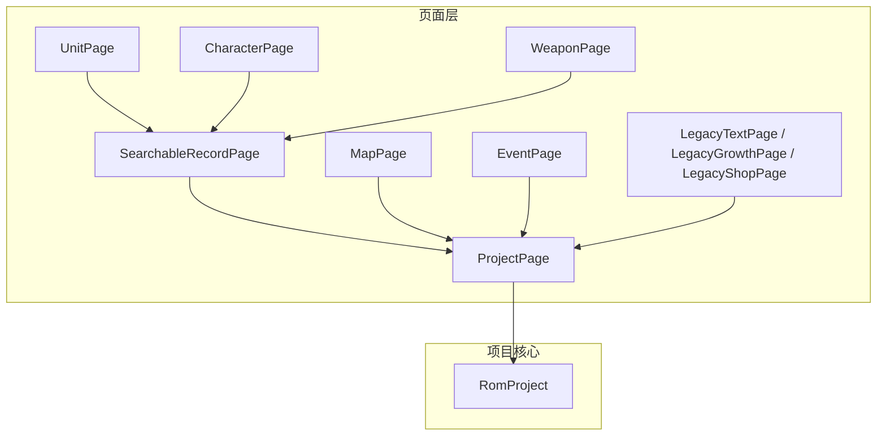
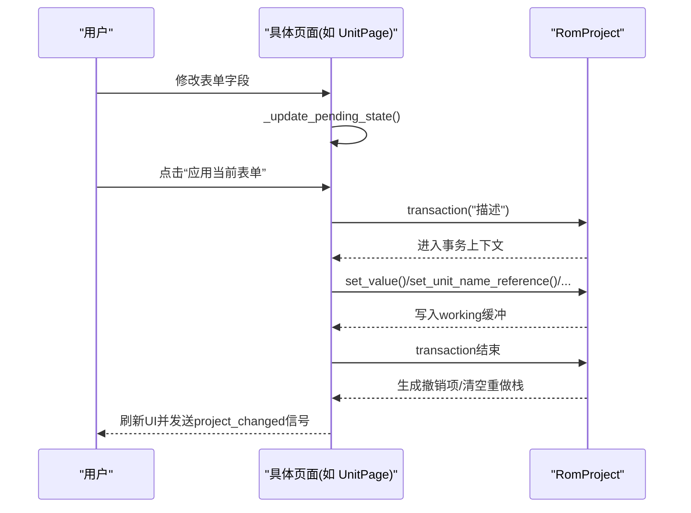
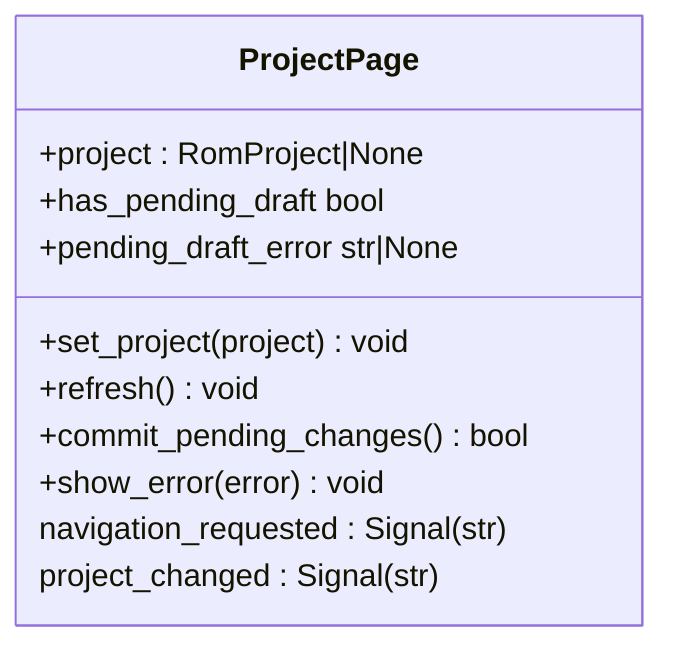
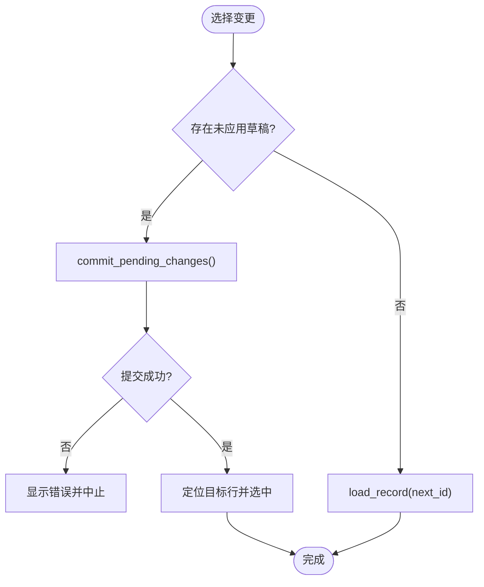
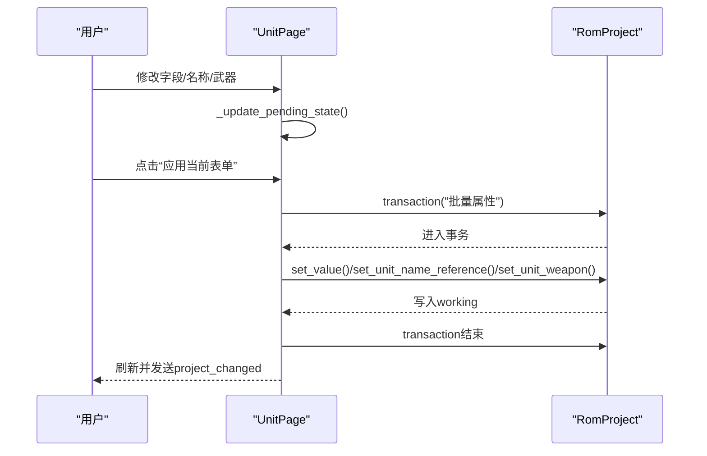
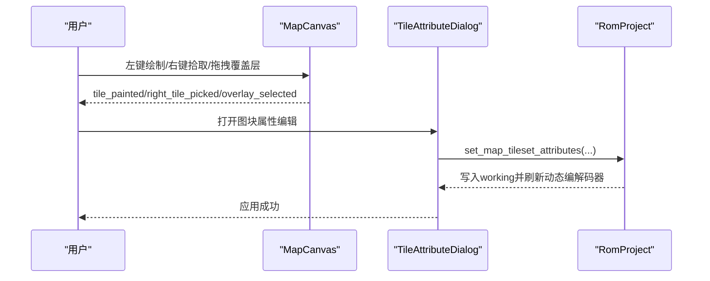
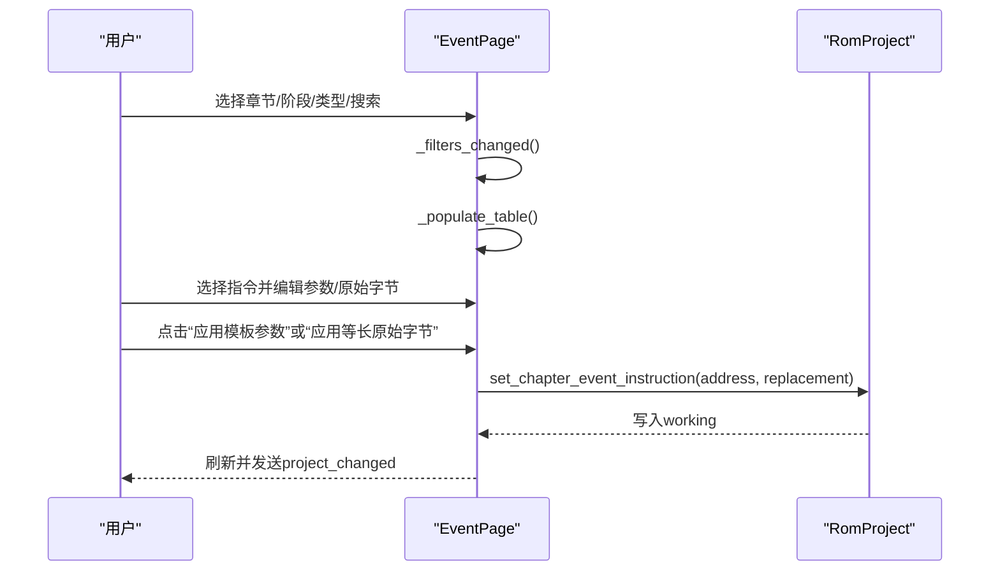
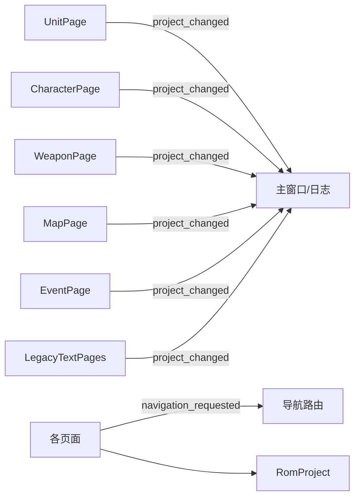

# 页面管理系统

<cite>
**本文引用的文件**
- [src/dc_modifier/pages.py](file://src/dc_modifier/pages.py)
- [src/dc_modifier/map_page.py](file://src/dc_modifier/map_page.py)
- [src/dc_modifier/event_page.py](file://src/dc_modifier/event_page.py)
- [src/dc_modifier/legacy_text_pages.py](file://src/dc_modifier/legacy_text_pages.py)
- [src/fc_rom_editor_core.py](file://src/fc_rom_editor_core.py)
</cite>

## 目录
1. [简介](#简介)
2. [项目结构](#项目结构)
3. [核心组件](#核心组件)
4. [架构总览](#架构总览)
5. [详细组件分析](#详细组件分析)
6. [依赖关系分析](#依赖关系分析)
7. [性能考虑](#性能考虑)
8. [故障排查指南](#故障排查指南)
9. [结论](#结论)
10. [附录：自定义页面开发最佳实践](#附录自定义页面开发最佳实践)

## 简介
本技术文档面向DC修改器页面管理系统，围绕ProjectPage基类的设计理念与抽象接口展开，系统阐述页面生命周期管理、数据绑定机制与事务处理；并深入解析UnitPage、CharacterPage、MapPage、EventPage等具体页面的职责划分与交互流程。同时说明页面注册机制、导航路由与状态同步策略，提供页面间通信、数据共享与错误处理的实践指导，帮助开发者快速扩展新的编辑页面。

## 项目结构
页面管理系统位于dc_modifier模块中，采用“基类+具体页面”的分层组织方式：
- 基类与通用能力：ProjectPage、SearchableRecordPage、OverviewPage等，封装了项目注入、刷新、草稿提交、导航信号、列表选择与复制粘贴等通用逻辑。
- 领域页面：UnitPage、CharacterPage、WeaponPage、MusicPage、ResourcePage、ChangesPage等，分别对应机体、人物、武器、音乐等资源编辑。
- 地图与事件：map_page.py中的MapPage与事件编辑器，event_page.py中的EventPage用于章节事件指令编辑。
- 历史兼容文本页：legacy_text_pages.py提供旧版对话、成长、商店等文本编辑。
- 项目核心：fc_rom_editor_core.py中的RomProject提供ROM工作区、编解码器、资源分配、撤销/重做与事务支持。

图表来源
- [src/dc_modifier/pages.py:103-152](file://src/dc_modifier/pages.py#L103-L152)
- [src/dc_modifier/pages.py:243-512](file://src/dc_modifier/pages.py#L243-L512)
- [src/dc_modifier/pages.py:514-880](file://src/dc_modifier/pages.py#L514-L880)
- [src/dc_modifier/pages.py:882-1214](file://src/dc_modifier/pages.py#L882-L1214)
- [src/dc_modifier/pages.py:1216-1513](file://src/dc_modifier/pages.py#L1216-L1513)
- [src/dc_modifier/map_page.py:595-800](file://src/dc_modifier/map_page.py#L595-L800)
- [src/dc_modifier/event_page.py:66-228](file://src/dc_modifier/event_page.py#L66-L228)
- [src/dc_modifier/legacy_text_pages.py:20-233](file://src/dc_modifier/legacy_text_pages.py#L20-L233)
- [src/fc_rom_editor_core.py:463-785](file://src/fc_rom_editor_core.py#L463-L785)

章节来源
- [src/dc_modifier/pages.py:103-152](file://src/dc_modifier/pages.py#L103-L152)
- [src/dc_modifier/pages.py:243-512](file://src/dc_modifier/pages.py#L243-L512)
- [src/dc_modifier/pages.py:514-880](file://src/dc_modifier/pages.py#L514-L880)
- [src/dc_modifier/pages.py:882-1214](file://src/dc_modifier/pages.py#L882-L1214)
- [src/dc_modifier/pages.py:1216-1513](file://src/dc_modifier/pages.py#L1216-L1513)
- [src/dc_modifier/map_page.py:595-800](file://src/dc_modifier/map_page.py#L595-L800)
- [src/dc_modifier/event_page.py:66-228](file://src/dc_modifier/event_page.py#L66-L228)
- [src/dc_modifier/legacy_text_pages.py:20-233](file://src/dc_modifier/legacy_text_pages.py#L20-L233)
- [src/fc_rom_editor_core.py:463-785](file://src/fc_rom_editor_core.py#L463-L785)

## 核心组件
- ProjectPage：所有页面的基类，负责项目对象注入、刷新钩子、草稿状态检测、统一错误提示与导航信号发射。
- SearchableRecordPage：在ProjectPage基础上增加记录列表、搜索过滤、上下文菜单（复制/粘贴/复制到其他ID/还原）、选择切换时自动提交草稿等能力。
- RomProject：项目核心，维护ROM工作缓冲区、原始镜像、资源分配器、各类编解码器实例，并提供transaction事务、撤销/重做、批量写入与校验。

关键职责与接口
- 生命周期：set_project → refresh → load_record → commit_pending_changes → project_changed信号。
- 数据绑定：通过表单控件值变化触发_update_pending_state，计算是否有未应用改动，控制按钮可用性。
- 事务处理：使用project.transaction包裹一组写操作，异常时回滚到快照；提交后生成EditHistoryEntry供撤销/重做。

章节来源
- [src/dc_modifier/pages.py:103-152](file://src/dc_modifier/pages.py#L103-L152)
- [src/dc_modifier/pages.py:243-512](file://src/dc_modifier/pages.py#L243-L512)
- [src/fc_rom_editor_core.py:692-785](file://src/fc_rom_editor_core.py#L692-L785)

## 架构总览
页面系统与项目核心的交互遵循“视图—控制器—模型”的清晰分层：
- 视图：PySide6 UI控件（QListWidget、QTableWidget、QFormLayout等）
- 控制器：各Page子类，处理用户输入、校验、调用RomProject API
- 模型：RomProject及其内部编解码器、资源分配器

图表来源
- [src/dc_modifier/pages.py:514-880](file://src/dc_modifier/pages.py#L514-L880)
- [src/fc_rom_editor_core.py:714-744](file://src/fc_rom_editor_core.py#L714-L744)

## 详细组件分析

### ProjectPage 基类设计
- 项目注入与刷新：set_project设置RomProject并调用refresh；子类应重写refresh以初始化控件数据。
- 草稿机制：has_pending_draft基于是否存在可应用的apply_button及启用状态；commit_pending_changes尝试提交并刷新。
- 导航与错误：navigation_requested信号用于页面跳转；show_error统一弹出错误对话框。

图表来源
- [src/dc_modifier/pages.py:103-152](file://src/dc_modifier/pages.py#L103-L152)

章节来源
- [src/dc_modifier/pages.py:103-152](file://src/dc_modifier/pages.py#L103-L152)

### SearchableRecordPage 通用记录页
- 记录列表与搜索：records为QListWidget，search文本框实时过滤；previous/next按钮支持可见记录间跳转。
- 上下文菜单：复制当前记录、粘贴到当前ID、复制到其他ID、还原当前记录、导出当前记录（若支持）。
- 选择切换保护：切换记录前会尝试提交草稿，避免丢失未保存修改。

图表来源
- [src/dc_modifier/pages.py:243-512](file://src/dc_modifier/pages.py#L243-L512)

章节来源
- [src/dc_modifier/pages.py:243-512](file://src/dc_modifier/pages.py#L243-L512)

### UnitPage 机体编辑页
- 职责：编辑已确认的机体能力字段、名称引用、直接名称修改、两格武器槽配置；支持复制/还原/导出.dcuunit数据包。
- 数据流：load_record从project.unit_codec解码记录，填充字段与元信息；apply_record在事务中批量写入属性、名称引用与武器。
- 共享机制：名称引用可能由多个ID共享，修改前会提示确认；复制时会检查目标是否共享并提示。

图表来源
- [src/dc_modifier/pages.py:514-880](file://src/dc_modifier/pages.py#L514-L880)
- [src/fc_rom_editor_core.py:714-744](file://src/fc_rom_editor_core.py#L714-L744)

章节来源
- [src/dc_modifier/pages.py:514-880](file://src/dc_modifier/pages.py#L514-L880)

### CharacterPage 人物编辑页
- 职责：编辑真实战斗名称引用、直接名称修改、人物作为我方/敌方时的战斗音乐绑定。
- 数据流：load_record加载名称Token、基准名称与音乐绑定；apply_record在事务中更新名称引用/文本与音乐绑定。
- 约束：名称引用与名称文字不能同时修改，需先应用其中一项；共享名称修改前会提示。

章节来源
- [src/dc_modifier/pages.py:882-1214](file://src/dc_modifier/pages.py#L882-L1214)

### WeaponPage 武器编辑页
- 职责：显示并切换真实武器名称，编辑射程、命中与地形攻击力；支持复制/还原。
- 数据流：load_record解码武器属性与名称Token；apply_record在事务中写入属性与名称引用/文本。
- 约束：名称引用与名称文字不能同时修改；共享记录复制前提示。

章节来源
- [src/dc_modifier/pages.py:1216-1513](file://src/dc_modifier/pages.py#L1216-L1513)

### MapPage 地图编辑页
- 职责：可视化地图图块绘制、地形属性编辑、部署与触发器上下文操作。
- 交互：MapCanvas响应鼠标绘制、拾取、覆盖层拖拽与右键上下文；TileAttributeDialog编辑图块属性并应用。
- 数据流：set_content设置地图尺寸与图块；paintEvent渲染图块与覆盖层；接受属性更改后调用project.set_map_tileset_attributes。

图表来源
- [src/dc_modifier/map_page.py:595-800](file://src/dc_modifier/map_page.py#L595-L800)
- [src/dc_modifier/map_page.py:310-592](file://src/dc_modifier/map_page.py#L310-L592)

章节来源
- [src/dc_modifier/map_page.py:595-800](file://src/dc_modifier/map_page.py#L595-L800)
- [src/dc_modifier/map_page.py:310-592](file://src/dc_modifier/map_page.py#L310-L592)

### EventPage 战场事件页
- 职责：按章节筛选并修改增援、加入、说得转化、撤退等事件动作；保持原指令长度不移动脚本指针。
- 数据流：refresh加载指令列表；_visible_instructions根据章节/阶段/类型/搜索过滤；_apply_template/_apply_raw将模板或原始字节写入指定地址。
- 安全边界：严格校验新指令长度与原槽一致，防止破坏脚本结构。

图表来源
- [src/dc_modifier/event_page.py:66-228](file://src/dc_modifier/event_page.py#L66-L228)
- [src/dc_modifier/event_page.py:655-701](file://src/dc_modifier/event_page.py#L655-L701)

章节来源
- [src/dc_modifier/event_page.py:66-228](file://src/dc_modifier/event_page.py#L66-L228)
- [src/dc_modifier/event_page.py:655-701](file://src/dc_modifier/event_page.py#L655-L701)

### LegacyTextPages 历史兼容文本页
- 职责：编辑旧版对话段、成长方式、商店与对话；支持多版本变体与共用文字冲突检测。
- 数据流：refresh加载codec与记录列表；apply_changes生成patches并通过project._apply_legacy_global_patches写入；discard_pending_changes放弃草稿。
- 事务冲突：通过transaction_sync_group与pending_draft_keys标识受影响的ROM偏移，配合外部冲突检查器避免并发修改。

章节来源
- [src/dc_modifier/legacy_text_pages.py:20-233](file://src/dc_modifier/legacy_text_pages.py#L20-L233)
- [src/dc_modifier/legacy_text_pages.py:244-403](file://src/dc_modifier/legacy_text_pages.py#L244-L403)
- [src/dc_modifier/legacy_text_pages.py:405-541](file://src/dc_modifier/legacy_text_pages.py#L405-L541)
- [src/dc_modifier/legacy_text_pages.py:555-772](file://src/dc_modifier/legacy_text_pages.py#L555-L772)

## 依赖关系分析
- 页面与项目核心：所有页面通过ProjectPage持有RomProject引用，调用其API进行读写；RomProject提供transaction、撤销/重做、编解码器与资源分配。
- 页面间通信：通过project_changed信号通知其他组件（如主窗口、日志面板）工程已变更；navigation_requested信号用于页面跳转。
- 数据共享：共享名称/记录通过compact_ids提示影响范围；复制/粘贴在页面内完成，必要时跨页面通过全局剪贴板或项目级状态。

图表来源
- [src/dc_modifier/pages.py:103-152](file://src/dc_modifier/pages.py#L103-L152)
- [src/dc_modifier/pages.py:514-880](file://src/dc_modifier/pages.py#L514-L880)
- [src/dc_modifier/pages.py:882-1214](file://src/dc_modifier/pages.py#L882-L1214)
- [src/dc_modifier/pages.py:1216-1513](file://src/dc_modifier/pages.py#L1216-L1513)
- [src/dc_modifier/map_page.py:595-800](file://src/dc_modifier/map_page.py#L595-L800)
- [src/dc_modifier/event_page.py:66-228](file://src/dc_modifier/event_page.py#L66-L228)
- [src/dc_modifier/legacy_text_pages.py:20-233](file://src/dc_modifier/legacy_text_pages.py#L20-L233)

章节来源
- [src/dc_modifier/pages.py:103-152](file://src/dc_modifier/pages.py#L103-L152)
- [src/dc_modifier/pages.py:514-880](file://src/dc_modifier/pages.py#L514-L880)
- [src/dc_modifier/pages.py:882-1214](file://src/dc_modifier/pages.py#L882-L1214)
- [src/dc_modifier/pages.py:1216-1513](file://src/dc_modifier/pages.py#L1216-L1513)
- [src/dc_modifier/map_page.py:595-800](file://src/dc_modifier/map_page.py#L595-L800)
- [src/dc_modifier/event_page.py:66-228](file://src/dc_modifier/event_page.py#L66-L228)
- [src/dc_modifier/legacy_text_pages.py:20-233](file://src/dc_modifier/legacy_text_pages.py#L20-L233)

## 性能考虑
- 列表刷新优化：SearchableRecordPage在populate_records中使用blockSignals与updatesEnabled(false)减少重绘；仅在最终稳定后恢复信号与更新。
- 大对象渲染：MapCanvas按需绘制图块与覆盖层，避免全量重绘；颜色预览与图标缓存减少重复计算。
- 事务批处理：UnitPage/CharacterPage/WeaponPage将多字段写入合并到单个transaction，降低中间状态与撤销项数量。
- 只读参考输出：RomProject支持设置只读输出根目录，防止误写参考ROM路径。

[本节为通用性能建议，无需特定文件引用]

## 故障排查指南
- 无法提交草稿：检查has_pending_draft与pending_draft_error；确保模板参数与原始字节仅一种处于草稿状态；长度校验失败会阻止提交。
- 共享名称冲突：修改共享名称前会弹出确认；若多处共用同一名称记录，需谨慎操作。
- 事务异常回滚：transaction内抛出异常将回滚到快照；检查RomProject.working与resource_allocator是否正确恢复。
- 地图属性未应用：TileAttributeDialog仅对已验证图库生效；不支持时将禁用保存按钮。
- 事件指令长度不符：EventPage强制等长替换；粘贴或模板生成的指令必须与原槽长度一致。

章节来源
- [src/dc_modifier/pages.py:103-152](file://src/dc_modifier/pages.py#L103-L152)
- [src/dc_modifier/pages.py:514-880](file://src/dc_modifier/pages.py#L514-L880)
- [src/dc_modifier/event_page.py:609-636](file://src/dc_modifier/event_page.py#L609-L636)
- [src/dc_modifier/map_page.py:310-592](file://src/dc_modifier/map_page.py#L310-L592)
- [src/fc_rom_editor_core.py:714-744](file://src/fc_rom_editor_core.py#L714-L744)

## 结论
页面管理系统通过ProjectPage与SearchableRecordPage提供了统一的页面生命周期、数据绑定与草稿管理机制；结合RomProject的事务与撤销/重做能力，确保了修改的安全性与可追溯性。各具体页面职责清晰，交互流程规范，便于扩展与维护。建议在新增页面时遵循现有模式：继承合适基类、实现record_ids/load_record/refresh、使用transaction批量写入、通过project_changed通知变更，并在必要时提供共享名称确认与错误提示。

[本节为总结性内容，无需特定文件引用]

## 附录：自定义页面开发最佳实践
- 选择基类：
  - 简单展示/表单：继承ProjectPage，实现refresh与commit_pending_changes。
  - 记录列表+搜索：继承SearchableRecordPage，实现record_ids、record_text、load_record与可选的copy_record_to/duplicate_record/reset_record。
- 数据绑定：
  - 在控件值变化回调中调用_update_pending_state，计算pending状态并更新按钮可用性。
  - 使用project.get_*与project.set_*系列API读取/写入数据，避免直接操作ROM字节。
- 事务处理：
  - 将相关写操作放入project.transaction("描述")中，确保异常回滚与撤销项正确生成。
- 共享与冲突：
  - 对共享名称/记录，使用confirm_shared_name_edit提示影响范围。
  - 对于历史文本页，实现transaction_sync_group与pending_draft_keys，配合冲突检查器。
- 导航与通信：
  - 通过navigation_requested.emit(page_key)请求页面跳转。
  - 通过project_changed.emit(message)通知工程变更。
- 错误处理：
  - 捕获异常并使用show_error统一提示；对非法输入进行前置校验（如ID范围、指令长度）。

章节来源
- [src/dc_modifier/pages.py:103-152](file://src/dc_modifier/pages.py#L103-L152)
- [src/dc_modifier/pages.py:243-512](file://src/dc_modifier/pages.py#L243-L512)
- [src/dc_modifier/pages.py:514-880](file://src/dc_modifier/pages.py#L514-L880)
- [src/dc_modifier/legacy_text_pages.py:20-233](file://src/dc_modifier/legacy_text_pages.py#L20-L233)
- [src/fc_rom_editor_core.py:714-744](file://src/fc_rom_editor_core.py#L714-L744)