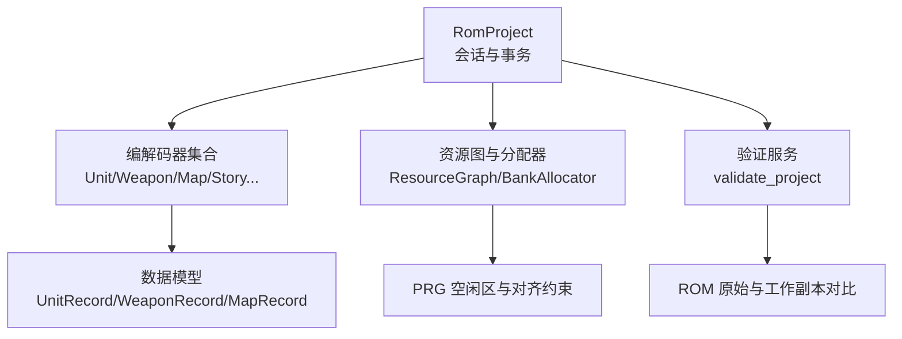
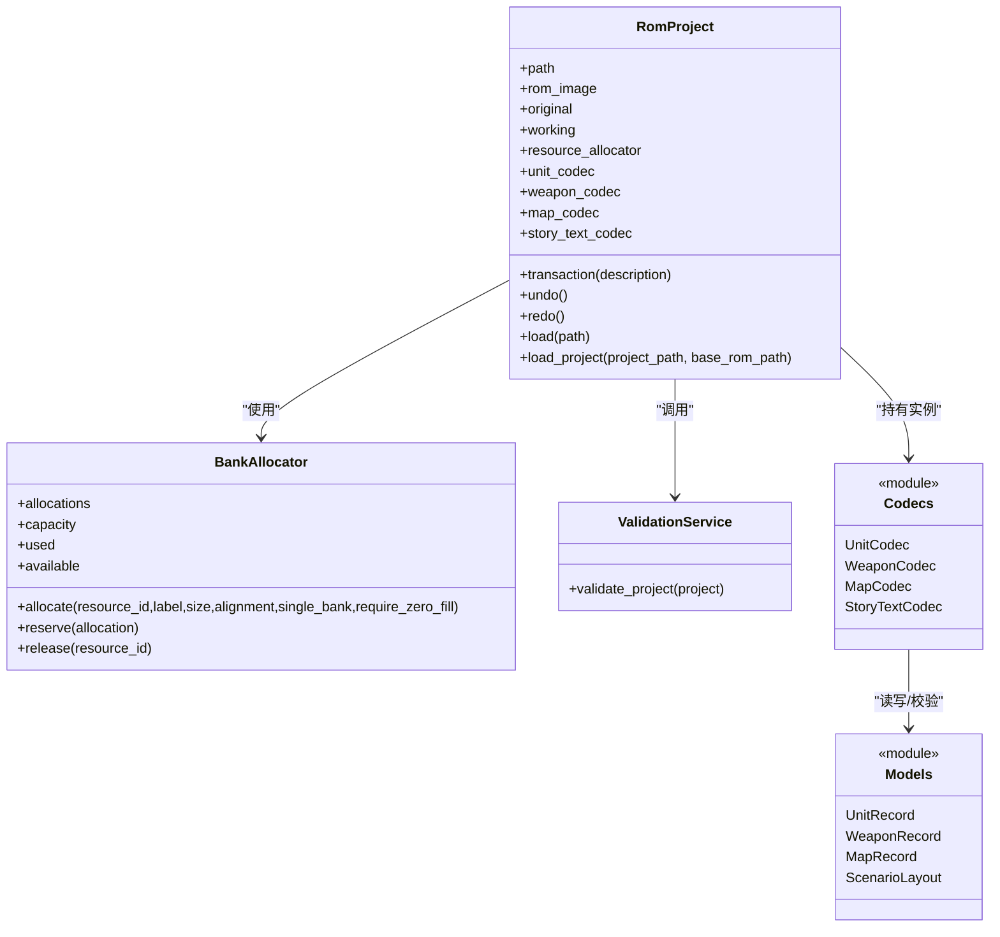
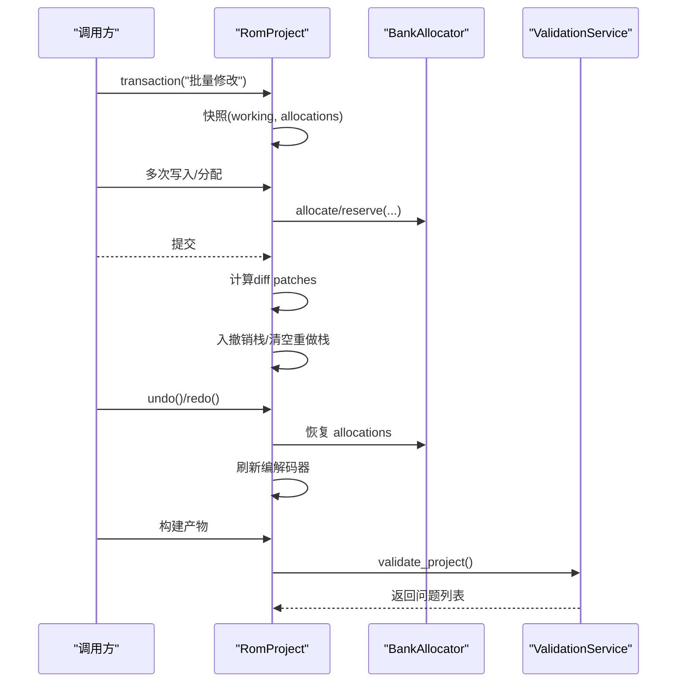
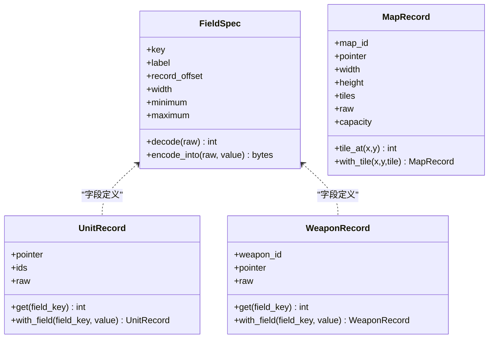
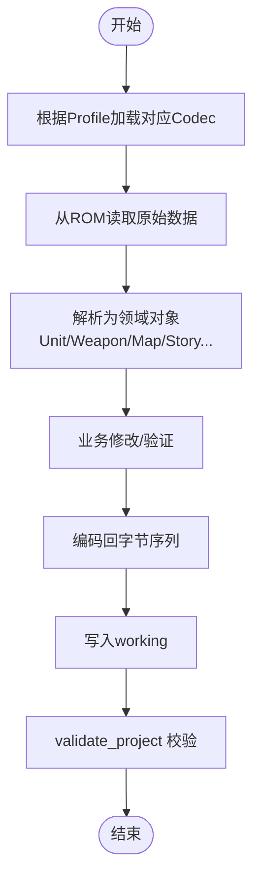
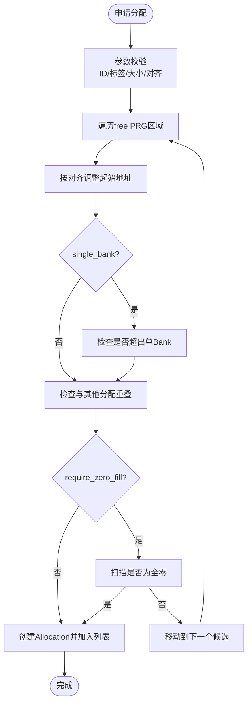
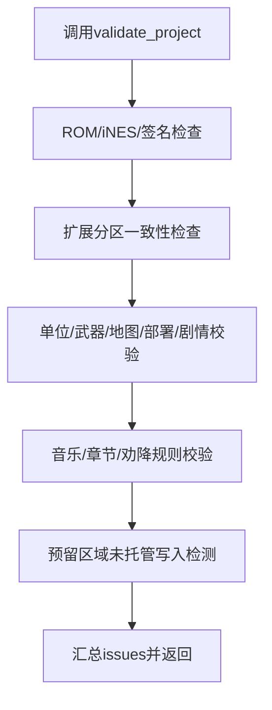
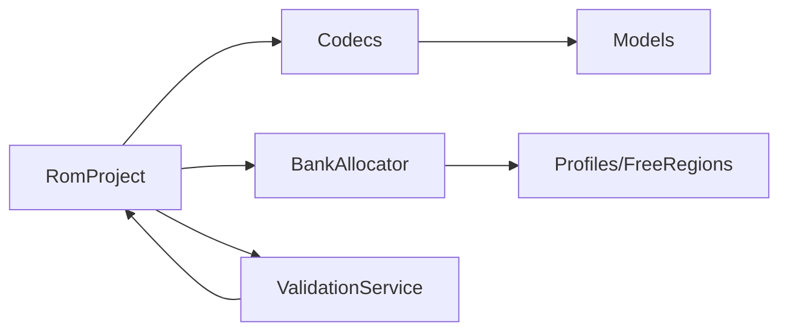

# 业务逻辑层

<cite>
**本文引用的文件**
- [src/fc_rom_editor_core.py](file://src/fc_rom_editor_core.py)
- [src/fc_editor/models.py](file://src/fc_editor/models.py)
- [src/fc_editor/resources.py](file://src/fc_editor/resources.py)
- [src/fc_editor/services/validation.py](file://src/fc_editor/services/validation.py)
- [src/fc_editor/codecs/__init__.py](file://src/fc_editor/codecs/__init__.py)
</cite>

## 目录
1. [简介](#简介)
2. [项目结构](#项目结构)
3. [核心组件](#核心组件)
4. [架构总览](#架构总览)
5. [详细组件分析](#详细组件分析)
6. [依赖关系分析](#依赖关系分析)
7. [性能考量](#性能考量)
8. [故障排查指南](#故障排查指南)
9. [结论](#结论)
10. [附录](#附录)

## 简介
本文件聚焦 DC 修改器的“业务逻辑层”，围绕 RomProject 核心类展开，系统阐述 ROM 编辑会话管理、事务处理机制与状态同步策略；梳理数据模型（UnitRecord、WeaponRecord、MapRecord 等）的结构与关系；解释编解码器系统的接口规范与数据格式转换；给出业务规则验证、数据完整性检查与错误处理的实践要点；并说明资源分配算法、Bank 管理与内存优化实现细节。文档以可追溯的方式引用源码位置，便于读者对照实现。

## 项目结构
业务逻辑层由以下关键模块构成：
- 工程与会话：RomProject 负责加载 ROM、维护工作副本、初始化编解码器、管理资源分配与撤销/重做栈。
- 数据模型：models.py 定义 FieldSpec、UnitRecord、WeaponRecord、MapRecord、ScenarioLayout 等不可变实体，提供字段级编解码与校验。
- 资源与 Bank 管理：resources.py 提供 ResourceGraph、Allocation、BankAllocator，用于在受控的 PRG 空闲区进行确定性分配。
- 编解码器：codecs 包暴露 UnitCodec、WeaponCodec、MapCodec、StoryTextCodec 等，封装 ROM 特定格式的读写。
- 验证服务：validation.py 提供 validate_project，对 ROM 结构、扩展分区、指针、容量等进行全面校验。

图表来源
- [src/fc_rom_editor_core.py:463-785](file://src/fc_rom_editor_core.py#L463-L785)
- [src/fc_editor/resources.py:47-413](file://src/fc_editor/resources.py#L47-L413)
- [src/fc_editor/services/validation.py:142-683](file://src/fc_editor/services/validation.py#L142-L683)
- [src/fc_editor/models.py:13-426](file://src/fc_editor/models.py#L13-L426)

章节来源
- [src/fc_rom_editor_core.py:463-785](file://src/fc_rom_editor_core.py#L463-L785)
- [src/fc_editor/resources.py:47-413](file://src/fc_editor/resources.py#L47-L413)
- [src/fc_editor/services/validation.py:142-683](file://src/fc_editor/services/validation.py#L142-L683)
- [src/fc_editor/models.py:13-426](file://src/fc_editor/models.py#L13-L426)

## 核心组件
- RomProject：封装 ROM 镜像、工作副本、初始/动态编解码器、资源分配器、撤销/重做栈与事务边界。提供 load/load_project、transaction、undo/redo、构建产物输出等能力。
- 数据模型：FieldSpec/WeaponFieldSpec 描述字段偏移、宽度、掩码、范围与显示缩放；UnitRecord/WeaponRecord/MapRecord 等记录类型提供 get/with_field 等不可变更新方法。
- 资源与 Bank 管理：ResourceGraph 描述 ROM 中各资源的命名节点与引用；BankAllocator 在 profile 声明的 free PRG 区域执行确定性首适配分配，支持对齐、单 Bank 限制与零填充要求。
- 编解码器：通过 codecs 包统一导出，按 ROM Profile 动态启用或回退到基础实现，屏蔽底层差异。
- 验证服务：validate_project 覆盖 ROM 大小、iNES 头、安全签名、扩展分区一致性、指针有效性、容量上限、事件/部署/剧情文本完整性、音乐与章节脚本合法性等。

章节来源
- [src/fc_rom_editor_core.py:463-785](file://src/fc_rom_editor_core.py#L463-L785)
- [src/fc_editor/models.py:13-426](file://src/fc_editor/models.py#L13-L426)
- [src/fc_editor/resources.py:47-413](file://src/fc_editor/resources.py#L47-L413)
- [src/fc_editor/codecs/__init__.py:1-47](file://src/fc_editor/codecs/__init__.py#L1-L47)
- [src/fc_editor/services/validation.py:142-683](file://src/fc_editor/services/validation.py#L142-L683)

## 架构总览
下图展示 RomProject 作为业务中枢，协调编解码器、资源分配与验证服务的协作关系。

图表来源
- [src/fc_rom_editor_core.py:463-785](file://src/fc_rom_editor_core.py#L463-L785)
- [src/fc_editor/resources.py:280-413](file://src/fc_editor/resources.py#L280-L413)
- [src/fc_editor/services/validation.py:142-683](file://src/fc_editor/services/validation.py#L142-L683)
- [src/fc_editor/models.py:13-426](file://src/fc_editor/models.py#L13-L426)

## 详细组件分析

### RomProject：ROM 编辑会话、事务与状态同步
- 会话管理
  - 构造时加载 ROM 镜像，复制为 original 与 working；解析 ExpansionPlan，初始化基础编解码器与动态编解码器；注册资源分配器并根据计划预留分区与守卫区域。
  - 提供 load/load_project 两种入口，后者会应用工程文档并执行完整性检查。
- 事务处理
  - transaction 上下文管理器在首次进入时快照 working 与 allocations，异常时回滚至快照；成功退出后计算 diff patches 并入撤销栈，清空重做栈。
  - undo/redo 基于 EditPatch 列表与 Allocation 快照恢复/重放变更，同时重建动态编解码器视图。
- 状态同步策略
  - 所有写操作均作用于 working；资源分配变更通过 BankAllocator 集中管理；编解码器根据当前 working 与 allocations 动态刷新，保证读取一致。
- 构建产物
  - 生成 IPS 补丁、输出 ROM、工程与报告，包含 SHA256 与变更字节统计。

图表来源
- [src/fc_rom_editor_core.py:638-785](file://src/fc_rom_editor_core.py#L638-L785)
- [src/fc_editor/resources.py:368-413](file://src/fc_editor/resources.py#L368-L413)
- [src/fc_editor/services/validation.py:142-683](file://src/fc_editor/services/validation.py#L142-L683)

章节来源
- [src/fc_rom_editor_core.py:463-785](file://src/fc_rom_editor_core.py#L463-L785)

### 数据模型：UnitRecord、WeaponRecord、MapRecord 与场景布局
- FieldSpec/WeaponFieldSpec
  - 定义字段偏移、宽度、掩码、移位、范围、显示缩放与证据等级；提供 decode/encode_into，确保写入前范围校验与位域安全合并。
- UnitRecord
  - 固定长度机体记录，维护 pointer、ids、raw；get/with_field 基于 UNIT_FIELD_BY_KEY 进行只读访问与不可变更新。
- WeaponRecord
  - 武器记录含 weapon_id、pointer、raw；字段支持掩码与值偏置，如最大射程低半字节加 1。
- MapRecord
  - 地图记录含 map_id、pointer、宽高、tiles、raw、capacity；tile_at/with_tile 提供坐标访问与只改单个格点。
- ScenarioLayout
  - 场景部署包含 prelude、enemies、guests、player_placements、raw、capacity；validate_layout 由编解码器侧校验。

图表来源
- [src/fc_editor/models.py:13-426](file://src/fc_editor/models.py#L13-L426)

章节来源
- [src/fc_editor/models.py:13-426](file://src/fc_editor/models.py#L13-L426)

### 编解码器系统：接口规范与数据格式转换
- 统一导出：codecs/__init__.py 集中暴露各类 Codec，供上层按需装配。
- 动态装配：RomProject 根据 ROM Profile 与 ExpansionPlan 选择基础或扩展编解码器，例如单位名称、武器名称、地图触发、剧情文本等。
- 典型职责
  - UnitCodec/UnitNameReferenceCodec：读取/写入单位记录与名称指针表。
  - WeaponCodec/WeaponNameReferenceCodec：武器记录与名称指针。
  - MapCodec/ScenarioLayoutCodec/MapTriggerCodec：地图布局、部署与事件/商店脚本。
  - StoryTextCodec：剧情文本组与选择器绑定。
  - BattleMusicCodec/CustomMusicCodec：战斗音乐与自定义曲槽。
- 数据流：从 ROM 原始字节解析为高层对象（如 MapRecord），经 UI/业务修改后再编码回字节序列，最终写入 working 并通过构建流程产出 IPS/ROM。

图表来源
- [src/fc_editor/codecs/__init__.py:1-47](file://src/fc_editor/codecs/__init__.py#L1-L47)
- [src/fc_rom_editor_core.py:463-618](file://src/fc_rom_editor_core.py#L463-L618)
- [src/fc_editor/services/validation.py:142-683](file://src/fc_editor/services/validation.py#L142-L683)

章节来源
- [src/fc_editor/codecs/__init__.py:1-47](file://src/fc_editor/codecs/__init__.py#L1-L47)
- [src/fc_rom_editor_core.py:463-618](file://src/fc_rom_editor_core.py#L463-L618)

### 资源分配算法、Bank 管理与内存优化
- ResourceGraph
  - 将 ROM 中的指针表、数据区、代码区、音频区、自由区等建模为命名节点，并提供引用关系查询。
- BankAllocator
  - 确定性首适配分配：遍历 profile 声明的 free PRG 区域，按对齐要求寻找连续空间；支持 single_bank 限制、require_zero_fill 预检、冲突检测与重叠保护。
  - 提供 reserve/release/allocation 等 API，配合 RomProject 的事务与撤销/重做保持一致性。
- 内存优化
  - 仅在 free PRG 区域写入，避免破坏受保护代码与音频区。
  - 通过 Alignment 与单 Bank 约束减少跨 Bank 访问开销。
  - 构建产物采用 IPS 增量补丁，降低传输与存储成本。

图表来源
- [src/fc_editor/resources.py:280-413](file://src/fc_editor/resources.py#L280-L413)

章节来源
- [src/fc_editor/resources.py:280-413](file://src/fc_editor/resources.py#L280-L413)

### 业务规则验证、数据完整性检查与错误处理
- 规则覆盖
  - ROM/iNES 头不变性、安全签名校验。
  - 扩展分区标志与登记一致性、地图/部署/事件共享池容量。
  - 单位/武器记录长度、指针有效性、名称指针归属原生表。
  - 地图压缩后容量、部署布局合法性、剧情文本独立终止符。
  - 音乐命令受支持性、章节脚本指令/动作数量统计。
  - 预留区域未托管写入检测。
- 错误处理
  - 验证结果以 ValidationIssue 列表返回，区分 error/warning/info。
  - RomProject 在 load_project 时遇到错误直接抛出 ProjectFormatError，阻止无效工程被使用。
  - 事务内异常自动回滚 working 与 allocations，保证会话一致性。

图表来源
- [src/fc_editor/services/validation.py:142-683](file://src/fc_editor/services/validation.py#L142-L683)
- [src/fc_rom_editor_core.py:644-674](file://src/fc_rom_editor_core.py#L644-L674)

章节来源
- [src/fc_editor/services/validation.py:142-683](file://src/fc_editor/services/validation.py#L142-L683)
- [src/fc_rom_editor_core.py:644-674](file://src/fc_rom_editor_core.py#L644-L674)

## 依赖关系分析
- RomProject 依赖：
  - RomImage/profile：识别 ROM 特性与可用资源。
  - Codecs：按 Profile/ExpansionPlan 装配具体编解码器。
  - BankAllocator：统一管理 PRG 空闲区分配。
  - ValidationService：构建前后进行完整性校验。
- 数据流向：
  - 原始 ROM → 编解码器 → 领域对象 → 业务修改 → 编码回字节 → working → 构建产物/IPS。
- 耦合与内聚：
  - 编解码器与模型高内聚，屏蔽 ROM 格式差异。
  - BankAllocator 与 Profile 强相关，但通过 Allocation 抽象解耦具体资源语义。
  - RomProject 作为编排者，保持清晰边界。

图表来源
- [src/fc_rom_editor_core.py:463-785](file://src/fc_rom_editor_core.py#L463-L785)
- [src/fc_editor/resources.py:47-413](file://src/fc_editor/resources.py#L47-L413)
- [src/fc_editor/services/validation.py:142-683](file://src/fc_editor/services/validation.py#L142-L683)

章节来源
- [src/fc_rom_editor_core.py:463-785](file://src/fc_rom_editor_core.py#L463-L785)
- [src/fc_editor/resources.py:47-413](file://src/fc_editor/resources.py#L47-L413)
- [src/fc_editor/services/validation.py:142-683](file://src/fc_editor/services/validation.py#L142-L683)

## 性能考量
- 事务粒度：将多个修改放入同一 transaction，减少撤销/重做条目与快照次数。
- 分配策略：优先使用单 Bank 分配，避免跨 Bank 访问；必要时再放宽为连续分配。
- 零填充检查：require_zero_fill 可减少后续清理步骤，但会增加扫描成本，可按需关闭。
- 编解码器懒加载：仅当 Profile 支持时才实例化对应 Codec，降低启动开销。
- 构建产物：IPS 增量补丁显著减小体积，适合频繁迭代。

[本节为通用指导，不直接分析具体文件]

## 故障排查指南
- 常见错误定位
  - “输出 ROM 大小发生变化”：检查是否误改 iNES 头或 CHR 大小。
  - “认证固定代码签名不匹配”：确认未修改受保护区域或签名已失效。
  - “自动链接状态不完整/分区登记不一致”：核对 ExpansionPlan 与实际分配。
  - “地图/部署/事件共享池溢出”：减少内容或扩大分区。
  - “名称指针未指向已验证的原生名称”：修正指针或替换为合法名称。
  - “预留区域被直接修改”：改用 BankAllocator.allocate/reserve。
- 调试建议
  - 使用 transaction 包裹可疑修改，失败即回滚。
  - 运行 validate_project 获取结构化问题清单。
  - 关注 info 级别信息，了解容量使用与统计。

章节来源
- [src/fc_editor/services/validation.py:142-683](file://src/fc_editor/services/validation.py#L142-L683)
- [src/fc_rom_editor_core.py:638-785](file://src/fc_rom_editor_core.py#L638-L785)

## 结论
RomProject 作为 DC 修改器的业务中枢，通过会话与事务机制保障编辑过程的可逆性与一致性；数据模型与编解码器共同定义了 ROM 数据的领域语义与转换路径；BankAllocator 在受限空间中提供确定且安全的资源分配；ValidationService 贯穿始终，确保结构与业务规则的正确性。遵循本文档的设计与实践，可在复杂 ROM 工程中稳定地进行大规模修改与集成。

[本节为总结，不直接分析具体文件]

## 附录
- 关键实现参考路径
  - 事务与撤销/重做：[src/fc_rom_editor_core.py:692-785](file://src/fc_rom_editor_core.py#L692-L785)
  - 资源分配算法：[src/fc_editor/resources.py:368-413](file://src/fc_editor/resources.py#L368-L413)
  - 数据模型与字段规范：[src/fc_editor/models.py:13-426](file://src/fc_editor/models.py#L13-L426)
  - 编解码器导出：[src/fc_editor/codecs/__init__.py:1-47](file://src/fc_editor/codecs/__init__.py#L1-L47)
  - 项目验证规则：[src/fc_editor/services/validation.py:142-683](file://src/fc_editor/services/validation.py#L142-L683)

[本节为索引，不直接分析具体文件]