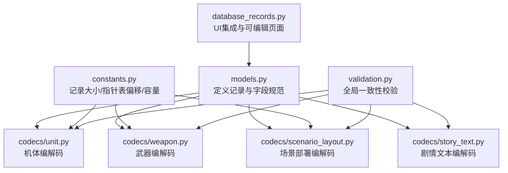
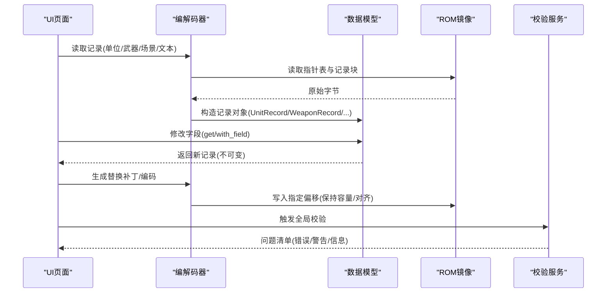
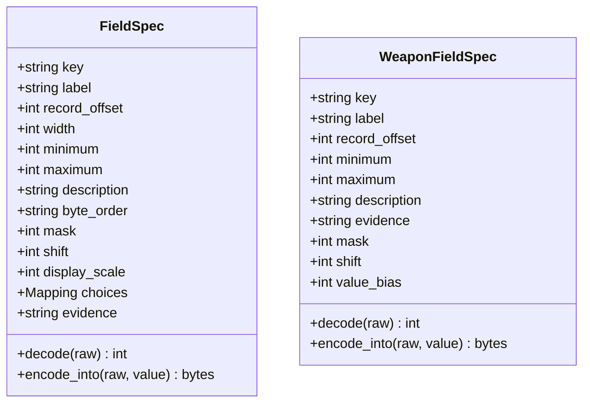
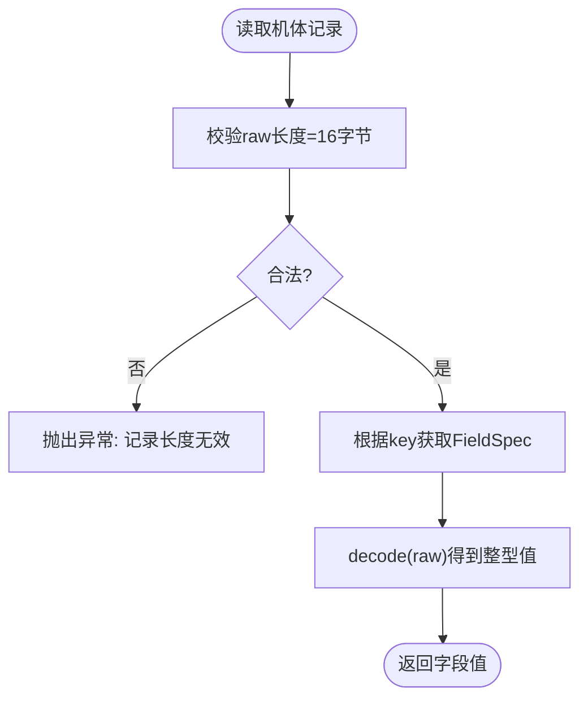
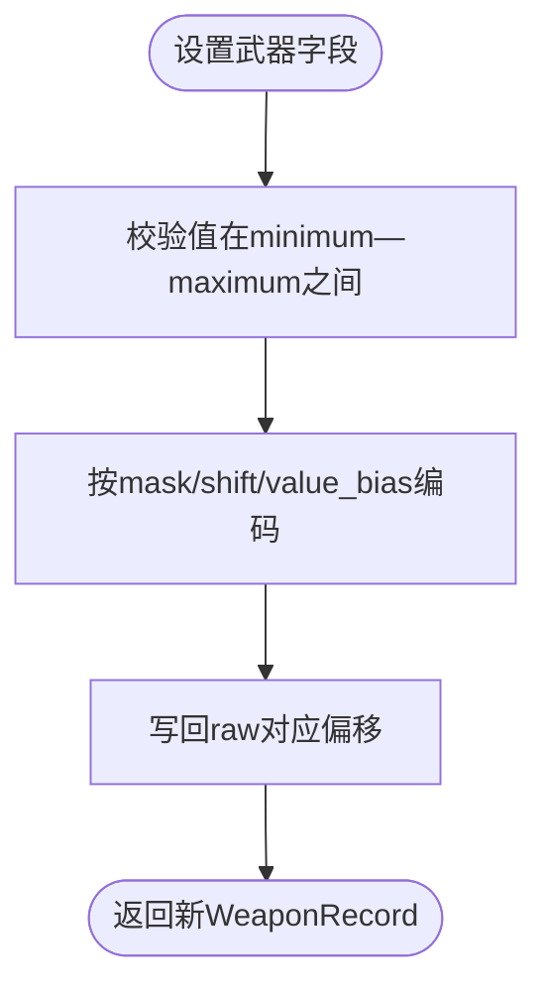
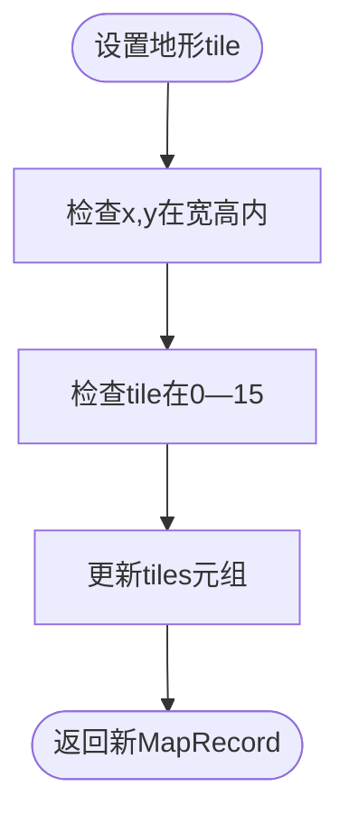
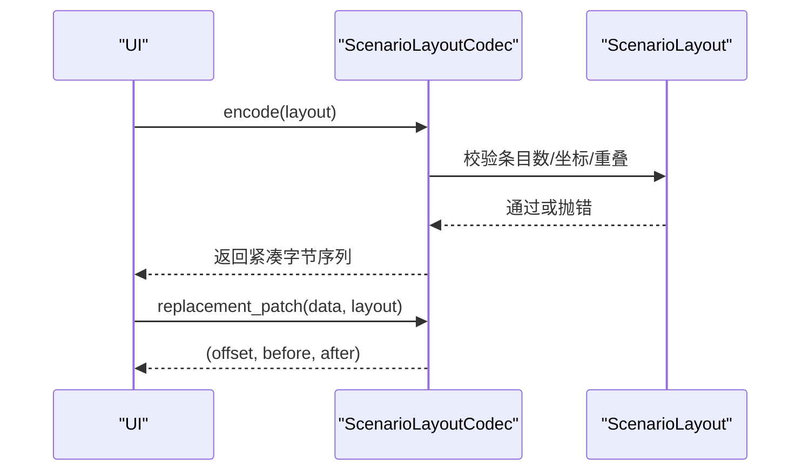
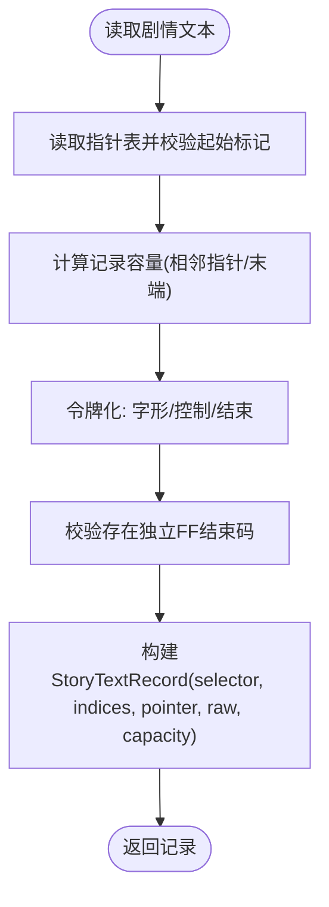
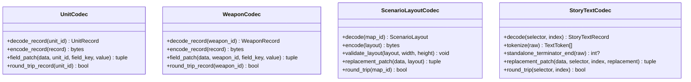
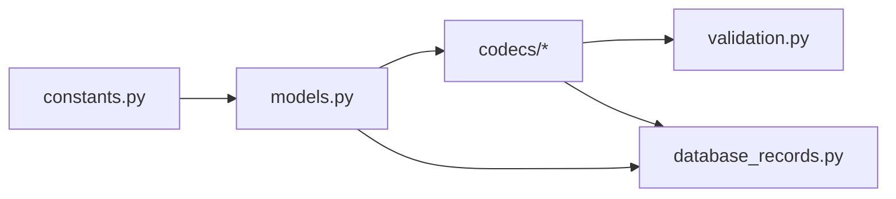

# 数据模型定义

<cite>
**本文引用的文件**
- [models.py](file://src/fc_editor/models.py)
- [constants.py](file://src/fc_editor/constants.py)
- [unit.py](file://src/fc_editor/codecs/unit.py)
- [weapon.py](file://src/fc_editor/codecs/weapon.py)
- [scenario_layout.py](file://src/fc_editor/codecs/scenario_layout.py)
- [story_text.py](file://src/fc_editor/codecs/story_text.py)
- [validation.py](file://src/fc_editor/services/validation.py)
- [database_records.py](file://src/dc_modifier/database_records.py)
</cite>

## 目录
1. [简介](#简介)
2. [项目结构](#项目结构)
3. [核心组件](#核心组件)
4. [架构总览](#架构总览)
5. [详细组件分析](#详细组件分析)
6. [依赖关系分析](#依赖关系分析)
7. [性能与容量特性](#性能与容量特性)
8. [故障排查指南](#故障排查指南)
9. [结论](#结论)
10. [附录：字段规范与常量说明](#附录字段规范与常量说明)

## 简介
本文件面向DC修改器，系统化梳理并解释核心数据模型与编解码流程，重点覆盖以下实体与概念：
- 业务实体：UnitRecord、WeaponRecord、MapRecord、ScenarioLayout、StoryTextRecord
- 字段规范：FieldSpec、UNIT_FIELDS、WEAPON_FIELDS、WeaponFieldSpec
- 数据验证规则与约束：范围校验、长度校验、指针合法性、布局冲突检测等
- 序列化/反序列化与版本兼容：固定容量写入、FF终止符、指针表校验、扩展Bank映射
- 使用模式：创建、读取、修改、提交变更的端到端流程

## 项目结构
数据模型集中在 fc_editor.models，配合各模块的 codec（编解码器）完成ROM数据的无损读写；services.validation 提供跨模块一致性校验；dc_modifier.database_records 将模型暴露给UI层进行编辑。

图表来源
- [models.py:13-426](file://src/fc_editor/models.py#L13-L426)
- [constants.py:12-38](file://src/fc_editor/constants.py#L12-L38)
- [unit.py:14-120](file://src/fc_editor/codecs/unit.py#L14-L120)
- [weapon.py:13-90](file://src/fc_editor/codecs/weapon.py#L13-L90)
- [scenario_layout.py:12-251](file://src/fc_editor/codecs/scenario_layout.py#L12-L251)
- [story_text.py:17-259](file://src/fc_editor/codecs/story_text.py#L17-L259)
- [validation.py:142-683](file://src/fc_editor/services/validation.py#L142-L683)
- [database_records.py:270-470](file://src/dc_modifier/database_records.py#L270-L470)

章节来源
- [models.py:13-426](file://src/fc_editor/models.py#L13-L426)
- [constants.py:12-38](file://src/fc_editor/constants.py#L12-L38)

## 核心组件
- FieldSpec/WeaponFieldSpec：描述字段的存储位置、宽度、掩码/位移、取值范围、显示缩放、可选枚举值及证据等级。提供 decode/encode_into 实现字节级读写。
- UNIT_FIELDS/WEAPON_FIELDS：以常量元组形式声明所有受支持字段，含“候选”字段用于未完全确认的位域或保留位。
- UnitRecord/WeaponRecord：不可变记录对象，封装 raw 字节与必要标识（如ID、指针），并提供 get/with_field 安全访问与更新。
- MapRecord：地图逻辑地形网格与压缩原始数据，附带宽高、容量限制与坐标访问。
- ScenarioLayout：场景前导列表、敌/客/我方部署条目与原始容量，提供编码、验证与替换补丁生成。
- StoryTextRecord：按选择器分组的本地化文本记录，严格保持容量与FF终止语义。

章节来源
- [models.py:13-163](file://src/fc_editor/models.py#L13-L163)
- [models.py:165-307](file://src/fc_editor/models.py#L165-L307)
- [models.py:309-426](file://src/fc_editor/models.py#L309-L426)

## 架构总览
数据流从ROM到模型再到UI与回写：
- 指针表解析：根据 constants 中的偏移与计数，读取指针表并校验起始标记与范围。
- 记录解码：codec 依据记录大小与Bank映射计算文件偏移，提取 raw 并构造模型对象。
- 字段操作：通过 FieldSpec/WeaponFieldSpec 对 raw 进行掩码/位移/范围校验后写回。
- 场景/文本：按FF分隔与容量边界进行结构化解析与再编码。
- 全局校验：validation 汇总各模块约束，输出错误/警告/信息。

图表来源
- [unit.py:42-120](file://src/fc_editor/codecs/unit.py#L42-L120)
- [weapon.py:20-90](file://src/fc_editor/codecs/weapon.py#L20-L90)
- [scenario_layout.py:79-251](file://src/fc_editor/codecs/scenario_layout.py#L79-L251)
- [story_text.py:122-259](file://src/fc_editor/codecs/story_text.py#L122-L259)
- [validation.py:142-683](file://src/fc_editor/services/validation.py#L142-L683)

## 详细组件分析

### 字段规范 FieldSpec 与 WeaponFieldSpec
- FieldSpec 负责机体记录的字段定义，支持多字节小端/大端、掩码+位移、显示缩放、可选枚举值与证据等级。decode 从 raw 切片并按掩码/位移还原数值；encode_into 在范围内校验后写回，必要时合并位域。
- WeaponFieldSpec 针对武器单字节字段，支持 value_bias 偏移量与掩码/位移，便于表达“低半字节+1”等约定。

图表来源
- [models.py:13-58](file://src/fc_editor/models.py#L13-L58)
- [models.py:205-243](file://src/fc_editor/models.py#L205-L243)

章节来源
- [models.py:13-58](file://src/fc_editor/models.py#L13-L58)
- [models.py:205-243](file://src/fc_editor/models.py#L205-L243)

### 机体记录 UnitRecord 与 UNIT_FIELDS
- UNIT_FIELDS 定义了移动力、速度、强度、防卫、基础金钱、基础经验、特殊技能、地形适应、HP、成长曲线等字段，部分为候选字段（证据等级为 candidate）。
- UnitRecord 要求 raw 长度等于常量 UNIT_RECORD_SIZE，至少包含一个ID；get/with_field 基于 UNIT_FIELD_BY_KEY 查找字段规范并执行编解码。

图表来源
- [models.py:61-183](file://src/fc_editor/models.py#L61-L183)
- [constants.py:12-15](file://src/fc_editor/constants.py#L12-L15)

章节来源
- [models.py:61-183](file://src/fc_editor/models.py#L61-L183)
- [constants.py:12-15](file://src/fc_editor/constants.py#L12-L15)

### 武器记录 WeaponRecord 与 WEAPON_FIELDS
- WEAPON_FIELDS 包括最大射程、命中、对空/陆/海攻击值；其中射程采用低半字节+1的编码。
- WeaponRecord 要求 raw 长度为 WEAPON_RECORD_SIZE，武器ID范围受限；get/with_field 基于 WEAPON_FIELD_BY_KEY 操作。

图表来源
- [models.py:185-285](file://src/fc_editor/models.py#L185-L285)
- [constants.py:17-20](file://src/fc_editor/constants.py#L17-L20)

章节来源
- [models.py:185-285](file://src/fc_editor/models.py#L185-L285)
- [constants.py:17-20](file://src/fc_editor/constants.py#L17-L20)

### 地图记录 MapRecord
- 约束：map_id 00—FF；宽高 1—32；tiles 数量必须等于 width*height；每个 tile 逻辑编号 0—15；raw 压缩数据长度必须在 2 至 capacity 之间。
- 提供 tile_at(x,y) 与 with_tile(x,y,tile) 安全访问与更新。

图表来源
- [models.py:309-342](file://src/fc_editor/models.py#L309-L342)

章节来源
- [models.py:309-342](file://src/fc_editor/models.py#L309-L342)

### 场景部署 ScenarioLayout
- 由前导列表、敌方/客军/我方部署组成，每条部署有固定长度并以 FF 分隔。
- 编码器 validate_layout 限制敌军≤18、客军≤3、我方≤11，并检查坐标不越界且不重叠。
- replacement_patch 保证编码后不超过原容量，否则报错。

图表来源
- [scenario_layout.py:146-251](file://src/fc_editor/codecs/scenario_layout.py#L146-L251)
- [models.py:344-400](file://src/fc_editor/models.py#L344-L400)

章节来源
- [scenario_layout.py:146-251](file://src/fc_editor/codecs/scenario_layout.py#L146-L251)
- [models.py:344-400](file://src/fc_editor/models.py#L344-L400)

### 剧情文本 StoryTextRecord
- 按选择器分组，指针表首项为哨兵；记录容量由相邻指针或数据区末端决定。
- 文本令牌化区分中文字形码、控制码、结束码等；standalone_terminator_end 定位首个独立 FF 结束码。
- replacement_patch 强制输入长度等于记录容量，确保零损耗替换。

图表来源
- [story_text.py:122-259](file://src/fc_editor/codecs/story_text.py#L122-L259)
- [models.py:402-426](file://src/fc_editor/models.py#L402-L426)

章节来源
- [story_text.py:122-259](file://src/fc_editor/codecs/story_text.py#L122-L259)
- [models.py:402-426](file://src/fc_editor/models.py#L402-L426)

### 编解码器与ROM交互
- UnitCodec/WeaponCodec：从指针表读取记录，校验起始标记与范围，计算文件偏移，解码/编码记录，field_patch 返回精确偏移与前后字节对比。
- ScenarioLayoutCodec：处理FF分隔与容量边界，提供语义摘要与替换补丁。
- StoryTextCodec：处理双字节字形引导集，保证容量不变与FF语义。

图表来源
- [unit.py:14-120](file://src/fc_editor/codecs/unit.py#L14-L120)
- [weapon.py:13-90](file://src/fc_editor/codecs/weapon.py#L13-L90)
- [scenario_layout.py:12-251](file://src/fc_editor/codecs/scenario_layout.py#L12-L251)
- [story_text.py:17-259](file://src/fc_editor/codecs/story_text.py#L17-L259)

章节来源
- [unit.py:14-120](file://src/fc_editor/codecs/unit.py#L14-L120)
- [weapon.py:13-90](file://src/fc_editor/codecs/weapon.py#L13-L90)
- [scenario_layout.py:12-251](file://src/fc_editor/codecs/scenario_layout.py#L12-L251)
- [story_text.py:17-259](file://src/fc_editor/codecs/story_text.py#L17-L259)

## 依赖关系分析
- models 依赖 constants 提供的记录大小与指针表偏移，确保记录边界与容量一致。
- codecs 依赖 models 与 constants，并通过 RomImage/profile 进行Bank映射与窗口基址转换。
- validation 聚合各模块能力，检查ROM头、保护区域、扩展分区、资源绑定、记录长度、指针有效性、布局容量、事件池占用等。
- dc_modifier.database_records 将模型与UI控件结合，展示可读字段、原始字节、技术详情，并在应用时调用项目接口批量写入。

图表来源
- [constants.py:12-38](file://src/fc_editor/constants.py#L12-L38)
- [models.py:13-426](file://src/fc_editor/models.py#L13-L426)
- [validation.py:142-683](file://src/fc_editor/services/validation.py#L142-L683)
- [database_records.py:270-470](file://src/dc_modifier/database_records.py#L270-L470)

章节来源
- [constants.py:12-38](file://src/fc_editor/constants.py#L12-L38)
- [models.py:13-426](file://src/fc_editor/models.py#L13-L426)
- [validation.py:142-683](file://src/fc_editor/services/validation.py#L142-L683)
- [database_records.py:270-470](file://src/dc_modifier/database_records.py#L270-L470)

## 性能与容量特性
- 记录大小固定：UnitRecord 16字节、WeaponRecord 6字节，利于随机访问与无损往返。
- 场景/文本容量严格：编码结果不得超过原容量；文本记录需保持容量不变，避免越界。
- 指针表校验：起始标记与范围检查防止非法指针导致崩溃或越界。
- 掩码/位移：对位域字段采用位运算合并，减少多次读写开销。
- 批量写入：UI层通过事务批量提交，减少重复校验与I/O。

[本节为通用指导，无需特定文件引用]

## 故障排查指南
常见错误与定位要点：
- 记录长度错误：检查 UNIT_RECORD_SIZE/WEAPON_RECORD_SIZE 与实际 raw 长度是否一致。
- 指针表起始标记不正确：核对指针表首项是否为预期哨兵。
- 记录超出支持区域：确认指针落在允许的数据窗口内。
- 场景部署超限：敌军/客军/我方数量上限与坐标越界/重叠。
- 剧情文本缺少FF结束码：确保记录末尾存在独立 FF 且无多余数据。
- 名称指针未指向已验证原生名称：检查名称表指针是否在有效集合内。
- 受保护区域被修改：iNES头或固定Bank内容不得随意改写。

章节来源
- [validation.py:142-683](file://src/fc_editor/services/validation.py#L142-L683)

## 结论
该数据模型体系以 FieldSpec/WeaponFieldSpec 为核心，配合不可变记录对象与严格的编解码器，实现了ROM资源的无损读写与强约束校验。通过常量集中管理记录尺寸与指针表偏移，确保了跨平台与版本迁移的一致性。UI层通过数据库记录页面将复杂字节结构转化为可读表单，并在应用时进行批量事务提交与全局校验，保障修改的安全性与可追溯性。

[本节为总结性内容，无需特定文件引用]

## 附录：字段规范与常量说明
- FieldSpec 关键字段
  - key/label：字段键名与显示标签
  - record_offset/width：在记录中的偏移与字节宽度
  - minimum/maximum：取值范围
  - mask/shift：位域掩码与位移
  - display_scale：显示缩放比例
  - choices：可选枚举映射
  - evidence：证据等级（confirmed/candidate/unknown）
- WeaponFieldSpec 额外字段
  - value_bias：值偏移量（如射程=低半字节+1）
- UNIT_FIELDS/WEAPON_FIELDS
  - 列举所有受支持字段，含候选字段用于未完全确认的位域或保留位
- constants 关键常量
  - UNIT_RECORD_SIZE=0x10、WEAPON_RECORD_SIZE=0x06
  - UNIT_POINTER_TABLE_OFFSET、WEAPON_POINTER_TABLE_OFFSET 等指针表偏移
  - MAP_MAX_WIDTH/MAP_MAX_HEIGHT、SCENARIO_LAYOUT_* 等地图与场景相关常量

章节来源
- [models.py:13-285](file://src/fc_editor/models.py#L13-L285)
- [constants.py:12-38](file://src/fc_editor/constants.py#L12-L38)