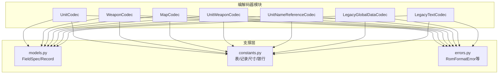
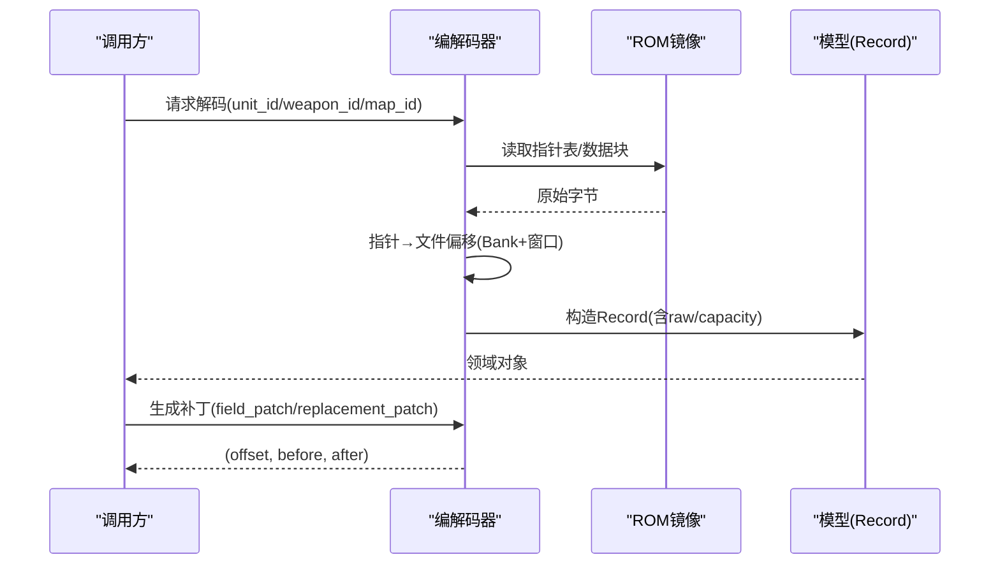
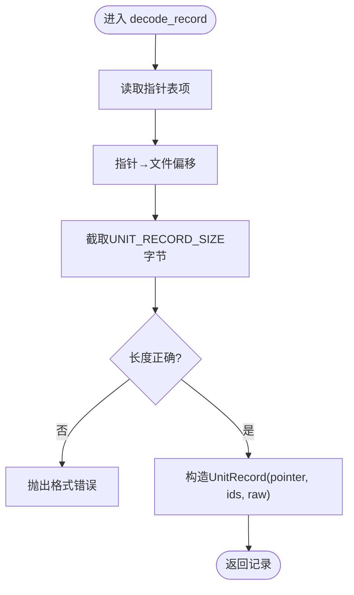
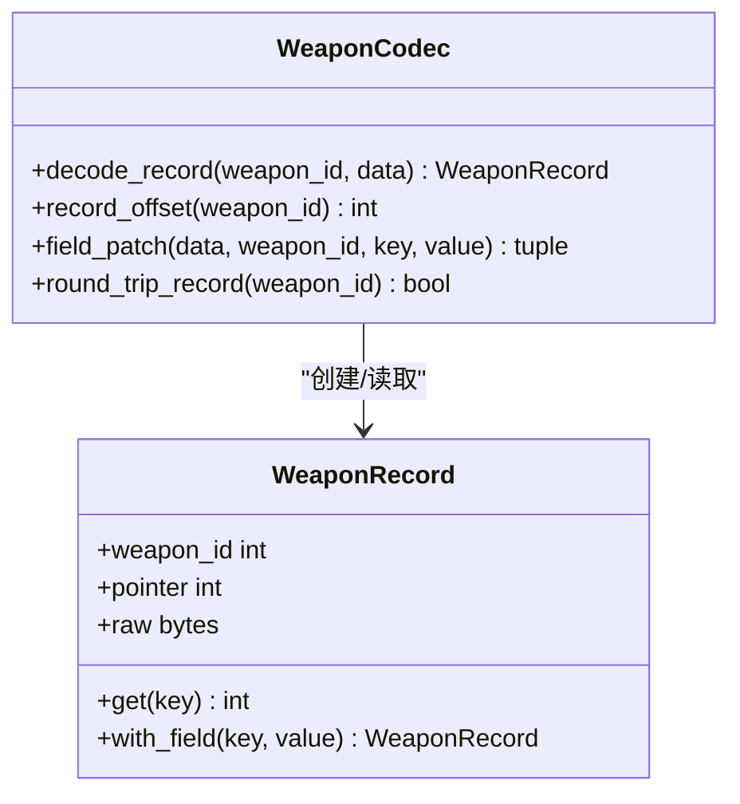
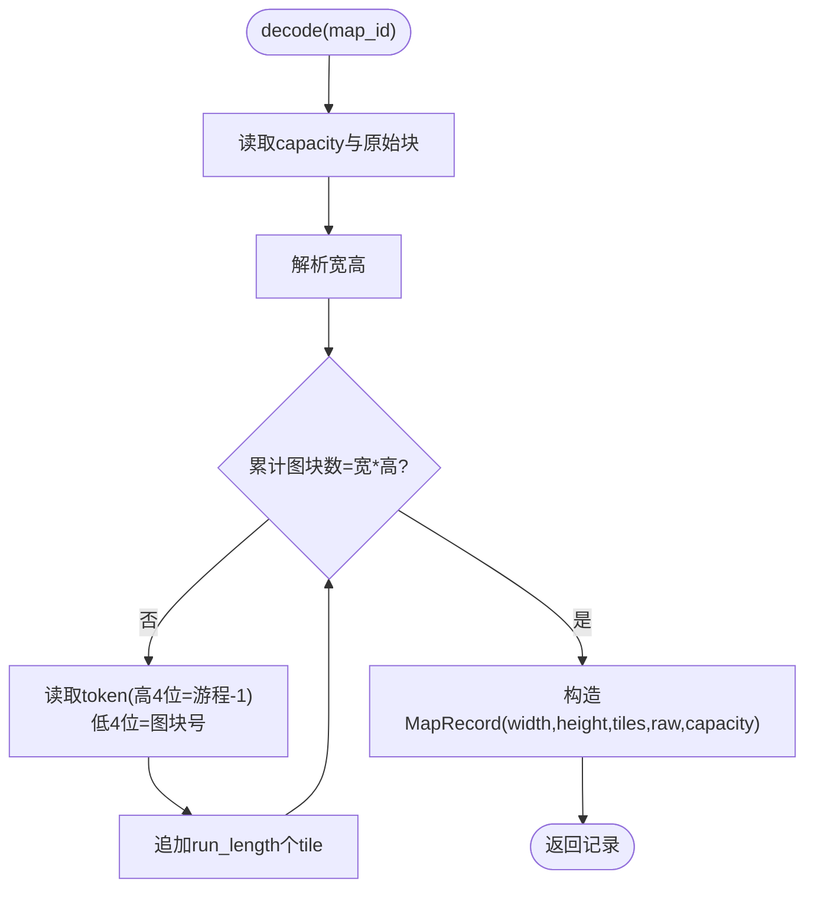
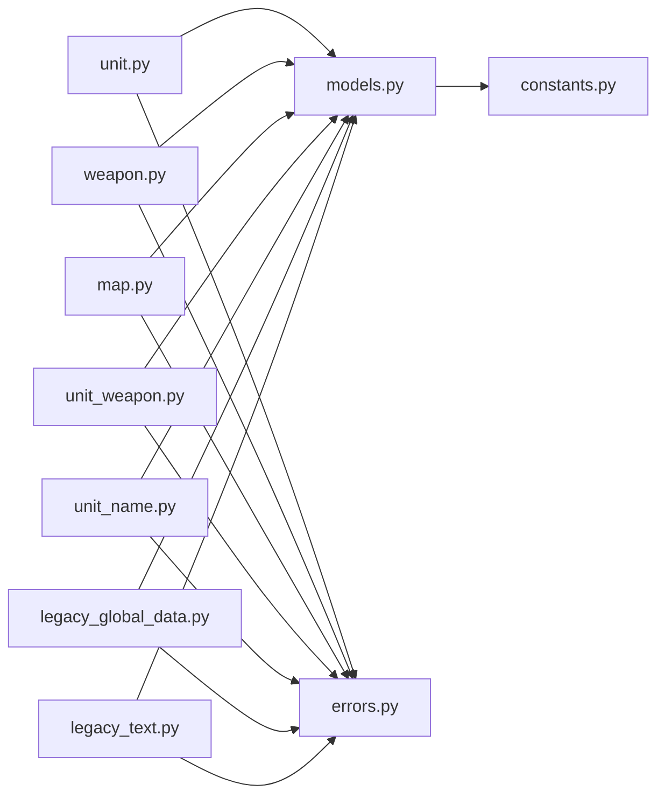

# 编解码器系统

<cite>
**本文引用的文件**
- [src/fc_editor/codecs/__init__.py](file://src/fc_editor/codecs/__init__.py)
- [src/fc_editor/codecs/unit.py](file://src/fc_editor/codecs/unit.py)
- [src/fc_editor/codecs/weapon.py](file://src/fc_editor/codecs/weapon.py)
- [src/fc_editor/codecs/map.py](file://src/fc_editor/codecs/map.py)
- [src/fc_editor/codecs/unit_weapon.py](file://src/fc_editor/codecs/unit_weapon.py)
- [src/fc_editor/codecs/unit_name.py](file://src/fc_editor/codecs/unit_name.py)
- [src/fc_editor/codecs/legacy_global_data.py](file://src/fc_editor/codecs/legacy_global_data.py)
- [src/fc_editor/codecs/legacy_text.py](file://src/fc_editor/codecs/legacy_text.py)
- [src/fc_editor/models.py](file://src/fc_editor/models.py)
- [src/fc_editor/constants.py](file://src/fc_editor/constants.py)
- [src/fc_editor/errors.py](file://src/fc_editor/errors.py)
</cite>

## 目录
1. [简介](#简介)
2. [项目结构](#项目结构)
3. [核心组件](#核心组件)
4. [架构总览](#架构总览)
5. [详细组件分析](#详细组件分析)
6. [依赖关系分析](#依赖关系分析)
7. [性能与缓存](#性能与缓存)
8. [故障排查指南](#故障排查指南)
9. [结论](#结论)
10. [附录：自定义编解码器开发指南](#附录：自定义编解码器开发指南)

## 简介
本文件系统性地梳理 DC 修改器的编解码子系统，围绕“数据格式转换、字节序处理、内存映射（CPU指针到ROM偏移）”展开，重点解释 UnitCodec、WeaponCodec、MapCodec 等具体实现，并给出扩展机制与错误恢复策略。文档同时提供可操作的自定义编解码器开发步骤与集成方式，帮助在保持 ROM 兼容性的前提下安全地读写游戏数据。

## 项目结构
编解码器位于 fc_editor/codecs 包中，通过 __init__.py 统一导出；数据模型集中在 models.py，常量定义集中在 constants.py，错误类型集中在 errors.py。各编解码器以“只读解码 + 最小化补丁”的方式工作，避免破坏 ROM 签名和固定区域。

图表来源
- [src/fc_editor/codecs/__init__.py:1-47](file://src/fc_editor/codecs/__init__.py#L1-L47)
- [src/fc_editor/models.py:13-58](file://src/fc_editor/models.py#L13-L58)
- [src/fc_editor/constants.py:12-38](file://src/fc_editor/constants.py#L12-L38)
- [src/fc_editor/errors.py:1-11](file://src/fc_editor/errors.py#L1-L11)

章节来源
- [src/fc_editor/codecs/__init__.py:1-47](file://src/fc_editor/codecs/__init__.py#L1-L47)
- [src/fc_editor/models.py:13-58](file://src/fc_editor/models.py#L13-L58)
- [src/fc_editor/constants.py:12-38](file://src/fc_editor/constants.py#L12-L38)
- [src/fc_editor/errors.py:1-11](file://src/fc_editor/errors.py#L1-L11)

## 核心组件
- FieldSpec/WeaponFieldSpec：字段级编解码抽象，支持宽度、字节序、掩码、位移、显示缩放、取值范围校验与位域写入。
- Record 对象：UnitRecord、WeaponRecord、MapRecord 等不可变数据类，封装原始字节与语义信息，并提供 with_field/tile 等安全更新方法。
- 编解码器基元能力：
  - 读取指针表并转换为文件偏移（考虑 Bank 窗口）。
  - 解码为领域对象。
  - 生成最小化补丁（before/after 字节对），便于合并与回滚。
  - round_trip 校验编解码一致性。

章节来源
- [src/fc_editor/models.py:13-58](file://src/fc_editor/models.py#L13-L58)
- [src/fc_editor/models.py:165-203](file://src/fc_editor/models.py#L165-L203)
- [src/fc_editor/models.py:309-342](file://src/fc_editor/models.py#L309-L342)

## 架构总览
下图展示典型的数据流：从 ROM 的 CPU 指针表出发，经 BankAddress 映射到文件偏移，再按记录尺寸解码为领域对象；编辑时仅输出补丁元组，不直接改写 ROM。

图表来源
- [src/fc_editor/codecs/unit.py:42-93](file://src/fc_editor/codecs/unit.py#L42-L93)
- [src/fc_editor/codecs/weapon.py:20-66](file://src/fc_editor/codecs/weapon.py#L20-L66)
- [src/fc_editor/codecs/map.py:49-173](file://src/fc_editor/codecs/map.py#L49-L173)

## 详细组件分析

### UnitCodec（机体记录编解码）
- 职责：无损解码 128 条机体指针表及记录；支持按字段补丁与往返校验。
- 关键点：
  - 指针表起始标记校验与越界检查。
  - record_offset_from_pointer 支持扩展 Bank 对（pair_first_bank）与常规 PRG 窗口。
  - field_patch 基于 FieldSpec 进行位域/字节序写入，返回精确补丁位置与前后字节。
  - round_trip_record 确保编码后与原始一致。

图表来源
- [src/fc_editor/codecs/unit.py:42-93](file://src/fc_editor/codecs/unit.py#L42-L93)

章节来源
- [src/fc_editor/codecs/unit.py:14-120](file://src/fc_editor/codecs/unit.py#L14-L120)
- [src/fc_editor/models.py:165-183](file://src/fc_editor/models.py#L165-L183)
- [src/fc_editor/constants.py:12-16](file://src/fc_editor/constants.py#L12-L16)

### WeaponCodec（武器记录编解码）
- 职责：只读解码 192 条武器指针表及记录；支持字段补丁与往返校验。
- 关键点：
  - 指针表起始标记校验与容量边界检查。
  - 使用 BankAddress 将 CPU 指针映射到文件偏移。
  - field_patch 基于 WeaponFieldSpec 完成位域与偏置值写入。

图表来源
- [src/fc_editor/codecs/weapon.py:13-90](file://src/fc_editor/codecs/weapon.py#L13-L90)
- [src/fc_editor/models.py:185-203](file://src/fc_editor/models.py#L185-L203)

章节来源
- [src/fc_editor/codecs/weapon.py:13-90](file://src/fc_editor/codecs/weapon.py#L13-L90)
- [src/fc_editor/models.py:185-203](file://src/fc_editor/models.py#L185-L203)

### MapCodec（地图地形 RLE 编解码）
- 职责：解码/编码 4-bit 地形 RLE 地图；支持容量受限替换与语义哈希。
- 关键点：
  - 指针表/Bank 目录解析，容量计算（同区严格递增、跨Bank排序）。
  - 解码过程逐 token 解析游程长度与图块编号，校验尺寸与边界。
  - encode 采用紧凑 RLE，最大游程 16；replacement_patch 保证不超过 capacity。
  - semantic_digest 用于比对逻辑内容变化。

图表来源
- [src/fc_editor/codecs/map.py:136-173](file://src/fc_editor/codecs/map.py#L136-L173)

章节来源
- [src/fc_editor/codecs/map.py:16-228](file://src/fc_editor/codecs/map.py#L16-L228)
- [src/fc_editor/models.py:309-342](file://src/fc_editor/models.py#L309-L342)
- [src/fc_editor/constants.py:29-33](file://src/fc_editor/constants.py#L29-L33)

### UnitWeaponCodec（机体武器配置）
- 职责：解码/写入每个机体固定的两个武器槽位。
- 关键点：
  - 表大小校验与武器 ID 范围校验。
  - slot_patch 返回单字节补丁位置与前后值。

章节来源
- [src/fc_editor/codecs/unit_weapon.py:11-79](file://src/fc_editor/codecs/unit_weapon.py#L11-L79)
- [src/fc_editor/models.py:288-307](file://src/fc_editor/models.py#L288-L307)

### UnitNameReferenceCodec（机体名称引用重定向）
- 职责：通过重定向到已有本地化名称实现稳定编辑。
- 关键点：
  - 指针表完整性与起始标记校验。
  - 限制指针范围至 Bank 12/13 的 16 KiB 窗口。
  - reference_patch 输出目标指针的小端写入补丁。

章节来源
- [src/fc_editor/codecs/unit_name.py:9-90](file://src/fc_editor/codecs/unit_name.py#L9-L90)

### LegacyGlobalDataCodec（已验证全局数据表）
- 职责：解码/补丁双击公式、伤害公式、命中阈值、道具效果、初始阵容、距离命中修正表、累计经验表、道具名称池等。
- 关键点：
  - 代码上下文签名校验（固定前缀/后缀），防止误改指令。
  - 文本池复制保留原布局，避免重置不一致。
  - 所有补丁均返回 (offset, before, after) 三元组，便于合并与回滚。

章节来源
- [src/fc_editor/codecs/legacy_global_data.py:17-701](file://src/fc_editor/codecs/legacy_global_data.py#L17-L701)

### LegacyTextCodec（旧版文本编解码）
- 职责：解析多组指针表与文本池，支持随机对话变体与受保护控制码保留。
- 关键点：
  - 指针合法性校验（不得指向表自身）。
  - 文本记录按结束码 $FF 截断，控制码/参数受保护。
  - replacement_patch 仅在原记录容量内写入，保留控制码序列。

章节来源
- [src/fc_editor/codecs/legacy_text.py:10-190](file://src/fc_editor/codecs/legacy_text.py#L10-L190)

## 依赖关系分析
- 编解码器依赖 models.FieldSpec/WeaponFieldSpec 完成字段级编解码，依赖 constants 获取表偏移、记录尺寸与 Bank 信息，依赖 errors 抛出格式错误。
- 指针到文件偏移的统一路径：CPU 指针 → BankAddress → 文件偏移（考虑窗口基址）。
- 各编解码器之间解耦，通过统一的补丁元组接口与上层合并。

图表来源
- [src/fc_editor/codecs/unit.py:1-120](file://src/fc_editor/codecs/unit.py#L1-L120)
- [src/fc_editor/codecs/weapon.py:1-90](file://src/fc_editor/codecs/weapon.py#L1-L90)
- [src/fc_editor/codecs/map.py:1-228](file://src/fc_editor/codecs/map.py#L1-L228)
- [src/fc_editor/codecs/unit_weapon.py:1-79](file://src/fc_editor/codecs/unit_weapon.py#L1-L79)
- [src/fc_editor/codecs/unit_name.py:1-90](file://src/fc_editor/codecs/unit_name.py#L1-L90)
- [src/fc_editor/codecs/legacy_global_data.py:1-701](file://src/fc_editor/codecs/legacy_global_data.py#L1-L701)
- [src/fc_editor/codecs/legacy_text.py:1-190](file://src/fc_editor/codecs/legacy_text.py#L1-L190)
- [src/fc_editor/models.py:1-426](file://src/fc_editor/models.py#L1-L426)
- [src/fc_editor/constants.py:1-69](file://src/fc_editor/constants.py#L1-L69)
- [src/fc_editor/errors.py:1-11](file://src/fc_editor/errors.py#L1-L11)

## 性能与缓存
- 指针表与容量预计算：
  - UnitCodec 初始化时一次性读取指针表并构建 ids_by_pointer，减少重复查找。
  - MapCodec 在构造阶段计算 capacities，避免每次解码重复计算。
- 小对象与不可变记录：
  - Record 使用 frozen dataclass，降低拷贝成本并提高安全性。
- 最小化补丁：
  - 所有写操作返回 (offset, before, after)，便于增量合并与快速回滚。
- 建议的缓存策略（概念性）：
  - 对频繁访问的指针表/容量表做进程内缓存（例如按 ROM 指纹或路径键控）。
  - 对 Map RLE 解码结果可按 map_id 缓存，但需关注容量变更时的失效策略。
  - 注意：当前实现未内置持久化缓存，需在调用侧按需实现。

[本节为通用指导，不直接分析具体文件]

## 故障排查指南
- 常见错误类型：
  - RomFormatError：ROM 布局不符合预期（如指针表不完整、起始标记不正确、记录越界、RLE 提前结束等）。
  - ProjectFormatError：项目文件格式错误或目标 ROM 不匹配。
  - ChangeConflictError：多个编辑器模块尝试写入重叠且冲突的区域。
- 定位建议：
  - 查看抛错消息中的 ID/指针/偏移，结合 constants 中的表偏移与记录尺寸核对。
  - 对于 MapCodec，检查宽高是否在 1–32 范围内，RLE 游程是否越界。
  - 对于 LegacyGlobalDataCodec，确认代码上下文签名是否匹配，避免被其他修改破坏。
- 恢复策略：
  - 使用 round_trip_* 方法验证编解码一致性。
  - 利用补丁元组的 before/after 进行差异对比与回滚。

章节来源
- [src/fc_editor/errors.py:1-11](file://src/fc_editor/errors.py#L1-L11)
- [src/fc_editor/codecs/map.py:136-173](file://src/fc_editor/codecs/map.py#L136-L173)
- [src/fc_editor/codecs/legacy_global_data.py:183-269](file://src/fc_editor/codecs/legacy_global_data.py#L183-L269)

## 结论
该编解码系统以“字段级抽象 + 不可变记录 + 最小化补丁”为核心设计，兼顾了安全性、可维护性与可扩展性。通过严格的指针与边界校验、上下文签名验证以及 round_trip 保障，能够在复杂 ROM 布局下稳定工作。未来可在调用侧引入进程内缓存进一步提升性能，并通过统一的补丁接口实现更复杂的批量编辑与版本管理。

[本节为总结性内容，不直接分析具体文件]

## 附录：自定义编解码器开发指南
- 步骤概览：
  1. 定义字段规范：
     - 使用 FieldSpec 或 WeaponFieldSpec 描述字段偏移、宽度、字节序、掩码、位移、取值范围等。
     - 若存在位域或偏置，务必设置 mask/shift/value_bias。
  2. 定义记录模型：
     - 使用 frozen dataclass 封装 raw/capacity 与必要语义字段，提供 with_* 安全更新方法。
  3. 实现编解码器类：
     - 初始化时读取指针表/容量表并缓存。
     - 实现 decode/encode 与至少一个 patch 方法（如 field_patch/replacement_patch），返回 (offset, before, after)。
     - 实现 round_trip_* 校验编解码一致性。
  4. 注册导出：
     - 在 codecs/__init__.py 中导入并加入 __all__，以便上层统一发现。
- 示例参考路径（不包含代码内容）：
  - 字段与记录模型：[src/fc_editor/models.py:13-58](file://src/fc_editor/models.py#L13-L58)、[src/fc_editor/models.py:165-203](file://src/fc_editor/models.py#L165-L203)、[src/fc_editor/models.py:309-342](file://src/fc_editor/models.py#L309-L342)
  - 指针与常量：[src/fc_editor/constants.py:12-38](file://src/fc_editor/constants.py#L12-L38)
  - 错误类型：[src/fc_editor/errors.py:1-11](file://src/fc_editor/errors.py#L1-L11)
  - 现有实现参考：
    - 机体：[src/fc_editor/codecs/unit.py:14-120](file://src/fc_editor/codecs/unit.py#L14-L120)
    - 武器：[src/fc_editor/codecs/weapon.py:13-90](file://src/fc_editor/codecs/weapon.py#L13-L90)
    - 地图：[src/fc_editor/codecs/map.py:16-228](file://src/fc_editor/codecs/map.py#L16-L228)
    - 武器配置：[src/fc_editor/codecs/unit_weapon.py:11-79](file://src/fc_editor/codecs/unit_weapon.py#L11-L79)
    - 名称引用：[src/fc_editor/codecs/unit_name.py:9-90](file://src/fc_editor/codecs/unit_name.py#L9-L90)
    - 全局数据：[src/fc_editor/codecs/legacy_global_data.py:17-701](file://src/fc_editor/codecs/legacy_global_data.py#L17-L701)
    - 文本：[src/fc_editor/codecs/legacy_text.py:10-190](file://src/fc_editor/codecs/legacy_text.py#L10-L190)
  - 导出入口：[src/fc_editor/codecs/__init__.py:1-47](file://src/fc_editor/codecs/__init__.py#L1-L47)

[本节为概念性指导，不直接分析具体文件]