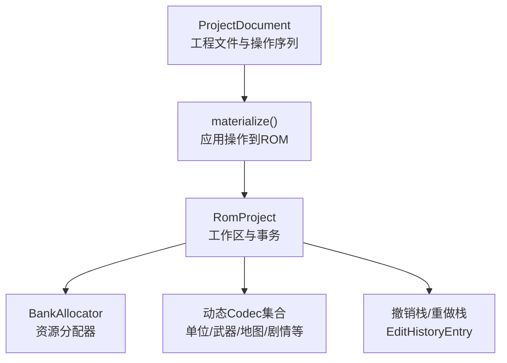
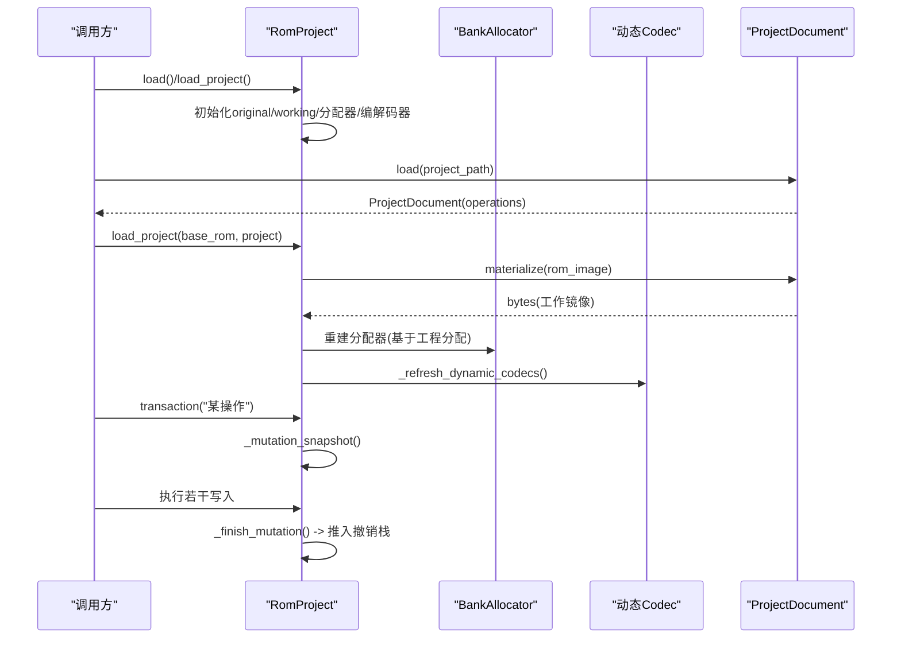
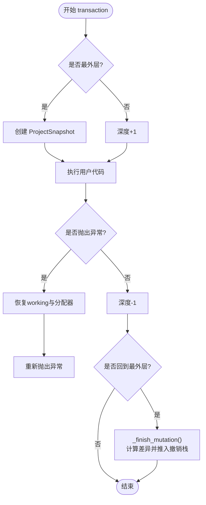
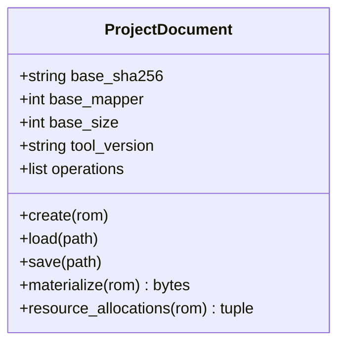
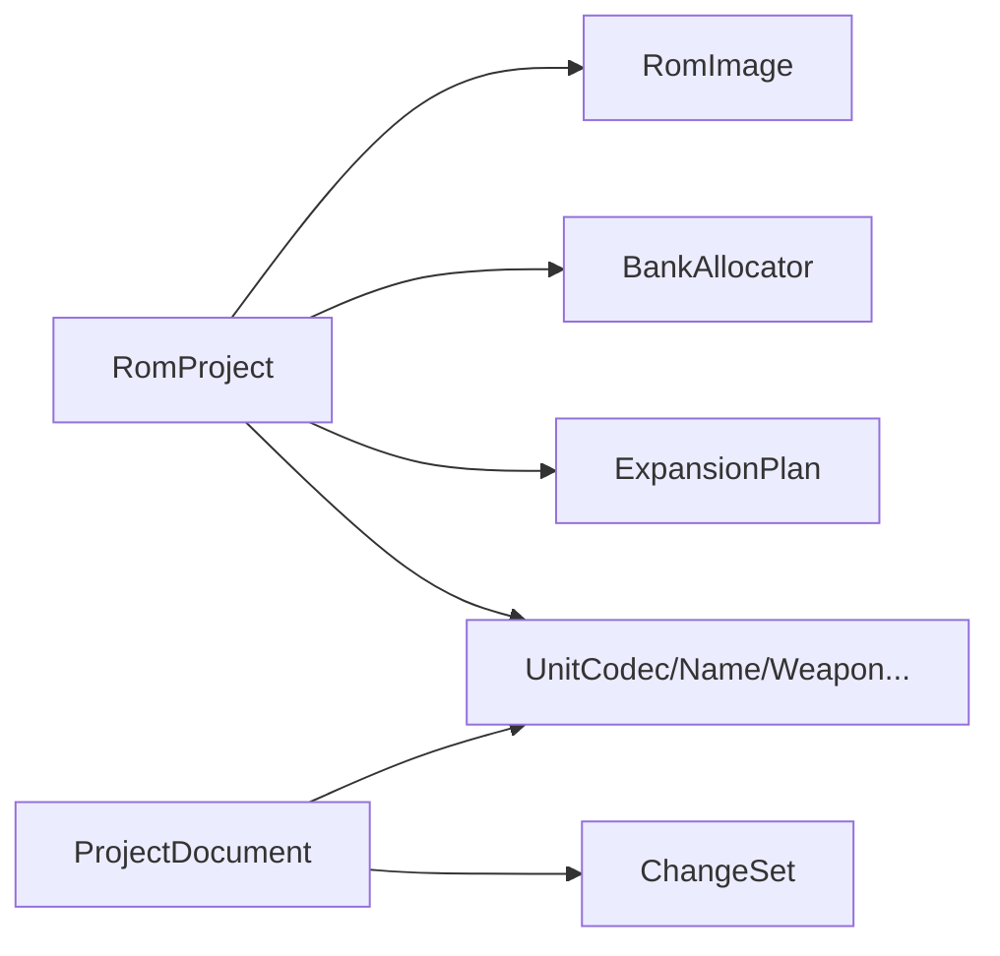

# 项目管理核心

<cite>
**本文引用的文件**
- [fc_rom_editor_core.py](file://src/fc_rom_editor_core.py)
- [project.py](file://src/fc_editor/project.py)
</cite>

## 目录
1. [简介](#简介)
2. [项目结构](#项目结构)
3. [核心组件](#核心组件)
4. [架构总览](#架构总览)
5. [详细组件分析](#详细组件分析)
6. [依赖关系分析](#依赖关系分析)
7. [性能考虑](#性能考虑)
8. [故障排查指南](#故障排查指南)
9. [结论](#结论)
10. [附录：关键流程示例与路径](#附录：关键流程示例与路径)

## 简介
本文件聚焦 DC 修改器的“项目管理核心”，围绕 RomProject 类展开，系统阐述其在 ROM 编辑会话管理、事务处理机制、状态同步策略方面的职责；解释 EditPatch、EditHistoryEntry、ProjectSnapshot 等数据结构的设计原理；说明撤销/重做实现（含事务边界控制、快照管理与内存优化）；并给出项目加载、保存、构建流程中的关键步骤与错误处理、资源清理、并发安全注意事项。

## 项目结构
RomProject 位于 fc_rom_editor_core.py，承担“工作区”角色：维护原始镜像、工作副本、资源分配器、动态编解码器以及撤销/重做历史。ProjectDocument 位于 fc_editor/project.py，负责持久化工程元数据与操作序列，并在 materialize 阶段将操作应用到基准 ROM，生成可构建的工作镜像。

图表来源
- [fc_rom_editor_core.py:463-785](file://src/fc_rom_editor_core.py#L463-L785)
- [project.py:48-121](file://src/fc_editor/project.py#L48-L121)
- [project.py:434-832](file://src/fc_editor/project.py#L434-L832)

章节来源
- [fc_rom_editor_core.py:463-785](file://src/fc_rom_editor_core.py#L463-L785)
- [project.py:48-121](file://src/fc_editor/project.py#L48-L121)
- [project.py:434-832](file://src/fc_editor/project.py#L434-L832)

## 核心组件
- RomProject：封装 ROM 工作区、扩展容量规划、资源分配、动态编解码器绑定、撤销/重做、导入/导出扩展资源、各类数据写入与还原。
- ProjectDocument：以 JSON 形式记录基准 ROM 信息与一系列原子操作，支持迁移、校验与材料化。
- 撤销/重做三件套：
  - EditPatch：记录一段字节偏移的 before/after 差异。
  - EditHistoryEntry：一次用户可见操作的完整描述，包含补丁与分配前后状态。
  - ProjectSnapshot：事务级快照，包含工作镜像与资源分配快照。

章节来源
- [fc_rom_editor_core.py:112-141](file://src/fc_rom_editor_core.py#L112-L141)
- [fc_rom_editor_core.py:463-785](file://src/fc_rom_editor_core.py#L463-L785)
- [project.py:48-121](file://src/fc_editor/project.py#L48-L121)

## 架构总览
RomProject 在构造时根据 ROM 头与扩展计划初始化基础编解码器，随后通过 transaction() 包裹一组变更，最终通过 _finish_mutation() 计算差异并推入撤销栈。ProjectDocument 提供跨进程/跨会话的可复现操作集，materialize() 会按序应用字段设置、名称引用、地图/场景替换、资源分配等操作，产出新的工作镜像供 RomProject 使用。

图表来源
- [fc_rom_editor_core.py:638-674](file://src/fc_rom_editor_core.py#L638-L674)
- [fc_rom_editor_core.py:692-785](file://src/fc_rom_editor_core.py#L692-L785)
- [project.py:434-832](file://src/fc_editor/project.py#L434-L832)

## 详细组件分析

### RomProject：会话、事务与状态同步
- 会话管理
  - 维护 original（只读基准）、working（可变工作镜像）。
  - 根据 ExpansionPlan 动态切换 unit/map/story 等编解码器，保证后续读写始终指向正确位置。
- 事务处理
  - transaction(description) 作为原子边界：进入时记录 ProjectSnapshot，异常时回滚 working 与 BankAllocator，确保一致性。
  - 非最外层嵌套仅计数，避免重复快照。
- 状态同步
  - _refresh_dynamic_codecs() 在容量规划或指针变化后重新绑定编解码器，使上层 API 无需感知底层布局变化。
  - _write_expansion_plan() 将规划表写回固定偏移，保证后续读取一致。
- 撤销/重做
  - _diff_patches() 对 before/after 进行块级差分，减少历史体积。
  - EditHistoryEntry 同时记录 allocations_before/after，以便恢复资源分配状态。
  - undo()/redo() 通过 Apply Patch 与重建分配器完成状态跳转。

图表来源
- [fc_rom_editor_core.py:714-744](file://src/fc_rom_editor_core.py#L714-L744)
- [fc_rom_editor_core.py:692-712](file://src/fc_rom_editor_core.py#L692-L712)

章节来源
- [fc_rom_editor_core.py:463-785](file://src/fc_rom_editor_core.py#L463-L785)
- [fc_rom_editor_core.py:836-933](file://src/fc_rom_editor_core.py#L836-L933)

### 数据结构设计：EditPatch / EditHistoryEntry / ProjectSnapshot
- EditPatch
  - 记录 offset、before、after，用于最小化撤销/重做的字节覆盖。
- EditHistoryEntry
  - description：人类可读的操作名。
  - patches：该操作产生的所有字节差异。
  - allocations_before/after：资源分配的前后状态，确保撤销/重做能恢复正确的分配布局。
- ProjectSnapshot
  - data：工作镜像的不可变拷贝。
  - allocations：当前资源分配快照。
  - 仅在非事务中捕获，避免重复开销。

章节来源
- [fc_rom_editor_core.py:112-141](file://src/fc_rom_editor_core.py#L112-L141)
- [fc_rom_editor_core.py:692-712](file://src/fc_rom_editor_core.py#L692-L712)

### ProjectDocument：工程文件与操作材料化
- 工程文件
  - 记录 base（sha256/mapper/size）、toolVersion、operations。
  - 支持 schema 迁移与严格校验。
- 操作类型
  - 字段设置、名称引用、地图/场景替换、资源分配、原始补丁等。
- 材料化
  - materialize() 依据 operations 顺序应用变更，使用 ChangeSet 累积补丁，遇到不匹配则抛出格式错误。

图表来源
- [project.py:48-121](file://src/fc_editor/project.py#L48-L121)
- [project.py:434-832](file://src/fc_editor/project.py#L434-L832)

章节来源
- [project.py:48-121](file://src/fc_editor/project.py#L48-L121)
- [project.py:434-832](file://src/fc_editor/project.py#L434-L832)

### 撤销/重做：边界控制、快照与内存优化
- 事务边界
  - 最外层才记录快照；嵌套事务仅计数，避免重复快照。
  - 异常路径回滚 working 与 BankAllocator，并刷新动态编解码器。
- 快照与差异
  - 使用 _diff_patches() 将连续差异压缩为 EditPatch 列表，显著降低历史大小。
  - 若无差异且分配未变化，直接丢弃本次历史项。
- 内存优化
  - 只在必要时复制 working；撤销/重做通过原地覆盖与重建分配器恢复状态。
  - 资源分配快照与补丁分离，避免重复存储全量镜像。

章节来源
- [fc_rom_editor_core.py:676-785](file://src/fc_rom_editor_core.py#L676-L785)

### 项目加载、保存、构建流程关键点
- 加载
  - RomProject.load()：从路径读取 ROM 字节并构造工作区。
  - RomProject.load_project()：加载工程文件，materialize 得到工作镜像，重建分配器并刷新编解码器，最后执行完整性校验。
- 保存
  - ProjectDocument.save()：将 base 与 operations 序列化为 JSON。
- 构建
  - 由上层构建流程调用 RomProject 的写入接口（如 set_*），并通过 transaction() 保证原子性；最终输出 ROM/IPS/报告等产物由上层工具链负责。

章节来源
- [fc_rom_editor_core.py:638-674](file://src/fc_rom_editor_core.py#L638-L674)
- [project.py:114-121](file://src/fc_editor/project.py#L114-L121)
- [project.py:434-832](file://src/fc_editor/project.py#L434-L832)

## 依赖关系分析
- RomProject 依赖
  - RomImage：提供 profile、数据与校验信息。
  - BankAllocator：管理 PRG 分区与资源分配。
  - 各 Codec：单位、武器、地图、剧情、文本等编解码器，随 ExpansionPlan 动态切换。
  - ExpansionPlan：容量规划与标志位，决定启用哪些扩展能力。
- ProjectDocument 依赖
  - ChangeSet：累积并应用补丁。
  - 各 Codec：在 materialize 过程中解码/编码记录并生成补丁。

图表来源
- [fc_rom_editor_core.py:463-618](file://src/fc_rom_editor_core.py#L463-L618)
- [project.py:434-832](file://src/fc_editor/project.py#L434-L832)

章节来源
- [fc_rom_editor_core.py:463-618](file://src/fc_rom_editor_core.py#L463-L618)
- [project.py:434-832](file://src/fc_editor/project.py#L434-L832)

## 性能考虑
- 差异压缩：_diff_patches() 将连续差异合并为单个 EditPatch，减少历史条目数量与内存占用。
- 按需快照：仅在非事务中捕获 ProjectSnapshot，避免频繁深拷贝。
- 动态编解码器：仅在必要时刷新，减少不必要的对象重建。
- 资源分配：通过 BankAllocator 集中管理，避免分散状态导致的额外拷贝。

[本节为通用性能建议，不直接分析具体文件]

## 故障排查指南
- 工程文件版本不匹配或格式错误
  - 现象：加载工程时报错。
  - 定位：ProjectDocument.load() 的版本迁移与字段校验。
- 基准 ROM 不一致
  - 现象：materialize() 或 load_project() 报格式错误。
  - 定位：ProjectDocument._validate_base() 比较 sha256/mapper/size。
- 自动容量规划限制
  - 现象：configure_expansion() 抛出值错误。
  - 定位：仅支持特定基准 ROM；已分配容量或已有手工资源时需先撤销/删除。
- 地图/剧情/事件扩展不完整
  - 现象：刷新动态编解码器时报错。
  - 定位：需要同时启用地图、部署、事件标志。
- 名称/指针无效
  - 现象：设置名称引用时报错。
  - 定位：名称引用必须指向已验证区域；超出范围或无结束符会报错。

章节来源
- [project.py:60-100](file://src/fc_editor/project.py#L60-L100)
- [project.py:400-432](file://src/fc_editor/project.py#L400-L432)
- [fc_rom_editor_core.py:1327-1434](file://src/fc_rom_editor_core.py#L1327-L1434)
- [fc_rom_editor_core.py:836-933](file://src/fc_rom_editor_core.py#L836-L933)

## 结论
RomProject 通过“工作镜像 + 资源分配器 + 动态编解码器 + 事务化撤销/重做”的组合，提供了稳定、可回滚、可扩展的 ROM 编辑会话管理能力。ProjectDocument 则以声明式操作序列实现了工程文件的跨会话复用与可重现构建。二者协同，使得 DC 修改器在处理复杂 ROM 结构时具备高内聚、低耦合、强一致性的核心能力。

[本节为总结性内容，不直接分析具体文件]

## 附录：关键流程示例与路径
- 项目加载
  - 从 ROM 加载：RomProject.load()
  - 从工程加载：RomProject.load_project()
- 工程保存
  - ProjectDocument.save()
- 构建与输出
  - 通过 RomProject 的 set_* 方法写入数据，结合 transaction() 保证原子性；最终产物由上层构建流程生成。
- 撤销/重做
  - undo()/redo()：基于 EditHistoryEntry 的补丁与分配状态恢复。
- 资源导入/删除
  - import_expansion_resource()/remove_expansion_resource()：在事务中更新 working 与分配器。

章节来源
- [fc_rom_editor_core.py:638-674](file://src/fc_rom_editor_core.py#L638-L674)
- [fc_rom_editor_core.py:761-785](file://src/fc_rom_editor_core.py#L761-L785)
- [fc_rom_editor_core.py:1440-1484](file://src/fc_rom_editor_core.py#L1440-L1484)
- [project.py:114-121](file://src/fc_editor/project.py#L114-L121)