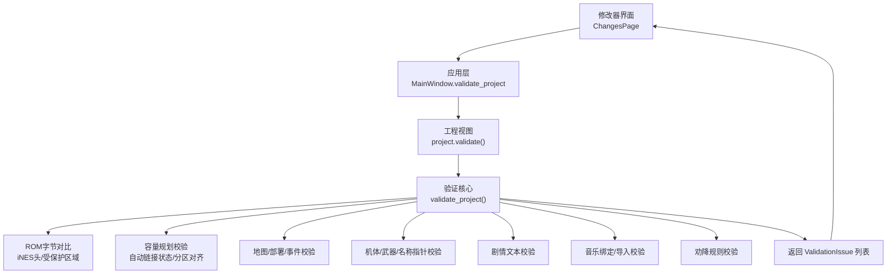
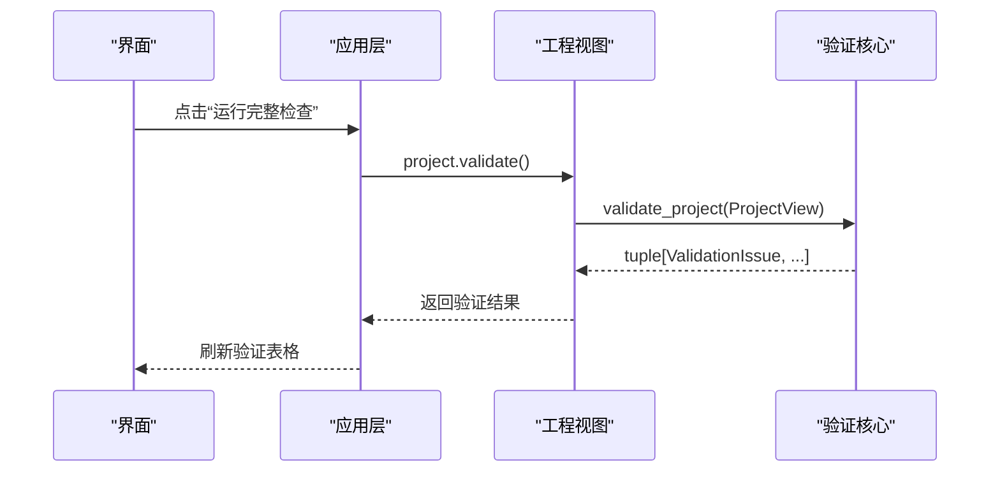
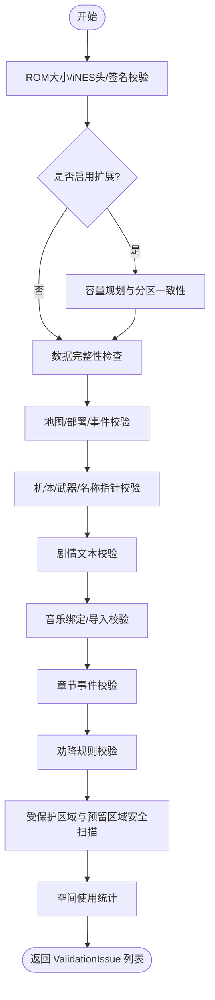
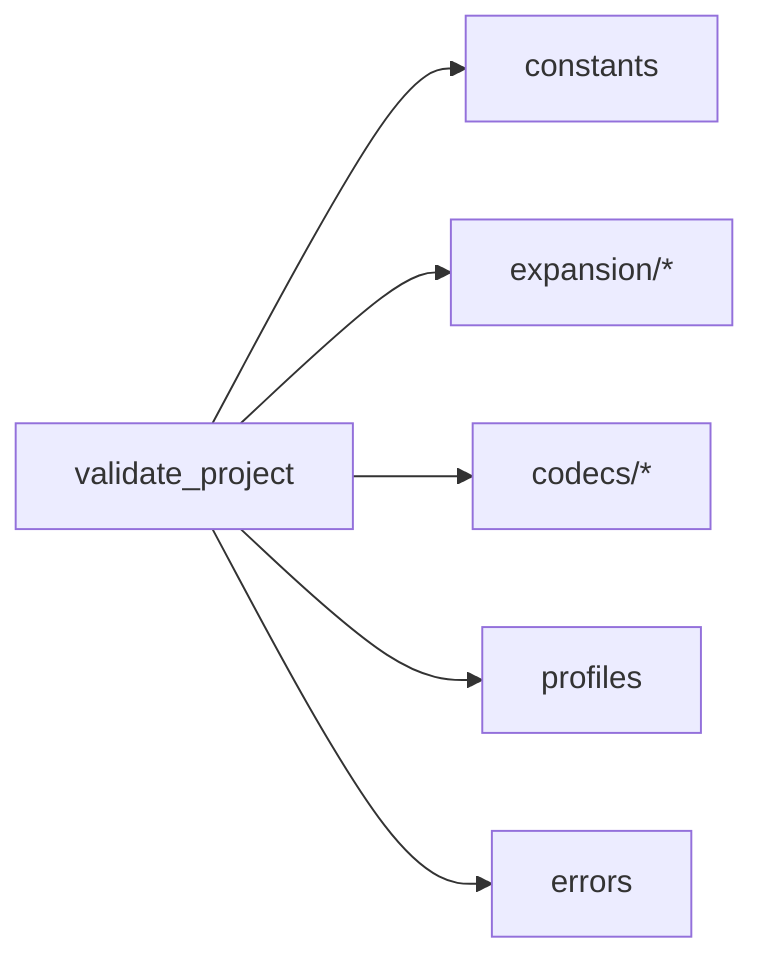

# 验证服务

<cite>
**本文引用的文件**
- [validation.py](file://src/fc_editor/services/validation.py)
- [app.py](file://src/dc_modifier/app.py)
- [pages.py](file://src/dc_modifier/pages.py)
- [errors.py](file://src/fc_editor/errors.py)
- [constants.py](file://src/fc_editor/constants.py)
- [project.py](file://src/fc_editor/project.py)
</cite>

## 目录
1. [简介](#简介)
2. [项目结构](#项目结构)
3. [核心组件](#核心组件)
4. [架构总览](#架构总览)
5. [详细组件分析](#详细组件分析)
6. [依赖关系分析](#依赖关系分析)
7. [性能考虑](#性能考虑)
8. [故障排查指南](#故障排查指南)
9. [结论](#结论)
10. [附录：自定义验证规则集成示例](#附录自定义验证规则集成示例)

## 简介
本文件面向DC修改器的“验证服务”，系统性说明 ValidationIssue 异常体系、validate_project 函数的验证规则与检查逻辑，覆盖数据完整性验证、业务规则检查和格式验证的实现机制。同时提供在UI中查看与处理验证结果的方式，并给出如何扩展自定义验证规则的实践指引。

## 项目结构
验证能力由以下模块协同完成：
- 验证核心：位于 services/validation.py，定义 ValidationIssue、ProjectView 协议与 validate_project 主流程。
- UI入口：dc_modifier/app.py 暴露 validate_project 方法触发验证；dc_modifier/pages.py 的 ChangesPage 负责展示变更与验证结果。
- 错误类型：fc_editor/errors.py 定义 ROM/项目/冲突等错误类型。
- 常量与配置：fc_editor/constants.py 提供ROM布局、Bank大小、受保护区域等常量。
- 工程视图：fc_editor/project.py 实现 ProjectView 协议（通过 project.validate() 暴露给UI调用）。

图表来源
- [app.py:1028-1031](file://src/dc_modifier/app.py#L1028-L1031)
- [pages.py:2381-2401](file://src/dc_modifier/pages.py#L2381-L2401)
- [validation.py:142-682](file://src/fc_editor/services/validation.py#L142-L682)

章节来源
- [app.py:1028-1031](file://src/dc_modifier/app.py#L1028-L1031)
- [pages.py:2324-2401](file://src/dc_modifier/pages.py#L2324-L2401)
- [validation.py:85-140](file://src/fc_editor/services/validation.py#L85-L140)

## 核心组件
- ValidationIssue：不可变的数据类，包含 severity（error/warning/info）、module（模块名）、message（人类可读消息）。用于统一表达所有验证结果。
- ProjectView：Protocol 定义了验证所需的最小接口，包括原始/工作ROM、各类编解码器、计数、分配信息以及读取各资源的方法。
- validate_project(project)：主验证函数，按顺序执行ROM级、容量规划、地图/部署/事件、机体/武器/名称、剧情文本、音乐、章节事件、劝降规则、安全区域与空间统计等检查，收集 ValidationIssue 并返回元组。

章节来源
- [validation.py:85-140](file://src/fc_editor/services/validation.py#L85-L140)
- [validation.py:142-682](file://src/fc_editor/services/validation.py#L142-L682)

## 架构总览
validate_project 采用“分阶段、可组合”的检查流水线：先做ROM结构与签名校验，再根据是否启用扩展进行容量规划与分区一致性检查，随后逐项校验各子系统（地图、部署、事件、机体、武器、名称、剧情、音乐、章节事件、劝降），最后对受保护区域与预留区域进行安全扫描，并输出空间使用统计。任何子步骤抛出 ValueError/RomFormatError 都会被捕获并转为 ValidationIssue。

图表来源
- [pages.py:2381-2401](file://src/dc_modifier/pages.py#L2381-L2401)
- [app.py:1028-1031](file://src/dc_modifier/app.py#L1028-L1031)
- [validation.py:142-682](file://src/fc_editor/services/validation.py#L142-L682)

## 详细组件分析

### ValidationIssue 异常体系
- 设计要点
  - 不可变数据类，便于跨层传递且避免副作用。
  - 三级严重度：error（阻断构建）、warning（提示风险）、info（通过/统计）。
  - 模块字段便于分类过滤与展示。
- 使用方式
  - 各校验分支在发现异常时构造 ValidationIssue 并追加到 issues 列表。
  - 最终返回 tuple，供上层渲染为表格行。

章节来源
- [validation.py:85-90](file://src/fc_editor/services/validation.py#L85-L90)
- [validation.py:142-682](file://src/fc_editor/services/validation.py#L142-L682)

### validate_project 验证规则与检查逻辑
- ROM与签名
  - 比较 working 与 original 长度与iNES头，防止非法扩容或Mapper变化。
  - 针对 DC_EXPANDED_MMC3_PROFILE，校验固定代码签名，若失败则报告安全错误。
- 容量规划与分区一致性
  - 校验自动链接标志位是否完整。
  - 解析 expansion_allocations，检查未知分区、Bank对齐、登记与计划的一致性。
  - 地图扩展：校验资源引用未越界，计算打包后占用并与容量对比。
  - 机体扩展：校验分区大小、选择器绑定、核心/配置代码镜像一致性、载荷有效性。
  - 剧情扩展：校验故事选择器与分配的 Bank pair 绑定。
- 数据完整性与格式验证
  - 机体记录长度、武器记录长度。
  - 名称指针必须指向已验证的原生名称（单位/武器/人物）。
  - 地图压缩后不超容量；场景布局经 codec 校验且编码后不超容量。
  - 地图事件条目经 codec 校验，共享池占用不超过容量。
  - 剧情文本长度不变、独立 FF 结束码位置正确。
  - 战斗音乐命令必须在当前引擎支持集合内；扩展曲槽验证FamiStudio数据。
  - 章节脚本指令与可视化动作数量统计。
  - 劝降规则去重与范围校验。
- 安全与空间统计
  - 遍历 profile.protected_prg_regions，检测未允许的修改。
  - 遍历 profile.free_prg_regions，检测未登记的直接写入。
  - 输出托管扩展空间统计信息。

图表来源
- [validation.py:142-682](file://src/fc_editor/services/validation.py#L142-L682)

章节来源
- [validation.py:142-682](file://src/fc_editor/services/validation.py#L142-L682)
- [constants.py:4-69](file://src/fc_editor/constants.py#L4-L69)

### 数据完整性验证
- 记录长度：机体记录应为固定长度，武器记录应为固定长度。
- 指针合法性：名称指针需指向已验证的原生名称集合或源ID集合。
- 编码容量：地图、部署、事件、剧情文本等编码后不得超出目标容量。
- 终止符：剧情文本需具备独立的 FF 结束码且位置正确。

章节来源
- [validation.py:358-427](file://src/fc_editor/services/validation.py#L358-L427)
- [validation.py:429-548](file://src/fc_editor/services/validation.py#L429-L548)

### 业务规则检查
- 自动链接状态：必须包含地图、场景、触发器、机体的标志位。
- 分区登记：资源分配需与容量表一致，且按 Bank 对齐。
- 资源绑定：机体/剧情资源选择器必须绑定到对应分区。
- 代码镜像：核心与配置代码需在保留范围内与源代码一致。
- 音乐命令：仅允许当前音频引擎支持的命令。
- 劝降规则：同一场景/劝说者/目标组合不得重复。

章节来源
- [validation.py:173-356](file://src/fc_editor/services/validation.py#L173-L356)
- [validation.py:550-623](file://src/fc_editor/services/validation.py#L550-L623)

### 格式验证
- iNES头与ROM大小：禁止改变容量、Mapper或镜像标志。
- 扩展格式：地图/事件/部署等通过各自 codec 的 validate_* 与 encode 进行格式校验。
- 项目文件格式：由上层加载时校验（ProjectFormatError）。

章节来源
- [validation.py:146-171](file://src/fc_editor/services/validation.py#L146-L171)
- [validation.py:429-512](file://src/fc_editor/services/validation.py#L429-L512)
- [errors.py:1-11](file://src/fc_editor/errors.py#L1-L11)

### 验证结果处理与用户友好展示
- UI入口：MainWindow.validate_project 触发验证并打开“变更与验证”页。
- 展示逻辑：ChangesPage.run_validation 调用 project.validate()，将 ValidationIssue 映射为表格行，按严重度着色，并在底部显示通过/错误数摘要。
- 交互建议：错误必须全部处理才能继续构建；警告与建议性信息用于指导优化。

章节来源
- [app.py:1028-1031](file://src/dc_modifier/app.py#L1028-L1031)
- [pages.py:2381-2401](file://src/dc_modifier/pages.py#L2381-L2401)

## 依赖关系分析
- 验证核心依赖：
  - 常量：ROM布局、Bank大小、受保护区域等。
  - 扩展模块：地图/剧情/机体的扩展读写与校验。
  - 编解码器：地图、部署、事件、剧情、音乐、名称等。
  - 配置文件：profile 中的 protected/free 区域与特性开关。
- 耦合与内聚：
  - validate_project 高内聚地组织各子系统校验，通过 ProjectView 解耦具体工程实现。
  - 错误类型集中管理，便于上层统一捕获与转换。

图表来源
- [validation.py:1-41](file://src/fc_editor/services/validation.py#L1-L41)
- [constants.py:4-69](file://src/fc_editor/constants.py#L4-L69)
- [errors.py:1-11](file://src/fc_editor/errors.py#L1-L11)

章节来源
- [validation.py:1-41](file://src/fc_editor/services/validation.py#L1-L41)
- [constants.py:4-69](file://src/fc_editor/constants.py#L4-L69)
- [errors.py:1-11](file://src/fc_editor/errors.py#L1-L11)

## 性能考虑
- 字节级比较仅在必要时进行（如iNES头、受保护区域），避免全量比对。
- 使用 codec 的 validate/encode 快速判断容量与格式，减少二次解析。
- 地图/事件共享池占用计算复用已解析的结构，降低重复开销。
- 建议在大规模批量验证时缓存中间结果（如资源引用集合）以减少重复计算。

## 故障排查指南
- ROM大小或iNES头被修改
  - 现象：出现“输出 ROM 大小发生变化”或“iNES 头被修改”。
  - 处理：恢复基准ROM或使用工具生成合法ROM后再编辑。
- 认证固定代码签名不匹配
  - 现象：安全错误提示签名不匹配。
  - 处理：确保未直接修改受保护区域；如需修改，遵循资源选择器绑定规则。
- 容量规划不完整或分区不一致
  - 现象：自动链接状态不完整、分区登记不一致。
  - 处理：重新运行自动链接，确保分区按 Bank 对齐且与计划一致。
- 资源选择器未绑定
  - 现象：机体/剧情资源选择器未绑定到分区。
  - 处理：修正资源选择器指向正确的分区。
- 名称指针无效
  - 现象：名称指针未指向已验证的原生名称。
  - 处理：使用内置名称或确保指针指向有效名称区。
- 压缩后超容量
  - 现象：地图/部署/事件编码后超过容量。
  - 处理：精简内容或调整布局以符合容量限制。
- 剧情文本格式错误
  - 现象：缺少独立 FF 结束码或结束码后仍有数据。
  - 处理：修正文本结尾，确保仅有一个独立 FF 结束码。
- 音乐命令不受支持
  - 现象：音乐命令不在当前引擎支持集合。
  - 处理：替换为受支持的命令或升级音频引擎。
- 劝降规则重复
  - 现象：同一场景/劝说者/目标组合重复。
  - 处理：删除或合并重复规则。

章节来源
- [validation.py:146-682](file://src/fc_editor/services/validation.py#L146-L682)
- [errors.py:1-11](file://src/fc_editor/errors.py#L1-L11)

## 结论
验证服务通过统一的 ValidationIssue 体系与分阶段的 validate_project 流程，全面覆盖ROM结构、容量规划、数据完整性、业务规则与格式校验，并提供友好的UI展示与统计。该设计既保证了ROM的安全性与一致性，也为扩展新的验证规则提供了清晰的接入点。

## 附录：自定义验证规则集成示例
- 目标：在不改动现有验证核心的前提下，添加一条针对特定资源的自定义检查。
- 步骤
  1. 在 ProjectView 中新增一个读取方法（例如 get_custom_resource(slot)），以便验证核心访问新资源。
  2. 在 validate_project 末尾增加一个分支：
     - 获取资源并执行自定义检查。
     - 若发现问题，构造 ValidationIssue(severity="error"/"warning", module="自定义模块", message="...") 并追加到 issues。
  3. 若需要访问扩展分配信息，可通过 project.expansion_allocations 与 project.profile 进行上下文判断。
  4. 在 UI 层无需改动，ChangesPage 会自动显示新增的验证结果。
- 注意事项
  - 保持 ValidationIssue 的不可变性与语义清晰。
  - 对于可能抛出的异常，使用 try/except 捕获并转换为 ValidationIssue，避免中断整体验证。
  - 若涉及受保护区域或预留区域，请谨慎评估是否允许修改，并在 message 中给出明确修复指引。

章节来源
- [validation.py:85-140](file://src/fc_editor/services/validation.py#L85-L140)
- [validation.py:142-682](file://src/fc_editor/services/validation.py#L142-L682)
- [pages.py:2381-2401](file://src/dc_modifier/pages.py#L2381-L2401)