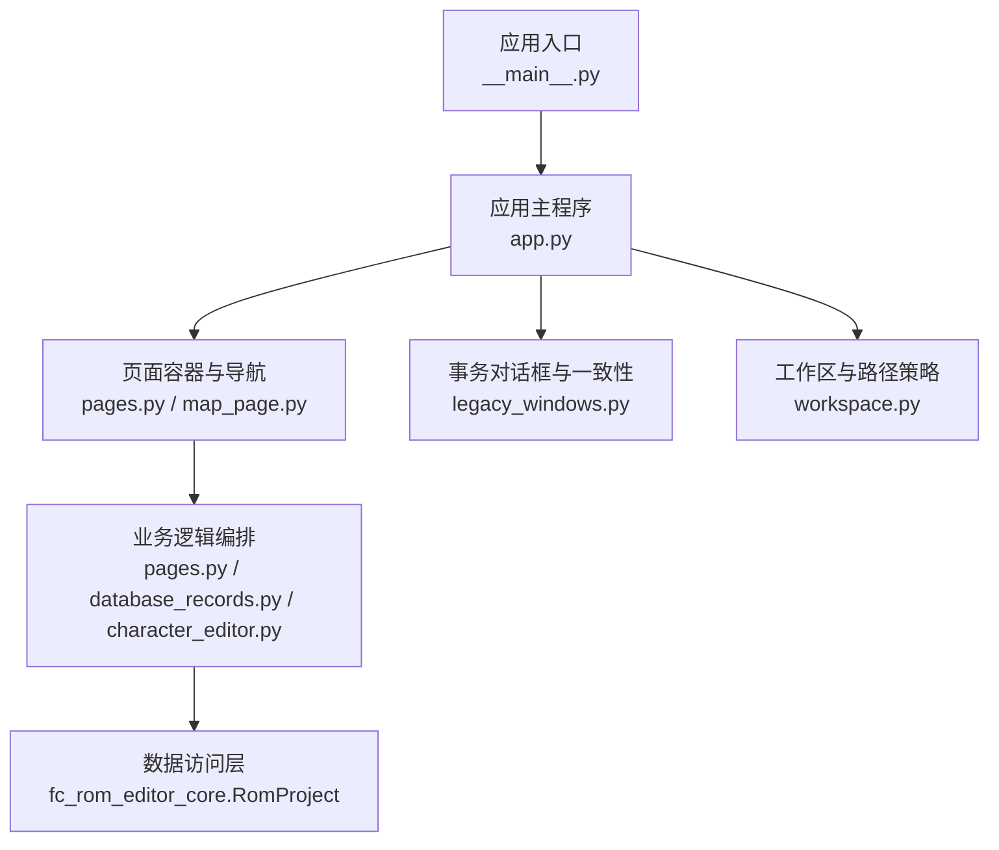
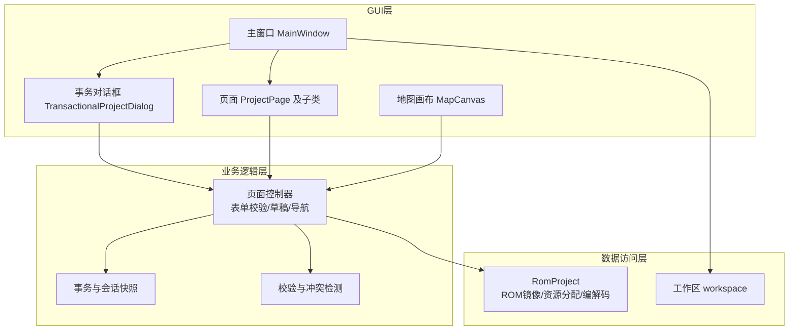
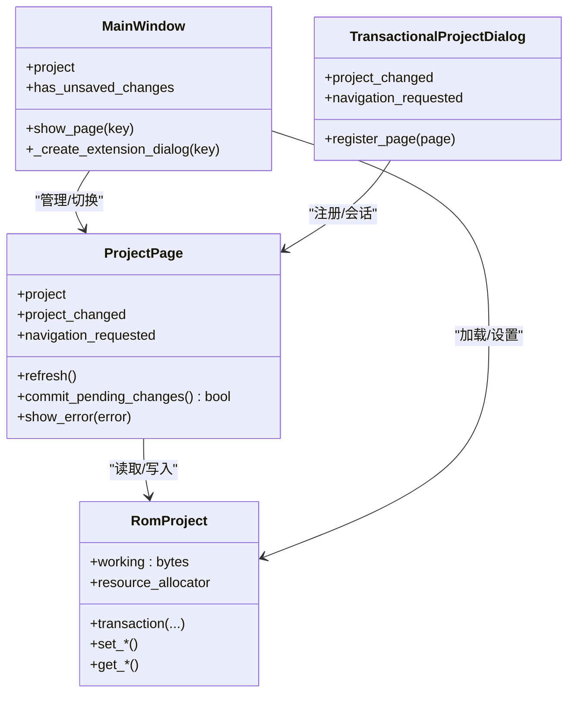
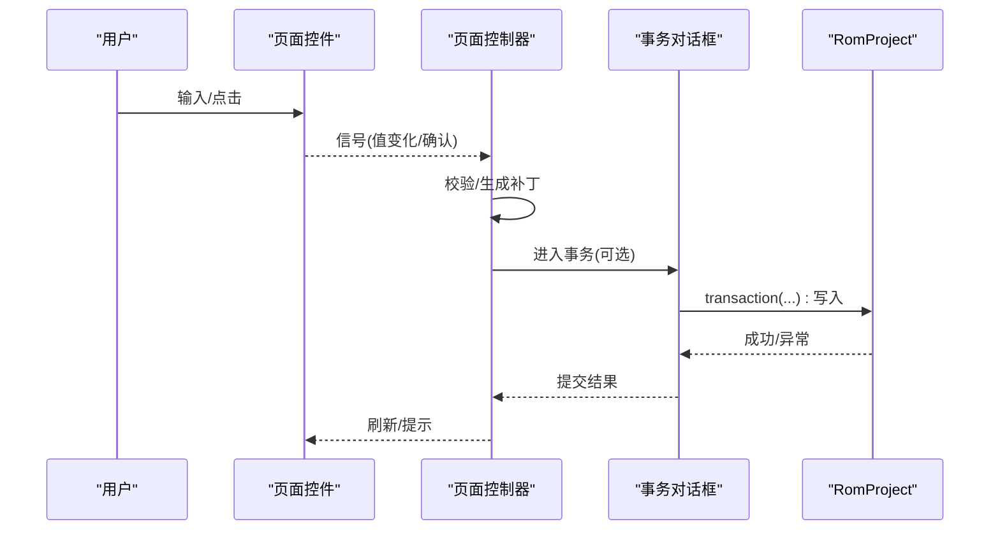
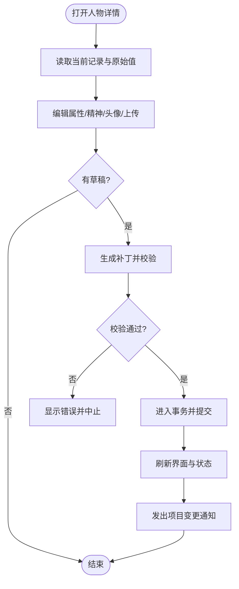
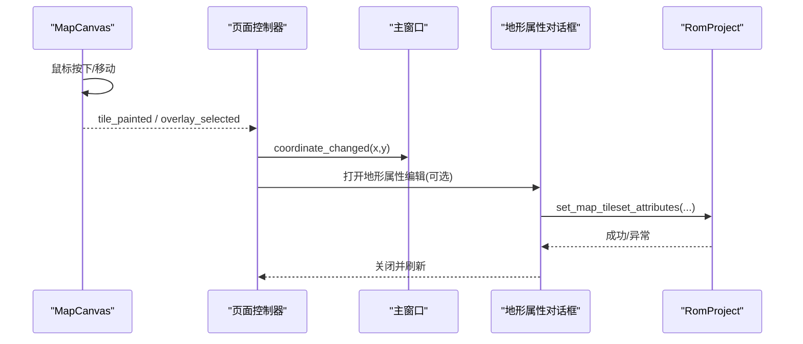
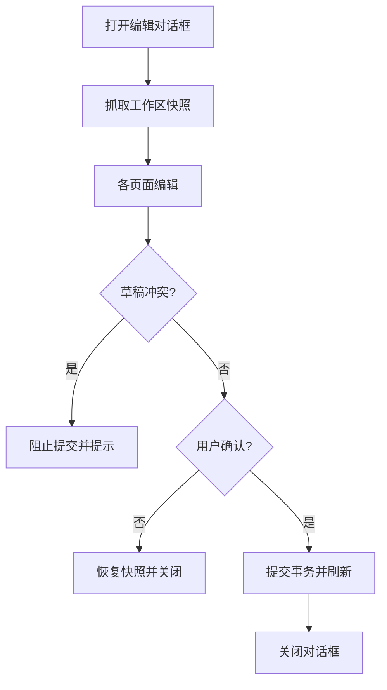
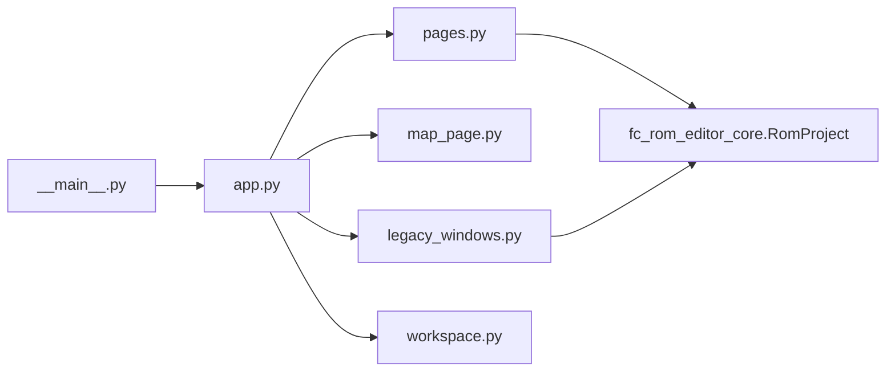

# 分层架构模式

<cite>
**本文引用的文件**
- [app.py](file://src/dc_modifier/app.py)
- [pages.py](file://src/dc_modifier/pages.py)
- [database_records.py](file://src/dc_modifier/database_records.py)
- [character_editor.py](file://src/dc_modifier/character_editor.py)
- [map_page.py](file://src/dc_modifier/map_page.py)
- [legacy_windows.py](file://src/dc_modifier/legacy_windows.py)
- [workspace.py](file://src/dc_modifier/workspace.py)
- [__main__.py](file://src/dc_modifier/__main__.py)
- [pyproject.toml](file://pyproject.toml)
</cite>

## 目录
1. [简介](#简介)
2. [项目结构](#项目结构)
3. [核心组件](#核心组件)
4. [架构总览](#架构总览)
5. [详细组件分析](#详细组件分析)
6. [依赖关系分析](#依赖关系分析)
7. [性能考虑](#性能考虑)
8. [故障排查指南](#故障排查指南)
9. [结论](#结论)
10. [附录](#附录)

## 简介
本文件面向“DC修改器”的分层架构与MVC实践，聚焦GUI层、业务逻辑层、数据访问层的职责边界、交互协议、事件传递机制与数据流向。文档以代码级为依据，给出架构图、类图、时序图与流程图，并说明错误处理与异常传播方式，帮助读者在不深入源码的情况下理解系统如何组织与维护。

## 项目结构
- 入口与启动
  - 通过可执行脚本或命令行入口启动应用，最终调用应用运行函数。
  - 应用负责创建主窗口、菜单、页面容器与工作区，并管理ROM工程生命周期。
- GUI层（View）
  - 主窗口、对话框、页面组件、地图画布、属性编辑面板等。
  - 使用Qt信号槽进行UI事件到业务逻辑的解耦传递。
- 业务逻辑层（Controller）
  - 页面基类与具体页面实现承载用户操作的业务编排：校验、事务封装、跨页同步、导航请求。
  - 事务对话框提供会话级撤销/重做与一致性保护。
- 数据访问层（Model）
  - 通过外部核心库提供的工程对象访问ROM镜像、资源分配器、编解码器与变更集。
  - 输出路径与只读参考目录由工作区模块统一约束。

**图表来源**
- [__main__.py:1-6](file://src/dc_modifier/__main__.py#L1-L6)
- [app.py:276-365](file://src/dc_modifier/app.py#L276-L365)
- [pages.py:103-152](file://src/dc_modifier/pages.py#L103-L152)
- [legacy_windows.py:71-187](file://src/dc_modifier/legacy_windows.py#L71-L187)
- [workspace.py:7-42](file://src/dc_modifier/workspace.py#L7-L42)

**章节来源**
- [__main__.py:1-6](file://src/dc_modifier/__main__.py#L1-L6)
- [app.py:276-365](file://src/dc_modifier/app.py#L276-L365)
- [workspace.py:7-42](file://src/dc_modifier/workspace.py#L7-L42)

## 核心组件
- 应用主窗口与启动流程
  - 负责加载ROM、构建页面集合、注册动作与菜单、状态栏更新、未保存变更检测与提示。
- 页面基类与记录编辑
  - 定义统一的“待提交草稿”语义、刷新接口、错误展示、导航请求与项目变更通知。
  - 通用记录列表、搜索、复制/粘贴/还原等能力在基类中实现，子类专注字段映射与写入。
- 事务对话框
  - 对多页面编辑会话进行快照与回滚，拦截冲突草稿，保证一次“确定/取消”原子性。
- 地图编辑器
  - 自定义画布渲染、地形调色板、单位图标、覆盖层拖拽、坐标与选中事件。
- 人物/武器详情编辑
  - 将复杂属性、精神、头像与动画参数封装为可验证的补丁序列，统一提交到工程对象。
- 工作区与路径安全
  - 自动定位工作根目录、默认ROM、导出目录，禁止向只读参考目录写回。

**章节来源**
- [app.py:276-800](file://src/dc_modifier/app.py#L276-L800)
- [pages.py:103-152](file://src/dc_modifier/pages.py#L103-L152)
- [legacy_windows.py:71-187](file://src/dc_modifier/legacy_windows.py#L71-L187)
- [map_page.py:595-800](file://src/dc_modifier/map_page.py#L595-L800)
- [character_editor.py:17-334](file://src/dc_modifier/character_editor.py#L17-L334)
- [workspace.py:7-42](file://src/dc_modifier/workspace.py#L7-L42)

## 架构总览
下图展示了GUI层、业务逻辑层、数据访问层的职责分离与通信方式。GUI层通过信号触发业务编排；业务层封装事务与校验，调用数据访问层读写ROM；数据访问层暴露工程对象与编解码能力。

**图表来源**
- [app.py:276-365](file://src/dc_modifier/app.py#L276-L365)
- [pages.py:103-152](file://src/dc_modifier/pages.py#L103-L152)
- [legacy_windows.py:71-187](file://src/dc_modifier/legacy_windows.py#L71-L187)
- [workspace.py:7-42](file://src/dc_modifier/workspace.py#L7-L42)

## 详细组件分析

### MVC角色与边界
- Model（数据模型）
  - 由外部核心库的RomProject提供：ROM镜像、资源分配器、编解码器、变更集、工程元信息。
  - 所有持久化与结构化数据读写均通过该对象完成，GUI与业务层不直接操作底层字节。
- View（用户界面）
  - Qt窗口、控件、页面、画布。仅负责展示与捕获用户输入，通过信号发出意图。
- Controller（控制器）
  - 页面基类与具体页面实现承担控制职责：读取/填充表单、校验输入、生成补丁、发起事务、处理导航与错误。

**图表来源**
- [pages.py:103-152](file://src/dc_modifier/pages.py#L103-L152)
- [app.py:276-365](file://src/dc_modifier/app.py#L276-L365)
- [legacy_windows.py:71-187](file://src/dc_modifier/legacy_windows.py#L71-L187)

**章节来源**
- [pages.py:103-152](file://src/dc_modifier/pages.py#L103-L152)
- [app.py:276-365](file://src/dc_modifier/app.py#L276-L365)
- [legacy_windows.py:71-187](file://src/dc_modifier/legacy_windows.py#L71-L187)

### 事件传递机制与数据流
- 用户操作（点击、输入、拖拽）→ Qt信号 → 页面控制器方法 → 校验/生成补丁 → 事务提交 → RomProject变更 → 刷新视图。
- 跨页导航通过页面发出的navigation_requested信号，由主窗口或事务对话框路由到目标页面。
- 地图画布的事件（绘制、拾取、覆盖层选择）通过信号上报给上层控制器，再决定写入或弹出编辑对话框。

**图表来源**
- [pages.py:103-152](file://src/dc_modifier/pages.py#L103-L152)
- [legacy_windows.py:71-187](file://src/dc_modifier/legacy_windows.py#L71-L187)

**章节来源**
- [pages.py:103-152](file://src/dc_modifier/pages.py#L103-L152)
- [legacy_windows.py:71-187](file://src/dc_modifier/legacy_windows.py#L71-L187)

### 关键流程：人物属性与头像编辑
- 人物详情面板收集属性、精神、头像与上传图像草稿。
- 生成补丁序列并进行重叠/越界校验。
- 通过工程事务一次性应用，成功后刷新界面并通知变更。

**图表来源**
- [character_editor.py:165-258](file://src/dc_modifier/character_editor.py#L165-L258)
- [database_records.py:198-236](file://src/dc_modifier/database_records.py#L198-L236)

**章节来源**
- [character_editor.py:165-258](file://src/dc_modifier/character_editor.py#L165-L258)
- [database_records.py:198-236](file://src/dc_modifier/database_records.py#L198-L236)

### 关键流程：地图编辑与地形属性
- 地图画布接收鼠标事件，更新图块或覆盖层位置。
- 地形属性编辑通过专用对话框维护颜色表、移动补正与海属性，并在支持时写回工程。
- 坐标变化实时反馈至主窗口状态栏。

**图表来源**
- [map_page.py:595-800](file://src/dc_modifier/map_page.py#L595-L800)
- [map_page.py:310-592](file://src/dc_modifier/map_page.py#L310-L592)
- [app.py:490-493](file://src/dc_modifier/app.py#L490-L493)

**章节来源**
- [map_page.py:595-800](file://src/dc_modifier/map_page.py#L595-L800)
- [map_page.py:310-592](file://src/dc_modifier/map_page.py#L310-L592)
- [app.py:490-493](file://src/dc_modifier/app.py#L490-L493)

### 事务与会话一致性
- 事务对话框在显示时抓取工程工作区、资源分配与撤销栈快照。
- 多个页面共享同一会话，若存在相同资源的草稿则拒绝提交并提示冲突。
- 取消时恢复快照，确保“整窗撤销”语义。

**图表来源**
- [legacy_windows.py:71-187](file://src/dc_modifier/legacy_windows.py#L71-L187)

**章节来源**
- [legacy_windows.py:71-187](file://src/dc_modifier/legacy_windows.py#L71-L187)

### 路径与输出安全
- 工作区自动定位根目录与默认ROM，导出目录统一创建。
- 禁止向references目录或其子目录输出，防止误覆盖参考基准。

**章节来源**
- [workspace.py:7-42](file://src/dc_modifier/workspace.py#L7-L42)

## 依赖关系分析
- 入口依赖
  - 可执行脚本指向应用运行函数，便于打包与分发。
- 主窗口依赖
  - 导入页面模块、地图与事件页面、工作区常量，构建页面集合与菜单。
- 页面依赖
  - 页面基类与具体页面依赖工程对象与工具模块（文本、资源、编解码）。
- 事务对话框依赖
  - 聚合多个页面，转发信号，提供会话级一致性与冲突检测。

**图表来源**
- [__main__.py:1-6](file://src/dc_modifier/__main__.py#L1-L6)
- [app.py:33-58](file://src/dc_modifier/app.py#L33-L58)
- [pages.py:38-45](file://src/dc_modifier/pages.py#L38-L45)
- [legacy_windows.py:43-60](file://src/dc_modifier/legacy_windows.py#L43-L60)
- [workspace.py:7-42](file://src/dc_modifier/workspace.py#L7-L42)

**章节来源**
- [__main__.py:1-6](file://src/dc_modifier/__main__.py#L1-L6)
- [app.py:33-58](file://src/dc_modifier/app.py#L33-L58)
- [pages.py:38-45](file://src/dc_modifier/pages.py#L38-L45)
- [legacy_windows.py:43-60](file://src/dc_modifier/legacy_windows.py#L43-L60)
- [workspace.py:7-42](file://src/dc_modifier/workspace.py#L7-L42)

## 性能考虑
- 批量刷新与信号屏蔽
  - 列表重建时使用信号屏蔽与更新暂停，减少重绘开销。
- 预览与渲染
  - 地图与头像预览按需计算，避免全量重绘；小范围局部更新提升响应。
- 事务与快照
  - 会话级快照仅在必要时创建，降低频繁内存拷贝成本。
- 路径与IO
  - 输出路径集中管理，避免重复检查；只读参考目录防护减少误写风险。

[本节为通用指导，无需特定文件引用]

## 故障排查指南
- 常见错误类型
  - ID范围与格式错误：解析ID表达式时抛出范围或格式异常。
  - 名称共用冲突：当名称被多个记录共享时，需二次确认。
  - 头像上传限制：尺寸、色深与CHR位置必须匹配，否则提示失败。
  - 路径保护：尝试写入references目录会抛出受保护错误。
- 异常传播与用户提示
  - 页面统一通过show_error弹窗提示；事务对话框在提交阶段捕获并回滚。
  - 主窗口在导出/构建等操作中捕获异常并以消息框反馈。

**章节来源**
- [pages.py:66-100](file://src/dc_modifier/pages.py#L66-L100)
- [pages.py:357-368](file://src/dc_modifier/pages.py#L357-L368)
- [character_editor.py:302-334](file://src/dc_modifier/character_editor.py#L302-L334)
- [workspace.py:37-42](file://src/dc_modifier/workspace.py#L37-L42)
- [app.py:684-729](file://src/dc_modifier/app.py#L684-L729)

## 结论
本修改器采用清晰的分层架构与MVC模式：GUI层专注交互与展示，业务逻辑层负责编排、校验与事务，数据访问层通过工程对象统一管理ROM与资源。通过信号与事件解耦各层，事务对话框保障会话一致性，路径策略确保数据安全。该设计使功能扩展与重构具备良好内聚性与低耦合度。

[本节为总结性内容，无需特定文件引用]

## 附录
- 启动与打包
  - 通过配置脚本定义可执行入口，便于构建独立程序。
- 推荐工作流
  - 打开基准ROM → 规划扩展容量 → 编辑并随时验证 → 保存工程并构建ROM/IPS。

**章节来源**
- [pyproject.toml:22-23](file://pyproject.toml#L22-L23)
- [pages.py:171-185](file://src/dc_modifier/pages.py#L171-L185)