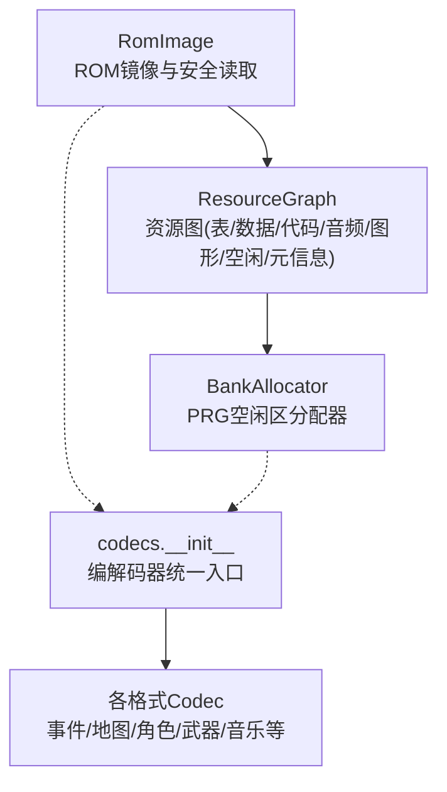
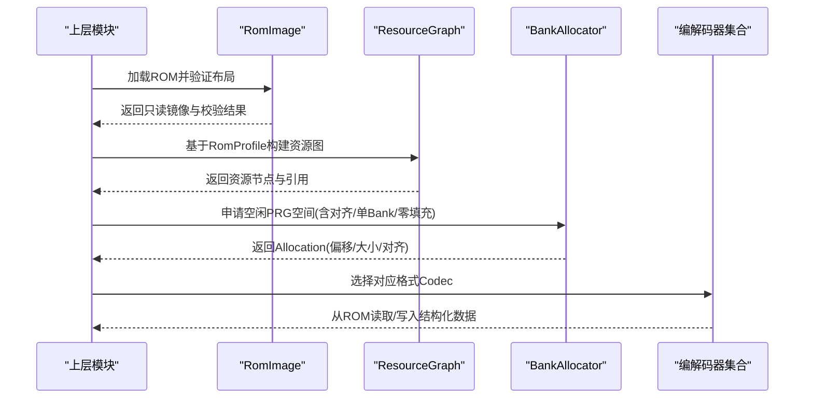
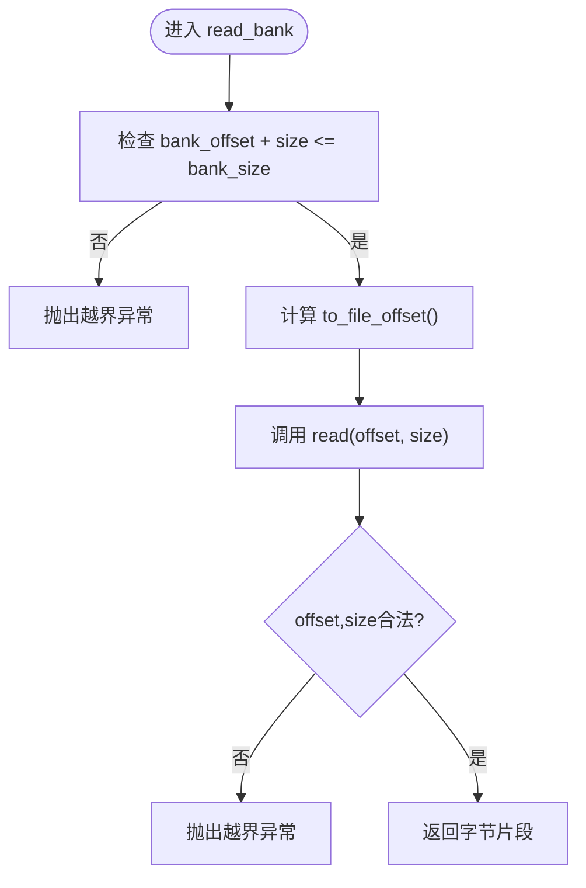
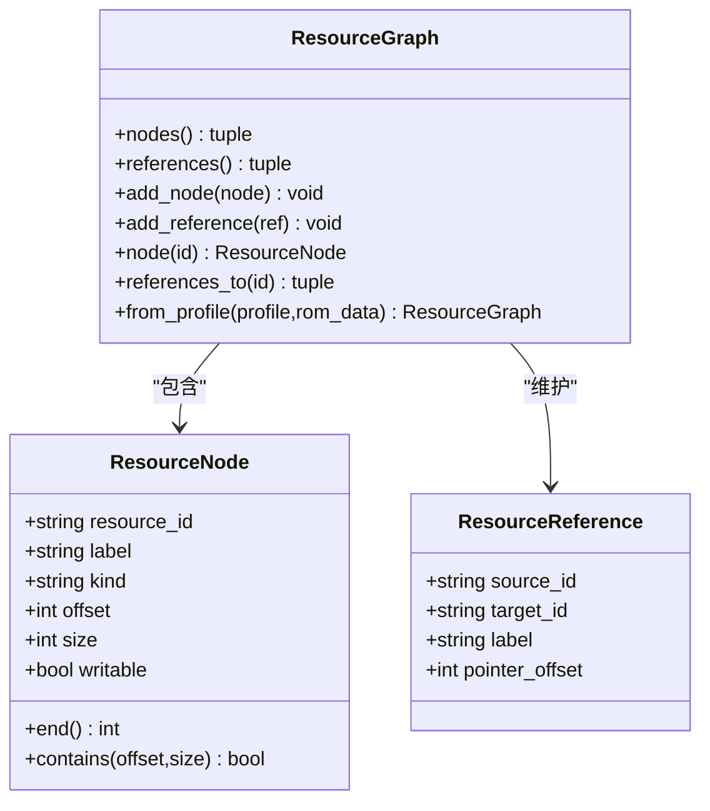
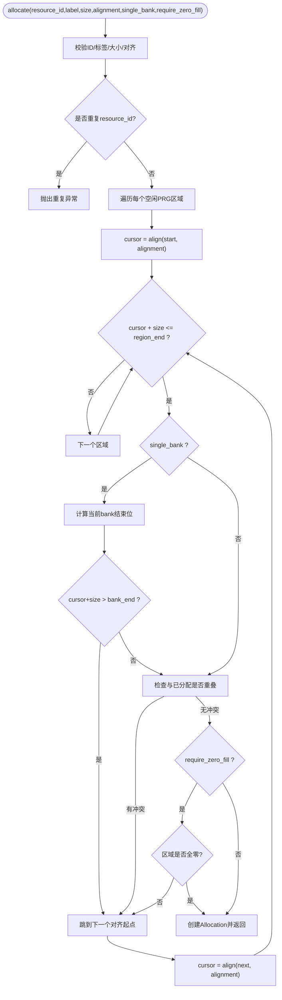
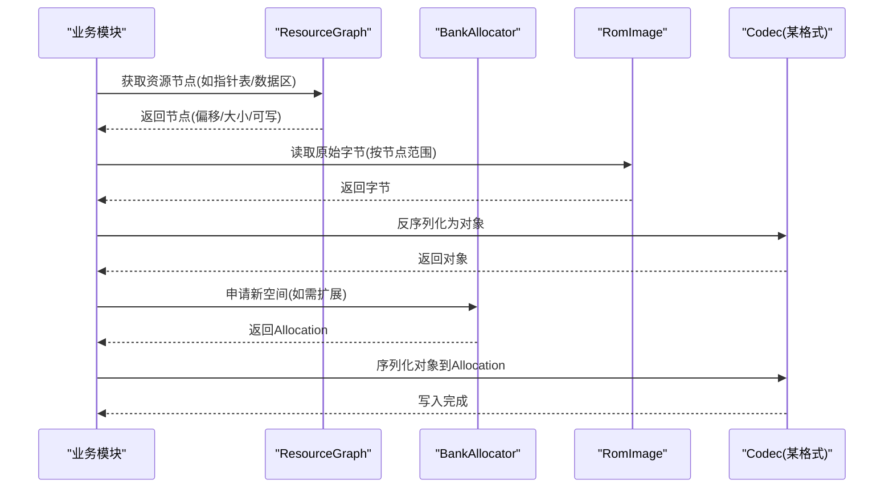
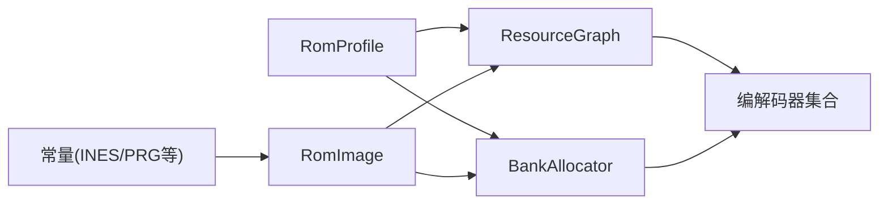

# 数据访问层

<cite>
**本文引用的文件**
- [rom_image.py](file://src/fc_editor/rom_image.py)
- [resources.py](file://src/fc_editor/resources.py)
- [__init__.py](file://src/fc_editor/codecs/__init__.py)
</cite>

## 目录
1. [简介](#简介)
2. [项目结构](#项目结构)
3. [核心组件](#核心组件)
4. [架构总览](#架构总览)
5. [详细组件分析](#详细组件分析)
6. [依赖关系分析](#依赖关系分析)
7. [性能与缓存策略](#性能与缓存策略)
8. [故障排查指南](#故障排查指南)
9. [结论](#结论)
10. [附录：示例流程与最佳实践](#附录示例流程与最佳实践)

## 简介
本文件面向DC修改器的数据访问层，聚焦以下目标：
- 解释 RomImage 类的设计：ROM 文件读取、解析与内存映射机制。
- 说明资源管理系统：ResourceGraph 的资源建模与 BankAllocator 的分配算法及冲突检测。
- 统一编解码器接口抽象：不同数据格式的读写协议与序列化机制。
- 提供可操作的流程示例（以步骤和路径引用代替具体代码）。
- 总结数据缓存策略、性能优化技巧与错误恢复机制。

## 项目结构
数据访问层主要位于 fc_editor 包内，关键文件职责如下：
- rom_image.py：ROM 镜像封装、iNES 头校验、Mapper 识别、地址到文件偏移转换、按 Bank 的安全读取。
- resources.py：资源图 ResourceGraph（基于 RomProfile 构建）、BankAllocator（在可用 PRG 区域进行确定性分配）。
- codecs/__init__.py：编解码器模块的统一导出入口，集中暴露各类 Codec 类型，便于上层按“格式→Codec”的方式调用。

图表来源
- [rom_image.py:50-125](file://src/fc_editor/rom_image.py#L50-L125)
- [resources.py:47-260](file://src/fc_editor/resources.py#L47-L260)
- [resources.py:280-413](file://src/fc_editor/resources.py#L280-L413)
- [__init__.py:1-47](file://src/fc_editor/codecs/__init__.py#L1-L47)

章节来源
- [rom_image.py:1-125](file://src/fc_editor/rom_image.py#L1-L125)
- [resources.py:1-413](file://src/fc_editor/resources.py#L1-L413)
- [__init__.py:1-47](file://src/fc_editor/codecs/__init__.py#L1-L47)

## 核心组件
- RomImage：不可变 ROM 字节容器，负责 iNES 头校验、Mapper 识别、SHA-256 基准比对、安全读取与 Bank 边界保护。
- ResourceGraph：从 RomProfile 构建资源图，将指针表、受保护区域、自定义音槽、空闲区域、活动 CHR 等建模为节点与引用。
- BankAllocator：在 profile 声明的空闲 PRG 区域执行确定性首适配分配，支持对齐、单 Bank 约束、零填充检查与冲突检测。
- 编解码器集合：通过统一入口暴露多种数据格式的编解码能力，供上层以一致方式读写 ROM 中的结构化数据。

章节来源
- [rom_image.py:50-125](file://src/fc_editor/rom_image.py#L50-L125)
- [resources.py:47-260](file://src/fc_editor/resources.py#L47-L260)
- [resources.py:280-413](file://src/fc_editor/resources.py#L280-L413)
- [__init__.py:1-47](file://src/fc_editor/codecs/__init__.py#L1-L47)

## 架构总览
数据访问层围绕“ROM镜像—资源图—分配器—编解码器”的主线组织：
- RomImage 提供安全的原始字节访问与地址映射。
- ResourceGraph 将 ROM 中关键结构抽象为资源节点，并维护跨资源引用。
- BankAllocator 在受控区域内进行资源分配，保证不越界、不对齐失败、不重叠。
- 编解码器根据资源节点定位数据，完成读/写/序列化/反序列化。

图表来源
- [rom_image.py:58-125](file://src/fc_editor/rom_image.py#L58-L125)
- [resources.py:80-260](file://src/fc_editor/resources.py#L80-L260)
- [resources.py:368-413](file://src/fc_editor/resources.py#L368-L413)
- [__init__.py:1-47](file://src/fc_editor/codecs/__init__.py#L1-L47)

## 详细组件分析

### RomImage：ROM镜像、解析与内存映射
- 设计要点
  - 不可变字节容器：构造时复制输入数据，避免外部污染。
  - iNES 头校验：签名、头部长度、trainer 大小、PRG/CHR 声明大小与实际一致。
  - Mapper 识别：从头部提取 Mapper 号并与 profile 期望值比较。
  - 基准校验：通过 SHA-256 比对参考版本，确保操作可重放。
  - 安全读取：read/read_bank 严格边界检查，禁止跨 Bank 读取。
  - 地址映射：BankAddress 将 CPU 地址映射到文件偏移，支持窗口基址与 Bank 大小参数化。

- 复杂度与性能
  - 读取 O(1)，边界检查常数时间。
  - 哈希计算 O(N)（仅在需要时触发）。
  - 建议：对频繁访问的大块数据使用切片缓存或按需懒加载。

- 错误处理
  - 非 iNES、头长度不足、大小不符、Mapper 不匹配、越界读取、跨 Bank 读取均抛出明确异常。

图表来源
- [rom_image.py:121-125](file://src/fc_editor/rom_image.py#L121-L125)
- [rom_image.py:46-48](file://src/fc_editor/rom_image.py#L46-L48)
- [rom_image.py:114-119](file://src/fc_editor/rom_image.py#L114-L119)

章节来源
- [rom_image.py:16-105](file://src/fc_editor/rom_image.py#L16-L105)
- [rom_image.py:114-125](file://src/fc_editor/rom_image.py#L114-L125)

### ResourceGraph：资源建模与引用管理
- 设计要点
  - 资源节点 ResourceNode：标识、标签、类型、偏移、大小、是否可写。
  - 引用 ResourceReference：源/目标资源与可选指针偏移，用于追踪跨资源依赖。
  - 从 RomProfile 构建：自动注册 iNES 头、各类指针表、受保护区域、自定义音槽、空闲区域、活动 CHR 等。
  - 查询接口：按 ID 获取节点、反向查找引用该资源的来源。

- 典型用途
  - 编辑器模块通过 ResourceGraph 定位指针表与数据区，结合 BankAllocator 扩展内容。
  - 审计与可视化：遍历节点与引用生成资源拓扑。

图表来源
- [resources.py:14-79](file://src/fc_editor/resources.py#L14-L79)
- [resources.py:80-260](file://src/fc_editor/resources.py#L80-L260)

章节来源
- [resources.py:14-79](file://src/fc_editor/resources.py#L14-L79)
- [resources.py:80-260](file://src/fc_editor/resources.py#L80-L260)

### BankAllocator：资源分配算法与冲突检测
- 分配策略
  - 首适配（First-Fit）：在 profile 声明的空闲 PRG 区域顺序扫描，找到首个满足大小与对齐的位置。
  - 单 Bank 约束：当 single_bank=True 时，强制分配范围不跨越 PRG Bank 边界。
  - 对齐：支持任意 2 的幂对齐，内部使用对齐函数对齐起始位置。
  - 零填充检查：require_zero_fill=True 时，仅选择全零区域，避免覆盖已有数据。
  - 冲突检测：与已分配区间做重叠判断，拒绝任何交叉。

- 复杂度
  - allocate：最坏 O(R + A)，R 为空闲区域数，A 为已分配项数量；实际通常很小。
  - reserve/release/allocation：O(A)。

- 错误处理
  - 非法资源 ID、空标签、大小/对齐非法、不在空闲区域、与已有分配重叠、无足够空间等，均抛出明确异常。

图表来源
- [resources.py:368-413](file://src/fc_editor/resources.py#L368-L413)
- [resources.py:311-332](file://src/fc_editor/resources.py#L311-L332)
- [resources.py:334-354](file://src/fc_editor/resources.py#L334-L354)

章节来源
- [resources.py:280-413](file://src/fc_editor/resources.py#L280-L413)

### 编解码器接口统一抽象
- 统一入口：codecs/__init__.py 集中导出所有 Codec 类型，使上层无需关心内部实现细节即可按名称导入。
- 典型格式：事件脚本、地图、角色名、武器、战斗音乐、自定义音乐、章节事件、劝降规则、场景布局、故事文本、单位及其武器/名称等。
- 读写协议与序列化
  - 读：根据资源节点定位偏移与长度，从 RomImage 读取字节序列，再反序列化为领域对象。
  - 写：将领域对象序列化为字节流，写入到由 BankAllocator 分配的 Allocation 区域，必要时更新指针表。
  - 一致性：所有 Codec 遵循一致的接口约定（如 read(data, offset, length)、write(obj, buffer)），便于替换与测试。

图表来源
- [__init__.py:1-47](file://src/fc_editor/codecs/__init__.py#L1-L47)
- [resources.py:80-260](file://src/fc_editor/resources.py#L80-L260)
- [resources.py:368-413](file://src/fc_editor/resources.py#L368-L413)
- [rom_image.py:114-125](file://src/fc_editor/rom_image.py#L114-L125)

章节来源
- [__init__.py:1-47](file://src/fc_editor/codecs/__init__.py#L1-L47)

## 依赖关系分析
- RomImage 依赖常量与配置：
  - INES_HEADER_SIZE、PRG_BANK_SIZE、CPU_BANK_BASE 等常量用于边界与地址计算。
  - RomProfile 用于描述游戏特定布局（指针表、受保护区域、空闲区域等）。
- ResourceGraph 依赖 RomProfile：
  - 通过 profile 提供的偏移、计数、窗口基址等信息构建资源图。
- BankAllocator 依赖 RomProfile：
  - 仅允许在 free_prg_regions 范围内分配，确保不会破坏受保护区域。
- 编解码器依赖 RomImage 与资源图：
  - 依据资源节点定位数据，使用 RomImage 进行安全读取/写入。

图表来源
- [rom_image.py:7-13](file://src/fc_editor/rom_image.py#L7-L13)
- [resources.py:7-8](file://src/fc_editor/resources.py#L7-L8)
- [resources.py:80-260](file://src/fc_editor/resources.py#L80-L260)
- [resources.py:280-413](file://src/fc_editor/resources.py#L280-L413)
- [__init__.py:1-47](file://src/fc_editor/codecs/__init__.py#L1-L47)

章节来源
- [rom_image.py:7-13](file://src/fc_editor/rom_image.py#L7-L13)
- [resources.py:7-8](file://src/fc_editor/resources.py#L7-L8)
- [resources.py:80-260](file://src/fc_editor/resources.py#L80-L260)
- [resources.py:280-413](file://src/fc_editor/resources.py#L280-L413)
- [__init__.py:1-47](file://src/fc_editor/codecs/__init__.py#L1-L47)

## 性能与缓存策略
- 内存占用
  - RomImage 持有完整 ROM 字节，适合一次性加载后多次随机访问。
  - 对于超大 ROM，可在上层实现分块缓存（LRU）以减少峰值内存。
- I/O 优化
  - 批量读取：尽量合并相邻读取，减少 Python 切片开销。
  - 避免重复哈希：仅在需要基准校验时计算 SHA-256。
- 分配效率
  - BankAllocator 的首适配在小规模分配下很快；若分配频繁，可对空闲区域建立索引（按大小排序）加速查找。
- 编解码优化
  - 预解析指针表：将热点指针表缓存为字典，降低重复解析成本。
  - 增量写入：仅序列化变更部分，减少写入量。

[本节为通用指导，不直接分析具体文件]

## 故障排查指南
- ROM 格式错误
  - 现象：加载时报错“不是有效的 iNES ROM”“ROM 大小与 iNES 头不符”“Mapper 不匹配”。
  - 排查：确认 ROM 文件未损坏、头部声明与实际一致、Mapper 与 profile 匹配。
- 读取越界
  - 现象：read/read_bank 报超出 ROM 或跨 Bank 读取。
  - 排查：核对 offset/size 与 BankAddress.window_base/bank_size，确保不越界。
- 分配失败
  - 现象：allocate 报“没有足够的空闲 PRG 空间容纳 N 字节”。
  - 排查：检查 require_zero_fill 是否过严、single_bank 是否限制过紧、对齐是否过大；查看空闲区域容量与已分配情况。
- 资源冲突
  - 现象：reserve/allocation 报“与资源 X 重叠”。
  - 排查：调整偏移或大小，避免与现有分配交叉。
- 资源 ID 无效
  - 现象：报“资源 ID 格式无效”或“资源已分配”。
  - 排查：确保 ID 符合命名规范且唯一。

章节来源
- [rom_image.py:79-112](file://src/fc_editor/rom_image.py#L79-L112)
- [rom_image.py:114-125](file://src/fc_editor/rom_image.py#L114-L125)
- [resources.py:334-354](file://src/fc_editor/resources.py#L334-L354)
- [resources.py:368-413](file://src/fc_editor/resources.py#L368-L413)

## 结论
数据访问层通过 RomImage、ResourceGraph、BankAllocator 与统一编解码器入口，构建了稳健、可扩展的 ROM 数据操作基础：
- RomImage 保障底层字节访问的安全性与可验证性。
- ResourceGraph 将复杂 ROM 结构抽象为可管理的资源图。
- BankAllocator 提供确定性的资源分配与严格的冲突检测。
- 编解码器集合以统一接口屏蔽格式差异，提升复用性与可测试性。
在实践中，配合合理的缓存与批处理策略，可在保证正确性的同时获得良好性能。

[本节为总结性内容，不直接分析具体文件]

## 附录：示例流程与最佳实践

- 示例一：ROM 镜像操作
  - 步骤
    1) 使用 RomImage.load 加载 ROM 并自动校验布局。
    2) 通过 RomImage.read 读取指定偏移与长度的字节。
    3) 使用 BankAddress.to_file_offset 将 CPU 地址转换为文件偏移，再用 read_bank 读取单个 Bank 内的数据。
  - 参考路径
    - [rom_image.py:58-62](file://src/fc_editor/rom_image.py#L58-L62)
    - [rom_image.py:114-125](file://src/fc_editor/rom_image.py#L114-L125)
    - [rom_image.py:46-48](file://src/fc_editor/rom_image.py#L46-L48)

- 示例二：资源加载
  - 步骤
    1) 通过 ResourceGraph.from_profile 构建资源图。
    2) 使用 node("units.pointer_table") 等获取指针表节点。
    3) 用 RomImage.read 读取指针表内容，再由相应 Codec 反序列化为对象。
  - 参考路径
    - [resources.py:80-103](file://src/fc_editor/resources.py#L80-L103)
    - [resources.py:136-155](file://src/fc_editor/resources.py#L136-L155)
    - [rom_image.py:114-119](file://src/fc_editor/rom_image.py#L114-L119)
    - [__init__.py:1-47](file://src/fc_editor/codecs/__init__.py#L1-L47)

- 示例三：格式转换（序列化/反序列化）
  - 步骤
    1) 从 ResourceGraph 定位目标资源节点。
    2) 使用 RomImage 读取原始字节，调用对应 Codec 反序列化为对象。
    3) 修改对象后，再次序列化并写入到由 BankAllocator 分配的 Allocation 区域。
    4) 如有指针表变化，更新对应指针表节点。
  - 参考路径
    - [resources.py:80-260](file://src/fc_editor/resources.py#L80-L260)
    - [resources.py:368-413](file://src/fc_editor/resources.py#L368-L413)
    - [rom_image.py:114-125](file://src/fc_editor/rom_image.py#L114-L125)
    - [__init__.py:1-47](file://src/fc_editor/codecs/__init__.py#L1-L47)

- 最佳实践
  - 始终通过 ResourceGraph 定位资源，避免硬编码偏移。
  - 使用 BankAllocator 进行扩展分配，确保对齐与单 Bank 约束。
  - 对热点数据（如指针表）做缓存，减少重复解析。
  - 在写入前进行完整性校验（如 CRC/SHA），并在出错时回滚。
  - 记录每次变更的 Allocation 与指针表更新，便于审计与重放。

[本节为实践指导，不直接分析具体文件]