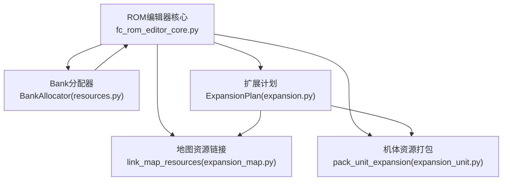
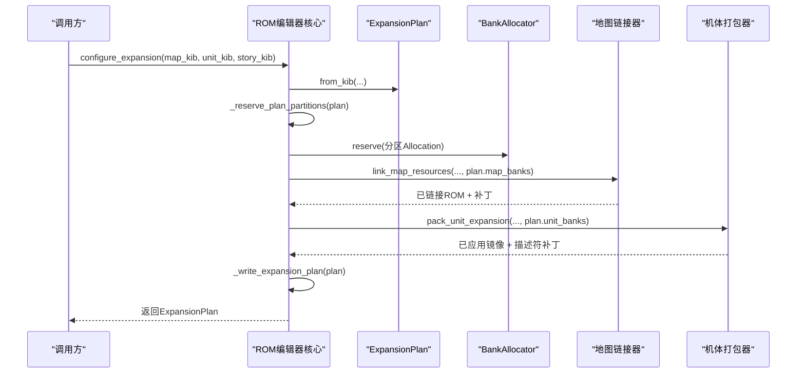
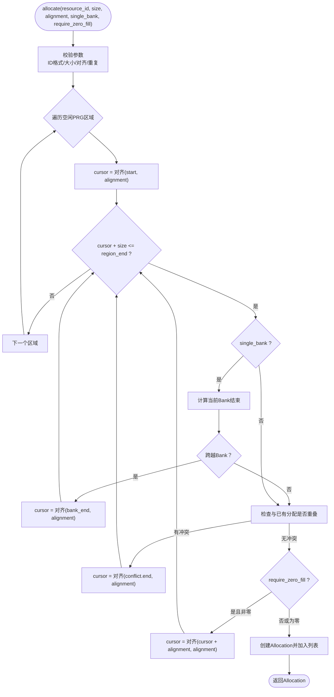
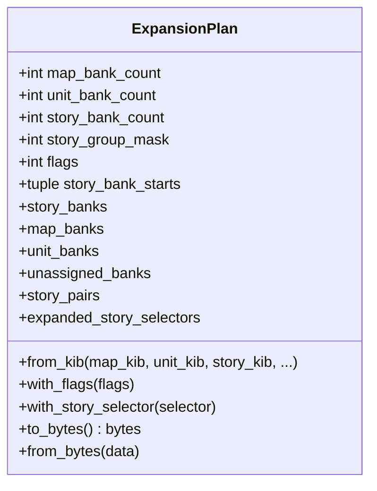
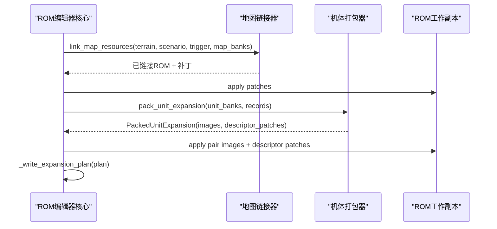
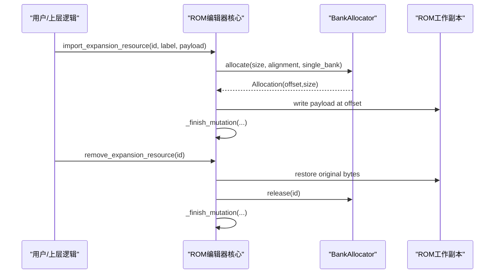
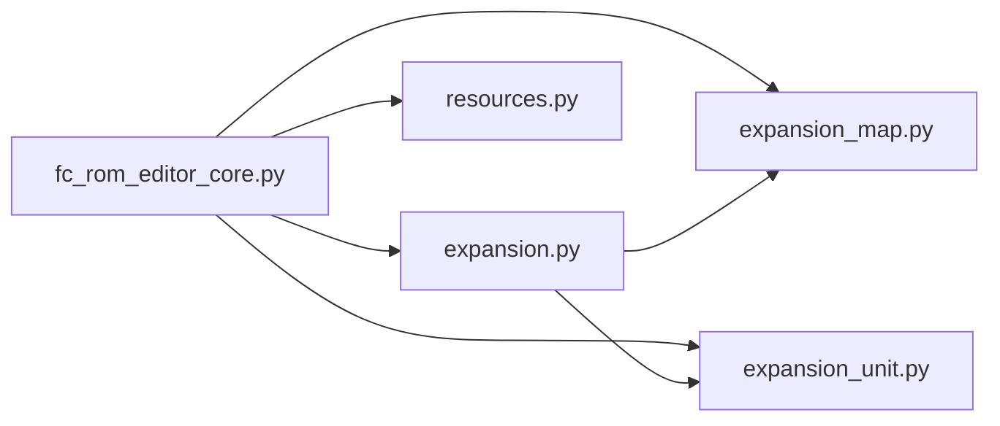

# Bank空间分配管理

<cite>
**本文引用的文件**
- [resources.py](file://src/fc_editor/resources.py)
- [expansion.py](file://src/fc_editor/expansion.py)
- [expansion_map.py](file://src/fc_editor/expansion_map.py)
- [expansion_unit.py](file://src/fc_editor/expansion_unit.py)
- [fc_rom_editor_core.py](file://src/fc_rom_editor_core.py)
</cite>

## 目录
1. [简介](#简介)
2. [项目结构](#项目结构)
3. [核心组件](#核心组件)
4. [架构总览](#架构总览)
5. [详细组件分析](#详细组件分析)
6. [依赖关系分析](#依赖关系分析)
7. [性能与内存优化](#性能与内存优化)
8. [故障排查指南](#故障排查指南)
9. [结论](#结论)
10. [附录：最佳实践与示例流程](#附录最佳实践与示例流程)

## 简介
本文件面向DC修改器的Bank空间分配管理，系统性说明BankAllocator的分配策略、资源定位与冲突检测机制；阐述ExpansionPlan驱动的扩展容量管理机制（分区预留、资源链接）；解释动态分配与回收、内存优化与重定位过程；并提供可操作的分配最佳实践与性能建议。内容严格基于仓库源码实现进行归纳与可视化。

## 项目结构
围绕Bank空间分配的核心代码分布在以下模块：
- 资源图与Bank分配器：resources.py
- 扩展容量计划与打包工具：expansion.py
- 地图资源链接与布局：expansion_map.py
- 机体资源打包与重定位：expansion_unit.py
- ROM编辑器核心编排：fc_rom_editor_core.py

图表来源
- [fc_rom_editor_core.py:1190-1434](file://src/fc_rom_editor_core.py#L1190-L1434)
- [resources.py:280-413](file://src/fc_editor/resources.py#L280-L413)
- [expansion.py:84-319](file://src/fc_editor/expansion.py#L84-L319)
- [expansion_map.py:403-418](file://src/fc_editor/expansion_map.py#L403-L418)
- [expansion_unit.py:539-738](file://src/fc_editor/expansion_unit.py#L539-L738)

章节来源
- [fc_rom_editor_core.py:1190-1434](file://src/fc_rom_editor_core.py#L1190-L1434)
- [resources.py:280-413](file://src/fc_editor/resources.py#L280-L413)
- [expansion.py:84-319](file://src/fc_editor/expansion.py#L84-L319)
- [expansion_map.py:403-418](file://src/fc_editor/expansion_map.py#L403-L418)
- [expansion_unit.py:539-738](file://src/fc_editor/expansion_unit.py#L539-L738)

## 核心组件
- BankAllocator：在配置声明的“空闲PRG区域”内进行确定性首适配分配，支持对齐、单Bank约束、零填充检查与冲突检测。
- ExpansionPlan：对464 KiB可管理池进行不可重叠的配额划分（地图/机体/剧情），并维护剧情组绑定与序列化。
- link_map_resources / pack_maps：将地形、部署、事件等资源按Bank配额打包并生成运行时补丁，写入ROM。
- pack_unit_expansion：将机体属性、名称、战斗外观、主体/碎片脚本等数据重定位到安全Bank对，并生成选择器补丁。
- fc_rom_editor_core：编排容量规划、分区预留、资源链接、计划持久化与回滚保护。

章节来源
- [resources.py:280-413](file://src/fc_editor/resources.py#L280-L413)
- [expansion.py:84-319](file://src/fc_editor/expansion.py#L84-L319)
- [expansion_map.py:403-418](file://src/fc_editor/expansion_map.py#L403-L418)
- [expansion_unit.py:539-738](file://src/fc_editor/expansion_unit.py#L539-L738)
- [fc_rom_editor_core.py:1190-1434](file://src/fc_rom_editor_core.py#L1190-L1434)

## 架构总览
下图展示了从“配置容量”到“资源链接”再到“计划持久化”的整体流程，以及BankAllocator在其中的作用。

图表来源
- [fc_rom_editor_core.py:1327-1434](file://src/fc_rom_editor_core.py#L1327-L1434)
- [expansion.py:130-175](file://src/fc_editor/expansion.py#L130-L175)
- [expansion_map.py:403-418](file://src/fc_editor/expansion_map.py#L403-L418)
- [expansion_unit.py:539-738](file://src/fc_editor/expansion_unit.py#L539-L738)

## 详细组件分析

### BankAllocator：分配策略、资源定位与冲突检测
- 可用空间来源：RomProfile声明的free_prg_regions，计算起始与结束偏移，确保分配落在这些区域内。
- 首适配算法：按对齐值对齐后扫描每个空闲区，若要求单Bank则跨Bank边界时跳过至下一个对齐位置。
- 冲突检测：维护已分配列表，任何新分配需不与已有分配重叠；否则抛出异常。
- 零填充检查：可选require_zero_fill，若目标范围非全零则向后移动一个对齐步长继续寻找。
- 释放与查询：release按resource_id移除；allocation按resource_id查找。

图表来源
- [resources.py:368-413](file://src/fc_editor/resources.py#L368-L413)

章节来源
- [resources.py:280-413](file://src/fc_editor/resources.py#L280-L413)

### ExpansionPlan：扩展容量管理与分区分配
- 配额划分：map_bank_count、unit_bank_count、story_bank_count三者之和不能超过可用Bank数；单位体配额限制为48/64/80 KiB；剧情配额必须为偶数且不超过上限。
- 分区顺序：低区先分机体，再分地图，剩余低区留给剧情；故事Bank位于高区尾部。
- 剧情组绑定：story_group_mask标记需要搬移的剧情组，story_bank_starts记录每组的起始Bank对，保证一对一且不重复。
- 序列化：to_bytes/from_bytes包含CRC校验，用于持久化扩展计划。

图表来源
- [expansion.py:84-319](file://src/fc_editor/expansion.py#L84-L319)

章节来源
- [expansion.py:84-319](file://src/fc_editor/expansion.py#L84-L319)

### 资源链接过程：地图与机体
- 地图资源链接：link_map_resources将地形、部署、事件记录打包进分配的map_banks，生成运行时指针表与Bank目录，并应用补丁到ROM。
- 机体资源打包：pack_unit_expansion将机体属性、名称、战斗外观、主体/碎片脚本重定位到安全的Bank对，生成选择器描述符补丁，并写回ROM。

图表来源
- [expansion_map.py:403-418](file://src/fc_editor/expansion_map.py#L403-L418)
- [expansion_unit.py:539-738](file://src/fc_editor/expansion_unit.py#L539-L738)
- [fc_rom_editor_core.py:1273-1325](file://src/fc_rom_editor_core.py#L1273-L1325)

章节来源
- [expansion_map.py:403-418](file://src/fc_editor/expansion_map.py#L403-L418)
- [expansion_unit.py:539-738](file://src/fc_editor/expansion_unit.py#L539-L738)
- [fc_rom_editor_core.py:1273-1325](file://src/fc_rom_editor_core.py#L1273-L1325)

### 动态分配与回收：导入/删除扩展资源
- 导入：import_expansion_resource通过BankAllocator.allocate分配空间，写入payload，并提交事务。
- 删除：remove_expansion_resource恢复原始数据并释放分配，禁止删除内部自动分区。
- 保护：输出ROM未登记区通过_reserve_direct_reopen_guards锁定，防止后续导入覆盖未知所有权字节。

图表来源
- [fc_rom_editor_core.py:1436-1484](file://src/fc_rom_editor_core.py#L1436-L1484)
- [resources.py:356-367](file://src/fc_editor/resources.py#L356-L367)

章节来源
- [fc_rom_editor_core.py:1436-1484](file://src/fc_rom_editor_core.py#L1436-L1484)
- [resources.py:356-367](file://src/fc_editor/resources.py#L356-L367)

## 依赖关系分析
- ROM编辑器核心依赖ExpansionPlan进行容量规划，依赖BankAllocator进行手动资源分配，依赖地图/机体链接器完成实际数据重定位。
- ExpansionPlan提供稳定的分区视图，避免不同模块间对Bank池的争夺。
- BankAllocator仅依赖RomProfile的空闲区域定义，不感知具体业务资源类型，保持高内聚低耦合。

图表来源
- [fc_rom_editor_core.py:1190-1434](file://src/fc_rom_editor_core.py#L1190-L1434)
- [expansion.py:84-319](file://src/fc_editor/expansion.py#L84-L319)
- [resources.py:280-413](file://src/fc_editor/resources.py#L280-L413)
- [expansion_map.py:403-418](file://src/fc_editor/expansion_map.py#L403-L418)
- [expansion_unit.py:539-738](file://src/fc_editor/expansion_unit.py#L539-L738)

章节来源
- [fc_rom_editor_core.py:1190-1434](file://src/fc_rom_editor_core.py#L1190-L1434)
- [expansion.py:84-319](file://src/fc_editor/expansion.py#L84-L319)
- [resources.py:280-413](file://src/fc_editor/resources.py#L280-L413)
- [expansion_map.py:403-418](file://src/fc_editor/expansion_map.py#L403-L418)
- [expansion_unit.py:539-738](file://src/fc_editor/expansion_unit.py#L539-L738)

## 性能与内存优化
- 对齐优先：合理设置alignment可减少碎片，提高连续访问效率；BankAllocator会按对齐推进游标。
- 单Bank约束：对于必须驻留单一Bank的资源，开启single_bank可避免跨Bank导致的额外跳转开销。
- 零填充检查：require_zero_fill可避免污染已有数据，但会增加扫描成本；建议在批量导入前预先清零目标区域。
- 分区隔离：通过_reserve_plan_partitions提前锁定配额，避免后续导入竞争，减少冲突检测次数。
- 批量链接：地图与机体资源采用批处理打包与补丁应用，降低多次I/O与状态切换。

[本节为通用性能建议，不直接分析具体文件]

## 故障排查指南
- 资源ID无效或重复：BankAllocator.validate阶段会拒绝非法ID或重复分配，检查resource_id命名规范与唯一性。
- 对齐失败：当offset不满足alignment时抛出错误，调整起始地址或对齐值。
- 超出空闲区域：分配范围必须在profile.free_prg_regions内，确认ROM配置与配额一致。
- 冲突重叠：新分配与已有分配重叠时会报错，使用allocation列表查看占用情况并调整。
- 剧情配额不足：ExpansionPlan验证剧情组数量与Bank对绑定一致性，确保story_bank_count足够且未重复绑定。
- 输出ROM保护：_reserve_direct_reopen_guards会为未登记区域加锁，避免误覆盖；如需续改请使用.dcmod工程。

章节来源
- [resources.py:334-367](file://src/fc_editor/resources.py#L334-L367)
- [expansion.py:97-129](file://src/fc_editor/expansion.py#L97-L129)
- [fc_rom_editor_core.py:1226-1273](file://src/fc_rom_editor_core.py#L1226-L1273)

## 结论
BankAllocator与ExpansionPlan共同构成了DC修改器稳定、可预测的Bank空间管理体系。前者负责细粒度资源分配与冲突防护，后者负责宏观容量规划与分区隔离。配合地图与机体的链接/打包流程，实现了从“容量规划”到“运行时链接”的完整闭环。遵循对齐、单Bank、零填充等约束，并在分区层面进行资源隔离，可获得更高的稳定性与性能。

[本节为总结性内容，不直接分析具体文件]

## 附录：最佳实践与示例流程

### 最佳实践
- 容量规划先行：使用configure_expansion统一规划map/unit/story配额，避免手工分配冲突。
- 明确对齐需求：对指令或数据结构设置合适的alignment，减少碎片与越界风险。
- 控制单Bank资源：对必须单Bank的资源启用single_bank，避免跨Bank带来的运行时开销。
- 预清零目标区：在启用require_zero_fill前，确保目标区域已清零，提升分配成功率。
- 使用分区预留：通过_reserve_plan_partitions锁定配额，再进行手工导入，避免竞争。
- 谨慎删除资源：删除会恢复原始数据并释放分配，注意不要删除内部自动分区。

[本节为通用指导，不直接分析具体文件]

### 示例流程：导入扩展资源
- 步骤1：调用import_expansion_resource传入资源ID、标签与数据。
- 步骤2：系统通过BankAllocator.allocate找到合适位置（考虑对齐、单Bank、零填充）。
- 步骤3：将数据写入ROM工作副本对应偏移。
- 步骤4：提交事务，更新分配表。

章节来源
- [fc_rom_editor_core.py:1440-1472](file://src/fc_rom_editor_core.py#L1440-L1472)
- [resources.py:368-413](file://src/fc_editor/resources.py#L368-L413)

### 示例流程：自动扩容并链接
- 步骤1：调用configure_expansion指定map/unit/story配额。
- 步骤2：系统创建ExpansionPlan并预留分区。
- 步骤3：执行地图资源链接与机体资源打包。
- 步骤4：写入扩展计划并刷新动态编解码器。

章节来源
- [fc_rom_editor_core.py:1327-1434](file://src/fc_rom_editor_core.py#L1327-L1434)
- [expansion.py:130-175](file://src/fc_editor/expansion.py#L130-L175)
- [expansion_map.py:403-418](file://src/fc_editor/expansion_map.py#L403-L418)
- [expansion_unit.py:539-738](file://src/fc_editor/expansion_unit.py#L539-L738)