# ROM数据流水线

<cite>
**本文引用的文件**
- [src/fc_rom_editor_core.py](file://src/fc_rom_editor_core.py)
- [src/fc_editor/rom_image.py](file://src/fc_editor/rom_image.py)
- [src/fc_editor/models.py](file://src/fc_editor/models.py)
- [src/fc_editor/expansion.py](file://src/fc_editor/expansion.py)
- [src/fc_editor/codecs/unit.py](file://src/fc_editor/codecs/unit.py)
- [src/fc_editor/codecs/weapon.py](file://src/fc_editor/codecs/weapon.py)
- [src/fc_editor/codecs/map.py](file://src/fc_editor/codecs/map.py)
- [src/fc_editor/codecs/story_text.py](file://src/fc_editor/codecs/story_text.py)
</cite>

## 目录
1. [简介](#简介)
2. [项目结构](#项目结构)
3. [核心组件](#核心组件)
4. [架构总览](#架构总览)
5. [详细组件分析](#详细组件分析)
6. [依赖关系分析](#依赖关系分析)
7. [性能考量](#性能考量)
8. [故障排查指南](#故障排查指南)
9. [结论](#结论)
10. [附录](#附录)

## 简介
本文件面向DC修改器的ROM数据流水线，系统性说明从原始ROM到内存模型的完整处理流程：文件头校验、Mapper识别、扩展容量规划与Bank分配、指针表解析、资源定位与链接、以及机体、武器、地图、剧情文本等关键数据类型的编解码。文档同时给出错误处理与数据完整性检查策略，并解释扩展容量的管理机制（Bank分配、资源定位、冲突检测）。

## 项目结构
本项目将ROM读取、验证、解析与编辑能力分层组织：
- 入口与编排：RomProject负责加载ROM、构建各类型Codec、维护工作镜像与撤销重做历史。
- ROM图像与配置：RomImage负责iNES头校验、Mapper识别、SHA256基准校验、地址到文件偏移转换。
- 模型定义：models.py定义字段规格、记录结构与约束校验。
- 扩展容量管理：expansion.py定义ExpansionPlan、资源描述符表位置、打包算法与Bank段计算。
- 编解码器：codecs下按数据类型划分Unit、Weapon、Map、StoryText等Codec，提供无损读写、指针解析、容量边界检查与替换补丁生成。

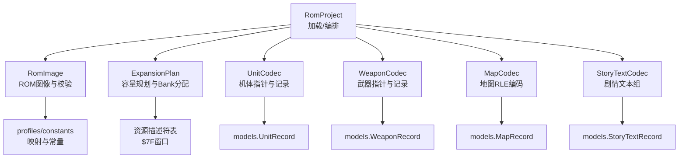

图表来源
- [src/fc_rom_editor_core.py:463-618](file://src/fc_rom_editor_core.py#L463-L618)
- [src/fc_editor/rom_image.py:50-125](file://src/fc_editor/rom_image.py#L50-L125)
- [src/fc_editor/expansion.py:84-318](file://src/fc_editor/expansion.py#L84-L318)
- [src/fc_editor/codecs/unit.py:14-120](file://src/fc_editor/codecs/unit.py#L14-L120)
- [src/fc_editor/codecs/weapon.py:13-90](file://src/fc_editor/codecs/weapon.py#L13-L90)
- [src/fc_editor/codecs/map.py:16-228](file://src/fc_editor/codecs/map.py#L16-L228)
- [src/fc_editor/codecs/story_text.py:17-259](file://src/fc_editor/codecs/story_text.py#L17-L259)

章节来源
- [src/fc_rom_editor_core.py:463-618](file://src/fc_rom_editor_core.py#L463-L618)
- [src/fc_editor/rom_image.py:50-125](file://src/fc_editor/rom_image.py#L50-L125)
- [src/fc_editor/expansion.py:84-318](file://src/fc_editor/expansion.py#L84-L318)

## 核心组件
- RomImage：封装ROM字节流，执行iNES头校验、声明大小核对、Mapper匹配、SHA256基准校验，并提供安全的读接口与Bank地址到文件偏移的转换。
- ExpansionPlan：在可用PRG Bank池中为地图、机体、剧情文本进行不重叠配额分配，支持剧情组绑定与标志位，提供序列化/反序列化与校验。
- RomProject：组合各Codec，初始化基础与扩展模式下的数据视图，维护working镜像、撤销/重做栈、事务与只读输出根保护。
- 各类Codec：以“指针表+记录”的方式实现无损解码；对扩展模式提供额外Bank/容量信息；统一提供字段级patch与往返一致性检查。

章节来源
- [src/fc_editor/rom_image.py:50-125](file://src/fc_editor/rom_image.py#L50-L125)
- [src/fc_editor/expansion.py:84-318](file://src/fc_editor/expansion.py#L84-L318)
- [src/fc_rom_editor_core.py:463-618](file://src/fc_rom_editor_core.py#L463-L618)

## 架构总览
下图展示从原始ROM到内存模型的端到端数据流，包括文件头校验、Mapper识别、扩展容量解析、指针表解析、资源定位与链接、以及各类型数据的编解码。

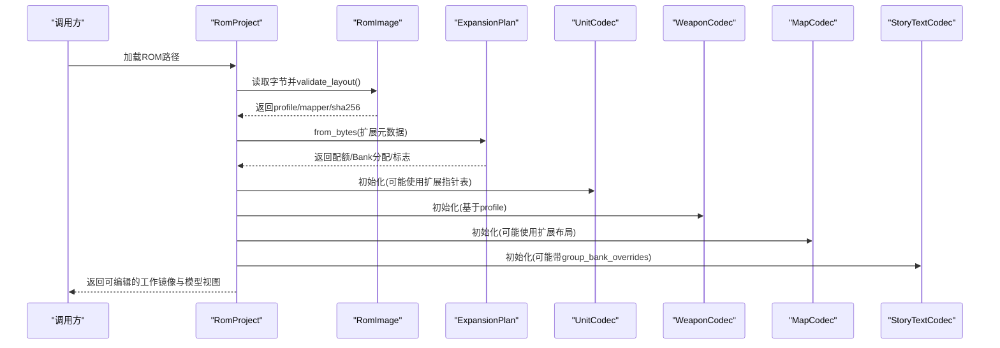

图表来源
- [src/fc_rom_editor_core.py:463-618](file://src/fc_rom_editor_core.py#L463-L618)
- [src/fc_editor/rom_image.py:79-105](file://src/fc_editor/rom_image.py#L79-L105)
- [src/fc_editor/expansion.py:277-318](file://src/fc_editor/expansion.py#L277-L318)
- [src/fc_editor/codecs/unit.py:14-120](file://src/fc_editor/codecs/unit.py#L14-L120)
- [src/fc_editor/codecs/weapon.py:13-90](file://src/fc_editor/codecs/weapon.py#L13-L90)
- [src/fc_editor/codecs/map.py:16-228](file://src/fc_editor/codecs/map.py#L16-L228)
- [src/fc_editor/codecs/story_text.py:17-259](file://src/fc_editor/codecs/story_text.py#L17-L259)

## 详细组件分析

### ROM读取与验证
- iNES头校验：检查魔数字节、头部长度、trainer大小、PRG/CHR声明大小与实际一致。
- Mapper识别：从头部提取Mapper号并与profile期望值比对，不一致则报错。
- SHA256基准校验：可选要求必须为已验证基准ROM，否则拒绝安全操作。
- 安全读取：所有读取均通过RomImage.read/read_bank，越界或跨Bank会抛出格式错误。

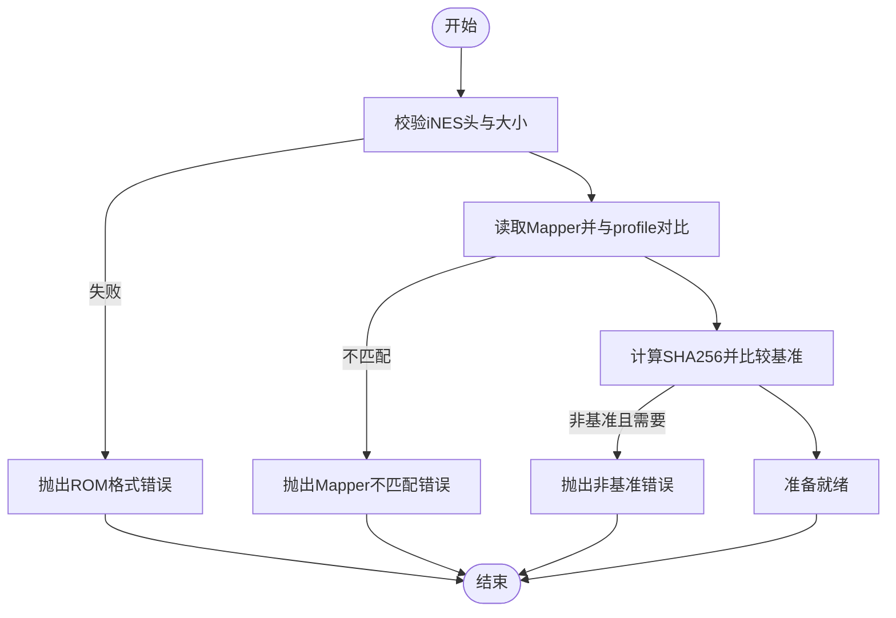

图表来源
- [src/fc_editor/rom_image.py:79-125](file://src/fc_editor/rom_image.py#L79-L125)

章节来源
- [src/fc_editor/rom_image.py:79-125](file://src/fc_editor/rom_image.py#L79-L125)

### 扩展容量管理与Bank分配
- 可用Bank池：排除音频与固定代码占用的Bank，仅保留编辑器可管理的Bank范围。
- 配额规则：地图、机体、剧情文本配额需满足对齐与上限约束；剧情组需成对占用16 KiB。
- 资源描述符表：位于扩展区域特定窗口，用于运行时资源选择器到实际Bank的映射。
- 打包算法：地图按Bank顺序连续存放，单条记录不超过单Bank；单位与名称等资源采用标准$8000目录+指针表结构。

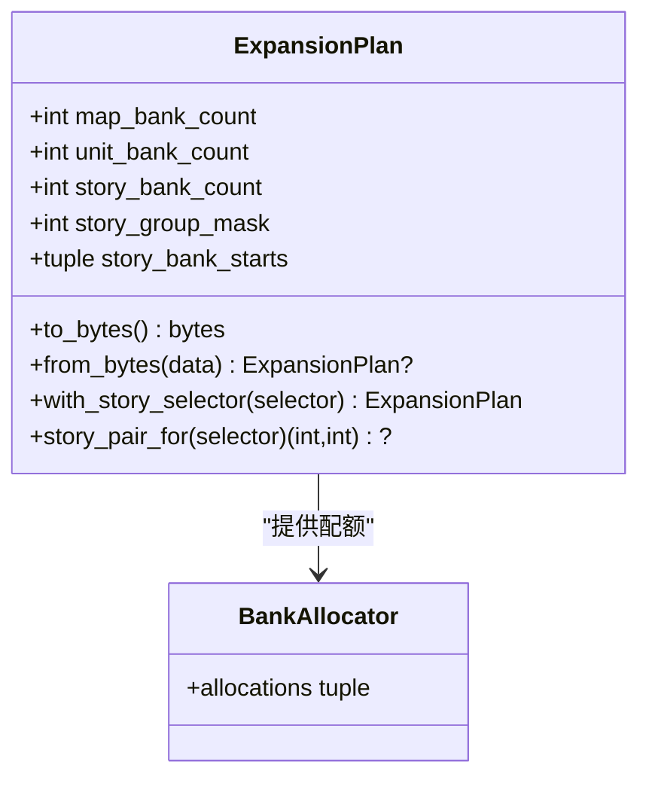

图表来源
- [src/fc_editor/expansion.py:84-318](file://src/fc_editor/expansion.py#L84-L318)

章节来源
- [src/fc_editor/expansion.py:84-318](file://src/fc_editor/expansion.py#L84-L318)

### 指针表与资源链接机制
- 指针表起始标记：多数指针表首项为0或特定起始标记，用于快速校验表完整性。
- 指针合法性：指针必须指向受支持的CPU窗口或扩展Bank区间，且记录长度不越界。
- 资源链接：扩展模式下，资源描述符表将选择器映射到具体Bank；故事文本组可被迁移至新Bank对。

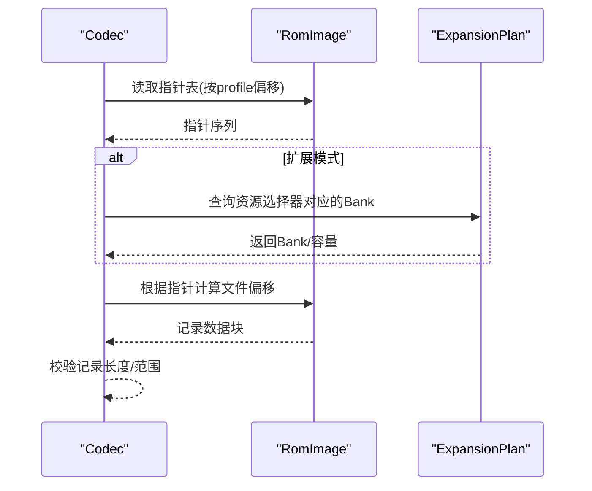

图表来源
- [src/fc_editor/codecs/unit.py:42-78](file://src/fc_editor/codecs/unit.py#L42-L78)
- [src/fc_editor/codecs/weapon.py:20-47](file://src/fc_editor/codecs/weapon.py#L20-L47)
- [src/fc_editor/codecs/map.py:49-127](file://src/fc_editor/codecs/map.py#L49-L127)
- [src/fc_editor/codecs/story_text.py:122-145](file://src/fc_editor/codecs/story_text.py#L122-L145)
- [src/fc_editor/expansion.py:27-34](file://src/fc_editor/expansion.py#L27-L34)

章节来源
- [src/fc_editor/codecs/unit.py:42-78](file://src/fc_editor/codecs/unit.py#L42-L78)
- [src/fc_editor/codecs/weapon.py:20-47](file://src/fc_editor/codecs/weapon.py#L20-L47)
- [src/fc_editor/codecs/map.py:49-127](file://src/fc_editor/codecs/map.py#L49-L127)
- [src/fc_editor/codecs/story_text.py:122-145](file://src/fc_editor/codecs/story_text.py#L122-L145)

### 数据类型编解码详解

#### 机体（Unit）
- 指针表：读取固定数量的16位指针，首项为0；每个指针指向一条固定长度的记录。
- 记录结构：每条记录包含移动、速度、强度、防卫、HP、成长曲线等字段，字段宽度与掩码由FieldSpec定义。
- 扩展支持：当存在扩展标志时，指针表与记录可能位于扩展Bank对，需使用pair_first_bank计算文件偏移。
- 字段级写入：field_patch返回精确的before/after字节片段，便于最小化差异更新。

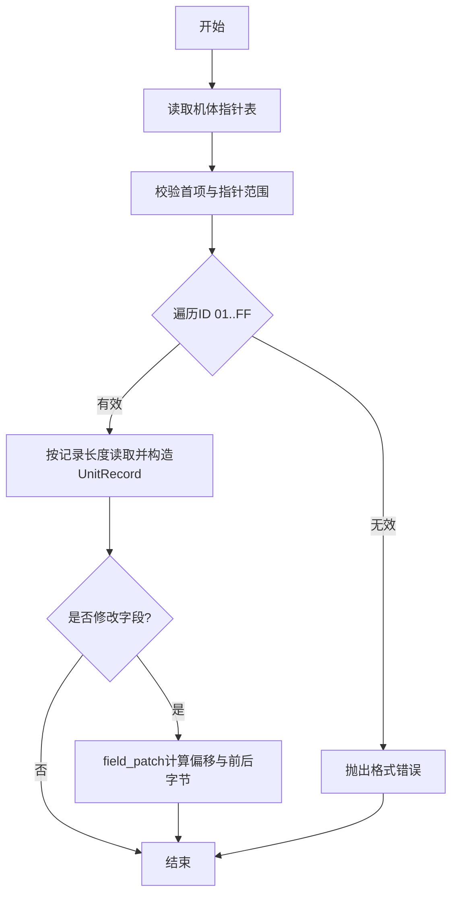

图表来源
- [src/fc_editor/codecs/unit.py:42-120](file://src/fc_editor/codecs/unit.py#L42-L120)
- [src/fc_editor/models.py:13-58](file://src/fc_editor/models.py#L13-L58)

章节来源
- [src/fc_editor/codecs/unit.py:42-120](file://src/fc_editor/codecs/unit.py#L42-L120)
- [src/fc_editor/models.py:13-58](file://src/fc_editor/models.py#L13-L58)

#### 武器（Weapon）
- 指针表：读取武器指针表，首项为0；指针指向固定长度记录。
- 记录结构：射程、命中、对不同目标的攻击值等，部分字段含半字节掩码与偏置。
- 字段级写入：field_patch返回偏移与前后字节片段。

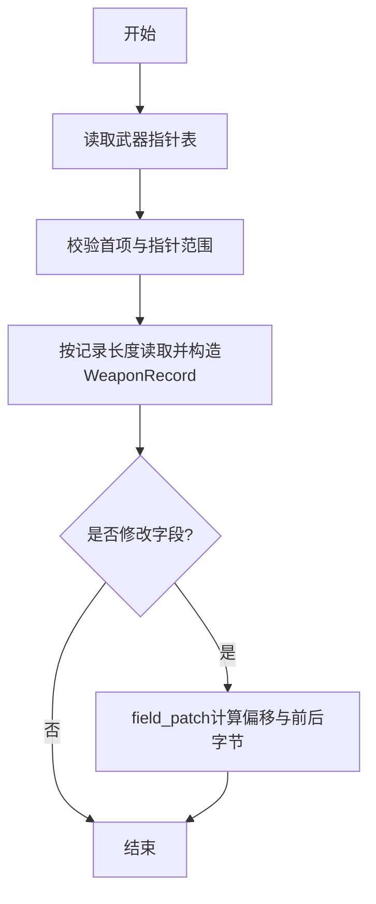

图表来源
- [src/fc_editor/codecs/weapon.py:20-90](file://src/fc_editor/codecs/weapon.py#L20-L90)
- [src/fc_editor/models.py:205-285](file://src/fc_editor/models.py#L205-L285)

章节来源
- [src/fc_editor/codecs/weapon.py:20-90](file://src/fc_editor/codecs/weapon.py#L20-L90)
- [src/fc_editor/models.py:205-285](file://src/fc_editor/models.py#L205-L285)

#### 地图（Map）
- 指针表：支持原生存储区与扩展Bank两种模式；扩展模式下指针必须在$A000—$BFFF，并通过Bank目录定位实际Bank。
- 压缩格式：4位地形RLE，每条记录包含宽高与游程编码图块序列。
- 容量计算：原生模式按下一指针或存储区末端计算容量；扩展模式按同Bank内下一指针或$C000计算。
- 替换写入：replacement_patch确保编码后不超出容量，并返回精确补丁。

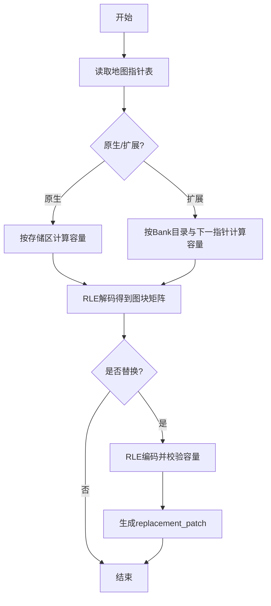

图表来源
- [src/fc_editor/codecs/map.py:49-228](file://src/fc_editor/codecs/map.py#L49-L228)

章节来源
- [src/fc_editor/codecs/map.py:49-228](file://src/fc_editor/codecs/map.py#L49-L228)

#### 剧情文本（Story Text）
- 分组与选择器：每个文本组有独立指针表与容量边界；扩展模式下可迁移至新的偶数Bank对。
- 分词与终止：字形前导字节集合用于正确切分双字节中文字形；记录以FF结尾，tokenizer保证不破坏控制码与字形边界。
- 容量与替换：replacement_patch要求替换数据与原记录等长，避免破坏后续记录。

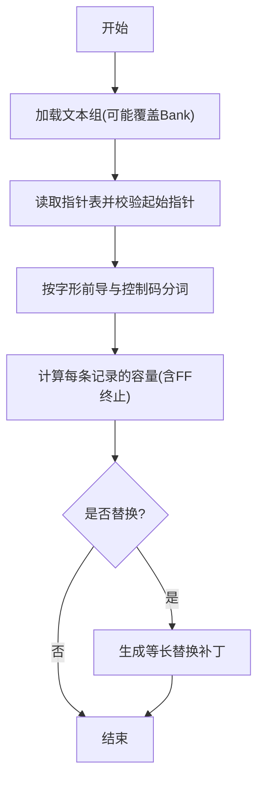

图表来源
- [src/fc_editor/codecs/story_text.py:17-259](file://src/fc_editor/codecs/story_text.py#L17-L259)

章节来源
- [src/fc_editor/codecs/story_text.py:17-259](file://src/fc_editor/codecs/story_text.py#L17-L259)

### 数据流图：从ROM到内存模型
下图汇总了从原始ROM到各内存模型的转换过程，突出错误处理与完整性检查点。

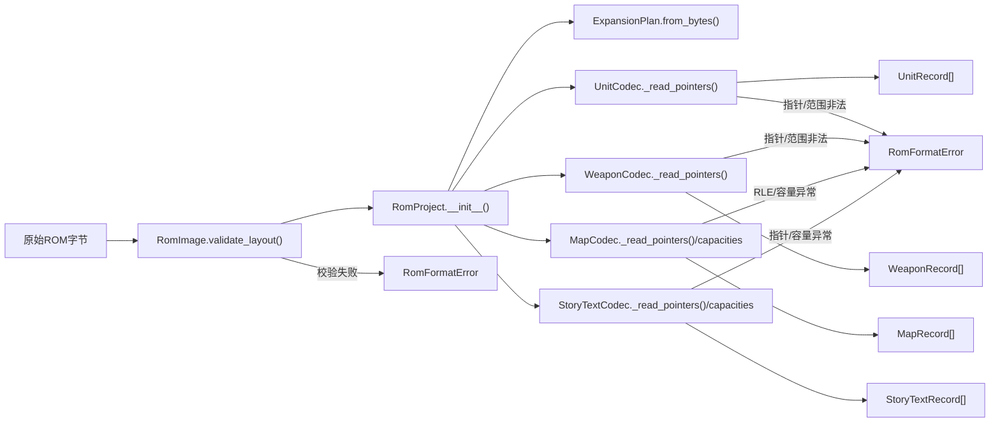

图表来源
- [src/fc_editor/rom_image.py:79-125](file://src/fc_editor/rom_image.py#L79-L125)
- [src/fc_rom_editor_core.py:463-618](file://src/fc_rom_editor_core.py#L463-L618)
- [src/fc_editor/codecs/unit.py:42-120](file://src/fc_editor/codecs/unit.py#L42-L120)
- [src/fc_editor/codecs/weapon.py:20-90](file://src/fc_editor/codecs/weapon.py#L20-L90)
- [src/fc_editor/codecs/map.py:49-228](file://src/fc_editor/codecs/map.py#L49-L228)
- [src/fc_editor/codecs/story_text.py:122-259](file://src/fc_editor/codecs/story_text.py#L122-L259)

## 依赖关系分析
- RomProject强耦合于RomImage与各Codec，通过profile与常量协调不同版本ROM的差异。
- 各Codec依赖RomImage的安全读取与BankAddress转换，确保指针到文件偏移的正确性。
- ExpansionPlan与资源描述符表共同决定运行时资源定位，影响多个Codec的容量与指针有效性。

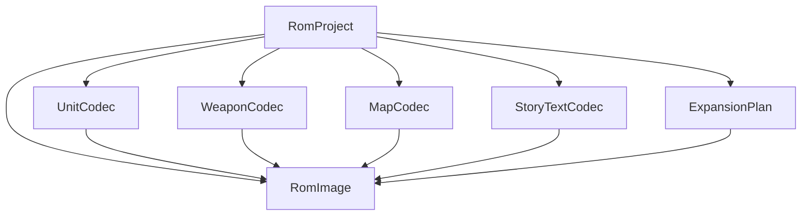

图表来源
- [src/fc_rom_editor_core.py:463-618](file://src/fc_rom_editor_core.py#L463-L618)
- [src/fc_editor/rom_image.py:50-125](file://src/fc_editor/rom_image.py#L50-L125)
- [src/fc_editor/expansion.py:84-318](file://src/fc_editor/expansion.py#L84-L318)

章节来源
- [src/fc_rom_editor_core.py:463-618](file://src/fc_rom_editor_core.py#L463-L618)
- [src/fc_editor/rom_image.py:50-125](file://src/fc_editor/rom_image.py#L50-L125)
- [src/fc_editor/expansion.py:84-318](file://src/fc_editor/expansion.py#L84-L318)

## 性能考量
- 批量读取：指针表与记录通常按固定长度读取，建议尽量使用一次性切片减少系统调用。
- 去重与合并：资源打包时利用address_by_payload进行重复记录去重，减少冗余。
- 最小化补丁：field_patch与replacement_patch仅返回必要字节差异，利于IPS生成与增量更新。
- 容量预检：在编码阶段提前校验容量，避免回退与重试。

[本节为通用指导，无需引用具体文件]

## 故障排查指南
- iNES头或大小不符：检查ROM是否为合法iNES格式，确认PRG/CHR声明与实际一致。
- Mapper不匹配：确认ROM使用的Mapper与profile期望一致，必要时调整profile或ROM源。
- 指针表不完整或起始标记错误：检查指针表偏移与长度，确认首项是否符合约定。
- 指针越界或记录超出支持区域：核对指针所在窗口与Bank范围，确保未指向未分配区域。
- 地图RLE数据异常：检查宽高与图块数量一致性，确认游程未越界。
- 剧情文本缺失FF终止或字形码不完整：确保文本编码保持字形前导字节配对，并以FF结尾。
- 扩展容量表校验失败：确认扩展元数据魔数、版本与CRC校验通过。

章节来源
- [src/fc_editor/rom_image.py:79-125](file://src/fc_editor/rom_image.py#L79-L125)
- [src/fc_editor/codecs/unit.py:42-120](file://src/fc_editor/codecs/unit.py#L42-L120)
- [src/fc_editor/codecs/weapon.py:20-90](file://src/fc_editor/codecs/weapon.py#L20-L90)
- [src/fc_editor/codecs/map.py:49-228](file://src/fc_editor/codecs/map.py#L49-L228)
- [src/fc_editor/codecs/story_text.py:122-259](file://src/fc_editor/codecs/story_text.py#L122-L259)
- [src/fc_editor/expansion.py:277-318](file://src/fc_editor/expansion.py#L277-L318)

## 结论
该流水线通过严格的ROM头与Mapper校验、可扩展的容量规划与Bank分配、健壮的指针表解析与资源链接，以及针对机体、武器、地图、剧情文本的专用编解码器，实现了从原始ROM到内存模型的可靠转换。错误处理贯穿始终，确保数据完整性与可恢复性。扩展容量管理机制使工具能够在不破坏原游戏逻辑的前提下，安全地增加内容容量并进行资源重组。

## 附录
- 常用常量与配置：参考constants与profiles模块中的PRG Bank大小、记录尺寸、增长曲线上限等。
- 工程集成：RomProject.load_project支持从工程文件重建工作镜像并执行完整性检查。
- 输出产物：可通过make_ips生成差异补丁，结合apply_ips进行回滚或应用。

[本节为补充说明，无需引用具体文件]