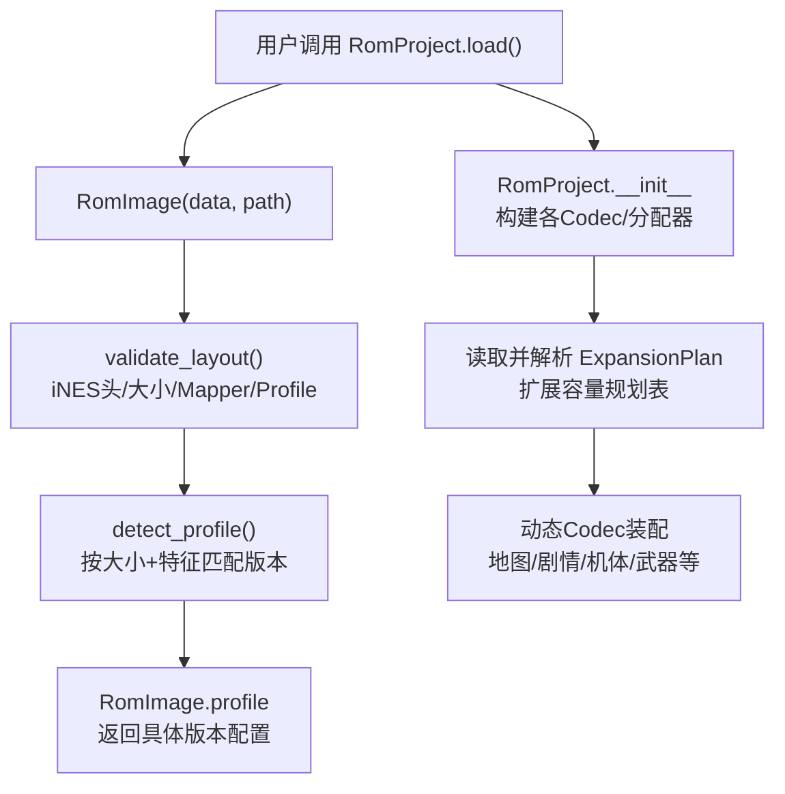
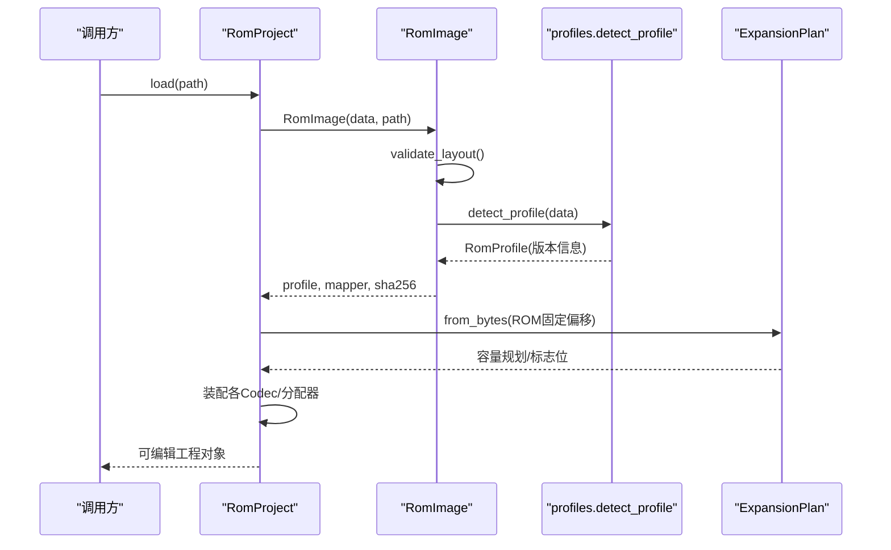
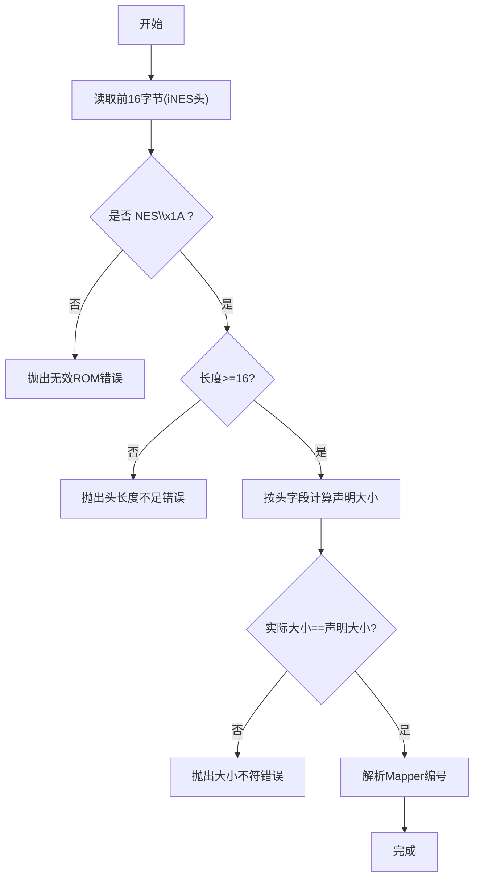
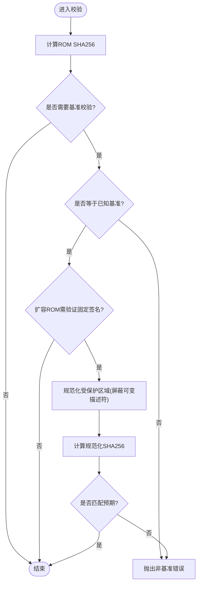
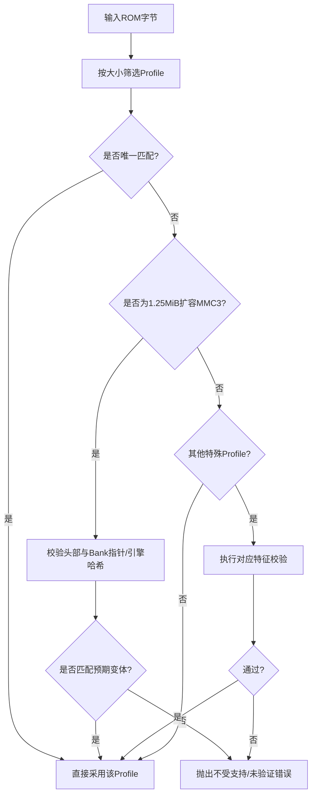
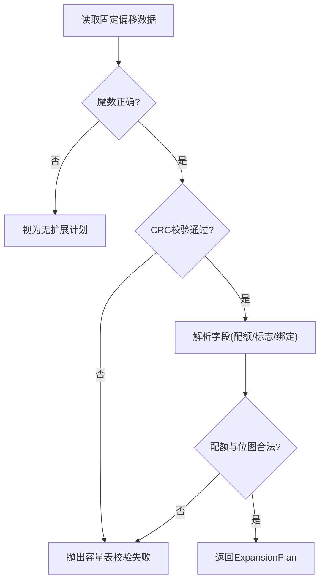
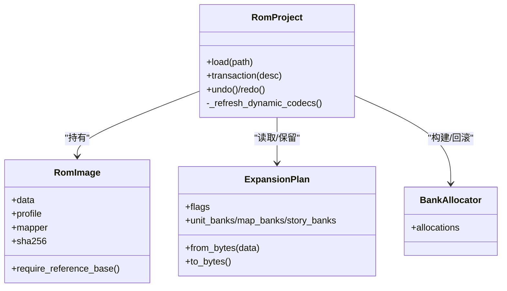
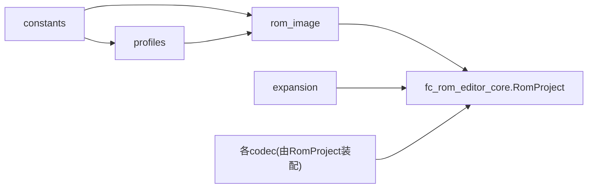

# ROM文件加载与验证

<cite>
**本文引用的文件**
- [src/fc_rom_editor_core.py](file://src/fc_rom_editor_core.py)
- [src/fc_editor/rom_image.py](file://src/fc_editor/rom_image.py)
- [src/fc_editor/constants.py](file://src/fc_editor/constants.py)
- [src/fc_editor/profiles.py](file://src/fc_editor/profiles.py)
- [src/fc_editor/expansion.py](file://src/fc_editor/expansion.py)
- [src/fc_editor/errors.py](file://src/fc_editor/errors.py)
- [tests/test_protected_rom_signature.py](file://tests/test_protected_rom_signature.py)
- [tests/test_rom_data_browser.py](file://tests/test_rom_data_browser.py)
</cite>

## 目录
1. [简介](#简介)
2. [项目结构](#项目结构)
3. [核心组件](#核心组件)
4. [架构总览](#架构总览)
5. [详细组件分析](#详细组件分析)
6. [依赖关系分析](#依赖关系分析)
7. [性能考虑](#性能考虑)
8. [故障排查指南](#故障排查指南)
9. [结论](#结论)
10. [附录：代码示例路径](#附录：代码示例路径)

## 简介
本文件面向DC修改器，系统性说明ROM文件的加载与验证流程。内容覆盖iNES头解析、Mapper编号识别（MMC3/MMC5等）、SHA256校验和验证、基线ROM校验、扩展容量规划表验证、不同ROM版本的自动检测与兼容处理，以及错误处理策略与恢复机制。文档同时提供流程图与时序图，帮助读者理解从“读取字节”到“可编辑工程对象”的完整链路。

## 项目结构
围绕ROM加载与验证的关键模块分布如下：
- 入口与高层编排：RomProject（负责ROM工程化封装、编解码器装配、事务与撤销重做）
- ROM图像与布局校验：RomImage（iNES头校验、大小/声明一致性、Mapper校验、参考基准校验）
- 版本与布局配置：profiles（多版本Profile定义、detect_profile自动识别、受保护区域签名校验）
- 常量与边界：constants（ROM尺寸、Mapper、Bank大小、关键偏移、受保护Bank列表）
- 扩展容量规划：expansion（ExpansionPlan元数据读写、CRC校验、可用Bank池、资源打包）
- 错误模型：errors（统一异常类型）
- 测试用例：test_protected_rom_signature.py、test_rom_data_browser.py（验证签名与浏览器行为）

图表来源
- [src/fc_rom_editor_core.py:463-618](file://src/fc_rom_editor_core.py#L463-L618)
- [src/fc_editor/rom_image.py:50-105](file://src/fc_editor/rom_image.py#L50-L105)
- [src/fc_editor/profiles.py:699-759](file://src/fc_editor/profiles.py#L699-L759)
- [src/fc_editor/expansion.py:277-318](file://src/fc_editor/expansion.py#L277-L318)

章节来源
- [src/fc_rom_editor_core.py:463-618](file://src/fc_rom_editor_core.py#L463-L618)
- [src/fc_editor/rom_image.py:50-105](file://src/fc_editor/rom_image.py#L50-L105)
- [src/fc_editor/profiles.py:699-759](file://src/fc_editor/profiles.py#L699-L759)
- [src/fc_editor/expansion.py:277-318](file://src/fc_editor/expansion.py#L277-L318)

## 核心组件
- RomImage：封装只读ROM字节流，提供iNES头校验、Mapper读取、SHA256计算、参考基准判定、安全读取接口。
- profiles.detect_profile：根据ROM大小与固定区域特征（包括音频引擎哈希、头部字面量、指针特征）自动识别ROM版本，并返回对应RomProfile。
- expansion.ExpansionPlan：表示扩容ROM中的容量规划表（位于固定偏移），包含CRC校验与字段合法性检查；用于划分地图、机体、剧情等资源空间。
- RomProject：在RomImage基础上装配各类编解码器（机体、武器、地图、剧情文本等），并根据是否存在扩展标志启用相应能力；提供事务、撤销/重做、差异补丁生成等能力。

章节来源
- [src/fc_editor/rom_image.py:50-125](file://src/fc_editor/rom_image.py#L50-L125)
- [src/fc_editor/profiles.py:699-759](file://src/fc_editor/profiles.py#L699-L759)
- [src/fc_editor/expansion.py:84-318](file://src/fc_editor/expansion.py#L84-L318)
- [src/fc_rom_editor_core.py:463-618](file://src/fc_rom_editor_core.py#L463-L618)

## 架构总览
下图展示从“打开ROM文件”到“可编辑工程”的端到端流程，涵盖头解析、版本识别、扩展规划、编解码器装配与校验。

图表来源
- [src/fc_rom_editor_core.py:638-618](file://src/fc_rom_editor_core.py#L638-L618)
- [src/fc_editor/rom_image.py:58-105](file://src/fc_editor/rom_image.py#L58-L105)
- [src/fc_editor/profiles.py:699-759](file://src/fc_editor/profiles.py#L699-L759)
- [src/fc_editor/expansion.py:294-318](file://src/fc_editor/expansion.py#L294-L318)

## 详细组件分析

### iNES头解析与Mapper识别
- 头长度与格式校验：确保文件以“NES”标识开头且满足最小头长。
- 声明大小与实际大小比对：依据头中PRG/CHR计数计算声明大小，必须与实际文件大小一致。
- Mapper编号提取：从第7、8字节组合得到Mapper号，用于后续版本判断与兼容性选择。
- 支持MMC3/MMC5等不同Mapper：通过profile映射到具体布局与常量。

图表来源
- [src/fc_editor/rom_image.py:79-105](file://src/fc_editor/rom_image.py#L79-L105)
- [src/fc_editor/rom_image.py:16-19](file://src/fc_editor/rom_image.py#L16-L19)

章节来源
- [src/fc_editor/rom_image.py:79-105](file://src/fc_editor/rom_image.py#L79-L105)
- [src/fc_editor/rom_image.py:16-19](file://src/fc_editor/rom_image.py#L16-L19)

### SHA256校验与基线ROM验证
- 全量SHA256：对ROM整体计算哈希，用于唯一标识与日志记录。
- 参考基准校验：若需要严格回放或审计，可要求ROM为已验证的基准版（例如原始中文汉化或特定扩容版本）。
- 扩容ROM固定代码签名：对iNES头与受保护Bank（如$64/$7E/$7F）进行规范化后计算签名，忽略可管理描述符，确保核心代码未被篡改。

图表来源
- [src/fc_editor/rom_image.py:71-112](file://src/fc_editor/rom_image.py#L71-L112)
- [src/fc_editor/profiles.py:23-54](file://src/fc_editor/profiles.py#L23-L54)
- [src/fc_editor/constants.py:45-68](file://src/fc_editor/constants.py#L45-L68)

章节来源
- [src/fc_editor/rom_image.py:71-112](file://src/fc_editor/rom_image.py#L71-L112)
- [src/fc_editor/profiles.py:23-54](file://src/fc_editor/profiles.py#L23-L54)
- [src/fc_editor/constants.py:45-68](file://src/fc_editor/constants.py#L45-L68)

### 版本自动检测与兼容性处理
- 按ROM大小初筛候选Profile。
- 针对特殊大小（如1.25 MiB扩容MMC3）进一步校验头部字面量与关键Bank指针/哈希，区分“原版扩容”与“回收资源池扩容”两种变体。
- 对MMC5/FamiStudio布局进行额外签名校验，确保音频桥接Bank未被替换。
- 对V51布局进行特征码校验，保证目标ROM确认为时空之影II V5.1。

图表来源
- [src/fc_editor/profiles.py:699-759](file://src/fc_editor/profiles.py#L699-L759)

章节来源
- [src/fc_editor/profiles.py:699-759](file://src/fc_editor/profiles.py#L699-L759)

### 扩展容量规划表验证
- 位置与结构：位于固定偏移处，包含魔数、版本、地图/机体/剧情配额、标志位、剧情组绑定表等。
- CRC校验：对头部进行CRC32校验，防止损坏或误写。
- 配额合法性：校验各配额范围、总和不超过可用池、剧情配额为偶数且不超过上限、剧情组位图与绑定表一致。
- 标志位使用：当存在FLAG_UNITS/FLAG_MAPS/FLAG_SCENARIOS/FLAG_MAP_TRIGGERS时，RomProject据此启用对应的扩展编解码器与布局。

图表来源
- [src/fc_editor/expansion.py:277-318](file://src/fc_editor/expansion.py#L277-L318)
- [src/fc_editor/expansion.py:84-129](file://src/fc_editor/expansion.py#L84-L129)

章节来源
- [src/fc_editor/expansion.py:277-318](file://src/fc_editor/expansion.py#L277-L318)
- [src/fc_editor/expansion.py:84-129](file://src/fc_editor/expansion.py#L84-L129)

### 编解码器装配与动态切换
- 基础能力：无论是否扩容，均装配通用编解码器（如武器、角色名等）。
- 扩展能力：若检测到扩展标志，则基于ExpansionPlan重新定位指针表与数据区，装配扩展版编解码器（如扩展地图、剧情文本、机体名称引用）。
- 资源分配器：根据Profile与原始ROM构建BankAllocator，并在事务中维护分配快照，支持撤销/重做。

图表来源
- [src/fc_rom_editor_core.py:463-618](file://src/fc_rom_editor_core.py#L463-L618)
- [src/fc_editor/expansion.py:84-318](file://src/fc_editor/expansion.py#L84-L318)

章节来源
- [src/fc_rom_editor_core.py:463-618](file://src/fc_rom_editor_core.py#L463-L618)
- [src/fc_editor/expansion.py:84-318](file://src/fc_editor/expansion.py#L84-L318)

### 错误处理与恢复策略
- 统一异常：RomFormatError（ROM格式不匹配）、ProjectFormatError（工程文件或基准不一致）、ChangeConflictError（写入冲突）。
- 健壮性：所有关键步骤（头校验、大小校验、Mapper校验、CRC校验、签名校验）均抛出明确异常，便于上层捕获并提示用户。
- 事务与撤销：RomProject.transaction包裹一组变更，若发生异常将回滚到事务前的working与分配状态；支持undo/redo历史栈。
- 只读输出保护：输出路径若命中只读根目录会拒绝写入，避免误改参考ROM。

章节来源
- [src/fc_editor/errors.py:1-11](file://src/fc_editor/errors.py#L1-L11)
- [src/fc_rom_editor_core.py:614-785](file://src/fc_rom_editor_core.py#L614-L785)
- [src/fc_rom_editor_core.py:626-636](file://src/fc_rom_editor_core.py#L626-L636)

## 依赖关系分析
- RomImage依赖constants与profiles，用于布局与版本判定。
- RomProject依赖RomImage、expansion、profiles、constants及各codec，组装完整编辑环境。
- tests验证签名与浏览器行为，间接验证加载与校验链路的正确性。

图表来源
- [src/fc_editor/rom_image.py:1-14](file://src/fc_editor/rom_image.py#L1-L14)
- [src/fc_editor/profiles.py:1-17](file://src/fc_editor/profiles.py#L1-L17)
- [src/fc_rom_editor_core.py:15-105](file://src/fc_rom_editor_core.py#L15-L105)

章节来源
- [src/fc_editor/rom_image.py:1-14](file://src/fc_editor/rom_image.py#L1-L14)
- [src/fc_editor/profiles.py:1-17](file://src/fc_editor/profiles.py#L1-L17)
- [src/fc_rom_editor_core.py:15-105](file://src/fc_rom_editor_core.py#L15-L105)

## 性能考虑
- 一次性读取与不可变数据：RomImage将ROM作为不可变bytes，减少重复IO与拷贝。
- 按需装配：仅在检测到扩展标志时才装配扩展编解码器，避免不必要的开销。
- 紧凑打包：地图/机体等资源打包时尽量复用与去重，降低存储与传输成本。
- 原子写入：输出文件使用临时文件+fsync+替换，避免部分写入导致的中断风险。

[本节为通用指导，不直接分析具体文件]

## 故障排查指南
- “文件不是有效的 iNES ROM”：确认文件头为“NES\x1A”，且为完整NES ROM而非NSF或其他格式。
- “ROM 大小与 iNES 头不符”：检查PRG/CHR数量是否与文件大小一致，排除被截断或填充错误的文件。
- “Mapper 不匹配”：确认目标ROM的Mapper与Profile期望一致（如MMC3/MMC5）。
- “扩展容量表校验失败”：扩容ROM的容量规划表CRC不通过，可能遭损坏或被错误工具改写。
- “ROM 的 SHA-256 不是已验证基准版”：如需严格回放，请提供官方基准ROM或使用允许的非基准模式。
- “固定代码认证签名不匹配”：扩容ROM的受保护Bank或iNES头被修改，需恢复至受信任版本。
- 事务异常回滚：若在transaction块内抛出异常，RomProject会自动回滚到事务前状态，可重试或回退操作。

章节来源
- [src/fc_editor/rom_image.py:79-112](file://src/fc_editor/rom_image.py#L79-L112)
- [src/fc_editor/expansion.py:294-318](file://src/fc_editor/expansion.py#L294-L318)
- [src/fc_rom_editor_core.py:714-785](file://src/fc_rom_editor_core.py#L714-L785)

## 结论
DC修改器的ROM加载与验证体系以“强校验、可追溯、可回滚”为核心：通过iNES头与大小校验确保文件格式有效，通过版本检测与受保护签名保障ROM布局可信，通过扩展容量规划表实现灵活的资源分区，并通过事务与撤销机制提供安全的编辑体验。遵循上述流程与错误提示，可高效、可靠地加载与验证各类DC ROM。

## 附录：代码示例路径
以下路径展示了如何正确加载与验证ROM文件（不包含具体代码内容）：
- 加载ROM并获取工程对象
  - [RomProject.load:638-641](file://src/fc_rom_editor_core.py#L638-L641)
  - [RomImage.load:58-61](file://src/fc_editor/rom_image.py#L58-L61)
- 解析头与Mapper
  - [mapper_number:16-19](file://src/fc_editor/rom_image.py#L16-L19)
  - [validate_layout:79-105](file://src/fc_editor/rom_image.py#L79-L105)
- 版本检测与兼容性
  - [detect_profile:699-759](file://src/fc_editor/profiles.py#L699-L759)
- 扩展容量规划表读取与校验
  - [ExpansionPlan.from_bytes:294-318](file://src/fc_editor/expansion.py#L294-L318)
- 基准与签名校验
  - [RomImage.require_reference_base:107-112](file://src/fc_editor/rom_image.py#L107-L112)
  - [dc_expanded_mmc3_protected_signature_is_valid:45-54](file://src/fc_editor/profiles.py#L45-L54)
- 事务与撤销
  - [RomProject.transaction:714-743](file://src/fc_rom_editor_core.py#L714-L743)
  - [RomProject.undo/redo:761-785](file://src/fc_rom_editor_core.py#L761-L785)
- 测试参考
  - [protected ROM signature 测试](file://tests/test_protected_rom_signature.py)
  - [ROM数据浏览器测试](file://tests/test_rom_data_browser.py)