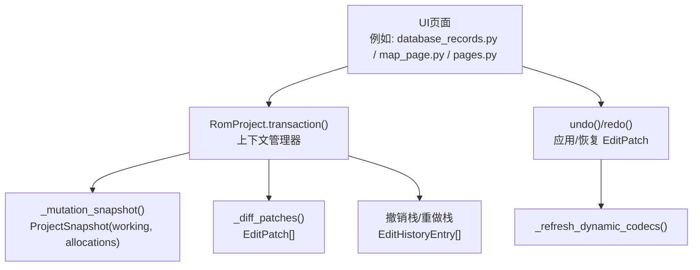
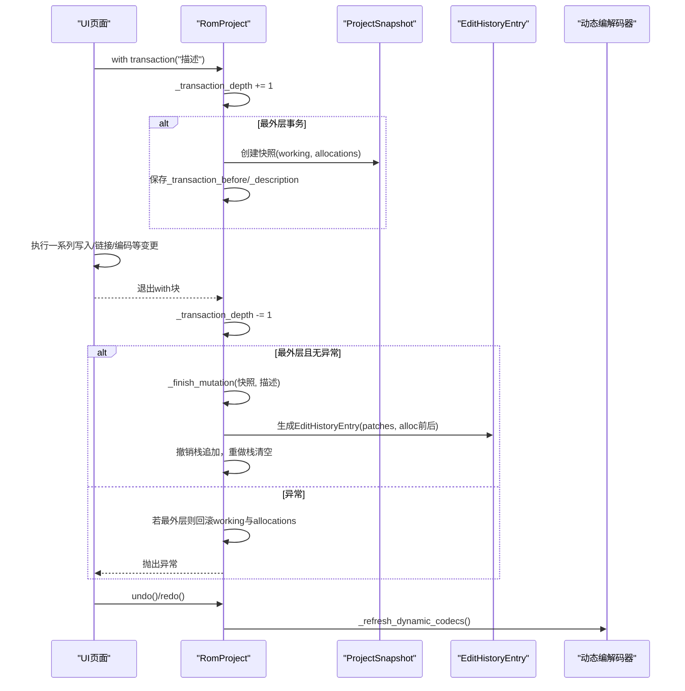
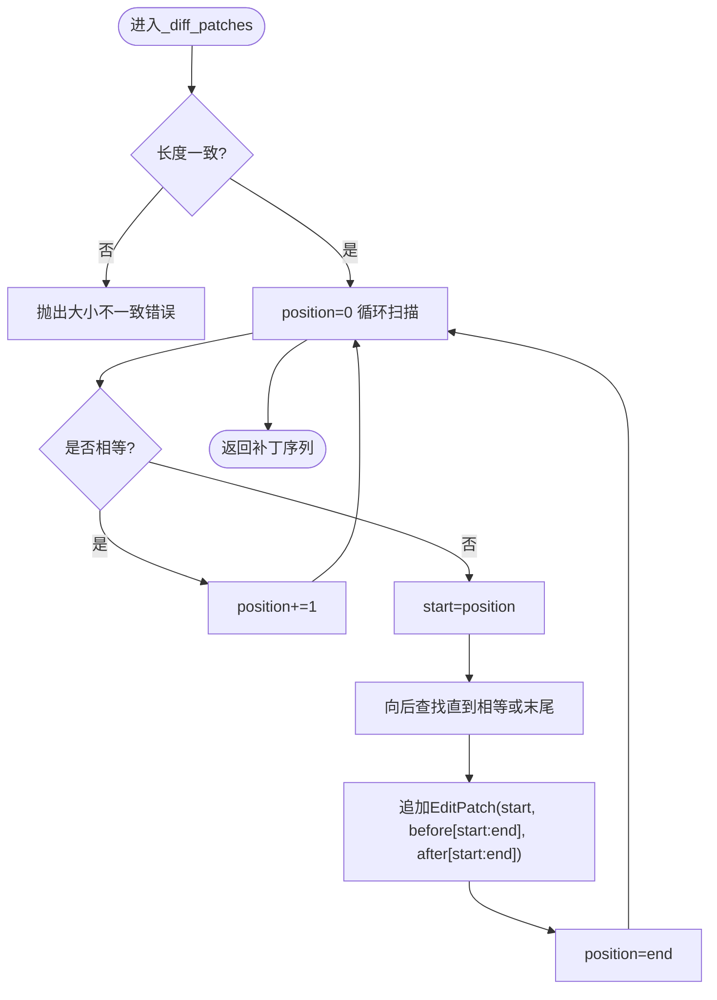
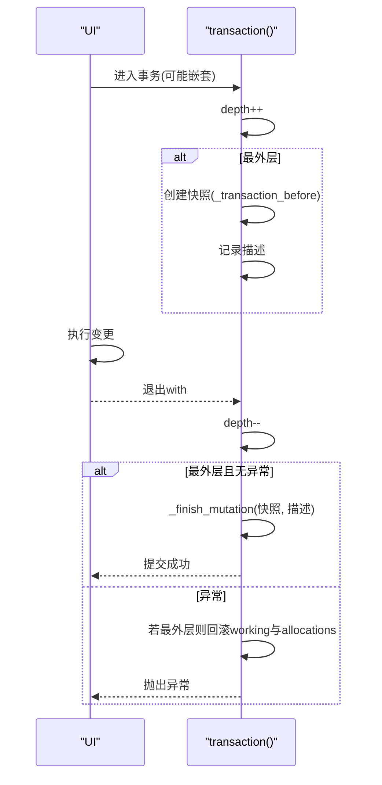
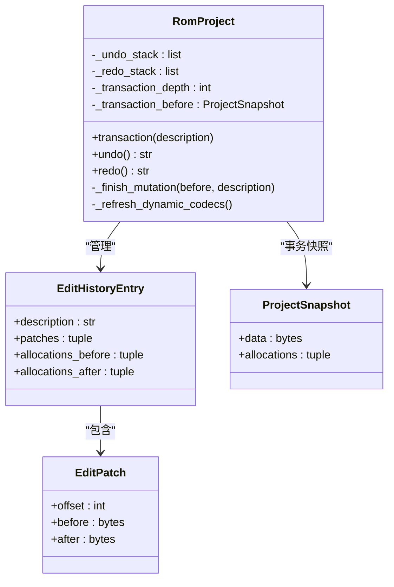
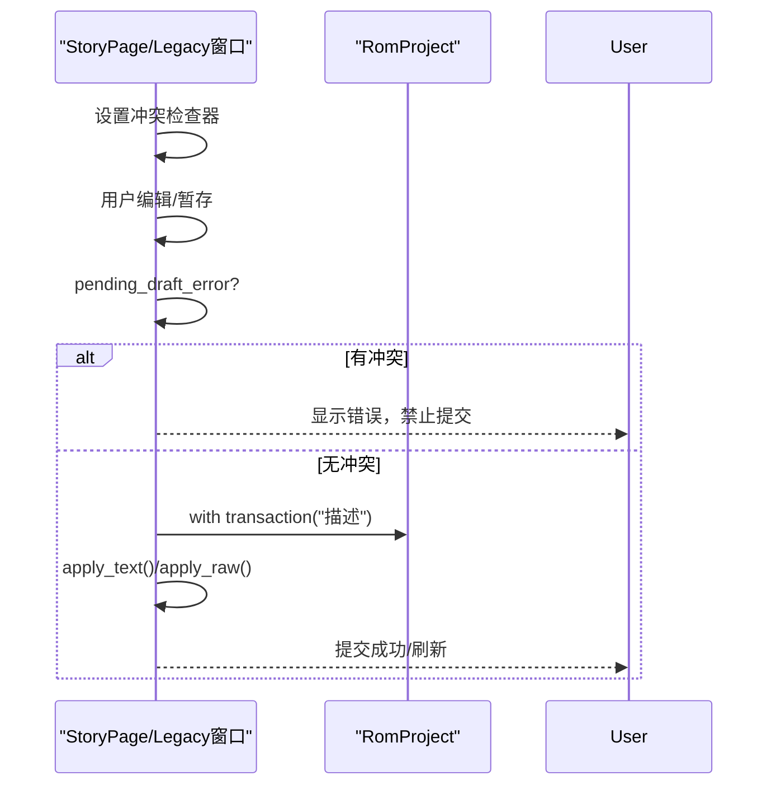
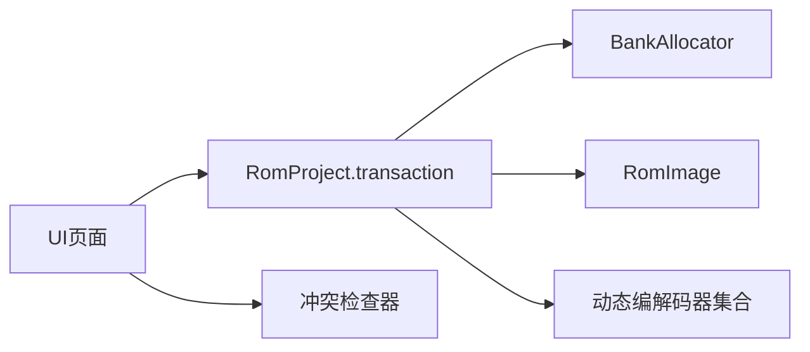

# 事务处理与撤销重做

<cite>
**本文引用的文件**
- [fc_rom_editor_core.py](file://src/fc_rom_editor_core.py)
- [legacy_windows.py](file://src/dc_modifier/legacy_windows.py)
- [story_page.py](file://src/dc_modifier/story_page.py)
- [database_records.py](file://src/dc_modifier/database_records.py)
- [map_page.py](file://src/dc_modifier/map_page.py)
- [pages.py](file://src/dc_modifier/pages.py)
- [unit_appearance_dialog.py](file://src/dc_modifier/unit_appearance_dialog.py)
- [unit_import_page.py](file://src/dc_modifier/unit_import_page.py)
</cite>

## 目录
1. [简介](#简介)
2. [项目结构](#项目结构)
3. [核心组件](#核心组件)
4. [架构总览](#架构总览)
5. [详细组件分析](#详细组件分析)
6. [依赖关系分析](#依赖关系分析)
7. [性能考虑](#性能考虑)
8. [故障排查指南](#故障排查指南)
9. [结论](#结论)
10. [附录：事务操作示例与最佳实践](#附录：事务操作示例与最佳实践)

## 简介
本文件面向DC修改器的事务处理与撤销/重做机制，围绕以下目标展开：
- 解释 EditHistoryEntry、ProjectSnapshot 的设计原理与作用。
- 说明编辑历史的记录机制、快照管理策略与补丁生成算法。
- 详述 transaction 上下文管理器的工作机制、嵌套事务与异常回滚策略。
- 解释撤销/重做的数据结构设计（EditPatch）与应用流程、状态同步机制。
- 提供事务处理的最佳实践、性能考量与错误处理策略。
- 给出具体事务操作示例与常见问题的定位方法。

## 项目结构
DC修改器的撤销/重做能力由核心工程对象 RomProject 统一实现，UI页面通过 with self.project.transaction(...) 将一组相关变更封装为原子事务；事务成功完成后，系统自动计算差异并生成可撤销的补丁序列，同时维护撤销栈与重做栈。

图表来源
- [fc_rom_editor_core.py:714-743](file://src/fc_rom_editor_core.py#L714-L743)
- [fc_rom_editor_core.py:692-712](file://src/fc_rom_editor_core.py#L692-L712)
- [fc_rom_editor_core.py:761-785](file://src/fc_rom_editor_core.py#L761-L785)
- [fc_rom_editor_core.py:836-913](file://src/fc_rom_editor_core.py#L836-L913)

章节来源
- [fc_rom_editor_core.py:618-743](file://src/fc_rom_editor_core.py#L618-L743)
- [database_records.py:209-255](file://src/dc_modifier/database_records.py#L209-L255)
- [map_page.py:2657-2860](file://src/dc_modifier/map_page.py#L2657-L2860)
- [pages.py:799-871](file://src/dc_modifier/pages.py#L799-L871)

## 核心组件
- EditPatch：描述ROM工作区中一段偏移处的“前/后”字节差异，用于撤销或重做时精确还原或应用变更。
- EditHistoryEntry：一次用户可见操作的完整历史条目，包含描述、补丁序列以及资源配额分配的前后状态。
- ProjectSnapshot：事务开始时的工作区快照，包括ROM工作缓冲区的副本与资源分配器当前配额状态。
- RomProject.transaction：基于Python contextmanager的事务上下文，负责外层快照捕获、嵌套计数、异常回滚与最终提交。
- undo/redo：从历史栈弹出条目，按补丁序列反向/正向应用到 working，并重建动态编解码器视图。

章节来源
- [fc_rom_editor_core.py:112-131](file://src/fc_rom_editor_core.py#L112-L131)
- [fc_rom_editor_core.py:618-743](file://src/fc_rom_editor_core.py#L618-L743)
- [fc_rom_editor_core.py:761-785](file://src/fc_rom_editor_core.py#L761-L785)

## 架构总览
下图展示了事务在UI层到核心层的调用链路与数据流：

图表来源
- [fc_rom_editor_core.py:714-743](file://src/fc_rom_editor_core.py#L714-L743)
- [fc_rom_editor_core.py:692-712](file://src/fc_rom_editor_core.py#L692-L712)
- [fc_rom_editor_core.py:761-785](file://src/fc_rom_editor_core.py#L761-L785)
- [fc_rom_editor_core.py:836-913](file://src/fc_rom_editor_core.py#L836-L913)

## 详细组件分析

### 数据结构与补丁生成
- EditPatch
  - 字段：offset、before、after
  - 作用：以最小粒度记录ROM工作区某段偏移的原始与变更后字节，支持高效撤销/重做。
- EditHistoryEntry
  - 字段：description、patches、allocations_before、allocations_after
  - 作用：封装一次用户可见操作的完整信息，包括资源配额变化，确保撤销/重做时能完全复原状态。
- ProjectSnapshot
  - 字段：data、allocations
  - 作用：事务开始时对 ROM 工作缓冲区与资源分配状态的深拷贝，作为回滚基准。
- 补丁生成算法 _diff_patches
  - 输入：before、after 两段等长字节
  - 过程：线性扫描，收集连续差异区间，生成 EditPatch 元组
  - 复杂度：时间 O(N)，空间 O(K)（K为差异块数）
  - 约束：长度不一致会抛错，保证一致性

图表来源
- [fc_rom_editor_core.py:676-690](file://src/fc_rom_editor_core.py#L676-L690)

章节来源
- [fc_rom_editor_core.py:112-131](file://src/fc_rom_editor_core.py#L112-L131)
- [fc_rom_editor_core.py:676-712](file://src/fc_rom_editor_core.py#L676-L712)

### 事务上下文管理器与嵌套事务
- transaction(description)
  - 外层检测：仅在最外层事务创建 ProjectSnapshot 并记录描述
  - 嵌套计数：_transaction_depth 自增/自减，确保多层嵌套正确
  - 异常回滚：若最外层发生异常，恢复 working 与 resource_allocator，并刷新动态编解码器
  - 提交逻辑：正常退出时调用 _finish_mutation，生成 EditHistoryEntry 并入撤销栈，清空重做栈
- 嵌套事务
  - 内部事务不重复创建快照，避免冗余开销
  - 所有内部变更累积到同一份 working，最终在外层统一提交
- 与UI集成
  - UI页面使用 with self.project.transaction("描述") 包裹批量操作，保证原子性与可撤销性

图表来源
- [fc_rom_editor_core.py:714-743](file://src/fc_rom_editor_core.py#L714-L743)

章节来源
- [fc_rom_editor_core.py:714-743](file://src/fc_rom_editor_core.py#L714-L743)
- [database_records.py:209-255](file://src/dc_modifier/database_records.py#L209-L255)
- [map_page.py:2657-2860](file://src/dc_modifier/map_page.py#L2657-L2860)
- [pages.py:799-871](file://src/dc_modifier/pages.py#L799-L871)

### 撤销与重做
- undo()
  - 从撤销栈弹出条目，按补丁序列将 before 写回 working
  - 恢复 allocations_before，重建动态编解码器
  - 将条目压入重做栈
- redo()
  - 从重做栈弹出条目，按补丁序列将 after 写回 working
  - 恢复 allocations_after，重建动态编解码器
  - 将条目压入撤销栈
- 状态同步
  - 每次撤销/重做后调用 _refresh_dynamic_codecs()，使上层视图与底层ROM状态一致

图表来源
- [fc_rom_editor_core.py:112-131](file://src/fc_rom_editor_core.py#L112-L131)
- [fc_rom_editor_core.py:714-785](file://src/fc_rom_editor_core.py#L714-L785)
- [fc_rom_editor_core.py:836-913](file://src/fc_rom_editor_core.py#L836-L913)

章节来源
- [fc_rom_editor_core.py:745-785](file://src/fc_rom_editor_core.py#L745-L785)
- [fc_rom_editor_core.py:836-913](file://src/fc_rom_editor_core.py#L836-L913)

### UI侧事务同步与冲突检查
- legacy_windows.py
  - 暴露 transaction_sync_group 与 pending_draft_key，用于识别暂存草稿的键空间
  - 提供 set_transaction_conflict_checker 与 pending_draft_error，阻止存在冲突的提交
- story_page.py
  - 同样暴露 transaction_sync_group 与 pending_draft_key，并在 commit_pending_changes 中校验与提交
  - 文本替换时进行长度与扩展规划校验，必要时调用 story_text_replacement_usage 进行容量检查

图表来源
- [legacy_windows.py:271-317](file://src/dc_modifier/legacy_windows.py#L271-L317)
- [story_page.py:353-406](file://src/dc_modifier/story_page.py#L353-L406)

章节来源
- [legacy_windows.py:271-317](file://src/dc_modifier/legacy_windows.py#L271-L317)
- [story_page.py:353-406](file://src/dc_modifier/story_page.py#L353-L406)

## 依赖关系分析
- RomProject 依赖：
  - BankAllocator：资源配额管理与分配
  - 各类Codec：根据 ExpansionPlan 动态绑定，撤销/重做后需重新刷新
  - RomImage：ROM镜像与原始数据
- UI页面依赖：
  - 通过 transaction 将业务操作纳入统一事务边界
  - 通过 pending_draft_error 与冲突检查器防止并发/冲突提交

图表来源
- [fc_rom_editor_core.py:463-618](file://src/fc_rom_editor_core.py#L463-L618)
- [fc_rom_editor_core.py:836-913](file://src/fc_rom_editor_core.py#L836-L913)
- [legacy_windows.py:290-317](file://src/dc_modifier/legacy_windows.py#L290-L317)
- [story_page.py:371-406](file://src/dc_modifier/story_page.py#L371-L406)

章节来源
- [fc_rom_editor_core.py:463-618](file://src/fc_rom_editor_core.py#L463-L618)
- [fc_rom_editor_core.py:836-913](file://src/fc_rom_editor_core.py#L836-L913)
- [legacy_windows.py:290-317](file://src/dc_modifier/legacy_windows.py#L290-L317)
- [story_page.py:371-406](file://src/dc_modifier/story_page.py#L371-L406)

## 性能考虑
- 补丁生成
  - 线性扫描差异，适合大ROM但差异较少的场景；建议尽量在事务内合并相近写入以减少差异块数量
- 快照成本
  - 仅在事务最外层创建 ProjectSnapshot，避免嵌套重复拷贝；注意 working 与 allocations 的拷贝开销
- 动态编解码器刷新
  - 撤销/重做后统一刷新，减少多次重建；建议在批量操作中集中触发刷新
- 内存占用
  - 大量历史条目会占用内存；可考虑限制历史深度或定期归档
- I/O与只读输出根
  - 使用只读输出根保护参考目录，避免误写；输出路径解析时进行安全校验

[本节为通用性能指导，不直接分析具体文件]

## 故障排查指南
- 没有可撤销/重做的操作
  - 现象：调用 undo/redo 抛出“没有可以撤销/重做的操作”
  - 原因：对应栈为空
  - 处理：确认是否在 transaction 中执行了有效变更；检查是否有异常导致未提交
- 事务异常回滚
  - 现象：事务内抛出异常，working 与 allocations 被恢复
  - 原因：最外层事务捕获异常并回滚
  - 处理：定位异常点，修复后重试；必要时增加日志
- 文本长度与扩展规划
  - 现象：在未启用自动规划时，文本替换长度不匹配报错
  - 原因：story_page 校验要求固定长度
  - 处理：先启用扩展规划或使用兼容长度的文本
- 冲突检查失败
  - 现象：pending_draft_error 返回冲突消息，禁止提交
  - 原因：设置了冲突检查器且检测到冲突
  - 处理：解决冲突后再提交；检查 transaction_sync_group 与 pending_draft_key 是否正确

章节来源
- [fc_rom_editor_core.py:761-785](file://src/fc_rom_editor_core.py#L761-L785)
- [fc_rom_editor_core.py:714-743](file://src/fc_rom_editor_core.py#L714-L743)
- [story_page.py:371-406](file://src/dc_modifier/story_page.py#L371-L406)
- [legacy_windows.py:290-317](file://src/dc_modifier/legacy_windows.py#L290-L317)

## 结论
DC修改器通过 RomProject 的统一事务接口与 EditHistoryEntry/EditPatch/ProjectSnapshot 的数据模型，实现了稳定可靠的撤销/重做能力。transaction 上下文管理器确保原子性、嵌套安全与异常回滚；补丁生成与动态编解码器刷新保证了状态一致性与性能。UI层通过冲突检查与暂存机制进一步提升了交互体验与安全性。遵循本文最佳实践可有效降低错误率并提升整体性能。

[本节为总结性内容，不直接分析具体文件]

## 附录：事务操作示例与最佳实践
- 典型事务用法
  - 人物表单：在 database_records.py 中使用 transaction 包裹完整表单提交与还原
  - 地图编辑：在 map_page.py 中使用 transaction 包裹地图属性批量更新与还原
  - 批量属性：在 pages.py 中使用 transaction 包裹批量属性更新
  - 机体外观：在 unit_appearance_dialog.py 中使用 transaction 包裹配色与图库更新
  - 导入流程：在 unit_import_page.py 中使用 transaction 包裹导入流程
- 最佳实践
  - 将用户可见的一次操作放入单一 transaction，便于撤销/重做
  - 尽量避免在事务中进行长时间I/O或阻塞操作
  - 合理拆分复杂事务，提高可调试性与可回滚粒度
  - 使用冲突检查器与 pending_draft_error 防止并发冲突
  - 控制历史深度，避免内存膨胀
- 错误处理策略
  - 在事务内捕获并转换业务异常为明确的用户提示
  - 利用 transaction 的异常回滚特性，确保工作区一致性
  - 对于文本替换，先校验长度与扩展规划，再提交

章节来源
- [database_records.py:209-255](file://src/dc_modifier/database_records.py#L209-L255)
- [map_page.py:2657-2860](file://src/dc_modifier/map_page.py#L2657-L2860)
- [pages.py:799-871](file://src/dc_modifier/pages.py#L799-L871)
- [unit_appearance_dialog.py:242](file://src/dc_modifier/unit_appearance_dialog.py#L242)
- [unit_import_page.py:345](file://src/dc_modifier/unit_import_page.py#L345)
- [fc_rom_editor_core.py:714-785](file://src/fc_rom_editor_core.py#L714-L785)