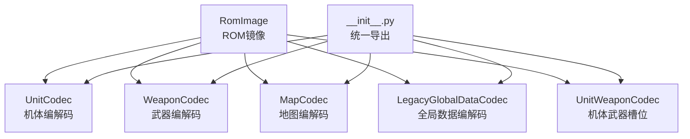
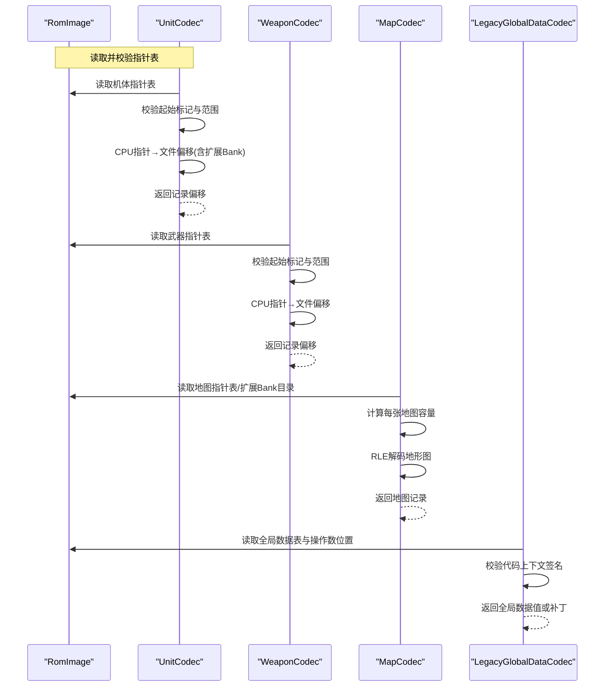
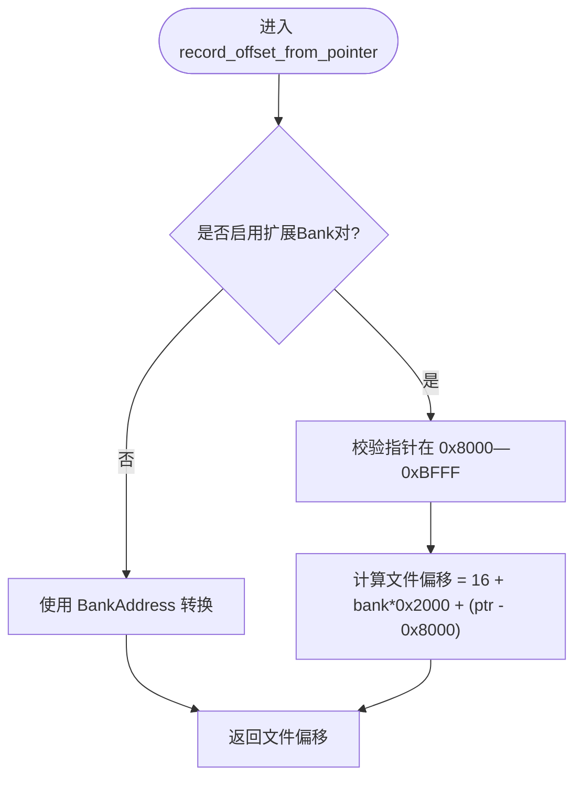
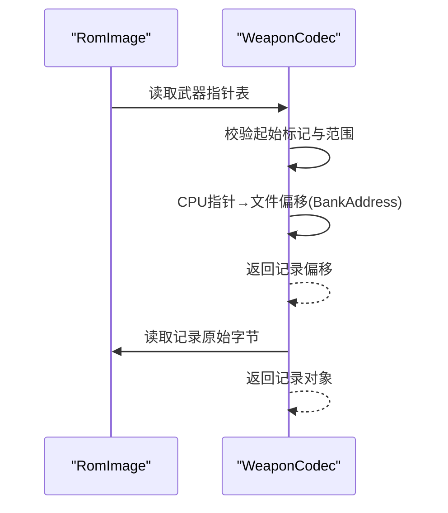
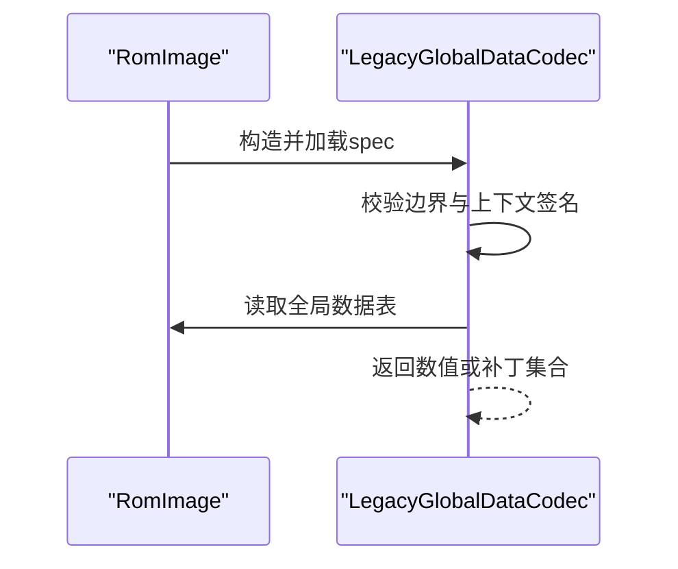
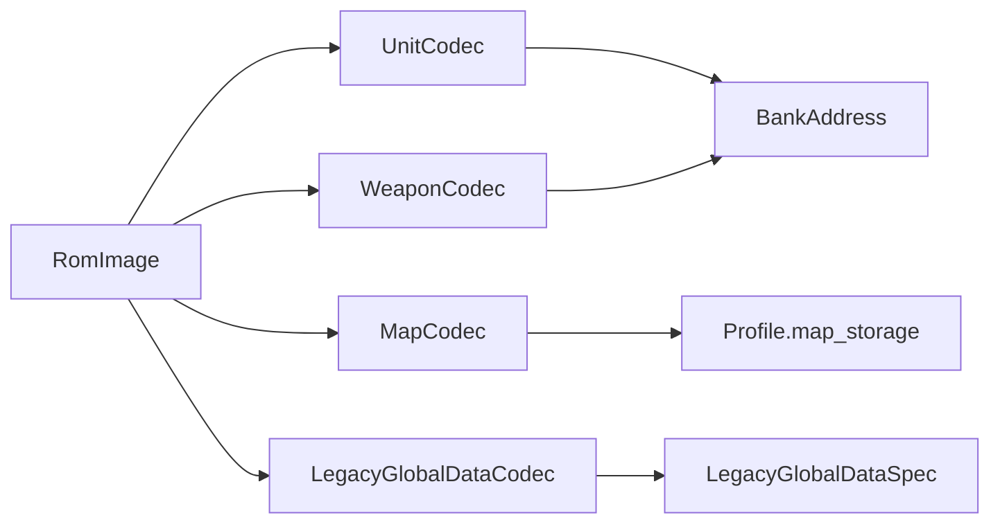

# 数据编解码处理

<cite>
**本文引用的文件**
- [src/fc_editor/codecs/unit.py](file://src/fc_editor/codecs/unit.py)
- [src/fc_editor/codecs/weapon.py](file://src/fc_editor/codecs/weapon.py)
- [src/fc_editor/codecs/map.py](file://src/fc_editor/codecs/map.py)
- [src/fc_editor/codecs/unit_weapon.py](file://src/fc_editor/codecs/unit_weapon.py)
- [src/fc_editor/codecs/legacy_global_data.py](file://src/fc_editor/codecs/legacy_global_data.py)
- [src/fc_editor/codecs/__init__.py](file://src/fc_editor/codecs/__init__.py)
</cite>

## 目录
1. [简介](#简介)
2. [项目结构](#项目结构)
3. [核心组件](#核心组件)
4. [架构总览](#架构总览)
5. [详细组件分析](#详细组件分析)
6. [依赖关系分析](#依赖关系分析)
7. [性能考量](#性能考量)
8. [故障排查指南](#故障排查指南)
9. [结论](#结论)
10. [附录：扩展接口与新增数据类型指南](#附录：扩展接口与新增数据类型指南)

## 简介
本文件面向DC修改器的数据编解码子系统，系统性说明机体数据、武器数据、地图数据等关键类型的读写机制，重点解释指针表处理、数据偏移计算、Bank空间定位算法，以及原生数据与扩展数据的差异。同时给出编解码器扩展接口规范，帮助为新的数据类型添加支持。

## 项目结构
- 编解码器集中在 src/fc_editor/codecs 目录下，按数据类型划分模块（如 unit.py、weapon.py、map.py）。
- 公共导出通过 __init__.py 统一暴露各类 Codec。
- 各 Codec 依赖 RomImage、Profile、常量与模型定义进行ROM布局解析与校验。

**图表来源**
- [src/fc_editor/codecs/unit.py:14-120](file://src/fc_editor/codecs/unit.py#L14-L120)
- [src/fc_editor/codecs/weapon.py:13-90](file://src/fc_editor/codecs/weapon.py#L13-L90)
- [src/fc_editor/codecs/map.py:16-228](file://src/fc_editor/codecs/map.py#L16-L228)
- [src/fc_editor/codecs/legacy_global_data.py:17-701](file://src/fc_editor/codecs/legacy_global_data.py#L17-L701)
- [src/fc_editor/codecs/unit_weapon.py:11-79](file://src/fc_editor/codecs/unit_weapon.py#L11-L79)
- [src/fc_editor/codecs/__init__.py:1-47](file://src/fc_editor/codecs/__init__.py#L1-L47)

**章节来源**
- [src/fc_editor/codecs/__init__.py:1-47](file://src/fc_editor/codecs/__init__.py#L1-L47)

## 核心组件
- UnitCodec：读取并校验机体指针表，将CPU指针映射到文件偏移，解码/编码机体记录，支持字段级补丁。
- WeaponCodec：读取并校验武器指针表，映射CPU指针到文件偏移，解码/编码武器记录，支持字段级补丁。
- MapCodec：读取并校验地图指针表与可选的扩展Bank目录，计算每张地图容量，解码RLE地形图，提供替换补丁。
- LegacyGlobalDataCodec：对已验证的全局数据表（距离命中修正、累计经验、道具名称池、初始阵容等）进行读取与补丁，并通过代码上下文签名保证安全。
- UnitWeaponCodec：读取/写入每个机体的两个直接武器ID槽位，并进行范围校验。

**章节来源**
- [src/fc_editor/codecs/unit.py:14-120](file://src/fc_editor/codecs/unit.py#L14-L120)
- [src/fc_editor/codecs/weapon.py:13-90](file://src/fc_editor/codecs/weapon.py#L13-L90)
- [src/fc_editor/codecs/map.py:16-228](file://src/fc_editor/codecs/map.py#L16-L228)
- [src/fc_editor/codecs/legacy_global_data.py:17-701](file://src/fc_editor/codecs/legacy_global_data.py#L17-L701)
- [src/fc_editor/codecs/unit_weapon.py:11-79](file://src/fc_editor/codecs/unit_weapon.py#L11-L79)

## 架构总览
下图展示从ROM镜像到具体数据记录的编解码流程，包括指针表读取、Bank定位、容量计算与RLE解码。

**图表来源**
- [src/fc_editor/codecs/unit.py:42-84](file://src/fc_editor/codecs/unit.py#L42-L84)
- [src/fc_editor/codecs/weapon.py:20-53](file://src/fc_editor/codecs/weapon.py#L20-L53)
- [src/fc_editor/codecs/map.py:49-134](file://src/fc_editor/codecs/map.py#L49-L134)
- [src/fc_editor/codecs/legacy_global_data.py:101-118](file://src/fc_editor/codecs/legacy_global_data.py#L101-L118)

## 详细组件分析

### 机体数据编解码（UnitCodec）
- 指针表处理：
  - 读取 profile.unit_count × 2 字节的指针表，校验起始项为0。
  - 对每个非零指针调用 record_offset_from_pointer 转换为文件偏移，并检查不越界且不在指针表区域内。
- Bank空间定位算法：
  - 若提供 pair_first_bank，则指针限定在 0x8000—0xBFFF 范围内，使用公式：文件偏移 = 16 + pair_first_bank × 0x2000 + (pointer - 0x8000)。
  - 否则使用 BankAddress 基于 profile.unit_data_prg_bank 与 window_base 转换。
- 记录读写：
  - decode_record 根据指针获取固定长度的原始记录，封装为记录对象。
  - encode_record 直接返回原始字节。
  - field_patch 通过字段元信息定位偏移，生成 before/after 补丁。
- 扩展容量差异：
  - 通过 pair_first_bank 参数支持“扩展Bank对”模式，与普通PRG Bank映射不同。

**图表来源**
- [src/fc_editor/codecs/unit.py:68-77](file://src/fc_editor/codecs/unit.py#L68-L77)

**章节来源**
- [src/fc_editor/codecs/unit.py:42-120](file://src/fc_editor/codecs/unit.py#L42-L120)

### 武器数据编解码（WeaponCodec）
- 指针表处理：
  - 读取 weapon_pointer_count × 2 字节的指针表，校验起始项为0。
  - 对每个指针进行范围校验，确保记录不越界且不在指针表区域。
- Bank空间定位：
  - 使用 BankAddress 基于 weapon_data_prg_bank 与 window_base 转换CPU指针到文件偏移。
- 记录读写：
  - decode_record 读取固定长度记录，封装为记录对象。
  - encode_record 直接返回原始字节。
  - field_patch 通过字段元信息定位偏移，生成 before/after 补丁。

**图表来源**
- [src/fc_editor/codecs/weapon.py:20-66](file://src/fc_editor/codecs/weapon.py#L20-L66)

**章节来源**
- [src/fc_editor/codecs/weapon.py:20-90](file://src/fc_editor/codecs/weapon.py#L20-L90)

### 地图数据编解码（MapCodec）
- 指针表与Bank目录：
  - 原生模式：读取 map_count × 2 字节的指针表，校验起始标记与存储区范围，要求同存储区内指针严格递增。
  - 扩展模式：可传入 bank_table_offset 读取每张地图的Bank号，指针限定在 0xA000—0xBFFF。
- 容量计算：
  - 原生模式：容量由下一张地图指针或存储区结束决定。
  - 扩展模式：按Bank分组排序后，容量为当前指针到下一个指针（或 0xC000）之差。
- 指针到文件偏移：
  - 扩展模式：文件偏移 = 16 + bank × 0x2000 + (pointer - 0xA000)。
  - 原生模式：使用 profile.map_storage 的 prg_bank 与 window_base。
- RLE解码：
  - 首两字节为宽高，后续为游程编码，游程长度为 token >> 4 + 1，逻辑地形编号为 token & 0x0F。
  - 解码过程严格校验游程不越界、数据块完整。
- 替换补丁：
  - replacement_patch 将新地图编码后与原数据块对齐，生成 before/after 补丁；若编码超出容量则报错。

**图表来源**
- [src/fc_editor/codecs/map.py:136-173](file://src/fc_editor/codecs/map.py#L136-L173)

**章节来源**
- [src/fc_editor/codecs/map.py:49-228](file://src/fc_editor/codecs/map.py#L49-L228)

### 全局数据编解码（LegacyGlobalDataCodec）
- 边界与上下文校验：
  - 初始化时校验各表范围，并对双击公式、伤害公式、命中阈值、道具效果等操作数位置进行代码上下文签名匹配，确保只允许受控修改。
- 数据读取：
  - 距离命中修正表、累计经验表、道具名称池、初始阵容、道具价格表等均有独立读取方法。
- 补丁生成：
  - 针对操作数与表格生成单字节或多字节补丁，保持前后快照用于回滚或对比。
- 安全性：
  - 通过固定前缀/后缀匹配，避免误改指令或跳转目标，失败即关闭（fail-closed）。

**图表来源**
- [src/fc_editor/codecs/legacy_global_data.py:101-118](file://src/fc_editor/codecs/legacy_global_data.py#L101-L118)
- [src/fc_editor/codecs/legacy_global_data.py:183-269](file://src/fc_editor/codecs/legacy_global_data.py#L183-L269)

**章节来源**
- [src/fc_editor/codecs/legacy_global_data.py:101-701](file://src/fc_editor/codecs/legacy_global_data.py#L101-L701)

### 机体武器槽位编解码（UnitWeaponCodec）
- 表结构与校验：
  - 每个机体占用固定数量的槽位（默认2），读取时校验武器ID在有效范围内。
- 读写与补丁：
  - decode 返回配置对象，encode 直接序列化。
  - slot_patch 对指定槽位写入新武器ID，生成 before/after 补丁。

**章节来源**
- [src/fc_editor/codecs/unit_weapon.py:11-79](file://src/fc_editor/codecs/unit_weapon.py#L11-L79)

## 依赖关系分析
- 所有 Codec 均依赖 RomImage 提供的ROM数据访问能力与 Profile 中的布局常量。
- UnitCodec 与 WeaponCodec 使用 BankAddress 完成CPU指针到文件偏移的转换。
- MapCodec 在扩展模式下依赖外部传入的Bank目录或内置规则计算容量。
- LegacyGlobalDataCodec 依赖 spec 配置与代码上下文签名，确保补丁安全。

**图表来源**
- [src/fc_editor/codecs/unit.py:68-77](file://src/fc_editor/codecs/unit.py#L68-L77)
- [src/fc_editor/codecs/weapon.py:41-46](file://src/fc_editor/codecs/weapon.py#L41-L46)
- [src/fc_editor/codecs/map.py:119-127](file://src/fc_editor/codecs/map.py#L119-L127)
- [src/fc_editor/codecs/legacy_global_data.py:101-118](file://src/fc_editor/codecs/legacy_global_data.py#L101-L118)

**章节来源**
- [src/fc_editor/codecs/unit.py:68-77](file://src/fc_editor/codecs/unit.py#L68-L77)
- [src/fc_editor/codecs/weapon.py:41-46](file://src/fc_editor/codecs/weapon.py#L41-L46)
- [src/fc_editor/codecs/map.py:119-127](file://src/fc_editor/codecs/map.py#L119-L127)
- [src/fc_editor/codecs/legacy_global_data.py:101-118](file://src/fc_editor/codecs/legacy_global_data.py#L101-L118)

## 性能考量
- 指针表与记录读取采用批量读取与结构化解析，减少多次I/O。
- 地图RLE解码为线性扫描，复杂度 O(N)，N为图块数量。
- 扩展模式下的容量计算通过分组排序提升准确性，但需注意多Bank场景下的排序开销。
- 全局数据上下文签名校验在初始化阶段完成，避免运行时重复验证。

[本节为通用性能讨论，不直接分析具体文件]

## 故障排查指南
- 指针表不完整或起始标记不正确：
  - 检查指针表长度与首项是否为0（或profile指定的起始标记）。
  - 参考：[src/fc_editor/codecs/unit.py:42-66](file://src/fc_editor/codecs/unit.py#L42-L66)、[src/fc_editor/codecs/weapon.py:20-39](file://src/fc_editor/codecs/weapon.py#L20-L39)、[src/fc_editor/codecs/map.py:49-71](file://src/fc_editor/codecs/map.py#L49-L71)
- 记录越界或超出支持区域：
  - 确认记录偏移与大小不超过ROM边界，且不在指针表区域内。
  - 参考：[src/fc_editor/codecs/unit.py:57-66](file://src/fc_editor/codecs/unit.py#L57-L66)、[src/fc_editor/codecs/weapon.py:30-39](file://src/fc_editor/codecs/weapon.py#L30-L39)
- 地图RLE数据异常：
  - 检查宽高合法性、游程是否越界、数据块是否完整。
  - 参考：[src/fc_editor/codecs/map.py:136-173](file://src/fc_editor/codecs/map.py#L136-L173)
- 全局数据上下文签名不匹配：
  - 确认操作数位置与固定前缀/后缀一致，避免被其他工具修改。
  - 参考：[src/fc_editor/codecs/legacy_global_data.py:183-269](file://src/fc_editor/codecs/legacy_global_data.py#L183-L269)

**章节来源**
- [src/fc_editor/codecs/unit.py:42-66](file://src/fc_editor/codecs/unit.py#L42-L66)
- [src/fc_editor/codecs/weapon.py:20-39](file://src/fc_editor/codecs/weapon.py#L20-L39)
- [src/fc_editor/codecs/map.py:49-71](file://src/fc_editor/codecs/map.py#L49-L71)
- [src/fc_editor/codecs/map.py:136-173](file://src/fc_editor/codecs/map.py#L136-L173)
- [src/fc_editor/codecs/legacy_global_data.py:183-269](file://src/fc_editor/codecs/legacy_global_data.py#L183-L269)

## 结论
DC修改器的编解码子系统以指针表为核心，结合Bank空间定位与容量计算，实现对机体、武器、地图等数据的无损读取与安全修改。扩展模式通过独立的Bank目录与指针范围约束，兼容更大容量的数据布局。全局数据编解码通过代码上下文签名保障修改的安全性。整体设计清晰、可扩展，便于新增数据类型支持。

[本节为总结性内容，不直接分析具体文件]

## 附录：扩展接口与新增数据类型指南
- 新增数据类型的基本步骤：
  - 定义数据结构与字段元信息（类似 UNIT_FIELD_BY_KEY、WEAPON_FIELD_BY_KEY）。
  - 实现 Codec 类，包含：
    - 指针表读取与校验（如 _read_pointers）。
    - CPU指针到文件偏移的转换（record_offset_from_pointer）。
    - 记录解码与编码（decode_record/encode_record）。
    - 字段级补丁（field_patch 或专用补丁方法）。
    - 往返一致性校验（round_trip_*）。
  - 在 __init__.py 中导出新 Codec。
- 扩展容量差异的处理：
  - 对于需要扩展Bank的数据类型，提供类似 pair_first_bank 的参数，并在 record_offset_from_pointer 中区分原生与扩展路径。
  - 对于地图类数据，支持传入 bank_table_offset 与 record_locations，以便外部管理Bank与容量。
- 数据格式规范建议：
  - 明确记录大小、字段宽度与顺序。
  - 定义指针表的起始标记与范围约束。
  - 对可变长度数据（如RLE）提供严格的解码校验。
- 示例参考：
  - 机体：[src/fc_editor/codecs/unit.py:14-120](file://src/fc_editor/codecs/unit.py#L14-L120)
  - 武器：[src/fc_editor/codecs/weapon.py:13-90](file://src/fc_editor/codecs/weapon.py#L13-L90)
  - 地图：[src/fc_editor/codecs/map.py:16-228](file://src/fc_editor/codecs/map.py#L16-L228)
  - 全局数据：[src/fc_editor/codecs/legacy_global_data.py:17-701](file://src/fc_editor/codecs/legacy_global_data.py#L17-L701)
  - 统一导出：[src/fc_editor/codecs/__init__.py:1-47](file://src/fc_editor/codecs/__init__.py#L1-L47)

**章节来源**
- [src/fc_editor/codecs/unit.py:14-120](file://src/fc_editor/codecs/unit.py#L14-L120)
- [src/fc_editor/codecs/weapon.py:13-90](file://src/fc_editor/codecs/weapon.py#L13-L90)
- [src/fc_editor/codecs/map.py:16-228](file://src/fc_editor/codecs/map.py#L16-L228)
- [src/fc_editor/codecs/legacy_global_data.py:17-701](file://src/fc_editor/codecs/legacy_global_data.py#L17-L701)
- [src/fc_editor/codecs/__init__.py:1-47](file://src/fc_editor/codecs/__init__.py#L1-L47)