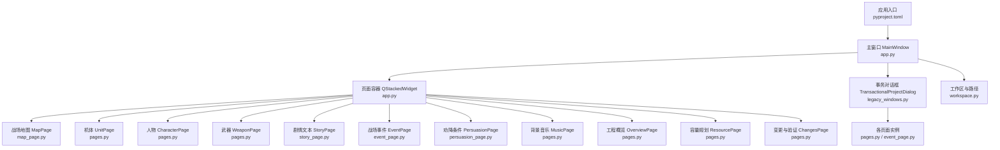
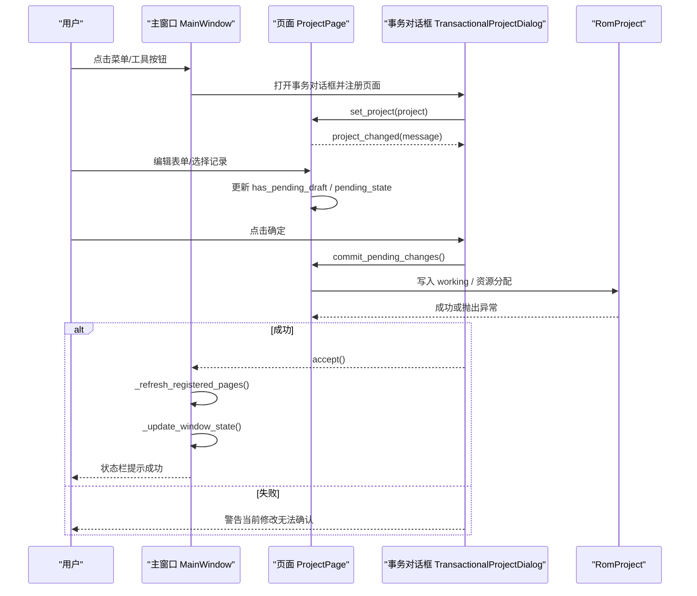
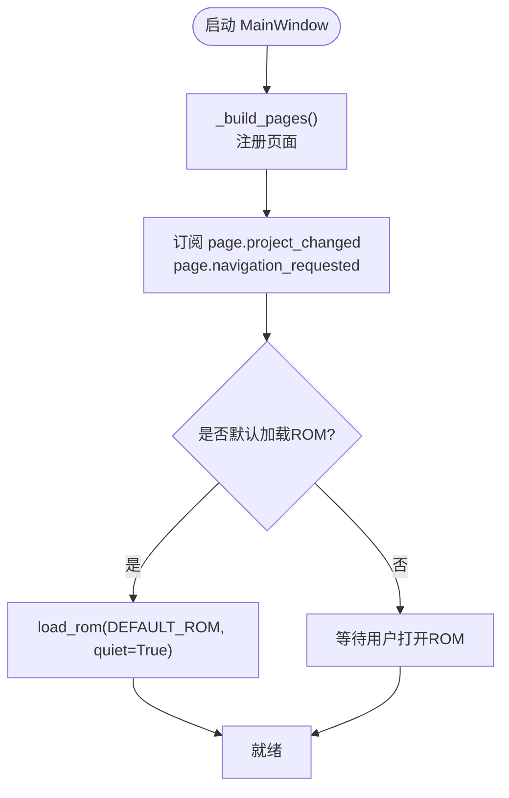
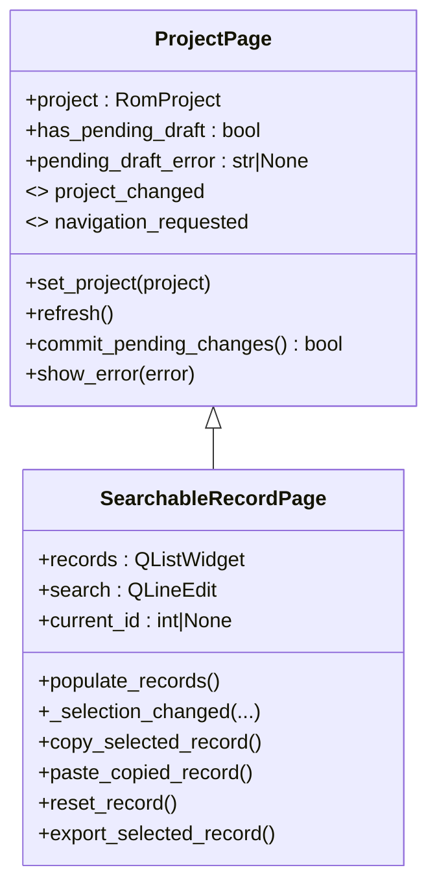
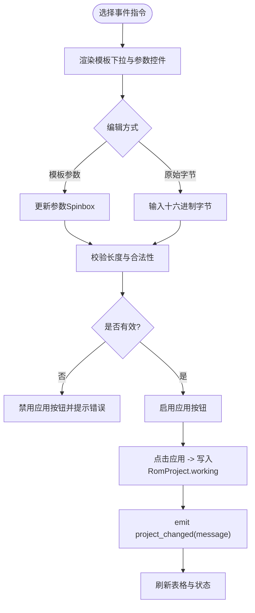
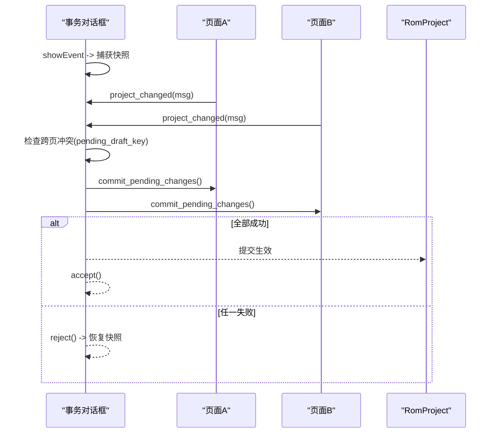
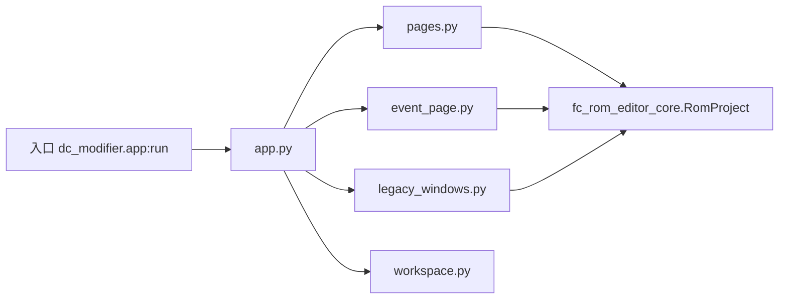

# 事件驱动架构

<cite>
**本文引用的文件**
- [app.py](file://src/dc_modifier/app.py)
- [pages.py](file://src/dc_modifier/pages.py)
- [event_page.py](file://src/dc_modifier/event_page.py)
- [legacy_windows.py](file://src/dc_modifier/legacy_windows.py)
- [workspace.py](file://src/dc_modifier/workspace.py)
- [pyproject.toml](file://pyproject.toml)
</cite>

## 目录
1. [简介](#简介)
2. [项目结构](#项目结构)
3. [核心组件](#核心组件)
4. [架构总览](#架构总览)
5. [详细组件分析](#详细组件分析)
6. [依赖关系分析](#依赖关系分析)
7. [性能考虑](#性能考虑)
8. [故障排查指南](#故障排查指南)
9. [结论](#结论)
10. [附录](#附录)

## 简介
本文件面向DC修改器的事件驱动架构，聚焦从用户交互到界面更新的完整处理链路。文档解释信号槽连接、事件传播路径与异步操作处理；说明页面间通信模式（数据绑定、状态同步、依赖注入）；阐述工作区管理模式（页面生命周期、资源清理、内存优化）。并通过序列图与流程图展示典型交互流程，包含错误处理与用户体验优化策略。

## 项目结构
DC修改器基于PySide6构建，采用“主窗口 + 多页编辑器 + 事务对话框”的架构：
- 应用入口与主窗口：负责菜单、动作、页面注册、状态栏与全局会话管理。
- 页面基类与具体页面：封装UI、表单、数据绑定与提交逻辑。
- 事务对话框：为每个编辑会话提供“整体确认/取消”语义，支持跨页冲突检测与会话快照回滚。
- 工作区与路径：统一ROM与工作目录解析、默认输出路径与只读保护。

图表来源
- [app.py:276-365](file://src/dc_modifier/app.py#L276-L365)
- [pages.py:103-149](file://src/dc_modifier/pages.py#L103-L149)
- [event_page.py:66-228](file://src/dc_modifier/event_page.py#L66-L228)
- [legacy_windows.py:71-114](file://src/dc_modifier/legacy_windows.py#L71-L114)
- [workspace.py:7-43](file://src/dc_modifier/workspace.py#L7-L43)
- [pyproject.toml:22-27](file://pyproject.toml#L22-L27)

章节来源
- [pyproject.toml:22-27](file://pyproject.toml#L22-L27)
- [app.py:276-365](file://src/dc_modifier/app.py#L276-L365)
- [workspace.py:7-43](file://src/dc_modifier/workspace.py#L7-L43)

## 核心组件
- 主窗口 MainWindow：集中注册页面、创建菜单与动作、维护状态栏与未保存变更检测；通过QStackedWidget切换页面；对扩展功能以独立对话框形式打开。
- 页面基类 ProjectPage：定义统一的页面契约（set_project、refresh、has_pending_draft、commit_pending_changes、show_error），并暴露project_changed与navigation_requested信号用于跨页通信。
- 可搜索记录页面 SearchableRecordPage：提供通用列表过滤、复制/粘贴/还原/导出等能力，供UnitPage等复用。
- 战场事件页面 EventPage：按章节/阶段/类型筛选事件指令，提供模板参数编辑与等长原始字节编辑，保证不改变脚本长度。
- 事务对话框 TransactionalProjectDialog：在显示时捕获RomProject.working、资源分配与撤销栈快照；接受时提交所有页面的草稿；取消时恢复快照并刷新页面。
- 工作区 workspace：解析可执行/源码根目录、默认ROM路径、默认导出路径与只读保护。

章节来源
- [app.py:276-365](file://src/dc_modifier/app.py#L276-L365)
- [pages.py:103-149](file://src/dc_modifier/pages.py#L103-L149)
- [pages.py:243-509](file://src/dc_modifier/pages.py#L243-L509)
- [event_page.py:66-228](file://src/dc_modifier/event_page.py#L66-L228)
- [legacy_windows.py:71-259](file://src/dc_modifier/legacy_windows.py#L71-L259)
- [workspace.py:7-43](file://src/dc_modifier/workspace.py#L7-L43)

## 架构总览
下图展示了从用户交互到业务逻辑再到界面更新的完整事件流，包括信号槽连接、事务边界与错误处理。

图表来源
- [app.py:494-505](file://src/dc_modifier/app.py#L494-L505)
- [legacy_windows.py:177-259](file://src/dc_modifier/legacy_windows.py#L177-L259)
- [pages.py:103-149](file://src/dc_modifier/pages.py#L103-L149)

## 详细组件分析

### 主窗口与页面注册
- 页面注册：MainWindow在初始化时通过_add_page将各页面加入导航与QStackedWidget，并订阅page.project_changed与page.navigation_requested。
- 页面切换：show_page根据key索引切换，并在必要时刷新“陈旧”页面。
- 扩展功能：通过_create_extension_dialog动态构造TransactionalProjectDialog，并将页面注册进对话框，实现“会话级”编辑。

图表来源
- [app.py:342-365](file://src/dc_modifier/app.py#L342-L365)
- [app.py:366-385](file://src/dc_modifier/app.py#L366-L385)
- [app.py:583-653](file://src/dc_modifier/app.py#L583-L653)

章节来源
- [app.py:342-385](file://src/dc_modifier/app.py#L342-L385)
- [app.py:583-653](file://src/dc_modifier/app.py#L583-L653)

### 页面基类与数据绑定
- 数据绑定：页面通过set_project注入RomProject，并在refresh中重建UI；表单控件值变化触发_update_pending_state，计算是否有待提交的草稿。
- 草稿机制：has_pending_draft由apply_button可用性决定；commit_pending_changes会调用底层按钮完成提交，并在working变化后刷新。
- 错误处理：show_error统一弹出错误消息框。

图表来源
- [pages.py:103-149](file://src/dc_modifier/pages.py#L103-L149)
- [pages.py:243-509](file://src/dc_modifier/pages.py#L243-L509)

章节来源
- [pages.py:103-149](file://src/dc_modifier/pages.py#L103-L149)
- [pages.py:243-509](file://src/dc_modifier/pages.py#L243-L509)

### 战场事件编辑流程
EventPage提供“模板参数”和“等长原始字节”两种编辑方式，确保指令长度不变，避免破坏脚本指针。

图表来源
- [event_page.py:238-249](file://src/dc_modifier/event_page.py#L238-L249)
- [event_page.py:566-636](file://src/dc_modifier/event_page.py#L566-L636)
- [event_page.py:655-701](file://src/dc_modifier/event_page.py#L655-L701)

章节来源
- [event_page.py:66-228](file://src/dc_modifier/event_page.py#L66-L228)
- [event_page.py:238-249](file://src/dc_modifier/event_page.py#L238-L249)
- [event_page.py:566-636](file://src/dc_modifier/event_page.py#L566-L636)
- [event_page.py:655-701](file://src/dc_modifier/event_page.py#L655-L701)

### 事务对话框与会话一致性
- 会话快照：showEvent时捕获RomProject.working、资源分配与撤销/重做栈。
- 提交：accept前遍历所有页面，检查pending_draft_error并调用commit_pending_changes。
- 取消：reject时恢复快照，重置资源分配与历史栈，并刷新所有页面。
- 冲突检测：对共享资源的草稿进行冲突检查（如同一事件指令不可同时被多个页面草稿修改）。

图表来源
- [legacy_windows.py:71-114](file://src/dc_modifier/legacy_windows.py#L71-L114)
- [legacy_windows.py:177-259](file://src/dc_modifier/legacy_windows.py#L177-L259)
- [legacy_windows.py:262-318](file://src/dc_modifier/legacy_windows.py#L262-L318)

章节来源
- [legacy_windows.py:71-114](file://src/dc_modifier/legacy_windows.py#L71-L114)
- [legacy_windows.py:177-259](file://src/dc_modifier/legacy_windows.py#L177-L259)
- [legacy_windows.py:262-318](file://src/dc_modifier/legacy_windows.py#L262-L318)

### 页面间通信与依赖注入
- 信号槽：页面通过project_changed向父窗口/对话框广播变更消息；navigation_requested请求跳转到指定页面键。
- 依赖注入：MainWindow通过set_project将RomProject注入各页面；事务对话框也通过register_page注入项目并转发信号。
- 状态同步：当某页面提交成功后，其他同组页面（transaction_sync_group）若无草稿则自动refresh，保持视图一致。

章节来源
- [app.py:342-365](file://src/dc_modifier/app.py#L342-L365)
- [legacy_windows.py:102-129](file://src/dc_modifier/legacy_windows.py#L102-L129)
- [event_page.py:665-701](file://src/dc_modifier/event_page.py#L665-L701)

### 工作区管理与生命周期
- 生命周期：页面在注册时被添加到QStackedWidget；切换时可能刷新“陈旧”页面；关闭对话框时deleteLater释放。
- 资源清理：事务对话框reject时恢复RomProject.working与资源分配，清空撤销/重做栈，防止后续误用。
- 内存优化：批量刷新时使用blockSignals与setUpdatesEnabled(false)减少重绘；列表项重用与延迟选择降低开销。

章节来源
- [app.py:494-505](file://src/dc_modifier/app.py#L494-L505)
- [legacy_windows.py:232-259](file://src/dc_modifier/legacy_windows.py#L232-L259)
- [pages.py:396-434](file://src/dc_modifier/pages.py#L396-L434)

## 依赖关系分析
- 应用入口：pyproject.scripts将dc-modifier命令指向dc_modifier.app:run。
- 主窗口依赖：pages中的各类页面、workspace的路径常量、fc_rom_editor_core.RomProject。
- 事务对话框依赖：各页面、RomProject、资源分配器等。
- 事件页面依赖：chapter_event编解码、dc_text标签、pages基类。

图表来源
- [pyproject.toml:22-27](file://pyproject.toml#L22-L27)
- [app.py:33-58](file://src/dc_modifier/app.py#L33-L58)
- [pages.py:38-46](file://src/dc_modifier/pages.py#L38-L46)
- [event_page.py:25-28](file://src/dc_modifier/event_page.py#L25-L28)
- [legacy_windows.py:38-60](file://src/dc_modifier/legacy_windows.py#L38-L60)

章节来源
- [pyproject.toml:22-27](file://pyproject.toml#L22-L27)
- [app.py:33-58](file://src/dc_modifier/app.py#L33-L58)

## 性能考虑
- UI刷新节流：在批量填充列表时阻塞信号与更新，避免频繁重绘。
- 草稿最小化：仅在字段变化时标记草稿，减少不必要的提交。
- 只读保护：输出路径拒绝references目录，避免误写参考数据。
- 异步友好：当前主要使用同步Qt事件循环；对于耗时任务建议拆分为后台线程并在完成后通过信号回调更新UI。

[本节为通用指导，无需特定文件引用]

## 故障排查指南
- 无法应用草稿：检查pending_draft_error，常见原因包括原始字节长度不符、非法十六进制、跨页冲突。
- 取消后仍保留修改：确认事务对话框是否正确恢复快照；检查是否在外部直接修改了RomProject.working。
- 页面不同步：确认页面是否属于同一transaction_sync_group；提交后应触发refresh。
- 导出失败：检查writable_output_path是否被拒绝（references只读）；捕获异常并提示用户。

章节来源
- [event_page.py:566-636](file://src/dc_modifier/event_page.py#L566-L636)
- [legacy_windows.py:232-259](file://src/dc_modifier/legacy_windows.py#L232-L259)
- [workspace.py:37-43](file://src/dc_modifier/workspace.py#L37-L43)

## 结论
DC修改器采用清晰的事件驱动架构：以主窗口为中心，页面作为独立编辑单元，通过信号槽与事务对话框实现松耦合与强一致性的编辑体验。事件页面严格保证指令等长，事务对话框提供会话级原子性与冲突检测，配合工作区路径保护与UI刷新优化，形成稳定、可扩展且易用的修改器框架。

## 附录
- 常用快捷键：打开ROM Ctrl+O，保存ROM Ctrl+S，工程另存为 Ctrl+Shift+S，构建 Ctrl+B，撤销 Ctrl+Alt+Z，重做 Ctrl+Alt+Y。
- 推荐工作流：打开ROM → 自动规划扩展容量 → 修改并随时验证 → 保存工程并构建ROM/IPS。

[本节为补充信息，无需特定文件引用]