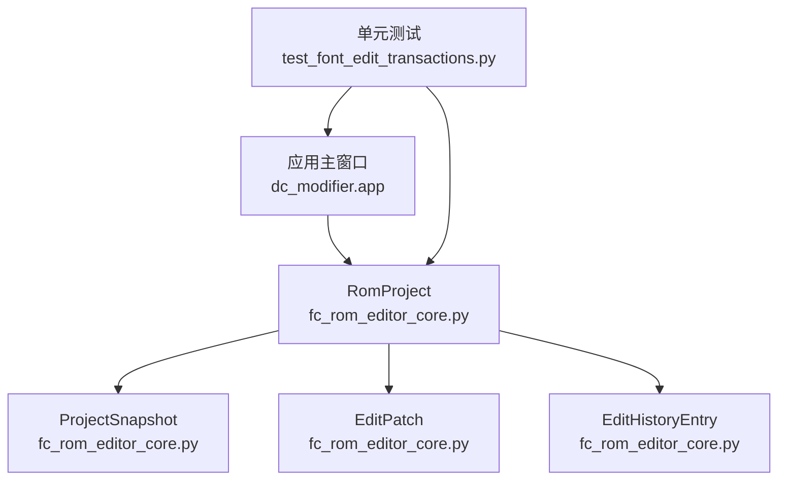
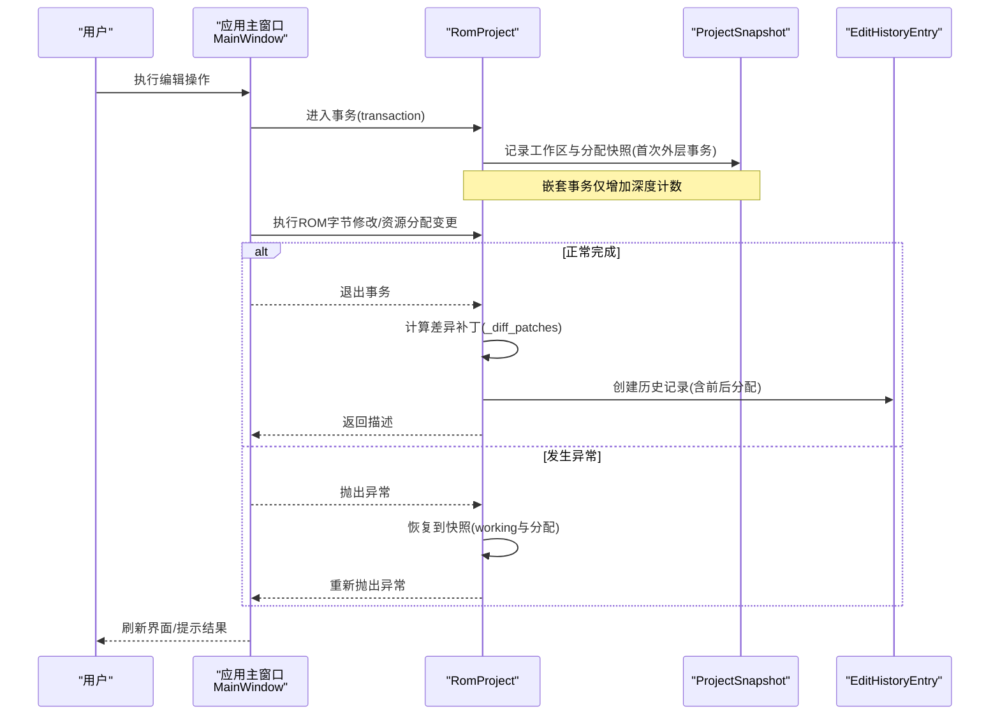
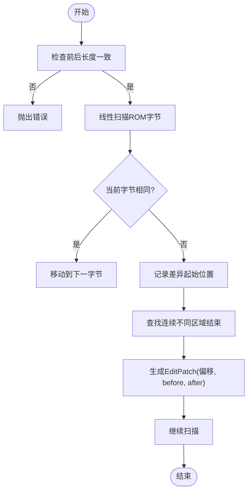
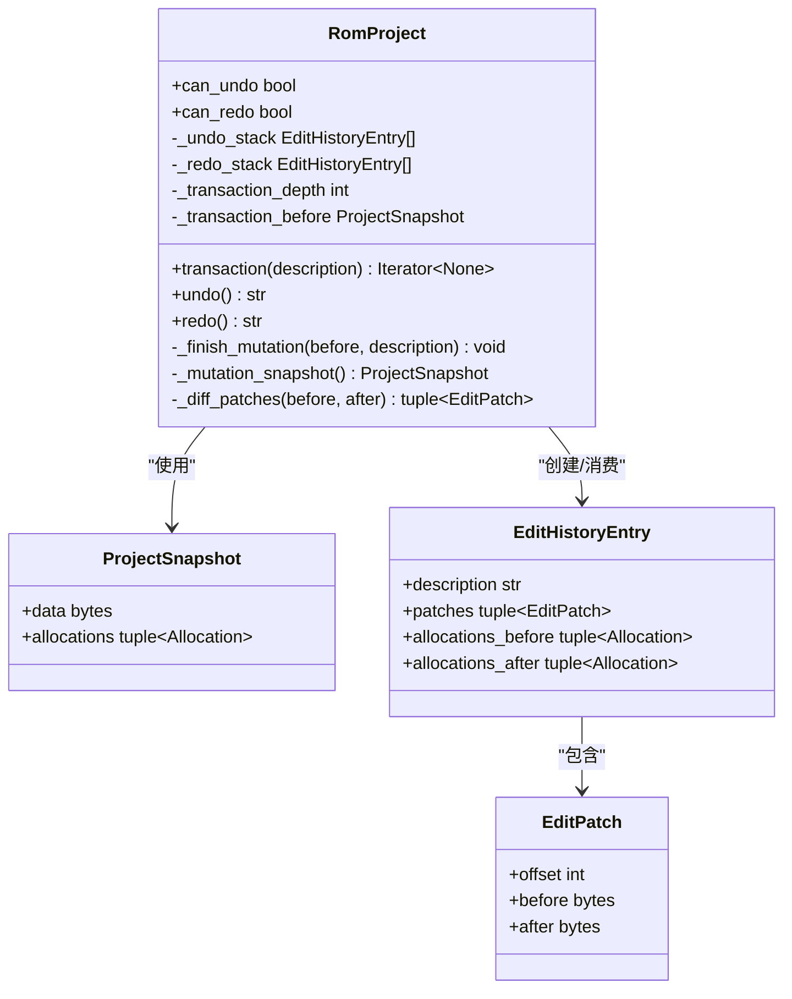
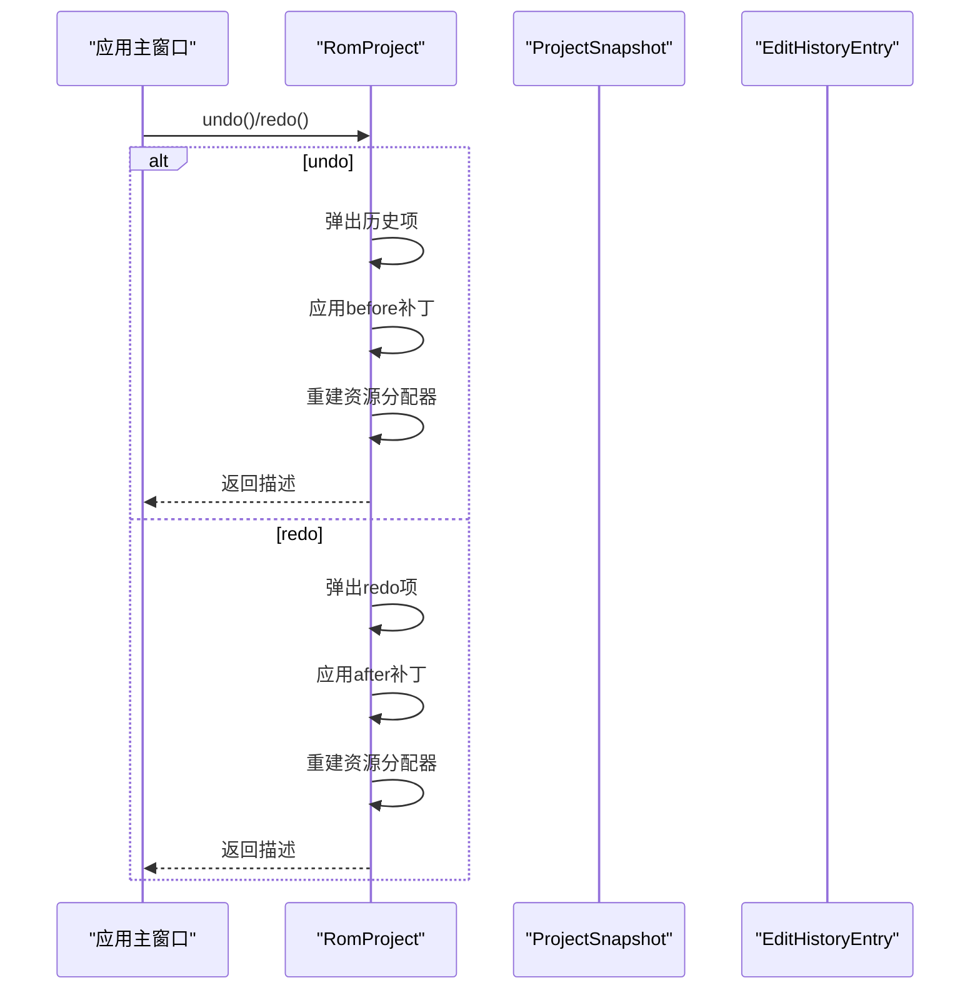
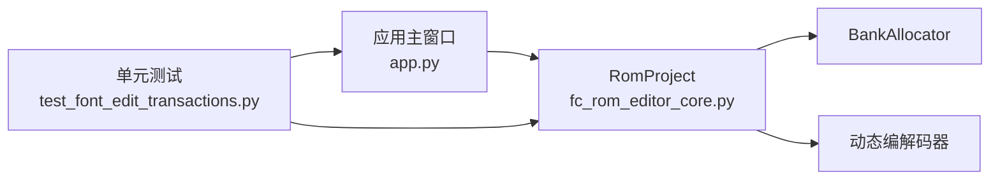

# 事务处理系统

<cite>
**本文引用的文件**
- [fc_rom_editor_core.py](file://src/fc_rom_editor_core.py)
- [app.py](file://src/dc_modifier/app.py)
- [test_font_edit_transactions.py](file://tests/test_font_edit_transactions.py)
</cite>

## 目录
1. [简介](#简介)
2. [项目结构](#项目结构)
3. [核心组件](#核心组件)
4. [架构总览](#架构总览)
5. [详细组件分析](#详细组件分析)
6. [依赖关系分析](#依赖关系分析)
7. [性能与内存管理](#性能与内存管理)
8. [故障排查指南](#故障排查指南)
9. [结论](#结论)

## 简介
本文件面向DC修改器的事务处理系统，聚焦撤销/重做机制、事务边界控制、变更追踪策略以及从用户操作到数据落盘的完整链路。文档围绕以下关键点展开：
- EditHistoryEntry数据结构：描述一次可撤销/重做的编辑单元，包含差异补丁与资源分配快照。
- EditPatch差异计算：基于字节级差异的紧凑表示，支持高效回滚与重放。
- ProjectSnapshot快照管理：在事务边界记录ROM工作区与资源分配的快照，用于异常回滚与一致性恢复。
- 事务边界控制：嵌套事务、异常回滚、并发安全保证（单线程UI模型下的原子性）。
- 变更追踪策略：字节级差异记录、资源分配变更跟踪、状态一致性维护。
- 流程图与优化：展示从界面操作到ROM写入的完整流程，并给出性能与内存优化建议。

## 项目结构
DC修改器的事务能力由核心工程类RomProject提供，UI层通过应用主窗口调用其撤销/重做接口；测试用例覆盖字体编辑等典型场景，验证事务语义与一致性。

**图表来源**
- [fc_rom_editor_core.py:112-140](file://src/fc_rom_editor_core.py#L112-L140)
- [fc_rom_editor_core.py:619-785](file://src/fc_rom_editor_core.py#L619-L785)
- [app.py:991-1026](file://src/dc_modifier/app.py#L991-L1026)
- [test_font_edit_transactions.py:179-197](file://tests/test_font_edit_transactions.py#L179-L197)

**章节来源**
- [fc_rom_editor_core.py:112-140](file://src/fc_rom_editor_core.py#L112-L140)
- [fc_rom_editor_core.py:619-785](file://src/fc_rom_editor_core.py#L619-L785)
- [app.py:991-1026](file://src/dc_modifier/app.py#L991-L1026)
- [test_font_edit_transactions.py:179-197](file://tests/test_font_edit_transactions.py#L179-L197)

## 核心组件
- EditPatch：记录ROM中某偏移处的“修改前”和“修改后”字节片段，用于最小化回滚/重放成本。
- EditHistoryEntry：封装一次编辑的描述、差异补丁序列以及资源分配的前后快照，构成撤销/重做的原子单位。
- ProjectSnapshot：保存ROM工作区的完整字节副本与资源分配列表，用于事务开始时的基线记录与异常回滚。
- RomProject.transaction：上下文管理器，负责事务边界、嵌套计数、异常时回滚到基线、最终生成历史条目。
- RomProject.undo/redo：基于EditHistoryEntry进行字节级回滚或重放，并重建资源分配器与动态编解码器。

**章节来源**
- [fc_rom_editor_core.py:112-140](file://src/fc_rom_editor_core.py#L112-L140)
- [fc_rom_editor_core.py:677-785](file://src/fc_rom_editor_core.py#L677-L785)

## 架构总览
下图展示了用户操作触发事务、执行修改、提交或回滚的端到端流程。

**图表来源**
- [fc_rom_editor_core.py:692-743](file://src/fc_rom_editor_core.py#L692-L743)
- [fc_rom_editor_core.py:714-743](file://src/fc_rom_editor_core.py#L714-L743)
- [app.py:991-1026](file://src/dc_modifier/app.py#L991-L1026)

## 详细组件分析

### 撤销/重做数据结构与差异计算
- EditPatch：以偏移与前后字节对表示最小变更单元，避免全量复制。
- EditHistoryEntry：聚合多个EditPatch与资源分配快照，确保复杂编辑的原子性。
- _diff_patches：线性扫描比较前后ROM字节，产出紧凑的补丁序列；若大小不一致则报错，保障一致性。

**图表来源**
- [fc_rom_editor_core.py:677-690](file://src/fc_rom_editor_core.py#L677-L690)

**章节来源**
- [fc_rom_editor_core.py:112-140](file://src/fc_rom_editor_core.py#L112-L140)
- [fc_rom_editor_core.py:677-690](file://src/fc_rom_editor_core.py#L677-L690)

### 事务边界控制与异常回滚
- transaction上下文管理器：
  - 外层事务：记录ProjectSnapshot（ROM工作区与资源分配），设置描述。
  - 嵌套事务：仅增加深度计数，不重复记录快照。
  - 异常路径：仅在outermost为真且存在快照时，恢复ROM工作区与资源分配器，并刷新动态编解码器。
  - finally块：递减深度；外层事务结束时，若无异常则生成EditHistoryEntry并入栈。
- undo/redo：
  - undo：弹出历史项，按补丁顺序写回before字节，重建资源分配器，将该项移入redo栈。
  - redo：弹出redo项，按补丁顺序写回after字节，重建资源分配器，将该项移入undo栈。

**图表来源**
- [fc_rom_editor_core.py:112-140](file://src/fc_rom_editor_core.py#L112-L140)
- [fc_rom_editor_core.py:619-785](file://src/fc_rom_editor_core.py#L619-L785)

**章节来源**
- [fc_rom_editor_core.py:692-785](file://src/fc_rom_editor_core.py#L692-L785)

### 变更追踪策略与状态一致性
- 字节级差异记录：通过_diff_patches生成最小补丁集合，降低回滚/重放开销。
- 资源分配变更跟踪：在历史记录中同时保存allocations_before/after，确保资源表与ROM内容一致。
- 状态一致性维护：
  - 事务内修改工作区与资源分配器，提交时统一生成历史项。
  - 异常时回滚到事务起点快照，保证ROM与分配表的一致性。
  - 动态编解码器在回滚/重放后重建，确保后续读写正确。

**章节来源**
- [fc_rom_editor_core.py:692-785](file://src/fc_rom_editor_core.py#L692-L785)

### 用户操作到数据修改的完整链路
- 界面层：应用主窗口提供撤销/重做按钮，调用RomProject对应方法。
- 事务层：业务逻辑在transaction上下文中执行，确保原子性与一致性。
- 持久化：构建阶段输出ROM/IPS/工程/报告，但撤销/重做仅影响内存中的工作区。

**图表来源**
- [app.py:991-1026](file://src/dc_modifier/app.py#L991-L1026)
- [fc_rom_editor_core.py:761-785](file://src/fc_rom_editor_core.py#L761-L785)

**章节来源**
- [app.py:991-1026](file://src/dc_modifier/app.py#L991-L1026)
- [fc_rom_editor_core.py:761-785](file://src/fc_rom_editor_core.py#L761-L785)

## 依赖关系分析
- RomProject依赖：
  - 资源分配器BankAllocator：用于管理ROM扩展资源的分配与回收。
  - 动态编解码器：在回滚/重放后重建，确保数据访问的正确性。
- UI依赖：
  - MainWindow调用RomProject的撤销/重做接口，并在成功后刷新页面与状态栏。
- 测试依赖：
  - 字体编辑事务测试验证导入/导出、撤销/重做、并发冲突检测等行为。

**图表来源**
- [app.py:991-1026](file://src/dc_modifier/app.py#L991-L1026)
- [fc_rom_editor_core.py:619-785](file://src/fc_rom_editor_core.py#L619-L785)
- [test_font_edit_transactions.py:179-197](file://tests/test_font_edit_transactions.py#L179-L197)

**章节来源**
- [app.py:991-1026](file://src/dc_modifier/app.py#L991-L1026)
- [fc_rom_editor_core.py:619-785](file://src/fc_rom_editor_core.py#L619-L785)
- [test_font_edit_transactions.py:179-197](file://tests/test_font_edit_transactions.py#L179-L197)

## 性能与内存管理
- 差异补丁压缩：通过字节级差异计算减少回滚/重放的数据量，提升性能。
- 快照按需创建：仅在非事务状态下创建ProjectSnapshot，避免不必要的内存占用。
- 资源分配器重建：在撤销/重做时重建分配器，确保后续操作的一致性；可通过缓存优化减少重建成本。
- 内存管理建议：
  - 限制历史栈长度，防止长期运行导致内存增长。
  - 对大ROM进行分块差异计算，降低峰值内存。
  - 重用临时缓冲区，减少频繁分配。

[本节为通用指导，不直接分析具体文件]

## 故障排查指南
- 无法撤销：
  - 检查是否存在有效历史项；确认未处于地图草稿阻止状态。
  - 参考：应用主窗口在撤销前尝试提交地图草稿，若无历史项则直接返回。
- 无法重做：
  - 检查是否存在redo项；若有地图草稿需先应用或还原。
  - 参考：应用主窗口在重做前检查地图草稿并提示。
- 事务异常：
  - 确认事务外层是否捕获异常并回滚；检查ProjectSnapshot是否正确记录。
  - 参考：transaction上下文管理器在异常时恢复ROM与分配器。
- 字体编辑事务：
  - 导入/导出应不影响工作区，除非用户确认提交；撤销应完全回滚。
  - 参考：测试用例验证导入/导出与撤销行为。

**章节来源**
- [app.py:991-1026](file://src/dc_modifier/app.py#L991-L1026)
- [fc_rom_editor_core.py:714-743](file://src/fc_rom_editor_core.py#L714-L743)
- [test_font_edit_transactions.py:179-197](file://tests/test_font_edit_transactions.py#L179-L197)

## 结论
DC修改器的事务处理系统通过EditPatch、EditHistoryEntry与ProjectSnapshot实现了高效的撤销/重做机制。事务边界控制支持嵌套事务与异常回滚，确保ROM与工作区的一致性。变更追踪采用字节级差异与资源分配快照，兼顾性能与可靠性。结合界面层的调用与测试覆盖，系统在用户体验与数据完整性方面达到良好平衡。未来可进一步优化历史栈管理与快照复用，以提升大规模编辑场景下的性能表现。