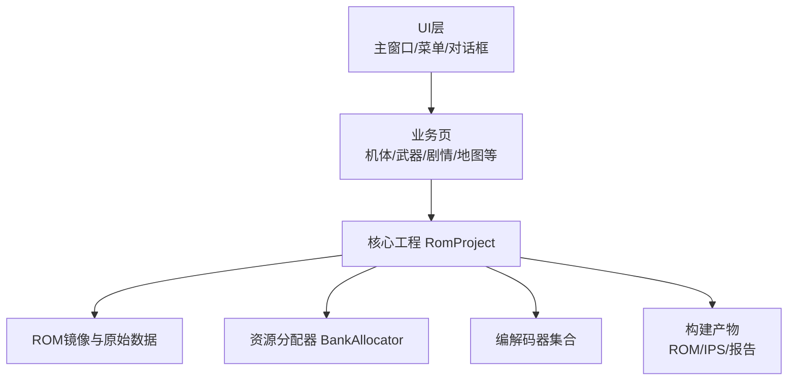
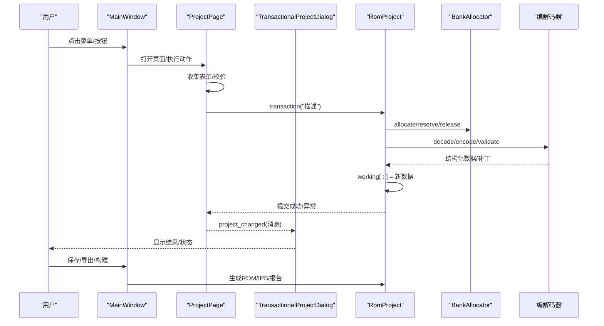
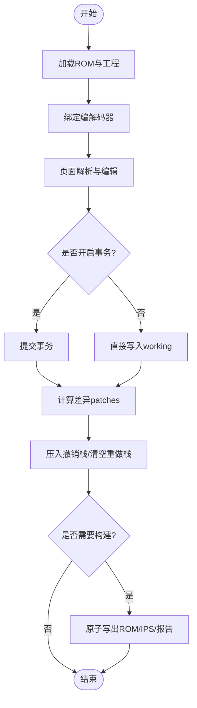
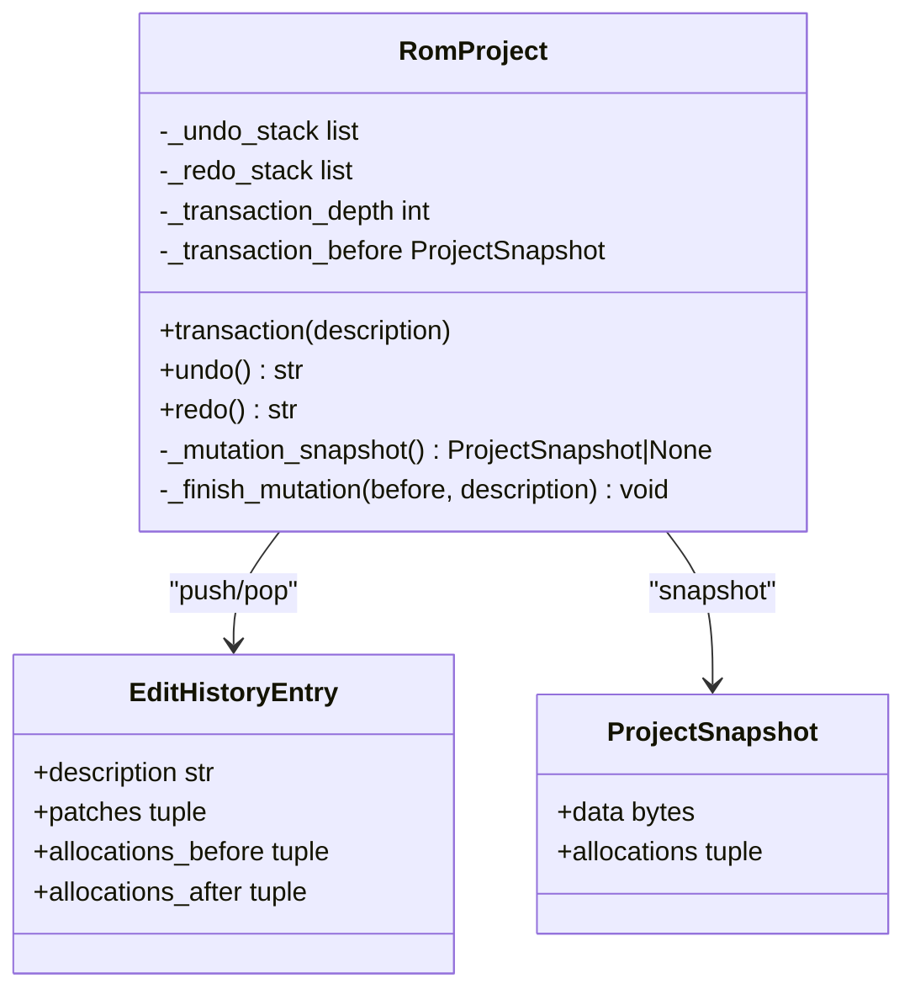
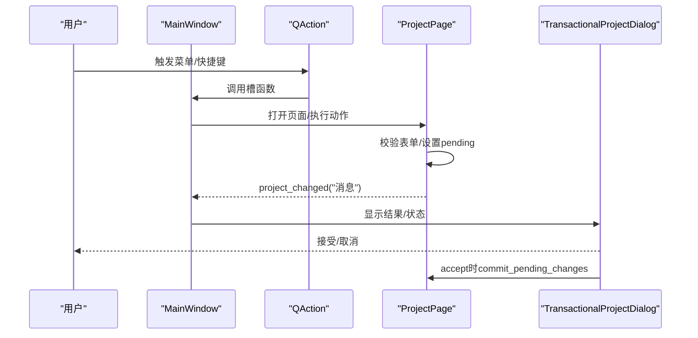
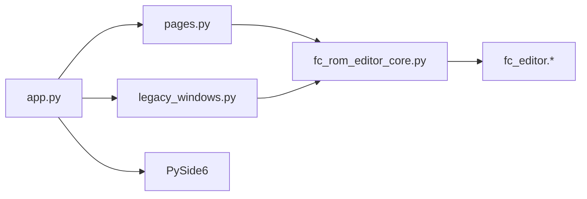

# 数据流与事件处理

<cite>
**本文引用的文件**
- [src/fc_rom_editor_core.py](file://src/fc_rom_editor_core.py)
- [src/dc_modifier/app.py](file://src/dc_modifier/app.py)
- [src/dc_modifier/pages.py](file://src/dc_modifier/pages.py)
- [src/dc_modifier/legacy_windows.py](file://src/dc_modifier/legacy_windows.py)
- [src/dc_modifier/workspace.py](file://src/dc_modifier/workspace.py)
</cite>

## 目录
1. [简介](#简介)
2. [项目结构](#项目结构)
3. [核心组件](#核心组件)
4. [架构总览](#架构总览)
5. [详细组件分析](#详细组件分析)
6. [依赖关系分析](#依赖关系分析)
7. [性能考虑](#性能考虑)
8. [故障排查指南](#故障排查指南)
9. [结论](#结论)
10. [附录](#附录)

## 简介
本文件面向DC修改器，系统化说明从用户操作到ROM数据读取、解析、修改、验证与写入的完整数据流，以及事务管理（撤销/重做、快照、并发控制）和事件驱动架构的实现。文档包含数据流图与事件序列图，覆盖错误处理、日志与调试建议，帮助读者理解并安全地扩展或维护该修改器。

## 项目结构
DC修改器采用“UI层 + 业务页 + 核心工程”的分层组织：
- UI层：主窗口、菜单、工具对话框，负责用户交互与页面调度。
- 业务页：按资源域划分（机体、武器、剧情、地图等），封装表单、校验与提交逻辑。
- 核心工程：RomProject统一管理ROM镜像、编解码器、资源分配、事务与构建产物。

**图表来源**
- [src/dc_modifier/app.py:276-489](file://src/dc_modifier/app.py#L276-L489)
- [src/dc_modifier/pages.py:103-149](file://src/dc_modifier/pages.py#L103-L149)
- [src/fc_rom_editor_core.py:463-785](file://src/fc_rom_editor_core.py#L463-L785)

**章节来源**
- [src/dc_modifier/app.py:276-489](file://src/dc_modifier/app.py#L276-L489)
- [src/dc_modifier/pages.py:103-149](file://src/dc_modifier/pages.py#L103-L149)
- [src/fc_rom_editor_core.py:463-785](file://src/fc_rom_editor_core.py#L463-L785)

## 核心组件
- RomProject：ROM工作区、编解码器绑定、资源分配、事务与撤销/重做、构建输出。
- ProjectPage：页面基类，统一草稿状态、提交与错误提示。
- TransactionalProjectDialog：窗口级会话快照，支持取消时整体回滚。
- MainWindow：应用入口，装配页面、菜单、快捷键与状态栏。
- workspace：工作区路径与默认ROM定位，输出路径保护。

关键职责与交互：
- 页面通过ProjectPage接口暴露“待提交草稿”，由上层在确认时统一提交。
- RomProject.transaction提供原子性事务边界；失败自动恢复。
- 窗口级对话框在打开时记录快照，关闭时根据接受/取消决定是否回滚。

**章节来源**
- [src/fc_rom_editor_core.py:112-141](file://src/fc_rom_editor_core.py#L112-L141)
- [src/fc_rom_editor_core.py:463-785](file://src/fc_rom_editor_core.py#L463-L785)
- [src/dc_modifier/pages.py:103-149](file://src/dc_modifier/pages.py#L103-L149)
- [src/dc_modifier/legacy_windows.py:71-259](file://src/dc_modifier/legacy_windows.py#L71-L259)
- [src/dc_modifier/app.py:276-489](file://src/dc_modifier/app.py#L276-L489)
- [src/dc_modifier/workspace.py:7-43](file://src/dc_modifier/workspace.py#L7-L43)

## 架构总览
下图展示从用户操作到ROM修改的端到端流程，包括事务、校验与构建。

**图表来源**
- [src/dc_modifier/app.py:387-489](file://src/dc_modifier/app.py#L387-L489)
- [src/dc_modifier/pages.py:103-149](file://src/dc_modifier/pages.py#L103-L149)
- [src/dc_modifier/legacy_windows.py:177-259](file://src/dc_modifier/legacy_windows.py#L177-L259)
- [src/fc_rom_editor_core.py:714-785](file://src/fc_rom_editor_core.py#L714-L785)

## 详细组件分析

### 数据流：ROM读取、解析、修改与写入
- 加载与初始化
  - 从文件或工程加载ROM，建立RomImage与原始数据副本。
  - 根据ROM配置动态绑定各编解码器（单位、武器、地图、剧情文本等）。
  - 若存在扩展计划，则预留分区并重新绑定动态编解码器。
- 解析与编辑
  - 页面通过编解码器将ROM字节解析为结构化对象。
  - 用户在表单中修改字段，页面计算差异并标记“待提交”。
- 事务与提交
  - 使用transaction包裹一次或多步修改，确保原子性。
  - 提交后计算diff patches，推入撤销栈；清空重做栈。
- 写入与构建
  - working缓冲区累积变更，最终通过构建流程写出ROM/IPS/报告。
  - 原子写文件避免中断导致的不完整输出。

**图表来源**
- [src/fc_rom_editor_core.py:463-618](file://src/fc_rom_editor_core.py#L463-L618)
- [src/fc_rom_editor_core.py:677-785](file://src/fc_rom_editor_core.py#L677-L785)
- [src/fc_rom_editor_core.py:1191-1205](file://src/fc_rom_editor_core.py#L1191-L1205)

**章节来源**
- [src/fc_rom_editor_core.py:463-618](file://src/fc_rom_editor_core.py#L463-L618)
- [src/fc_rom_editor_core.py:677-785](file://src/fc_rom_editor_core.py#L677-L785)
- [src/fc_rom_editor_core.py:1191-1205](file://src/fc_rom_editor_core.py#L1191-L1205)

### 事务系统：撤销/重做、快照与并发控制
- 快照机制
  - _mutation_snapshot在事务外捕获working与资源分配快照。
  - _finish_mutation基于快照计算差异，生成EditHistoryEntry。
- 撤销/重做
  - undo/redo通过Apply/Before补丁还原或重放working与分配器。
  - 每次重做/撤销后刷新动态编解码器以保持一致性。
- 并发控制
  - 使用_transaction_depth实现嵌套事务计数。
  - 最外层事务失败时恢复working与分配器，保证一致性。
- 窗口级会话
  - TransactionalProjectDialog在show时记录快照，reject时恢复working、分配器与历史栈。

**图表来源**
- [src/fc_rom_editor_core.py:112-141](file://src/fc_rom_editor_core.py#L112-L141)
- [src/fc_rom_editor_core.py:677-785](file://src/fc_rom_editor_core.py#L677-L785)
- [src/dc_modifier/legacy_windows.py:71-259](file://src/dc_modifier/legacy_windows.py#L71-L259)

**章节来源**
- [src/fc_rom_editor_core.py:677-785](file://src/fc_rom_editor_core.py#L677-L785)
- [src/dc_modifier/legacy_windows.py:71-259](file://src/dc_modifier/legacy_windows.py#L71-L259)

### 事件驱动架构：UI事件到业务逻辑映射、异步与状态同步
- 事件映射
  - MainWindow通过_action创建QAction并绑定槽函数，菜单/快捷键触发页面操作。
  - 页面通过project_changed信号通知主窗口更新状态与提示。
- 草稿与提交
  - ProjectPage.has_pending_draft标识未提交的表单改动。
  - commit_pending_changes在窗口确认前强制提交当前页草稿。
- 状态同步
  - 页面refresh根据当前project刷新UI。
  - 窗口级对话框在accept/reject时统一刷新已注册页面。
- 异步操作
  - 长耗时任务应在子线程执行并通过信号回调更新UI，避免阻塞事件循环。
  - 当前代码未显式使用线程池，建议在导入/构建阶段引入异步以避免卡顿。

**图表来源**
- [src/dc_modifier/app.py:387-489](file://src/dc_modifier/app.py#L387-L489)
- [src/dc_modifier/pages.py:103-149](file://src/dc_modifier/pages.py#L103-L149)
- [src/dc_modifier/legacy_windows.py:177-259](file://src/dc_modifier/legacy_windows.py#L177-L259)

**章节来源**
- [src/dc_modifier/app.py:387-489](file://src/dc_modifier/app.py#L387-L489)
- [src/dc_modifier/pages.py:103-149](file://src/dc_modifier/pages.py#L103-L149)
- [src/dc_modifier/legacy_windows.py:177-259](file://src/dc_modifier/legacy_windows.py#L177-L259)

### 数据验证与完整性检查
- 基准ROM校验
  - 加载ROM时检查哈希与布局兼容性，防止误用非基准ROM。
- 扩展容量规划校验
  - 自动规划需满足最小配额限制（如地图≥16KiB、剧情≥16KiB）。
- 编解码器校验
  - 导入资源时校验ID命名规则、长度对齐与范围有效性。
- 工程完整性检查
  - load_project在加载工程后执行validate_project，遇到错误立即中止。

**章节来源**
- [src/dc_modifier/app.py:794-800](file://src/dc_modifier/app.py#L794-L800)
- [src/fc_rom_editor_core.py:643-674](file://src/fc_rom_editor_core.py#L643-L674)
- [src/fc_rom_editor_core.py:1327-1434](file://src/fc_rom_editor_core.py#L1327-L1434)
- [src/fc_rom_editor_core.py:1440-1472](file://src/fc_rom_editor_core.py#L1440-L1472)

### 构建与输出：ROM/IPS/报告
- 构建产物
  - BuildArtifacts包含rom、ips、project、report、output_sha256、changed_bytes。
- IPS生成与应用
  - make_ips/apply_ips用于生成与合并增量补丁。
- 原子写入
  - atomic_write_bytes/atomic_write_text确保文件写入的原子性与完整性。

**章节来源**
- [src/fc_rom_editor_core.py:134-141](file://src/fc_rom_editor_core.py#L134-L141)
- [src/fc_rom_editor_core.py:386-433](file://src/fc_rom_editor_core.py#L386-L433)
- [src/fc_rom_editor_core.py:436-461](file://src/fc_rom_editor_core.py#L436-L461)

## 依赖关系分析
- 模块耦合
  - app.py依赖pages.py中的各类页面与workspace路径常量。
  - pages.py依赖fc_rom_editor_core.RomProject进行数据读写。
  - legacy_windows.py提供窗口级事务包装，复用pages与core能力。
- 外部依赖
  - fc_editor.*提供编解码器、模型、资源分配与验证服务。
  - PySide6提供UI框架与事件循环。

**图表来源**
- [src/dc_modifier/app.py:33-58](file://src/dc_modifier/app.py#L33-L58)
- [src/dc_modifier/pages.py:38-45](file://src/dc_modifier/pages.py#L38-L45)
- [src/dc_modifier/legacy_windows.py:38-60](file://src/dc_modifier/legacy_windows.py#L38-L60)
- [src/fc_rom_editor_core.py:15-105](file://src/fc_rom_editor_core.py#L15-L105)

**章节来源**
- [src/dc_modifier/app.py:33-58](file://src/dc_modifier/app.py#L33-L58)
- [src/dc_modifier/pages.py:38-45](file://src/dc_modifier/pages.py#L38-L45)
- [src/dc_modifier/legacy_windows.py:38-60](file://src/dc_modifier/legacy_windows.py#L38-L60)
- [src/fc_rom_editor_core.py:15-105](file://src/fc_rom_editor_core.py#L15-L105)

## 性能考虑
- 批量操作
  - 使用transaction聚合多次写入，减少快照与diff开销。
- 懒加载与缓存
  - 页面仅在需要时刷新列表与详情，避免全量重建。
- 大文件I/O
  - 构建ROM/IPS时使用原子写入，避免部分写入导致的损坏。
- 异步化建议
  - 导入/构建等耗时操作应放入后台线程，通过信号回调更新UI，保持响应性。

[本节为通用指导，不直接分析具体文件]

## 故障排查指南
- 常见错误
  - 非基准ROM：加载时报错，需切换至正确基准ROM。
  - 容量不足：自动规划时报错，调整map/unit/story配额。
  - 资源冲突：同一记录在多页草稿中，需先保留一份再重试。
  - 非法输入：ID范围、资源ID命名、CHR长度等校验失败。
- 调试建议
  - 启用项目完整性检查（F7）快速发现结构性问题。
  - 使用“完整ROM数据读取”工具定位偏移与内容。
  - 查看状态栏消息与对话框提示，结合撤销/重做回退到稳定点。
- 日志与审计
  - 构建产物包含changed_bytes与SHA256，便于对比差异。
  - 导出IPS可用于版本间增量比对。

**章节来源**
- [src/dc_modifier/app.py:794-800](file://src/dc_modifier/app.py#L794-L800)
- [src/fc_rom_editor_core.py:643-674](file://src/fc_rom_editor_core.py#L643-L674)
- [src/dc_modifier/legacy_windows.py:131-160](file://src/dc_modifier/legacy_windows.py#L131-L160)
- [src/fc_rom_editor_core.py:386-433](file://src/fc_rom_editor_core.py#L386-L433)

## 结论
DC修改器通过清晰的三层架构与严格的事务管理，实现了安全的ROM数据编辑与构建。页面级草稿与窗口级会话快照共同保障了操作的原子性与可回滚性；编解码器与资源分配器确保了数据的一致性与完整性。建议在后续迭代中引入异步处理以提升用户体验，并完善日志与审计能力以便问题定位。

[本节为总结，不直接分析具体文件]

## 附录
- 推荐工作流
  - 打开基准ROM → 自动规划扩展容量 → 修改并随时验证 → 保存工程并构建ROM/IPS。
- 安全规则
  - 不会覆盖当前载入的基准ROM；音频引擎、固定银行与CHR区域由构建检查保护。
- 常用入口
  - 扩展容量规划、地图与部署、机体属性、人物数据、武器属性、剧情文字、增援/加入事件、劝降条件、战斗音乐。

**章节来源**
- [src/dc_modifier/pages.py:154-241](file://src/dc_modifier/pages.py#L154-L241)