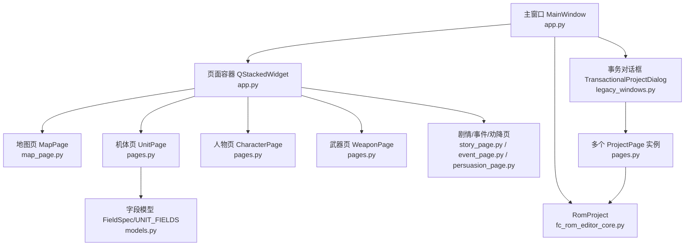
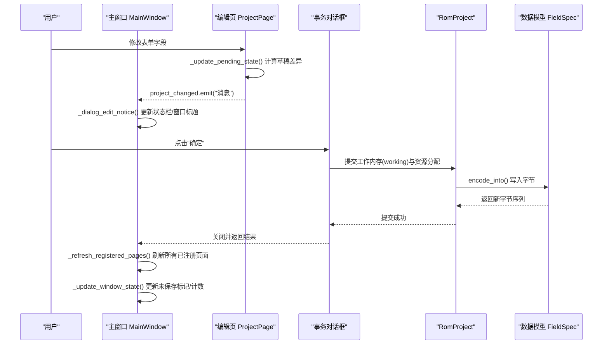
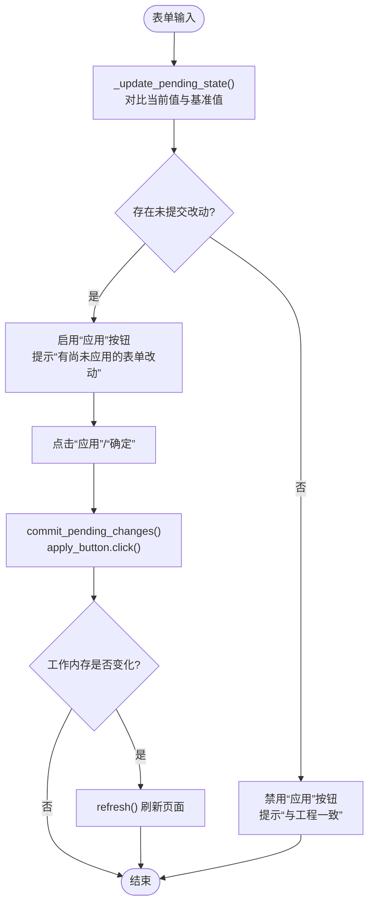
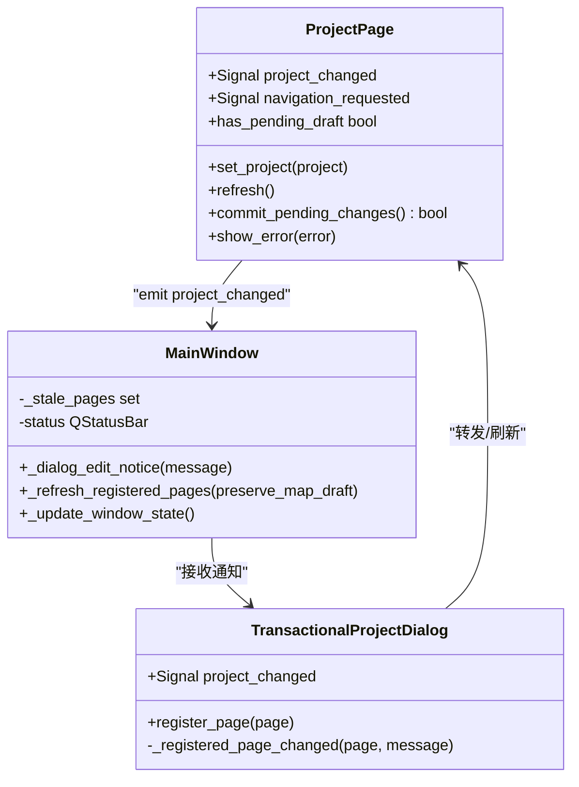
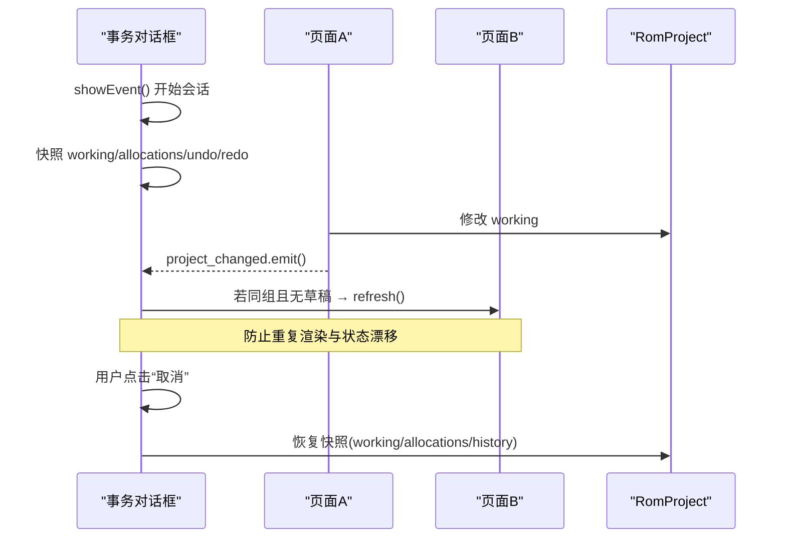
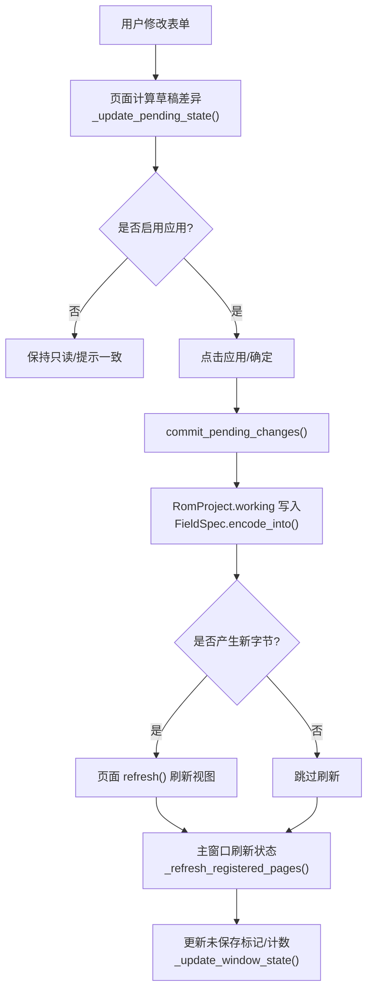
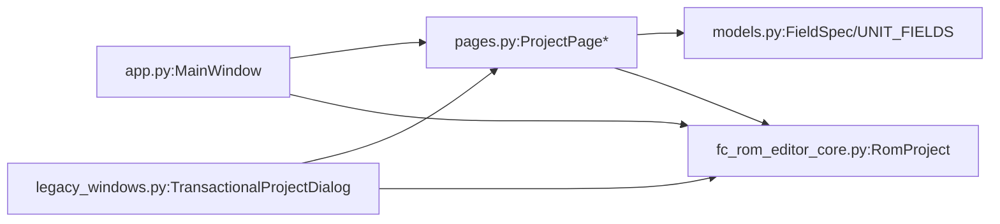

# 状态同步机制

<cite>
**本文引用的文件**
- [app.py](file://src/dc_modifier/app.py)
- [pages.py](file://src/dc_modifier/pages.py)
- [legacy_windows.py](file://src/dc_modifier/legacy_windows.py)
- [workspace.py](file://src/dc_modifier/workspace.py)
- [models.py](file://src/fc_editor/models.py)
- [fc_rom_editor_core.py](file://src/fc_rom_editor_core.py)
</cite>

## 目录
1. [简介](#简介)
2. [项目结构](#项目结构)
3. [核心组件](#核心组件)
4. [架构总览](#架构总览)
5. [详细组件分析](#详细组件分析)
6. [依赖关系分析](#依赖关系分析)
7. [性能考虑](#性能考虑)
8. [故障排查指南](#故障排查指南)
9. [结论](#结论)
10. [附录](#附录)

## 简介
本文件面向DC修改器的“状态同步机制”，聚焦数据模型与UI界面的双向绑定、观察者模式应用、属性变更通知与视图更新策略；解释多页面状态协调（共享数据管理、依赖解析、一致性保证）；说明异步状态更新处理（后台任务调度、进度反馈、界面响应性优化）；并提供状态同步流程图，展示数据变更在系统中的传播过程，以及性能监控与调试工具的使用方法。

## 项目结构
DC修改器采用“主窗口 + 多页编辑 + 事务对话框”的架构：
- 主窗口负责工程生命周期、菜单/动作、页面注册与导航、状态栏与未保存变更检测。
- 各编辑页继承统一基类，提供表单草稿、提交、刷新、错误提示等能力。
- 事务对话框为每个编辑会话提供快照与撤销/重做边界，确保跨页面的一致性。
- 底层RomProject承载工作内存、编解码器、资源分配器与构建产物。

**图表来源**
- [app.py:276-365](file://src/dc_modifier/app.py#L276-L365)
- [pages.py:103-149](file://src/dc_modifier/pages.py#L103-L149)
- [legacy_windows.py:71-187](file://src/dc_modifier/legacy_windows.py#L71-L187)
- [models.py:13-108](file://src/fc_editor/models.py#L13-L108)

**章节来源**
- [app.py:276-365](file://src/dc_modifier/app.py#L276-L365)
- [workspace.py:7-43](file://src/dc_modifier/workspace.py#L7-L43)

## 核心组件
- 主窗口 MainWindow：维护工程对象、页面集合、导航与状态栏；监听页面变更并刷新全局状态。
- 页面基类 ProjectPage：定义 set_project、refresh、has_pending_draft、commit_pending_changes、show_error 等接口，供具体页面实现。
- 可搜索记录页 SearchableRecordPage：提供列表过滤、选择切换、复制/粘贴/还原/导出等通用交互，并在切换时自动提交草稿。
- 事务对话框 TransactionalProjectDialog：以会话为单位对 RomProject.working、资源分配器与撤销栈进行快照，支持取消回滚与跨页面冲突检测。
- 数据模型 FieldSpec/UNIT_FIELDS：定义字段偏移、范围、掩码、位移、显示缩放等，提供 decode/encode_into 方法，保障读写一致。
- RomProject：封装ROM镜像、工作内存、编解码器、资源分配器、构建产物与校验逻辑，是状态同步的核心数据源。

**章节来源**
- [pages.py:103-149](file://src/dc_modifier/pages.py#L103-L149)
- [pages.py:243-511](file://src/dc_modifier/pages.py#L243-L511)
- [legacy_windows.py:71-187](file://src/dc_modifier/legacy_windows.py#L71-L187)
- [models.py:13-108](file://src/fc_editor/models.py#L13-L108)
- [fc_rom_editor_core.py:112-141](file://src/fc_rom_editor_core.py#L112-L141)

## 架构总览
下图展示了从用户操作到数据落盘的全链路状态同步流程，包括观察者信号、事务边界、页面刷新与主窗口状态更新。

**图表来源**
- [app.py:494-509](file://src/dc_modifier/app.py#L494-L509)
- [pages.py:732-757](file://src/dc_modifier/pages.py#L732-L757)
- [legacy_windows.py:177-187](file://src/dc_modifier/legacy_windows.py#L177-L187)
- [models.py:37-58](file://src/fc_editor/models.py#L37-L58)

## 详细组件分析

### 数据模型与UI双向绑定
- 字段模型 FieldSpec 提供 decode/encode_into，将原始字节与业务值互转，支持掩码与位移，保证数值范围与编码一致性。
- 页面表单控件（QSpinBox/QComboBox/QLineEdit）通过 valueChanged/textChanged 等信号触发 _update_pending_state，比较当前值与基准值，决定是否启用“应用”按钮并更新待提交提示。
- 提交时调用 commit_pending_changes，内部执行 apply_button.click()，若工作内存发生变化则刷新页面，确保视图与数据一致。

**图表来源**
- [pages.py:732-757](file://src/dc_modifier/pages.py#L732-L757)
- [pages.py:131-149](file://src/dc_modifier/pages.py#L131-L149)
- [models.py:37-58](file://src/fc_editor/models.py#L37-L58)

**章节来源**
- [pages.py:732-757](file://src/dc_modifier/pages.py#L732-L757)
- [pages.py:131-149](file://src/dc_modifier/pages.py#L131-L149)
- [models.py:37-58](file://src/fc_editor/models.py#L37-L58)

### 观察者模式与属性变更通知
- ProjectPage 暴露 project_changed 与 navigation_requested 信号，页面在数据变更后发出通知。
- 主窗口 MainWindow 在初始化时为每个页面连接 project_changed，收到通知后刷新状态栏与窗口标题，必要时刷新其他页面。
- 事务对话框将子页面的 project_changed 转发给自身，再向主窗口广播，形成“页面→对话框→主窗口”的单向通知链。

**图表来源**
- [pages.py:103-149](file://src/dc_modifier/pages.py#L103-L149)
- [app.py:494-509](file://src/dc_modifier/app.py#L494-L509)
- [legacy_windows.py:116-129](file://src/dc_modifier/legacy_windows.py#L116-L129)

**章节来源**
- [pages.py:103-149](file://src/dc_modifier/pages.py#L103-L149)
- [app.py:494-509](file://src/dc_modifier/app.py#L494-L509)
- [legacy_windows.py:116-129](file://src/dc_modifier/legacy_windows.py#L116-L129)

### 多页面状态协调机制
- 共享数据：所有页面共享同一 RomProject.working 与工作区资源分配器，确保修改在同一内存中生效。
- 依赖关系：页面通过 ProjectPage.set_project 注入工程对象，并在 refresh 中重新加载数据；部分页面使用 transaction_sync_group 标识相关页面组，当一组内某页提交后，同组其他无草稿页面会刷新。
- 一致性保证：事务对话框在 showEvent 时捕获 RomProject.working、资源分配器与撤销/重做栈快照；Cancel或关闭窗口时恢复快照，避免跨页面并发草稿冲突。同时提供 pending_draft_key/pending_draft_keys 用于冲突检测，阻止同一ROM记录被多个页面同时持有未提交草稿。

**图表来源**
- [legacy_windows.py:177-187](file://src/dc_modifier/legacy_windows.py#L177-L187)
- [legacy_windows.py:116-129](file://src/dc_modifier/legacy_windows.py#L116-L129)
- [legacy_windows.py:131-160](file://src/dc_modifier/legacy_windows.py#L131-L160)

**章节来源**
- [legacy_windows.py:116-160](file://src/dc_modifier/legacy_windows.py#L116-L160)
- [legacy_windows.py:177-187](file://src/dc_modifier/legacy_windows.py#L177-L187)

### 异步状态更新处理
- 后台任务：导入/构建/导出等操作可能耗时，建议在独立线程或Qt异步任务中执行，避免阻塞UI线程。
- 进度反馈：使用 QProgressBar 或状态栏消息提示进度；长任务完成后通过信号回调刷新页面。
- 界面响应性：将耗时计算放入后台，仅在主线程更新UI；利用 Qt 的信号槽机制解耦UI与计算。
- 本仓库中的示例路径：
  - 进度条与对话框：[pages.py:24-36](file://src/dc_modifier/pages.py#L24-L36)
  - 状态栏消息：[app.py:507-509](file://src/dc_modifier/app.py#L507-L509)

**章节来源**
- [pages.py:24-36](file://src/dc_modifier/pages.py#L24-L36)
- [app.py:507-509](file://src/dc_modifier/app.py#L507-L509)

### 状态同步流程图（数据变更传播）

**图表来源**
- [pages.py:732-757](file://src/dc_modifier/pages.py#L732-L757)
- [pages.py:131-149](file://src/dc_modifier/pages.py#L131-L149)
- [models.py:37-58](file://src/fc_editor/models.py#L37-L58)
- [app.py:494-509](file://src/dc_modifier/app.py#L494-L509)

## 依赖关系分析
- 主窗口依赖页面集合与RomProject，负责生命周期管理与UI状态。
- 页面依赖数据模型与RomProject，负责表单与数据映射。
- 事务对话框依赖页面与RomProject，负责会话级一致性。
- RomProject依赖编解码器、资源分配器与ROM镜像，提供统一的读写入口。

**图表来源**
- [app.py:276-365](file://src/dc_modifier/app.py#L276-L365)
- [pages.py:103-149](file://src/dc_modifier/pages.py#L103-L149)
- [legacy_windows.py:71-187](file://src/dc_modifier/legacy_windows.py#L71-L187)
- [models.py:13-108](file://src/fc_editor/models.py#L13-L108)
- [fc_rom_editor_core.py:112-141](file://src/fc_rom_editor_core.py#L112-L141)

**章节来源**
- [app.py:276-365](file://src/dc_modifier/app.py#L276-L365)
- [pages.py:103-149](file://src/dc_modifier/pages.py#L103-L149)
- [legacy_windows.py:71-187](file://src/dc_modifier/legacy_windows.py#L71-L187)
- [models.py:13-108](file://src/fc_editor/models.py#L13-L108)
- [fc_rom_editor_core.py:112-141](file://src/fc_rom_editor_core.py#L112-L141)

## 性能考虑
- 批量刷新：页面在 populate_records 中使用 blockSignals 与 updatesEnabled 控制，减少频繁重绘。
- 延迟刷新：仅在确认工作内存变化后调用 refresh，避免无效刷新。
- 状态缓存：主窗口维护 _count_snapshot 与 _saved_allocations，快速判断是否有未保存变更。
- 输出保护：writable_output_path 禁止写入 references/ 只读目录，避免误覆盖参考数据。

**章节来源**
- [pages.py:396-437](file://src/dc_modifier/pages.py#L396-L437)
- [app.py:731-742](file://src/dc_modifier/app.py#L731-L742)
- [workspace.py:37-43](file://src/dc_modifier/workspace.py#L37-L43)

## 故障排查指南
- 无法提交草稿：检查 has_pending_draft 与 pending_draft_error，确保表单校验通过。
- 多页面冲突：查看 pending_draft_key/pending_draft_keys，确保同一ROM记录未被多个页面同时持有草稿。
- 未保存变更提示异常：核对 _saved_snapshot 与 _saved_allocations 是否正确设置。
- 输出路径错误：确认 writable_output_path 未指向 references/ 目录。

**章节来源**
- [pages.py:118-149](file://src/dc_modifier/pages.py#L118-L149)
- [legacy_windows.py:131-160](file://src/dc_modifier/legacy_windows.py#L131-L160)
- [app.py:731-742](file://src/dc_modifier/app.py#L731-L742)
- [workspace.py:37-43](file://src/dc_modifier/workspace.py#L37-L43)

## 结论
DC修改器的状态同步机制以 RomProject 为核心，结合 ProjectPage 的表单草稿与事务对话框的会话快照，实现了可靠的双向绑定与多页面一致性。通过观察者信号与批量刷新策略，系统在保持响应性的同时确保了数据正确性。建议在实际开发中继续遵循“最小刷新、明确事务边界、严格路径保护”的原则，以提升稳定性与可维护性。

## 附录
- 性能监控建议：
  - 在关键刷新点添加计时日志，评估 refresh 耗时。
  - 使用状态栏或进度条反馈长任务进度，避免UI冻结。
- 调试工具建议：
  - 打印 pending_draft_key 与 affected_ids，定位冲突来源。
  - 对比 _saved_snapshot 与 bytes(project.working)，确认变更范围。
  - 检查 resource_allocator.allocations 变化，验证资源分配一致性。