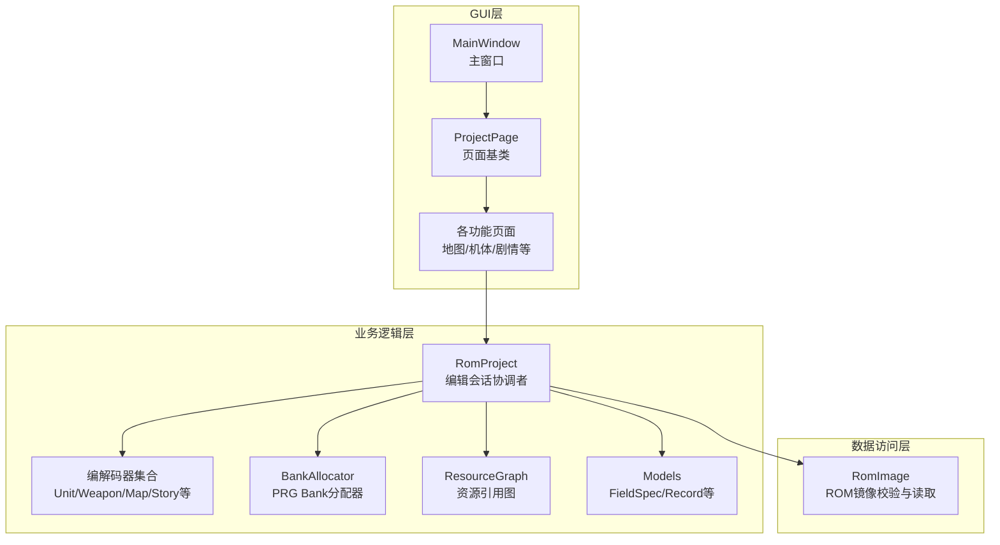
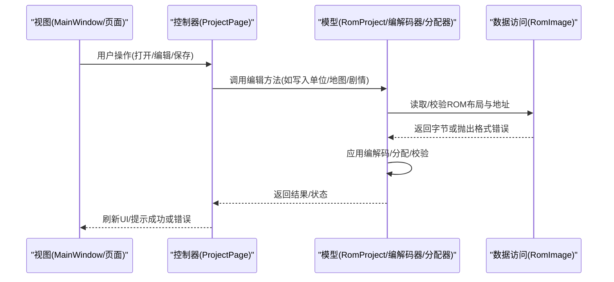
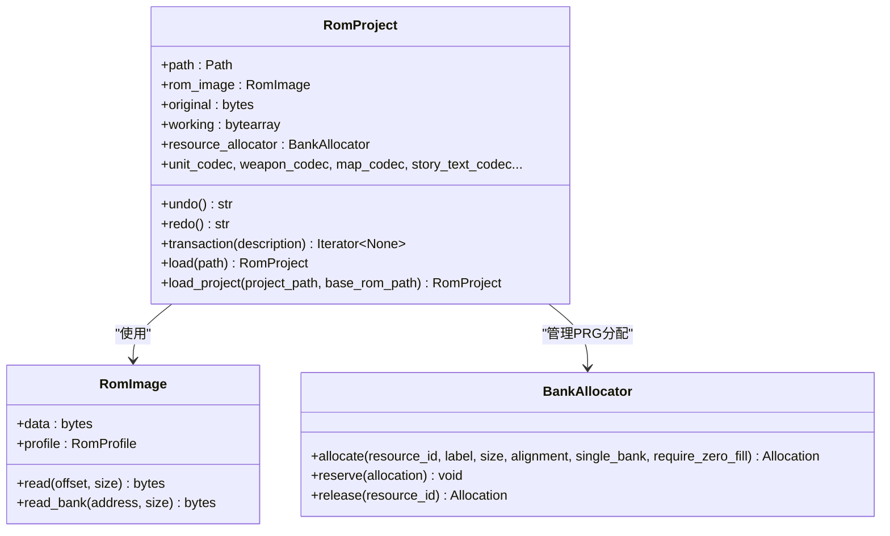
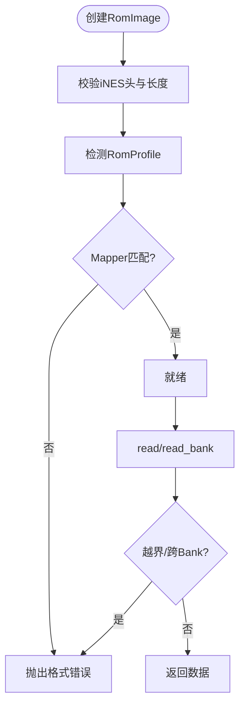
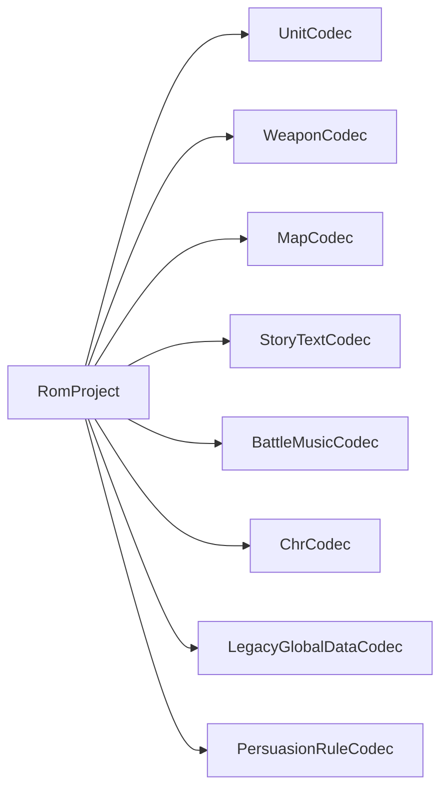
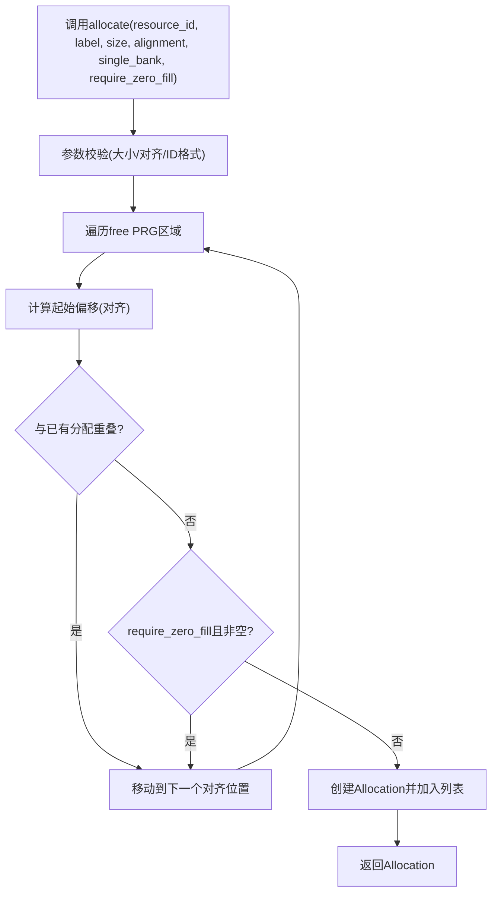
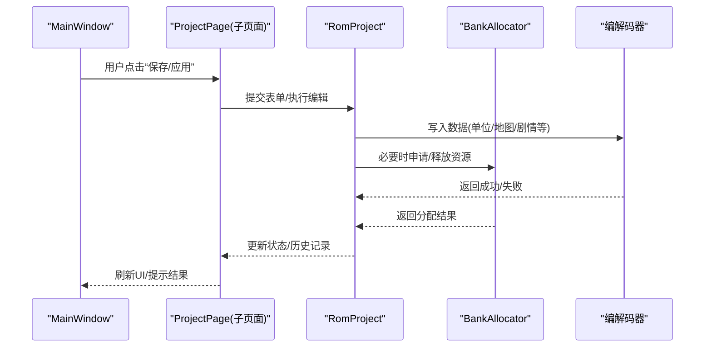
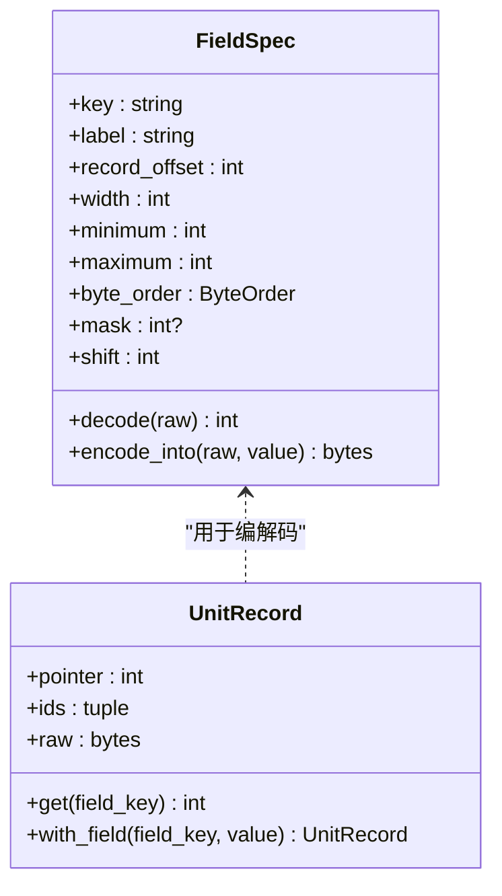
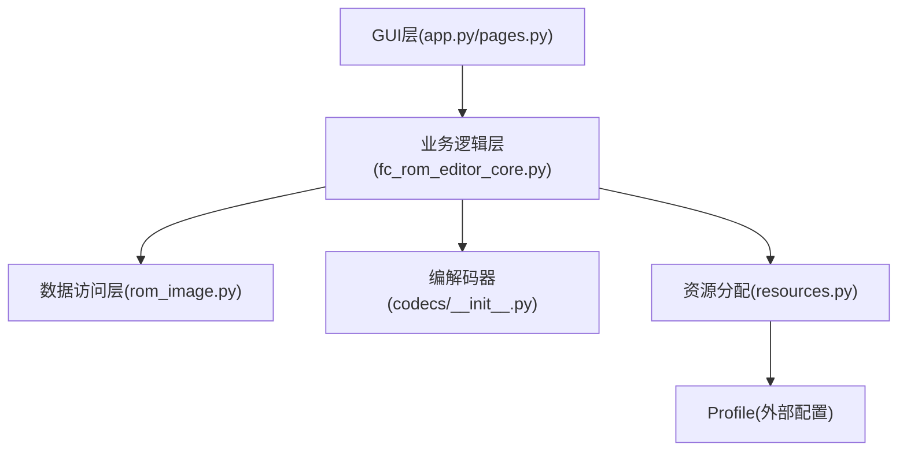

# 架构设计

<cite>
**本文引用的文件**
- [fc_rom_editor_core.py](file://src/fc_rom_editor_core.py)
- [rom_image.py](file://src/fc_editor/rom_image.py)
- [resources.py](file://src/fc_editor/resources.py)
- [__init__.py（编解码器导出）](file://src/fc_editor/codecs/__init__.py)
- [app.py](file://src/dc_modifier/app.py)
- [pages.py](file://src/dc_modifier/pages.py)
- [models.py](file://src/fc_editor/models.py)
</cite>

## 目录
1. [引言](#引言)
2. [项目结构](#项目结构)
3. [核心组件](#核心组件)
4. [架构总览](#架构总览)
5. [详细组件分析](#详细组件分析)
6. [依赖关系分析](#依赖关系分析)
7. [性能考量](#性能考量)
8. [故障排查指南](#故障排查指南)
9. [结论](#结论)
10. [附录](#附录)

## 引言
本文件为“DC修改器”的架构设计文档，面向希望理解并扩展该工具的工程师与高级用户。文档聚焦分层架构、MVC模式落地、模块化组织原则，以及关键组件的职责边界与交互流程。重点覆盖：
- GUI层（PySide6界面）、业务逻辑层（编辑会话、编解码、资源分配）、数据访问层（ROM镜像读写）的职责分离
- Model（数据模型）、View（界面）、Controller（控制器/页面）之间的协作方式
- RomProject作为编辑会话协调者、RomImage负责ROM镜像校验与读取、编解码系统处理多格式转换、BankAllocator管理PRG Bank空间分配
- 架构图与数据流图，说明组件通信机制与事件处理流程
- 设计决策的技术权衡与约束条件

## 项目结构
项目采用清晰的三层结构与模块化组织：
- GUI层：位于 src/dc_modifier，包含主窗口、页面、工具对话框等，基于PySide6构建
- 业务逻辑层：位于 src/fc_editor，提供数据模型、编解码器、资源分配、工程文档、验证服务等
- 数据访问层：位于 src/fc_editor，封装ROM镜像校验、地址映射、安全读取
- 核心入口：src/fc_rom_editor_core.py 中的 RomProject 作为编辑会话的核心协调者，串联各层

**图表来源**
- [app.py:276-365](file://src/dc_modifier/app.py#L276-L365)
- [pages.py:103-152](file://src/dc_modifier/pages.py#L103-L152)
- [fc_rom_editor_core.py:463-618](file://src/fc_rom_editor_core.py#L463-L618)
- [rom_image.py:50-125](file://src/fc_editor/rom_image.py#L50-L125)
- [resources.py:47-260](file://src/fc_editor/resources.py#L47-L260)

**章节来源**
- [app.py:276-365](file://src/dc_modifier/app.py#L276-L365)
- [fc_rom_editor_core.py:463-618](file://src/fc_rom_editor_core.py#L463-L618)
- [rom_image.py:50-125](file://src/fc_editor/rom_image.py#L50-L125)
- [resources.py:47-260](file://src/fc_editor/resources.py#L47-L260)

## 核心组件
- RomProject：编辑会话的核心协调者，维护working ROM缓冲区、原始镜像、扩展计划、编解码器实例、资源分配器、撤销/重做栈、事务上下文等
- RomImage：不可变ROM镜像封装，负责iNES头校验、Mapper检测、SHA-256基准比对、安全读取
- 编解码器系统：按数据类型划分（单位、武器、地图、剧情文本、音乐、字体等），统一暴露读/写接口，适配不同布局与扩展标志
- BankAllocator：在profile声明的可用PRG区域进行确定性分配，支持对齐、单Bank限制、零填充检查、冲突检测
- ResourceGraph：从Profile构建资源节点与引用关系，辅助编辑器模块定位指针表、受保护区域、自定义音频槽等
- Models：以FieldSpec描述字段布局、掩码、位移、取值范围；以Record封装具体记录（如UnitRecord、WeaponRecord）

**章节来源**
- [fc_rom_editor_core.py:463-618](file://src/fc_rom_editor_core.py#L463-L618)
- [rom_image.py:50-125](file://src/fc_editor/rom_image.py#L50-L125)
- [resources.py:280-413](file://src/fc_editor/resources.py#L280-L413)
- [models.py:13-108](file://src/fc_editor/models.py#L13-L108)

## 架构总览
整体采用分层+MVC模式：
- View（GUI）：MainWindow与各ProjectPage，负责展示、收集用户输入、触发操作
- Controller（页面/对话框）：ProjectPage及其子类，将用户操作转换为对RomProject的调用，并通过信号通知变更
- Model（数据与规则）：RomProject、编解码器、Models、ResourceGraph、BankAllocator，负责数据一致性、校验、持久化准备

**图表来源**
- [app.py:276-365](file://src/dc_modifier/app.py#L276-L365)
- [pages.py:103-152](file://src/dc_modifier/pages.py#L103-L152)
- [fc_rom_editor_core.py:463-618](file://src/fc_rom_editor_core.py#L463-L618)
- [rom_image.py:50-125](file://src/fc_editor/rom_image.py#L50-L125)

## 详细组件分析

### RomProject：编辑会话协调者
职责：
- 初始化工作区：加载原始ROM、复制working缓冲、解析扩展计划、设置编解码器实例
- 编解码器装配：根据ROM配置与扩展标志，选择基础或扩展编解码器（单位、武器、地图、剧情文本、音乐等）
- 资源分配：通过BankAllocator管理可用PRG区域，预留分区与守卫区域
- 事务与历史：提供transaction上下文，记录EditPatch与Allocation快照，支持撤销/重做
- 输出与校验：生成IPS补丁、原子写入、只读输出根保护、完整性校验

**图表来源**
- [fc_rom_editor_core.py:463-618](file://src/fc_rom_editor_core.py#L463-L618)
- [rom_image.py:50-125](file://src/fc_editor/rom_image.py#L50-L125)
- [resources.py:280-413](file://src/fc_editor/resources.py#L280-L413)

**章节来源**
- [fc_rom_editor_core.py:463-618](file://src/fc_rom_editor_core.py#L463-L618)

### RomImage：ROM镜像处理器
职责：
- iNES头校验、大小与声明一致、Mapper匹配、Profile检测
- 提供安全的read/read_bank接口，越界与跨Bank读取会抛错
- SHA-256基准比对，确保项目操作可安全重放

**图表来源**
- [rom_image.py:50-125](file://src/fc_editor/rom_image.py#L50-L125)

**章节来源**
- [rom_image.py:50-125](file://src/fc_editor/rom_image.py#L50-L125)

### 编解码器系统：多格式转换
职责：
- 按数据类型提供统一的编解码接口（读/写/校验）
- 支持扩展布局（如单位名称表、地图触发、剧情文本组）
- 与RomProject装配联动，根据ROM配置动态启用

**图表来源**
- [fc_rom_editor_core.py:463-618](file://src/fc_rom_editor_core.py#L463-L618)
- [__init__.py（编解码器导出）:1-47](file://src/fc_editor/codecs/__init__.py#L1-L47)

**章节来源**
- [fc_rom_editor_core.py:463-618](file://src/fc_rom_editor_core.py#L463-L618)
- [__init__.py（编解码器导出）:1-47](file://src/fc_editor/codecs/__init__.py#L1-L47)

### 资源分配器：BankAllocator
职责：
- 在profile声明的free PRG区域内进行确定性分配
- 支持对齐、单Bank限制、零填充检查、冲突检测
- 提供reserve/release/allocate接口，供上层模块申请/释放资源

**图表来源**
- [resources.py:368-413](file://src/fc_editor/resources.py#L368-L413)

**章节来源**
- [resources.py:280-413](file://src/fc_editor/resources.py#L280-L413)

### GUI层与MVC交互
职责：
- MainWindow负责菜单、动作、页面注册、状态栏更新
- ProjectPage定义通用行为（刷新、待提交草稿、错误提示）
- 各功能页面（地图、机体、剧情、资源规划等）实现具体编辑逻辑，通过信号通知RomProject变更

**图表来源**
- [app.py:276-365](file://src/dc_modifier/app.py#L276-L365)
- [pages.py:103-152](file://src/dc_modifier/pages.py#L103-L152)
- [fc_rom_editor_core.py:463-618](file://src/fc_rom_editor_core.py#L463-L618)

**章节来源**
- [app.py:276-365](file://src/dc_modifier/app.py#L276-L365)
- [pages.py:103-152](file://src/dc_modifier/pages.py#L103-L152)

### 数据模型：FieldSpec与Record
职责：
- FieldSpec描述字段的偏移、宽度、掩码、位移、取值范围、显示比例等
- Record封装具体记录（如UnitRecord、WeaponRecord），提供get/with_field方法

**图表来源**
- [models.py:13-108](file://src/fc_editor/models.py#L13-L108)
- [models.py:165-200](file://src/fc_editor/models.py#L165-L200)

**章节来源**
- [models.py:13-108](file://src/fc_editor/models.py#L13-L108)
- [models.py:165-200](file://src/fc_editor/models.py#L165-L200)

## 依赖关系分析
- GUI层依赖业务逻辑层：MainWindow与ProjectPage通过RomProject发起编辑操作
- 业务逻辑层依赖数据访问层：RomProject通过RomImage进行ROM读取与校验
- 编解码器与资源分配器被RomProject装配与调度，形成松耦合的数据处理管线
- ResourceGraph由Profile驱动，为编辑器模块提供资源定位与引用关系

**图表来源**
- [app.py:276-365](file://src/dc_modifier/app.py#L276-L365)
- [fc_rom_editor_core.py:463-618](file://src/fc_rom_editor_core.py#L463-L618)
- [rom_image.py:50-125](file://src/fc_editor/rom_image.py#L50-L125)
- [resources.py:47-260](file://src/fc_editor/resources.py#L47-L260)

**章节来源**
- [app.py:276-365](file://src/dc_modifier/app.py#L276-L365)
- [fc_rom_editor_core.py:463-618](file://src/fc_rom_editor_core.py#L463-L618)
- [rom_image.py:50-125](file://src/fc_editor/rom_image.py#L50-L125)
- [resources.py:47-260](file://src/fc_editor/resources.py#L47-L260)

## 性能考量
- 内存占用：RomProject维护original与working两份镜像，适合中等规模ROM；对于超大ROM需评估内存压力
- 编解码效率：按类型拆分编解码器，避免全量扫描；建议批量写入时合并EditPatch以减少差异计算开销
- 分配策略：BankAllocator采用首次适应算法，单Bank限制提升兼容性；对齐与零填充检查保证稳定性但可能增加搜索成本
- 事务与历史：撤销/重做基于字节级差异与Allocation快照，频繁小步操作会产生较多历史条目，建议在批量编辑前开启事务减少中间态

[本节为一般性指导，不直接分析具体文件]

## 故障排查指南
常见问题与定位：
- ROM格式错误：iNES头无效、大小不符、Mapper不匹配、SHA-256非基准版
  - 参考：RomImage.validate_layout与require_reference_base
- 资源分配失败：无足够空闲PRG空间、对齐不满足、与已有分配重叠、非零填充要求
  - 参考：BankAllocator.allocate与reserve的参数校验与冲突检测
- 编解码异常：字段超出范围、记录尺寸不符、指针表缺失
  - 参考：FieldSpec.encode_into与Record构造校验、RomProject装配逻辑
- 输出路径保护：禁止写入只读参考目录
  - 参考：RomProject.set_read_only_output_roots与_resolve_output_path

**章节来源**
- [rom_image.py:79-112](file://src/fc_editor/rom_image.py#L79-L112)
- [resources.py:334-413](file://src/fc_editor/resources.py#L334-L413)
- [models.py:13-108](file://src/fc_editor/models.py#L13-L108)
- [fc_rom_editor_core.py:626-636](file://src/fc_rom_editor_core.py#L626-L636)

## 结论
DC修改器采用清晰的分层与MVC架构，通过RomProject协调GUI、业务逻辑与数据访问，结合编解码器与资源分配器实现对复杂ROM结构的稳定编辑。该设计在保证安全性的同时提供了良好的可扩展性，便于后续新增数据类型与编辑功能。建议在扩展时遵循现有接口契约，保持编解码器与分配器的解耦，并利用事务机制保障编辑一致性。

[本节为总结性内容，不直接分析具体文件]

## 附录
- 推荐工作流程：打开基准ROM → 自动规划扩展容量 → 修改并随时验证 → 保存工程并构建ROM/IPS
- 安全规则：不会覆盖当前载入的基准ROM；音频引擎、固定银行和CHR区域由构建检查保护

[本节为补充信息，不直接分析具体文件]