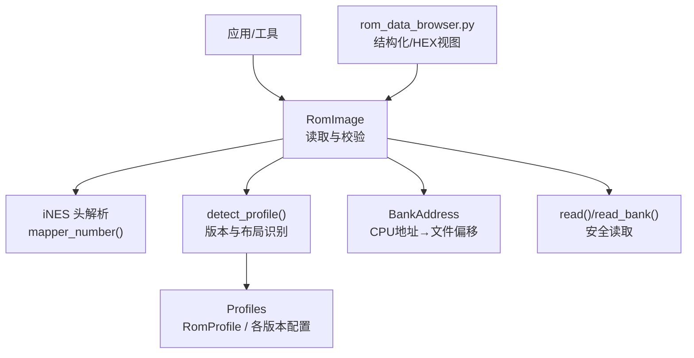
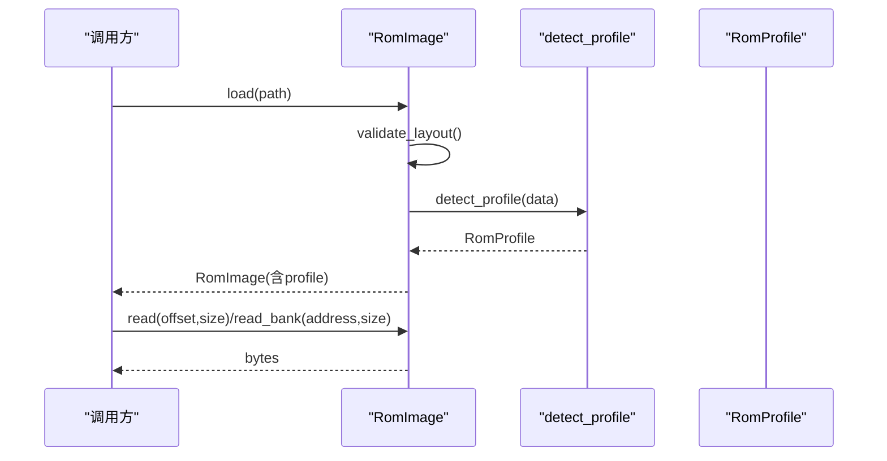
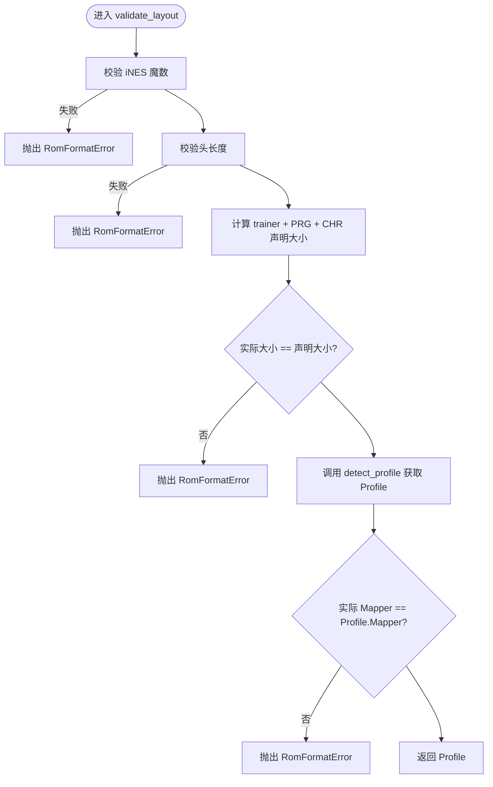
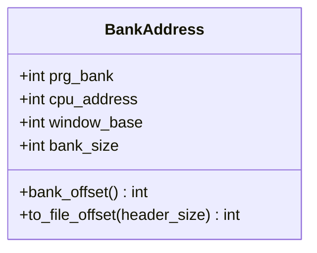
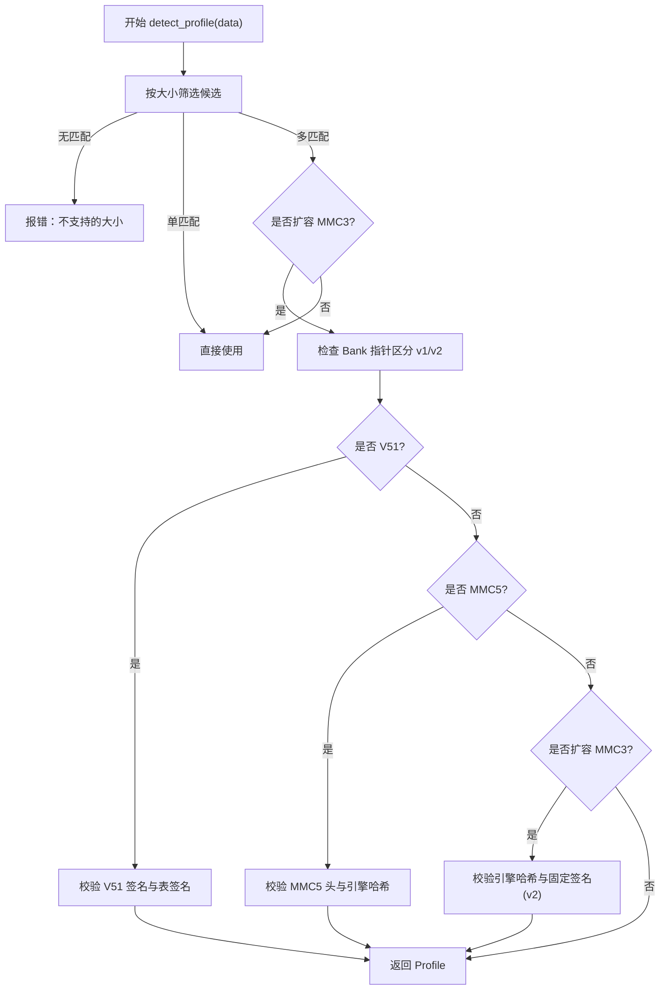
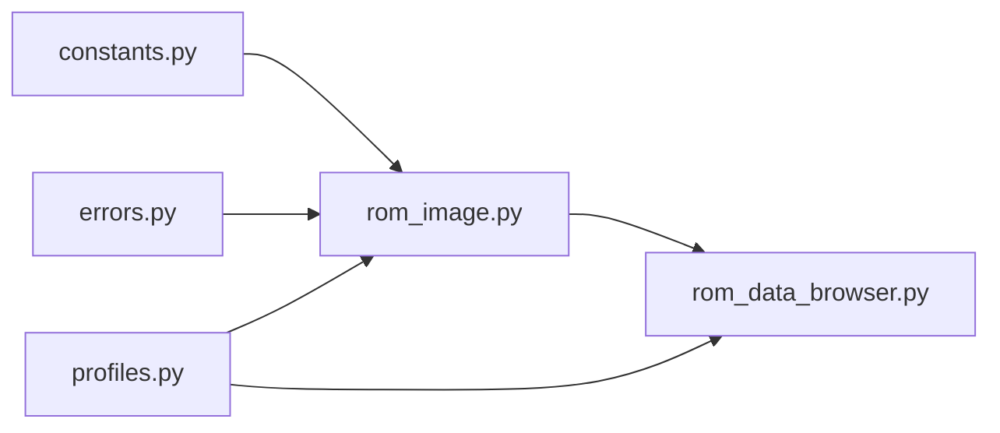

# RomImage镜像处理器

<cite>
**本文引用的文件**
- [rom_image.py](file://src/fc_editor/rom_image.py)
- [profiles.py](file://src/fc_editor/profiles.py)
- [constants.py](file://src/fc_editor/constants.py)
- [errors.py](file://src/fc_editor/errors.py)
- [rom_data_browser.py](file://src/dc_modifier/rom_data_browser.py)
</cite>

## 目录
1. [简介](#简介)
2. [项目结构](#项目结构)
3. [核心组件](#核心组件)
4. [架构总览](#架构总览)
5. [详细组件分析](#详细组件分析)
6. [依赖关系分析](#依赖关系分析)
7. [性能考量](#性能考量)
8. [故障排查指南](#故障排查指南)
9. [结论](#结论)
10. [附录：使用示例与最佳实践](#附录使用示例与最佳实践)

## 简介
本技术文档围绕 RomImage 类及其相关模块，系统阐述 ROM 镜像的读取、解析与缓存机制，涵盖文件格式验证、头部信息提取、内存映射策略；说明对多种 Mapper（如 MMC3、MMC5）的支持方式；解释 Profile 配置系统的架构，包括 ROM 版本检测、特性标志位与资源布局分析；并提供加载 ROM、获取元数据、访问原始数据的代码级路径指引。最后给出懒加载、内存管理与缓存失效等性能优化建议。

## 项目结构
RomImage 位于编辑器核心库中，负责以不可变字节视图封装 ROM，并基于 iNES 头与 Profile 进行严格校验。Profile 模块集中定义受支持的 ROM 布局、Mapper、资源区域与特征常量，并通过 detect_profile 完成版本识别与签名校验。常量模块提供 iNES 头大小、PRG Bank 大小、CPU 窗口基址等基础常量。错误类型统一在 errors 中定义。UI 侧通过 rom_data_browser 展示结构化数据与完整 HEX 视图，便于定位偏移与调试。

图表来源
- [rom_image.py:16-125](file://src/fc_editor/rom_image.py#L16-L125)
- [profiles.py:699-759](file://src/fc_editor/profiles.py#L699-L759)
- [rom_data_browser.py:410-535](file://src/dc_modifier/rom_data_browser.py#L410-L535)

章节来源
- [rom_image.py:1-125](file://src/fc_editor/rom_image.py#L1-L125)
- [profiles.py:1-759](file://src/fc_editor/profiles.py#L1-L759)
- [constants.py:1-69](file://src/fc_editor/constants.py#L1-L69)
- [rom_data_browser.py:1-535](file://src/dc_modifier/rom_data_browser.py#L1-L535)

## 核心组件
- RomImage：不可变的 ROM 字节容器，提供 iNES 头校验、Mapper 提取、SHA-256 指纹、参考基准比对、按偏移/Bank 的安全读取。
- BankAddress：将 CPU 地址与 PRG Bank 配对，计算 bank_offset 与 to_file_offset，确保地址落在指定窗口内。
- mapper_number：从 iNES 头提取 Mapper 编号。
- detect_profile：根据 ROM 大小、固定头、关键 Bank 哈希或指针值匹配具体 Profile，并进行扩展签名校验。
- RomProfile：描述单个 ROM 版本的完整布局，包含单元/武器/地图/剧情文本/事件/音乐/触发器等资源的 Bank、窗口、指针表与范围。
- constants：定义 INES_HEADER_SIZE、PRG_BANK_SIZE、CPU_BANK_BASE 及各版本期望值与认证边界。
- errors：定义 RomFormatError 等异常类型。

章节来源
- [rom_image.py:16-125](file://src/fc_editor/rom_image.py#L16-L125)
- [profiles.py:276-759](file://src/fc_editor/profiles.py#L276-L759)
- [constants.py:1-69](file://src/fc_editor/constants.py#L1-L69)
- [errors.py:1-11](file://src/fc_editor/errors.py#L1-L11)

## 架构总览
RomImage 作为入口，先执行 iNES 格式与长度校验，再调用 detect_profile 确定 ROM 版本与布局，随后暴露只读接口供上层 codec/工具使用。Profile 定义了不同 ROM 的资源布局与保护区域，使同一套编辑逻辑可适配多个版本。UI 层通过 rom_data_browser 直接读取 working 镜像，构建结构化表格与 HEX 视图，辅助定位与验证。

图表来源
- [rom_image.py:53-125](file://src/fc_editor/rom_image.py#L53-L125)
- [profiles.py:699-759](file://src/fc_editor/profiles.py#L699-L759)

## 详细组件分析

### RomImage：ROM 镜像与安全读取
- 构造与加载
  - __init__：保存原始字节、可选路径，并立即执行 validate_layout 得到 profile。
  - load：从路径读取全部字节并构造实例。
- 元数据
  - size：返回总字节数。
  - mapper：通过 mapper_number 从 iNES 头提取 Mapper。
  - sha256：计算整个 ROM 的 SHA-256。
  - is_reference_base：与 profile.reference_sha256 比较，判断是否为已验证基准版。
- 布局校验
  - validate_layout：检查魔数、头长、trainer 大小、声明的 PRG/CHR 容量与实际一致；调用 detect_profile 获取 profile；校验实际 Mapper 与 profile.mapper 一致。
- 安全读取
  - require_reference_base：若要求必须为基准版则进行断言。
  - read：边界检查后切片返回。
  - read_bank：基于 BankAddress 计算文件偏移，限制不跨越 Bank 边界。

图表来源
- [rom_image.py:79-105](file://src/fc_editor/rom_image.py#L79-L105)

章节来源
- [rom_image.py:16-125](file://src/fc_editor/rom_image.py#L16-L125)
- [errors.py:1-11](file://src/fc_editor/errors.py#L1-L11)

### BankAddress：CPU 地址到文件偏移映射
- 字段
  - prg_bank：PRG Bank 索引。
  - cpu_address：CPU 地址。
  - window_base：窗口基址（默认 CPU_BANK_BASE）。
  - bank_size：Bank 大小（默认 PRG_BANK_SIZE）。
- 行为
  - __post_init__：校验 prg_bank 非负、bank_size 正数、cpu_address 在窗口范围内。
  - bank_offset：计算相对窗口的偏移。
  - to_file_offset：结合 header_size、prg_bank、bank_size 与 bank_offset 计算文件偏移。

图表来源
- [rom_image.py:22-48](file://src/fc_editor/rom_image.py#L22-L48)
- [constants.py:8-10](file://src/fc_editor/constants.py#L8-L10)

章节来源
- [rom_image.py:22-48](file://src/fc_editor/rom_image.py#L22-L48)
- [constants.py:8-10](file://src/fc_editor/constants.py#L8-L10)

### Profile 配置系统与版本检测
- RomProfile 数据结构
  - 描述 ROM 尺寸、Mapper、参考 SHA-256、各类资源指针表与数据区、故事文本组、战斗音乐、章节事件、地图触发器、保护/空闲 Bank 区域等。
  - 提供 map_storage(map_id) 快速查找地图存储区间。
- 版本支持
  - ORIGINAL_PROFILE：原版中文汉化。
  - V51_PROFILE：时空之影II V5.1（楷体）。
  - MMC5_PROFILE：DC FamiStudio MMC5（1 MiB）。
  - DC_EXPANDED_MMC3_LEGACY_PROFILE / DC_EXPANDED_MMC3_PROFILE：扩容 MMC3（1.25 MiB），含保护区域与资源池差异。
- detect_profile 流程
  - 按 ROM 大小筛选候选 Profile。
  - 针对多候选（扩容 MMC3）通过特定 Bank 指针区分 v1/v2。
  - 针对 V51/MMC5/扩容 MMC3 进行头部与关键 Bank 哈希校验，确保引擎/桥接代码未被篡改。
  - 扩容 MMC3 v2 额外校验“固定代码签名”（忽略可管理描述符）。

图表来源
- [profiles.py:699-759](file://src/fc_editor/profiles.py#L699-L759)
- [profiles.py:276-687](file://src/fc_editor/profiles.py#L276-L687)

章节来源
- [profiles.py:276-759](file://src/fc_editor/profiles.py#L276-L759)

### Mapper 支持与硬件特性
- 通过 iNES 头提取 Mapper，并与 Profile 中的 mapper 字段对比，确保一致性。
- 支持的主要 Mapper：
  - MMC3（Mapper 194）：扩容 MMC3 系列使用，具备保护 Bank 与资源池划分。
  - MMC5（Mapper 5）：FamiStudio 音频桥接与特定布局。
- 硬件特性识别：
  - 通过 Profile 的 battle_music、chapter_events、map_triggers、legacy_global_data 等字段描述硬件/游戏特性。
  - 保护区域 protected_prg_regions 与 free_prg_regions 用于限定可修改范围与预留空间。

章节来源
- [rom_image.py:67-104](file://src/fc_editor/rom_image.py#L67-L104)
- [profiles.py:519-687](file://src/fc_editor/profiles.py#L519-L687)

### UI 集成：ROM 数据浏览器
- 结构化数据页：机体、人物、武器、地图与部署、文字、动画、关卡事件，均基于 project 提供的记录与偏移生成表格。
- 完整 HEX 页：按页显示 ROM 字节，支持跳转到任意偏移，并在单元格 tooltip 中提示所在区域（PRG/CHR 等）。
- 与 RomImage 的关系：UI 层通常持有 project.working（内存镜像），但底层仍依赖 RomImage 的校验与 Profile 能力保证数据有效性。

章节来源
- [rom_data_browser.py:320-535](file://src/dc_modifier/rom_data_browser.py#L320-L535)

## 依赖关系分析
- RomImage 依赖：
  - constants：INES_HEADER_SIZE、PRG_BANK_SIZE、CPU_BANK_BASE。
  - errors：RomFormatError。
  - profiles：RomProfile、detect_profile。
- profiles 依赖：
  - constants：EXPECTED_*、DC_EXPANDED_* 等常量。
- rom_data_browser 依赖：
  - fc_editor.codecs.* 与数据库图形读取，用于构建结构化表格。

图表来源
- [rom_image.py:1-14](file://src/fc_editor/rom_image.py#L1-L14)
- [profiles.py:1-17](file://src/fc_editor/profiles.py#L1-L17)
- [rom_data_browser.py:1-31](file://src/dc_modifier/rom_data_browser.py#L1-L31)

章节来源
- [rom_image.py:1-14](file://src/fc_editor/rom_image.py#L1-L14)
- [profiles.py:1-17](file://src/fc_editor/profiles.py#L1-L17)
- [rom_data_browser.py:1-31](file://src/dc_modifier/rom_data_browser.py#L1-L31)

## 性能考量
- 懒加载
  - RomImage.load 一次性读取全部字节，适合小中型 ROM；对于超大镜像可考虑分块映射或按需读取，避免全量占用内存。
- 内存管理
  - RomImage.data 为不可变 bytes，减少拷贝开销；read/read_bank 仅做切片与边界检查，时间复杂度 O(size)。
  - BankAddress.to_file_offset 为常数时间算术运算。
- 缓存与失效
  - 当前实现未内置缓存；如需频繁访问大段数据，可在上层维护 LRU 缓存，键为 (offset, size)，注意与 RomImage 的不可变性保持一致。
  - 当 ROM 被写入或切换工程时，应使缓存失效。
- I/O 优化
  - 批量读取时尽量合并相邻请求，减少 Python 层切片次数。
  - 对只读场景可使用内存映射（mmap）替代 read_bytes，降低初始加载成本（需自行实现安全边界检查）。

[本节为通用性能建议，不直接分析具体文件]

## 故障排查指南
- 常见错误
  - “文件不是有效的 iNES ROM”：魔数或头长度不符。
  - “ROM 大小与 iNES 头不符”：声明的 PRG/CHR 容量与实际不一致。
  - “不受支持的 ROM 大小”：不在 SUPPORTED_PROFILES 列表中。
  - “该 ROM 不是已验证的布局/引擎”：关键 Bank 哈希或签名不匹配。
  - “读取范围超出 ROM”：read 越界。
  - “读取跨越了 PRG Bank 边界”：read_bank 跨 Bank。
- 定位方法
  - 使用 rom_data_browser 的完整 HEX 页跳转到报错偏移，查看所在区域与上下文。
  - 打印 RomImage.sha256 与 profile.reference_sha256 对比，确认是否基准版。
  - 检查 mapper 与 profile.mapper 是否一致。

章节来源
- [rom_image.py:79-125](file://src/fc_editor/rom_image.py#L79-L125)
- [profiles.py:699-759](file://src/fc_editor/profiles.py#L699-L759)
- [rom_data_browser.py:410-535](file://src/dc_modifier/rom_data_browser.py#L410-L535)

## 结论
RomImage 提供了安全、不可变且带强校验的 ROM 镜像抽象，配合 Profile 系统实现对多种 Mapper（MMC3、MMC5）及不同版本 ROM 的统一处理。通过 iNES 头解析、Mapper 校验、SHA-256 基准比对与保护区域约束，确保编辑过程的可重放性与安全性。UI 层的结构化与 HEX 视图进一步提升了可观测性与调试效率。建议在大规模工程中结合懒加载与缓存策略，以获得更好的性能表现。

[本节为总结性内容，不直接分析具体文件]

## 附录：使用示例与最佳实践
- 加载 ROM 文件
  - 路径：[rom_image.py:58-61](file://src/fc_editor/rom_image.py#L58-L61)
  - 说明：调用 RomImage.load(path) 返回已校验的实例。
- 获取元数据
  - 路径：[rom_image.py:63-77](file://src/fc_editor/rom_image.py#L63-L77)
  - 说明：size、mapper、sha256、is_reference_base 等属性。
- 访问原始数据
  - 路径：[rom_image.py:114-125](file://src/fc_editor/rom_image.py#L114-L125)
  - 说明：read(offset, size) 与 read_bank(address, size) 提供安全读取。
- 解析 Mapper
  - 路径：[rom_image.py:16-19](file://src/fc_editor/rom_image.py#L16-L19)
  - 说明：mapper_number(header) 从 iNES 头提取 Mapper。
- 版本检测与布局分析
  - 路径：[profiles.py:699-759](file://src/fc_editor/profiles.py#L699-L759)
  - 说明：detect_profile 根据大小、头与关键 Bank 哈希识别版本并校验。
- 结构化浏览与 HEX 查看
  - 路径：[rom_data_browser.py:410-535](file://src/dc_modifier/rom_data_browser.py#L410-L535)
  - 说明：通过 RomHexPage 与 DataSheetPage 查看 ROM 内容与结构化数据。

章节来源
- [rom_image.py:16-125](file://src/fc_editor/rom_image.py#L16-L125)
- [profiles.py:699-759](file://src/fc_editor/profiles.py#L699-L759)
- [rom_data_browser.py:410-535](file://src/dc_modifier/rom_data_browser.py#L410-L535)