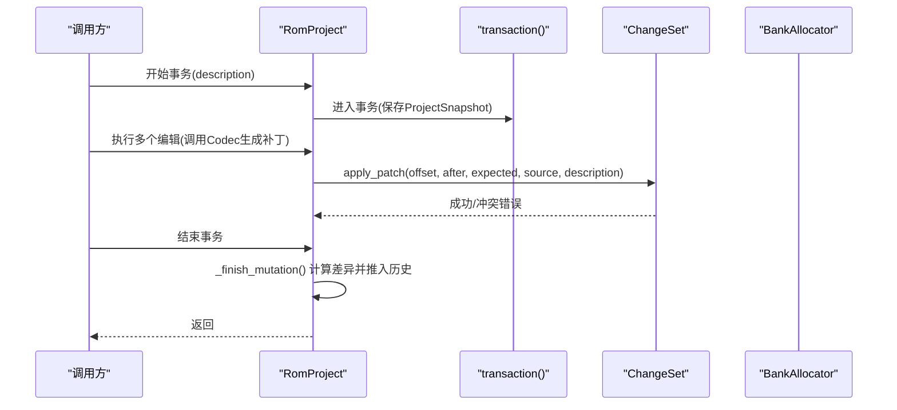
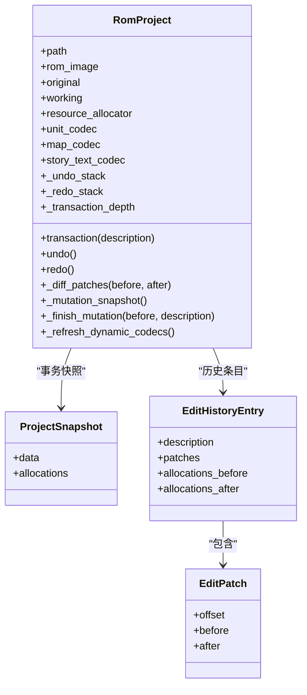
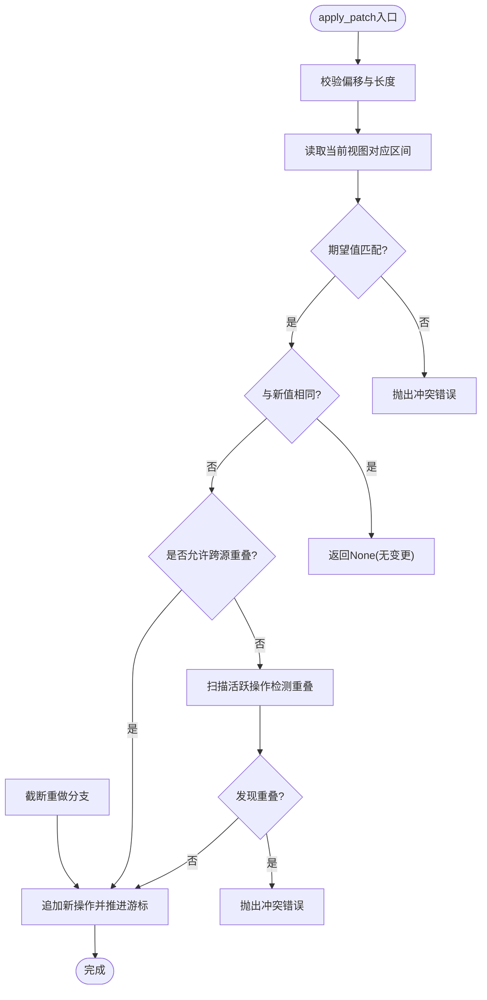
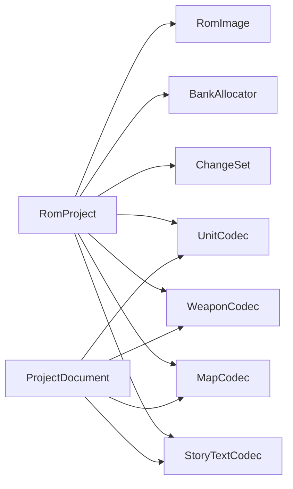

# RomProject编辑会话管理

<cite>
**本文引用的文件**
- [src/fc_rom_editor_core.py](file://src/fc_rom_editor_core.py)
- [src/fc_editor/project.py](file://src/fc_editor/project.py)
- [src/fc_editor/changes.py](file://src/fc_editor/changes.py)
</cite>

## 目录
1. [简介](#简介)
2. [项目结构](#项目结构)
3. [核心组件](#核心组件)
4. [架构总览](#架构总览)
5. [详细组件分析](#详细组件分析)
6. [依赖关系分析](#依赖关系分析)
7. [性能考量](#性能考量)
8. [故障排查指南](#故障排查指南)
9. [结论](#结论)
10. [附录：使用示例与最佳实践](#附录使用示例与最佳实践)

## 简介
本技术文档聚焦于 RomProject 类，它是 ROM 编辑会话的协调者，负责维护可撤销/重做的编辑历史、事务边界控制、资源分配以及基于变更集的差异计算。围绕 RomProject 的核心设计，本文解释其生命周期管理、状态维护策略和事务处理系统；并详细说明 EditPatch、EditHistoryEntry 和 ProjectSnapshot 数据类的设计目的与使用场景；最后给出撤销/重做机制的实现原理（含事务边界、快照管理与差异计算），并提供 transaction 上下文管理器的正确用法与复杂编辑序列的处理建议。

## 项目结构
RomProject 位于核心编辑模块中，与以下关键组件协作：
- 变更集 ChangeSet：以不可变基准镜像为基础，记录有序补丁操作，支持撤销/重做与冲突检测。
- 项目文档 ProjectDocument：持久化的“操作清单”，用于从基准 ROM 重建工作副本。
- 编解码器族：针对机体、武器、地图、剧情文本等的编解码器，提供字段级或记录级的补丁生成。
- 资源分配 BankAllocator：在扩展区域进行资源分配与冲突检查。

```mermaid
graph TB
RP["RomProject"] --> CS["ChangeSet"]
RP --> BA["BankAllocator"]
RP --> CODECS["各类Codec(机体/武器/地图/剧情等)"]
PD["ProjectDocument"] --> |materialize()| RP
RP --> |transaction()/undo()/redo()| HIST["EditHistoryEntry[]"]
HIST --> EP["EditPatch[]"]
```

图表来源
- [src/fc_rom_editor_core.py:463-785](file://src/fc_rom_editor_core.py#L463-L785)
- [src/fc_editor/changes.py:32-121](file://src/fc_editor/changes.py#L32-L121)
- [src/fc_editor/project.py:48-121](file://src/fc_editor/project.py#L48-L121)

章节来源
- [src/fc_rom_editor_core.py:463-785](file://src/fc_rom_editor_core.py#L463-L785)
- [src/fc_editor/changes.py:32-121](file://src/fc_editor/changes.py#L32-L121)
- [src/fc_editor/project.py:48-121](file://src/fc_editor/project.py#L48-L121)

## 核心组件
- RomProject：编辑会话协调者，持有原始ROM、工作副本、资源分配器、动态编解码器引用、撤销/重做栈与事务状态。
- ChangeSet：对不可变基准镜像施加有序补丁，提供 apply_patch、undo、redo、materialize 等方法，并在写入时进行范围重叠与原值校验。
- ProjectDocument：描述“如何从基准ROM构建目标ROM”的操作清单，包含资源分配、字段设置、地图替换、剧情文本替换等原子操作。
- 数据类：
  - EditPatch：表示一段字节偏移上的 before→after 差异。
  - EditHistoryEntry：一次用户可见操作的完整快照，包含描述、补丁列表及资源分配前后状态。
  - ProjectSnapshot：工作内存与资源分配的瞬时快照，用于事务回滚。

章节来源
- [src/fc_rom_editor_core.py:112-140](file://src/fc_rom_editor_core.py#L112-L140)
- [src/fc_rom_editor_core.py:463-785](file://src/fc_rom_editor_core.py#L463-L785)
- [src/fc_editor/changes.py:8-121](file://src/fc_editor/changes.py#L8-L121)
- [src/fc_editor/project.py:48-121](file://src/fc_editor/project.py#L48-L121)

## 架构总览
RomProject 通过“事务 + 变更集 + 快照”的组合实现强一致性的编辑会话：
- 事务边界：transaction() 在最外层捕获异常并回滚到事务前的 ProjectSnapshot。
- 变更集：各 Codec 将字段/记录修改转化为 PatchOperation，由 ChangeSet 统一管理与冲突检测。
- 快照与历史：每次事务提交后，比较快照与工作副本的差异，生成 EditPatch 列表并封装为 EditHistoryEntry 入栈。



图表来源
- [src/fc_rom_editor_core.py:714-744](file://src/fc_rom_editor_core.py#L714-L744)
- [src/fc_editor/changes.py:62-92](file://src/fc_editor/changes.py#L62-L92)

## 详细组件分析

### RomProject：编辑会话协调者
- 生命周期
  - 构造：加载 RomImage，复制 original 到 working，初始化资源分配器与编解码器，准备撤销/重做栈与事务状态。
  - 加载工程：load_project 读取 ProjectDocument 并通过 materialize 重建工作副本，同时恢复资源分配与扩展计划。
  - 刷新编解码器：_refresh_dynamic_codecs 根据当前 working 中的扩展计划重新绑定编解码器指针与表位置。
- 状态维护
  - 工作副本：bytearray 形式的可写镜像。
  - 资源分配：BankAllocator 跟踪已分配区域，防止冲突。
  - 动态编解码器：依据扩展标志位切换至扩展或基础版本。
- 事务处理
  - transaction(description)：最外层事务在进入时创建 ProjectSnapshot，异常时回滚 working 与资源分配器，并提交时计算差异并入历史。
  - 嵌套事务：通过深度计数保证仅最外层提交历史。
- 撤销/重做
  - undo/redo：按 EditHistoryEntry 中的 patches 与 allocations_before/after 恢复/应用状态，并刷新编解码器。



图表来源
- [src/fc_rom_editor_core.py:112-140](file://src/fc_rom_editor_core.py#L112-L140)
- [src/fc_rom_editor_core.py:463-785](file://src/fc_rom_editor_core.py#L463-L785)

章节来源
- [src/fc_rom_editor_core.py:463-785](file://src/fc_rom_editor_core.py#L463-L785)

### ChangeSet：变更集与差异计算
- 设计目的
  - 在不可变基准镜像上叠加有序补丁，支持撤销/重做与冲突检测。
- 关键行为
  - apply_patch：校验偏移与长度，可选原值校验，检测跨源写入重叠，插入新操作并截断后续重做分支。
  - materialize：按 active_operations 顺序生成当前视图。
  - undo/redo：移动游标，重做时再次校验原值一致性。
- 复杂度
  - materialize：O(N+M)，N为基准大小，M为活跃补丁数。
  - apply_patch：O(M) 扫描活跃操作检测重叠。



图表来源
- [src/fc_editor/changes.py:62-92](file://src/fc_editor/changes.py#L62-L92)

章节来源
- [src/fc_editor/changes.py:32-121](file://src/fc_editor/changes.py#L32-L121)

### ProjectDocument：项目操作清单
- 设计目的
  - 以JSON形式记录“如何从基准ROM构建目标ROM”的一系列原子操作，便于版本化与离线验证。
- 主要能力
  - load/save：读写项目文件，进行schema迁移与格式校验。
  - materialize：遍历 operations，依次应用字段设置、资源分配、地图/剧情替换等，最终输出目标ROM字节流。
  - resource_allocations：解析资源分配操作并预留区域，确保不覆盖已有数据。
- 安全与一致性
  - 每条操作均携带 expectedOld* 或 expectedOldDigest，确保并发或误用情况下的一致性。

章节来源
- [src/fc_editor/project.py:48-121](file://src/fc_editor/project.py#L48-L121)
- [src/fc_editor/project.py:400-933](file://src/fc_editor/project.py#L400-L933)

### 数据类：EditPatch、EditHistoryEntry、ProjectSnapshot
- EditPatch
  - 表示一段字节范围的差异，用于撤销/重做时的精确还原。
- EditHistoryEntry
  - 封装一次用户可见操作的完整信息：描述、补丁列表、资源分配前后状态。
- ProjectSnapshot
  - 事务边界的工作副本与资源分配快照，用于异常回滚。

章节来源
- [src/fc_rom_editor_core.py:112-140](file://src/fc_rom_editor_core.py#L112-L140)
- [src/fc_rom_editor_core.py:692-712](file://src/fc_rom_editor_core.py#L692-L712)

## 依赖关系分析
- RomProject 依赖：
  - RomImage：提供ROM元信息与只读数据。
  - BankAllocator：资源分配与冲突检查。
  - 各类Codec：生成具体字段的补丁。
  - ChangeSet：统一管理补丁与冲突检测。
- ProjectDocument 依赖：
  - 同上Codec族，用于materialize阶段生成目标ROM。
- 耦合与内聚
  - RomProject 通过 _refresh_dynamic_codecs 集中管理编解码器绑定，降低外部耦合。
  - ChangeSet 将补丁逻辑内聚，避免分散在各Codec中重复实现。



图表来源
- [src/fc_rom_editor_core.py:463-618](file://src/fc_rom_editor_core.py#L463-L618)
- [src/fc_editor/project.py:48-121](file://src/fc_editor/project.py#L48-L121)

章节来源
- [src/fc_rom_editor_core.py:463-618](file://src/fc_rom_editor_core.py#L463-L618)
- [src/fc_editor/project.py:48-121](file://src/fc_editor/project.py#L48-L121)

## 性能考量
- 差异计算
  - _diff_patches 采用线性扫描，时间复杂度 O(N)，空间复杂度 O(K)（K为差异块数量）。
- 变更集
  - materialize 需要拷贝基准并应用活跃补丁，适合小批量高频更新；大量补丁时应合理合并或分事务。
- 资源分配
  - BankAllocator 在事务提交时参与快照，频繁分配可能带来额外开销；建议在事务内批量分配。
- 编解码器刷新
  - _refresh_dynamic_codecs 在撤销/重做后触发，避免重复绑定；仅在必要时刷新。

[本节为通用性能讨论，不直接分析具体代码行]

## 故障排查指南
- 常见错误
  - 原值不匹配：ChangeSet.apply_patch 的 expected 校验失败，提示“原值不匹配”。
  - 写入范围重叠：不同源的补丁写入重叠区域，抛出冲突错误。
  - 事务异常回滚：transaction 内部抛错时，RomProject 会恢复到事务前快照。
  - 工程完整性失败：load_project 完成后若存在严重错误，会抛出格式化错误。
- 定位方法
  - 查看 undo_description/redo_description 获取最近操作描述。
  - 检查 ChangeSet.is_dirty 与 byte_diffs 定位差异。
  - 核对 ProjectDocument 的 expectedOld* 字段与实际ROM内容是否一致。

章节来源
- [src/fc_editor/changes.py:62-108](file://src/fc_editor/changes.py#L62-L108)
- [src/fc_rom_editor_core.py:714-785](file://src/fc_rom_editor_core.py#L714-L785)
- [src/fc_rom_editor_core.py:644-674](file://src/fc_rom_editor_core.py#L644-L674)

## 结论
RomProject 通过“事务 + 变更集 + 快照”的体系，提供了稳健的编辑会话管理能力。EditPatch、EditHistoryEntry 与 ProjectSnapshot 分别承担差异表达、历史封装与事务回滚的职责；ChangeSet 则保证了补丁的一致性与可逆性。结合 ProjectDocument 的持久化能力，系统既支持在线交互式编辑，也支持离线批处理与版本化管理。

[本节为总结性内容，不直接分析具体代码行]

## 附录：使用示例与最佳实践
- 正确使用 transaction 上下文管理器
  - 将一组相关的编辑操作包裹在 transaction(description) 中，确保要么全部成功，要么整体回滚。
  - 示例路径参考：
    - [事务定义与回滚:714-744](file://src/fc_rom_editor_core.py#L714-L744)
    - [历史提交与差异计算:692-712](file://src/fc_rom_editor_core.py#L692-L712)
- 复杂编辑操作序列
  - 先读取当前状态（如通过 Codec 解码），再基于 expectedOld* 生成补丁，最后通过 ChangeSet.apply_patch 应用。
  - 示例路径参考：
    - [字段设置与补丁应用:540-600](file://src/fc_editor/project.py#L540-L600)
    - [地图/剧情替换与摘要校验:705-858](file://src/fc_editor/project.py#L705-L858)
- 错误处理与恢复
  - 捕获 ProjectFormatError 与 ChangeConflictError，提示用户修正输入或调整操作顺序。
  - 利用 undo/redo 快速回到稳定状态。
  - 示例路径参考：
    - [撤销/重做实现:761-785](file://src/fc_rom_editor_core.py#L761-L785)
    - [变更集冲突与重做保护:89-108](file://src/fc_editor/changes.py#L89-L108)

章节来源
- [src/fc_rom_editor_core.py:692-785](file://src/fc_rom_editor_core.py#L692-L785)
- [src/fc_editor/project.py:540-858](file://src/fc_editor/project.py#L540-L858)
- [src/fc_editor/changes.py:62-108](file://src/fc_editor/changes.py#L62-L108)