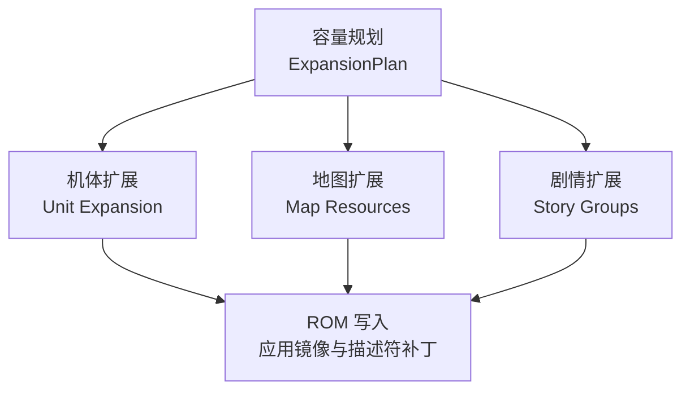
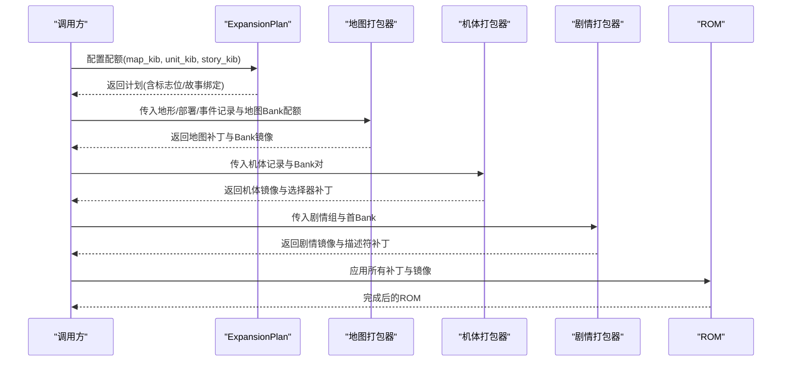
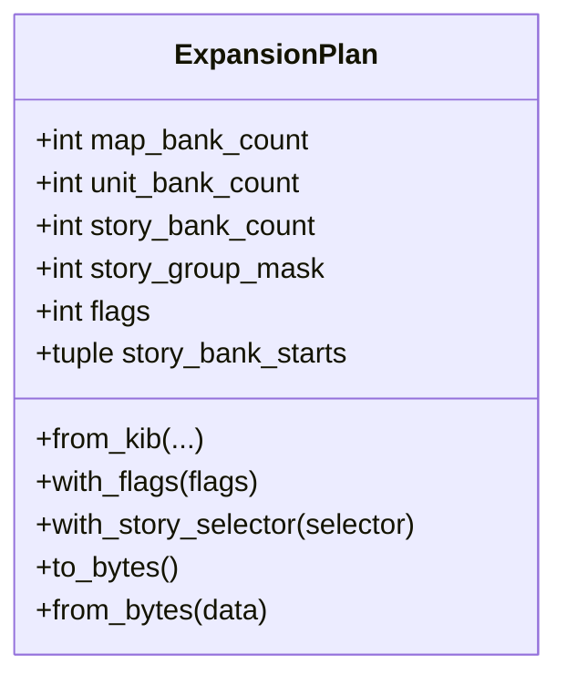
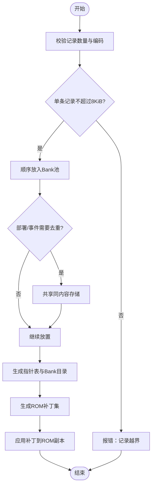
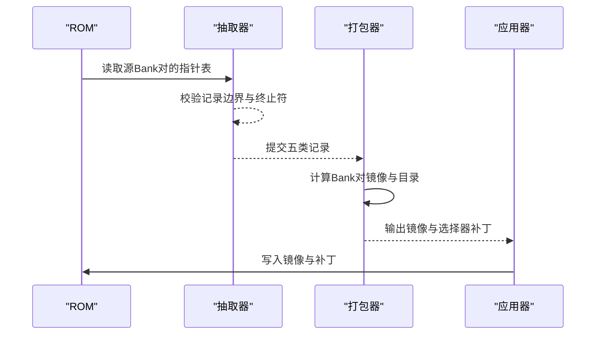
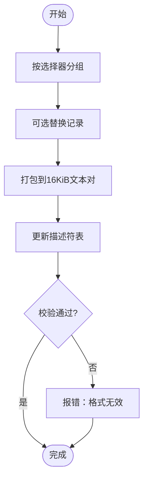
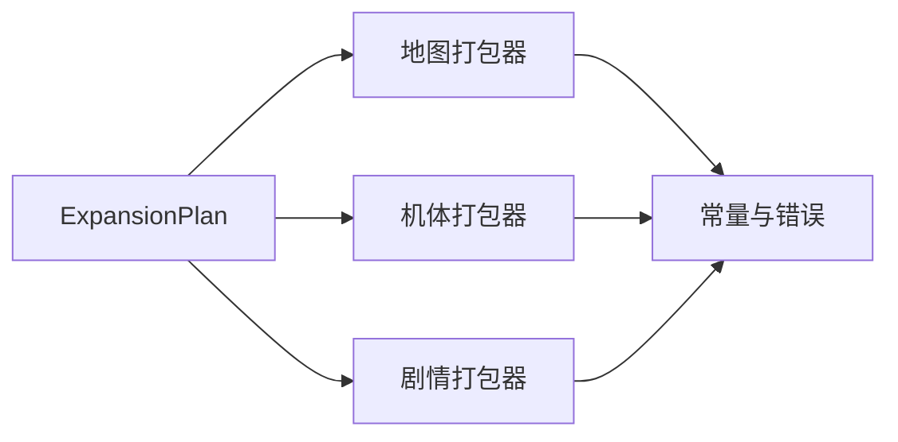

# 扩展系统ExpansionPlan

<cite>
**本文引用的文件**
- [expansion.py](file://src/fc_editor/expansion.py)
- [expansion_unit.py](file://src/fc_editor/expansion_unit.py)
- [expansion_map.py](file://src/fc_editor/expansion_map.py)
- [expansion_story.py](file://src/fc_editor/expansion_story.py)
- [test_expansion_integration.py](file://tests/test_expansion_integration.py)
- [test_expansion_unit.py](file://tests/test_expansion_unit.py)
</cite>

## 目录
1. [简介](#简介)
2. [项目结构](#项目结构)
3. [核心组件](#核心组件)
4. [架构总览](#架构总览)
5. [详细组件分析](#详细组件分析)
6. [依赖关系分析](#依赖关系分析)
7. [性能考量](#性能考量)
8. [故障排查指南](#故障排查指南)
9. [结论](#结论)
10. [附录](#附录)

## 简介
本技术文档围绕 ExpansionPlan 及相关扩展子系统，系统性说明容量规划表的结构设计、标志位定义、Bank 分配与分区管理机制；阐述扩展数据的存储格式（元数据区域、资源描述符表、数据负载）；解释机体、地图、剧情三类扩展的数据提取、重组与打包流程；并提供创建、修改与验证扩展计划的实践路径。同时给出兼容性处理策略，包括向后兼容与版本升级机制。

## 项目结构
扩展系统由四个核心模块构成：
- 容量规划与元数据：负责 464 KiB 可用池的配额划分、标志位、故事组绑定与序列化/反序列化。
- 机体扩展：抽取并重新打包 255 条机体资源（属性、名称、战斗外观、主体/碎片脚本），生成运行时镜像与选择器补丁。
- 地图扩展：将地形、部署、事件/商店三类记录打包进共享 Bank 池，并注入调度 Hook 与指针表。
- 剧情扩展：按已验证的剧情选择器分组，独立打包到 16 KiB 文本对，更新固定 Bank 中的描述符。

**图表来源**
- [expansion.py:84-318](file://src/fc_editor/expansion.py#L84-L318)
- [expansion_unit.py:540-800](file://src/fc_editor/expansion_unit.py#L540-L800)
- [expansion_map.py:174-418](file://src/fc_editor/expansion_map.py#L174-L418)
- [expansion_story.py:175-297](file://src/fc_editor/expansion_story.py#L175-L297)

**章节来源**
- [expansion.py:84-318](file://src/fc_editor/expansion.py#L84-L318)
- [expansion_unit.py:540-800](file://src/fc_editor/expansion_unit.py#L540-L800)
- [expansion_map.py:174-418](file://src/fc_editor/expansion_map.py#L174-L418)
- [expansion_story.py:175-297](file://src/fc_editor/expansion_story.py#L175-L297)

## 核心组件
- ExpansionPlan：不可变容量计划对象，维护地图/机体/剧情配额、故事组掩码、标志位与故事 Bank 绑定表；提供从字节序列构建与序列化能力。
- 地图资源打包：将地形、部署、事件/商店记录放入共享 Bank 池，生成指针表与 Bank 目录，并产出 ROM 补丁集。
- 机体资源打包：抽取 255 条机体资源，重排至受控 Bank 对，生成资源布局与选择器补丁，支持 48/64/80 KiB 三种规模。
- 剧情资源打包：按选择器分组，独立打包为 16 KiB 文本对，更新固定 Bank $7F 的描述符表。

**章节来源**
- [expansion.py:84-318](file://src/fc_editor/expansion.py#L84-L318)
- [expansion_map.py:174-418](file://src/fc_editor/expansion_map.py#L174-L418)
- [expansion_unit.py:540-800](file://src/fc_editor/expansion_unit.py#L540-L800)
- [expansion_story.py:175-297](file://src/fc_editor/expansion_story.py#L175-L297)

## 架构总览
扩展系统以 ExpansionPlan 为中心，协调三类资源的配额与 Bank 分配，并通过各自打包器生成 ROM 级补丁与镜像，最终统一应用到目标 ROM。

**图表来源**
- [expansion.py:130-175](file://src/fc_editor/expansion.py#L130-L175)
- [expansion_map.py:174-418](file://src/fc_editor/expansion_map.py#L174-L418)
- [expansion_unit.py:540-800](file://src/fc_editor/expansion_unit.py#L540-L800)
- [expansion_story.py:232-297](file://src/fc_editor/expansion_story.py#L232-L297)

## 详细组件分析

### 容量规划表与标志位
- 容量单位与配额约束：
  - 地图与机体配额必须为 8 KiB 整数倍；剧情配额必须为 16 KiB 整数倍。
  - 总配额不得超过可用池大小（464 KiB）。
  - 机体配额仅支持 48/64/80 KiB（对应 6/8/10 个 Bank）。
  - 剧情最多支持 7 个已验证文本组，每组占用 16 KiB（一对 Bank）。
- 标志位：
  - 地图启用、机体启用、场景启用、地图事件启用等标志用于控制扩展范围。
- 故事组绑定：
  - 通过故事组掩码与绑定表共同决定哪些剧情组被搬移以及对应的首 Bank。
  - 绑定表长度与掩码必须一致，且每个组只能绑定到一个 Bank 对。
- 元数据序列化：
  - 使用固定魔数与版本号，附带 CRC 校验，确保跨版本读取安全。
  - 保留字段用于未来扩展，解析时严格检查。

**图表来源**
- [expansion.py:84-318](file://src/fc_editor/expansion.py#L84-L318)

**章节来源**
- [expansion.py:84-318](file://src/fc_editor/expansion.py#L84-L318)

### 地图扩展：数据结构、打包与链接
- 数据结构：
  - 地形、部署、事件/商店三类记录分别有固定数量与编码规范。
  - 打包结果包含 Bank 镜像、指针表、Bank 目录与已用字节统计。
- 打包算法：
  - 顺序填充各记录，单条记录不得跨越 8 KiB Bank。
  - 部署与事件记录在类型内部去重，保持与原版别名语义一致。
- 链接过程：
  - 校验源 ROM 的关键位置是否匹配原版或已安装扩展。
  - 写入 Bank 镜像、指针表、Bank 目录与 Hook 代码。
  - 输出原子补丁集，应用前再次校验原始字节，避免并发冲突。

**图表来源**
- [expansion_map.py:174-418](file://src/fc_editor/expansion_map.py#L174-L418)

**章节来源**
- [expansion_map.py:174-418](file://src/fc_editor/expansion_map.py#L174-L418)

### 机体扩展：资源抽取、重组与打包
- 资源族：
  - 属性、名称、战斗外观、主体拼图、碎片拼图五类资源。
  - 每条记录具有固定长度或终止符约定，需严格校验。
- 抽取流程：
  - 从受信任的源 Bank 对读取指针表，按边界限制提取记录。
  - 名称与脚本类记录需满足终止符与边界要求。
- 重组与打包：
  - 根据配额选择 48/64/80 KiB 的 Bank 对组合。
  - 将资源重排到新的 Bank 镜像，更新选择器描述符指向新目录。
  - 生成资源布局，便于后续查询与验证。

**图表来源**
- [expansion_unit.py:333-385](file://src/fc_editor/expansion_unit.py#L333-L385)
- [expansion_unit.py:540-800](file://src/fc_editor/expansion_unit.py#L540-L800)

**章节来源**
- [expansion_unit.py:333-385](file://src/fc_editor/expansion_unit.py#L333-L385)
- [expansion_unit.py:540-800](file://src/fc_editor/expansion_unit.py#L540-L800)

### 剧情扩展：分组、打包与描述符更新
- 分组模型：
  - 按已验证的选择器分组，保留指针别名关系。
  - 每个逻辑组可独立替换记录，并保持别名一致性。
- 打包流程：
  - 将一组记录压缩进 16 KiB 文本对，写入指针表。
  - 更新固定 Bank $7F 中的描述符，使运行时直接定位到新 pair。
- 校验规则：
  - 文本记录必须以独立 $FF 结尾，且不允许有多余字节。
  - 指针必须在受保护的数据区间内。

**图表来源**
- [expansion_story.py:175-297](file://src/fc_editor/expansion_story.py#L175-L297)

**章节来源**
- [expansion_story.py:175-297](file://src/fc_editor/expansion_story.py#L175-L297)

### 扩展数据存储格式
- 元数据区域：
  - 位于固定偏移，包含魔数、版本、配额、掩码、标志位与故事绑定表。
  - 附带 CRC 校验，解析失败则拒绝加载。
- 资源描述符表：
  - 位于固定 Bank $7F，记录各资源族的目录索引与首 Bank。
  - 机体与剧情扩展均会更新该表以指向新镜像。
- 数据负载：
  - 地图：共享 Bank 池内的地形/部署/事件记录。
  - 机体：五类资源按 Bank 对镜像组织，带指针表。
  - 剧情：每选择器一个 16 KiB pair，内含指针表与文本负载。

**章节来源**
- [expansion.py:277-318](file://src/fc_editor/expansion.py#L277-L318)
- [expansion_unit.py:19-30](file://src/fc_editor/expansion_unit.py#L19-L30)
- [expansion_story.py:21-25](file://src/fc_editor/expansion_story.py#L21-L25)
- [expansion_map.py:126-145](file://src/fc_editor/expansion_map.py#L126-L145)

### 不同扩展类型的处理流程
- 地图：
  - 输入：地形/部署/事件记录与地图 Bank 配额。
  - 处理：校验、去重、顺序打包、生成指针表与 Bank 目录、注入 Hook。
  - 输出：ROM 补丁集与 Bank 镜像。
- 机体：
  - 输入：五类机体记录与 Bank 对。
  - 处理：抽取、校验、重组、生成镜像与选择器补丁。
  - 输出：镜像与补丁，供应用器写入 ROM。
- 剧情：
  - 输入：选择器与首 Bank。
  - 处理：分组、替换、打包到 16 KiB pair、更新描述符。
  - 输出：镜像与描述符补丁。

**章节来源**
- [expansion_map.py:174-418](file://src/fc_editor/expansion_map.py#L174-L418)
- [expansion_unit.py:540-800](file://src/fc_editor/expansion_unit.py#L540-L800)
- [expansion_story.py:232-297](file://src/fc_editor/expansion_story.py#L232-L297)

### 创建、修改与验证扩展计划的示例路径
- 创建计划：
  - 使用配额构造方法指定地图/机体/剧情容量，自动计算 Bank 分配与故事绑定。
  - 可通过标志位控制启用范围。
- 修改计划：
  - 动态添加剧情组绑定，若配额不足则抛出错误。
  - 调整标志位以启用/禁用特定扩展。
- 验证计划：
  - 序列化后反序列化，校验魔数、版本与 CRC。
  - 结合项目验证接口检查完整性与冲突。

**章节来源**
- [expansion.py:130-175](file://src/fc_editor/expansion.py#L130-L175)
- [expansion.py:229-275](file://src/fc_editor/expansion.py#L229-L275)
- [expansion.py:277-318](file://src/fc_editor/expansion.py#L277-L318)
- [test_expansion_integration.py:45-73](file://tests/test_expansion_integration.py#L45-L73)

### 兼容性处理策略
- 向后兼容：
  - 元数据包含魔数与版本，解析时严格检查保留字段，未知版本拒绝加载。
  - 地图扩展允许源 ROM 处于原版或已安装扩展状态，兼容二次链接。
- 版本升级：
  - 通过预留字段与 CRC 校验保证未来扩展的平滑过渡。
  - 项目层在保存与发布时进行完整性校验，阻止损坏产物输出。

**章节来源**
- [expansion.py:277-318](file://src/fc_editor/expansion.py#L277-L318)
- [expansion_map.py:262-311](file://src/fc_editor/expansion_map.py#L262-L311)
- [test_expansion_integration.py:421-431](file://tests/test_expansion_integration.py#L421-L431)

## 依赖关系分析
- 模块耦合：
  - ExpansionPlan 与各打包器解耦，通过配额与 Bank 列表传递上下文。
  - 地图、机体、剧情打包器各自管理自身资源布局与补丁，互不干扰。
- 外部依赖：
  - 常量定义（INES 头大小、Bank 大小、记录大小）来自公共常量模块。
  - 错误类型统一使用自定义异常，便于上层捕获与报告。

**图表来源**
- [expansion.py:84-318](file://src/fc_editor/expansion.py#L84-L318)
- [expansion_map.py:1-25](file://src/fc_editor/expansion_map.py#L1-L25)
- [expansion_unit.py:1-30](file://src/fc_editor/expansion_unit.py#L1-L30)
- [expansion_story.py:1-25](file://src/fc_editor/expansion_story.py#L1-L25)

**章节来源**
- [expansion.py:84-318](file://src/fc_editor/expansion.py#L84-L318)
- [expansion_map.py:1-25](file://src/fc_editor/expansion_map.py#L1-L25)
- [expansion_unit.py:1-30](file://src/fc_editor/expansion_unit.py#L1-L30)
- [expansion_story.py:1-25](file://src/fc_editor/expansion_story.py#L1-L25)

## 性能考量
- 打包效率：
  - 地图记录顺序填充，避免频繁内存移动；部署与事件类型内去重减少冗余。
  - 机体资源按 Bank 对镜像组织，指针表一次性写入，降低随机访问开销。
- 校验成本：
  - 批量校验指针表与记录边界，提前发现非法数据，避免后续阶段失败。
- 内存占用：
  - 使用不可变数据结构承载计划与布局，减少拷贝与副作用。
  - 补丁集有序合并，避免重叠写导致的额外处理。

[本节为通用指导，不直接分析具体文件]

## 故障排查指南
- 常见错误：
  - 配额越界：地图/机体/剧情配额超出可用池或不符合对齐要求。
  - 记录为空或超长：单条记录超过 8 KiB 或编码不完整。
  - 指针表损坏：ID $00 非空指针或指针越界。
  - 描述符变化：活动描述符已被其他修改覆盖，导致应用失败。
- 诊断步骤：
  - 检查 ExpansionPlan 序列化/反序列化是否通过。
  - 验证地图/机体/剧情记录的编码与边界。
  - 确认 ROM 关键位置是否匹配原版或已安装扩展。
  - 查看项目验证报告，定位错误模块与消息。

**章节来源**
- [expansion.py:277-318](file://src/fc_editor/expansion.py#L277-L318)
- [expansion_map.py:262-311](file://src/fc_editor/expansion_map.py#L262-L311)
- [expansion_unit.py:233-265](file://src/fc_editor/expansion_unit.py#L233-L265)
- [test_expansion_integration.py:179-221](file://tests/test_expansion_integration.py#L179-L221)

## 结论
ExpansionPlan 提供了确定性的 464 KiB 容量分割方案，配合地图、机体、剧情三类扩展的打包与链接机制，实现了安全、可验证的 ROM 扩容。通过严格的校验与兼容性策略，系统在多版本与多次编辑场景下保持稳定。建议在实际使用中遵循配额对齐、记录编码与指针边界规范，充分利用自动化校验与报告工具，确保扩展产物质量。

[本节为总结性内容，不直接分析具体文件]

## 附录
- 关键常量与偏移：
  - 地图调度器与指针表偏移、Hook 地址。
  - 机体资源选择器与描述符表偏移。
  - 剧情文本组数据区间与描述符表偏移。
- 测试用例参考：
  - 端到端集成测试验证推荐分割、语义保持与错误拦截。
  - 机体打包测试覆盖 48/64/80 KiB 全量 ID 往返与校验。

**章节来源**
- [expansion_map.py:19-68](file://src/fc_editor/expansion_map.py#L19-L68)
- [expansion_unit.py:19-66](file://src/fc_editor/expansion_unit.py#L19-L66)
- [expansion_story.py:12-25](file://src/fc_editor/expansion_story.py#L12-L25)
- [test_expansion_integration.py:45-73](file://tests/test_expansion_integration.py#L45-L73)
- [test_expansion_unit.py:89-145](file://tests/test_expansion_unit.py#L89-L145)