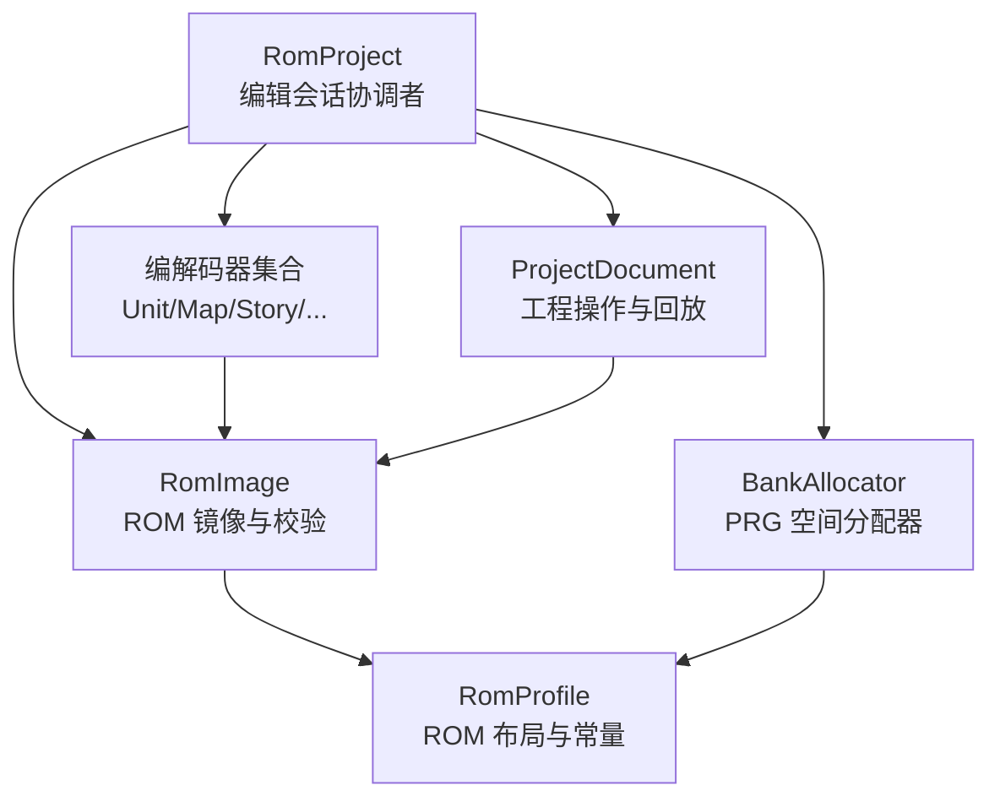
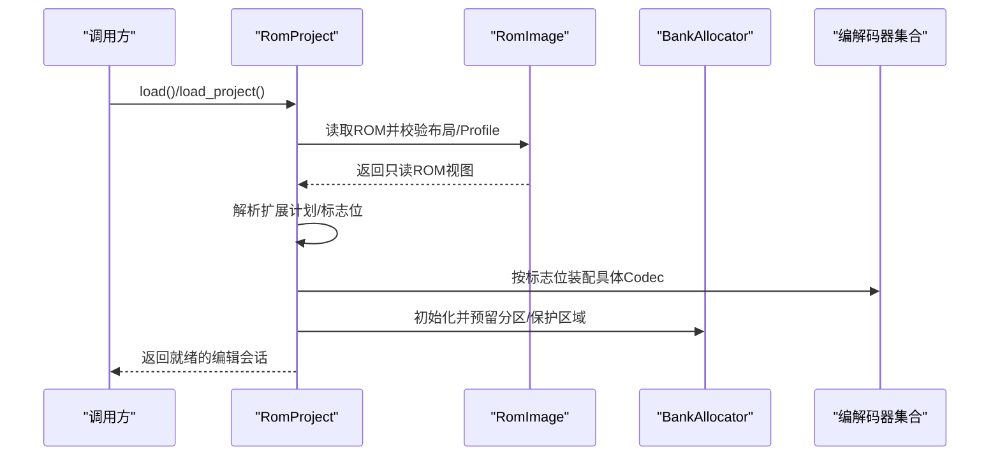
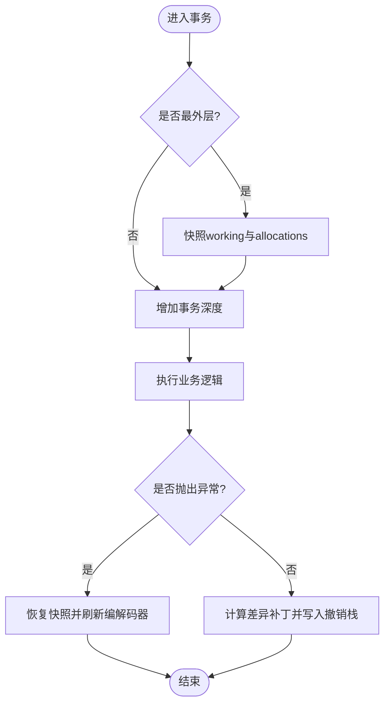
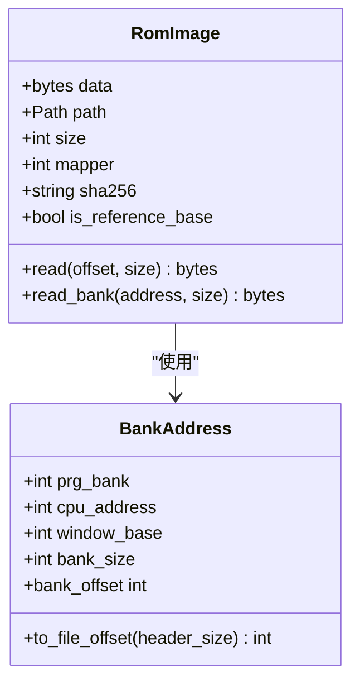
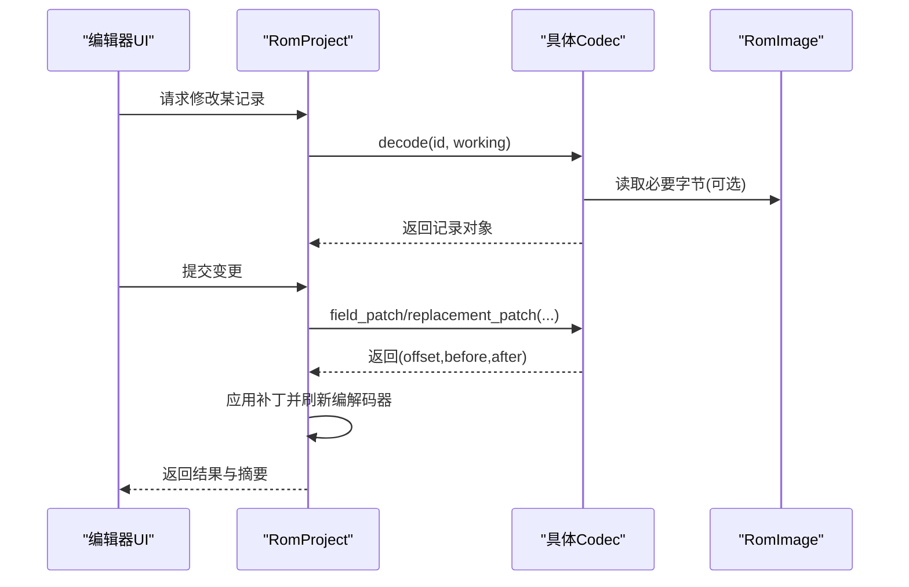
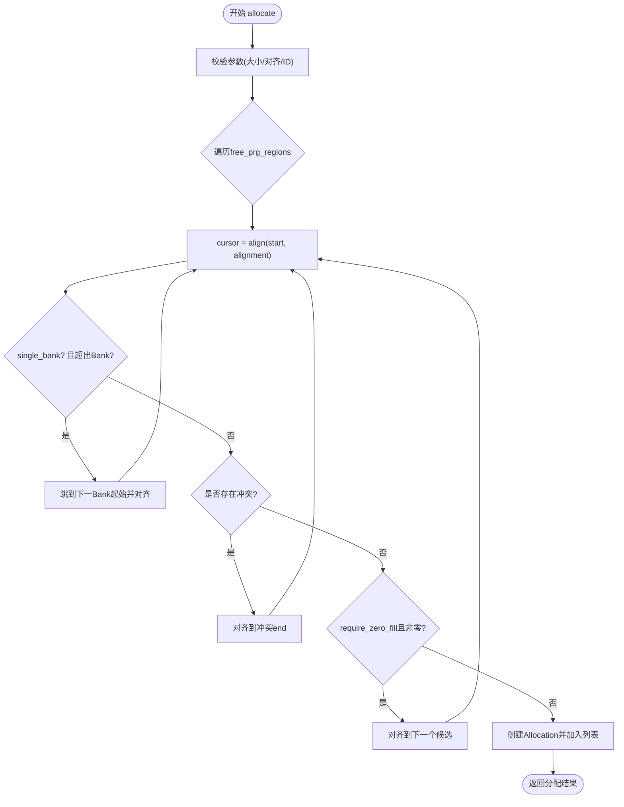
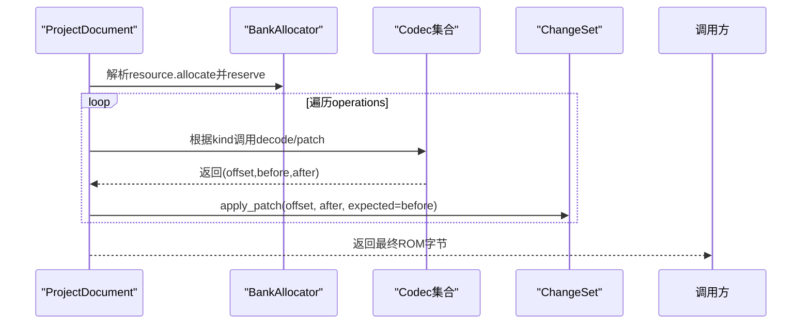
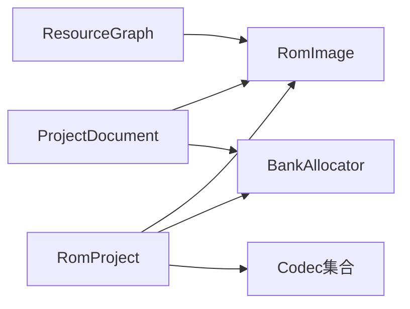

# 核心组件设计

<cite>
**本文引用的文件**
- [src/fc_rom_editor_core.py](file://src/fc_rom_editor_core.py)
- [src/fc_editor/project.py](file://src/fc_editor/project.py)
- [src/fc_editor/rom_image.py](file://src/fc_editor/rom_image.py)
- [src/fc_editor/resources.py](file://src/fc_editor/resources.py)
</cite>

## 目录
1. [简介](#简介)
2. [项目结构](#项目结构)
3. [核心组件](#核心组件)
4. [架构总览](#架构总览)
5. [详细组件分析](#详细组件分析)
6. [依赖关系分析](#依赖关系分析)
7. [性能考量](#性能考量)
8. [故障排查指南](#故障排查指南)
9. [结论](#结论)
10. [附录](#附录)

## 简介
本设计文档面向 DC 修改器的核心子系统，围绕以下目标展开：
- RomProject 作为编辑会话协调者：生命周期管理、状态维护与事务处理机制。
- RomImage 处理器：ROM 镜像的读写、格式校验、内存映射与访问边界控制。
- 编解码器系统：Codec 接口规范、数据格式转换流程与扩展机制（以现有具体 Codec 为例）。
- 资源分配器 BankAllocator：Bank 空间管理算法、冲突检测与优化策略。
- 通过组件交互图与时序图说明关键业务流程的实现细节。

## 项目结构
DC 修改器采用分层组织方式：
- 顶层入口与协调层：RomProject 负责加载 ROM、初始化编解码器、资源分配器、事务与撤销重做栈。
- 数据与模型层：RomImage 提供只读 ROM 视图与地址到文件偏移的映射；project.py 中的 ProjectDocument 描述可持久化的工程操作。
- 资源与分配层：resources.py 定义资源节点、引用图与 BankAllocator，用于 PRG 空间的确定性分配与冲突检测。
- 编解码器层：fc_editor/codecs 下按数据类型划分的具体编解码实现（如 UnitCodec、MapCodec、StoryTextCodec 等），由 RomProject 在启动时按需装配。

图表来源
- [src/fc_rom_editor_core.py:463-624](file://src/fc_rom_editor_core.py#L463-L624)
- [src/fc_editor/rom_image.py:50-125](file://src/fc_editor/rom_image.py#L50-L125)
- [src/fc_editor/resources.py:280-413](file://src/fc_editor/resources.py#L280-L413)
- [src/fc_editor/project.py:48-121](file://src/fc_editor/project.py#L48-L121)

章节来源
- [src/fc_rom_editor_core.py:463-624](file://src/fc_rom_editor_core.py#L463-L624)
- [src/fc_editor/rom_image.py:50-125](file://src/fc_editor/rom_image.py#L50-L125)
- [src/fc_editor/resources.py:280-413](file://src/fc_editor/resources.py#L280-L413)
- [src/fc_editor/project.py:48-121](file://src/fc_editor/project.py#L48-L121)

## 核心组件
- RomProject：封装一次编辑会话的全部上下文，包括原始 ROM、工作副本、初始扩展计划、各类编解码器实例、资源分配器、撤销/重做栈与事务深度。
- RomImage：不可变 ROM 字节容器，提供 iNES 头校验、Mapper 识别、SHA-256 校验、安全读取与 Bank 级读取。
- BankAllocator：基于 Profile 声明的可用 PRG 区域进行确定性分配，支持对齐、单 Bank 约束、零填充检查与冲突检测。
- ProjectDocument：记录对基准 ROM 的可回放操作（字段设置、指针替换、地图/场景替换、资源分配等），并能在加载时验证与重放。

章节来源
- [src/fc_rom_editor_core.py:463-624](file://src/fc_rom_editor_core.py#L463-L624)
- [src/fc_editor/rom_image.py:50-125](file://src/fc_editor/rom_image.py#L50-L125)
- [src/fc_editor/resources.py:280-413](file://src/fc_editor/resources.py#L280-L413)
- [src/fc_editor/project.py:48-121](file://src/fc_editor/project.py#L48-L121)

## 架构总览
RomProject 在构造阶段完成：
- 加载 RomImage 并解析扩展计划（ExpansionPlan）。
- 根据 Profile 与扩展标志位装配各类型编解码器（机体、武器、地图、剧情文本等）。
- 初始化 BankAllocator 并预留分区与重入保护区域。
- 建立指针表缓存与动态编解码器刷新钩子。
- 初始化事务与撤销/重做栈。

图表来源
- [src/fc_rom_editor_core.py:463-624](file://src/fc_rom_editor_core.py#L463-L624)
- [src/fc_editor/rom_image.py:50-125](file://src/fc_editor/rom_image.py#L50-L125)
- [src/fc_editor/resources.py:280-413](file://src/fc_editor/resources.py#L280-L413)

## 详细组件分析

### RomProject：编辑会话协调者
- 生命周期管理
  - 构造：创建 RomImage、复制原始数据与工作副本、解析扩展计划、装配编解码器、初始化资源分配器与撤销栈。
  - 加载工程：从 ProjectDocument 恢复工作 ROM 与资源分配，重新装配编解码器并执行完整性校验。
- 状态维护
  - 指针表缓存：unit_codec.pointers / ids_by_pointer 等，加速 ID 与指针互查。
  - 动态编解码器刷新：当底层 ROM 或分配变化后，更新相关编解码器视图。
- 事务处理机制
  - transaction(description)：外层事务在进入时快照 working 与 allocations，异常时回滚至快照；成功退出时生成差异补丁并推入撤销栈，清空重做栈。
  - undo/redo：应用/回退 EditPatch，重建 BankAllocator 并刷新编解码器。
  - 撤销/重做条目包含描述、字节补丁、分配前后快照，确保可逆性与一致性。

图表来源
- [src/fc_rom_editor_core.py:714-744](file://src/fc_rom_editor_core.py#L714-L744)
- [src/fc_rom_editor_core.py:692-713](file://src/fc_rom_editor_core.py#L692-L713)
- [src/fc_rom_editor_core.py:761-785](file://src/fc_rom_editor_core.py#L761-L785)

章节来源
- [src/fc_rom_editor_core.py:463-624](file://src/fc_rom_editor_core.py#L463-L624)
- [src/fc_rom_editor_core.py:692-785](file://src/fc_rom_editor_core.py#L692-L785)

### RomImage：ROM 镜像处理器
- 文件格式解析
  - iNES 头校验、大小与声明一致、Trainer 大小判断。
  - Mapper 号提取并与 Profile 期望值比对。
  - 自动检测 ROM Profile，统一后续模块对布局与常量的访问。
- 内存映射与访问
  - BankAddress 将 CPU 地址映射到 PRG Bank 与文件偏移。
  - read/read_bank 提供严格边界检查，避免越界与跨 Bank 读取。
- 缓存策略
  - 以不可变 bytes 形式持有 ROM 数据，避免并发写冲突。
  - SHA-256 与 is_reference_base 用于基准 ROM 校验与安全检查。

图表来源
- [src/fc_editor/rom_image.py:22-48](file://src/fc_editor/rom_image.py#L22-L48)
- [src/fc_editor/rom_image.py:50-125](file://src/fc_editor/rom_image.py#L50-L125)

章节来源
- [src/fc_editor/rom_image.py:50-125](file://src/fc_editor/rom_image.py#L50-L125)

### 编解码器系统：接口规范与扩展机制
- 接口规范（以现有具体 Codec 为例）
  - 通用能力：decode(record_id, current_data)、field_patch/pointer/reference_patch、replacement_patch、semantic_digest 等。
  - 典型 Codec：UnitCodec、WeaponCodec、UnitNameReferenceCodec、MapCodec、ScenarioLayoutCodec、MapTriggerCodec、StoryTextCodec、BattleMusicCodec、ChrCodec、CustomMusicCodec 等。
- 数据格式转换流程
  - 输入：当前工作 ROM 字节流（可能已含历史补丁）。
  - 解码：依据 Profile 与扩展计划定位记录位置与容量。
  - 变更：生成最小补丁（offset/before/after）并应用到 ChangeSet/RomProject.working。
  - 输出：新的语义摘要或新记录，供上层 UI/工具链消费。
- 扩展机制
  - 新增数据类型：在 fc_editor/codecs 下新增 Codec 类，实现 decode/patch/digest 等方法。
  - 注册与装配：在 RomProject.__init__ 中根据 profile 标志位装配新 Codec，并在需要时注入到资源图或分配流程。
  - 工程回放：在 ProjectDocument.materialize 中为新增 kind 添加分支，保证离线工程可重放。

图表来源
- [src/fc_rom_editor_core.py:463-624](file://src/fc_rom_editor_core.py#L463-L624)
- [src/fc_editor/project.py:534-800](file://src/fc_editor/project.py#L534-L800)

章节来源
- [src/fc_rom_editor_core.py:463-624](file://src/fc_rom_editor_core.py#L463-L624)
- [src/fc_editor/project.py:534-800](file://src/fc_editor/project.py#L534-L800)

### 资源分配器：Bank 空间管理算法
- 内存分配策略
  - 基于 RomProfile 声明的 free_prg_regions 进行分配。
  - 支持 alignment 对齐、single_bank 单 Bank 约束、require_zero_fill 零填充检查。
  - 首次适配（first-fit）扫描每个可用区域，遇到冲突则跳过并对齐到下一个候选位置。
- 冲突检测
  - _overlap：检测新分配与已有分配的区间重叠。
  - _is_in_free_region：确保分配范围完全落在可用区域内。
  - 资源 ID 唯一性校验与命名规范检查。
- 优化技术
  - 单 Bank 约束避免跨 Bank 导致的运行时切换开销。
  - 对齐减少碎片化与潜在对齐错误。
  - 零填充检查降低未初始化数据风险。
  - 确定性顺序：按 offset 排序输出 allocations，便于可视化与审计。

图表来源
- [src/fc_editor/resources.py:368-413](file://src/fc_editor/resources.py#L368-L413)
- [src/fc_editor/resources.py:315-354](file://src/fc_editor/resources.py#L315-L354)

章节来源
- [src/fc_editor/resources.py:280-413](file://src/fc_editor/resources.py#L280-L413)

### 工程回放与变更追踪
- ProjectDocument 记录操作序列，materialize 时按 kind 分发到对应 Codec 生成补丁并应用到 ChangeSet。
- 每条操作包含预期旧值/摘要校验，确保回放安全性与可重复性。
- 资源分配操作会先构建 BankAllocator 并 reserve，再回放其他操作。

图表来源
- [src/fc_editor/project.py:408-433](file://src/fc_editor/project.py#L408-L433)
- [src/fc_editor/project.py:534-800](file://src/fc_editor/project.py#L534-L800)

章节来源
- [src/fc_editor/project.py:408-433](file://src/fc_editor/project.py#L408-L433)
- [src/fc_editor/project.py:534-800](file://src/fc_editor/project.py#L534-L800)

## 依赖关系分析
- RomProject 依赖 RomImage 获取只读 ROM 与 Profile；依赖 BankAllocator 管理 PRG 空间；依赖各 Codec 进行数据读写。
- ProjectDocument 依赖 RomImage 与 BankAllocator 进行工程回放与资源预分配。
- resources.ResourceGraph 基于 RomProfile 构建资源拓扑，辅助编辑器模块理解资源关系。

图表来源
- [src/fc_rom_editor_core.py:463-624](file://src/fc_rom_editor_core.py#L463-L624)
- [src/fc_editor/project.py:408-433](file://src/fc_editor/project.py#L408-L433)
- [src/fc_editor/resources.py:47-260](file://src/fc_editor/resources.py#L47-L260)

章节来源
- [src/fc_rom_editor_core.py:463-624](file://src/fc_rom_editor_core.py#L463-L624)
- [src/fc_editor/project.py:408-433](file://src/fc_editor/project.py#L408-L433)
- [src/fc_editor/resources.py:47-260](file://src/fc_editor/resources.py#L47-L260)

## 性能考量
- 事务与撤销：仅在事务最外层进行完整快照与差异计算，减少频繁拷贝成本。
- 编解码器复用：RomProject 缓存指针表与 ID 映射，避免重复解析。
- 分配器优化：单 Bank 约束与对齐减少运行时切换与碎片；零填充检查在分配阶段提前发现隐患。
- 工程回放：ChangeSet 增量应用补丁，避免全量重写。

[本节为通用指导，不直接分析具体文件]

## 故障排查指南
- ROM 格式错误
  - 现象：iNES 头无效、大小不符、Mapper 不匹配。
  - 定位：RomImage.validate_layout 抛出 RomFormatError。
  - 处理：确认 ROM 来源与版本，必要时更换基准 ROM。
- 工程回放失败
  - 现象：原值/摘要不匹配、未知操作 kind。
  - 定位：ProjectDocument.materialize 中对应分支抛出 ProjectFormatError。
  - 处理：核对工程文件与基准 ROM 的一致性，修正预期值。
- 资源分配冲突
  - 现象：分配范围不在可用区域、与已有资源重叠、未满足对齐。
  - 定位：BankAllocator.reserve/allocate 抛出 ValueError。
  - 处理：调整资源 ID、大小、对齐或释放冲突资源。
- 事务异常回滚
  - 现象：业务逻辑抛异常导致 working 与 allocations 回滚。
  - 定位：transaction 上下文管理器捕获异常并恢复。
  - 处理：检查业务逻辑，确保原子性。

章节来源
- [src/fc_editor/rom_image.py:79-105](file://src/fc_editor/rom_image.py#L79-L105)
- [src/fc_editor/project.py:534-800](file://src/fc_editor/project.py#L534-L800)
- [src/fc_editor/resources.py:334-413](file://src/fc_editor/resources.py#L334-L413)
- [src/fc_rom_editor_core.py:714-744](file://src/fc_rom_editor_core.py#L714-L744)

## 结论
DC 修改器通过 RomProject 将 ROM 镜像、编解码器与资源分配器有机整合，形成高内聚、低耦合的编辑会话框架。RomImage 提供安全的只读视图与地址映射；BankAllocator 保证 PRG 空间的确定性分配与冲突检测；编解码器系统以统一接口支撑多类型数据的读写与转换；ProjectDocument 使工程具备可回放与可审计能力。整体架构兼顾可扩展性与稳定性，适合持续演进与团队协作。

[本节为总结性内容，不直接分析具体文件]

## 附录
- 术语
  - PRG Bank：8 KiB 程序存储块。
  - 扩展计划（ExpansionPlan）：描述 ROM 中扩展区域的布局与标志位。
  - 语义摘要：对记录内容的稳定哈希，用于变更检测。
- 最佳实践
  - 使用 transaction 包裹一组相关变更，确保原子性与可撤销。
  - 在分配资源时明确对齐与单 Bank 约束，避免运行时问题。
  - 工程文件中仅记录“已确认”的字段与操作，保证回放安全。

[本节为补充信息，不直接分析具体文件]