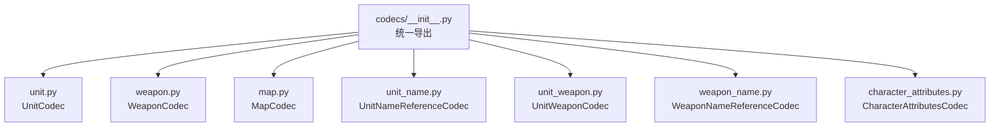
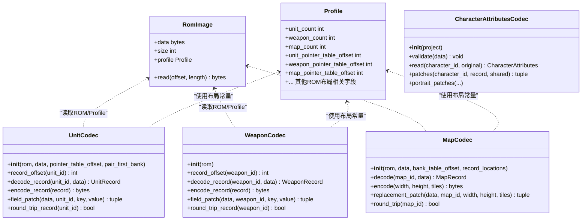
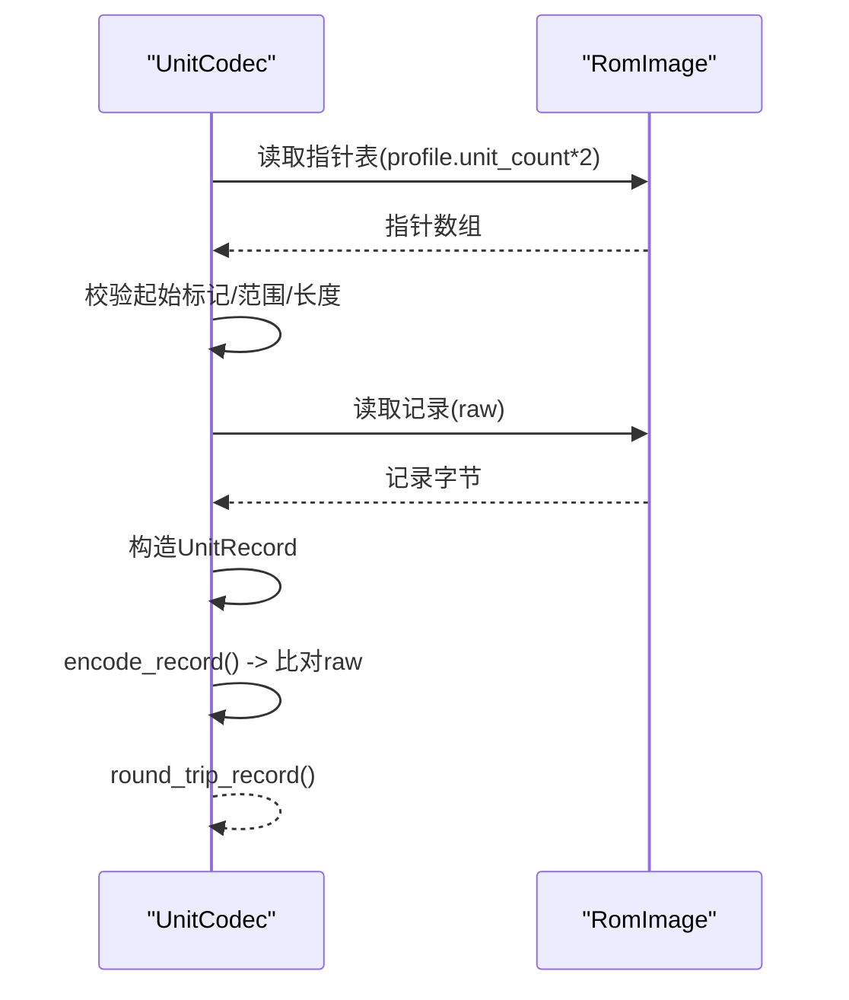
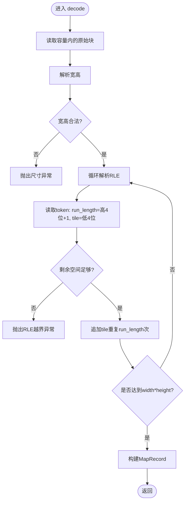
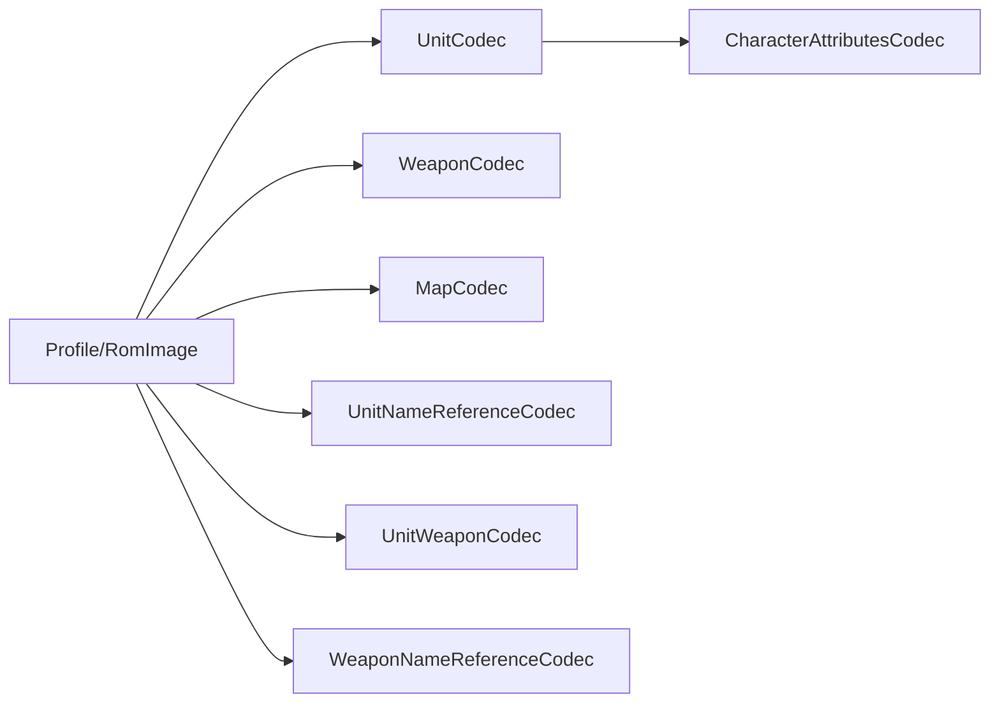

# 编解码器系统

<cite>
**本文引用的文件**
- [src/fc_editor/codecs/__init__.py](file://src/fc_editor/codecs/__init__.py)
- [src/fc_editor/codecs/unit.py](file://src/fc_editor/codecs/unit.py)
- [src/fc_editor/codecs/weapon.py](file://src/fc_editor/codecs/weapon.py)
- [src/fc_editor/codecs/map.py](file://src/fc_editor/codecs/map.py)
- [src/fc_editor/codecs/unit_name.py](file://src/fc_editor/codecs/unit_name.py)
- [src/fc_editor/codecs/unit_weapon.py](file://src/fc_editor/codecs/unit_weapon.py)
- [src/fc_editor/codecs/weapon_name.py](file://src/fc_editor/codecs/weapon_name.py)
- [src/fc_editor/codecs/character_attributes.py](file://src/fc_editor/codecs/character_attributes.py)
</cite>

## 目录
1. [简介](#简介)
2. [项目结构](#项目结构)
3. [核心组件](#核心组件)
4. [架构总览](#架构总览)
5. [详细组件分析](#详细组件分析)
6. [依赖关系分析](#依赖关系分析)
7. [性能考虑](#性能考虑)
8. [故障排查指南](#故障排查指南)
9. [结论](#结论)
10. [附录](#附录)

## 简介
本文件为 FC 游戏修改器项目的“编解码器系统”提供系统化、可操作的架构文档。内容覆盖：
- Codec 接口设计规范与抽象约定（以现有实现归纳）
- 数据转换流程与错误处理机制
- 具体编解码器（UnitCodec、WeaponCodec、MapCodec、名称引用类、人物属性等）的实现要点
- 数据模型序列化格式（字段定义、类型映射、版本兼容性）
- 新增编解码器的开发步骤（注册与测试方法）
- 性能优化建议（批量操作、流式处理、内存管理）

## 项目结构
编解码器模块位于 src/fc_editor/codecs，采用“按领域分文件”的组织方式，每个文件聚焦一类资源（机体、武器、地图、名称引用、人物属性等）。统一通过 __init__.py 暴露公共 API，便于上层调用。

图表来源
- [src/fc_editor/codecs/__init__.py:1-47](file://src/fc_editor/codecs/__init__.py#L1-L47)

章节来源
- [src/fc_editor/codecs/__init__.py:1-47](file://src/fc_editor/codecs/__init__.py#L1-L47)

## 核心组件
本节从“接口规范、数据模型、错误处理、版本兼容”四个维度总结编解码器的通用设计。

- 接口规范（基于现有实现的共性）
  - 构造参数通常包含 RomImage 或 project 上下文，以及可选的偏移/表基址，用于适配不同 ROM Profile
  - 提供 decode/decode_record 将原始字节解析为领域记录对象
  - 提供 encode/encode_record 将记录写回字节序列
  - 提供 field_patch/slot_patch/replacement_patch 等细粒度补丁接口，返回 (offset, before, after) 三元组
  - 提供 round_trip_* 校验编解码一致性

- 数据模型
  - 各 Codec 对应一个或多个 Record/Config 数据类（如 UnitRecord、WeaponRecord、MapRecord、UnitWeaponConfig、CharacterAttributes、PortraitRecord）
  - 字段宽度、字节序、取值范围由常量与 Profile 共同约束

- 错误处理
  - 使用 RomFormatError 表达 ROM 格式异常（指针无效、容量不足、区域越界等）
  - 使用 ValueError 表达参数校验失败（ID 越界、非法值域）
  - 对关键位置进行断言式检查（起始标记、容量边界、Bank/窗口范围）

- 版本兼容性
  - 通过 ROM Profile 键（如 dc-kuorong-mmc3-v1/v2）限定已验证格式
  - 在必要时读取固定地址的代码片段进行“代码指纹”校验，确保 ROM 未改动关键加载逻辑

章节来源
- [src/fc_editor/codecs/unit.py:14-120](file://src/fc_editor/codecs/unit.py#L14-L120)
- [src/fc_editor/codecs/weapon.py:13-90](file://src/fc_editor/codecs/weapon.py#L13-L90)
- [src/fc_editor/codecs/map.py:16-228](file://src/fc_editor/codecs/map.py#L16-L228)
- [src/fc_editor/codecs/character_attributes.py:78-237](file://src/fc_editor/codecs/character_attributes.py#L78-L237)

## 架构总览
下图展示编解码器与 ROM 图像、Profile、错误模型的交互关系。

图表来源
- [src/fc_editor/codecs/unit.py:14-120](file://src/fc_editor/codecs/unit.py#L14-L120)
- [src/fc_editor/codecs/weapon.py:13-90](file://src/fc_editor/codecs/weapon.py#L13-L90)
- [src/fc_editor/codecs/map.py:16-228](file://src/fc_editor/codecs/map.py#L16-L228)
- [src/fc_editor/codecs/character_attributes.py:78-237](file://src/fc_editor/codecs/character_attributes.py#L78-L237)

## 详细组件分析

### UnitCodec（机体记录编解码）
- 职责
  - 解析并校验 128 项机体指针表
  - 将 CPU 指针映射到文件偏移（支持扩展 Bank 对）
  - 提供逐字段 patch 能力与往返校验

- 关键点
  - 指针表起始标记必须为 0
  - 每条记录的偏移需落在支持区域内且长度等于 UNIT_RECORD_SIZE
  - 支持 pair_first_bank 模式下的 $8000-$BFFF 扩展 Bank 对映射
  - field_patch 根据字段元信息写入 raw 并返回补丁三元组

- 典型流程（解码→编码→校验）

图表来源
- [src/fc_editor/codecs/unit.py:42-93](file://src/fc_editor/codecs/unit.py#L42-L93)
- [src/fc_editor/codecs/unit.py:95-120](file://src/fc_editor/codecs/unit.py#L95-L120)

章节来源
- [src/fc_editor/codecs/unit.py:14-120](file://src/fc_editor/codecs/unit.py#L14-L120)

### WeaponCodec（武器记录编解码）
- 职责
  - 解析并校验 192 项武器指针表
  - 将 CPU 指针映射到文件偏移
  - 提供字段级 patch 与往返校验

- 关键点
  - 指针表起始标记必须为 0
  - 记录偏移需落在武器数据区且长度等于 WEAPON_RECORD_SIZE
  - field_patch 基于字段元信息生成补丁三元组

章节来源
- [src/fc_editor/codecs/weapon.py:13-90](file://src/fc_editor/codecs/weapon.py#L13-L90)

### MapCodec（地图地形 RLE 编解码）
- 职责
  - 解析地图指针表与 Bank 目录（支持扩展模式）
  - 计算每条地图记录的容量
  - 解码 4-bit 地形 RLE 为 tile 序列；编码回 RLE
  - 提供 replacement_patch 安全替换地图数据块

- 关键点
  - 指针表起始标记与存储区范围校验
  - 扩展模式下指针必须在 $A000-$BFFF，且同 Bank 内严格递增
  - RLE 游程长度上限为 16，tile 值域 0–15
  - semantic_digest 基于语义内容（宽高+图块）计算哈希

- 解码流程图

图表来源
- [src/fc_editor/codecs/map.py:136-173](file://src/fc_editor/codecs/map.py#L136-L173)

章节来源
- [src/fc_editor/codecs/map.py:16-228](file://src/fc_editor/codecs/map.py#L16-L228)

### UnitNameReferenceCodec（机体名称引用）
- 职责
  - 稳定地编辑机体名称：通过重定向到已有本地化名称记录，避免破坏布局
- 关键点
  - 校验名称指针表完整性与起始标记
  - 限制指针范围在 Bank 12/13 的 16 KiB 窗口
  - reference_patch 返回目标指针的写入位置与前/后字节

章节来源
- [src/fc_editor/codecs/unit_name.py:9-90](file://src/fc_editor/codecs/unit_name.py#L9-L90)

### UnitWeaponCodec（机体武器槽配置）
- 职责
  - 解码/编码每个机体固定的两个武器 ID 槽
- 关键点
  - 校验武器 ID 不超过当前 ROM 武器总数
  - slot_patch 精确修改单个槽位并返回补丁三元组

章节来源
- [src/fc_editor/codecs/unit_weapon.py:11-79](file://src/fc_editor/codecs/unit_weapon.py#L11-L79)

### WeaponNameReferenceCodec（武器名称引用）
- 职责
  - 安全编辑武器名称：复用已有本地化记录
- 关键点
  - 校验指针表与数据区范围
  - 计算每个唯一指针的记录容量
  - reference_patch 返回目标指针写入位置与前/后字节

章节来源
- [src/fc_editor/codecs/weapon_name.py:9-120](file://src/fc_editor/codecs/weapon_name.py#L9-L120)

### CharacterAttributesCodec（人物属性与头像）
- 职责
  - 读写人物属性与头像记录，支持共享记录压缩与池内重排
  - 校验 ROM 中关键代码片段，确保格式一致
- 关键点
  - 固定 TABLE/POOL/PORTRAIT_TABLE 等地址与 COUNT
  - read 解析可变长度修正字段（标志位控制）
  - patches/portrait_patches 返回补丁集合，必要时重建池并更新指针表
  - validate 通过“代码指纹”保证 ROM 未被篡改

章节来源
- [src/fc_editor/codecs/character_attributes.py:78-237](file://src/fc_editor/codecs/character_attributes.py#L78-L237)

## 依赖关系分析
- 模块耦合
  - 所有 Codec 均依赖 RomImage 与 Profile 提供的 ROM 布局信息
  - 名称引用类与 UnitWeaponCodec 依赖武器/机体数量等 Profile 常量
  - character_attributes 还依赖 weapon_codec 获取额外字段（武器特技/距离补正）

- 外部依赖
  - struct 用于小端解包
  - hashlib 用于地图语义哈希
  - dataclasses 用于不可变记录建模

图表来源
- [src/fc_editor/codecs/unit.py:14-120](file://src/fc_editor/codecs/unit.py#L14-L120)
- [src/fc_editor/codecs/weapon.py:13-90](file://src/fc_editor/codecs/weapon.py#L13-L90)
- [src/fc_editor/codecs/map.py:16-228](file://src/fc_editor/codecs/map.py#L16-L228)
- [src/fc_editor/codecs/unit_name.py:9-90](file://src/fc_editor/codecs/unit_name.py#L9-L90)
- [src/fc_editor/codecs/unit_weapon.py:11-79](file://src/fc_editor/codecs/unit_weapon.py#L11-L79)
- [src/fc_editor/codecs/weapon_name.py:9-120](file://src/fc_editor/codecs/weapon_name.py#L9-L120)
- [src/fc_editor/codecs/character_attributes.py:78-237](file://src/fc_editor/codecs/character_attributes.py#L78-L237)

章节来源
- [src/fc_editor/codecs/unit.py:14-120](file://src/fc_editor/codecs/unit.py#L14-L120)
- [src/fc_editor/codecs/weapon.py:13-90](file://src/fc_editor/codecs/weapon.py#L13-L90)
- [src/fc_editor/codecs/map.py:16-228](file://src/fc_editor/codecs/map.py#L16-L228)
- [src/fc_editor/codecs/character_attributes.py:78-237](file://src/fc_editor/codecs/character_attributes.py#L78-L237)

## 性能考虑
- 批量操作
  - 优先使用 field_patch/slot_patch/replacement_patch 返回的补丁三元组进行批量合并，减少多次 I/O
  - 对于地图，尽量一次性替换整张地图，避免碎片化写入

- 流式处理
  - 地图解码时按需解析 RLE，避免一次性展开超大地图（当前实现已按容量边界迭代）
  - 对超大数据集（如大量字符属性），可分批读取/写入，降低峰值内存

- 内存管理
  - 使用只读视图（bytes）而非频繁拷贝；仅在需要修改时构造新的 bytearray
  - 人物属性池重排时注意容量上限，提前估算以避免反复扩容

- 缓存与去重
  - 名称引用与共享记录天然具备去重效果，减少冗余写入
  - 对热点数据（如指针表）可在进程内缓存

[本节为通用指导，不直接分析具体文件]

## 故障排查指南
- 常见错误及定位
  - “指针表不完整/起始标记不正确”：检查 Profile 中的表偏移与计数；确认 ROM 未被裁剪
  - “记录超出支持区域/容量无效”：核对记录长度与存储区边界；扩展模式下确认 Bank/窗口范围
  - “RLE 游程越过地图末尾/数据提前结束”：检查地图宽高与实际 tile 数量是否匹配
  - “人物数据池容量不足”：减少修正字段或勾选“同时修改共用记录”，或先清理冗余记录
  - “代码指纹不一致”：ROM 被修改过，需恢复至受验证版本

- 调试建议
  - 使用 round_trip_* 快速验证编解码一致性
  - 打印补丁三元组的 offset/before/after，定位具体字节变化
  - 对名称引用类，使用 source_ids 反向查找哪些条目共享同一记录

章节来源
- [src/fc_editor/codecs/unit.py:42-93](file://src/fc_editor/codecs/unit.py#L42-L93)
- [src/fc_editor/codecs/weapon.py:20-66](file://src/fc_editor/codecs/weapon.py#L20-L66)
- [src/fc_editor/codecs/map.py:49-117](file://src/fc_editor/codecs/map.py#L49-L117)
- [src/fc_editor/codecs/map.py:136-173](file://src/fc_editor/codecs/map.py#L136-L173)
- [src/fc_editor/codecs/character_attributes.py:103-125](file://src/fc_editor/codecs/character_attributes.py#L103-L125)
- [src/fc_editor/codecs/character_attributes.py:202-237](file://src/fc_editor/codecs/character_attributes.py#L202-L237)

## 结论
该编解码器系统围绕“指针表 + 记录块”的统一范式构建，通过严格的边界校验与版本指纹保障稳定性。各 Codec 职责清晰、接口一致，便于扩展与维护。结合批量补丁、流式解码与池内去重策略，可在保证正确性的前提下获得良好性能。

[本节为总结性内容，不直接分析具体文件]

## 附录

### 数据模型与序列化要点
- UnitRecord/WeaponRecord/MapRecord/UnitWeaponConfig/CharacterAttributes/PortraitRecord
  - 字段宽度与字节序由常量与 Profile 决定
  - 地图地形采用 4-bit RLE，游程上限 16，tile 值域 0–15
  - 人物属性为可变长度，修正字段由标志位控制存在与否
  - 名称引用通过重定向到已有记录，避免复制

章节来源
- [src/fc_editor/codecs/unit.py:86-93](file://src/fc_editor/codecs/unit.py#L86-L93)
- [src/fc_editor/codecs/weapon.py:55-70](file://src/fc_editor/codecs/weapon.py#L55-L70)
- [src/fc_editor/codecs/map.py:136-196](file://src/fc_editor/codecs/map.py#L136-L196)
- [src/fc_editor/codecs/unit_weapon.py:50-62](file://src/fc_editor/codecs/unit_weapon.py#L50-L62)
- [src/fc_editor/codecs/character_attributes.py:30-57](file://src/fc_editor/codecs/character_attributes.py#L30-L57)
- [src/fc_editor/codecs/character_attributes.py:59-76](file://src/fc_editor/codecs/character_attributes.py#L59-L76)

### 新增编解码器开发指南
- 步骤
  1) 新建 codec 文件，定义 Record/Config 数据类与 Codec 类
  2) 实现 decode/encode、field_patch/slot_patch/replacement_patch、round_trip_*
  3) 在 __init__.py 中导出新类
  4) 编写单元测试：覆盖正常路径、边界条件、错误分支与往返一致性

- 注册机制
  - 在 codecs/__init__.py 的 from/import 与 __all__ 中添加新类名

- 测试方法
  - 使用真实 ROM 或最小数据集构造 RomImage
  - 针对指针表、记录容量、Bank/窗口范围进行断言
  - 对名称引用类，验证 source_ids 与 round_trip

章节来源
- [src/fc_editor/codecs/__init__.py:1-47](file://src/fc_editor/codecs/__init__.py#L1-L47)