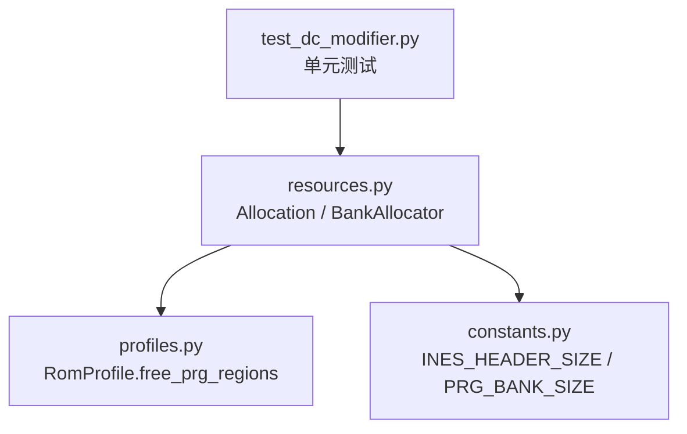
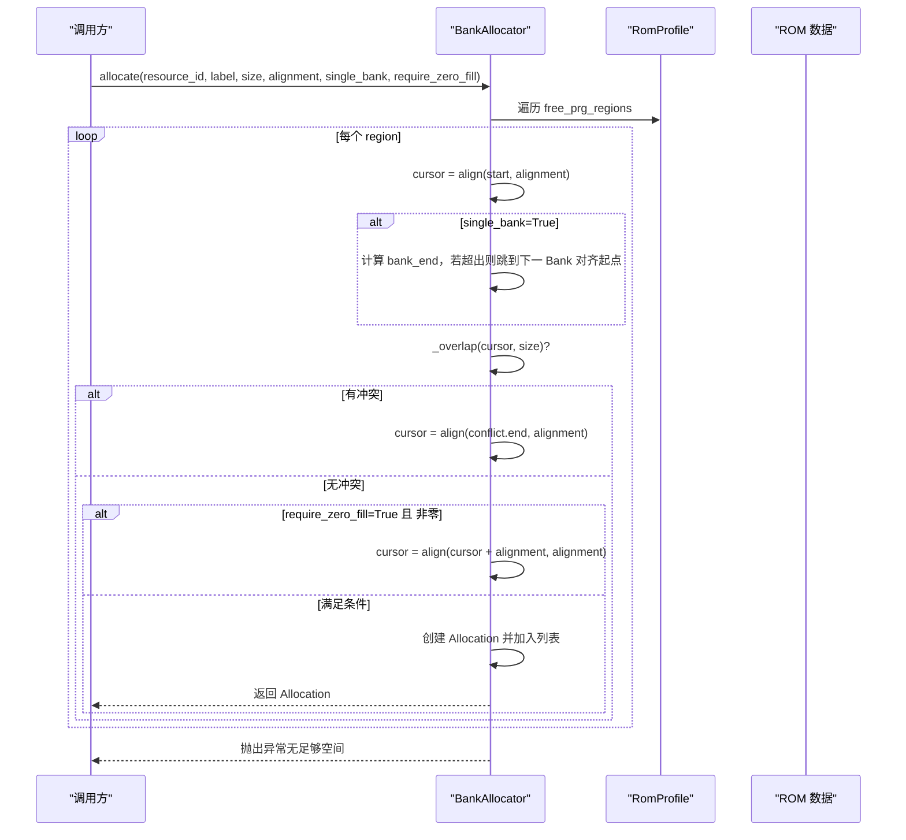
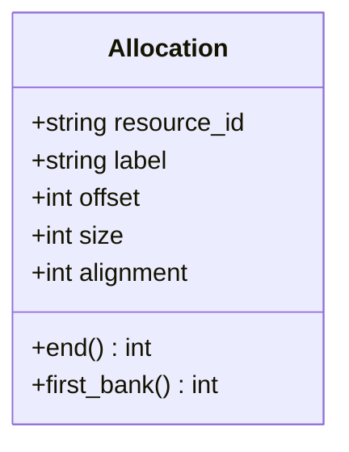
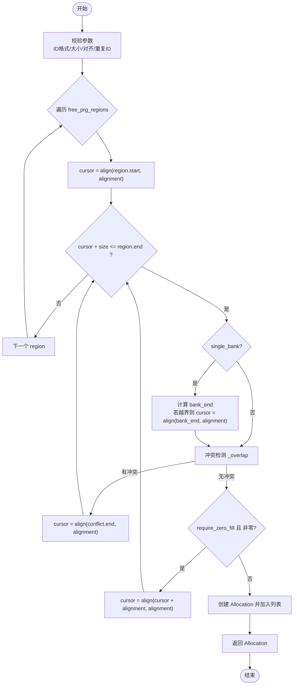
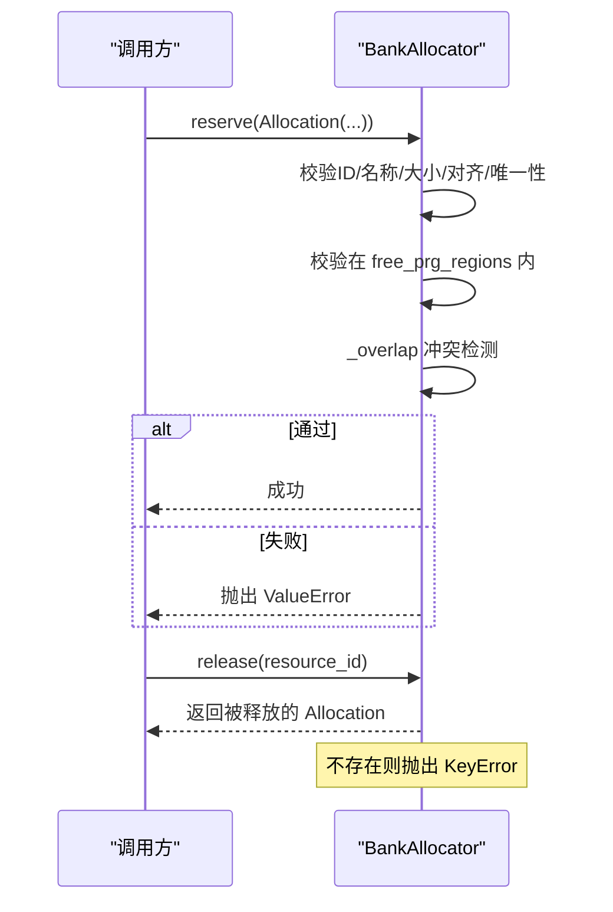
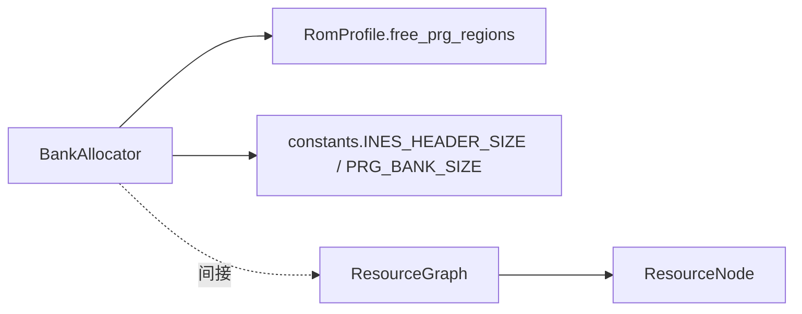

# 资源分配器BankAllocator

<cite>
**本文引用的文件**
- [resources.py](file://src/fc_editor/resources.py)
- [profiles.py](file://src/fc_editor/profiles.py)
- [constants.py](file://src/fc_editor/constants.py)
- [test_dc_modifier.py](file://tests/test_dc_modifier.py)
</cite>

## 目录
1. [简介](#简介)
2. [项目结构](#项目结构)
3. [核心组件](#核心组件)
4. [架构总览](#架构总览)
5. [详细组件分析](#详细组件分析)
6. [依赖关系分析](#依赖关系分析)
7. [性能考虑](#性能考虑)
8. [故障排查指南](#故障排查指南)
9. [结论](#结论)
10. [附录：使用示例与最佳实践](#附录使用示例与最佳实践)

## 简介
本技术文档围绕 BankAllocator 类，系统性阐述其在 FC/MMC3 ROM 中的 PRG Bank 空间管理策略。内容涵盖：
- 内存分配算法（首次适配、单 Bank 约束、对齐与零填充）
- 冲突检测机制（重叠检查、保护区域边界校验）
- Allocation 数据模型（资源描述符、地址映射、首 Bank 计算）
- 连续 Bank 段分配（single_bank 开关对策略的影响）
- 资源分配、查询与释放的完整流程
- 性能调优建议（策略选择、碎片化控制、内存使用监控）

## 项目结构
BankAllocator 位于资源管理模块中，依赖 ROM 配置（RomProfile）、常量（INES 头大小、PRG Bank 大小）以及测试用例以验证行为。关键文件职责如下：
- resources.py：定义 Allocation、BankAllocator、ResourceGraph 等核心类型与逻辑
- profiles.py：定义 RomProfile，声明 free_prg_regions 等可用 PRG 区域
- constants.py：提供 INES_HEADER_SIZE、PRG_BANK_SIZE 等常量
- test_dc_modifier.py：覆盖 BankAllocator 的确定性、区域复用、冲突拒绝等行为

**图表来源**
- [resources.py:263-413](file://src/fc_editor/resources.py#L263-L413)
- [profiles.py:275-327](file://src/fc_editor/profiles.py#L275-L327)
- [constants.py:8-10](file://src/fc_editor/constants.py#L8-L10)
- [test_dc_modifier.py:199-231](file://tests/test_dc_modifier.py#L199-L231)

**章节来源**
- [resources.py:263-413](file://src/fc_editor/resources.py#L263-L413)
- [profiles.py:275-327](file://src/fc_editor/profiles.py#L275-L327)
- [constants.py:8-10](file://src/fc_editor/constants.py#L8-L10)
- [test_dc_modifier.py:199-231](file://tests/test_dc_modifier.py#L199-L231)

## 核心组件
- Allocation：不可变的数据类，记录资源 ID、标签、偏移、大小与对齐要求，并提供 end 与 first_bank 属性用于范围与 Bank 定位。
- BankAllocator：基于 RomProfile 声明的 free_prg_regions 进行确定性的首次适配分配，支持单 Bank 或跨 Bank 连续分配、对齐、可选零填充检查、冲突检测与保留/释放。
- ResourceGraph/ResourceNode/ResourceReference：用于描述 ROM 内命名资源及其引用关系，辅助编辑器模块理解已占用区域与可写性。

**章节来源**
- [resources.py:14-47](file://src/fc_editor/resources.py#L14-L47)
- [resources.py:263-278](file://src/fc_editor/resources.py#L263-L278)
- [resources.py:280-413](file://src/fc_editor/resources.py#L280-L413)

## 架构总览
BankAllocator 的工作流由“配置 + 状态”驱动：
- 配置：RomProfile 提供 free_prg_regions，指示哪些 PRG Bank 可用于分配
- 状态：内部维护 Allocation 列表，用于冲突检测与容量统计
- 分配：按 region 顺序扫描，从 region 起始位置按 alignment 对齐后尝试放置；若 single_bank=True，则强制不跨越 Bank 边界；必要时跳过非零区域（require_zero_fill）
- 冲突检测：通过 _overlap 检查是否与已有 Allocation 重叠
- 预留与释放：reserve/release/allocation 提供显式生命周期管理

**图表来源**
- [resources.py:368-413](file://src/fc_editor/resources.py#L368-L413)
- [profiles.py:275-327](file://src/fc_editor/profiles.py#L275-L327)
- [constants.py:8-10](file://src/fc_editor/constants.py#L8-L10)

## 详细组件分析

### Allocation 数据模型
- 字段：resource_id、label、offset、size、alignment
- 派生属性：end 表示结束偏移；first_bank 根据 offset 与 INES_HEADER_SIZE、PRG_BANK_SIZE 计算所在 PRG Bank
- 设计要点：不可变（frozen），便于安全共享与排序；严格校验 resource_id 格式与对齐要求

**图表来源**
- [resources.py:263-278](file://src/fc_editor/resources.py#L263-L278)
- [constants.py:8-10](file://src/fc_editor/constants.py#L8-L10)

**章节来源**
- [resources.py:263-278](file://src/fc_editor/resources.py#L263-L278)

### BankAllocator 核心算法
- 对齐策略：_align(value, alignment) 将值向上对齐到 alignment 的倍数
- 区域判定：_is_in_free_region(offset, size) 确保分配落在 profile.free_prg_regions 范围内
- 冲突检测：_overlap(offset, size) 检查与现有 Allocation 是否重叠
- 分配策略：
  - 首次适配（First-Fit）：按 region 顺序、cursor 递增寻找首个可用位置
  - 单 Bank 约束：当 single_bank=True 时，不允许跨 Bank 边界
  - 零填充检查：require_zero_fill=True 时，仅接受全零区域
- 容量与使用：capacity/used/available 提供统计信息

**图表来源**
- [resources.py:311-413](file://src/fc_editor/resources.py#L311-L413)

**章节来源**
- [resources.py:311-413](file://src/fc_editor/resources.py#L311-L413)

### 资源保留与生命周期管理
- reserve(allocation)：显式预留一个 Allocation，执行严格的合法性校验（ID格式、名称非空、唯一性、大小与对齐、在 free 区域内、不与已有分配重叠）
- release(resource_id)：按 resource_id 移除并返回 Allocation
- allocation(resource_id)：按 resource_id 查询 Allocation

**图表来源**
- [resources.py:334-366](file://src/fc_editor/resources.py#L334-L366)

**章节来源**
- [resources.py:334-366](file://src/fc_editor/resources.py#L334-L366)

### 连续 Bank 段分配策略
- single_bank=False：允许跨多个 PRG Bank 的连续分配，适合大块数据（如音频、大表）
- single_bank=True：限制在单个 Bank 内，避免跨 Bank 带来的寻址复杂性
- 选择建议：
  - 小对象、频繁访问：优先 single_bank=True，减少跨 Bank 跳转
  - 大对象、顺序访问：single_bank=False，降低碎片化

**章节来源**
- [resources.py:368-413](file://src/fc_editor/resources.py#L368-L413)
- [test_dc_modifier.py:208-219](file://tests/test_dc_modifier.py#L208-L219)

## 依赖关系分析
- BankAllocator 依赖 RomProfile.free_prg_regions 决定可分配区域
- 依赖 constants.INES_HEADER_SIZE 与 constants.PRG_BANK_SIZE 计算绝对偏移与 Bank 边界
- 与 ResourceGraph/ResourceNode 配合，可在编辑器层面对已占用区域进行可视化与校验

**图表来源**
- [resources.py:280-413](file://src/fc_editor/resources.py#L280-L413)
- [profiles.py:275-327](file://src/fc_editor/profiles.py#L275-L327)
- [constants.py:8-10](file://src/fc_editor/constants.py#L8-L10)

**章节来源**
- [resources.py:280-413](file://src/fc_editor/resources.py#L280-L413)
- [profiles.py:275-327](file://src/fc_editor/profiles.py#L275-L327)
- [constants.py:8-10](file://src/fc_editor/constants.py#L8-L10)

## 性能考虑
- 分配复杂度：
  - 每次 allocate 遍历 free_prg_regions，并在每个 region 内线性扫描 cursor，时间复杂度近似 O(R × N)，R 为 region 数，N 为候选位置数
  - _overlap 为 O(A)，A 为当前 Allocation 数量
- 优化建议：
  - 合理设置 alignment，避免过小导致碎片过多
  - 对大块数据使用 single_bank=False 以减少跨区碎片
  - 批量 reserve 已知布局，减少运行时分配开销
  - 使用 available/used/capacity 监控内存使用，适时触发整理或重新规划
- 零填充检查：
  - require_zero_fill=True 会读取 ROM 数据判断是否为零，可能带来 I/O 成本；仅在需要时启用

[本节为通用性能指导，不直接分析具体代码行]

## 故障排查指南
- 常见错误与原因：
  - 资源 ID 格式无效：需符合正则规则（以小写字母开头，包含字母数字、点、下划线、连字符，长度限制）
  - 资源名称为空：label.strip() 必须非空
  - 重复资源 ID：同一 resource_id 只能存在一次
  - 大小或对齐非法：size > 0，alignment 必须是 2 的幂
  - 不在 free_prg_regions：分配范围必须完全落在配置的可用区域
  - 与已有分配重叠：_overlap 检测到冲突将拒绝
  - 无足够空间：当 single_bank=True 或 require_zero_fill=True 时，可能无法找到合适位置
- 调试步骤：
  - 打印 allocations 列表，确认已有分配与冲突点
  - 检查 RomProfile.free_prg_regions 是否正确配置
  - 调整 alignment 或关闭 require_zero_fill 以定位问题
  - 使用 release 释放不再需要的资源，再重试分配

**章节来源**
- [resources.py:334-413](file://src/fc_editor/resources.py#L334-L413)
- [test_dc_modifier.py:221-231](file://tests/test_dc_modifier.py#L221-L231)

## 结论
BankAllocator 提供了面向 MMC3 ROM 的确定性、可预测的 PRG Bank 分配能力。其核心优势在于：
- 明确的首次适配策略与单 Bank 约束，便于静态分析与工具链集成
- 严格的冲突检测与区域边界校验，保障 ROM 完整性
- 灵活的 Allocation 模型与生命周期管理，支持复杂编辑场景
结合合理的策略选择与监控手段，可在保证稳定性的同时提升分配效率与空间利用率。

[本节为总结性内容，不直接分析具体代码行]

## 附录：使用示例与最佳实践
以下示例展示如何创建 BankAllocator 并进行分配、查询与释放操作。为避免泄露实现细节，此处仅提供路径指引与行为说明。

- 创建分配器并获取容量信息
  - 参考路径：[test_dc_modifier.py:199-207](file://tests/test_dc_modifier.py#L199-L207)
  - 行为：构造 BankAllocator，调用 allocate 两次，断言 first_bank、capacity、used 等

- 跨 Bank 连续分配与区域复用
  - 参考路径：[test_dc_modifier.py:208-219](file://tests/test_dc_modifier.py#L208-L219)
  - 行为：single_bank=False 分配大块数据，随后再次分配小对象，验证可用空间

- 拒绝受保护或重叠的预留
  - 参考路径：[test_dc_modifier.py:221-231](file://tests/test_dc_modifier.py#L221-L231)
  - 行为：验证 ID 格式、区域边界、重叠冲突等异常情况

- 分配、查询与释放
  - 分配：参考路径 [resources.py:368-413](file://src/fc_editor/resources.py#L368-L413)
  - 查询：参考路径 [resources.py:362-366](file://src/fc_editor/resources.py#L362-L366)
  - 释放：参考路径 [resources.py:356-360](file://src/fc_editor/resources.py#L356-L360)

- 最佳实践
  - 对小对象使用 single_bank=True，降低跨 Bank 复杂度
  - 对大对象使用 single_bank=False，减少碎片
  - 合理设置 alignment，避免过度碎片化
  - 使用 require_zero_fill 控制是否仅接受零初始化区域
  - 定期监控 capacity/used/available，及时规划扩容或重排

**章节来源**
- [test_dc_modifier.py:199-231](file://tests/test_dc_modifier.py#L199-L231)
- [resources.py:356-413](file://src/fc_editor/resources.py#L356-L413)