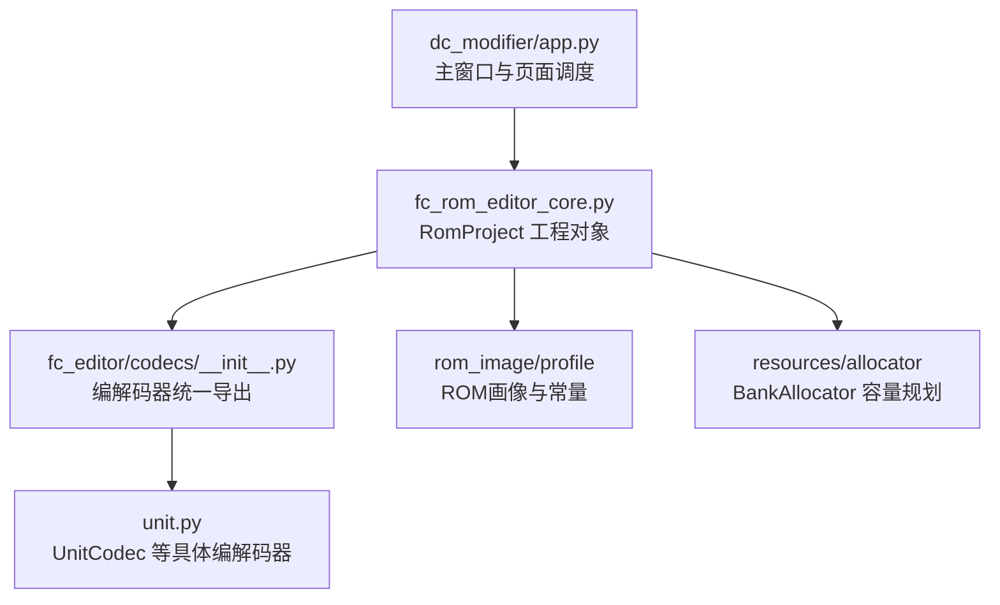
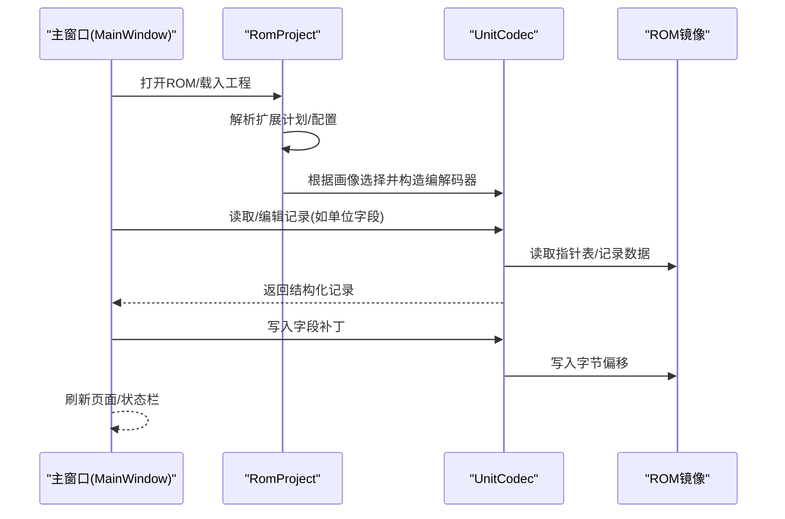
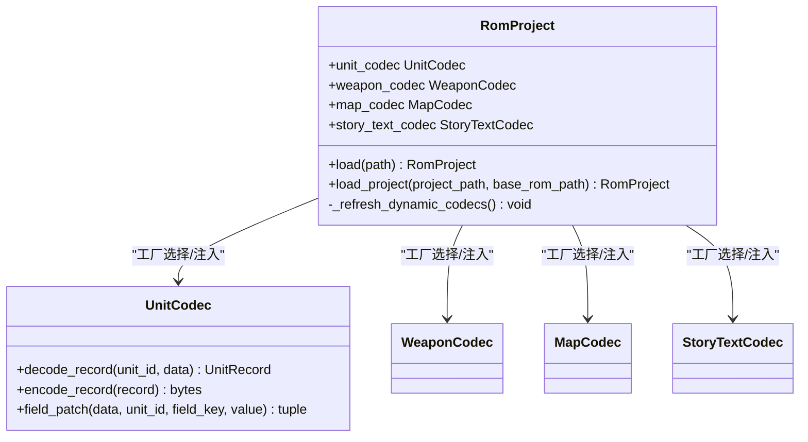
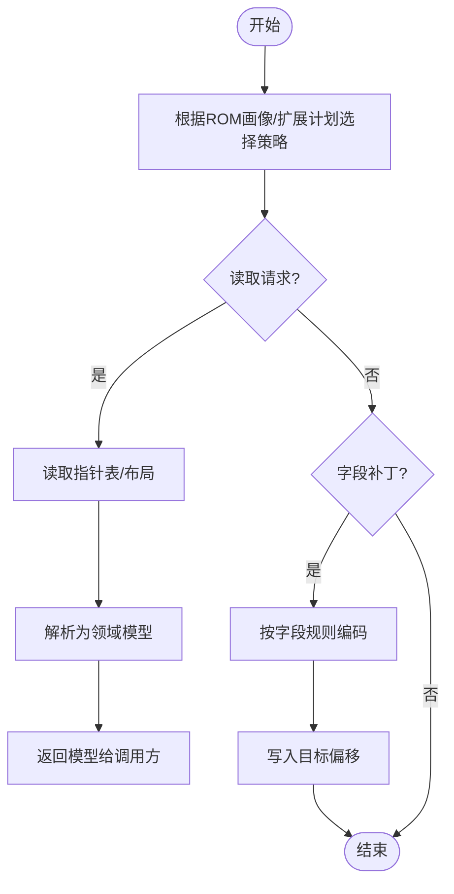
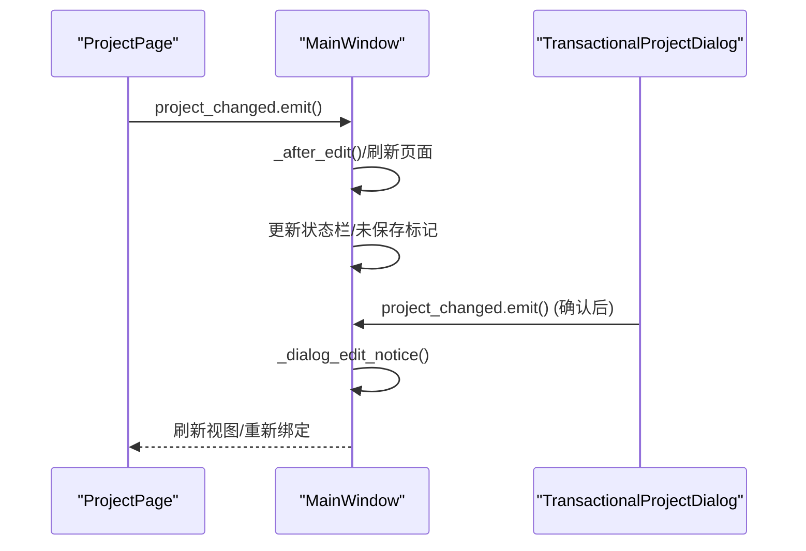
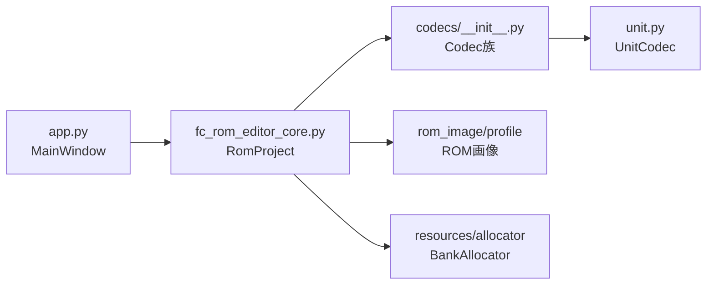

# 设计模式应用

<cite>
**本文引用的文件**
- [src/fc_rom_editor_core.py](file://src/fc_rom_editor_core.py)
- [src/fc_editor/codecs/__init__.py](file://src/fc_editor/codecs/__init__.py)
- [src/fc_editor/codecs/unit.py](file://src/fc_editor/codecs/unit.py)
- [src/dc_modifier/app.py](file://src/dc_modifier/app.py)
</cite>

## 目录
1. [简介](#简介)
2. [项目结构](#项目结构)
3. [核心组件](#核心组件)
4. [架构总览](#架构总览)
5. [详细组件分析](#详细组件分析)
6. [依赖关系分析](#依赖关系分析)
7. [性能考量](#性能考量)
8. [故障排查指南](#故障排查指南)
9. [结论](#结论)
10. [附录](#附录)

## 简介
本文件聚焦于DC修改器在设计模式上的系统化应用，围绕工厂模式（编解码器创建）、策略模式（不同数据格式处理）、观察者模式（UI更新）展开，结合源码中的实际实现进行说明。文档提供动机、适用场景、具体实现方式、调用关系图与代码片段路径，并给出模式组合的最佳实践、反模式识别与重构建议，帮助读者在扩展与维护中做出更稳健的技术决策。

## 项目结构
- 核心工程与ROM操作位于 fc_rom_editor_core.py，负责加载ROM、构建资源分配器、初始化各类编解码器、事务与撤销重做等。
- 编解码器集合位于 fc_editor/codecs/*，按数据类型划分（机体、武器、地图、剧情文本、音乐等），并通过 __init__.py 统一导出。
- DC修改器UI入口与页面管理位于 dc_modifier/app.py，负责窗口、菜单、页面注册与事件联动。

图表来源
- [src/dc_modifier/app.py:276-365](file://src/dc_modifier/app.py#L276-L365)
- [src/fc_rom_editor_core.py:463-618](file://src/fc_rom_editor_core.py#L463-L618)
- [src/fc_editor/codecs/__init__.py:1-47](file://src/fc_editor/codecs/__init__.py#L1-L47)
- [src/fc_editor/codecs/unit.py:14-120](file://src/fc_editor/codecs/unit.py#L14-L120)

章节来源
- [src/dc_modifier/app.py:276-365](file://src/dc_modifier/app.py#L276-L365)
- [src/fc_rom_editor_core.py:463-618](file://src/fc_rom_editor_core.py#L463-L618)
- [src/fc_editor/codecs/__init__.py:1-47](file://src/fc_editor/codecs/__init__.py#L1-L47)

## 核心组件
- RomProject：封装ROM镜像、工作副本、初始与动态编解码器、资源分配器、事务与撤销重做能力。它是工厂模式的“装配中心”，根据ROM画像与扩展计划选择并实例化合适的编解码器。
- 编解码器族：以 Codec 结尾的类，针对特定数据格式提供读取/写入/字段级补丁能力，体现策略模式——同一接口下多种实现。
- UI主窗口与页面：MainWindow 通过注册与切换页面，使用信号/槽机制驱动UI更新，体现观察者模式——状态变化通知视图刷新。

章节来源
- [src/fc_rom_editor_core.py:463-618](file://src/fc_rom_editor_core.py#L463-L618)
- [src/fc_editor/codecs/unit.py:14-120](file://src/fc_editor/codecs/unit.py#L14-L120)
- [src/dc_modifier/app.py:276-365](file://src/dc_modifier/app.py#L276-L365)

## 架构总览
下图展示从UI到ROM数据的整体流程：用户触发操作 → 主窗口协调 → RomProject 装配编解码器 → 具体Codec执行读写 → 结果回写ROM或更新UI。

图表来源
- [src/dc_modifier/app.py:276-365](file://src/dc_modifier/app.py#L276-L365)
- [src/fc_rom_editor_core.py:463-618](file://src/fc_rom_editor_core.py#L463-L618)
- [src/fc_editor/codecs/unit.py:14-120](file://src/fc_editor/codecs/unit.py#L14-L120)

## 详细组件分析

### 工厂模式：编解码器的按需创建
- 动机：ROM存在多种布局与扩展方案，需要依据ROM画像与扩展计划动态选择合适的编解码器实现，避免硬编码分支。
- 适用场景：多形态数据格式的统一访问；条件化装配；可扩展新格式时仅新增Codec并注册。
- 实现要点：
  - RomProject.__init__ 根据 initial_plan.flags 与 rom_image.profile 决定 base_* 与当前 codec 实例。
  - 对单位、武器、地图、剧情文本、音乐等资源分别构造对应Codec，并在必要时注入偏移量、银行映射等上下文。
  - 通过 _refresh_dynamic_codecs 在变更时重建动态编解码器，保证一致性。
- 代码片段路径：
  - [RomProject 初始化与编解码器装配:463-618](file://src/fc_rom_editor_core.py#L463-L618)
  - [编解码器统一导出:1-47](file://src/fc_editor/codecs/__init__.py#L1-L47)

图表来源
- [src/fc_rom_editor_core.py:463-618](file://src/fc_rom_editor_core.py#L463-L618)
- [src/fc_editor/codecs/unit.py:14-120](file://src/fc_editor/codecs/unit.py#L14-L120)

章节来源
- [src/fc_rom_editor_core.py:463-618](file://src/fc_rom_editor_core.py#L463-L618)
- [src/fc_editor/codecs/__init__.py:1-47](file://src/fc_editor/codecs/__init__.py#L1-L47)

### 策略模式：不同数据格式的处理
- 动机：不同资源（单位、武器、地图、文本、音乐）具有各自的数据结构与规则，需以统一接口暴露读/写/校验能力，便于上层调用与替换。
- 适用场景：同构API下的异构实现；运行时根据上下文切换算法；易于测试与扩展。
- 实现要点：
  - UnitCodec 提供 decode_record / encode_record / field_patch，屏蔽底层字节偏移与Bank映射细节。
  - 其他Codec遵循相同范式（读取指针表→定位记录→编解码字段→回写）。
  - 通过 RomProject 的装配逻辑将具体策略注入到调用方。
- 代码片段路径：
  - [UnitCodec 接口与实现:14-120](file://src/fc_editor/codecs/unit.py#L14-L120)
  - [RomProject 装配策略实例:463-618](file://src/fc_rom_editor_core.py#L463-L618)

图表来源
- [src/fc_editor/codecs/unit.py:14-120](file://src/fc_editor/codecs/unit.py#L14-L120)
- [src/fc_rom_editor_core.py:463-618](file://src/fc_rom_editor_core.py#L463-L618)

章节来源
- [src/fc_editor/codecs/unit.py:14-120](file://src/fc_editor/codecs/unit.py#L14-L120)
- [src/fc_rom_editor_core.py:463-618](file://src/fc_rom_editor_core.py#L463-L618)

### 观察者模式：UI更新与状态同步
- 动机：当工程数据或页面草稿发生变化时，需自动通知相关UI组件刷新显示与状态标签，保持界面与数据一致。
- 适用场景：Qt信号/槽驱动的UI；多视图共享同一数据源；异步或批量更新后统一刷新。
- 实现要点：
  - MainWindow 维护 pages 列表，每个 ProjectPage 通过 project_changed 信号通知主窗口。
  - 主窗口在收到信号后刷新已注册页面、更新状态栏与未保存标记。
  - 对话框式编辑器通过 TransactionalProjectDialog 包装，提交后回调刷新。
- 代码片段路径：
  - [页面注册与信号连接:342-365](file://src/dc_modifier/app.py#L342-L365)
  - [对话框编辑确认后的刷新流程:494-509](file://src/dc_modifier/app.py#L494-L509)

图表来源
- [src/dc_modifier/app.py:342-365](file://src/dc_modifier/app.py#L342-L365)
- [src/dc_modifier/app.py:494-509](file://src/dc_modifier/app.py#L494-L509)

章节来源
- [src/dc_modifier/app.py:342-365](file://src/dc_modifier/app.py#L342-L365)
- [src/dc_modifier/app.py:494-509](file://src/dc_modifier/app.py#L494-L509)

### 模式组合：工厂+策略+观察者的协作
- 工厂负责按ROM画像装配策略（编解码器），策略负责具体数据格式的读写，观察者确保UI与数据同步。
- 典型流程：
  - 打开ROM → RomProject 装配Codec（工厂）
  - 页面发起读取/写入 → 调用具体Codec（策略）
  - 数据变更后 → 发出信号 → 主窗口刷新（观察者）
- 最佳实践：
  - 将装配逻辑集中在RomProject，避免在各页面重复判断。
  - 策略接口保持稳定，新增格式只需新增Codec并注册。
  - 观察者职责单一，只负责刷新与提示，不承载业务逻辑。

章节来源
- [src/fc_rom_editor_core.py:463-618](file://src/fc_rom_editor_core.py#L463-L618)
- [src/dc_modifier/app.py:342-365](file://src/dc_modifier/app.py#L342-L365)

## 依赖关系分析
- RomProject 依赖 RomImage 获取ROM画像与数据，依赖 BankAllocator 管理资源分配。
- 编解码器依赖 RomImage 与常量定义，解耦于UI层。
- UI层依赖 RomProject 提供的稳定接口，通过信号与页面交互。

图表来源
- [src/dc_modifier/app.py:276-365](file://src/dc_modifier/app.py#L276-L365)
- [src/fc_rom_editor_core.py:463-618](file://src/fc_rom_editor_core.py#L463-L618)
- [src/fc_editor/codecs/__init__.py:1-47](file://src/fc_editor/codecs/__init__.py#L1-L47)
- [src/fc_editor/codecs/unit.py:14-120](file://src/fc_editor/codecs/unit.py#L14-L120)

章节来源
- [src/dc_modifier/app.py:276-365](file://src/dc_modifier/app.py#L276-L365)
- [src/fc_rom_editor_core.py:463-618](file://src/fc_rom_editor_core.py#L463-L618)
- [src/fc_editor/codecs/__init__.py:1-47](file://src/fc_editor/codecs/__init__.py#L1-L47)
- [src/fc_editor/codecs/unit.py:14-120](file://src/fc_editor/codecs/unit.py#L14-L120)

## 性能考量
- 工厂装配仅在加载/切换工程时执行，避免频繁创建开销。
- 策略层尽量使用内存映射与批量读写，减少系统调用；字段级补丁最小化写入范围。
- 观察者刷新采用延迟与批处理，避免高频重绘；仅在关键节点（如对话框确认）触发全量刷新。
- 对于大对象（如地图、音频），考虑懒加载与分块处理，降低启动与切换时间。

[本节为通用指导，不直接分析具体文件]

## 故障排查指南
- 编解码器错误：若出现指针无效、记录不完整等异常，检查ROM画像与扩展计划是否匹配，确认指针表与记录边界。
  - 参考路径：[UnitCodec 指针与记录校验:42-93](file://src/fc_editor/codecs/unit.py#L42-L93)
- 工程完整性：加载工程后进行完整性检查，若有错误则中止；可借助验证工具定位问题。
  - 参考路径：[RomProject.load_project 完整性检查:644-674](file://src/fc_rom_editor_core.py#L644-L674)
- UI未刷新：确认页面是否正确连接 project_changed 信号，对话框是否调用 accept 并触发刷新。
  - 参考路径：[页面信号连接与刷新:342-365](file://src/dc_modifier/app.py#L342-L365), [对话框刷新:494-509](file://src/dc_modifier/app.py#L494-L509)

章节来源
- [src/fc_editor/codecs/unit.py:42-93](file://src/fc_editor/codecs/unit.py#L42-L93)
- [src/fc_rom_editor_core.py:644-674](file://src/fc_rom_editor_core.py#L644-L674)
- [src/dc_modifier/app.py:342-365](file://src/dc_modifier/app.py#L342-L365)
- [src/dc_modifier/app.py:494-509](file://src/dc_modifier/app.py#L494-L509)

## 结论
本项目通过工厂模式集中装配编解码器，策略模式抽象数据格式处理，观察者模式保障UI与数据一致，三者协同构建了可扩展、可维护的DC修改器架构。建议在后续演进中：
- 继续将新增数据格式以Codec形式接入，保持策略接口稳定。
- 强化工厂的可配置性与可测试性，便于模拟不同ROM布局。
- 优化观察者刷新粒度，提升大规模数据编辑时的响应速度。
- 警惕反模式：避免在页面内直接耦合ROM细节、避免在观察者中实现复杂业务逻辑、避免在工厂中进行过多I/O操作。

[本节为总结性内容，不直接分析具体文件]

## 附录
- 代码片段路径汇总：
  - [RomProject 初始化与编解码器装配:463-618](file://src/fc_rom_editor_core.py#L463-L618)
  - [编解码器统一导出:1-47](file://src/fc_editor/codecs/__init__.py#L1-L47)
  - [UnitCodec 接口与实现:14-120](file://src/fc_editor/codecs/unit.py#L14-L120)
  - [页面注册与信号连接:342-365](file://src/dc_modifier/app.py#L342-L365)
  - [对话框编辑确认后的刷新流程:494-509](file://src/dc_modifier/app.py#L494-L509)

[本节为索引性内容，不直接分析具体文件]