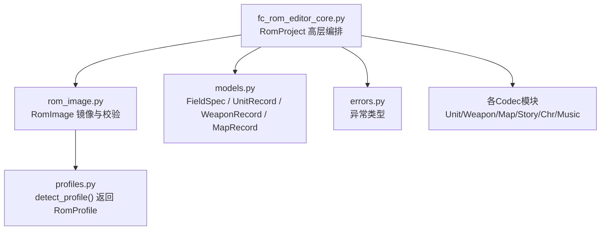
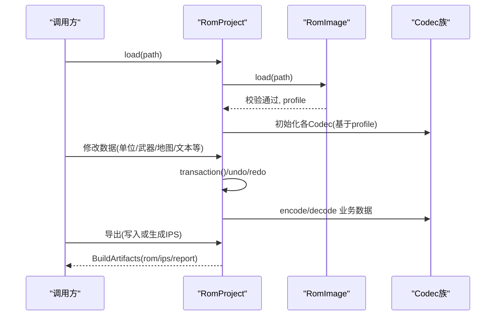
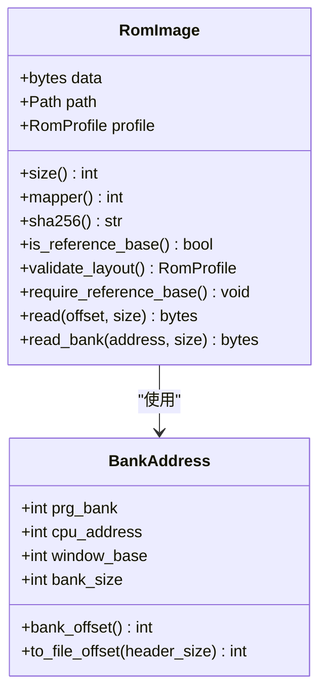
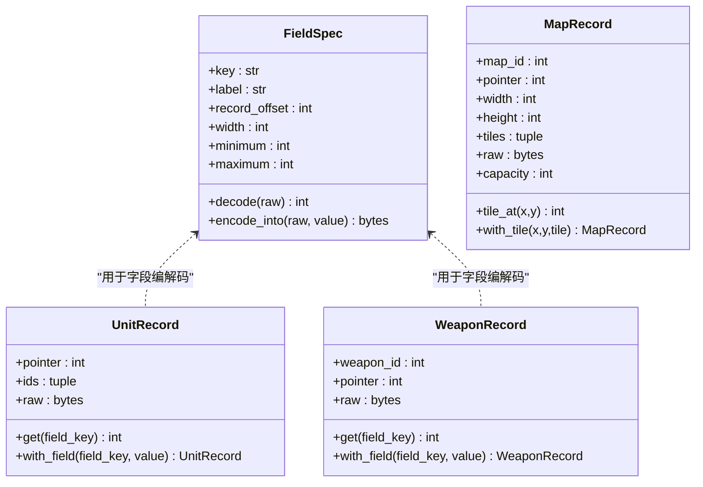
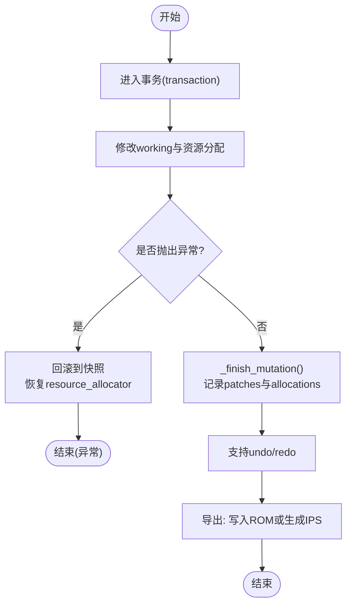
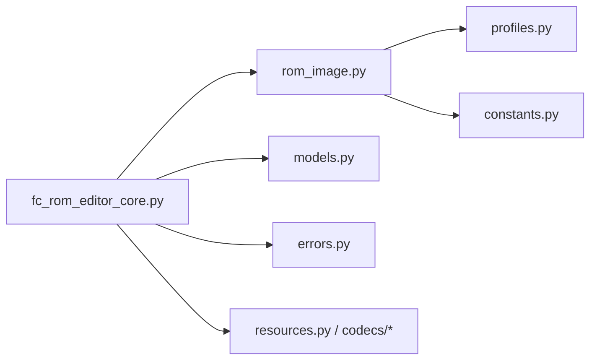

# ROM镜像引擎

<cite>
**本文引用的文件**
- [rom_image.py](file://src/fc_editor/rom_image.py)
- [models.py](file://src/fc_editor/models.py)
- [errors.py](file://src/fc_editor/errors.py)
- [fc_rom_editor_core.py](file://src/fc_rom_editor_core.py)
</cite>

## 目录
1. [简介](#简介)
2. [项目结构](#项目结构)
3. [核心组件](#核心组件)
4. [架构总览](#架构总览)
5. [详细组件分析](#详细组件分析)
6. [依赖关系分析](#依赖关系分析)
7. [性能考虑](#性能考虑)
8. [故障排查指南](#故障排查指南)
9. [结论](#结论)
10. [附录：使用示例与最佳实践](#附录使用示例与最佳实践)

## 简介
本技术文档围绕FC游戏修改器工程中的ROM镜像引擎展开，重点解释RomImage类的设计与实现、ROM文件读取与格式校验、内存映射机制；梳理UnitRecord、WeaponRecord、MapRecord等核心数据模型及其关系；说明错误处理策略（文件格式校验、数据完整性检查、异常恢复）；介绍ROM镜像的缓存、懒加载优化与内存管理策略；并提供读取ROM数据、修改内容、生成新ROM文件的实践路径与兼容性建议。

## 项目结构
本项目将ROM镜像能力抽象为独立的模块，并通过上层工程类组合多种编解码器完成对机体、武器、地图、剧情文本、CHR图块、自定义音乐等资源的管理与导出。关键文件职责如下：
- rom_image.py：定义ROM镜像对象、iNES头校验、Mapper识别、Bank地址到文件偏移转换、只读安全读取。
- models.py：定义字段规格、记录实体（UnitRecord、WeaponRecord、MapRecord等），提供编解码与范围校验。
- errors.py：统一异常类型，区分ROM格式错误、工程格式错误、变更冲突。
- fc_rom_editor_core.py：高层工程入口，组合RomImage与各Codec，提供事务、撤销重做、自动容量规划与资源链接、导出IPS等功能。

图表来源
- [fc_rom_editor_core.py:463-618](file://src/fc_rom_editor_core.py#L463-L618)
- [rom_image.py:50-125](file://src/fc_editor/rom_image.py#L50-L125)
- [models.py:13-426](file://src/fc_editor/models.py#L13-L426)
- [errors.py:1-11](file://src/fc_editor/errors.py#L1-L11)

章节来源
- [rom_image.py:50-125](file://src/fc_editor/rom_image.py#L50-L125)
- [models.py:13-426](file://src/fc_editor/models.py#L13-L426)
- [errors.py:1-11](file://src/fc_editor/errors.py#L1-L11)
- [fc_rom_editor_core.py:463-618](file://src/fc_rom_editor_core.py#L463-L618)

## 核心组件
- RomImage：不可变ROM镜像封装，负责iNES头校验、大小一致性检查、Mapper匹配、SHA-256指纹、按Bank的安全读取。
- FieldSpec/UnitRecord/WeaponRecord/MapRecord：以数据类描述ROM中固定长度记录的语义、取值范围、位掩码与编解码行为。
- RomProject：在RomImage之上构建工作副本working，维护原始original，协调各类Codec进行读写、链接、分配、导出。
- 资源分配器与扩展计划：通过ExpansionPlan与BankAllocator在PRG空闲区域进行分区、保留、导入与保护。

章节来源
- [rom_image.py:50-125](file://src/fc_editor/rom_image.py#L50-L125)
- [models.py:13-426](file://src/fc_editor/models.py#L13-L426)
- [fc_rom_editor_core.py:463-618](file://src/fc_rom_editor_core.py#L463-L618)

## 架构总览
RomImage作为底层只读镜像，提供安全的字节访问与布局验证；RomProject在其上建立可写工作区，结合Codec族完成领域对象的解析与序列化；通过事务与快照机制保证批量修改的原子性与可回滚；最终输出时支持生成差异补丁（IPS）或直接写出完整ROM。

图表来源
- [fc_rom_editor_core.py:638-674](file://src/fc_rom_editor_core.py#L638-L674)
- [fc_rom_editor_core.py:714-785](file://src/fc_rom_editor_core.py#L714-L785)
- [fc_rom_editor_core.py:386-433](file://src/fc_rom_editor_core.py#L386-L433)

## 详细组件分析

### RomImage：ROM镜像与内存映射
- 设计要点
  - 不可变镜像：构造时复制并冻结数据，避免外部污染。
  - iNES头校验：检查魔数、头部长度、Trainer存在性、声明大小与实际一致。
  - Mapper校验：从头部提取Mapper并与profile期望值比对。
  - 基准ROM校验：通过SHA-256对比reference_sha256，确保可重放的项目操作安全。
  - Bank地址映射：BankAddress封装CPU地址与PRG Bank关系，提供to_file_offset计算。
  - 安全读取：read/read_bank边界检查，防止越界与跨Bank非法读取。

- 复杂度与性能
  - 构造时一次校验与profile检测，后续读取O(1)。
  - read_bank按Bank粒度限制size，避免跨Bank拷贝开销。

图表来源
- [rom_image.py:22-48](file://src/fc_editor/rom_image.py#L22-L48)
- [rom_image.py:50-125](file://src/fc_editor/rom_image.py#L50-L125)

章节来源
- [rom_image.py:50-125](file://src/fc_editor/rom_image.py#L50-L125)

### 数据模型：UnitRecord、WeaponRecord、MapRecord
- FieldSpec：描述字段位置、宽度、范围、掩码、位移、显示缩放、选择集与证据等级；提供decode/encode_into。
- UnitRecord：固定长度的机体记录，包含pointer、ids、raw；提供按字段键读写。
- WeaponRecord：固定长度的武器记录，包含weapon_id、pointer、raw；提供按字段键读写。
- MapRecord：地图记录，包含map_id、pointer、宽高、tiles、raw、capacity；提供tile_at/with_tile。
- ScenarioLayout/ScenarioEntity/PlayerPlacement：场景部署相关数据结构，含严格范围校验。
- StoryTextRecord：剧情文本记录，含selector、indices、pointer、raw、capacity。

图表来源
- [models.py:13-58](file://src/fc_editor/models.py#L13-L58)
- [models.py:165-203](file://src/fc_editor/models.py#L165-L203)
- [models.py:309-342](file://src/fc_editor/models.py#L309-L342)

章节来源
- [models.py:13-426](file://src/fc_editor/models.py#L13-L426)

### RomProject：工程编排与事务
- 工作区与原始镜像：original保存源ROM，working为可写副本，所有修改在working上进行。
- 动态Codec绑定：根据ExpansionPlan与profile动态切换unit/map/story等Codec实例，确保指针表与布局变化后仍正确解析。
- 事务与撤销重做：transaction包裹批量修改，失败时回滚；_mutation_snapshot记录working与资源分配快照，支持undo/redo。
- 自动容量规划：configure_expansion在安全PRG池内划分地图、机体、剧情文本配额，安装已验证的自动链接器，并锁定未登记区域防止覆盖。
- 资源导入/删除：import/remove扩展资源，带ID合法性与空数据校验，写入working并记录历史。
- 导出能力：提供make_ips/apply_ips生成与应用差异补丁；atomic_write_bytes原子写入文件。

图表来源
- [fc_rom_editor_core.py:714-785](file://src/fc_rom_editor_core.py#L714-L785)
- [fc_rom_editor_core.py:1191-1273](file://src/fc_rom_editor_core.py#L1191-L1273)
- [fc_rom_editor_core.py:1327-1434](file://src/fc_rom_editor_core.py#L1327-L1434)
- [fc_rom_editor_core.py:386-433](file://src/fc_rom_editor_core.py#L386-L433)

章节来源
- [fc_rom_editor_core.py:463-618](file://src/fc_rom_editor_core.py#L463-L618)
- [fc_rom_editor_core.py:714-785](file://src/fc_rom_editor_core.py#L714-L785)
- [fc_rom_editor_core.py:1191-1273](file://src/fc_rom_editor_core.py#L1191-L1273)
- [fc_rom_editor_core.py:1327-1434](file://src/fc_rom_editor_core.py#L1327-L1434)
- [fc_rom_editor_core.py:386-433](file://src/fc_rom_editor_core.py#L386-L433)

## 依赖关系分析
- RomImage依赖profiles.detect_profile进行ROM布局识别，并依赖constants中的常量进行边界计算。
- RomProject依赖RomImage与多个Codec（Unit/Weapon/Map/Story/Chr/Music），以及resources.BankAllocator进行空间分配。
- models.py被Codec与RomProject共同使用，作为领域模型的统一表示。
- errors.py提供统一的异常类型，贯穿校验与编辑流程。

图表来源
- [rom_image.py:7-13](file://src/fc_editor/rom_image.py#L7-L13)
- [fc_rom_editor_core.py:15-105](file://src/fc_rom_editor_core.py#L15-L105)
- [models.py:1-7](file://src/fc_editor/models.py#L1-L7)
- [errors.py:1-11](file://src/fc_editor/errors.py#L1-L11)

章节来源
- [rom_image.py:7-13](file://src/fc_editor/rom_image.py#L7-L13)
- [fc_rom_editor_core.py:15-105](file://src/fc_rom_editor_core.py#L15-L105)
- [models.py:1-7](file://src/fc_editor/models.py#L1-L7)
- [errors.py:1-11](file://src/fc_editor/errors.py#L1-L11)

## 性能考虑
- 懒加载与按需绑定：RomProject仅在需要时根据ExpansionPlan动态绑定Codec，减少不必要的对象创建。
- 只读镜像与可写副本分离：original保持不变，working承载变更，降低重复解析成本。
- 事务批处理：将多次小修改合并为一个事务，减少快照次数与历史条目膨胀。
- 资源分配器：BankAllocator集中管理PRG空间，避免碎片化与重叠分配。
- 导出优化：make_ips仅记录差异段，显著减小补丁体积；apply_ips支持RLE压缩段加速应用。

[本节为通用性能指导，不直接分析具体代码文件]

## 故障排查指南
- ROM格式错误
  - 现象：非iNES头、头部长度不足、声明大小与实际不符、Mapper不匹配。
  - 定位：RomImage.validate_layout抛出RomFormatError。
  - 处理：确认ROM来源与版本，必要时替换为已验证基准ROM。
- 工程格式错误
  - 现象：工程文件损坏、目标ROM不一致、自动分区缺失。
  - 定位：RomProject.load_project或configure_expansion抛出ProjectFormatError。
  - 处理：重新生成工程或恢复至分配前状态。
- 变更冲突
  - 现象：多个编辑器模块尝试写入重叠区域。
  - 定位：ChangeConflictError提示冲突。
  - 处理：调整资源ID或分配策略，避免重叠。
- 数据完整性检查
  - 现象：字段超出范围、记录长度不符、坐标越界。
  - 定位：FieldSpec/Record的__post_init__或方法内校验抛出ValueError。
  - 处理：修正输入值或修复上游数据。

章节来源
- [rom_image.py:79-105](file://src/fc_editor/rom_image.py#L79-L105)
- [errors.py:1-11](file://src/fc_editor/errors.py#L1-L11)
- [models.py:13-58](file://src/fc_editor/models.py#L13-L58)
- [models.py:165-203](file://src/fc_editor/models.py#L165-L203)
- [models.py:309-342](file://src/fc_editor/models.py#L309-L342)

## 结论
该ROM镜像引擎以RomImage为核心，提供严格的ROM格式校验与安全访问；通过RomProject整合多Codec与资源分配器，实现高内聚的ROM编辑能力；借助事务与快照机制保障修改的可逆性与一致性；配合自动容量规划与保护机制，提升扩容与再编辑的安全性。整体设计清晰、可扩展性强，适合复杂FC游戏的ROM修改与二次开发。

[本节为总结性内容，不直接分析具体代码文件]

## 附录：使用示例与最佳实践
- 读取ROM数据
  - 使用RomImage.load加载ROM，获取profile与SHA-256；通过read/read_bank安全读取指定偏移或Bank数据。
  - 参考路径：[rom_image.py:58-125](file://src/fc_editor/rom_image.py#L58-L125)
- 修改游戏内容
  - 在RomProject.transaction中批量修改working与资源分配；使用Codec.decode/encode进行领域对象转换；完成后调用undo/redo或导出。
  - 参考路径：[fc_rom_editor_core.py:714-785](file://src/fc_rom_editor_core.py#L714-L785)、[fc_rom_editor_core.py:1327-1434](file://src/fc_rom_editor_core.py#L1327-L1434)
- 生成新ROM文件
  - 使用atomic_write_bytes直接写出working；或通过make_ips生成差异补丁，便于分发与回溯。
  - 参考路径：[fc_rom_editor_core.py:386-433](file://src/fc_rom_editor_core.py#L386-L433)、[fc_rom_editor_core.py:436-461](file://src/fc_rom_editor_core.py#L436-L461)
- 兼容性处理
  - 通过RomImage.require_reference_base确保基准ROM一致性；依据profile启用可选Codec（如武器名、角色名、全局参数）。
  - 参考路径：[rom_image.py:107-112](file://src/fc_editor/rom_image.py#L107-L112)、[fc_rom_editor_core.py:525-545](file://src/fc_rom_editor_core.py#L525-L545)
- 性能优化建议
  - 尽量在单个事务中进行关联修改；避免频繁创建/销毁Codec；优先使用Bank粒度读写；导出时使用IPS以减少体积。
  - 参考路径：[fc_rom_editor_core.py:714-785](file://src/fc_rom_editor_core.py#L714-L785)、[fc_rom_editor_core.py:386-433](file://src/fc_rom_editor_core.py#L386-L433)