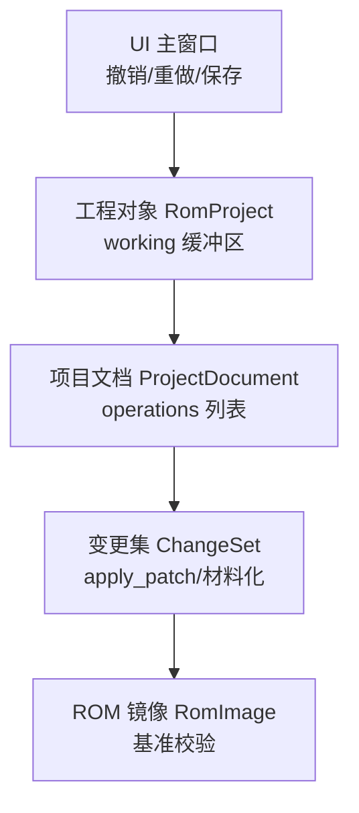
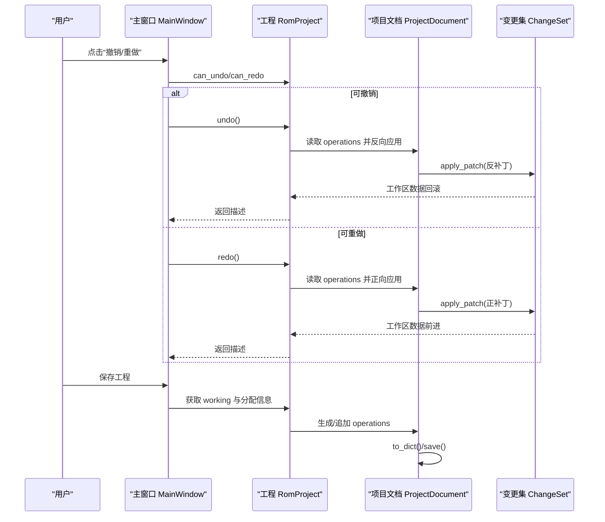
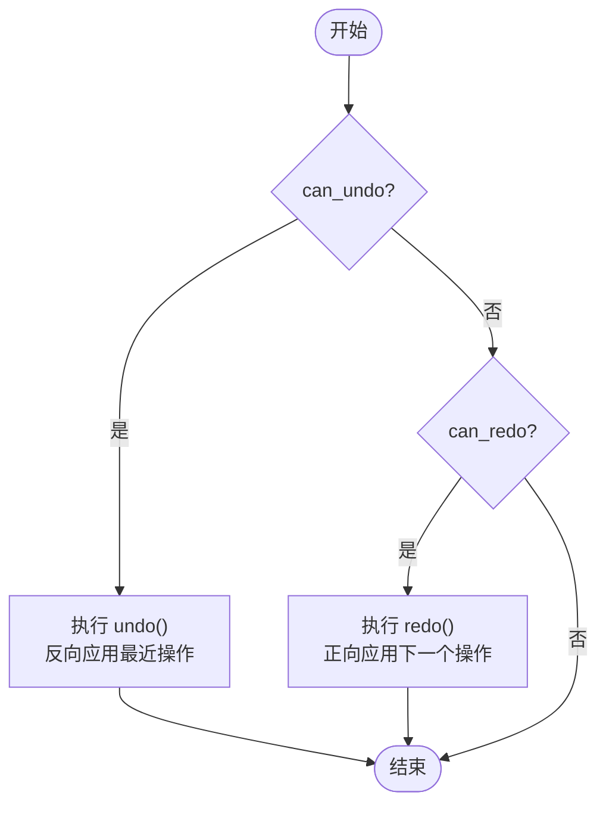
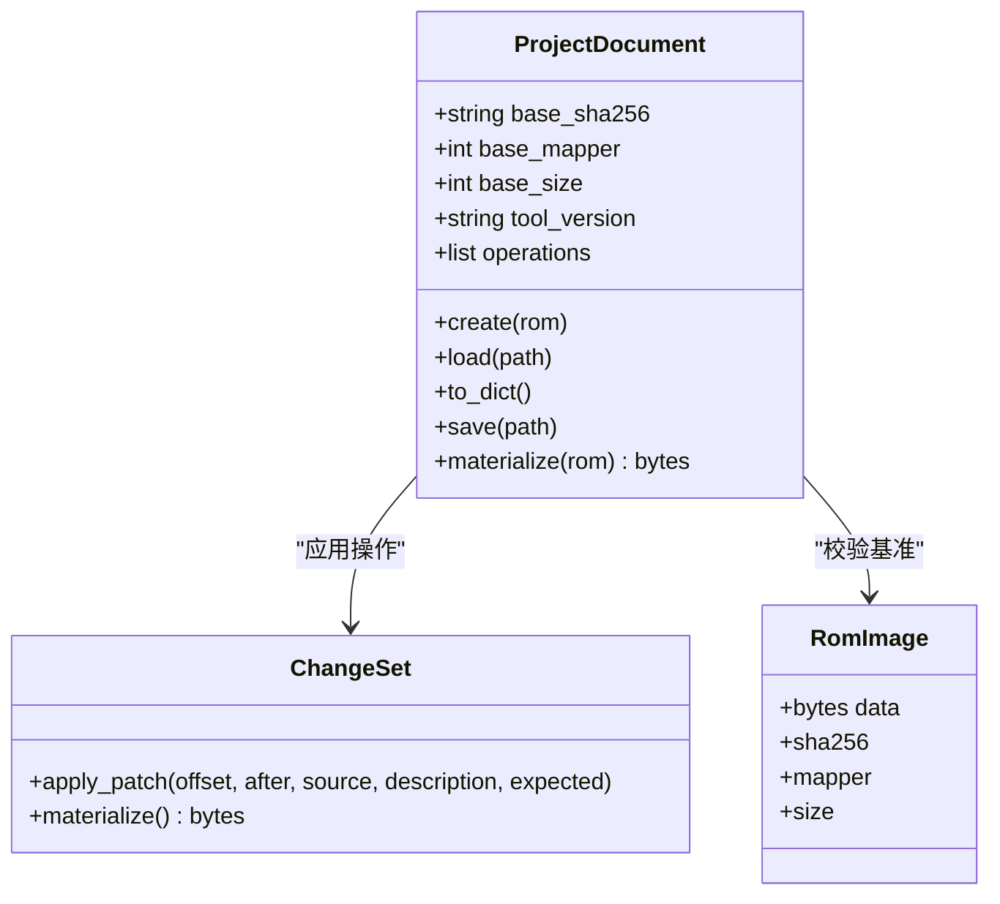
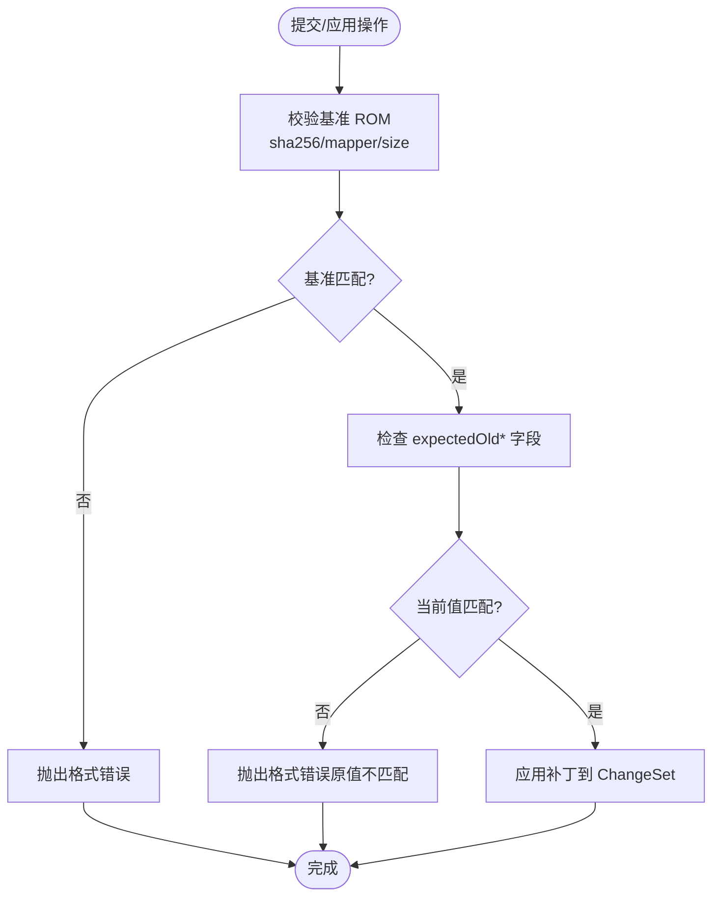
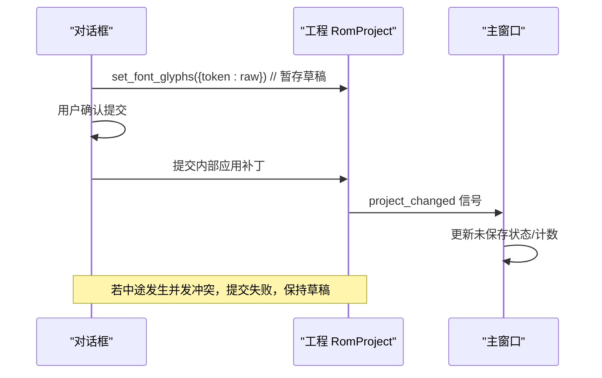
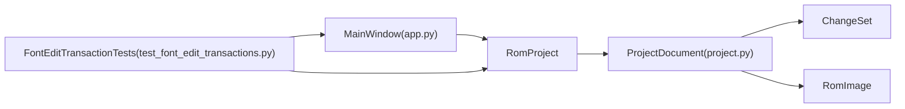

# 事务处理系统

<cite>
**本文引用的文件**
- [app.py](file://src/dc_modifier/app.py)
- [project.py](file://src/fc_editor/project.py)
- [test_font_edit_transactions.py](file://tests/test_font_edit_transactions.py)
</cite>

## 目录
1. [简介](#简介)
2. [项目结构](#项目结构)
3. [核心组件](#核心组件)
4. [架构总览](#架构总览)
5. [详细组件分析](#详细组件分析)
6. [依赖关系分析](#依赖关系分析)
7. [性能考虑](#性能考虑)
8. [故障排查指南](#故障排查指南)
9. [结论](#结论)
10. [附录](#附录)

## 简介
本技术文档围绕“事务处理系统”展开，聚焦以下目标：
- 撤销/重做机制的实现原理：命令模式、状态快照管理、操作历史记录。
- 并发控制策略：锁机制、版本控制、冲突解决。
- 项目文档的保存与加载：增量保存、差异计算、压缩存储（在本仓库中为 JSON 序列化与校验）。
- 事务边界管理、批量操作支持、回滚策略。
- 可撤销操作示例、复杂事务处理、内存优化技巧。
- 事务性能优化与调试方法。

该系统的核心由 UI 层（主窗口）与工程模型层（项目文档与变更集）组成，通过“操作记录 + 应用/回滚”的方式实现可撤销/重做的能力，并在提交时进行一致性校验与冲突检测。

## 项目结构
- UI 入口与事务菜单：位于 dc_modifier.app 的主窗口中，提供撤销/重做动作、工程保存/打开、未保存变更检测等。
- 工程模型与持久化：位于 fc_editor.project 的项目文档类，负责将用户操作序列化为“操作列表”，并能在加载时按顺序应用到 ROM 数据上。
- 测试用例：tests.test_font_edit_transactions 覆盖字体编辑中的事务行为，包括并发冲突检测、撤销回滚、批量导入等。

图表来源
- [app.py:276-484](file://src/dc_modifier/app.py#L276-L484)
- [project.py:48-121](file://src/fc_editor/project.py#L48-L121)
- [project.py:434-800](file://src/fc_editor/project.py#L434-L800)

章节来源
- [app.py:276-484](file://src/dc_modifier/app.py#L276-L484)
- [project.py:48-121](file://src/fc_editor/project.py#L48-L121)

## 核心组件
- 主窗口 MainWindow：维护工程实例、未保存快照、撤销/重做动作绑定、页面草稿提交、未保存变更检测。
- 项目文档 ProjectDocument：以 JSON 形式持久化“操作列表”，包含基础 ROM 信息（哈希、Mapper、大小），并提供 materialize 将操作应用到 ROM 数据。
- 变更集 ChangeSet：在 materialize 过程中累积补丁，支持预期值校验与描述性元数据。
- 测试 FontEditTransactionTests：验证字体编辑对话框的事务语义，包括并发冲突、撤销回滚、批量导入等。

章节来源
- [app.py:276-484](file://src/dc_modifier/app.py#L276-L484)
- [project.py:48-121](file://src/fc_editor/project.py#L48-L121)
- [project.py:434-800](file://src/fc_editor/project.py#L434-L800)
- [test_font_edit_transactions.py:1-223](file://tests/test_font_edit_transactions.py#L1-L223)

## 架构总览
下图展示了从 UI 到工程模型的调用链，以及撤销/重做与保存/加载的关键路径。

图表来源
- [app.py:990-1021](file://src/dc_modifier/app.py#L990-L1021)
- [project.py:102-121](file://src/fc_editor/project.py#L102-L121)
- [project.py:434-800](file://src/fc_editor/project.py#L434-L800)

## 详细组件分析

### 撤销/重做机制（命令模式与历史栈）
- 命令模式体现：每个“操作”被编码为结构化字典（如 unit.set_field、map.replace 等），具备可逆性（正向/反向补丁）。
- 历史栈：ProjectDocument.operations 作为操作历史；undo/redo 通过遍历或索引访问该列表执行反向/正向应用。
- 状态快照：主窗口维护 _saved_snapshot 与 _saved_allocations，用于判断是否有未保存变更；同时 map_page 的草稿也参与未保存检测。

图表来源
- [app.py:990-1021](file://src/dc_modifier/app.py#L990-L1021)
- [project.py:434-800](file://src/fc_editor/project.py#L434-L800)

章节来源
- [app.py:990-1021](file://src/dc_modifier/app.py#L990-L1021)
- [project.py:434-800](file://src/fc_editor/project.py#L434-L800)

### 项目文档保存与加载（增量保存、差异计算、压缩存储）
- 保存：ProjectDocument.to_dict() 输出 schemaVersion、toolVersion、base（sha256/mapper/size）、operations；save() 写入 JSON 文本。
- 加载：ProjectDocument.load() 解析 JSON，迁移旧版本，校验 base 与 operations 结构。
- 增量/差异：operations 即为“差异”；materialize() 按序应用这些差异到 ROM 数据，得到最终 working。
- 压缩存储：当前实现为 JSON 文本，未使用二进制压缩；可通过外部工具对 .dcproj 进行压缩归档。

图表来源
- [project.py:48-121](file://src/fc_editor/project.py#L48-L121)
- [project.py:434-800](file://src/fc_editor/project.py#L434-L800)

章节来源
- [project.py:48-121](file://src/fc_editor/project.py#L48-L121)
- [project.py:434-800](file://src/fc_editor/project.py#L434-L800)

### 并发控制与冲突解决
- 版本控制：ProjectDocument.base 记录基准 ROM 的 sha256/mapper/size；materialize() 会校验当前 ROM 是否与基准一致，防止在不同 ROM 上误用操作。
- 冲突检测：许多操作携带 expectedOld* 字段（如 expectedOldValue、expectedOldDigest、expectedOldPointer），在 materialize 时对比当前值，不一致则抛出错误，避免覆盖他人修改。
- 并发场景：测试用例模拟了“另一处已提交更改”的情况，对话框在提交前检测到冲突并拒绝接受，保持工作区不变。

图表来源
- [project.py:400-432](file://src/fc_editor/project.py#L400-L432)
- [project.py:535-800](file://src/fc_editor/project.py#L535-L800)
- [test_font_edit_transactions.py:88-104](file://tests/test_font_edit_transactions.py#L88-L104)

章节来源
- [project.py:400-432](file://src/fc_editor/project.py#L400-L432)
- [project.py:535-800](file://src/fc_editor/project.py#L535-L800)
- [test_font_edit_transactions.py:88-104](file://tests/test_font_edit_transactions.py#L88-L104)

### 事务边界管理与批量操作
- 事务边界：对话框（如字体库）在 accept/reject 时决定提交或丢弃草稿；主窗口在关闭或切换工程时提示未保存变更。
- 批量操作：ProjectDocument 提供 add_resource_allocation、add_map_replace、add_scenario_layout_replace 等方法，将多个变更打包为 operations；测试覆盖了批量导入字体的场景。
- 回滚策略：撤销通过反向应用操作实现；取消对话框操作不会污染其他编辑，且不会复活之前的草稿。

图表来源
- [test_font_edit_transactions.py:45-68](file://tests/test_font_edit_transactions.py#L45-L68)
- [test_font_edit_transactions.py:179-197](file://tests/test_font_edit_transactions.py#L179-L197)
- [app.py:731-742](file://src/dc_modifier/app.py#L731-L742)

章节来源
- [test_font_edit_transactions.py:45-68](file://tests/test_font_edit_transactions.py#L45-L68)
- [test_font_edit_transactions.py:179-197](file://tests/test_font_edit_transactions.py#L179-L197)
- [app.py:731-742](file://src/dc_modifier/app.py#L731-L742)

### 代码级示例（路径引用）
- 实现可撤销操作：参考“机体字段设置”“地图替换”“场景部署替换”等操作在 materialize 中的分支逻辑。
  - 路径：[project.py:535-800](file://src/fc_editor/project.py#L535-L800)
- 处理复杂事务：资源分配与多类型操作的混合应用，注意 expectedOld* 校验与异常处理。
  - 路径：[project.py:225-260](file://src/fc_editor/project.py#L225-L260)
  - 路径：[project.py:408-432](file://src/fc_editor/project.py#L408-L432)
- 优化内存使用：
  - 使用 ChangeSet 累积补丁而非频繁复制完整 ROM 数据。
  - 仅在必要时计算摘要（如地图语义摘要），减少重复计算。
  - 路径：[project.py:534-800](file://src/fc_editor/project.py#L534-L800)

章节来源
- [project.py:225-260](file://src/fc_editor/project.py#L225-L260)
- [project.py:408-432](file://src/fc_editor/project.py#L408-L432)
- [project.py:534-800](file://src/fc_editor/project.py#L534-L800)

## 依赖关系分析
- UI 层依赖工程对象 RomProject，通过其接口触发撤销/重做与保存。
- 工程对象依赖项目文档 ProjectDocument，后者依赖变更集 ChangeSet 与 ROM 镜像 RomImage。
- 测试用例直接驱动对话框与工程对象，验证事务语义。

图表来源
- [app.py:276-484](file://src/dc_modifier/app.py#L276-L484)
- [project.py:48-121](file://src/fc_editor/project.py#L48-L121)
- [project.py:434-800](file://src/fc_editor/project.py#L434-L800)
- [test_font_edit_transactions.py:1-223](file://tests/test_font_edit_transactions.py#L1-L223)

章节来源
- [app.py:276-484](file://src/dc_modifier/app.py#L276-L484)
- [project.py:48-121](file://src/fc_editor/project.py#L48-L121)
- [project.py:434-800](file://src/fc_editor/project.py#L434-L800)
- [test_font_edit_transactions.py:1-223](file://tests/test_font_edit_transactions.py#L1-L223)

## 性能考虑
- 避免全量拷贝：通过 ChangeSet 累积补丁，减少中间态数据复制。
- 延迟计算：仅在需要时计算语义摘要（如地图），降低 CPU 开销。
- 合理粒度：将相关操作合并为单一事务（如批量导入字体），减少多次 UI 刷新与状态同步。
- 快照最小化：主窗口仅保存必要的字节快照与分配元组，避免额外大对象驻留。

## 故障排查指南
- 基准不匹配：当项目文件的 base 与当前 ROM 不一致时，materialize 会抛出格式错误。检查 ROM 是否被替换或损坏。
  - 路径：[project.py:400-432](file://src/fc_editor/project.py#L400-L432)
- 原值不匹配：expectedOld* 校验失败，说明存在并发修改或操作顺序错误。需重新获取最新数据后重试。
  - 路径：[project.py:535-800](file://src/fc_editor/project.py#L535-L800)
- 对话框提交被拒：测试显示当检测到并发提交时，对话框会弹出警告并拒绝接受，保持工作区不变。
  - 路径：[test_font_edit_transactions.py:88-104](file://tests/test_font_edit_transactions.py#L88-L104)
- 未保存变更提示：主窗口在关闭或切换工程时会检测未保存变更，避免丢失草稿。
  - 路径：[app.py:731-742](file://src/dc_modifier/app.py#L731-L742)

章节来源
- [project.py:400-432](file://src/fc_editor/project.py#L400-L432)
- [project.py:535-800](file://src/fc_editor/project.py#L535-L800)
- [test_font_edit_transactions.py:88-104](file://tests/test_font_edit_transactions.py#L88-L104)
- [app.py:731-742](file://src/dc_modifier/app.py#L731-L742)

## 结论
本事务处理系统通过“操作记录 + 应用/回滚”的模式实现了稳健的撤销/重做能力，并以 JSON 形式的操作列表实现项目的增量保存与加载。通过基准校验与原值校验，系统在并发环境下具备良好的冲突检测能力。结合变更集的补丁累积与最小化快照策略，系统在内存与性能方面表现良好。测试用例进一步验证了字体编辑场景下的事务语义，包括并发冲突、撤销回滚与批量导入。

## 附录
- 关键 API 与流程参考：
  - 撤销/重做：[app.py:990-1021](file://src/dc_modifier/app.py#L990-L1021)
  - 项目文档保存/加载：[project.py:48-121](file://src/fc_editor/project.py#L48-L121)
  - 操作应用与校验：[project.py:434-800](file://src/fc_editor/project.py#L434-L800)
  - 字体事务测试：[test_font_edit_transactions.py:1-223](file://tests/test_font_edit_transactions.py#L1-L223)