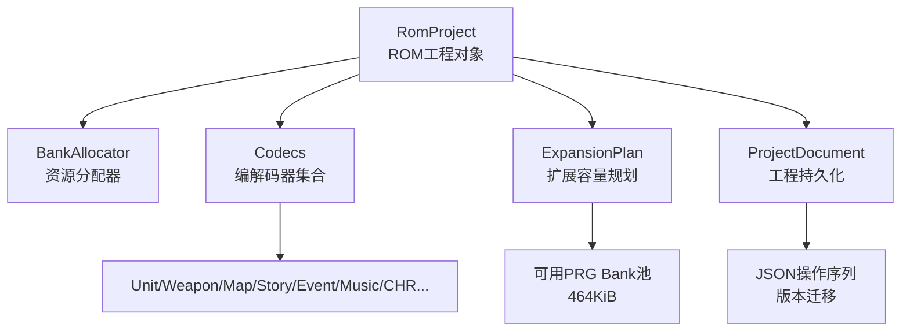
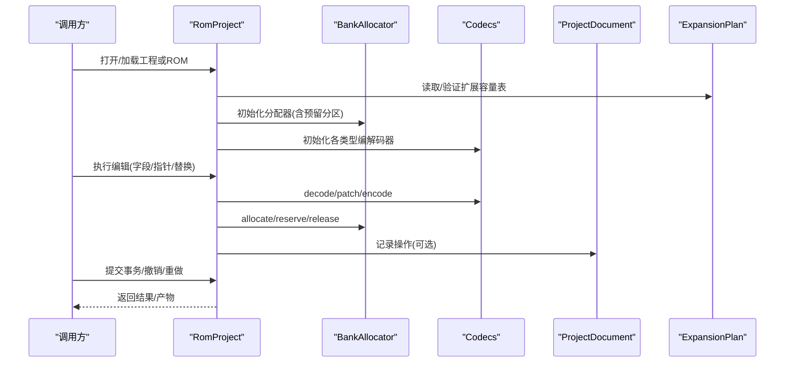
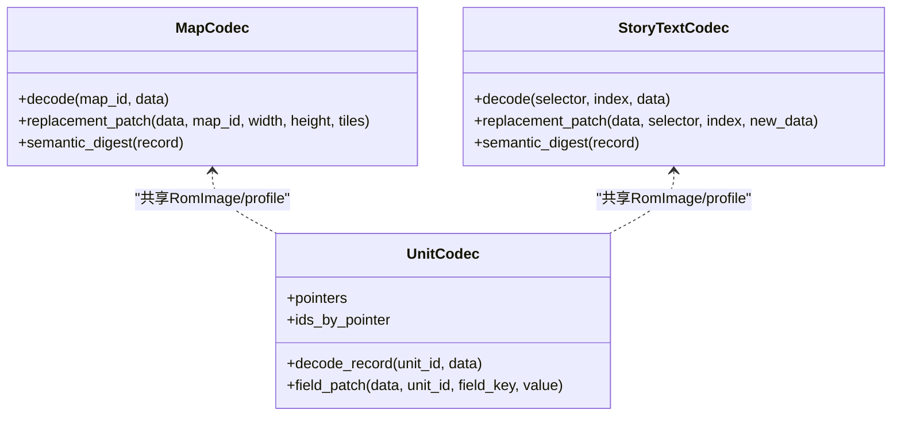
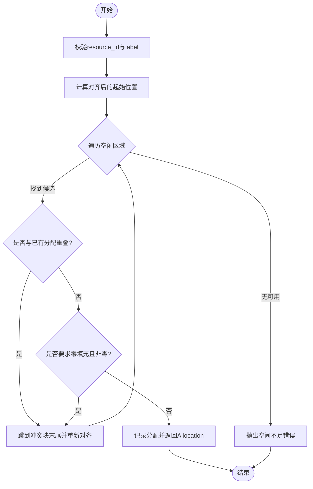
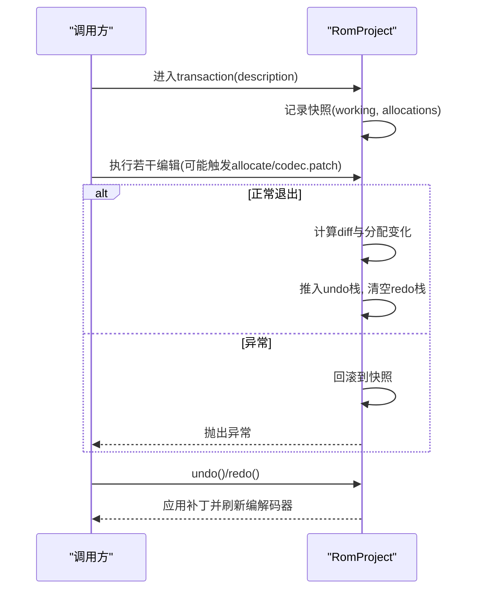
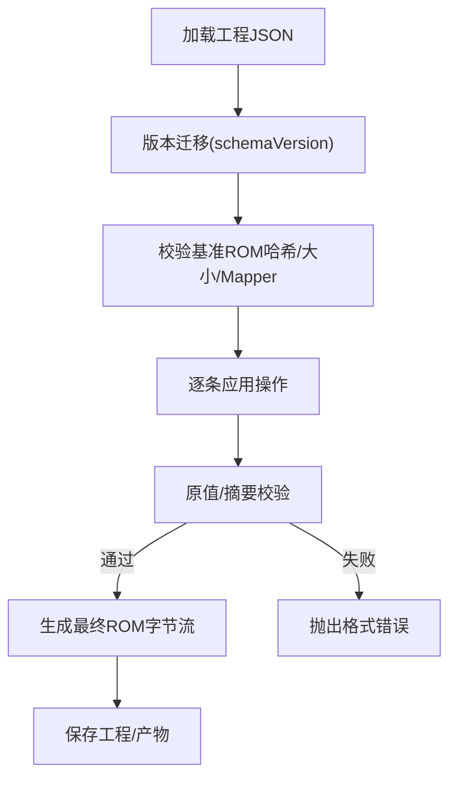
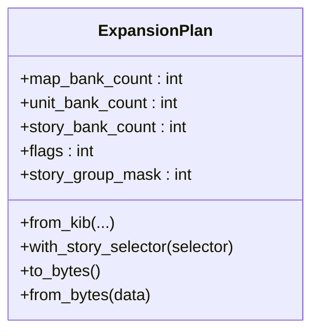
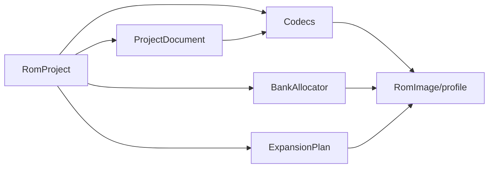

# 核心模块详解

<cite>
**本文引用的文件**
- [src/fc_rom_editor_core.py](file://src/fc_rom_editor_core.py)
- [src/fc_editor/resources.py](file://src/fc_editor/resources.py)
- [src/fc_editor/project.py](file://src/fc_editor/project.py)
- [src/fc_editor/expansion.py](file://src/fc_editor/expansion.py)
- [src/fc_editor/codecs/__init__.py](file://src/fc_editor/codecs/__init__.py)
- [src/dc_modifier/__init__.py](file://src/dc_modifier/__init__.py)
</cite>

## 目录
1. [简介](#简介)
2. [项目结构](#项目结构)
3. [核心组件](#核心组件)
4. [架构总览](#架构总览)
5. [详细组件分析](#详细组件分析)
6. [依赖关系分析](#依赖关系分析)
7. [性能考虑](#性能考虑)
8. [故障排查指南](#故障排查指南)
9. [结论](#结论)
10. [附录：ROM编辑使用示例](#附录rom编辑使用示例)

## 简介
本技术文档聚焦 DC 修改器核心模块，围绕以下主题展开：编解码器系统（Codec 接口与扩展）、资源分配器的 Bank 管理策略与冲突检测、事务处理系统的撤销/重做与快照机制、工程文件的保存加载与版本兼容，以及基于这些核心模块的 ROM 编辑实践。文档同时提供架构图、流程图与类图，帮助读者从高层到代码级全面理解系统。

## 项目结构
DC 修改器核心由“ROM 工程对象”“资源分配器”“编解码器集合”“工程持久化”“扩展容量规划”等模块组成，整体组织如下：
- RomProject：封装 ROM 镜像、各数据类型的编解码器、资源分配器、事务与撤销重做栈。
- BankAllocator：在 profile 声明的“空闲 PRG 区域”内进行确定性分配，支持对齐、单 Bank 约束、零填充检查与冲突检测。
- Codec 体系：按数据类型划分（机体、武器、地图、剧情文本、事件脚本、音乐、CHR 等），通过统一导出接口集中暴露。
- ProjectDocument：工程 JSON 的读写、操作序列记录、版本迁移与校验。
- ExpansionPlan：将 464 KiB 可管理池划分为地图、机体、剧情三类配额，并固化到 ROM 元数据中。

图表来源
- [src/fc_rom_editor_core.py:463-618](file://src/fc_rom_editor_core.py#L463-L618)
- [src/fc_editor/resources.py:280-413](file://src/fc_editor/resources.py#L280-L413)
- [src/fc_editor/expansion.py:84-175](file://src/fc_editor/expansion.py#L84-L175)
- [src/fc_editor/project.py:48-121](file://src/fc_editor/project.py#L48-L121)
- [src/fc_editor/codecs/__init__.py:1-47](file://src/fc_editor/codecs/__init__.py#L1-L47)

章节来源
- [src/fc_rom_editor_core.py:463-618](file://src/fc_rom_editor_core.py#L463-L618)
- [src/fc_editor/resources.py:280-413](file://src/fc_editor/resources.py#L280-L413)
- [src/fc_editor/expansion.py:84-175](file://src/fc_editor/expansion.py#L84-L175)
- [src/fc_editor/project.py:48-121](file://src/fc_editor/project.py#L48-L121)
- [src/fc_editor/codecs/__init__.py:1-47](file://src/fc_editor/codecs/__init__.py#L1-L47)

## 核心组件
- RomProject：维护 ROM 原始数据与工作副本，初始化各类编解码器，提供事务、撤销/重做、构建产物输出能力。
- BankAllocator：面向 profile 的空闲 PRG 区域进行分配，保证对齐、单 Bank 边界、零填充、冲突检测。
- Codecs：为每种 ROM 数据结构提供 decode/encode/patch 能力，并通过包导出统一入口。
- ProjectDocument：以 JSON 形式记录基准 ROM 信息与操作序列，支持版本迁移与材料化生成最终 ROM。
- ExpansionPlan：将可管理池切分为地图、机体、剧情三部分，并以固定格式写入 ROM 元数据区。

章节来源
- [src/fc_rom_editor_core.py:463-618](file://src/fc_rom_editor_core.py#L463-L618)
- [src/fc_editor/resources.py:280-413](file://src/fc_editor/resources.py#L280-L413)
- [src/fc_editor/codecs/__init__.py:1-47](file://src/fc_editor/codecs/__init__.py#L1-L47)
- [src/fc_editor/project.py:48-121](file://src/fc_editor/project.py#L48-L121)
- [src/fc_editor/expansion.py:84-175](file://src/fc_editor/expansion.py#L84-L175)

## 架构总览
下图展示核心模块间的调用关系与数据流向：RomProject 作为协调者，组合 BankAllocator 与多种 Codec；ProjectDocument 负责工程持久化；ExpansionPlan 定义 ROM 容量布局。

图表来源
- [src/fc_rom_editor_core.py:463-785](file://src/fc_rom_editor_core.py#L463-L785)
- [src/fc_editor/resources.py:280-413](file://src/fc_editor/resources.py#L280-L413)
- [src/fc_editor/project.py:408-800](file://src/fc_editor/project.py#L408-L800)
- [src/fc_editor/expansion.py:84-175](file://src/fc_editor/expansion.py#L84-L175)

## 详细组件分析

### 编解码器系统（Codec）
- 设计要点
  - 按数据类型拆分实现，如 UnitCodec、WeaponCodec、MapCodec、StoryTextCodec、BattleMusicCodec、ChrCodec 等，均通过 codecs 包统一导出。
  - 每个 Codec 通常提供 decode、encode、field_patch/reference_patch/replacement_patch 等方法，用于安全地定位偏移、校验原值、生成补丁。
  - 编解码器与 RomImage/profile 绑定，确保在不同 ROM 变体下正确解析指针表、窗口基址与容量。
- 扩展开发指南
  - 新增数据类型时，创建独立 codec 文件并在 __init__.py 中导出。
  - 若涉及指针表或 Bank 映射，需结合 profile 与 expansion 中的常量计算绝对偏移。
  - 对可变长度或跨 Bank 的数据，优先采用“原地 patch + 语义摘要”的方式，避免全量重写。
- 典型流程（以地图为例）
  - 读取当前地图记录 → 校验语义摘要 → 生成替换补丁 → 应用到工作副本 → 更新指针表/目录。

图表来源
- [src/fc_editor/codecs/__init__.py:1-47](file://src/fc_editor/codecs/__init__.py#L1-L47)
- [src/fc_rom_editor_core.py:463-618](file://src/fc_rom_editor_core.py#L463-L618)

章节来源
- [src/fc_editor/codecs/__init__.py:1-47](file://src/fc_editor/codecs/__init__.py#L1-L47)
- [src/fc_rom_editor_core.py:463-618](file://src/fc_rom_editor_core.py#L463-L618)

### 资源分配器（BankAllocator）
- Bank 管理策略
  - 仅能在 profile 声明的“空闲 PRG 区域”内分配，严格限制范围。
  - 支持对齐约束与单 Bank 模式（防止跨 Bank）。
  - 默认要求目标区域为零填充，避免覆盖已有数据。
- 内存分配算法
  - 顺序扫描每个空闲区域，按对齐值推进游标，遇到冲突则跳到冲突块末尾重新对齐。
  - 若 single_bank=True，当剩余空间不足一个 Bank 时直接跳过至下一个 Bank 起始并对齐。
- 冲突检测机制
  - 内部维护已分配列表，任何新分配都会与既有分配进行区间重叠检测。
  - 非法 ID、空标签、非 2 的幂对齐、越界范围等均会抛出异常。
- 复杂度与性能
  - reserve/allocate 时间复杂度近似 O(N)，N 为已分配项数量；可通过减少碎片与批量预留优化。
  - 建议将大对象尽量连续放置，减少后续分配时的扫描次数。

图表来源
- [src/fc_editor/resources.py:368-413](file://src/fc_editor/resources.py#L368-L413)
- [src/fc_editor/resources.py:334-354](file://src/fc_editor/resources.py#L334-L354)

章节来源
- [src/fc_editor/resources.py:280-413](file://src/fc_editor/resources.py#L280-L413)

### 事务处理与撤销重做
- 事务模型
  - 通过 transaction 上下文管理器包裹一组编辑操作，外层首次进入时创建快照（工作副本与分配状态）。
  - 事务成功提交后，比较前后差异，生成 EditPatch 列表与分配变更，推入撤销栈；重做栈清空。
  - 事务异常时，自动回滚到快照状态，并恢复分配器与动态编解码器。
- 撤销/重做
  - undo：应用 before 补丁，恢复之前的分配状态，刷新动态编解码器。
  - redo：应用 after 补丁，恢复之后的分配状态，刷新动态编解码器。
- 并发控制
  - 使用 _transaction_depth 计数支持嵌套事务；仅在顶层提交时生成历史条目。
  - 未提供多线程锁，建议在 UI 主线程串行调用。

图表来源
- [src/fc_rom_editor_core.py:692-785](file://src/fc_rom_editor_core.py#L692-L785)

章节来源
- [src/fc_rom_editor_core.py:692-785](file://src/fc_rom_editor_core.py#L692-L785)

### 工程保存加载与版本兼容
- 工程文件结构
  - 包含基准 ROM 信息（sha256、mapper、size）、工具版本与操作序列。
  - 支持 schemaVersion 迁移，旧版本自动升级到受支持版本。
- 材料化过程
  - 根据操作序列依次应用字段设置、指针引用、地图/场景替换、故事文本替换、战斗音乐绑定、资源分配等。
  - 每条操作在执行前进行原值校验（expectedOldValue/digest），确保多源协作下的可重复性。
- 兼容性
  - 通过 base_sha256/mapper/size 校验基准 ROM 一致性。
  - 资源分配操作禁止覆盖非零区域（除非是分区占位），避免破坏已有内容。

图表来源
- [src/fc_editor/project.py:48-121](file://src/fc_editor/project.py#L48-L121)
- [src/fc_editor/project.py:408-800](file://src/fc_editor/project.py#L408-L800)

章节来源
- [src/fc_editor/project.py:48-121](file://src/fc_editor/project.py#L48-L121)
- [src/fc_editor/project.py:408-800](file://src/fc_editor/project.py#L408-L800)

### 扩展容量规划（ExpansionPlan）
- 容量池
  - 可管理池为 464 KiB，排除音频与固定代码占用区域。
  - 支持三种配额：地图、机体、剧情，总和不超过池大小。
- 规则与约束
  - 机体配额仅支持 48/64/80 KiB。
  - 剧情配额必须为 16 KiB 的整数倍，最多支持 7 个已验证文本组（每组 16 KiB）。
  - 剧情组位图与 Bank 绑定表必须一致，且不能重复绑定同一 Bank pair。
- 序列化
  - 以固定头部写入 ROM 元数据区，包含 CRC 校验，便于运行时识别与切换。

图表来源
- [src/fc_editor/expansion.py:84-175](file://src/fc_editor/expansion.py#L84-L175)
- [src/fc_editor/expansion.py:277-318](file://src/fc_editor/expansion.py#L277-L318)

章节来源
- [src/fc_editor/expansion.py:84-175](file://src/fc_editor/expansion.py#L84-L175)
- [src/fc_editor/expansion.py:277-318](file://src/fc_editor/expansion.py#L277-L318)

## 依赖关系分析
- RomProject 依赖：
  - RomImage/profile：提供 ROM 结构与常量。
  - BankAllocator：资源分配。
  - 多个 Codec：数据编解码与补丁生成。
  - ExpansionPlan：容量规划。
  - ProjectDocument：工程持久化。
- 耦合与内聚
  - 编解码器之间低耦合，通过 RomImage/profile 解耦具体 ROM 布局。
  - BankAllocator 与 profile 强相关，但对外只暴露 Allocation 抽象，利于测试与替换。
- 外部依赖
  - 无第三方库依赖，纯 Python 标准库实现。

图表来源
- [src/fc_rom_editor_core.py:463-618](file://src/fc_rom_editor_core.py#L463-L618)
- [src/fc_editor/resources.py:280-413](file://src/fc_editor/resources.py#L280-L413)
- [src/fc_editor/expansion.py:84-175](file://src/fc_editor/expansion.py#L84-L175)
- [src/fc_editor/project.py:408-800](file://src/fc_editor/project.py#L408-L800)

章节来源
- [src/fc_rom_editor_core.py:463-618](file://src/fc_rom_editor_core.py#L463-L618)
- [src/fc_editor/resources.py:280-413](file://src/fc_editor/resources.py#L280-L413)
- [src/fc_editor/expansion.py:84-175](file://src/fc_editor/expansion.py#L84-L175)
- [src/fc_editor/project.py:408-800](file://src/fc_editor/project.py#L408-L800)

## 性能考虑
- 编解码器
  - 优先使用 field_patch/reference_patch/replacement_patch，避免全量重写。
  - 对大对象（地图、故事文本）采用分块处理与语义摘要，减少不必要拷贝。
- 资源分配
  - 尽量一次性申请大块连续空间，减少碎片；必要时使用 single_bank=False 放宽跨 Bank 限制。
  - 合理设置 alignment，避免频繁对齐导致的扫描开销。
- 事务与撤销
  - 将相关编辑放入同一事务，减少多次快照与 diff 成本。
  - 控制单次事务规模，避免超大补丁导致内存压力。
- I/O
  - 使用原子写入避免中间态损坏；批量写盘优于频繁小写。

[本节为通用指导，不直接分析具体文件]

## 故障排查指南
- 常见错误与定位
  - 资源分配失败：检查 resource_id 格式、label 是否为空、对齐是否为 2 的幂、是否在空闲区域、是否与其他分配重叠。
  - 工程加载失败：确认基准 ROM 哈希/大小/Mapper 匹配；检查 schemaVersion 是否受支持。
  - 操作原值不匹配：核对 expectedOldValue/digest，确保多源协作时数据未被其他操作改变。
  - 扩展容量表无效：检查 CRC、保留字段、剧情组位图与绑定表一致性。
- 调试建议
  - 打印 Allocation 列表与冲突详情，定位重叠来源。
  - 使用 transaction 包裹可疑操作，快速回滚对比。
  - 利用 ProjectDocument 的操作序列回放，复现问题。

章节来源
- [src/fc_editor/resources.py:334-413](file://src/fc_editor/resources.py#L334-L413)
- [src/fc_editor/project.py:408-800](file://src/fc_editor/project.py#L408-L800)
- [src/fc_editor/expansion.py:277-318](file://src/fc_editor/expansion.py#L277-L318)

## 结论
DC 修改器核心模块以 RomProject 为中心，将编解码器、资源分配、事务与工程持久化有机整合，形成稳定、可扩展、可审计的 ROM 编辑平台。通过严格的容量规划与冲突检测、可回滚的事务机制、以及版本兼容的工程文件，既保证了编辑安全性，又提升了扩展性与可维护性。

[本节为总结，不直接分析具体文件]

## 附录：ROM编辑使用示例
以下为基于核心模块的典型编辑流程（以“修改机体字段”和“分配新资源”为例），请对照对应源码路径参考实现细节：
- 打开工程或 ROM
  - 参考：[RomProject.load/load_project:638-674](file://src/fc_rom_editor_core.py#L638-L674)
- 进入事务并执行编辑
  - 使用 transaction 包裹一系列操作，确保原子性与可撤销。
  - 参考：[transaction上下文:714-744](file://src/fc_rom_editor_core.py#L714-L744)
- 修改机体字段
  - 通过 UnitCodec.field_patch 生成补丁并应用到工作副本。
  - 参考：[RomProject初始化与编解码器装配:463-618](file://src/fc_rom_editor_core.py#L463-L618)
- 分配新资源
  - 使用 BankAllocator.allocate 获取 Allocation，并将数据写入工作副本。
  - 参考：[allocate方法:368-413](file://src/fc_editor/resources.py#L368-L413)
- 提交事务并撤销/重做
  - 提交后自动生成历史条目；支持 undo/redo。
  - 参考：[_finish_mutation/undo/redo:692-785](file://src/fc_rom_editor_core.py#L692-L785)
- 保存工程与构建产物
  - 使用 ProjectDocument 记录操作并 materialize 生成 ROM；可输出 IPS 补丁。
  - 参考：[ProjectDocument.materialize:434-800](file://src/fc_editor/project.py#L434-L800)、[make_ips/apply_ips:386-433](file://src/fc_rom_editor_core.py#L386-L433)

章节来源
- [src/fc_rom_editor_core.py:386-433](file://src/fc_rom_editor_core.py#L386-L433)
- [src/fc_rom_editor_core.py:463-785](file://src/fc_rom_editor_core.py#L463-L785)
- [src/fc_editor/resources.py:368-413](file://src/fc_editor/resources.py#L368-L413)
- [src/fc_editor/project.py:434-800](file://src/fc_editor/project.py#L434-L800)