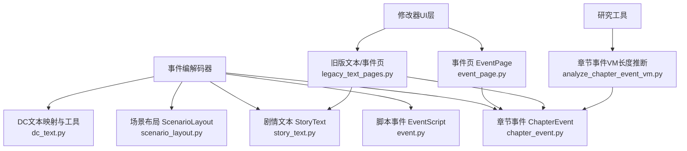
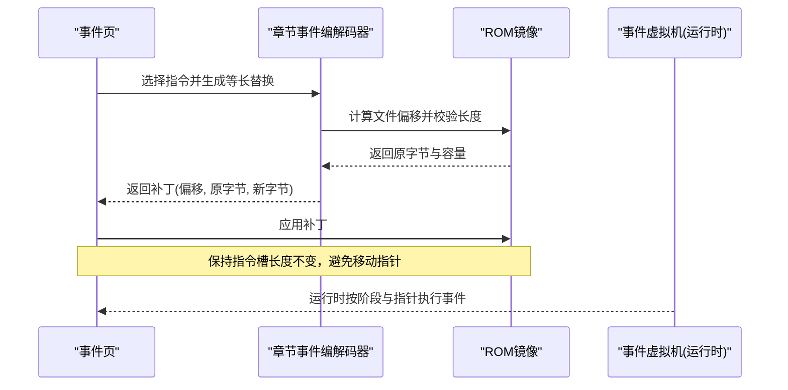
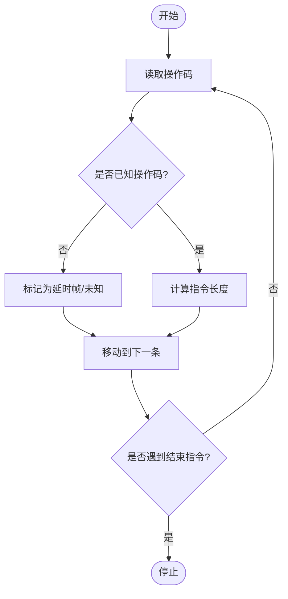
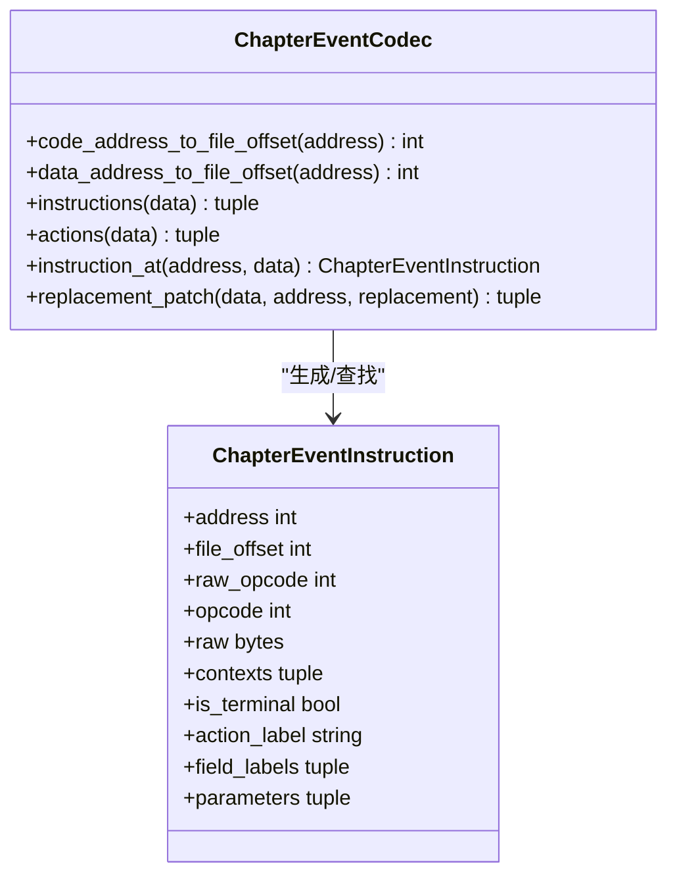
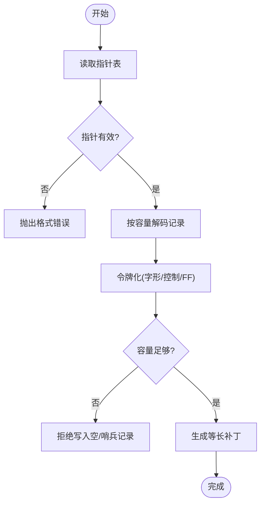
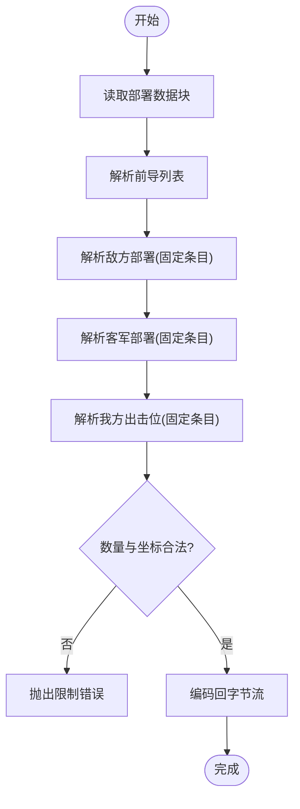
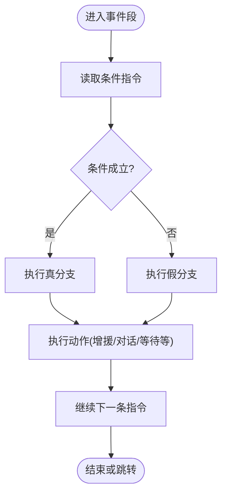
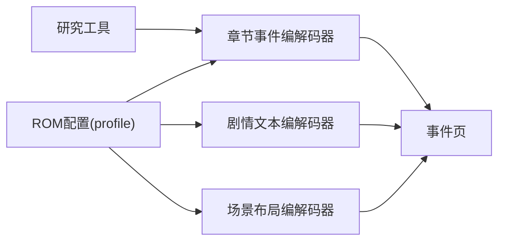

# 事件编解码器

<cite>
**本文引用的文件**
- [event.py](file://src/fc_editor/codecs/event.py)
- [chapter_event.py](file://src/fc_editor/codecs/chapter_event.py)
- [story_text.py](file://src/fc_editor/codecs/story_text.py)
- [scenario_layout.py](file://src/fc_editor/codecs/scenario_layout.py)
- [dc_text.py](file://src/fc_editor/dc_text.py)
- [legacy_text_pages.py](file://src/dc_modifier/legacy_text_pages.py)
- [event_page.py](file://src/dc_modifier/event_page.py)
- [analyze_chapter_event_vm.py](file://tools/research/analyze_chapter_event_vm.py)
</cite>

## 目录
1. [简介](#简介)
2. [项目结构](#项目结构)
3. [核心组件](#核心组件)
4. [架构总览](#架构总览)
5. [详细组件分析](#详细组件分析)
6. [依赖关系分析](#依赖关系分析)
7. [性能与容量优化](#性能与容量优化)
8. [故障排查指南](#故障排查指南)
9. [结论](#结论)
10. [附录：编写示例与流程](#附录编写示例与流程)

## 简介
本技术文档围绕游戏事件系统的编解码实现，覆盖以下动态内容：
- 脚本事件（EventScript）：固定银行可视事件虚拟机指令的无损解析与校验。
- 章节事件（ChapterEvent）：关卡内阶段化事件指令集、指针表、上下文判定与等长替换。
- 剧情文本（StoryText）：按指针分组的本地化文本记录、字形控制码识别、容量边界保护。
- 说服规则（PersuasionRule）：通过条件判断与跳转指令构成的分支剧情逻辑。
- 场景布局（ScenarioLayout）：前导列表、敌军/客军部署与我方出击位序列化与校验。

文档同时说明事件执行流程、状态管理、验证规则、调试工具与常见问题解决方案，并提供可操作的编写示例与配置流程。

## 项目结构
事件编解码相关代码主要分布在编辑器核心与修改器页面中：
- 编解码器位于 fc_editor/codecs 下，提供对 ROM 数据的无损读取、校验与等长写入能力。
- dc_text 提供 DC 专用文本映射与章节标题等辅助信息。
- dc_modifier 下的 event_page 与 legacy_text_pages 提供可视化编辑界面与草稿提交机制。
- tools/research 提供基于 6502 反汇编的事件长度推断工具，用于验证指令长度表。

**图表来源**
- [event.py:28-46](file://src/fc_editor/codecs/event.py#L28-L46)
- [chapter_event.py:11-22](file://src/fc_editor/codecs/chapter_event.py#L11-L22)
- [story_text.py:17-65](file://src/fc_editor/codecs/story_text.py#L17-L65)
- [scenario_layout.py:12-78](file://src/fc_editor/codecs/scenario_layout.py#L12-L78)
- [dc_text.py:321-407](file://src/fc_editor/dc_text.py#L321-L407)
- [event_page.py:31-43](file://src/dc_modifier/event_page.py#L31-L43)
- [legacy_text_pages.py:20-23](file://src/dc_modifier/legacy_text_pages.py#L20-L23)
- [analyze_chapter_event_vm.py:86-104](file://tools/research/analyze_chapter_event_vm.py#L86-L104)

**章节来源**
- [event.py:28-46](file://src/fc_editor/codecs/event.py#L28-L46)
- [chapter_event.py:11-22](file://src/fc_editor/codecs/chapter_event.py#L11-L22)
- [story_text.py:17-65](file://src/fc_editor/codecs/story_text.py#L17-L65)
- [scenario_layout.py:12-78](file://src/fc_editor/codecs/scenario_layout.py#L12-L78)
- [dc_text.py:321-407](file://src/fc_editor/dc_text.py#L321-L407)
- [event_page.py:31-43](file://src/dc_modifier/event_page.py#L31-L43)
- [legacy_text_pages.py:20-23](file://src/dc_modifier/legacy_text_pages.py#L20-L23)
- [analyze_chapter_event_vm.py:86-104](file://tools/research/analyze_chapter_event_vm.py#L86-L104)

## 核心组件
- 脚本事件编解码器（EventScriptCodec）：定义操作码规格、指令长度计算与无损解码，支持遇到结束指令时停止。
- 章节事件编解码器（ChapterEventCodec）：维护阶段指针表、指令长度表、上下文判定、等长替换与地址到文件偏移转换。
- 剧情文本编解码器（StoryTextCodec）：按组与指针读取文本记录，识别字形与控制码，保证 FF 终止符与容量边界。
- 场景布局编解码器（ScenarioLayoutCodec）：读取/写入部署数据块，限制敌/客/我方数量，校验坐标重叠与地图边界。
- DC文本工具（dc_text）：内置字符映射、章节标题、音乐标签与文本解码/压缩映射。
- 修改器事件页（EventPage/LegacyTextPages）：提供筛选、模板应用、原始字节粘贴、草稿冲突检测与批量提交。

**章节来源**
- [event.py:49-109](file://src/fc_editor/codecs/event.py#L49-L109)
- [chapter_event.py:150-328](file://src/fc_editor/codecs/chapter_event.py#L150-L328)
- [story_text.py:17-259](file://src/fc_editor/codecs/story_text.py#L17-L259)
- [scenario_layout.py:12-251](file://src/fc_editor/codecs/scenario_layout.py#L12-L251)
- [dc_text.py:321-407](file://src/fc_editor/dc_text.py#L321-L407)
- [event_page.py:66-701](file://src/dc_modifier/event_page.py#L66-L701)
- [legacy_text_pages.py:20-772](file://src/dc_modifier/legacy_text_pages.py#L20-L772)

## 架构总览
事件系统由“指令/数据”两层组成：
- 指令层：章节事件与脚本事件以操作码驱动，包含条件判断、跳转、增援、对话、等待、胜利/失败等。
- 数据层：剧情文本按组与指针组织；场景布局按前导/实体/位置序列存储。

**图表来源**
- [chapter_event.py:197-237](file://src/fc_editor/codecs/chapter_event.py#L197-L237)
- [chapter_event.py:262-328](file://src/fc_editor/codecs/chapter_event.py#L262-L328)
- [event_page.py:238-281](file://src/dc_modifier/event_page.py#L238-L281)

## 详细组件分析

### 脚本事件（EventScript）
- 操作码范围：0xF0—0xFF，涵盖内存写入、标志显示、映射切换、服务调用、状态设置、对象生成/移除/显隐、镜头移动、循环跳转与脚本结束。
- 指令长度：根据操作码与参数标志动态计算，支持可变长度（如批量写入/切换映射的参数计数）。
- 解码策略：逐条解析，遇到未知操作码仍保留原始字节，确保无损；遇到结束指令可选择停止。

**图表来源**
- [event.py:56-109](file://src/fc_editor/codecs/event.py#L56-L109)

**章节来源**
- [event.py:28-46](file://src/fc_editor/codecs/event.py#L28-L46)
- [event.py:56-109](file://src/fc_editor/codecs/event.py#L56-L109)

### 章节事件（ChapterEvent）
- 指令长度表：固定数组，含特殊处理（如打开文字窗口 $43 的长度随参数变化）。
- 上下文判定：根据阶段指针表确定每条指令所属章节与阶段，支持共享/分支块。
- 等长替换：严格校验新指令长度与原槽一致，防止破坏脚本对齐。
- 动作标签：增援、加入、转化、自爆、撤退、奖励、胜负等语义化标注。

**图表来源**
- [chapter_event.py:150-181](file://src/fc_editor/codecs/chapter_event.py#L150-L181)
- [chapter_event.py:183-328](file://src/fc_editor/codecs/chapter_event.py#L183-L328)

**章节来源**
- [chapter_event.py:11-22](file://src/fc_editor/codecs/chapter_event.py#L11-L22)
- [chapter_event.py:150-181](file://src/fc_editor/codecs/chapter_event.py#L150-L181)
- [chapter_event.py:183-328](file://src/fc_editor/codecs/chapter_event.py#L183-L328)

### 剧情文本（StoryText）
- 分组与指针：每组有独立指针表，首指针需匹配预期值，越界指针会报错。
- 字形与控制码：识别双字节中文字形码、控制码、扩展控制字节与 FF 终止符。
- 容量保护：按下一指针或末尾记录计算可用容量，禁止写入空/哨兵记录。
- 语义摘要：使用 SHA-256 对原始记录进行哈希，便于完整性检查。

**图表来源**
- [story_text.py:97-145](file://src/fc_editor/codecs/story_text.py#L97-L145)
- [story_text.py:156-259](file://src/fc_editor/codecs/story_text.py#L156-L259)

**章节来源**
- [story_text.py:17-65](file://src/fc_editor/codecs/story_text.py#L17-L65)
- [story_text.py:97-145](file://src/fc_editor/codecs/story_text.py#L97-L145)
- [story_text.py:156-259](file://src/fc_editor/codecs/story_text.py#L156-L259)

### 场景布局（ScenarioLayout）
- 数据结构：前导列表、敌方部署、客军部署、我方出击位，均以 FF 分隔。
- 限制与校验：最大敌军数、客军数、我方位置数；坐标需在地图范围内且不重叠。
- 编码/解码：严格按顺序写入/读取，保持容量边界，支持 round-trip 验证。

**图表来源**
- [scenario_layout.py:118-185](file://src/fc_editor/codecs/scenario_layout.py#L118-L185)
- [scenario_layout.py:187-251](file://src/fc_editor/codecs/scenario_layout.py#L187-L251)

**章节来源**
- [scenario_layout.py:12-78](file://src/fc_editor/codecs/scenario_layout.py#L12-L78)
- [scenario_layout.py:118-185](file://src/fc_editor/codecs/scenario_layout.py#L118-L185)
- [scenario_layout.py:187-251](file://src/fc_editor/codecs/scenario_layout.py#L187-L251)

### 说服规则（PersuasionRule）与分支剧情
- 条件判断：回合判定、开关判定、人物行动限制、队伍/战场存在、距离/范围判定、攻击/击落判定等。
- 分支结构：无条件跳转、条件成立/不成立跳转、否定判定，构成多分支剧情树。
- 执行控制：等待帧、播放音乐、关闭对白窗口、光标移动与等待等。

**图表来源**
- [chapter_event.py:42-134](file://src/fc_editor/codecs/chapter_event.py#L42-L134)

**章节来源**
- [chapter_event.py:42-134](file://src/fc_editor/codecs/chapter_event.py#L42-L134)

### 文本编码格式与格式化
- 字形编码：部分双字节为中文字形码，其余单字节为参数或控制码。
- 控制码：F0+ 为控制码，EE+ 为扩展控制字节，FF 为记录终止符。
- 显示格式化：将换行与控制码转换为可读符号，去除多余空白，限制长度以便预览。

**章节来源**
- [story_text.py:181-227](file://src/fc_editor/codecs/story_text.py#L181-L227)
- [dc_text.py:372-407](file://src/fc_editor/dc_text.py#L372-L407)

## 依赖关系分析
- 编解码器依赖 ROM 镜像与配置文件（profile），通过 bank/window/base 映射 CPU 地址到文件偏移。
- 修改器页面依赖编解码器进行指令解析、模板应用与草稿提交。
- 研究工具通过 6502 反汇编推断指令长度，用于验证长度表一致性。

**图表来源**
- [chapter_event.py:183-237](file://src/fc_editor/codecs/chapter_event.py#L183-L237)
- [story_text.py:33-65](file://src/fc_editor/codecs/story_text.py#L33-L65)
- [scenario_layout.py:19-78](file://src/fc_editor/codecs/scenario_layout.py#L19-L78)
- [event_page.py:238-281](file://src/dc_modifier/event_page.py#L238-L281)
- [analyze_chapter_event_vm.py:86-104](file://tools/research/analyze_chapter_event_vm.py#L86-L104)

**章节来源**
- [chapter_event.py:183-237](file://src/fc_editor/codecs/chapter_event.py#L183-L237)
- [story_text.py:33-65](file://src/fc_editor/codecs/story_text.py#L33-L65)
- [scenario_layout.py:19-78](file://src/fc_editor/codecs/scenario_layout.py#L19-L78)
- [event_page.py:238-281](file://src/dc_modifier/event_page.py#L238-L281)
- [analyze_chapter_event_vm.py:86-104](file://tools/research/analyze_chapter_event_vm.py#L86-L104)

## 性能与容量优化
- 等长替换：章节事件与剧情文本均强制等长写入，避免移动指针与重排数据，降低运行时开销。
- 容量边界：剧情文本按下一指针或末尾记录计算容量，防止溢出；场景布局限制实体数量与坐标范围。
- 缓存与去重：DC文本映射使用 LRU 缓存，减少重复解压与映射成本。
- 批量刷新：事件页在填充表格时禁用更新信号，减少 UI 重绘次数。

[本节为通用指导，无需特定文件引用]

## 故障排查指南
- 未知操作码：章节事件长度表中未识别的操作码会抛出格式错误；可使用研究工具反汇编验证。
- 指针越界：剧情文本与场景布局的指针必须在指定窗口内，否则抛出格式错误。
- 容量不足：剧情文本记录为空/哨兵时拒绝写入；场景布局超出最大实体数或坐标越界时报错。
- 草稿冲突：同一 ROM 偏移被多个页面同时修改时会提示冲突，需先还原再编辑。
- 指令长度不兼容：新指令长度与原槽不一致会被拒绝，需选择等长模板或调整参数。

**章节来源**
- [chapter_event.py:227-237](file://src/fc_editor/codecs/chapter_event.py#L227-L237)
- [story_text.py:122-145](file://src/fc_editor/codecs/story_text.py#L122-L145)
- [scenario_layout.py:79-99](file://src/fc_editor/codecs/scenario_layout.py#L79-L99)
- [legacy_text_pages.py:176-230](file://src/dc_modifier/legacy_text_pages.py#L176-L230)
- [event_page.py:264-281](file://src/dc_modifier/event_page.py#L264-L281)

## 结论
事件编解码体系以“无损、等长、边界安全”为核心原则，结合章节事件的条件跳转与剧情文本的指针分组，实现了灵活且稳定的分支剧情与动态内容管理。修改器页面提供直观的筛选、模板与草稿机制，配合研究工具与严格校验，保障 ROM 数据的一致性与可维护性。

[本节为总结，无需特定文件引用]

## 附录：编写示例与流程

### 事件编写示例
- 增援事件：选择对应长度模板（如 7 字节），填写坐标、人物ID、机体ID、等级与AI标志。
- 说得/加入：选择 2 字节模板，设置队伍/成长参数，作用于当前上下文单位。
- 对话与等待：使用对白指令打开窗口、显示文本、关闭窗口，并插入等待帧。
- 分支剧情：组合条件判定与跳转指令，构建多结局路径。

**章节来源**
- [event_page.py:46-63](file://src/dc_modifier/event_page.py#L46-L63)
- [chapter_event.py:137-147](file://src/fc_editor/codecs/chapter_event.py#L137-L147)

### 文本格式化方法
- 使用 DC 文本映射将控制码与字形转换为可读符号，去除多余空白，限制预览长度。
- 对于需要保留控制码的记录，使用等长替换确保运行时行为不变。

**章节来源**
- [dc_text.py:372-407](file://src/fc_editor/dc_text.py#L372-L407)
- [story_text.py:181-227](file://src/fc_editor/codecs/story_text.py#L181-L227)

### 场景配置流程
- 选择地图 ID，读取部署数据块，分别设置前导列表、敌军/客军部署与我方出击位。
- 校验数量上限与坐标重叠，编码回字节流并应用补丁。

**章节来源**
- [scenario_layout.py:146-185](file://src/fc_editor/codecs/scenario_layout.py#L146-L185)
- [scenario_layout.py:187-251](file://src/fc_editor/codecs/scenario_layout.py#L187-L251)