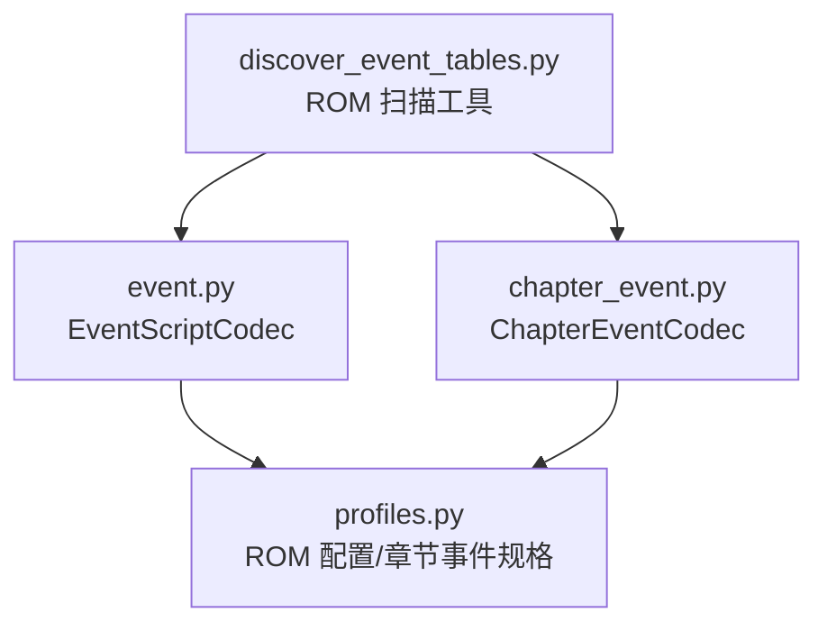
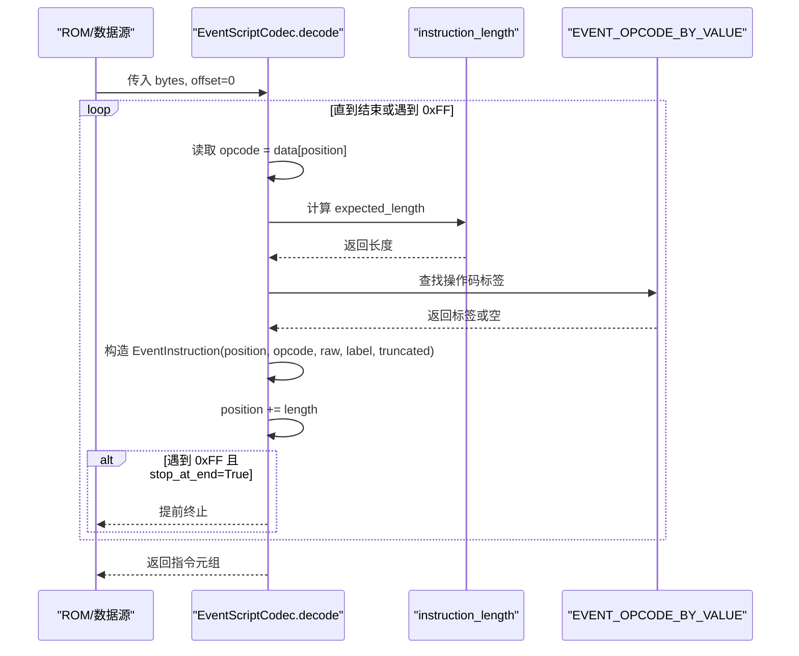
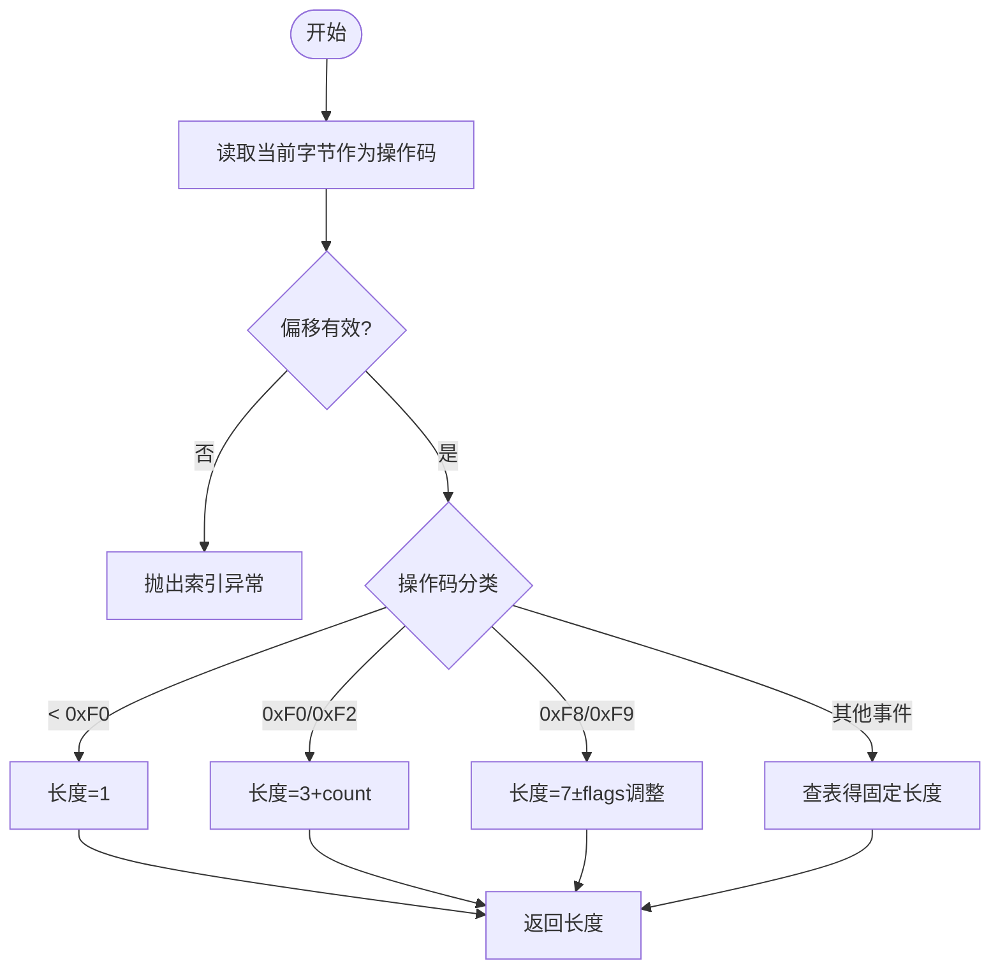
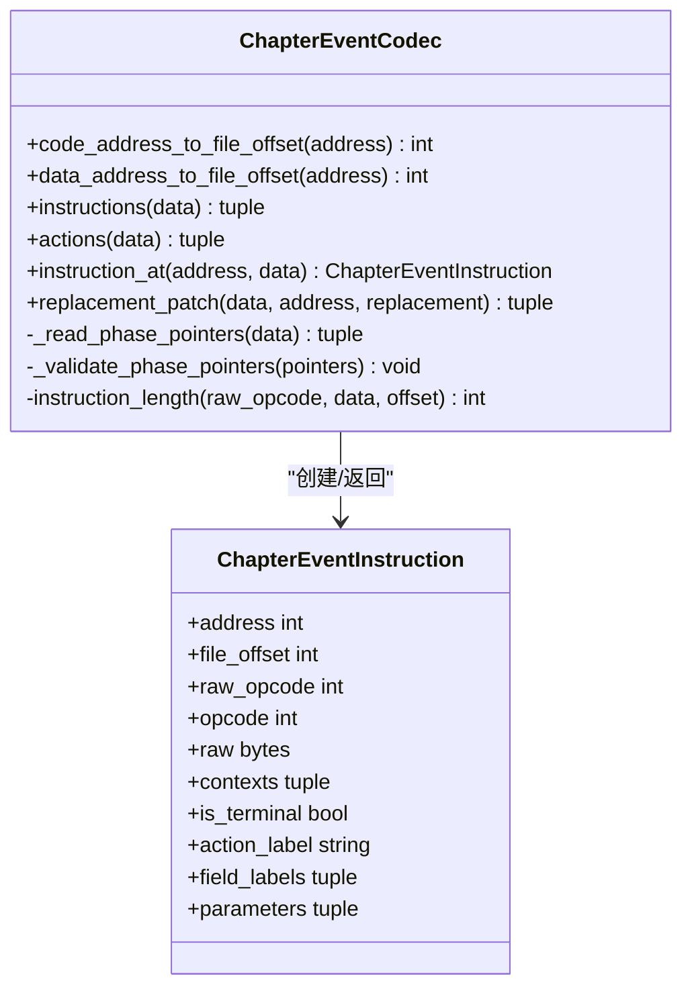

# 事件脚本编解码器

<cite>
**本文引用的文件**
- [event.py](file://src/fc_editor/codecs/event.py)
- [chapter_event.py](file://src/fc_editor/codecs/chapter_event.py)
- [profiles.py](file://src/fc_editor/profiles.py)
- [discover_event_tables.py](file://tools/research/discover_event_tables.py)
</cite>

## 目录
1. [简介](#简介)
2. [项目结构](#项目结构)
3. [核心组件](#核心组件)
4. [架构总览](#架构总览)
5. [详细组件分析](#详细组件分析)
6. [依赖关系分析](#依赖关系分析)
7. [性能考量](#性能考量)
8. [故障排查指南](#故障排查指南)
9. [结论](#结论)
10. [附录：指令规范与示例](#附录指令规范与示例)

## 简介
本技术文档聚焦于“事件脚本编解码器”，围绕 EventScriptCodec 类及其相关章节事件编解码能力，系统阐述指令解析、操作码规范、内存映射机制、数据验证与错误处理策略。文档同时覆盖 15 种事件操作符（0xF0–0xFF）的功能语义、指令长度计算规则、脚本终止与跳转控制、以及与游戏引擎的交互接口和兼容性考虑。为便于不同层次读者理解，文档提供逐步深入的说明、可视化图示、调试方法与性能优化建议。

## 项目结构
本项目中与事件脚本相关的代码主要位于 fc_editor.codecs 包内，并配合 profiles 配置描述 ROM 布局；研究工具 discover_event_tables.py 用于在 ROM 中扫描候选事件脚本表。

图表来源
- [event.py:49-108](file://src/fc_editor/codecs/event.py#L49-L108)
- [chapter_event.py:183-328](file://src/fc_editor/codecs/chapter_event.py#L183-L328)
- [profiles.py:128-143](file://src/fc_editor/profiles.py#L128-L143)
- [discover_event_tables.py:25-30](file://tools/research/discover_event_tables.py#L25-L30)

章节来源
- [event.py:1-109](file://src/fc_editor/codecs/event.py#L1-L109)
- [chapter_event.py:1-328](file://src/fc_editor/codecs/chapter_event.py#L1-L328)
- [profiles.py:128-143](file://src/fc_editor/profiles.py#L128-L143)
- [discover_event_tables.py:1-91](file://tools/research/discover_event_tables.py#L1-L91)

## 核心组件
- EventScriptCodec：对固定银行可视事件 VM 进行无损结构化解码，定义 15 个事件操作符（0xF0–0xFF）的元信息、指令长度计算与逐条解码流程。
- ChapterEventCodec：针对 DC 章节事件 VM 的固定地址编辑器，负责章节事件指针表读取、指令长度判定、上下文定位与原地替换校验。
- profiles.ChapterEventSpec：声明章节事件代码/数据 PRG Bank、指针表、阶段标签、数据窗口基址与范围等关键布局参数。
- discover_event_tables.py：基于 EventScriptCodec 的解码能力，扫描 ROM 中可能的脚本指针表，评估脚本有效性及命令使用比例。

章节来源
- [event.py:10-46](file://src/fc_editor/codecs/event.py#L10-L46)
- [event.py:49-108](file://src/fc_editor/codecs/event.py#L49-L108)
- [chapter_event.py:150-181](file://src/fc_editor/codecs/chapter_event.py#L150-L181)
- [chapter_event.py:183-328](file://src/fc_editor/codecs/chapter_event.py#L183-L328)
- [profiles.py:128-143](file://src/fc_editor/profiles.py#L128-L143)
- [discover_event_tables.py:25-30](file://tools/research/discover_event_tables.py#L25-L30)

## 架构总览
EventScriptCodec 将原始字节流按操作码解析为指令序列，每条指令包含偏移、操作码、原始字节、人类可读标签以及是否被截断的标志。对于未知或保留操作码，解码器仍会生成“延时帧”占位指令，保证遍历不中断。

图表来源
- [event.py:56-108](file://src/fc_editor/codecs/event.py#L56-L108)

章节来源
- [event.py:56-108](file://src/fc_editor/codecs/event.py#L56-L108)

## 详细组件分析

### EventScriptCodec：指令解析与长度计算
- 指令长度计算规则
  - 非事件操作码（opcode < 0xF0）：长度为 1。
  - 批量写入内存（0xF0）与批量切换映射（0xF2）：长度 = 3 + count，count 来自第 3 字节。
  - 生成绝对坐标对象（0xF8）与生成相对坐标对象（0xF9）：长度由 flags 决定，基础 7 字节，根据 flags 的特定比特位增减。
  - 其他事件操作码：固定长度，如 0xF1(2)、0xF3(3)、0xF4(2)、0xF5(3)、0xF6(2)、0xF7(3)、0xFA(2)、0xFB(2)、0xFC(2)、0xFD(3)、0xFE(4)、0xFF(1)。
- 数据验证与边界检查
  - 若偏移越界，抛出索引异常。
  - 对于需要额外字节的指令（如 0xF0/0xF2 的 count、0xF8/0xF9 的 flags），当数据不足时，返回保守估计长度以避免越界。
- 解码流程
  - 顺序遍历，按长度切分 raw 字节，记录 truncated 标志以指示实际读取长度与期望长度不一致的情况。
  - 遇到 0xFF 且允许停止时立即终止，避免误读后续数据。

图表来源
- [event.py:56-85](file://src/fc_editor/codecs/event.py#L56-L85)

章节来源
- [event.py:56-85](file://src/fc_editor/codecs/event.py#L56-L85)

### 15 种事件操作符（0xF0–0xFF）规范
以下为各操作符的功能语义与长度规则摘要（具体实现细节参见对应源码路径）：
- 0xF0 批量写入内存：长度 3 + count，count 为第 3 字节。
- 0xF1 显示标志子命令：长度 2。
- 0xF2 批量切换映射：长度 3 + count，count 为第 3 字节。
- 0xF3 调用服务：长度 3。
- 0xF4 设置状态：长度 2。
- 0xF5 设置坐标或槽位：长度 3。
- 0xF6 设置显示状态：长度 2。
- 0xF7 设置对象属性：长度 3。
- 0xF8 生成绝对坐标对象：长度由 flags 决定（基础 7，按 flags 位增减）。
- 0xF9 生成相对坐标对象：长度由 flags 决定（基础 7，按 flags 位增减）。
- 0xFA 移除对象：长度 2。
- 0xFB 显示对象：长度 2。
- 0xFC 隐藏对象：长度 2。
- 0xFD 移动镜头：长度 3。
- 0xFE 循环或跳转：长度 4。
- 0xFF 脚本结束：长度 1。

章节来源
- [event.py:28-45](file://src/fc_editor/codecs/event.py#L28-L45)
- [event.py:56-85](file://src/fc_editor/codecs/event.py#L56-L85)

### 章节事件编解码（ChapterEventCodec）
- 功能要点
  - 从 ROM profile 中读取章节事件布局（代码/数据 Bank、指针表、阶段标签、数据窗口基址与范围）。
  - 读取阶段指针表并校验其指向的数据区是否在合法范围内。
  - 指令长度判定：除固定长度外，操作码 0x43 的长度受下一字节影响。
  - 指令遍历：按长度切分，构建指令对象，附带上下文（场景 ID、阶段、阶段标签）。
  - 原地替换：确保替换后的指令长度与原槽一致，否则拒绝修改。
- 与 EventScriptCodec 的关系
  - 两者分别处理不同的 VM 格式：EventScriptCodec 面向固定银行的事件脚本（0xF0–0xFF），ChapterEventCodec 面向章节事件 VM（多操作码集）。
  - 二者均依赖 profiles 提供的 ROM 布局信息。

图表来源
- [chapter_event.py:150-181](file://src/fc_editor/codecs/chapter_event.py#L150-L181)
- [chapter_event.py:183-328](file://src/fc_editor/codecs/chapter_event.py#L183-L328)

章节来源
- [chapter_event.py:183-328](file://src/fc_editor/codecs/chapter_event.py#L183-L328)

### 与游戏引擎的交互接口
- 事件脚本调度入口：EventScriptCodec 的注释指明该注册表对应 CPU $E844 的分发器，表明事件脚本通过固定分发点进入引擎执行。
- 章节事件指针表：ChapterEventCodec 通过 profiles 中的 pointer_tables 定位各阶段脚本起始位置，并在数据区中按指令长度解析执行。
- 指令到处理器映射：EVENT_OPCODE_SPECS 中每个事件操作符都关联一个处理器地址（例如 0xF0→0xEB4F、0xFF→0xEF21），体现脚本与引擎内部处理的绑定关系。

章节来源
- [event.py:49-54](file://src/fc_editor/codecs/event.py#L49-L54)
- [event.py:28-45](file://src/fc_editor/codecs/event.py#L28-L45)
- [chapter_event.py:186-195](file://src/fc_editor/codecs/chapter_event.py#L186-L195)

### 数据验证与错误处理
- EventScriptCodec
  - 偏移越界：抛出 IndexError。
  - 指令长度不足：返回保守长度，避免越界读取；解码时标记 truncated。
  - 未知操作码：生成“延时帧”占位指令，保持遍历连续性。
- ChapterEventCodec
  - 指针表越界：抛出 RomFormatError。
  - 阶段指针非法：校验指针是否落在数据区内，否则报错。
  - 指令参数越界：若指令长度超出脚本区，抛出 RomFormatError。
  - 原地替换长度不匹配：抛出 ValueError，要求新指令与原槽兼容。

章节来源
- [event.py:56-108](file://src/fc_editor/codecs/event.py#L56-L108)
- [chapter_event.py:212-237](file://src/fc_editor/codecs/chapter_event.py#L212-L237)
- [chapter_event.py:262-328](file://src/fc_editor/codecs/chapter_event.py#L262-L328)

### 脚本编写示例与调试方法
- 示例思路
  - 使用 0xF0 批量写入内存，设置多个 RAM 值。
  - 使用 0xF8/0xF9 生成对象，结合 flags 控制附加字段数量。
  - 使用 0xFD 移动镜头，0xFE 进行循环或跳转，0xFF 结束脚本。
- 调试方法
  - 使用 discover_event_tables.py 扫描 ROM，统计有效脚本数与命令脚本比例，辅助定位脚本表。
  - 利用 EventScriptCodec.decode 输出指令列表，检查 truncated 标志与 0xFF 终止位置。
  - 对 ChapterEventCodec，使用 instructions() 获取完整指令序列，并通过 contexts_for_address() 确认指令所属场景与阶段。

章节来源
- [discover_event_tables.py:25-30](file://tools/research/discover_event_tables.py#L25-L30)
- [event.py:87-108](file://src/fc_editor/codecs/event.py#L87-L108)
- [chapter_event.py:239-288](file://src/fc_editor/codecs/chapter_event.py#L239-L288)

### 性能优化建议
- 批量操作优先：尽量使用 0xF0/0xF2 等批量指令减少多次调用开销。
- 合理拆分脚本：将长脚本拆分为多个短片段，利用 0xFE 跳转组织逻辑，降低单次解析负担。
- 避免冗余 flags：在 0xF8/0xF9 中仅启用必要 flags，减少指令长度与解析复杂度。
- 缓存指令表：对频繁访问的 ROM 区域，可缓存已解码指令以减少重复解析。

[本节为通用性能建议，不直接分析具体文件]

## 依赖关系分析
- EventScriptCodec 依赖 EVENT_OPCODE_SPECS 与 EVENT_OPCODE_BY_VALUE 完成操作码到标签与长度的映射。
- ChapterEventCodec 依赖 profiles.ChapterEventSpec 确定 ROM 布局，并据此计算文件偏移与数据范围。
- discover_event_tables.py 依赖 EventScriptCodec 的 decode 能力进行脚本有效性评估。

图表来源
- [profiles.py:128-143](file://src/fc_editor/profiles.py#L128-L143)
- [chapter_event.py:183-328](file://src/fc_editor/codecs/chapter_event.py#L183-L328)
- [event.py:28-45](file://src/fc_editor/codecs/event.py#L28-L45)
- [discover_event_tables.py:25-30](file://tools/research/discover_event_tables.py#L25-L30)

章节来源
- [profiles.py:128-143](file://src/fc_editor/profiles.py#L128-L143)
- [chapter_event.py:183-328](file://src/fc_editor/codecs/chapter_event.py#L183-L328)
- [event.py:28-45](file://src/fc_editor/codecs/event.py#L28-L45)
- [discover_event_tables.py:25-30](file://tools/research/discover_event_tables.py#L25-L30)

## 性能考量
- 指令长度计算为 O(1)，整体解码为 O(N)，N 为脚本字节数。
- 批量指令可减少函数调用次数，提升执行效率。
- 合理使用 0xFE 跳转与 0xFF 终止，避免无效遍历。
- 对大脚本建议分段解析与缓存结果，降低重复开销。

[本节为通用性能讨论，不直接分析具体文件]

## 故障排查指南
- 常见错误
  - 偏移越界：检查输入数据长度与当前位置。
  - 指令参数缺失：确认 0xF0/0xF2 的 count、0xF8/0xF9 的 flags 是否存在。
  - 章节事件指针非法：核对 profiles 中的数据范围与指针值。
  - 替换指令长度不兼容：确保新指令与原槽长度一致。
- 排查步骤
  - 使用 EventScriptCodec.decode 输出指令列表，关注 truncated 标志与最后一条是否为 0xFF。
  - 使用 ChapterEventCodec.instructions() 检查指令序列完整性，必要时打印上下文信息。
  - 使用 discover_event_tables.py 重新扫描 ROM，评估脚本表候选质量。

章节来源
- [event.py:56-108](file://src/fc_editor/codecs/event.py#L56-L108)
- [chapter_event.py:212-328](file://src/fc_editor/codecs/chapter_event.py#L212-L328)
- [discover_event_tables.py:25-30](file://tools/research/discover_event_tables.py#L25-L30)

## 结论
EventScriptCodec 提供了对事件脚本（0xF0–0xFF）的稳健解码能力，具备明确的指令长度规则、数据验证与错误处理机制；ChapterEventCodec 则针对章节事件 VM 提供固定地址编辑与上下文定位能力。二者共同依托 profiles 描述的 ROM 布局，实现对游戏引擎事件系统的无损解析与编辑。通过合理的脚本组织、批量指令使用与调试工具配合，可在保证兼容性的前提下提升性能与可维护性。

[本节为总结性内容，不直接分析具体文件]

## 附录：指令规范与示例
- 指令长度计算规则
  - 非事件操作码：长度 1。
  - 0xF0/0xF2：长度 3 + count。
  - 0xF8/0xF9：长度 7 ± flags 调整。
  - 其他事件操作码：固定长度（见上文规范）。
- 数据验证机制
  - 边界检查与 truncated 标记。
  - 章节事件指针合法性校验。
- 错误处理策略
  - 抛出 IndexError/RomFormatError/ValueError 等明确异常类型。
  - 原地替换前进行长度兼容性检查。
- 脚本编写示例（概念性）
  - 使用 0xF0 批量写入内存，设置初始状态。
  - 使用 0xF8/0xF9 生成对象，配置 flags。
  - 使用 0xFD 移动镜头，0xFE 循环跳转，0xFF 结束。
- 调试方法
  - 使用 discover_event_tables.py 扫描脚本表。
  - 使用 EventScriptCodec.decode 与 ChapterEventCodec.instructions 输出指令序列，检查 truncated 与终止位置。

章节来源
- [event.py:28-45](file://src/fc_editor/codecs/event.py#L28-L45)
- [event.py:56-108](file://src/fc_editor/codecs/event.py#L56-L108)
- [chapter_event.py:212-328](file://src/fc_editor/codecs/chapter_event.py#L212-L328)
- [discover_event_tables.py:25-30](file://tools/research/discover_event_tables.py#L25-L30)