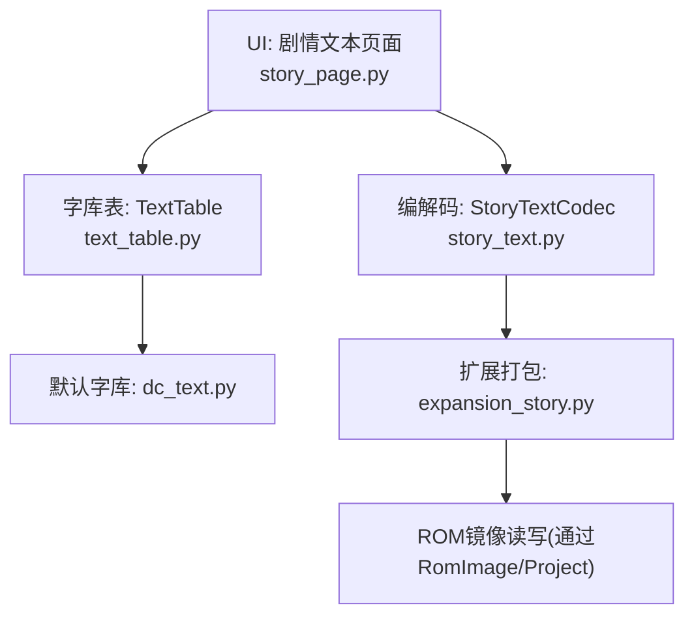
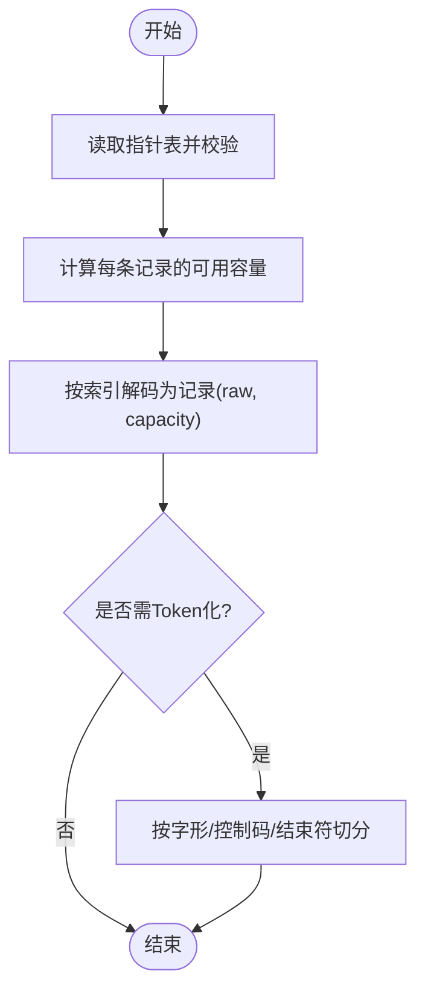
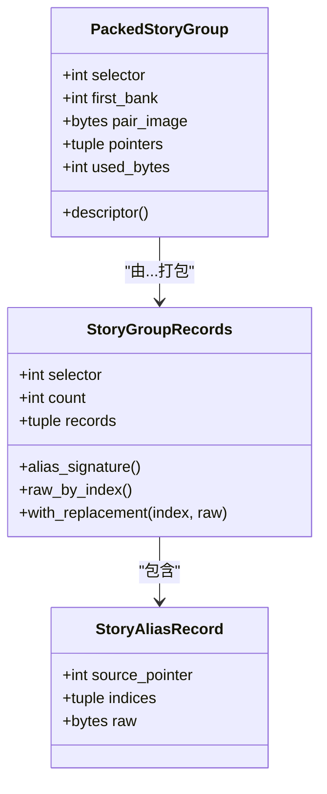
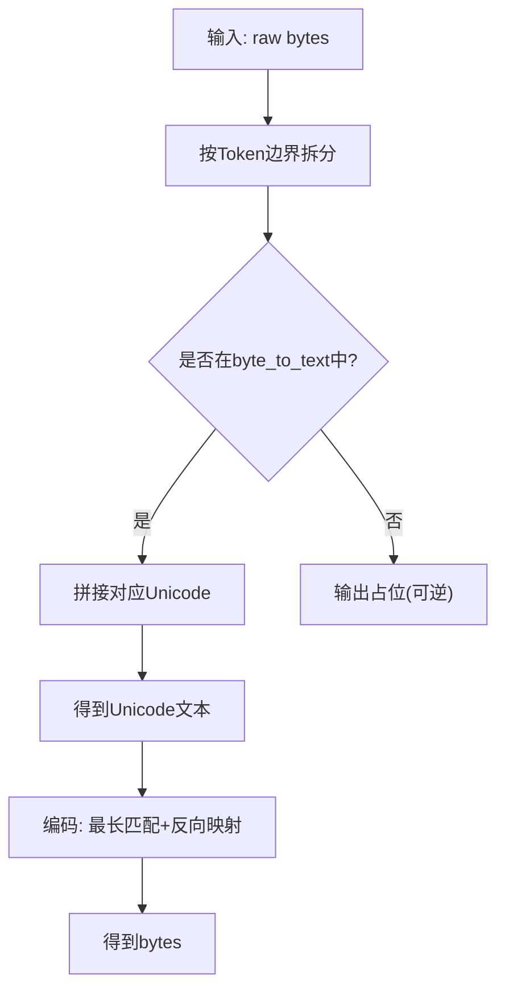
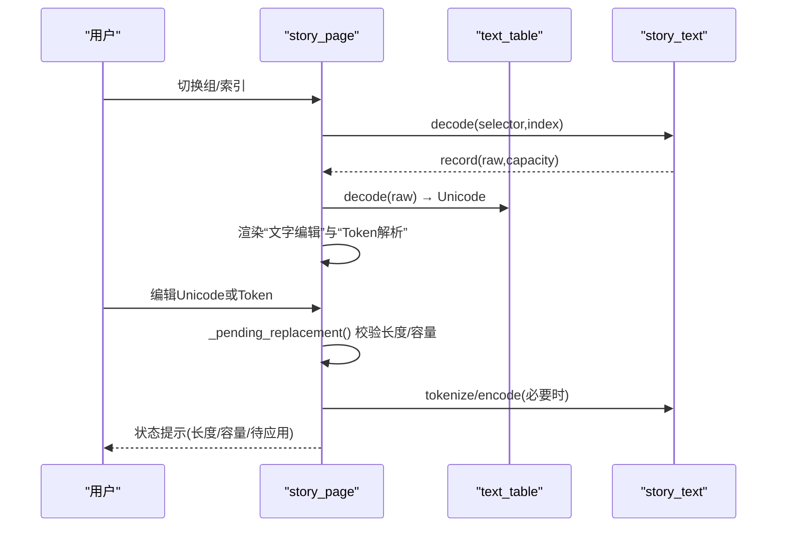
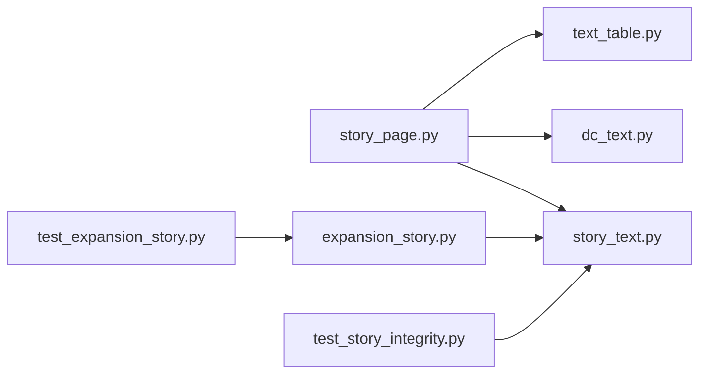

# 剧情文本编解码器

<cite>
**本文引用的文件**
- [story_text.py](file://src/fc_editor/codecs/story_text.py)
- [expansion_story.py](file://src/fc_editor/expansion_story.py)
- [story_page.py](file://src/dc_modifier/story_page.py)
- [text_table.py](file://src/fc_editor/text_table.py)
- [dc_text.py](file://src/fc_editor/dc_text.py)
- [test_expansion_story.py](file://tests/test_expansion_story.py)
- [test_story_integrity.py](file://tests/test_story_integrity.py)
</cite>

## 目录
1. [简介](#简介)
2. [项目结构](#项目结构)
3. [核心组件](#核心组件)
4. [架构总览](#架构总览)
5. [详细组件分析](#详细组件分析)
6. [依赖关系分析](#依赖关系分析)
7. [性能考虑](#性能考虑)
8. [故障排查指南](#故障排查指南)
9. [结论](#结论)
10. [附录](#附录)

## 简介
本技术文档聚焦于“剧情文本编解码器”的实现与使用，覆盖 StoryText 格式的编码/解码、文本压缩与字符集映射、格式化标记（控制码）、存储结构、多语言支持、特殊字符处理、渲染流程、字体绑定、显示效果控制、编辑工具使用方法、导入导出格式、批量处理脚本、验证规则、错误恢复机制与性能优化策略。目标是让具备不同技术背景的读者都能理解并正确使用该子系统。

## 项目结构
围绕剧情文本的模块主要分布在以下位置：
- 编解码核心：StoryTextCodec（原始字节级无损解析与写入）
- 扩展打包：故事组提取/打包、指针表与描述符管理
- UI 编辑器：剧情文本页面（文字编辑、Token 解析、字库表加载/导出）
- 字库表：TextTable（.tbl 解析、双向转换、模板生成）
- 默认字库：内置新DC字库（压缩存储、默认映射）
- 测试：扩容与完整性校验用例



图表来源
- [story_page.py:35-170](file://src/dc_modifier/story_page.py#L35-L170)
- [story_text.py:17-145](file://src/fc_editor/codecs/story_text.py#L17-L145)
- [text_table.py:9-158](file://src/fc_editor/text_table.py#L9-L158)
- [dc_text.py:372-407](file://src/fc_editor/dc_text.py#L372-L407)
- [expansion_story.py:175-297](file://src/fc_editor/expansion_story.py#L175-L297)

章节来源
- [story_page.py:35-170](file://src/dc_modifier/story_page.py#L35-L170)
- [story_text.py:17-145](file://src/fc_editor/codecs/story_text.py#L17-L145)
- [expansion_story.py:175-297](file://src/fc_editor/expansion_story.py#L175-L297)
- [text_table.py:9-158](file://src/fc_editor/text_table.py#L9-L158)
- [dc_text.py:372-407](file://src/fc_editor/dc_text.py#L372-L407)

## 核心组件
- StoryTextCodec：负责读取/写入 ROM 中的剧情文本记录，维护指针表、容量计算、Token 化、语义摘要、替换补丁等。
- expansion_story：负责将一组剧情记录提取、校验、重排并打包到新的 PRG Bank Pair，更新描述符。
- TextTable：负责 .tbl 字库表的解析、Unicode↔原始 Token 的双向转换、模板导出。
- dc_text：提供内置新DC字库（压缩存储），以及默认映射（含换行、结束符、未知单字节 Token 的可逆表示）。
- story_page：提供剧情文本编辑界面，支持 Unicode 编辑与原始 Token 编辑双通道，自动长度/容量校验与事务提交。

章节来源
- [story_text.py:17-259](file://src/fc_editor/codecs/story_text.py#L17-L259)
- [expansion_story.py:12-297](file://src/fc_editor/expansion_story.py#L12-L297)
- [text_table.py:9-158](file://src/fc_editor/text_table.py#L9-L158)
- [dc_text.py:372-407](file://src/fc_editor/dc_text.py#L372-L407)
- [story_page.py:35-800](file://src/dc_modifier/story_page.py#L35-L800)

## 架构总览
下图展示了从 UI 编辑到 ROM 写入的完整数据流，包括 Token 化、字库映射、容量校验与打包重定位。

```mermaid
sequenceDiagram
participant U as "用户"
participant P as "剧情文本页面<br/>story_page.py"
participant T as "字库表<br/>text_table.py"
participant C as "编解码器<br/>story_text.py"
participant X as "扩展打包<br/>expansion_story.py"
participant R as "ROM镜像"
U->>P : 在“文字编辑”或“原始Token”中修改
P->>T : 如需，载入/导出.tbl
P->>C : tokenize(raw)/decode/encode
P->>P : 长度/容量校验(无规划时等长; 有规划时统计占用)
alt 应用更改
P->>X : extract/pack (可选重定位到新的Bank Pair)
X->>R : 写入指针表/数据区/描述符
P-->>U : 提示成功/失败
else 仅预览
P-->>U : 实时显示解码结果与Token解析
end
```

图表来源
- [story_page.py:420-500](file://src/dc_modifier/story_page.py#L420-L500)
- [story_page.py:517-646](file://src/dc_modifier/story_page.py#L517-L646)
- [story_text.py:156-226](file://src/fc_editor/codecs/story_text.py#L156-L226)
- [expansion_story.py:175-297](file://src/fc_editor/expansion_story.py#L175-L297)

## 详细组件分析

### StoryTextCodec：原始字节级编解码
- 字形前导字节集合：仅特定范围的前导字节构成双字节字形 Token；避免误判标点或控制码后的边界。
- 指针表读取与校验：读取指定组的指针表，校验起始指针、越界等。
- 容量计算：根据相邻指针或可写尾部扫描确定每条记录的可用容量；对末记录采用“终止符安全扫描”。
- Token 化：按规则切分双字节字形、控制码、扩展控制字节、单字节字形/参数、结束符。
- 替换补丁：保证替换后长度严格等于容量；返回偏移与前后字节用于回环校验。
- 语义摘要：基于 raw 的哈希，便于比对。



图表来源
- [story_text.py:97-145](file://src/fc_editor/codecs/story_text.py#L97-L145)
- [story_text.py:156-226](file://src/fc_editor/codecs/story_text.py#L156-L226)

章节来源
- [story_text.py:17-259](file://src/fc_editor/codecs/story_text.py#L17-L259)

### expansion_story：故事组提取与打包
- 提取：按唯一指针分组，构建别名拓扑（多个索引共享同一条物理记录），逐条校验终止符与额外数据。
- 打包：将逻辑记录序列紧凑排列到 16 KiB pair，写入指针表与描述符（直接 Bank 绑定）。
- 约束：首 Bank 必须为偶数且小于 0x7F；数据区上限 0xC000；指针表大小与数据容量限制。



图表来源
- [expansion_story.py:76-173](file://src/fc_editor/expansion_story.py#L76-L173)

章节来源
- [expansion_story.py:12-297](file://src/fc_editor/expansion_story.py#L12-L297)

### TextTable：字库表与双向转换
- 解析：支持 .tbl 文本格式，跳过注释与空行，校验十六进制编码与重复项。
- 解码：按 StoryTextCodec 的 Token 边界进行映射，未知 Token 以可逆占位显示。
- 编码：优先匹配最长字符串，支持显式占位语法；反向映射选择最短字节序列以避免膨胀。
- 模板：导出当前工程中出现的 Token 集合，便于人工补全字库。



图表来源
- [text_table.py:17-93](file://src/fc_editor/text_table.py#L17-L93)
- [text_table.py:95-158](file://src/fc_editor/text_table.py#L95-L158)

章节来源
- [text_table.py:9-158](file://src/fc_editor/text_table.py#L9-L158)

### dc_text：内置新DC字库与默认映射
- 内置字库：以压缩形式内嵌，启动时解压并解析为 byte→text 映射。
- 默认行为：将 F2 视为换行，FF 作为结束符显示；其余未定义的单字节 Token 以“⟦原始字节 $XX⟧”形式呈现，确保可逆。
- 便捷函数：提供 concise 预览，便于列表展示。

章节来源
- [dc_text.py:372-407](file://src/fc_editor/dc_text.py#L372-L407)

### story_page：剧情文本编辑与渲染
- 双通道编辑：
  - “文字编辑”：基于 TextTable 的 Unicode 编辑，自动保持未改动 Token 的原始字节，避免无关重写。
  - “原始Token”：直接编辑十六进制 Token 流，适合高级用户微调控制参数。
- 实时校验：
  - 无扩容规划：必须保持原长度。
  - 有扩容规划：统计预计占用与剩余容量，允许自动重排。
- 渲染：
  - 解码视图：使用默认字库或自定义 .tbl 显示 Unicode。
  - Token 解析：表格展示每个 Token 的偏移、字节与解释（含字库映射）。
- 导入导出：
  - 载入外部 .tbl 字库表。
  - 导出字库模板（基于工程中出现的所有 Token）。



图表来源
- [story_page.py:207-337](file://src/dc_modifier/story_page.py#L207-L337)
- [story_page.py:420-500](file://src/dc_modifier/story_page.py#L420-L500)
- [story_page.py:517-646](file://src/dc_modifier/story_page.py#L517-L646)
- [story_page.py:675-744](file://src/dc_modifier/story_page.py#L675-L744)

章节来源
- [story_page.py:35-800](file://src/dc_modifier/story_page.py#L35-L800)

## 依赖关系分析
- story_page 依赖 text_table 与 dc_text 完成可视化与映射；依赖 story_text 完成底层 Token 化与容量判断。
- expansion_story 依赖 story_text 提供的 GLYPH_LEADS 与 Token 化能力，确保终止符判定一致。
- 测试用例验证扩容重定位、别名拓扑保留、容量溢出拒绝、描述符偏移正确性等。



图表来源
- [story_page.py:28-33](file://src/dc_modifier/story_page.py#L28-L33)
- [expansion_story.py:7-9](file://src/fc_editor/expansion_story.py#L7-L9)
- [test_expansion_story.py:6-15](file://tests/test_expansion_story.py#L6-L15)
- [test_story_integrity.py:7-8](file://tests/test_story_integrity.py#L7-L8)

章节来源
- [story_page.py:28-33](file://src/dc_modifier/story_page.py#L28-L33)
- [expansion_story.py:7-9](file://src/fc_editor/expansion_story.py#L7-L9)
- [test_expansion_story.py:6-15](file://tests/test_expansion_story.py#L6-L15)
- [test_story_integrity.py:7-8](file://tests/test_story_integrity.py#L7-L8)

## 性能考虑
- Token 化与映射：
  - 使用最小必要 Token 边界，避免对未知字节做过度语义推断，降低误判风险。
  - 字库编码优先匹配最长字符串，减少冗余字节；反向映射选择最短字节序列，避免不必要的膨胀。
- 增量保存：
  - 编辑 Unicode 时，尽量复用未改动区间的原始 Token 字节，减少 ROM 写入量与差异扩散。
- 容量与重排：
  - 扩容模式下，提前统计每组预计占用，避免多次试错导致的反复打包。
- 缓存与只读：
  - 内置字库懒加载与缓存；只读记录禁用编辑，减少无效操作。

[本节为通用指导，不直接分析具体文件]

## 故障排查指南
- 常见错误与恢复
  - 指针表不完整/起始指针不正确/越界指针：检查 ROM 是否被正确加载与配置。
  - 末记录缺少独立 FF 结束码：确认双字节字形后紧跟的 FF 不被误判为结束符；使用 standalone_terminator_end 进行安全扫描。
  - 记录为空或超出容量：在扩容前确保目标 Bank Pair 足够；或在无扩容模式下保持等长。
  - 同一共享记录收到不同替换值：合并替换前先对齐共享记录。
- 调试建议
  - 打开“Token 解析”面板，逐项核对控制码与字形边界。
  - 使用“导出字库模板”补齐缺失映射，再重新编码。
  - 运行单元测试验证扩容与完整性。

章节来源
- [story_text.py:97-145](file://src/fc_editor/codecs/story_text.py#L97-L145)
- [story_text.py:209-226](file://src/fc_editor/codecs/story_text.py#L209-L226)
- [expansion_story.py:48-74](file://src/fc_editor/expansion_story.py#L48-L74)
- [test_story_integrity.py:15-67](file://tests/test_story_integrity.py#L15-L67)

## 结论
该剧情文本编解码器以“原始字节无损”为核心原则，结合严格的 Token 边界识别与字库映射，实现了高保真的编辑与回写。配合扩容打包与 UI 双通道编辑，既满足专业用户的精细控制，也兼顾普通用户的易用性。通过完善的验证与测试，保障了数据完整性与可移植性。

[本节为总结，不直接分析具体文件]

## 附录

### 文本存储结构与地址约定
- CPU 地址窗口：$8000–$BFFF，PRG Bank 必须为偶数。
- 指针表：位于 $8010，长度为 count×2。
- 数据区：从 $8010 + count×2 起至 $C000。
- 描述符：直接 Bank 绑定，首字节为固定标识，次字节为首 Bank。

章节来源
- [story_text.py:140-145](file://src/fc_editor/codecs/story_text.py#L140-L145)
- [expansion_story.py:12-46](file://src/fc_editor/expansion_story.py#L12-L46)

### 字符集映射与控制标记
- 字形前导字节：限定范围，避免误判。
- 控制码：≥F0 的控制字节与 ≥EE 的扩展控制字节。
- 结束符：独立 FF 标志记录结束；双字节字形中的 FF 不作为结束符。
- 默认字库：将 F2 视为换行，FF 显示为“结束”，未知单字节 Token 以可逆占位显示。

章节来源
- [story_text.py:25-31](file://src/fc_editor/codecs/story_text.py#L25-L31)
- [story_text.py:181-207](file://src/fc_editor/codecs/story_text.py#L181-L207)
- [dc_text.py:385-396](file://src/fc_editor/dc_text.py#L385-L396)

### 文本渲染流程与字体绑定
- 渲染路径：raw → Token 化 → 字库映射 → Unicode → 显示。
- 字体绑定：通过 TextTable 的 byte→text 映射实现；可载入外部 .tbl 或导出模板定制。
- 显示效果：支持换行、结束符可视、未知 Token 的可逆占位。

章节来源
- [story_page.py:648-673](file://src/dc_modifier/story_page.py#L648-L673)
- [text_table.py:61-93](file://src/fc_editor/text_table.py#L61-L93)
- [dc_text.py:372-407](file://src/fc_editor/dc_text.py#L372-L407)

### 编辑工具使用方法
- 选择文本组与索引，查看预览与元信息。
- 在“文字编辑”中输入 Unicode，或使用“原始Token”直接编辑十六进制。
- 点击“刷新Token解析”查看 Token 明细；点击“文字编码到Token”将 Unicode 转回原始字节。
- 点击“应用当前文本”提交更改；必要时触发扩容重排。

章节来源
- [story_page.py:207-337](file://src/dc_modifier/story_page.py#L207-L337)
- [story_page.py:675-744](file://src/dc_modifier/story_page.py#L675-L744)

### 导入导出格式与批量处理
- 导入：载入 .tbl 字库表，支持 UTF-8-BOM 与注释。
- 导出：导出字库模板，包含工程中所有出现过的 Token。
- 批量：可通过测试脚本思路遍历所有已验证选择器，提取→编辑→打包→写回。

章节来源
- [text_table.py:17-46](file://src/fc_editor/text_table.py#L17-L46)
- [text_table.py:147-158](file://src/fc_editor/text_table.py#L147-L158)
- [test_expansion_story.py:29-98](file://tests/test_expansion_story.py#L29-L98)

### 验证规则与错误恢复
- 指针合法性：范围、数量、起始指针。
- 记录完整性：必须有独立 FF 结束符；末尾不能有多余数据。
- 容量限制：单 pair 最大容量；溢出时报错。
- 别名一致性：共享记录替换需保持一致；等价内容若原指针独立则保持独立。

章节来源
- [story_text.py:122-145](file://src/fc_editor/codecs/story_text.py#L122-L145)
- [expansion_story.py:48-74](file://src/fc_editor/expansion_story.py#L48-L74)
- [test_expansion_story.py:99-128](file://tests/test_expansion_story.py#L99-L128)
- [test_story_integrity.py:15-67](file://tests/test_story_integrity.py#L15-L67)