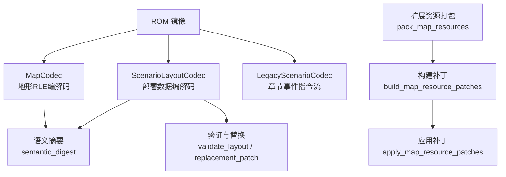
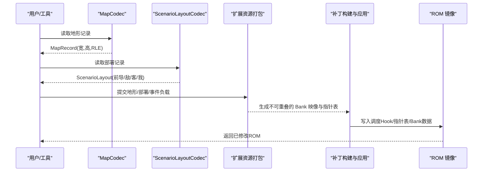
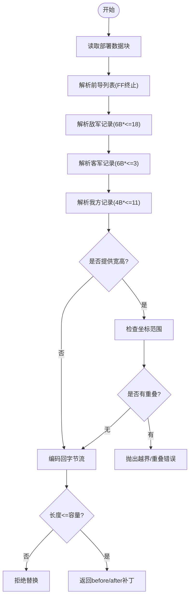
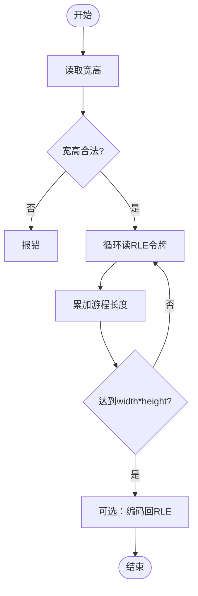
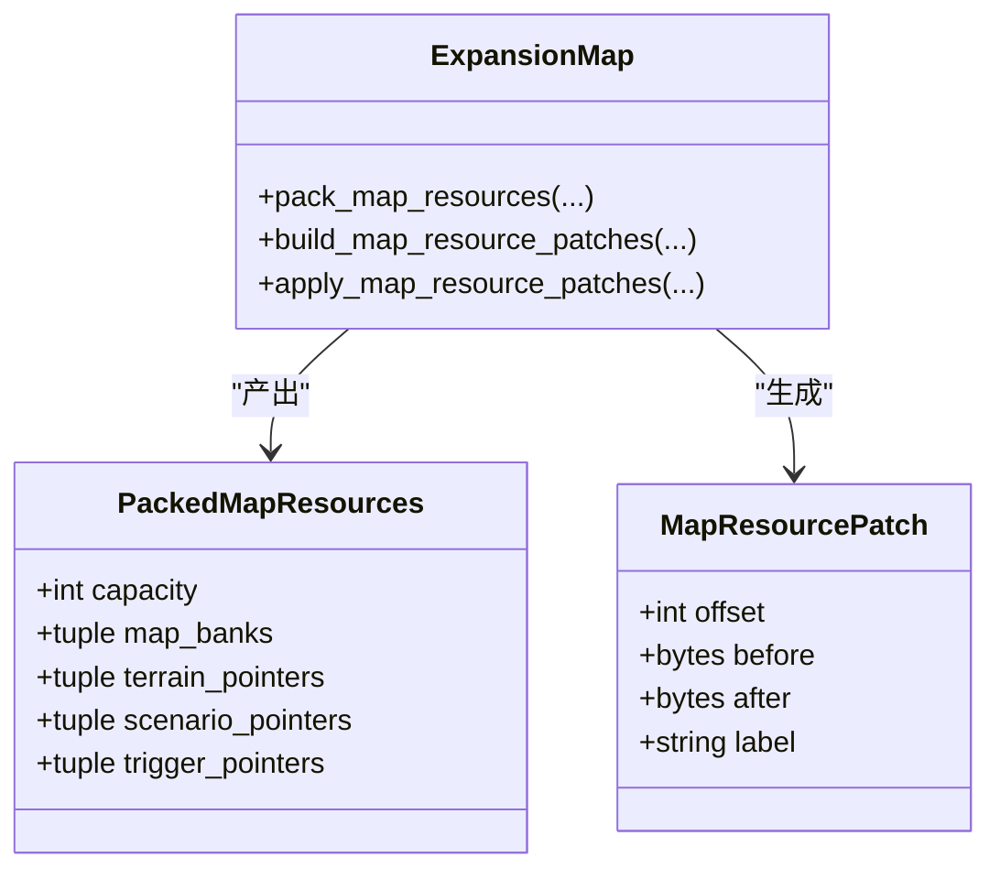
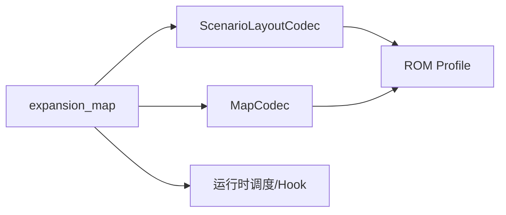

# 场景布局编解码器

<cite>
**本文引用的文件**
- [scenario_layout.py](file://src/fc_editor/codecs/scenario_layout.py)
- [legacy_scenario.py](file://src/fc_editor/codecs/legacy_scenario.py)
- [map.py](file://src/fc_editor/codecs/map.py)
- [expansion_map.py](file://src/fc_editor/expansion_map.py)
- [map_tile_attribute.py](file://src/fc_editor/codecs/map_tile_attribute.py)
- [test_legacy_text_scenario.py](file://tests/test_legacy_text_scenario.py)
- [test_scenario_feedback.py](file://tests/test_scenario_feedback.py)
</cite>

## 目录
1. [简介](#简介)
2. [项目结构](#项目结构)
3. [核心组件](#核心组件)
4. [架构总览](#架构总览)
5. [详细组件分析](#详细组件分析)
6. [依赖关系分析](#依赖关系分析)
7. [性能考虑](#性能考虑)
8. [故障排查指南](#故障排查指南)
9. [结论](#结论)
10. [附录](#附录)

## 简介
本技术文档围绕“场景布局编解码器”展开，聚焦于 FC（红白机）ROM 中“场景部署数据”的无损编解码、容量与指针管理、地图元素定位与碰撞校验、以及扩展 ROM 的资源打包与链接。内容覆盖：
- ScenarioLayout 的数据模型与布局算法（前导列表、敌军/客军/我方出击位记录）
- 地图地形 RLE 编码与尺寸约束
- 场景配置格式、图层管理与对象关系定义
- 场景加载流程、内存优化与动态更新机制
- 场景设计工具使用要点、布局验证规则与性能调优建议
- 与渲染/运行引擎的交互接口与兼容性处理（Bank 调度、Hook 注入、指针表维护）

## 项目结构
与场景布局相关的代码主要分布在以下模块：
- 编解码层：负责将 ROM 中的二进制块解析为高层数据结构，或反向编码回二进制
- 扩展资源层：负责将地形、部署、事件等资源打包进可分配的 Bank 池，并生成补丁以替换原 ROM 中的调度与指针表
- 测试与反馈：通过 UI 与单元测试验证编解码正确性、回环一致性与补丁安全性

图表来源
- [map.py:16-228](file://src/fc_editor/codecs/map.py#L16-L228)
- [scenario_layout.py:12-251](file://src/fc_editor/codecs/scenario_layout.py#L12-L251)
- [expansion_map.py:174-418](file://src/fc_editor/expansion_map.py#L174-L418)

章节来源
- [map.py:16-228](file://src/fc_editor/codecs/map.py#L16-L228)
- [scenario_layout.py:12-251](file://src/fc_editor/codecs/scenario_layout.py#L12-L251)
- [expansion_map.py:174-418](file://src/fc_editor/expansion_map.py#L174-L418)

## 核心组件
- 场景部署编解码器（ScenarioLayoutCodec）
  - 读取/写入部署数据块（前导列表 + 固定长度记录序列），支持容量限制与 FF 结束标记
  - 提供坐标范围与重叠检测的布局验证
  - 生成替换补丁，保证不越出原始容量
- 地图地形编解码器（MapCodec）
  - 4-bit 地形 RLE 编解码，严格校验宽高、游程长度与逻辑地形编号范围
  - 计算每条记录的容量，支持扩展 Bank 表模式
- 扩展资源打包与链接（expansion_map）
  - 将地形、部署、事件三类资源打包到指定 Bank 池，去重共享相同负载
  - 生成并应用 ROM 补丁，安装调度 Hook 与指针表，确保运行时正确映射
- 旧版章节事件编解码器（LegacyScenarioCodec）
  - 按阶段与关卡解析指令流，校验 Bank 边界与指令长度，支持原地替换

章节来源
- [scenario_layout.py:12-251](file://src/fc_editor/codecs/scenario_layout.py#L12-L251)
- [map.py:16-228](file://src/fc_editor/codecs/map.py#L16-L228)
- [expansion_map.py:174-418](file://src/fc_editor/expansion_map.py#L174-L418)
- [legacy_scenario.py:28-86](file://src/fc_editor/codecs/legacy_scenario.py#L28-L86)

## 架构总览
下图展示从 ROM 读取、解析、验证到打包与补丁应用的完整链路，以及与运行期引擎的交互点（Bank 调度与 Hook）。

图表来源
- [map.py:136-228](file://src/fc_editor/codecs/map.py#L136-L228)
- [scenario_layout.py:146-251](file://src/fc_editor/codecs/scenario_layout.py#L146-L251)
- [expansion_map.py:174-418](file://src/fc_editor/expansion_map.py#L174-L418)

## 详细组件分析

### 场景部署编解码器（ScenarioLayoutCodec）
- 数据模型
  - 前导列表：变长字节序列，以 0xFF 结束
  - 敌军部署：固定 6 字节/条，最多 18 条
  - 客军部署：固定 6 字节/条，最多 3 条
  - 我方出击位：固定 4 字节/条，最多 11 条
- 布局算法与验证
  - 容量计算：基于指针表相邻指针差值或扩展 Bank 目录推导
  - 坐标校验：在给定地图宽高下检查越界与位置重叠
  - 语义摘要：对编码后字节串求哈希，便于比对
- 替换补丁
  - 编码后长度不得超过原记录容量；否则拒绝
  - 生成 before/after 字节对，供上层安全应用

图表来源
- [scenario_layout.py:118-251](file://src/fc_editor/codecs/scenario_layout.py#L118-L251)

章节来源
- [scenario_layout.py:12-251](file://src/fc_editor/codecs/scenario_layout.py#L12-L251)

### 地图地形编解码器（MapCodec）
- 数据格式
  - 首两字节为宽高（1–32）
  - 后续为 4-bit 地形 RLE：每字节高4位为游程长度-1，低4位为逻辑地形编号（0–15）
- 编解码要点
  - 解码时累计游程，必须恰好填满 width×height
  - 编码时贪心合并连续同色地形，游程上限 16
- 容量与指针
  - 原生模式：按存储区窗口与指针递增性校验
  - 扩展模式：按 Bank 目录与 0xA000–0xBFFF 窗口校验

图表来源
- [map.py:136-228](file://src/fc_editor/codecs/map.py#L136-L228)

章节来源
- [map.py:16-228](file://src/fc_editor/codecs/map.py#L16-L228)

### 扩展资源打包与链接（expansion_map）
- 资源分类
  - 地形：独立存放，保持唯一
  - 部署：相同负载共享存储（去重）
  - 事件：相同负载共享存储（去重）
- 分配策略
  - 每个记录不得跨越 8 KiB Bank 边界
  - 按 Bank 内顺序放置，计算下一条记录的容量
- 运行时集成
  - 安装地形/部署/事件的 Bank 调度与 Hook
  - 重写指针表与 Bank 目录，使运行时能正确映射数据窗口

图表来源
- [expansion_map.py:126-140](file://src/fc_editor/expansion_map.py#L126-L140)
- [expansion_map.py:174-418](file://src/fc_editor/expansion_map.py#L174-L418)

章节来源
- [expansion_map.py:174-418](file://src/fc_editor/expansion_map.py#L174-L418)

### 旧版章节事件编解码器（LegacyScenarioCodec）
- 功能
  - 根据章节与阶段选择对应 Bank，解析指令流
  - 校验指令长度与 Bank 边界，防止越界
  - 支持单条指令的原地替换，要求长度不变且参数合法
- 与场景布局的关系
  - 场景部署数据由 ScenarioLayoutCodec 管理
  - 章节事件脚本控制播放音乐、选项等运行时行为，二者共同构成“场景”

章节来源
- [legacy_scenario.py:28-86](file://src/fc_editor/codecs/legacy_scenario.py#L28-L86)
- [test_legacy_text_scenario.py:77-100](file://tests/test_legacy_text_scenario.py#L77-L100)

### 图块属性编解码器（MapTileAttributeCodec）
- 作用
  - 解析/校验 A–G 图库的图块属性记录（颜色表、防御、移动补正等）
  - 仅允许修改受控字段，图形选择器等关键标识保持不变
- 与场景布局的关系
  - 地形图块的移动/防御属性影响单位在地图上的通行与战斗结算
  - 与地形 RLE 配合决定“哪里可走、如何作战”

章节来源
- [map_tile_attribute.py:28-143](file://src/fc_editor/codecs/map_tile_attribute.py#L28-L143)

## 依赖关系分析
- 编解码器之间
  - ScenarioLayoutCodec 与 MapCodec 各自独立，但都依赖 ROM Profile 提供的指针表与存储区间信息
  - expansion_map 将三者（地形/部署/事件）统一打包，并通过补丁安装运行时调度
- 与运行时的耦合点
  - 地形调度器、部署解析 Hook、事件调度 Hook 的地址与原始字节需匹配
  - 指针表与 Bank 目录写入后，运行时才能正确访问新布局

图表来源
- [scenario_layout.py:12-117](file://src/fc_editor/codecs/scenario_layout.py#L12-L117)
- [map.py:16-135](file://src/fc_editor/codecs/map.py#L16-L135)
- [expansion_map.py:272-418](file://src/fc_editor/expansion_map.py#L272-L418)

章节来源
- [scenario_layout.py:12-117](file://src/fc_editor/codecs/scenario_layout.py#L12-L117)
- [map.py:16-135](file://src/fc_editor/codecs/map.py#L16-L135)
- [expansion_map.py:272-418](file://src/fc_editor/expansion_map.py#L272-L418)

## 性能考虑
- 编解码效率
  - 地形 RLE 解码/编码为线性扫描，时间复杂度 O(width×height)
  - 部署数据解析为顺序读取，遇到 0xFF 分段，整体 O(N)
- 内存占用
  - 扩展资源打包按 8 KiB Bank 为单位分配，避免跨 Bank 碎片
  - 部署与事件负载去重共享，减少重复拷贝
- 运行时开销
  - 通过 Hook 将数据映射到固定窗口（$8000/$A000），减少频繁切换 Bank 的代价
  - 指针表与 Bank 目录一次性写入，降低运行时查找成本

[本节为通用性能讨论，不直接分析具体文件]

## 故障排查指南
- 常见错误与定位
  - 部署数据不完整或缺少 FF 结束标记：检查记录长度与分段分隔
  - 坐标越界或重叠：确认地图宽高与单位坐标
  - 地形 RLE 游程越界或提前结束：核对宽高与游程累加
  - 扩展资源 Bank 重复或指针无效：检查 Bank 配额与指针范围
  - 运行时 Hook 未安装或字节不匹配：确认补丁目标地址与原始字节
- 调试建议
  - 使用 round_trip 方法验证编解码一致性
  - 使用 semantic_digest 对比语义等价性
  - 在 UI 中查看 pending draft 与错误提示，逐步缩小问题范围

章节来源
- [scenario_layout.py:118-251](file://src/fc_editor/codecs/scenario_layout.py#L118-L251)
- [map.py:136-228](file://src/fc_editor/codecs/map.py#L136-L228)
- [expansion_map.py:272-418](file://src/fc_editor/expansion_map.py#L272-L418)
- [test_legacy_text_scenario.py:77-100](file://tests/test_legacy_text_scenario.py#L77-L100)
- [test_scenario_feedback.py:43-165](file://tests/test_scenario_feedback.py#L43-L165)

## 结论
本方案通过严格的编解码与容量校验，结合扩展资源的 Bank 级打包与运行时 Hook 注入，实现了场景布局的可编辑、可验证、可安全替换。其优势在于：
- 无损编解码与强约束校验，保障 ROM 稳定性
- 资源去重与 Bank 对齐，提升空间利用率
- 与运行时的明确契约（指针表、Bank 目录、Hook），确保兼容性与可移植性

[本节为总结性内容，不直接分析具体文件]

## 附录

### 场景配置格式与图层管理
- 场景部署数据块
  - 前导列表：变长字节，0xFF 终止
  - 敌军/客军/我方：固定长度记录序列，分别以 0xFF 分隔
- 图层关系
  - 地形层：RLE 编码的逻辑地形
  - 部署层：敌军、客军、我方出击位
  - 事件层：地图事件/商店触发列表
- 对象关系
  - 部署条目包含坐标与实体标识，用于运行时生成单位实例
  - 地形属性决定通行与战斗修正

章节来源
- [scenario_layout.py:118-185](file://src/fc_editor/codecs/scenario_layout.py#L118-L185)
- [map.py:136-196](file://src/fc_editor/codecs/map.py#L136-L196)
- [expansion_map.py:528-585](file://src/fc_editor/expansion_map.py#L528-L585)

### 场景加载流程与动态更新
- 加载流程
  - 读取指针表与 Bank 目录
  - 解析地形/部署/事件数据块
  - 校验容量与语义约束
- 动态更新
  - 通过 replacement_patch 生成 before/after 字节对
  - 应用补丁后，运行时通过 Hook 重新映射数据窗口

章节来源
- [scenario_layout.py:146-251](file://src/fc_editor/codecs/scenario_layout.py#L146-L251)
- [expansion_map.py:389-418](file://src/fc_editor/expansion_map.py#L389-L418)

### 与渲染引擎的交互接口与兼容性
- 地形调度器：将地形数据映射至 $A000 窗口，供渲染读取
- 部署解析 Hook：将部署数据映射至 $8000 窗口，供运行时初始化单位
- 事件调度 Hook：将事件列表映射至 $A000 窗口，供运行时触发
- 兼容性处理：校验原始字节与 Hook 空洞，确保补丁安全

章节来源
- [expansion_map.py:26-68](file://src/fc_editor/expansion_map.py#L26-L68)
- [expansion_map.py:272-386](file://src/fc_editor/expansion_map.py#L272-L386)

### 场景设计工具使用方法
- 编辑地形：调整宽高与 RLE 数据，注意游程上限与逻辑地形范围
- 编辑部署：设置敌军/客军/我方坐标，避免越界与重叠
- 编辑事件：维护事件记录长度与 FF 分隔
- 验证与导出：使用 round_trip 与 semantic_digest 验证一致性，再执行打包与补丁应用

章节来源
- [map.py:175-228](file://src/fc_editor/codecs/map.py#L175-L228)
- [scenario_layout.py:171-251](file://src/fc_editor/codecs/scenario_layout.py#L171-L251)
- [expansion_map.py:174-418](file://src/fc_editor/expansion_map.py#L174-L418)

### 布局验证规则
- 部署数量上限：敌军≤18，客军≤3，我方≤11
- 坐标范围：0 ≤ x < width，0 ≤ y < height
- 位置冲突：同一坐标只能被一个部署条目占用
- 地形尺寸：1–32，RLE 游程不超过 16
- 逻辑地形编号：0–15

章节来源
- [scenario_layout.py:187-226](file://src/fc_editor/codecs/scenario_layout.py#L187-L226)
- [map.py:136-196](file://src/fc_editor/codecs/map.py#L136-L196)

### 性能调优建议
- 尽量合并连续地形以降低 RLE 体积
- 复用相同部署/事件负载以减少重复存储
- 合理选择 Bank 配额，避免碎片化
- 批量应用补丁，减少多次 I/O

[本节为通用指导，不直接分析具体文件]