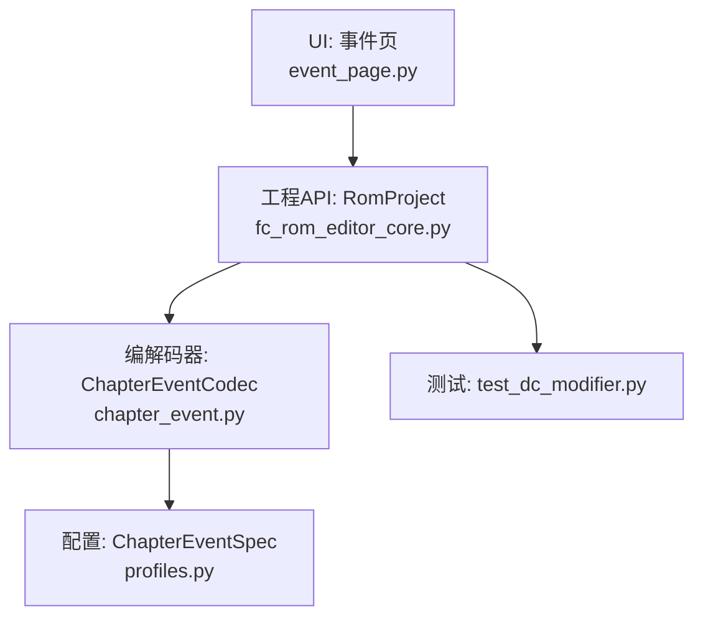
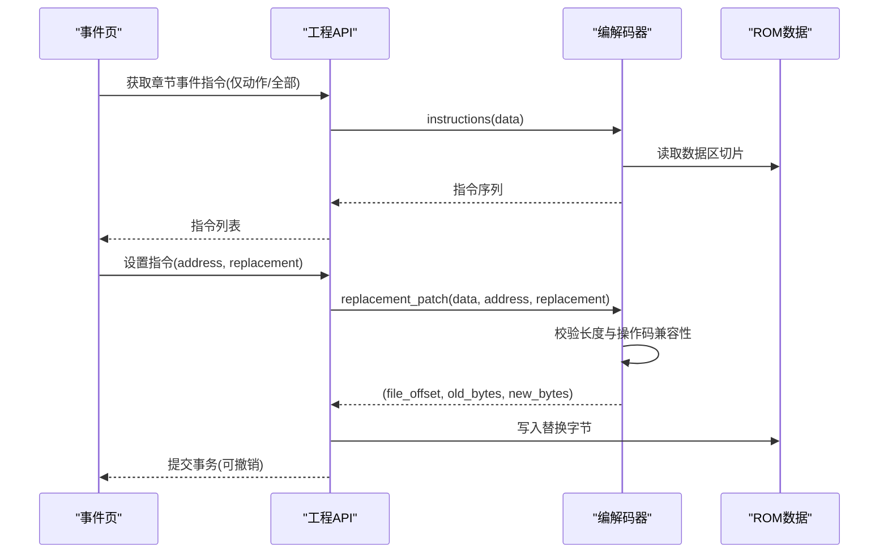
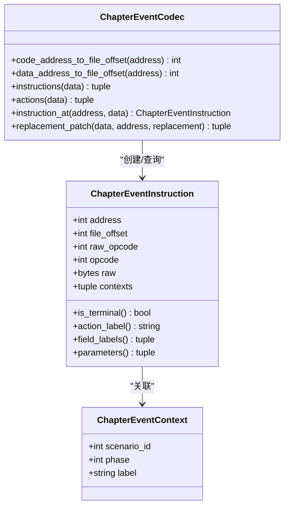
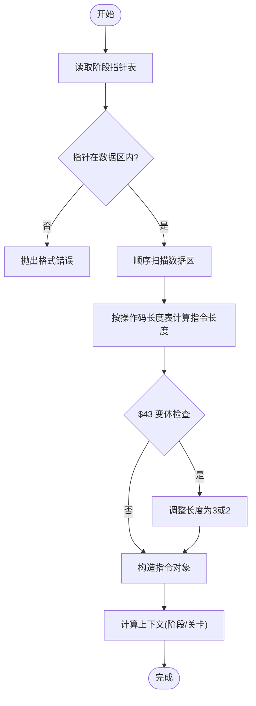
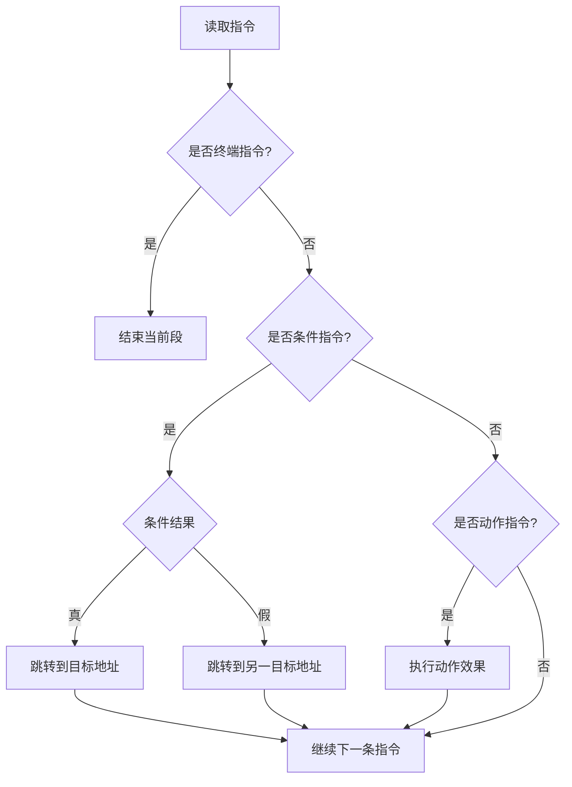
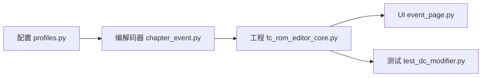

# 章节事件编解码器

<cite>
**本文引用的文件**
- [src/fc_editor/codecs/chapter_event.py](file://src/fc_editor/codecs/chapter_event.py)
- [src/fc_editor/profiles.py](file://src/fc_editor/profiles.py)
- [src/fc_rom_editor_core.py](file://src/fc_rom_editor_core.py)
- [src/dc_modifier/event_page.py](file://src/dc_modifier/event_page.py)
- [tests/test_dc_modifier.py](file://tests/test_dc_modifier.py)
</cite>

## 目录
1. [简介](#简介)
2. [项目结构](#项目结构)
3. [核心组件](#核心组件)
4. [架构总览](#架构总览)
5. [详细组件分析](#详细组件分析)
6. [依赖关系分析](#依赖关系分析)
7. [性能与内存管理](#性能与内存管理)
8. [故障排查指南](#故障排查指南)
9. [结论](#结论)
10. [附录：配置与调试示例](#附录：配置与调试示例)

## 简介
本技术文档围绕“章节事件编解码器”展开，聚焦于 DC（第二次机器人大战新DC篇·扩容 MMC3）ROM 中的章节事件虚拟机指令集、数据布局、流程控制与状态管理。文档从数据结构设计、指令格式、条件判断与分支策略入手，解释事件链式执行机制，并给出与游戏主循环的集成方式、内存管理与性能优化建议，以及常见问题的定位与修复方法。

## 项目结构
本节概述与章节事件相关的代码组织与职责划分：
- 编解码层：负责解析/生成章节事件指令、地址映射、上下文关联、校验与替换补丁。
- 配置层：定义 ROM 布局、章节事件指针表、阶段标签、数据窗口等。
- 工程层：提供统一 API 暴露章节事件读取、写入、撤销与还原能力。
- UI 层：将指令以表格形式展示、支持编辑与回滚。
- 测试层：覆盖关键场景的往返读写、长度约束与错误拒绝。

**图表来源**
- [src/dc_modifier/event_page.py](file://src/dc_modifier/event_page.py)
- [src/fc_rom_editor_core.py](file://src/fc_rom_editor_core.py)
- [src/fc_editor/codecs/chapter_event.py](file://src/fc_editor/codecs/chapter_event.py)
- [src/fc_editor/profiles.py](file://src/fc_editor/profiles.py)
- [tests/test_dc_modifier.py](file://tests/test_dc_modifier.py)

**章节来源**
- [src/dc_modifier/event_page.py](file://src/dc_modifier/event_page.py)
- [src/fc_rom_editor_core.py](file://src/fc_rom_editor_core.py)
- [src/fc_editor/codecs/chapter_event.py](file://src/fc_editor/codecs/chapter_event.py)
- [src/fc_editor/profiles.py](file://src/fc_editor/profiles.py)
- [tests/test_dc_modifier.py](file://tests/test_dc_modifier.py)

## 核心组件
- 指令与上下文模型
  - 章节事件上下文：包含关卡ID、阶段序号与阶段标签，用于标注某条指令在哪些阶段的脚本范围内有效。
  - 章节事件指令：封装原始字节、操作码、参数元组、所属上下文集合，并提供是否终止、操作码标签、字段名、参数访问等属性。
- 编解码器
  - 地址转换：CPU 地址到文件偏移的映射，区分代码 Bank 与数据 Bank。
  - 指针表读取与校验：按阶段读取每关的阶段起始指针，并验证其落在合法数据区。
  - 指令扫描：顺序遍历数据区，依据操作码长度表与特殊变体规则解析每条指令，构建指令序列。
  - 过滤与查询：支持仅返回动作类指令、按地址查找单条指令。
  - 安全替换：保证替换前后指令长度一致且新操作码长度兼容，避免破坏后续指令边界。
- 配置
  - 章节事件规格：声明代码 Bank、数据 Bank、指针表位置、阶段标签、关卡数、数据窗口基址与起止范围。
- 工程接口
  - 暴露章节事件指令枚举、设置/重置单条指令、撤销/重做事务包装。
- UI 集成
  - 基于规格加载阶段标签，渲染指令列表，调用工程接口进行替换与还原。

**章节来源**
- [src/fc_editor/codecs/chapter_event.py:150-181](file://src/fc_editor/codecs/chapter_event.py#L150-L181)
- [src/fc_editor/codecs/chapter_event.py:183-328](file://src/fc_editor/codecs/chapter_event.py#L183-L328)
- [src/fc_editor/profiles.py:128-143](file://src/fc_editor/profiles.py#L128-L143)
- [src/fc_rom_editor_core.py:2400-2427](file://src/fc_rom_editor_core.py#L2400-L2427)
- [src/dc_modifier/event_page.py:273-333](file://src/dc_modifier/event_page.py#L273-L333)

## 架构总览
章节事件系统采用“固定地址、定长槽位”的不可失配编辑模式。每个阶段在每个关卡有一个指针指向该阶段脚本起始地址；脚本区为连续字节流，由操作码与参数组成。编解码器通过操作码长度表与特殊变体逻辑，逐条解析指令，并在 UI 中呈现为可编辑行。工程层对每次修改进行快照与事务提交，确保可撤销与一致性。

**图表来源**
- [src/dc_modifier/event_page.py:273-333](file://src/dc_modifier/event_page.py#L273-L333)
- [src/fc_rom_editor_core.py:2400-2427](file://src/fc_rom_editor_core.py#L2400-L2427)
- [src/fc_editor/codecs/chapter_event.py:262-328](file://src/fc_editor/codecs/chapter_event.py#L262-L328)

## 详细组件分析

### 数据结构与格式规范
- 指令长度表
  - 使用预定义数组描述各操作码占用的字节数，其中操作码 $43 为数据依赖型变体：若其后一字节为特定值则长度为3，否则为2。
- 操作码标签与动作字段
  - 提供人类可读的操作码标签与动作字段名，便于 UI 显示与用户理解。
- 指令对象
  - 包含地址、文件偏移、原始字节、操作码、上下文集合；提供是否终止、动作标签、字段名、参数元组等便捷属性。
- 上下文对象
  - 记录指令所属的关卡ID、阶段序号与阶段标签，用于多阶段脚本归属判定。

**图表来源**
- [src/fc_editor/codecs/chapter_event.py:150-181](file://src/fc_editor/codecs/chapter_event.py#L150-L181)
- [src/fc_editor/codecs/chapter_event.py:183-328](file://src/fc_editor/codecs/chapter_event.py#L183-L328)

**章节来源**
- [src/fc_editor/codecs/chapter_event.py:11-22](file://src/fc_editor/codecs/chapter_event.py#L11-L22)
- [src/fc_editor/codecs/chapter_event.py:25-147](file://src/fc_editor/codecs/chapter_event.py#L25-L147)
- [src/fc_editor/codecs/chapter_event.py:150-181](file://src/fc_editor/codecs/chapter_event.py#L150-L181)

### 章节流程控制与事件触发条件
- 阶段指针表
  - 每个阶段对应一个指针表，表中每项为一关的该阶段脚本起始地址。编解码器读取并按关卡数解包。
- 上下文判定
  - 对于给定地址，找到所有满足“起始地址 ≤ 地址 < 下一起始或数据区结束”的阶段与关卡组合，形成上下文集合。
- 指令扫描与边界保护
  - 顺序扫描数据区，根据操作码长度表计算下一条指令起始；遇到未知操作码或缺少参数时抛出格式错误。
- 终止标志
  - 最高位为1表示指令为终端指令，通常用于结束一段脚本或跳转至下一阶段。

**图表来源**
- [src/fc_editor/codecs/chapter_event.py:212-260](file://src/fc_editor/codecs/chapter_event.py#L212-L260)
- [src/fc_editor/codecs/chapter_event.py:227-237](file://src/fc_editor/codecs/chapter_event.py#L227-L237)
- [src/fc_editor/codecs/chapter_event.py:262-288](file://src/fc_editor/codecs/chapter_event.py#L262-L288)

**章节来源**
- [src/fc_editor/codecs/chapter_event.py:212-260](file://src/fc_editor/codecs/chapter_event.py#L212-L260)
- [src/fc_editor/codecs/chapter_event.py:227-237](file://src/fc_editor/codecs/chapter_event.py#L227-L237)
- [src/fc_editor/codecs/chapter_event.py:262-288](file://src/fc_editor/codecs/chapter_event.py#L262-L288)

### 事件链式执行机制、条件判断与分支处理
- 链式执行
  - 指令按顺序排列，终端指令（最高位为1）通常表示当前段结束；非终端指令继续执行下一条。
- 条件判断
  - 存在多种条件判定操作码（如回合判定、开关判定、人物行动限制位判定等），用于在游戏运行时评估条件。
- 分支处理
  - 条件成立/不成立跳转指令可在运行时改变执行流；无条件跳转指令直接改变程序计数器。
- 动作类指令
  - 增援、加入、自爆、撤退、对话、等待帧数、音乐切换等，均作为动作指令被筛选与展示。

[此图为概念性流程图，不直接映射具体源码文件]

### 与游戏主循环的集成方式
- 指针表驱动
  - 游戏主循环在各阶段开始时，读取对应阶段的指针表，得到该阶段脚本起始地址，然后进入事件 VM 执行。
- 数据区与窗口映射
  - 事件数据位于指定 PRG Bank 的数据窗口内，编解码器通过窗口基址与 CPU 地址换算文件偏移，确保正确读写。
- 指令长度不变原则
  - 编辑器强制保持指令长度不变，避免破坏 VM 的固定槽位假设，从而与主循环的指令边界保持一致。

**章节来源**
- [src/fc_editor/profiles.py:128-143](file://src/fc_editor/profiles.py#L128-L143)
- [src/fc_editor/codecs/chapter_event.py:197-210](file://src/fc_editor/codecs/chapter_event.py#L197-L210)
- [src/fc_editor/codecs/chapter_event.py:311-328](file://src/fc_editor/codecs/chapter_event.py#L311-L328)

### 内存管理与性能优化技巧
- 零拷贝切片
  - 扫描数据区时使用切片与索引访问，避免不必要的复制；仅在需要时转换为 bytes。
- 指令长度缓存
  - 操作码长度表为静态常量，$43 变体仅在必要时检查下一字节，减少分支开销。
- 批量读取与校验
  - 一次性读取完整数据块并进行完整性校验，减少多次 I/O 与越界风险。
- 只读过滤
  - actions() 仅返回动作类指令，降低 UI 渲染压力。
- 事务化写入
  - 工程层对每次替换进行快照与提交，避免中间态污染工作内存。

**章节来源**
- [src/fc_editor/codecs/chapter_event.py:262-295](file://src/fc_editor/codecs/chapter_event.py#L262-L295)
- [src/fc_rom_editor_core.py:2400-2427](file://src/fc_rom_editor_core.py#L2400-L2427)

## 依赖关系分析
- 编解码器依赖配置
  - 通过 ChapterEventSpec 获取代码/数据 Bank、指针表位置、阶段标签、数据窗口与范围。
- 工程层依赖编解码器
  - 提供统一的指令枚举、设置与重置接口，内部委托给编解码器进行地址转换与校验。
- UI 依赖工程层
  - 事件页通过工程接口获取指令列表与执行替换，同时利用规格中的阶段标签进行界面展示。
- 测试依赖工程层与编解码器
  - 验证往返读写、长度约束与错误拒绝行为。

**图表来源**
- [src/fc_editor/profiles.py:128-143](file://src/fc_editor/profiles.py#L128-L143)
- [src/fc_editor/codecs/chapter_event.py:183-328](file://src/fc_editor/codecs/chapter_event.py#L183-L328)
- [src/fc_rom_editor_core.py:2400-2427](file://src/fc_rom_editor_core.py#L2400-L2427)
- [src/dc_modifier/event_page.py:273-333](file://src/dc_modifier/event_page.py#L273-L333)
- [tests/test_dc_modifier.py:610-670](file://tests/test_dc_modifier.py#L610-L670)

**章节来源**
- [src/fc_editor/profiles.py:128-143](file://src/fc_editor/profiles.py#L128-L143)
- [src/fc_editor/codecs/chapter_event.py:183-328](file://src/fc_editor/codecs/chapter_event.py#L183-L328)
- [src/fc_rom_editor_core.py:2400-2427](file://src/fc_rom_editor_core.py#L2400-L2427)
- [src/dc_modifier/event_page.py:273-333](file://src/dc_modifier/event_page.py#L273-L333)
- [tests/test_dc_modifier.py:610-670](file://tests/test_dc_modifier.py#L610-L670)

## 性能与内存管理
- 时间复杂度
  - 指令扫描为 O(N)，N 为数据区字节数；上下文判定为 O(P*S)，P 为阶段数，S 为关卡数。
- 空间复杂度
  - 指令序列存储为 O(N')，N' 为指令数量；上下文集合较小，整体内存占用可控。
- 优化建议
  - 在 UI 层按需加载指令（例如仅动作指令）。
  - 对频繁访问的地址进行局部缓存（注意失效策略）。
  - 避免在热路径中进行字符串拼接与日志输出。

[本节为通用性能讨论，不直接分析具体文件]

## 故障排查指南
- 常见错误与原因
  - 未知操作码：可能由于 ROM 版本不一致或损坏导致。
  - 缺少参数：操作码 $43 需要额外参数，若缺失会报错。
  - 指针越界：阶段指针不在数据区内，需检查配置或 ROM 完整性。
  - 指令长度不匹配：替换时长度变化会导致后续指令错位，应严格保持原长度。
- 定位步骤
  - 使用 instruction_at 获取目标地址指令，核对 raw 与 parameters。
  - 检查 ChapterEventSpec 的配置是否与当前 ROM 匹配。
  - 通过 tests 中的用例复现问题，确认是否为预期行为。
- 修复建议
  - 恢复原始指令或使用 reset_chapter_event_instruction 还原。
  - 修正配置中的指针表与数据范围。
  - 确保替换字节长度与原指令一致。

**章节来源**
- [src/fc_editor/codecs/chapter_event.py:227-237](file://src/fc_editor/codecs/chapter_event.py#L227-L237)
- [src/fc_editor/codecs/chapter_event.py:262-288](file://src/fc_editor/codecs/chapter_event.py#L262-L288)
- [src/fc_rom_editor_core.py:2408-2427](file://src/fc_rom_editor_core.py#L2408-L2427)
- [tests/test_dc_modifier.py:661-670](file://tests/test_dc_modifier.py#L661-L670)

## 结论
章节事件编解码器以固定地址与定长槽位为核心设计，确保与游戏主循环的强一致性。通过操作码长度表、阶段指针表与上下文判定，实现了对复杂事件流的精确解析与安全编辑。工程层的事务化写入与 UI 层的可视化展示，使开发者能够高效地进行章节事件配置与调试。遵循长度不变原则与配置校验，可有效避免运行时崩溃与数据损坏。

## 附录：配置与调试示例
- 配置要点
  - 在 profiles.py 中定义 ChapterEventSpec，包括 code_prg_bank、data_prg_bank、pointer_tables、phase_labels、scenario_count、data_window_base、data_start、data_end。
  - 确保 pointer_tables 的数量与 phase_labels 一致，数据范围合法。
- 调试步骤
  - 使用 project.chapter_event_instructions(actions_only=True) 获取动作指令，定位目标操作码。
  - 使用 project.set_chapter_event_instruction 进行替换，并通过 project.validate() 检查无错误。
  - 保存项目后重新加载，验证往返读写一致性。
- 常见问题
  - 替换长度不一致会被拒绝，需保持原指令长度。
  - 未知操作码或缺少参数会抛出格式错误，需检查 ROM 版本与配置。

**章节来源**
- [src/fc_editor/profiles.py:128-143](file://src/fc_editor/profiles.py#L128-L143)
- [src/fc_rom_editor_core.py:2400-2427](file://src/fc_rom_editor_core.py#L2400-L2427)
- [tests/test_dc_modifier.py:610-670](file://tests/test_dc_modifier.py#L610-L670)