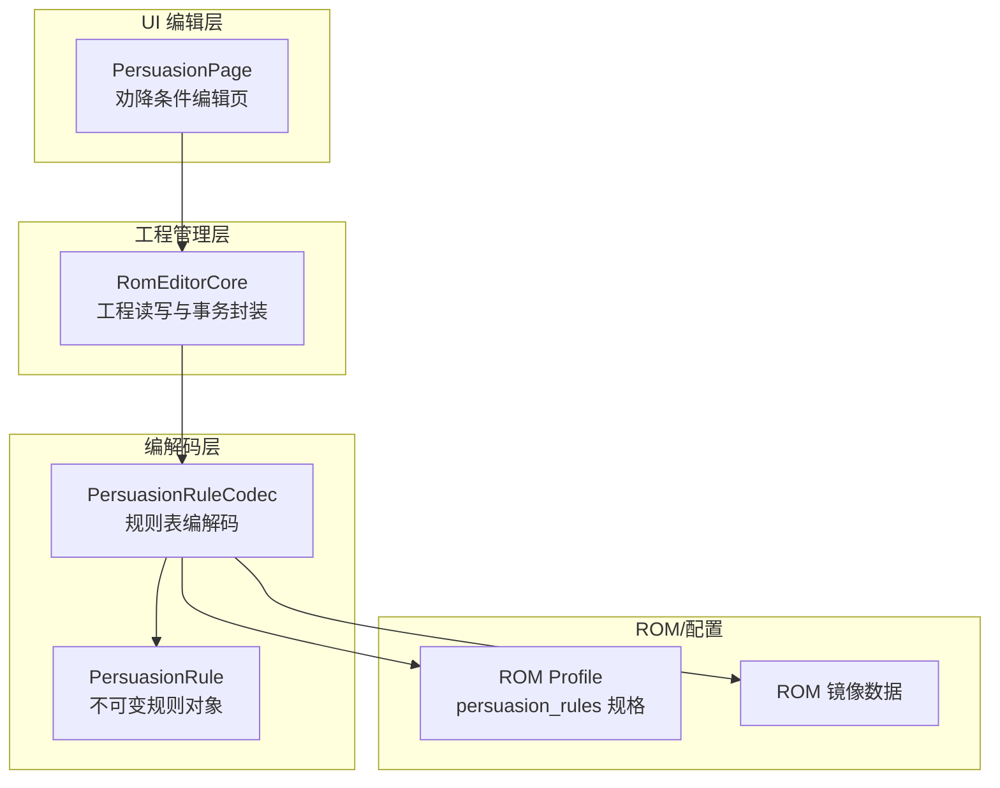
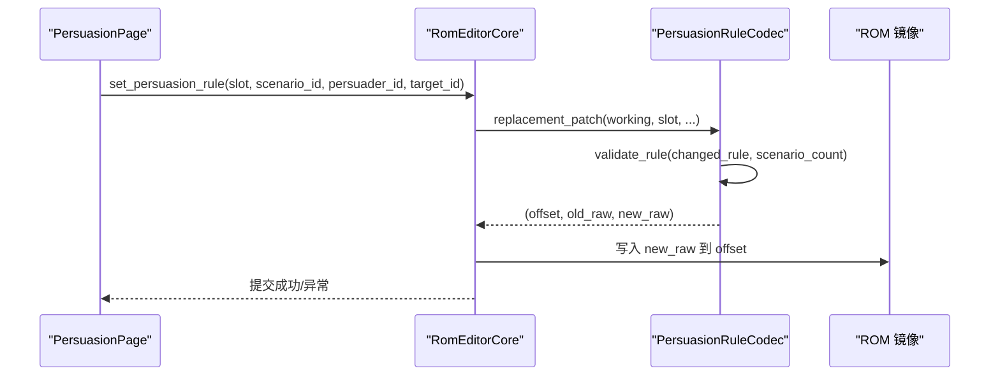
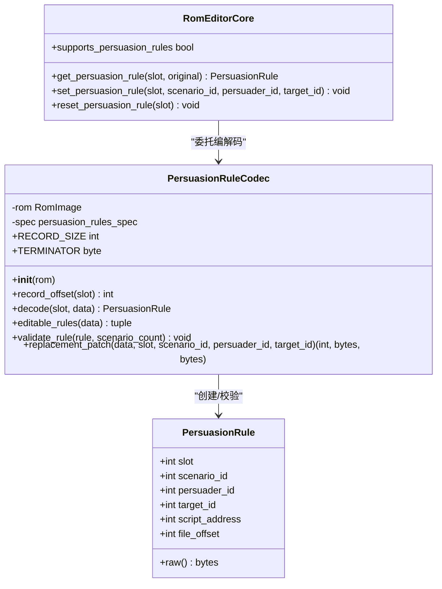
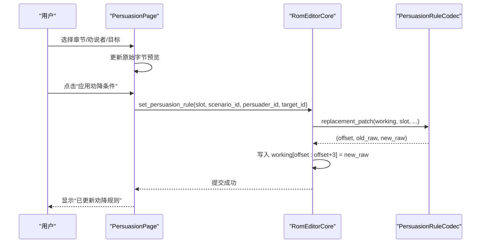
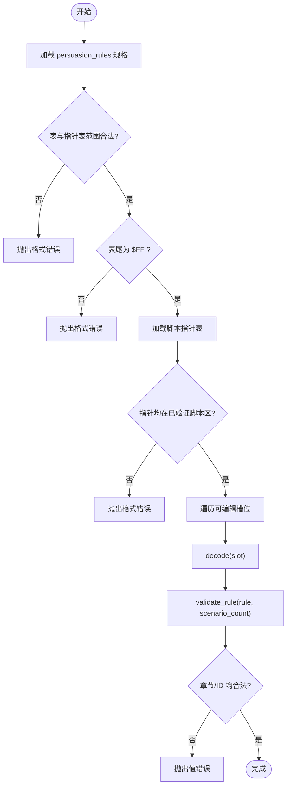
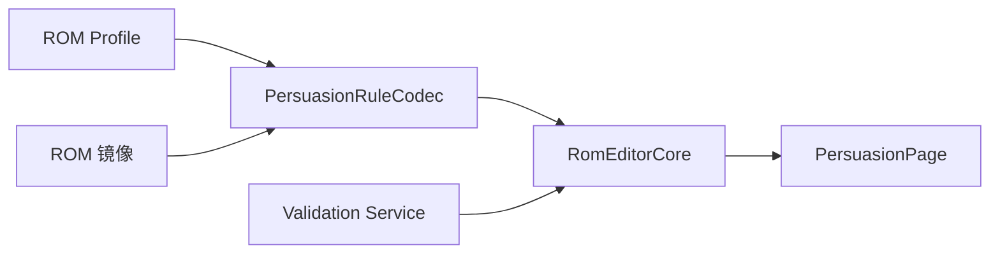

# 说服规则编解码器

<cite>
**本文引用的文件**
- [src/fc_editor/codecs/persuasion.py](file://src/fc_editor/codecs/persuasion.py)
- [src/dc_modifier/persuasion_page.py](file://src/dc_modifier/persuasion_page.py)
- [src/fc_rom_editor_core.py](file://src/fc_rom_editor_core.py)
- [src/fc_editor/services/validation.py](file://src/fc_editor/services/validation.py)
</cite>

## 目录
1. [简介](#简介)
2. [项目结构](#项目结构)
3. [核心组件](#核心组件)
4. [架构总览](#架构总览)
5. [详细组件分析](#详细组件分析)
6. [依赖关系分析](#依赖关系分析)
7. [性能考虑](#性能考虑)
8. [故障排查指南](#故障排查指南)
9. [结论](#结论)
10. [附录](#附录)

## 简介
本技术文档围绕“说服规则编解码器”展开，聚焦 PersuasionRule 的数据结构与处理逻辑，说明其在 ROM 中的存储格式、校验与替换机制，以及与编辑器界面的交互流程。文档还涵盖：
- 说服条件判断、成功率计算、结果处理的实现位置与扩展点
- 说服系统的语法规则、参数配置、效果定义
- 与角色属性、武器等级、随机数生成的关联方式（在现有代码中未直接实现）
- 说服规则编写示例、平衡性调整方法、测试验证建议
- 与战斗系统的集成方式与性能考量

## 项目结构
说服规则相关代码主要分布在以下模块：
- 编解码层：负责解析/生成说服规则记录与脚本指针表，并进行 ROM 边界与数据完整性校验
- 工程管理层：提供读取、写入、还原说服规则的统一接口，并纳入变更快照与撤销/重做体系
- UI 编辑层：提供可视化表格与表单，支持选择章节、劝说者、目标，预览原始字节，应用或还原单条规则
- 校验服务：在工程级对规则进行二次校验，确保章节、ID 等字段合法

**图示来源**
- [src/dc_modifier/persuasion_page.py:25-127](file://src/dc_modifier/persuasion_page.py#L25-L127)
- [src/fc_rom_editor_core.py:2353-2394](file://src/fc_rom_editor_core.py#L2353-L2394)
- [src/fc_editor/codecs/persuasion.py:10-53](file://src/fc_editor/codecs/persuasion.py#L10-L53)

**章节来源**
- [src/dc_modifier/persuasion_page.py:25-127](file://src/dc_modifier/persuasion_page.py#L25-L127)
- [src/fc_rom_editor_core.py:2353-2394](file://src/fc_rom_editor_core.py#L2353-L2394)
- [src/fc_editor/codecs/persuasion.py:10-53](file://src/fc_editor/codecs/persuasion.py#L10-L53)

## 核心组件
- PersuasionRule：表示一条说服规则，包含槽位、章节 ID、劝说者 ID、目标 ID、成功脚本地址与文件偏移；提供只读 raw 字节视图用于比较与显示。
- PersuasionRuleCodec：固定大小记录（每条 3 字节）的编解码器，维护可编辑槽位数、终止符、脚本指针表范围，并提供 decode、editable_rules、validate_rule、replacement_patch 等方法。
- RomEditorCore 扩展：暴露 supports_persuasion_rules、get/set/reset persuasion rule 等能力，将修改纳入工作区与原始数据的差异管理。
- PersuasionPage：UI 页面，展示所有可编辑规则，支持选择章节、劝说者、目标，预览原始字节，应用或还原单条规则。

**章节来源**
- [src/fc_editor/codecs/persuasion.py:10-124](file://src/fc_editor/codecs/persuasion.py#L10-L124)
- [src/fc_rom_editor_core.py:2353-2394](file://src/fc_rom_editor_core.py#L2353-L2394)
- [src/dc_modifier/persuasion_page.py:25-127](file://src/dc_modifier/persuasion_page.py#L25-L127)

## 架构总览
说服规则在 ROM 中以固定长度记录存在，每条记录由三字节组成：章节 ID、劝说者 ID、目标 ID。同时存在独立的脚本指针表，指向该规则成功后执行的脚本地址。编解码器在初始化时校验表与指针表的边界与终止符，并在每次替换前进行合法性校验。

**图示来源**
- [src/dc_modifier/persuasion_page.py:273-285](file://src/dc_modifier/persuasion_page.py#L273-L285)
- [src/fc_rom_editor_core.py:2368-2386](file://src/fc_rom_editor_core.py#L2368-L2386)
- [src/fc_editor/codecs/persuasion.py:102-124](file://src/fc_editor/codecs/persuasion.py#L102-L124)

## 详细组件分析

### PersuasionRule 数据结构
- 字段
  - slot：规则槽位索引
  - scenario_id：所属章节 ID
  - persuader_id：劝说者角色 ID
  - target_id：被劝说目标角色 ID
  - script_address：成功执行脚本的 CPU 地址（来自脚本指针表）
  - file_offset：规则记录在 ROM 中的文件偏移
- 行为
  - raw：返回 3 字节原始数据（scenario_id, persuader_id, target_id），用于比较与显示

复杂度
- 构造与访问均为 O(1)

**章节来源**
- [src/fc_editor/codecs/persuasion.py:10-22](file://src/fc_editor/codecs/persuasion.py#L10-L22)

### PersuasionRuleCodec 编解码逻辑
- 初始化
  - 从 ROM profile 获取 persuasion_rules 规格，检查 table_offset、slot_count、script_pointer_table_offset、editable_count
  - 校验表结束位置与指针表范围不越界，且表尾为终止符 $FF
  - 加载脚本指针表，校验指针是否落在已验证脚本区
  - 对所有可编辑槽位调用 validate_rule
- 记录定位
  - record_offset(slot) = table_offset + slot * 3
- 解码
  - decode(slot, data=None) 从指定源读取 3 字节，组装 PersuasionRule，并附加 script_address 与 file_offset
- 可编辑规则集合
  - editable_rules(data) 返回所有可编辑槽位的规则元组
- 规则校验
  - validate_rule(rule, scenario_count) 检查章节 ID 范围与劝说者/目标 ID 有效范围
- 替换补丁
  - replacement_patch(data, slot, scenario_id, persuader_id, target_id) 仅允许在具备独立安全脚本的可编辑槽位上替换；返回 (file_offset, old_raw, new_raw)

错误处理
- 规格缺失、表/指针表越界、缺少终止符、记录不完整、章节/ID 越界等均抛出明确异常

**章节来源**
- [src/fc_editor/codecs/persuasion.py:24-124](file://src/fc_editor/codecs/persuasion.py#L24-L124)

### RomEditorCore 集成
- 能力开关
  - supports_persuasion_rules：当 persuasion_rule_codec 非空时为真
- 读取
  - get_persuasion_rule(slot, original=False)：从 working 或 original 镜像解码
- 写入
  - set_persuasion_rule(slot, scenario_id, persuader_id, target_id)：通过 codec.replacement_patch 计算补丁并写入 working，随后提交变更
- 还原
  - reset_persuasion_rule(slot)：将 working 对应区域恢复为 original 的 3 字节

事务与撤销
- 使用 _mutation_snapshot 与 _finish_mutation 包裹写入操作，保证可撤销与一致性

**章节来源**
- [src/fc_rom_editor_core.py:2353-2394](file://src/fc_rom_editor_core.py#L2353-L2394)

### PersuasionPage UI 交互
- 列表展示
  - 显示所有可编辑规则，包括槽位、章节、劝说者、目标、脚本地址、原始 3 字节（高级面板）
- 编辑表单
  - 章节下拉框：遍历 0x00..0x1F，附带地图标签
  - 劝说者/目标下拉框：按角色名称填充
  - 原始字节预览：根据当前表单值实时显示
- 应用与还原
  - 应用：调用 project.set_persuasion_rule，成功后触发工程变更事件
  - 还原：调用 project.reset_persuasion_rule，恢复为原始值
- 状态提示
  - 若当前值与工程一致，显示“✓ 与当前工程一致”，否则“● 当前条件尚未应用”

**章节来源**
- [src/dc_modifier/persuasion_page.py:25-127](file://src/dc_modifier/persuasion_page.py#L25-L127)
- [src/dc_modifier/persuasion_page.py:160-205](file://src/dc_modifier/persuasion_page.py#L160-L205)
- [src/dc_modifier/persuasion_page.py:207-295](file://src/dc_modifier/persuasion_page.py#L207-L295)

### 类图（代码级）

**图示来源**
- [src/fc_editor/codecs/persuasion.py:10-124](file://src/fc_editor/codecs/persuasion.py#L10-L124)
- [src/fc_rom_editor_core.py:2353-2394](file://src/fc_rom_editor_core.py#L2353-L2394)

### 序列图（应用规则）

**图示来源**
- [src/dc_modifier/persuasion_page.py:273-285](file://src/dc_modifier/persuasion_page.py#L273-L285)
- [src/fc_rom_editor_core.py:2368-2386](file://src/fc_rom_editor_core.py#L2368-L2386)
- [src/fc_editor/codecs/persuasion.py:102-124](file://src/fc_editor/codecs/persuasion.py#L102-L124)

### 流程图（规则校验）

**图示来源**
- [src/fc_editor/codecs/persuasion.py:30-53](file://src/fc_editor/codecs/persuasion.py#L30-L53)
- [src/fc_editor/codecs/persuasion.py:87-100](file://src/fc_editor/codecs/persuasion.py#L87-L100)

## 依赖关系分析
- 编解码器依赖 ROM 镜像与 Profile 配置，读取 persuasion_rules 的 table_offset、slot_count、script_pointer_table_offset、editable_count 等
- 工程层依赖编解码器，封装工作区写入与原始数据对比，提供撤销/重做语义
- UI 层依赖工程层，提供可视化编辑与即时反馈
- 校验服务在工程级对规则进行二次校验，确保章节与 ID 合法

**图示来源**
- [src/fc_editor/codecs/persuasion.py:30-53](file://src/fc_editor/codecs/persuasion.py#L30-L53)
- [src/fc_rom_editor_core.py:2353-2394](file://src/fc_rom_editor_core.py#L2353-L2394)
- [src/fc_editor/services/validation.py:600-605](file://src/fc_editor/services/validation.py#L600-L605)

**章节来源**
- [src/fc_editor/services/validation.py:600-605](file://src/fc_editor/services/validation.py#L600-L605)

## 性能考虑
- 编解码器初始化时进行一次性边界与终止符校验，避免运行时重复检查
- 规则替换采用最小化补丁（3 字节），减少内存拷贝与写入开销
- UI 层仅在必要时刷新下拉框与表格，降低界面响应延迟
- 脚本指针表加载后缓存于编解码器实例，避免重复解析

[本节为通用性能指导，不涉及具体文件分析]

## 故障排查指南
- 常见错误
  - 当前 ROM 配置没有已验证的劝降规则表：检查 ROM Profile 是否提供 persuasion_rules 规格
  - 劝降规则表或脚本指针表超出 ROM：确认 table_offset、slot_count、script_pointer_table_offset 设置正确
  - 劝降规则表缺少 $FF 结束码：检查表尾是否为终止符
  - 劝降事件脚本指针超出已验证脚本区：确认指针位于已验证脚本范围内
  - 劝降规则记录不完整：确保读取长度为 3 字节
  - 章节/ID 越界：校验 scenario_id 与 persuader_id/target_id 范围
- 定位步骤
  - 查看 PersuasionRuleCodec.__init__ 与 replacement_patch 抛出的异常信息
  - 在 RomEditorCore 中检查 supports_persuasion_rules 与 codec 是否为空
  - 在 UI 层观察“编辑状态”提示，确认是否已应用更改

**章节来源**
- [src/fc_editor/codecs/persuasion.py:30-53](file://src/fc_editor/codecs/persuasion.py#L30-L53)
- [src/fc_editor/codecs/persuasion.py:87-100](file://src/fc_editor/codecs/persuasion.py#L87-L100)
- [src/fc_rom_editor_core.py:2353-2394](file://src/fc_rom_editor_core.py#L2353-L2394)
- [src/dc_modifier/persuasion_page.py:248-285](file://src/dc_modifier/persuasion_page.py#L248-L285)

## 结论
说服规则编解码器以固定长度记录与独立脚本指针表为基础，提供了安全的读取、校验与替换能力。工程层将其纳入工作区与原始数据对比，支持撤销/重做；UI 层提供直观的编辑体验。当前实现专注于规则匹配（章节、劝说者、目标）与脚本地址绑定，未直接实现说服成功率计算与战斗系统联动。如需扩展成功率与战斗集成，可在工程层或 UI 层增加计算与反馈逻辑，并通过现有替换机制保持 ROM 数据一致性。

[本节为总结性内容，不涉及具体文件分析]

## 附录

### 说服规则语法与参数
- 记录格式（每条 3 字节）
  - 字节 0：章节 ID（scenario_id）
  - 字节 1：劝说者 ID（persuader_id）
  - 字节 2：目标 ID（target_id）
- 脚本指针表
  - 每个槽位对应一个脚本地址，决定成功后的执行入口
- 可编辑槽位
  - 仅具备独立安全脚本的槽位允许激活与替换

**章节来源**
- [src/fc_editor/codecs/persuasion.py:24-53](file://src/fc_editor/codecs/persuasion.py#L24-L53)
- [src/fc_editor/codecs/persuasion.py:102-124](file://src/fc_editor/codecs/persuasion.py#L102-L124)

### 与角色属性、武器等级、随机数的关联
- 当前代码未直接实现说服力加成、武器等级修正或随机数判定
- 可扩展点
  - 在 RomEditorCore 的 set_persuasion_rule 前后插入成功率计算逻辑
  - 在 UI 层增加“成功率预览”与“随机种子”输入
  - 在脚本指针指向的事件中实现实际的成功率判定与结果处理

[本节为概念性扩展建议，不涉及具体文件分析]

### 说服规则编写示例
- 示例一：第一章由角色 0x01 劝说角色 0x02
  - 章节：0x00
  - 劝说者：0x01
  - 目标：0x02
  - 脚本地址：由指针表给出
- 示例二：第三章由角色 0x10 劝说角色 0x11
  - 章节：0x02
  - 劝说者：0x10
  - 目标：0x11
  - 脚本地址：由指针表给出

**章节来源**
- [src/dc_modifier/persuasion_page.py:68-82](file://src/dc_modifier/persuasion_page.py#L68-L82)
- [src/dc_modifier/persuasion_page.py:175-194](file://src/dc_modifier/persuasion_page.py#L175-L194)

### 平衡性调整方法
- 调整章节/角色组合：通过 UI 选择不同章节与角色，重新映射说服关系
- 限制可编辑槽位：仅启用具备安全脚本的槽位，防止非法激活
- 校验规则：利用 validate_rule 与工程级校验服务，确保章节与 ID 合法

**章节来源**
- [src/fc_editor/codecs/persuasion.py:87-100](file://src/fc_editor/codecs/persuasion.py#L87-L100)
- [src/fc_editor/services/validation.py:600-605](file://src/fc_editor/services/validation.py#L600-L605)

### 测试验证工具
- 单元测试覆盖
  - 编辑撤销与工程往返：test_persuasion_rule_edit_undo_and_project_round_trip
  - 章节焦点不影响说服规则：test_scenario_chapter_focus_does_not_modify_persuasion_rule
- 建议补充
  - 边界测试：槽位越界、记录不完整、指针表越界
  - 校验测试：章节/ID 越界、终止符缺失
  - 性能测试：批量替换与 UI 刷新耗时

**章节来源**
- [output/verification/feedback-full-tests.log:61](file://output/verification/feedback-full-tests.log#L61)
- [output/verification/feedback-full-tests.log:270](file://output/verification/feedback-full-tests.log#L270)

### 与战斗系统的集成方式
- 当前实现未直接耦合战斗系统
- 集成建议
  - 在说服成功后，通过脚本指针指向的战斗事件触发战斗流程
  - 在工程层注入成功率计算，影响进入战斗的概率
  - 在 UI 层展示战斗结果与后续分支

[本节为概念性集成建议，不涉及具体文件分析]