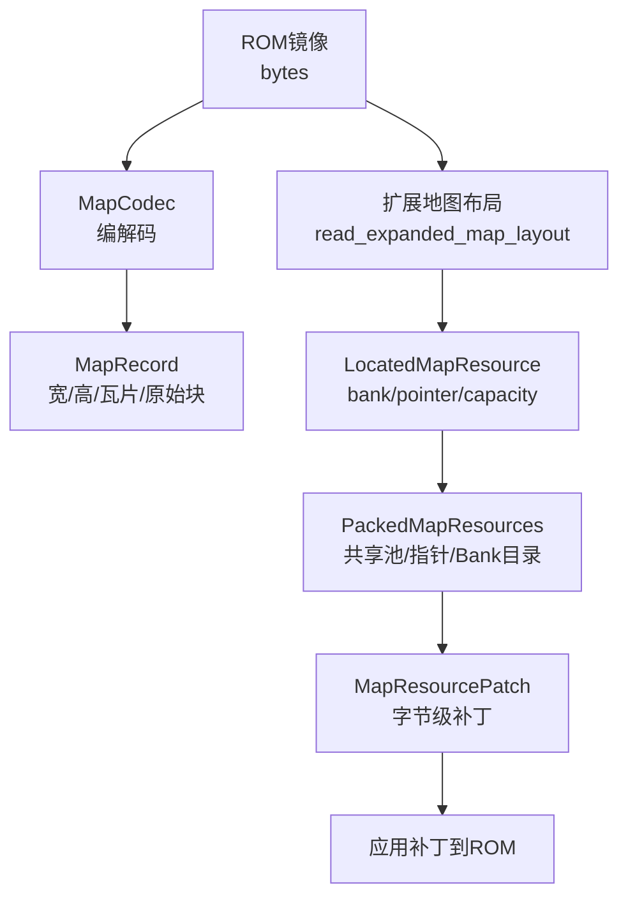
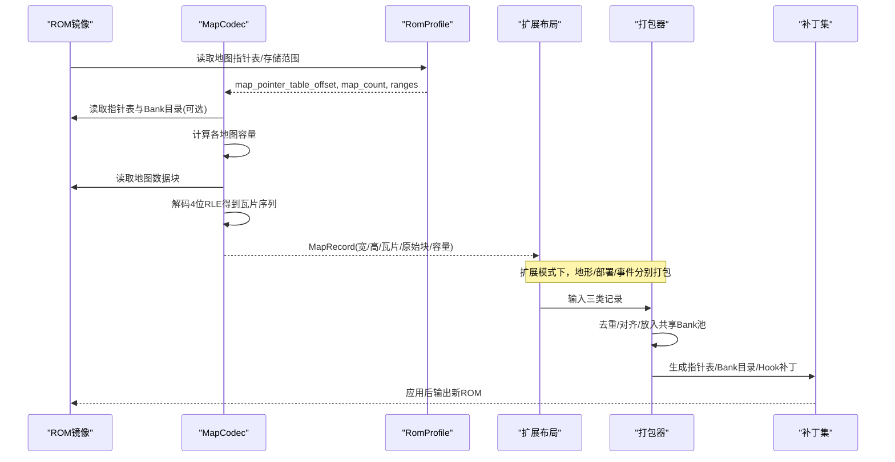
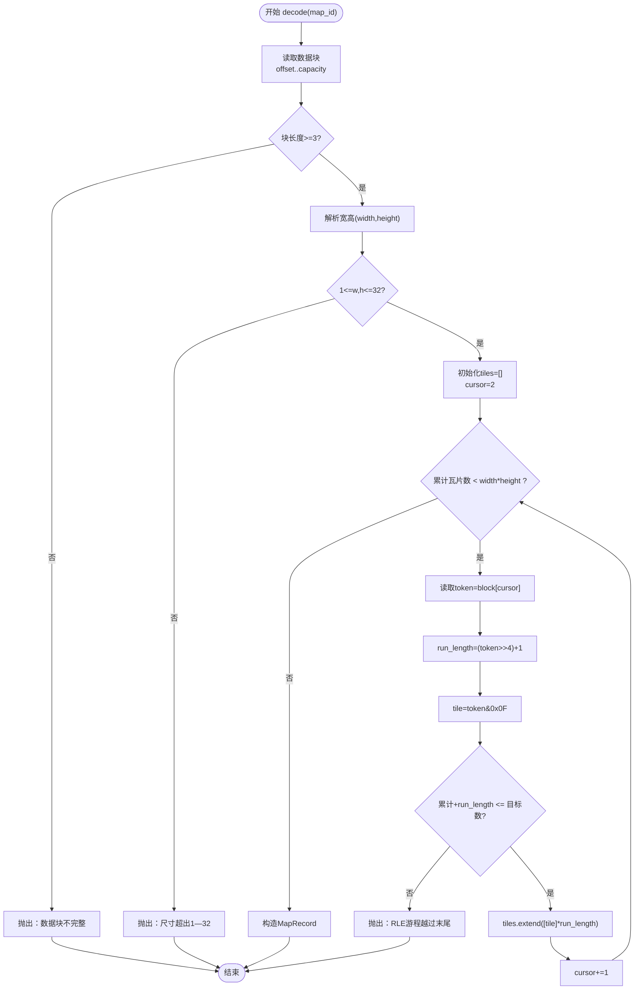
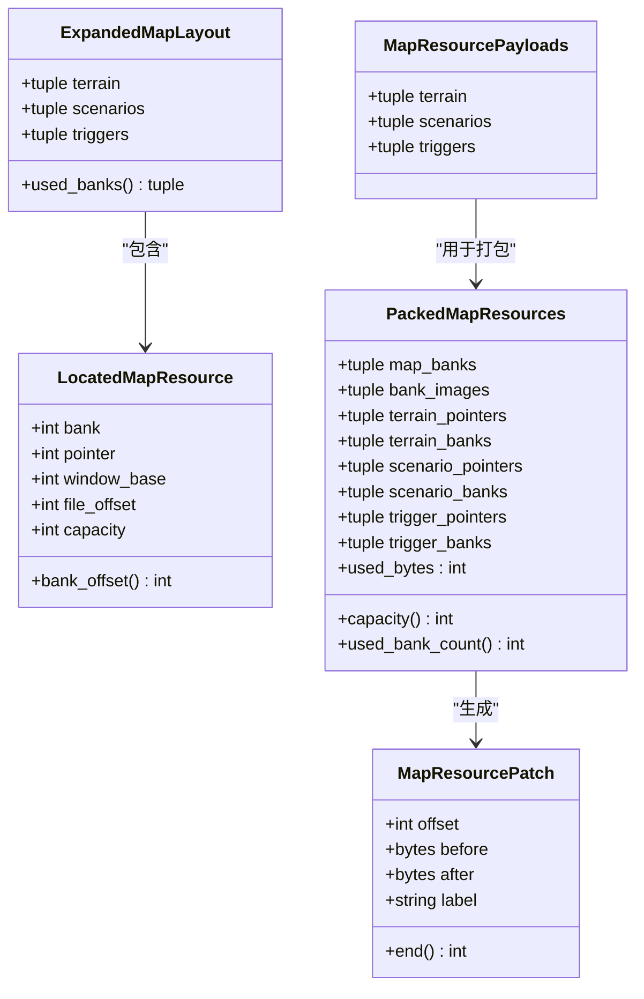
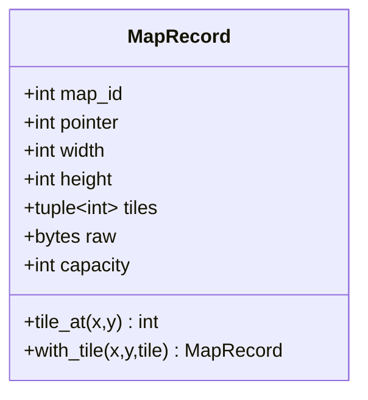
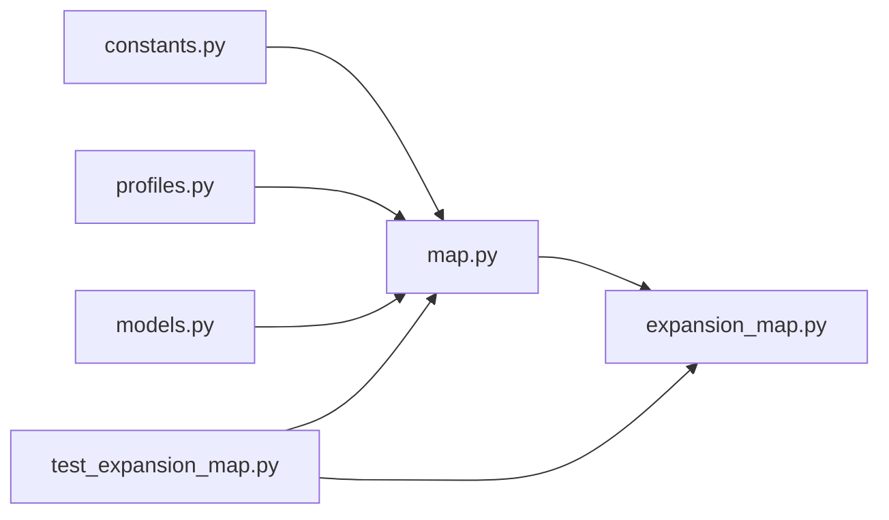

# 地图布局编解码器

<cite>
**本文引用的文件**
- [map.py](file://src/fc_editor/codecs/map.py)
- [expansion_map.py](file://src/fc_editor/expansion_map.py)
- [models.py](file://src/fc_editor/models.py)
- [constants.py](file://src/fc_editor/constants.py)
- [profiles.py](file://src/fc_editor/profiles.py)
- [test_expansion_map.py](file://tests/test_expansion_map.py)
</cite>

## 目录
1. [简介](#简介)
2. [项目结构](#项目结构)
3. [核心组件](#核心组件)
4. [架构总览](#架构总览)
5. [详细组件分析](#详细组件分析)
6. [依赖关系分析](#依赖关系分析)
7. [性能考量](#性能考量)
8. [故障排查指南](#故障排查指南)
9. [结论](#结论)
10. [附录](#附录)

## 简介
本技术文档聚焦于“地图布局编解码器”，围绕 MapCodec 类与扩展地图资源打包/链接流程，系统阐述以下要点：
- 4位地形RLE压缩格式与编码/解码算法
- 地图指针表管理与Bank空间分配机制
- 地图尺寸限制（1—32）、瓦片索引系统与容量计算
- 数据块结构、内存优化策略（去重、共享池）
- 具体数据结构示例、编码/解码流程、错误处理机制
- 地图验证规则、兼容性检查、性能优化建议

该实现同时覆盖原版ROM中的地图存储区与扩展MMC3模式下的多Bank地图池，确保在两种模式下均能正确读取、校验、写入并生成可应用的补丁。

## 项目结构
本项目中与地图编解码相关的关键代码主要分布在以下模块：
- 编解码核心：MapCodec（4位地形RLE编解码、容量受限替换）
- 扩展地图资源打包与链接：pack_map_resources、link_map_resources、read_expanded_map_layout/payloads
- 数据模型：MapRecord、ScenarioLayout等
- ROM配置与常量：RomProfile、MAP_MAX_WIDTH/HEIGHT、PRG_BANK_SIZE等
- 测试用例：对Hook点、指针表、容量与原子性进行验证

**图示来源**
- [map.py:16-228](file://src/fc_editor/codecs/map.py#L16-L228)
- [expansion_map.py:174-418](file://src/fc_editor/expansion_map.py#L174-L418)
- [models.py:309-341](file://src/fc_editor/models.py#L309-L341)
- [constants.py:8-33](file://src/fc_editor/constants.py#L8-L33)

**章节来源**
- [map.py:16-228](file://src/fc_editor/codecs/map.py#L16-L228)
- [expansion_map.py:174-418](file://src/fc_editor/expansion_map.py#L174-L418)
- [models.py:309-341](file://src/fc_editor/models.py#L309-L341)
- [constants.py:8-33](file://src/fc_editor/constants.py#L8-L33)

## 核心组件
- MapCodec：负责读取/写入ROM中地图记录，支持两种模式：
  - 原版模式：从固定地图指针表解析，容量由相邻指针或存储区边界决定
  - 扩展模式：通过外部提供的Bank表与偏移，按Bank内指针顺序计算容量
- 扩展地图打包/链接：将地形、部署、事件三类资源打包进共享的8KiB Bank池，生成指针表与Bank目录，并产出可安全应用的字节补丁集合
- 数据模型：MapRecord封装单张地图的语义信息（ID、指针、宽高、瓦片序列、原始块、容量），并提供坐标访问与瓦片修改方法

关键职责与约束：
- 地图尺寸限制：宽高必须在1—32之间
- 瓦片索引：逻辑地形编号为4位（0—15）
- RLE编码：每个编码单元包含游程长度（1—16）与4位瓦片值
- 容量计算：基于指针差或存储区边界；扩展模式下需保证同Bank内指针严格递增且无重复
- 错误处理：对不完整块、越界尺寸、RLE溢出、非法指针/Bank等进行明确报错

**章节来源**
- [map.py:16-228](file://src/fc_editor/codecs/map.py#L16-L228)
- [models.py:309-341](file://src/fc_editor/models.py#L309-L341)
- [expansion_map.py:174-418](file://src/fc_editor/expansion_map.py#L174-L418)

## 架构总览
下图展示从ROM镜像到地图记录的完整链路，以及扩展模式下资源打包与补丁生成的整体流程。

**图示来源**
- [map.py:49-117](file://src/fc_editor/codecs/map.py#L49-L117)
- [map.py:136-173](file://src/fc_editor/codecs/map.py#L136-L173)
- [expansion_map.py:174-418](file://src/fc_editor/expansion_map.py#L174-L418)
- [profiles.py:329-333](file://src/fc_editor/profiles.py#L329-L333)

## 详细组件分析

### MapCodec：4位地形RLE编解码与容量管理
- 指针表读取与校验
  - 原版模式：从profile指定的偏移读取小端16位指针数组，校验起始标记与存储窗口范围，并要求同一存储区内指针严格递增
  - 扩展模式：若提供独立Bank表，则强制指针位于$A000—$BFFF，并按Bank分组排序计算容量
- 容量计算
  - 原版模式：容量=下一指针-当前指针，或至存储区末尾
  - 扩展模式：按Bank内有序指针计算容量，禁止重复指针与负容量
- 数据块解码
  - 首两字节为宽高；后续为4位RLE流，游程长度=高半字节+1（1—16），低半字节为瓦片索引
  - 解码过程中严格校验：块长度、尺寸范围、RLE游程不越界
- 数据块编码
  - 输入宽高、瓦片序列，输出紧凑RLE；瓦片必须为0—15
- 容量受限替换
  - replacement_patch：先编码，再判断是否超过原容量；不超过则回填，保留未使用部分

**图示来源**
- [map.py:136-173](file://src/fc_editor/codecs/map.py#L136-L173)

**章节来源**
- [map.py:49-117](file://src/fc_editor/codecs/map.py#L49-L117)
- [map.py:136-173](file://src/fc_editor/codecs/map.py#L136-L173)
- [map.py:175-228](file://src/fc_editor/codecs/map.py#L175-L228)

### 扩展地图资源打包与链接
- 资源分类与配额
  - 地形记录：每图一个RLE块，保持独立存放
  - 部署记录与事件列表：相同内容共享存储（去重），避免冗余
- 共享池与Bank分配
  - 使用一组允许的PRG Bank作为共享池，按8KiB为单位放置记录
  - place函数负责在当前Bank剩余空间不足时切换到下一个Bank
  - 所有记录不得跨越Bank边界
- 指针表与Bank目录
  - 为地形、部署、事件三类分别生成指针表与Bank目录
  - 指针位于指定窗口基址（地形/事件$A000，部署$8000）
- Hook与调度器
  - 安装/验证地形调度器、部署解析Hook、事件Hook的代码片段
  - 确保ROM中对应位置匹配原版或已扩展版本
- 补丁构建与应用
  - 生成不可重叠的字节补丁集合，按偏移排序后应用
  - 应用前校验before区域未被篡改，保证原子性与一致性

**图示来源**
- [expansion_map.py:71-145](file://src/fc_editor/expansion_map.py#L71-L145)
- [expansion_map.py:174-418](file://src/fc_editor/expansion_map.py#L174-L418)

**章节来源**
- [expansion_map.py:174-418](file://src/fc_editor/expansion_map.py#L174-L418)
- [expansion_map.py:425-525](file://src/fc_editor/expansion_map.py#L425-L525)
- [expansion_map.py:528-609](file://src/fc_editor/expansion_map.py#L528-L609)

### 数据模型：MapRecord与关联字段
- MapRecord字段
  - map_id：地图标识
  - pointer：CPU指针
  - width/height：地图宽高
  - tiles：瓦片序列（长度为width*height）
  - raw：原始压缩块
  - capacity：数据块容量
- 约束与辅助方法
  - 宽高1—32，瓦片0—15
  - tile_at(x,y)：按行列获取瓦片
  - with_tile(x,y,tile)：返回新记录，仅修改指定瓦片

**图示来源**
- [models.py:309-341](file://src/fc_editor/models.py#L309-L341)

**章节来源**
- [models.py:309-341](file://src/fc_editor/models.py#L309-L341)

### 编码/解码流程与错误处理
- 解码流程
  - 读取数据块，校验最小长度
  - 解析宽高并校验范围
  - 逐字节解析RLE token，累计瓦片数量，防止越界
  - 构造MapRecord并返回
- 编码流程
  - 校验宽高、瓦片数量与取值范围
  - 扫描连续相同瓦片，生成长度1—16的游程与瓦片值组合
  - 输出紧凑RLE块
- 错误类型
  - RomFormatError：指针表不完整、指针越界、容量无效、RLE提前结束或溢出、Hook空洞被占用等
  - ValueError：宽高/瓦片范围、容量不足、重复Bank、补丁范围无效等
  - IndexError：地图ID越界

**章节来源**
- [map.py:49-117](file://src/fc_editor/codecs/map.py#L49-L117)
- [map.py:136-173](file://src/fc_editor/codecs/map.py#L136-L173)
- [map.py:175-228](file://src/fc_editor/codecs/map.py#L175-L228)
- [expansion_map.py:272-418](file://src/fc_editor/expansion_map.py#L272-L418)

### 地图数据块结构与容量计算
- 数据块结构
  - 第0字节：宽度
  - 第1字节：高度
  - 第2字节起：4位RLE流（游程长度高4位+1，瓦片低4位）
- 容量计算
  - 原版模式：next_pointer - current_pointer 或 data_end_pointer - current_pointer
  - 扩展模式：按Bank内有序指针计算，最后一条记录以PRG_BANK_SIZE为上限
- 容量限制
  - 单个记录不得跨Bank
  - 共享池内去重，减少重复占用

**章节来源**
- [map.py:85-117](file://src/fc_editor/codecs/map.py#L85-L117)
- [expansion_map.py:206-252](file://src/fc_editor/expansion_map.py#L206-L252)
- [expansion_map.py:496-525](file://src/fc_editor/expansion_map.py#L496-L525)

### 地图验证规则与兼容性检查
- 尺寸与瓦片范围：宽高1—32，瓦片0—15
- 指针合法性：位于允许窗口（原版存储区或扩展$A000—$BFFF）
- Bank有效性：仅限可用池，且无重复
- Hook完整性：调度器与Hook代码必须匹配预期或已扩展版本
- 容量与对齐：记录不跨Bank，容量为正，RLE不越界

**章节来源**
- [map.py:49-117](file://src/fc_editor/codecs/map.py#L49-L117)
- [expansion_map.py:147-171](file://src/fc_editor/expansion_map.py#L147-L171)
- [expansion_map.py:272-418](file://src/fc_editor/expansion_map.py#L272-L418)

## 依赖关系分析
- MapCodec依赖
  - constants：MAP_MAX_WIDTH/HEIGHT、PRG_BANK_SIZE、INES_HEADER_SIZE等
  - profiles：RomProfile提供指针表偏移、存储范围、计数等
  - models：MapRecord数据模型
  - errors：统一异常类型
- 扩展地图模块依赖
  - constants：PRG_BANK_SIZE、INES_HEADER_SIZE、CPU_BANK_BASE
  - expansion_map内部：多处Hook地址、原始/补丁字节、指针表偏移
- 测试依赖
  - py65模拟器：验证Hook行为与寄存器状态
  - RomImage：加载ROM镜像

**图示来源**
- [map.py:1-14](file://src/fc_editor/codecs/map.py#L1-L14)
- [expansion_map.py:1-9](file://src/fc_editor/expansion_map.py#L1-L9)
- [test_expansion_map.py:1-33](file://tests/test_expansion_map.py#L1-L33)

**章节来源**
- [map.py:1-14](file://src/fc_editor/codecs/map.py#L1-L14)
- [expansion_map.py:1-9](file://src/fc_editor/expansion_map.py#L1-L9)
- [test_expansion_map.py:1-33](file://tests/test_expansion_map.py#L1-L33)

## 性能考量
- RLE压缩效率
  - 地形图通常具有大量连续相同瓦片，4位RLE可显著压缩体积
  - 游程长度上限16，适合FC内存与带宽限制
- 共享池与去重
  - 部署与事件记录相同内容共享存储，降低重复占用
  - 按Bank顺序放置，减少碎片与切换开销
- 容量受限替换
  - replacement_patch在不扩容的前提下就地替换，避免重新布局
- 批量补丁应用
  - 预先生成不可重叠的补丁集合，按偏移排序后一次性应用，提升可靠性与速度

[本节为通用性能讨论，不直接分析具体文件]

## 故障排查指南
- 常见错误与定位
  - “地图指针表不完整”：检查profile.map_pointer_table_offset与map_count是否正确
  - “地图指针超出当前ROM的地图存储区”：确认指针位于允许窗口
  - “地图数据块不完整/RLE提前结束/越过末尾”：检查RLE编码是否合法
  - “扩展地图记录容量无效/重复指针”：检查Bank内指针排序与唯一性
  - “Hook空洞已被其他数据占用”：确认未与其他模块冲突
- 调试建议
  - 使用round_trip验证编解码一致性
  - 使用semantic_digest比较地图语义哈希，快速发现差异
  - 在测试中模拟MCU执行Hook，验证银行映射与返回值

**章节来源**
- [map.py:49-117](file://src/fc_editor/codecs/map.py#L49-L117)
- [map.py:136-173](file://src/fc_editor/codecs/map.py#L136-L173)
- [expansion_map.py:272-418](file://src/fc_editor/expansion_map.py#L272-L418)
- [test_expansion_map.py:129-363](file://tests/test_expansion_map.py#L129-L363)

## 结论
MapCodec与扩展地图打包/链接模块共同构成了完整的地图布局编解码体系：
- 以4位RLE为核心压缩方案，兼顾体积与解码效率
- 通过指针表与Bank目录管理多Bank地图资源，支持原版与扩展两种模式
- 严格的校验与错误处理保障数据完整性与兼容性
- 共享池与去重策略有效优化内存占用
- 单元测试覆盖Hook行为与容量限制，确保鲁棒性

建议在新增地图或调整布局时：
- 优先使用encode/decode与replacement_patch进行就地更新
- 对大规模变更采用link_map_resources进行统一打包与链接
- 利用测试用例验证Hook与指针表的一致性

[本节为总结性内容，不直接分析具体文件]

## 附录
- 关键常量参考
  - MAP_MAX_WIDTH/MAP_MAX_HEIGHT：32
  - PRG_BANK_SIZE：0x2000
  - INES_HEADER_SIZE：16
- 典型流程参考
  - 解码：decode(map_id) → MapRecord
  - 编码：encode(width, height, tiles) → bytes
  - 替换：replacement_patch(data, map_id, ...) → (offset, before, after)
  - 打包：pack_map_resources(...) → PackedMapResources
  - 链接：link_map_resources(...) → (linked_rom, packed, patches)

**章节来源**
- [constants.py:8-33](file://src/fc_editor/constants.py#L8-L33)
- [map.py:175-228](file://src/fc_editor/codecs/map.py#L175-L228)
- [expansion_map.py:174-418](file://src/fc_editor/expansion_map.py#L174-L418)