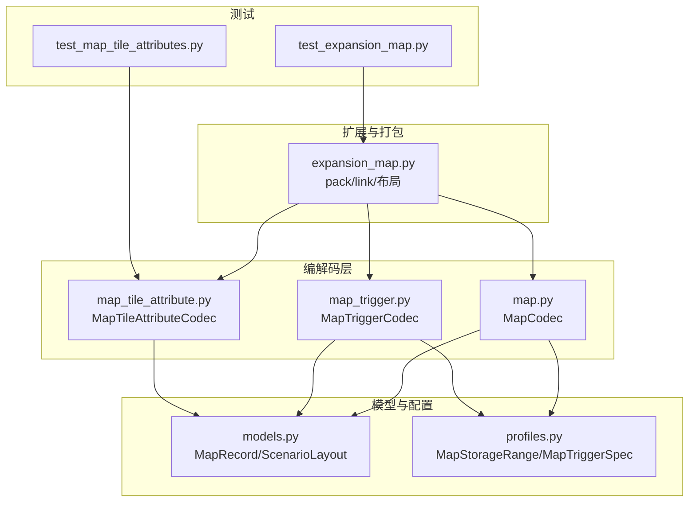
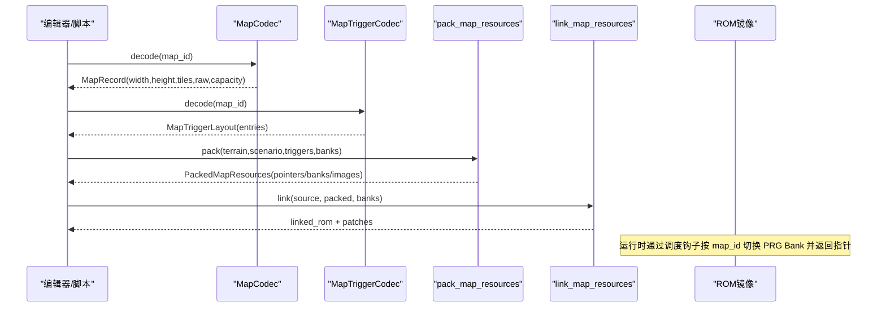
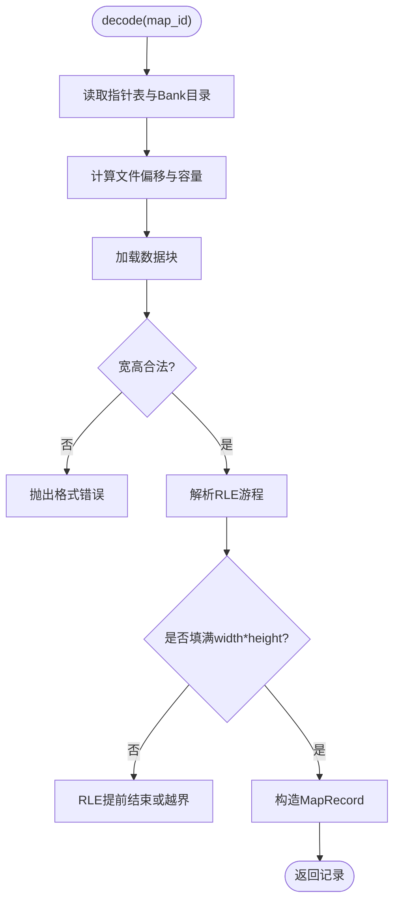
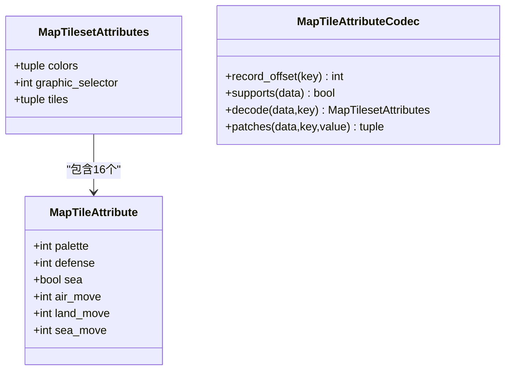
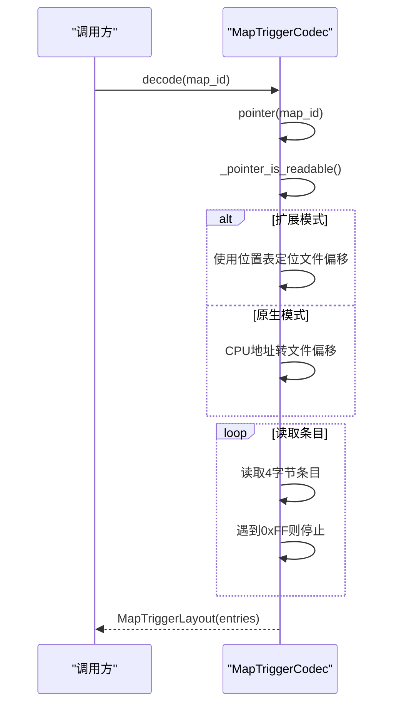
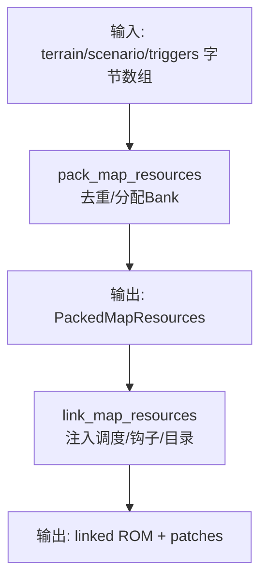
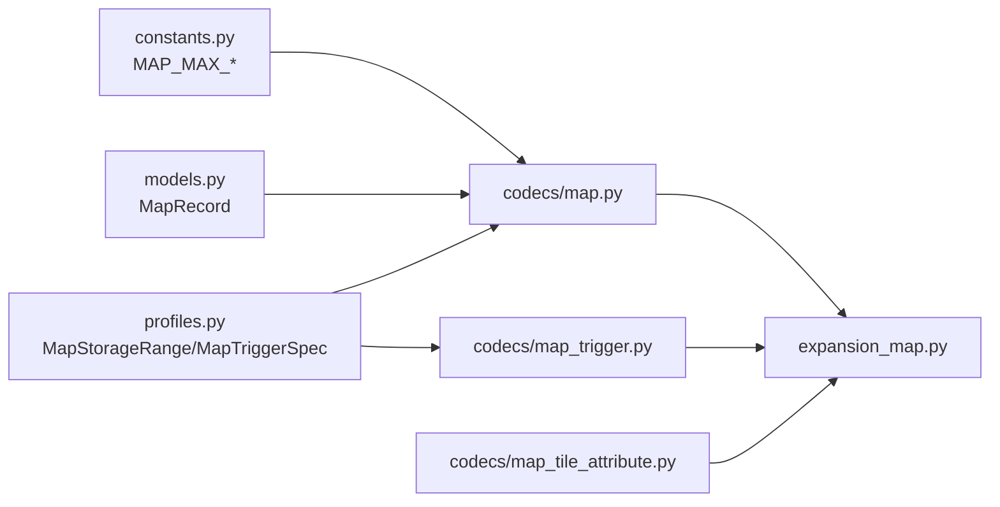

# 地图编解码器

<cite>
**本文引用的文件**
- [src/fc_editor/codecs/map.py](file://src/fc_editor/codecs/map.py)
- [src/fc_editor/codecs/map_tile_attribute.py](file://src/fc_editor/codecs/map_tile_attribute.py)
- [src/fc_editor/codecs/map_trigger.py](file://src/fc_editor/codecs/map_trigger.py)
- [src/fc_editor/models.py](file://src/fc_editor/models.py)
- [src/fc_editor/profiles.py](file://src/fc_editor/profiles.py)
- [src/fc_editor/expansion_map.py](file://src/fc_editor/expansion_map.py)
- [tests/test_expansion_map.py](file://tests/test_expansion_map.py)
- [tests/test_map_tile_attributes.py](file://tests/test_map_tile_attributes.py)
</cite>

## 目录
1. [简介](#简介)
2. [项目结构](#项目结构)
3. [核心组件](#核心组件)
4. [架构总览](#架构总览)
5. [详细组件分析](#详细组件分析)
6. [依赖关系分析](#依赖关系分析)
7. [性能与内存优化](#性能与内存优化)
8. [故障排查指南](#故障排查指南)
9. [结论](#结论)
10. [附录：数据格式与配置示例](#附录数据格式与配置示例)

## 简介
本技术文档围绕 FC 扩容 MMC3 项目的“地图编解码器”展开，系统性说明瓦片地图（Map）、地形属性（MapTileAttribute）、触发器（MapTrigger）等地图相关组件的数据格式、布局结构、索引系统、事件触发器定义、尺寸限制、内存优化策略与渲染性能考虑。文档同时给出地图验证规则、兼容性处理与调试工具使用方法，帮助开发者正确编辑、打包并链接扩展地图资源到 ROM。

## 项目结构
本项目将地图编解码能力集中在 fc_editor.codecs 子模块中，并通过 expansion_map 完成多类地图资源的统一打包与运行时重定向；models 提供不可变记录模型；profiles 提供 ROM 配置规格；测试覆盖关键路径与边界条件。

**图表来源**
- [src/fc_editor/codecs/map.py:16-228](file://src/fc_editor/codecs/map.py#L16-L228)
- [src/fc_editor/codecs/map_tile_attribute.py:11-143](file://src/fc_editor/codecs/map_tile_attribute.py#L11-L143)
- [src/fc_editor/codecs/map_trigger.py:13-259](file://src/fc_editor/codecs/map_trigger.py#L13-L259)
- [src/fc_editor/models.py:309-341](file://src/fc_editor/models.py#L309-L341)
- [src/fc_editor/profiles.py:74-175](file://src/fc_editor/profiles.py#L74-L175)
- [src/fc_editor/expansion_map.py:11-200](file://src/fc_editor/expansion_map.py#L11-L200)
- [tests/test_expansion_map.py:101-367](file://tests/test_expansion_map.py#L101-L367)
- [tests/test_map_tile_attributes.py:26-172](file://tests/test_map_tile_attributes.py#L26-L172)

**章节来源**
- [src/fc_editor/codecs/map.py:16-228](file://src/fc_editor/codecs/map.py#L16-L228)
- [src/fc_editor/codecs/map_tile_attribute.py:11-143](file://src/fc_editor/codecs/map_tile_attribute.py#L11-L143)
- [src/fc_editor/codecs/map_trigger.py:13-259](file://src/fc_editor/codecs/map_trigger.py#L13-L259)
- [src/fc_editor/models.py:309-341](file://src/fc_editor/models.py#L309-L341)
- [src/fc_editor/profiles.py:74-175](file://src/fc_editor/profiles.py#L74-L175)
- [src/fc_editor/expansion_map.py:11-200](file://src/fc_editor/expansion_map.py#L11-L200)
- [tests/test_expansion_map.py:101-367](file://tests/test_expansion_map.py#L101-L367)
- [tests/test_map_tile_attributes.py:26-172](file://tests/test_map_tile_attributes.py#L26-L172)

## 核心组件
- MapCodec：负责 4-bit 地形 RLE 编码/解码、容量校验、指针表解析、语义哈希与原地替换补丁生成。
- MapTileAttributeCodec：对 A-G 图库的图块属性进行只读解码与受控写入，严格校验调色板、移动补正与图形选择器。
- MapTriggerCodec：无损编辑坐标事件/商店列表，支持共享池压缩与指针表重排，兼容扩展地图位置表。
- 模型与配置：MapRecord/ScenarioLayout 提供不可变数据结构；MapStorageRange/MapTriggerSpec 描述存储范围与触发器布局。
- 扩展打包：pack_map_resources/link_map_resources 将地形、部署、触发器打包进指定 Bank 配额，并生成运行时跳转与目录补丁。

**章节来源**
- [src/fc_editor/codecs/map.py:16-228](file://src/fc_editor/codecs/map.py#L16-L228)
- [src/fc_editor/codecs/map_tile_attribute.py:11-143](file://src/fc_editor/codecs/map_tile_attribute.py#L11-L143)
- [src/fc_editor/codecs/map_trigger.py:13-259](file://src/fc_editor/codecs/map_trigger.py#L13-L259)
- [src/fc_editor/models.py:309-341](file://src/fc_editor/models.py#L309-L341)
- [src/fc_editor/profiles.py:74-175](file://src/fc_editor/profiles.py#L74-L175)
- [src/fc_editor/expansion_map.py:11-200](file://src/fc_editor/expansion_map.py#L11-L200)

## 架构总览
下图展示从 ROM 读取、解码、编辑到打包链接的端到端流程，以及运行时如何根据地图 ID 动态映射到对应 Bank 与指针。

**图表来源**
- [src/fc_editor/codecs/map.py:136-173](file://src/fc_editor/codecs/map.py#L136-L173)
- [src/fc_editor/codecs/map_trigger.py:119-151](file://src/fc_editor/codecs/map_trigger.py#L119-L151)
- [src/fc_editor/expansion_map.py:174-200](file://src/fc_editor/expansion_map.py#L174-L200)
- [tests/test_expansion_map.py:101-175](file://tests/test_expansion_map.py#L101-L175)

## 详细组件分析

### 瓦片地图 MapCodec
- 数据格式
  - 首两字节为宽高（1–32），后续为 4-bit 地形 RLE 游程编码，每个字节高 4 位为重复次数减一，低 4 位为逻辑地形编号（0–15）。
- 指针与容量
  - 从 ROM 的地图指针表读取 CPU 指针，计算文件偏移与容量；支持扩展模式下的独立 Bank 目录。
- 解码流程
  - 校验宽度/高度、RLE 游程不越界、数据块完整；输出 MapRecord。
- 编码与替换
  - encode 生成紧凑 RLE；replacement_patch 在容量内就地替换，超容报错。
- 语义哈希
  - semantic_digest 基于 width/height/tiles 计算，用于变更检测。

**图表来源**
- [src/fc_editor/codecs/map.py:49-117](file://src/fc_editor/codecs/map.py#L49-L117)
- [src/fc_editor/codecs/map.py:136-173](file://src/fc_editor/codecs/map.py#L136-L173)
- [src/fc_editor/constants.py:31-32](file://src/fc_editor/constants.py#L31-L32)

**章节来源**
- [src/fc_editor/codecs/map.py:16-228](file://src/fc_editor/codecs/map.py#L16-L228)
- [src/fc_editor/models.py:309-341](file://src/fc_editor/models.py#L309-L341)
- [src/fc_editor/constants.py:31-32](file://src/fc_editor/constants.py#L31-L32)

### 地形属性 MapTileAttributeCodec
- 数据布局
  - 固定起始地址与记录大小，A–G 七种图库，每种包含颜色表、图形选择器、16 个图块的调色板/防御/海陆空移动补正。
- 解码与校验
  - 校验图形选择器、调色板字节集合、移动补正上限；将原始字节映射为结构化对象。
- 写入与补丁
  - 仅允许修改颜色表与图块字段，禁止更改图形选择器；生成逐字节差异补丁。

**图表来源**
- [src/fc_editor/codecs/map_tile_attribute.py:11-93](file://src/fc_editor/codecs/map_tile_attribute.py#L11-L93)
- [src/fc_editor/codecs/map_tile_attribute.py:95-143](file://src/fc_editor/codecs/map_tile_attribute.py#L95-L143)

**章节来源**
- [src/fc_editor/codecs/map_tile_attribute.py:11-143](file://src/fc_editor/codecs/map_tile_attribute.py#L11-L143)
- [tests/test_map_tile_attributes.py:26-172](file://tests/test_map_tile_attributes.py#L26-L172)

### 触发器 MapTriggerCodec
- 数据格式
  - 每条触发器 4 字节：x、y、character_id、event_id；以 0xFF 终止符结尾。
- 解码流程
  - 从指针表读取指针，校验可读范围；扩展模式下使用位置表定位文件偏移；循环读取直到终止符。
- 编码与共享池
  - encode_entries 生成紧凑序列；repack_patches 将所有关卡的触发器列表去重后放入托管池，更新指针表。
- 验证规则
  - 坐标、人物 ID、事件 ID 范围检查；可选地图尺寸边界检查；同一坐标+限定人物不得重复。

**图表来源**
- [src/fc_editor/codecs/map_trigger.py:119-151](file://src/fc_editor/codecs/map_trigger.py#L119-L151)
- [src/fc_editor/codecs/map_trigger.py:157-187](file://src/fc_editor/codecs/map_trigger.py#L157-L187)
- [src/fc_editor/codecs/map_trigger.py:189-230](file://src/fc_editor/codecs/map_trigger.py#L189-L230)

**章节来源**
- [src/fc_editor/codecs/map_trigger.py:13-259](file://src/fc_editor/codecs/map_trigger.py#L13-L259)
- [src/fc_editor/profiles.py:145-175](file://src/fc_editor/profiles.py#L145-L175)

### 扩展地图打包与链接
- 资源打包
  - pack_map_resources 将地形、部署、触发器分别校验并合并入共享池，确保单条记录不超过 8 KiB Bank，相同部署/触发器列表复用存储。
- 运行时重定向
  - 通过插入调度代码与钩子，按 map_id 选择对应 Bank 与指针，保证游戏原逻辑不变。
- 目录与补丁
  - 写入地形/部署/触发器的 Bank 目录与指针表，生成精确补丁；测试验证原始字节与补丁一致性。

**图表来源**
- [src/fc_editor/expansion_map.py:174-200](file://src/fc_editor/expansion_map.py#L174-L200)
- [tests/test_expansion_map.py:101-251](file://tests/test_expansion_map.py#L101-L251)

**章节来源**
- [src/fc_editor/expansion_map.py:11-200](file://src/fc_editor/expansion_map.py#L11-L200)
- [tests/test_expansion_map.py:101-251](file://tests/test_expansion_map.py#L101-L251)

## 依赖关系分析
- MapCodec 依赖常量 MAP_MAX_WIDTH/MAP_MAX_HEIGHT 与 models.MapRecord，通过 profiles 中的存储范围计算容量与偏移。
- MapTriggerCodec 依赖 profiles.MapTriggerSpec 确定窗口、指针表、原始与托管数据范围。
- MapTileAttributeCodec 自包含校验规则，依赖 ROM 固定布局与颜色集。
- expansion_map 协调三类资源，生成运行时所需的 Bank 目录与调度补丁。

**图表来源**
- [src/fc_editor/codecs/map.py:7-13](file://src/fc_editor/codecs/map.py#L7-L13)
- [src/fc_editor/codecs/map_trigger.py:8-10](file://src/fc_editor/codecs/map_trigger.py#L8-L10)
- [src/fc_editor/expansion_map.py:1-9](file://src/fc_editor/expansion_map.py#L1-L9)

**章节来源**
- [src/fc_editor/codecs/map.py:7-13](file://src/fc_editor/codecs/map.py#L7-L13)
- [src/fc_editor/codecs/map_trigger.py:8-10](file://src/fc_editor/codecs/map_trigger.py#L8-L10)
- [src/fc_editor/expansion_map.py:1-9](file://src/fc_editor/expansion_map.py#L1-L9)

## 性能与内存优化
- 地图尺寸限制
  - 宽高限制在 1–32，超出即拒绝；RLE 游程长度最大 16，避免过度膨胀。
- 内存占用
  - 触发器采用共享池去重，显著减少重复列表占用的托管空间；打包时确保单条记录不跨 Bank。
- 渲染性能
  - 图块属性解码严格校验调色板与移动补正，保证运行时查表稳定；测试覆盖渲染路径，确保使用游戏效果调色板路由而非属性字段。
- 运行时开销
  - 调度钩子仅在进入地图相关例程时执行一次 Bank/指针切换，之后由目录直接命中目标数据。

[本节为通用性能讨论，不直接分析具体文件]

## 故障排查指南
- 地图数据不完整或 RLE 越界
  - 现象：解码时报错“数据块不完整”“RLE 数据提前结束”“游程越过地图末尾”。
  - 排查：确认宽高与 tiles 数量一致；检查 RLE 编码是否正确闭合。
  - 参考路径：[map.py:136-173](file://src/fc_editor/codecs/map.py#L136-L173)
- 触发器缺少终止符或指针越界
  - 现象：解码时报错“缺少 FF 结束码”“指针越界”。
  - 排查：确认 entries 以 0xFF 结尾；扩展模式下位置表与指针一致。
  - 参考路径：[map_trigger.py:119-151](file://src/fc_editor/codecs/map_trigger.py#L119-L151)
- 图块属性非法编码
  - 现象：解码时报错“含未验证的颜色表编码”“含未验证的移动补正编码”。
  - 排查：调色板值必须在允许集合；移动补正不超过上限；图形选择器必须匹配预期。
  - 参考路径：[map_tile_attribute.py:59-93](file://src/fc_editor/codecs/map_tile_attribute.py#L59-L93)
- 打包容量不足
  - 现象：repack/storage_used_after 报“托管池只有 X 字节”。
  - 排查：减少触发器条目或合并重复列表；扩大配额 Bank。
  - 参考路径：[map_trigger.py:189-230](file://src/fc_editor/codecs/map_trigger.py#L189-L230), [map_trigger.py:241-258](file://src/fc_editor/codecs/map_trigger.py#L241-L258)
- 链接失败或 Bank 无效
  - 现象：link_map_resources 报“不可用 Bank”“容量不足”。
  - 排查：确认配额 Bank 在允许范围内且无重复；确保所有记录不跨 Bank。
  - 参考路径：[expansion_map.py:147-171](file://src/fc_editor/expansion_map.py#L147-L171)

**章节来源**
- [src/fc_editor/codecs/map.py:136-173](file://src/fc_editor/codecs/map.py#L136-L173)
- [src/fc_editor/codecs/map_trigger.py:119-151](file://src/fc_editor/codecs/map_trigger.py#L119-L151)
- [src/fc_editor/codecs/map_trigger.py:189-230](file://src/fc_editor/codecs/map_trigger.py#L189-L230)
- [src/fc_editor/codecs/map_trigger.py:241-258](file://src/fc_editor/codecs/map_trigger.py#L241-L258)
- [src/fc_editor/codecs/map_tile_attribute.py:59-93](file://src/fc_editor/codecs/map_tile_attribute.py#L59-L93)
- [src/fc_editor/expansion_map.py:147-171](file://src/fc_editor/expansion_map.py#L147-L171)

## 结论
该地图编解码体系以强校验与不可变模型为核心，确保 ROM 数据完整性与可重现性。MapCodec 提供高效 RLE 编解码与容量约束；MapTileAttributeCodec 保障图块属性的安全编辑；MapTriggerCodec 通过共享池与指针表重排实现事件的高效存储与访问。配合 expansion_map 的打包与链接机制，可在有限 ROM 空间内灵活扩展地图内容，并通过测试保障运行时行为一致。

[本节为总结性内容，不直接分析具体文件]

## 附录：数据格式与配置示例
- 地图记录 MapRecord
  - 字段：map_id、pointer、width、height、tiles、raw、capacity。
  - 约束：宽高 1–32；tiles 数量为 width×height；逻辑地形编号 0–15；raw 长度在 2–capacity 之间。
  - 参考路径：[models.py:309-341](file://src/fc_editor/models.py#L309-L341)
- 地形属性 MapTilesetAttributes
  - 字段：colors（3 个 NES 色号）、graphic_selector（固定）、tiles（16 个 MapTileAttribute）。
  - 约束：调色板字节来自允许集合；移动补正 ≤ 最大值；禁止修改图形选择器。
  - 参考路径：[map_tile_attribute.py:11-93](file://src/fc_editor/codecs/map_tile_attribute.py#L11-L93), [map_tile_attribute.py:95-143](file://src/fc_editor/codecs/map_tile_attribute.py#L95-L143)
- 触发器 MapTrigger
  - 字段：x、y、character_id、event_id；event_id ≥ 0xF0 表示商店类型。
  - 约束：坐标与 ID 范围；可选地图尺寸边界；坐标+人物唯一。
  - 参考路径：[map_trigger.py:13-29](file://src/fc_editor/codecs/map_trigger.py#L13-L29), [map_trigger.py:157-187](file://src/fc_editor/codecs/map_trigger.py#L157-L187)
- 配置规格
  - MapStorageRange：定义地图 ID 区间、PRG Bank、窗口基址与数据结束指针。
  - MapTriggerSpec：定义触发器窗口、指针表、原始与托管数据范围。
  - 参考路径：[profiles.py:74-84](file://src/fc_editor/profiles.py#L74-L84), [profiles.py:145-175](file://src/fc_editor/profiles.py#L145-L175)

**章节来源**
- [src/fc_editor/models.py:309-341](file://src/fc_editor/models.py#L309-L341)
- [src/fc_editor/codecs/map_tile_attribute.py:11-143](file://src/fc_editor/codecs/map_tile_attribute.py#L11-L143)
- [src/fc_editor/codecs/map_trigger.py:13-187](file://src/fc_editor/codecs/map_trigger.py#L13-L187)
- [src/fc_editor/profiles.py:74-175](file://src/fc_editor/profiles.py#L74-L175)