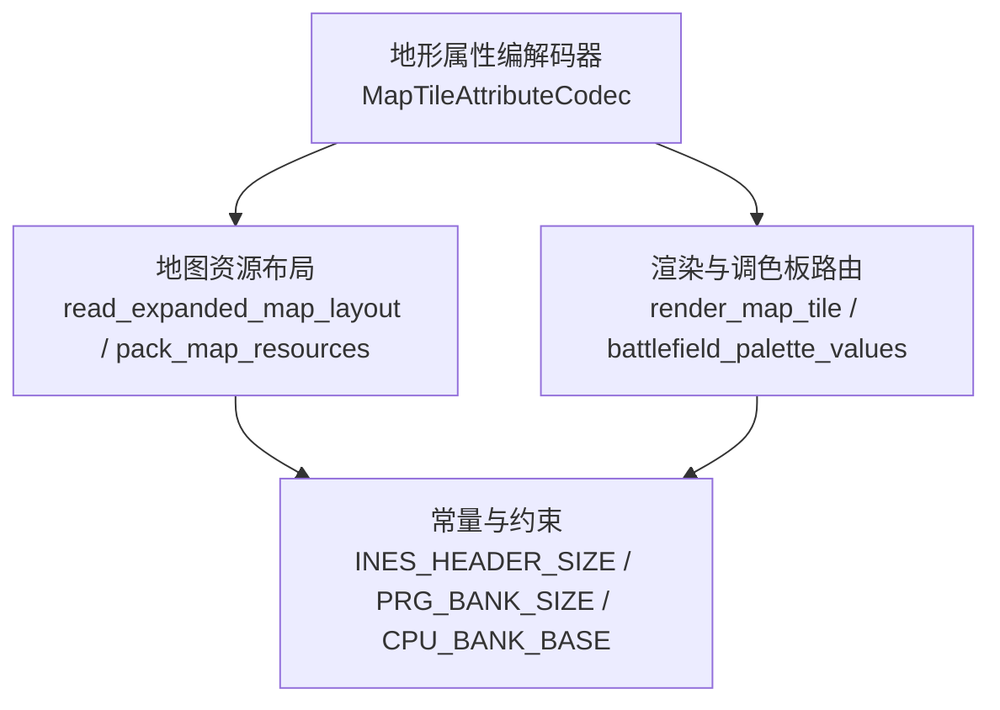
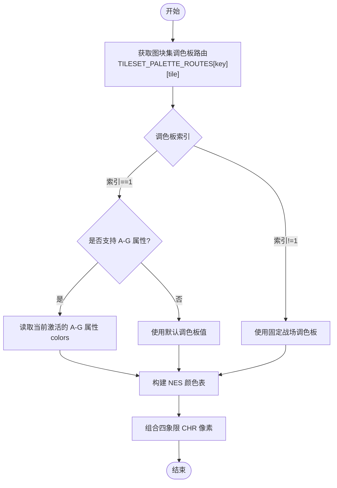
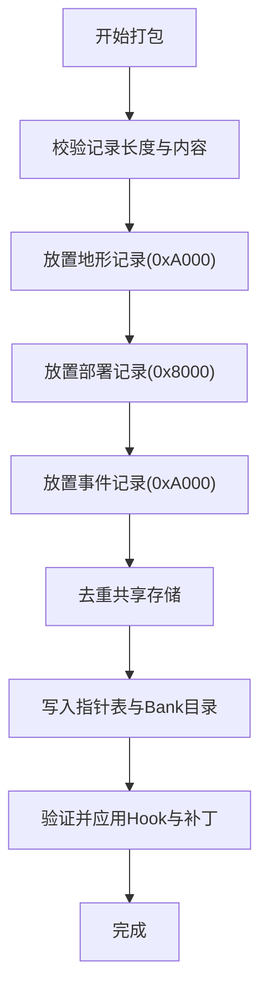
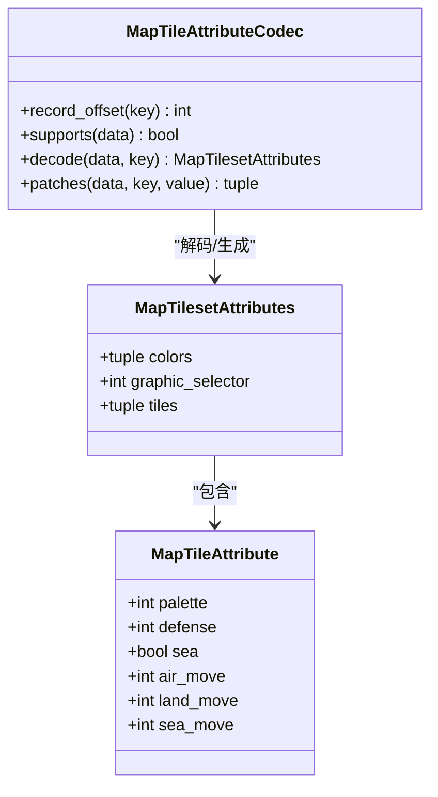

# 地形属性编解码器

<cite>
**本文引用的文件**
- [map_tile_attribute.py](file://src/fc_editor/codecs/map_tile_attribute.py)
- [expansion_map.py](file://src/fc_editor/expansion_map.py)
- [constants.py](file://src/fc_editor/constants.py)
- [map_tiles.py](file://src/dc_modifier/map_tiles.py)
- [test_map_tile_attributes.py](file://tests/test_map_tile_attributes.py)
</cite>

## 目录
1. [简介](#简介)
2. [项目结构](#项目结构)
3. [核心组件](#核心组件)
4. [架构总览](#架构总览)
5. [详细组件分析](#详细组件分析)
6. [依赖关系分析](#依赖关系分析)
7. [性能考虑](#性能考虑)
8. [故障排查指南](#故障排查指南)
9. [结论](#结论)
10. [附录](#附录)

## 简介
本技术文档聚焦于“地形属性编解码器”，围绕以下目标展开：
- 数据结构定义与字段含义：图块调色板、防御补正、水域标记、空/陆/海移动补正。
- 属性值映射关系：从 ROM 字节到结构化对象，以及反向编码为字节补丁。
- 效果配置机制：图形选择器、调色板路由、渲染时如何选取 NES 颜色表。
- 地形类型与移动代价：草地、道路、水域等类型的属性设置与移动补正计算方式。
- 存储格式与对齐：记录起始地址、单条记录长度、RLE 数据边界、Bank 窗口基址。
- 版本兼容性与校验：图形选择器白名单、颜色表编码白名单、移动补正上限校验。
- 配置示例与测试方法：基于单元测试的验证流程与回归策略。
- 调试工具与扩展开发：如何在编辑器中安全地读写地形属性，以及如何扩展新图库或新增字段。

## 项目结构
与地形属性编解码直接相关的代码主要分布在以下模块：
- 编解码核心：位于 fc_editor.codecs.map_tile_attribute，提供 A-G 图库的只读解码与可写补丁生成。
- 地图资源打包与布局：位于 expansion_map，负责地形记录在 PRG Bank 中的定位、指针表与 Bank 目录写入。
- 常量与约束：位于 constants，定义 iNES 头大小、PRG Bank 大小、CPU 窗口基址等基础常量。
- 渲染与调色板路由：位于 dc_modifier.map_tiles，将逻辑图块映射到实际使用的调色板索引，并支持运行时读取当前激活的 A-G 图块属性以决定颜色。
- 测试用例：位于 tests.test_map_tile_attributes，覆盖解码、补丁隔离性、撤销重做、持久化等场景。

图表来源
- [map_tile_attribute.py:28-93](file://src/fc_editor/codecs/map_tile_attribute.py#L28-L93)
- [expansion_map.py:174-252](file://src/fc_editor/expansion_map.py#L174-L252)
- [expansion_map.py:425-525](file://src/fc_editor/expansion_map.py#L425-L525)
- [constants.py:8-10](file://src/fc_editor/constants.py#L8-L10)
- [map_tiles.py:84-152](file://src/dc_modifier/map_tiles.py#L84-L152)

章节来源
- [map_tile_attribute.py:28-143](file://src/fc_editor/codecs/map_tile_attribute.py#L28-L143)
- [expansion_map.py:174-252](file://src/fc_editor/expansion_map.py#L174-L252)
- [expansion_map.py:425-525](file://src/fc_editor/expansion_map.py#L425-L525)
- [constants.py:8-10](file://src/fc_editor/constants.py#L8-L10)
- [map_tiles.py:84-152](file://src/dc_modifier/map_tiles.py#L84-L152)

## 核心组件
- MapTilesetAttributes：描述一个图块集（A-G）的颜色表三元组、图形选择器、以及 16 个图块的属性集合。
- MapTileAttribute：单个图块的属性，包含调色板索引、防御补正、是否水域、空/陆/海移动补正。
- MapTileAttributeCodec：对 ROM 中 A-G 图块属性记录进行解码、规范化校验、以及生成逐字节补丁；维护记录偏移、图形选择器白名单、颜色表编码白名单、移动补正上限等约束。
- expansion_map：负责地形记录在 PRG Bank 中的打包、去重、指针表与 Bank 目录写入，以及读取已扩展 ROM 的布局。
- map_tiles：将逻辑图块映射到渲染所需的调色板索引，并在运行时根据当前激活的 A-G 图块属性决定调色板 1 的具体颜色值。

章节来源
- [map_tile_attribute.py:11-93](file://src/fc_editor/codecs/map_tile_attribute.py#L11-L93)
- [expansion_map.py:174-252](file://src/fc_editor/expansion_map.py#L174-L252)
- [expansion_map.py:425-525](file://src/fc_editor/expansion_map.py#L425-L525)
- [map_tiles.py:84-152](file://src/dc_modifier/map_tiles.py#L84-L152)

## 架构总览
地形属性编解码器的工作流分为两条主线：
- 读取路径：从已扩展 ROM 中按固定偏移读取 A-G 图块属性记录，校验图形选择器与颜色表编码，解析出结构化对象。
- 写入路径：接收新的 MapTilesetAttributes，执行规范化校验，生成仅修改差异字节的补丁序列，由上层应用到 ROM。

图表来源
- [expansion_map.py:425-525](file://src/fc_editor/expansion_map.py#L425-L525)
- [map_tile_attribute.py:58-93](file://src/fc_editor/codecs/map_tile_attribute.py#L58-L93)
- [map_tile_attribute.py:119-143](file://src/fc_editor/codecs/map_tile_attribute.py#L119-L143)
- [map_tiles.py:108-152](file://src/dc_modifier/map_tiles.py#L108-L152)

## 详细组件分析

### 数据结构与字段语义
- MapTilesetAttributes
  - colors：长度为 3 的元组，表示调色板 1 的三个可见 NES 色号，范围 $00-$3F。
  - graphic_selector：图块集的图形选择器，必须匹配白名单（A-G 对应特定值）。
  - tiles：长度为 16 的元组，每个元素为 MapTileAttribute。
- MapTileAttribute
  - palette：位图调色板索引，取值 0—3。
  - defense：防御补正，取值 0—127。
  - sea：布尔值，表示该图块是否为水域。
  - air_move：空中移动补正，取值 0—16。
  - land_move：陆地移动补正，取值 0—16。
  - sea_move：海上移动补正，取值 0—16。

这些字段在 ROM 中的布局如下：
- 记录起始偏移：$6060，每条记录长度 0x54。
- 前 3 字节：colors。
- 第 4 字节：graphic_selector。
- 第 5—20 字节：16 个图块的调色板编码（00/55/AA/FF），解码后得到 palette 索引。
- 第 21—36 字节：16 个图块的防御补正与水域标志（低 7 位为 defense，最高位为 sea）。
- 第 37—52 字节：16 个图块的空中移动补正。
- 第 53—68 字节：16 个图块的陆地移动补正。
- 第 69—84 字节：16 个图块的海上移动补正。

章节来源
- [map_tile_attribute.py:11-93](file://src/fc_editor/codecs/map_tile_attribute.py#L11-L93)
- [map_tile_attribute.py:95-117](file://src/fc_editor/codecs/map_tile_attribute.py#L95-L117)

### 属性值映射与校验规则
- 图形选择器白名单：A—G 分别对应固定的选择器值，不允许通过 UI 修改。
- 颜色表编码白名单：仅允许 00/55/AA/FF 四种编码，防止非法调色板值。
- 移动补正上限：所有移动补正不得大于 16。
- 颜色表三元组：必须为三个 $00-$3F 的整数。
- 图块数量：必须恰好 16 个。

这些规则在解码与规范化阶段强制执行，确保编辑后的数据与原版行为一致。

章节来源
- [map_tile_attribute.py:35-40](file://src/fc_editor/codecs/map_tile_attribute.py#L35-L40)
- [map_tile_attribute.py:58-93](file://src/fc_editor/codecs/map_tile_attribute.py#L58-L93)
- [map_tile_attribute.py:95-117](file://src/fc_editor/codecs/map_tile_attribute.py#L95-L117)

### 效果配置机制与渲染
- 调色板路由：每个图块集（A—H）定义了 16 个逻辑图块对应的调色板索引（0—3）。
- 运行时调色板：对于调色板 1，若当前 ROM 支持 A-G 图块属性，则使用激活属性的 colors；否则使用预验证的默认值。
- 渲染过程：根据逻辑图块索引获取调色板索引，再根据图块集键与属性决定最终 NES 颜色，最后组合四象限 CHR 像素生成 16×16 预览图。

图表来源
- [map_tiles.py:57-82](file://src/dc_modifier/map_tiles.py#L57-L82)
- [map_tiles.py:84-99](file://src/dc_modifier/map_tiles.py#L84-L99)
- [map_tiles.py:108-152](file://src/dc_modifier/map_tiles.py#L108-L152)

章节来源
- [map_tiles.py:57-82](file://src/dc_modifier/map_tiles.py#L57-L82)
- [map_tiles.py:84-99](file://src/dc_modifier/map_tiles.py#L84-L99)
- [map_tiles.py:108-152](file://src/dc_modifier/map_tiles.py#L108-L152)

### 移动代价计算与地形类型
- 移动补正：空/陆/海三种移动方式的补正值直接影响移动代价。数值越大，移动越困难。
- 水域标记：sea 位用于标识该图块是否为水域，影响海移判定与相关效果触发。
- 防御补正：defense 位影响战斗阶段的防御结算。
- 典型地形类型（概念说明）：
  - 草地：通常具备较低移动补正与中等防御补正。
  - 道路：可能降低陆地移动补正以提升行军效率。
  - 水域：sea 置位，海移补正影响舰船移动，陆地移动受限。
  - 山地/森林：可能提高陆地移动补正并增加防御。
- 注意：具体数值需结合游戏内效果表与关卡设计，此处仅依据编解码器的字段语义与限制进行说明。

章节来源
- [map_tile_attribute.py:11-93](file://src/fc_editor/codecs/map_tile_attribute.py#L11-L93)
- [map_tile_attribute.py:95-117](file://src/fc_editor/codecs/map_tile_attribute.py#L95-L117)

### 存储格式、字节对齐与版本兼容
- 记录布局：
  - 起始偏移：$6060。
  - 记录长度：0x54（84 字节）。
  - 每图块占 1 字节（调色板/防御/移动补正），共 16 图块。
- 对齐要求：
  - 记录不跨 Bank，且受限于 PRG Bank 大小（0x2000）。
  - 地形记录采用 RLE 压缩，需在记录末尾正确截断，避免多余字节。
- 版本兼容：
  - 图形选择器白名单确保不同版本下图块集行为一致。
  - 颜色表编码白名单与移动补正上限保证兼容性。
  - 地图资源打包与 Hook 安装需保持原始/扩展代码段一致，否则拒绝应用补丁。

章节来源
- [map_tile_attribute.py:31-40](file://src/fc_editor/codecs/map_tile_attribute.py#L31-L40)
- [expansion_map.py:174-252](file://src/fc_editor/expansion_map.py#L174-L252)
- [expansion_map.py:528-544](file://src/fc_editor/expansion_map.py#L528-L544)
- [expansion_map.py:272-386](file://src/fc_editor/expansion_map.py#L272-L386)

### 属性数据的打包与链接
- 打包流程：
  - 校验地形/部署/事件记录长度与内容。
  - 将地形记录放入 0xA000 窗口，部署与事件记录分别在 0x8000/0xA000 窗口。
  - 相同部署/事件记录共享存储（去重）。
  - 生成指针表与 Bank 目录，写入固定偏移。
- 链接流程：
  - 验证 ROM 中地形调度器、部署 Hook、事件 Hook 是否处于预期状态。
  - 清理指定 Bank，写入地图资源池图像。
  - 应用补丁，确保无重叠写入。

图表来源
- [expansion_map.py:174-252](file://src/fc_editor/expansion_map.py#L174-L252)
- [expansion_map.py:272-386](file://src/fc_editor/expansion_map.py#L272-L386)

章节来源
- [expansion_map.py:174-252](file://src/fc_editor/expansion_map.py#L174-L252)
- [expansion_map.py:272-386](file://src/fc_editor/expansion_map.py#L272-L386)

### 类关系图（代码级）

图表来源
- [map_tile_attribute.py:11-93](file://src/fc_editor/codecs/map_tile_attribute.py#L11-L93)
- [map_tile_attribute.py:119-143](file://src/fc_editor/codecs/map_tile_attribute.py#L119-L143)

## 依赖关系分析
- 编解码器依赖：
  - 错误类型：RomFormatError，用于报告 ROM 格式异常。
  - 常量：INES_HEADER_SIZE、PRG_BANK_SIZE、CPU_BANK_BASE，用于定位与容量计算。
- 地图资源依赖：
  - 依赖编解码器对地形记录内容的合法性判断（RLE 截断、尺寸校验）。
  - 依赖 Hook 与指针表的固定偏移，确保运行时能正确切换 Bank。
- 渲染依赖：
  - 依赖图块集调色板路由与运行时属性，确保预览与实际游戏一致。

图表来源
- [map_tile_attribute.py:5](file://src/fc_editor/codecs/map_tile_attribute.py#L5)
- [constants.py:8-10](file://src/fc_editor/constants.py#L8-L10)
- [expansion_map.py:174-252](file://src/fc_editor/expansion_map.py#L174-L252)
- [map_tiles.py:84-152](file://src/dc_modifier/map_tiles.py#L84-L152)

章节来源
- [map_tile_attribute.py:5](file://src/fc_editor/codecs/map_tile_attribute.py#L5)
- [constants.py:8-10](file://src/fc_editor/constants.py#L8-L10)
- [expansion_map.py:174-252](file://src/fc_editor/expansion_map.py#L174-L252)
- [map_tiles.py:84-152](file://src/dc_modifier/map_tiles.py#L84-L152)

## 性能考虑
- 记录去重：部署与事件记录在打包时进行去重，减少冗余存储。
- 最小化补丁：编解码器仅生成发生变化的字节补丁，降低写入开销。
- 批量写入：地图资源补丁按偏移排序后合并写入，避免重复 I/O。
- 渲染优化：渲染时使用预计算的调色板路由与固定战场调色板，减少运行时计算。

[本节为通用性能建议，不直接分析具体文件]

## 故障排查指南
常见错误与处理：
- 图形选择器不匹配：检查图块集键是否正确，或 ROM 是否已被其他工具篡改。
- 颜色表编码非法：确认调色板编码仅为 00/55/AA/FF。
- 移动补超出界：确保所有移动补正在 0—16 范围内。
- 记录长度不足或越界：检查地形记录的 RLE 数据是否完整，避免提前结束或越过末尾。
- Hook 未安装或已被覆盖：验证地形调度器、部署 Hook、事件 Hook 的代码段是否与预期一致。
- 补丁重叠：确保生成的补丁偏移不重叠，必要时调整资源布局。

章节来源
- [map_tile_attribute.py:58-93](file://src/fc_editor/codecs/map_tile_attribute.py#L58-L93)
- [map_tile_attribute.py:95-117](file://src/fc_editor/codecs/map_tile_attribute.py#L95-L117)
- [expansion_map.py:528-544](file://src/fc_editor/expansion_map.py#L528-L544)
- [expansion_map.py:272-386](file://src/fc_editor/expansion_map.py#L272-L386)

## 结论
地形属性编解码器通过严格的字段校验与白名单机制，确保 A-G 图块属性在 ROM 中的可读性与可写性。配合地图资源打包与 Hook 安装，实现了地形属性与运行时渲染的一致性。遵循本指南的配置与测试方法，可在不破坏原版行为的前提下安全扩展地形效果。

[本节为总结性内容，不直接分析具体文件]

## 附录

### 属性配置示例（基于测试用例）
- 修改颜色表第一个值：
  - 步骤：获取当前 D 图块属性，替换 colors 的第一个元素，调用 patches 生成补丁并应用。
  - 参考：测试用例中对 colors 的增量修改与补丁位置验证。
- 修改图块调色板索引：
  - 步骤：替换某个图块的 palette 值，确保在 0—3 范围内，生成单字节补丁。
  - 参考：测试用例中对 palette 的循环递增与补丁隔离性验证。
- 修改防御补正与水域标志：
  - 步骤：调整 defense 值与 sea 位，确保在合法范围内，生成对应字节补丁。
  - 参考：测试用例中对 defense 与 sea 的独立修改与补丁偏移验证。
- 修改移动补正：
  - 步骤：分别调整 air_move、land_move、sea_move，确保不超过 16，生成对应字节补丁。
  - 参考：测试用例中对移动补正的循环递增与补丁隔离性验证。

章节来源
- [test_map_tile_attributes.py:122-140](file://tests/test_map_tile_attributes.py#L122-L140)
- [test_map_tile_attributes.py:150-167](file://tests/test_map_tile_attributes.py#L150-L167)

### 效果测试方法
- 单元测试覆盖：
  - 解码验证：确保所有 A-G 记录解码成功，且图形选择器与偏移符合预期。
  - 渲染一致性：验证渲染结果与游戏内效果一致，特别是调色板 1 的动态颜色。
  - 撤销重做与持久化：确保编辑后可撤销、重做，并能在保存后重新加载保持一致。
- 回归策略：
  - 每次修改编解码逻辑后，运行全部测试用例，确保补丁隔离性与字段边界校验有效。

章节来源
- [test_map_tile_attributes.py:35-46](file://tests/test_map_tile_attributes.py#L35-L46)
- [test_map_tile_attributes.py:62-95](file://tests/test_map_tile_attributes.py#L62-L95)
- [test_map_tile_attributes.py:115-120](file://tests/test_map_tile_attributes.py#L115-L120)
- [test_map_tile_attributes.py:150-167](file://tests/test_map_tile_attributes.py#L150-L167)

### 调试工具使用
- 查看图块属性：
  - 使用项目接口获取当前激活的图块属性，检查 colors、tiles 字段是否符合预期。
- 生成与应用补丁：
  - 调用编解码器的 patches 方法生成字节级补丁，确认补丁偏移与长度。
  - 通过项目接口应用补丁，并验证撤销重做功能。
- 渲染预览：
  - 使用渲染函数生成图块预览，对比游戏内效果，确保调色板路由正确。

章节来源
- [map_tile_attribute.py:119-143](file://src/fc_editor/codecs/map_tile_attribute.py#L119-L143)
- [map_tiles.py:108-152](file://src/dc_modifier/map_tiles.py#L108-L152)
- [test_map_tile_attributes.py:150-167](file://tests/test_map_tile_attributes.py#L150-L167)

### 扩展开发指南
- 新增图块集（如 H）：
  - 添加图形选择器与调色板路由，确保渲染一致。
  - 若无可写字典记录，仅支持只读渲染。
- 新增字段：
  - 在 MapTileAttribute 中添加新字段，并在编解码器中实现解码与规范化校验。
  - 更新补丁生成逻辑，确保仅修改必要字节。
- 版本兼容：
  - 保持白名单与上限校验，避免破坏原版行为。
  - 在打包与链接阶段增加对新字段的校验与写入。

[本节为扩展建议，不直接分析具体文件]