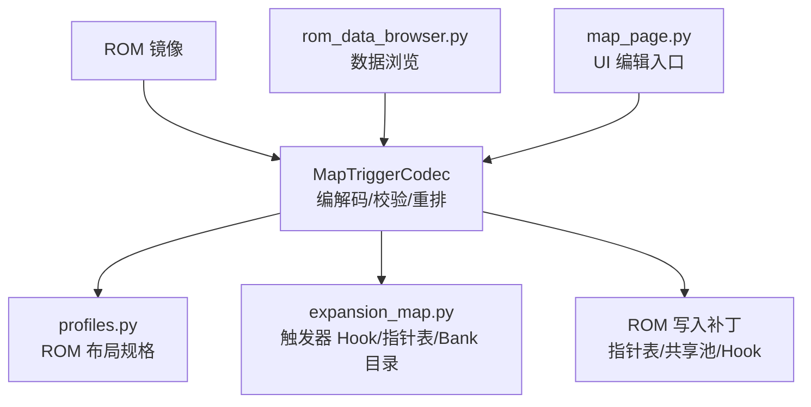
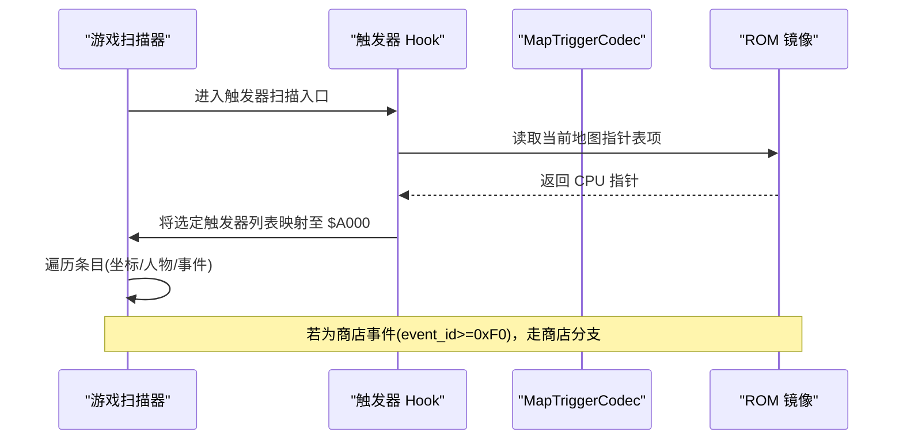
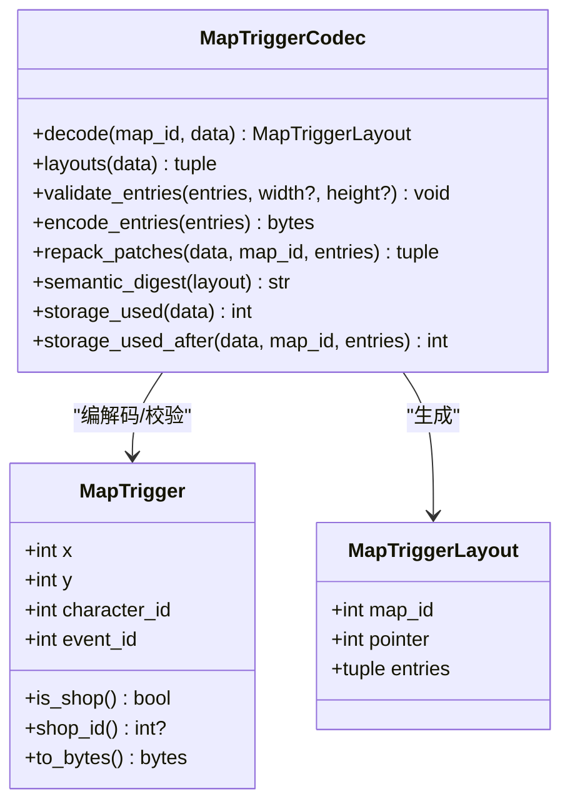
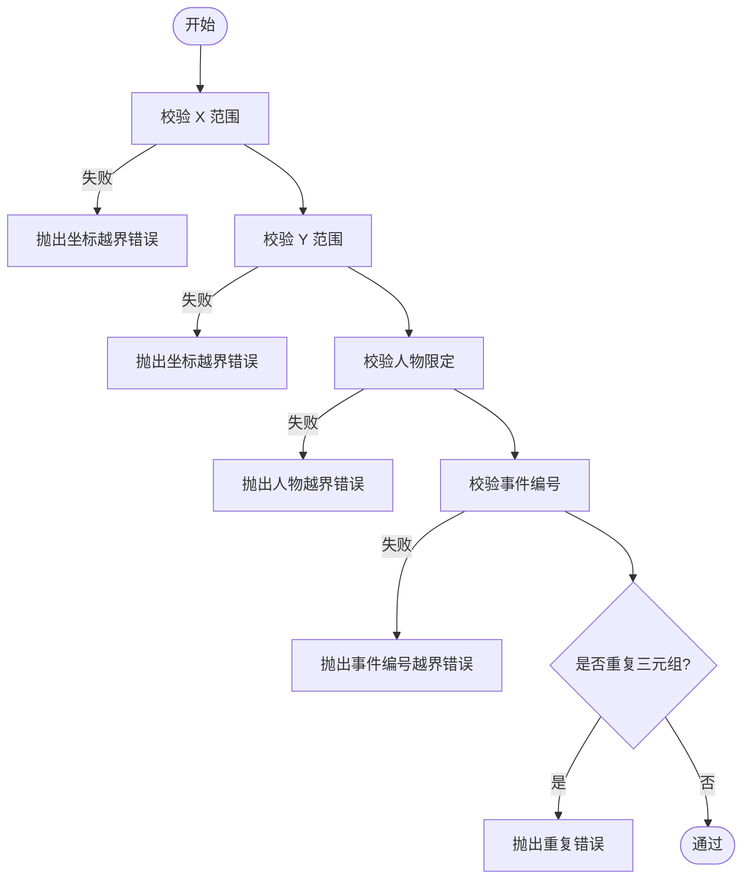
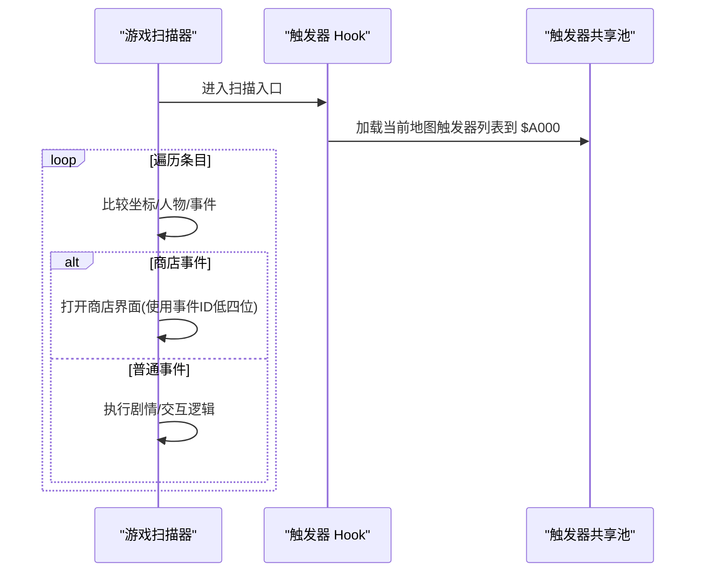
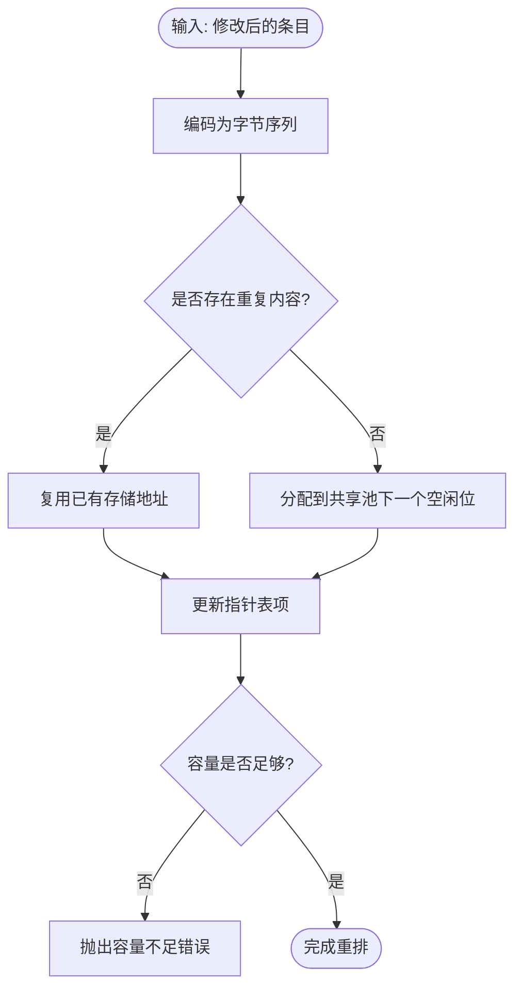
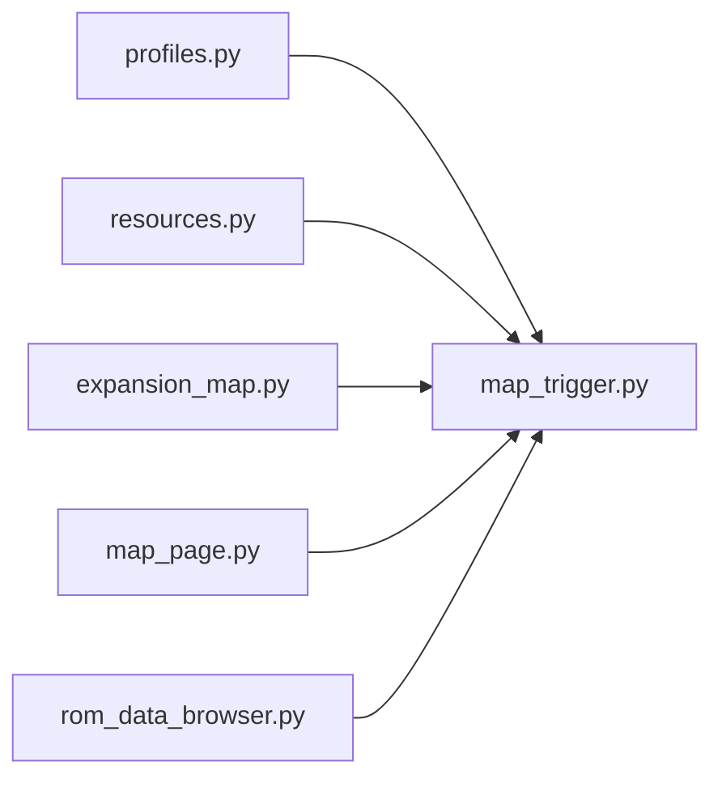

# 触发器编解码器

<cite>
**本文引用的文件**
- [map_trigger.py](file://src/fc_editor/codecs/map_trigger.py)
- [expansion_map.py](file://src/fc_editor/expansion_map.py)
- [profiles.py](file://src/fc_editor/profiles.py)
- [resources.py](file://src/fc_editor/resources.py)
- [rom_data_browser.py](file://src/dc_modifier/rom_data_browser.py)
- [map_page.py](file://src/dc_modifier/map_page.py)
</cite>

## 目录
1. [简介](#简介)
2. [项目结构](#项目结构)
3. [核心组件](#核心组件)
4. [架构总览](#架构总览)
5. [详细组件分析](#详细组件分析)
6. [依赖关系分析](#依赖关系分析)
7. [性能考量](#性能考量)
8. [故障排查指南](#故障排查指南)
9. [结论](#结论)
10. [附录](#附录)

## 简介
本技术文档聚焦“地图触发器”的编解码与运行时调度，覆盖数据结构、事件类型、条件判断机制、激活与执行流程、参数传递方式、优先级与冲突处理策略，并提供配置示例、流程图、调试方法与扩展接口说明。该子系统支持原版 ROM 内联存储与扩容后的共享池两种模式，确保无损编辑与可验证回写。

## 项目结构
触发器相关代码主要分布在以下模块：
- 编解码与校验：位于 codecs 层，负责读取/写入、压缩复用、语义摘要与容量检查。
- 运行期 Hook 与指针表：位于 expansion_map，定义触发器分发调用点、Hook 代码与 Bank 目录。
- ROM 配置：profiles 提供各 ROM 布局（Bank、窗口基址、指针表偏移、托管数据范围等）。
- 资源应用：resources 将配置映射到具体 ROM 地址空间。
- UI 与浏览器：dc_modifier 中的 map_page 与 rom_data_browser 暴露编辑与浏览能力。

图表来源
- [map_trigger.py:39-154](file://src/fc_editor/codecs/map_trigger.py#L39-L154)
- [expansion_map.py:57-68](file://src/fc_editor/expansion_map.py#L57-L68)
- [profiles.py:580-589](file://src/fc_editor/profiles.py#L580-L589)

章节来源
- [map_trigger.py:39-154](file://src/fc_editor/codecs/map_trigger.py#L39-L154)
- [expansion_map.py:57-68](file://src/fc_editor/expansion_map.py#L57-L68)
- [profiles.py:580-589](file://src/fc_editor/profiles.py#L580-L589)

## 核心组件
- MapTrigger：单条触发器记录，包含坐标、限定人物、事件编号；支持商店判定与商店 ID 提取。
- MapTriggerLayout：某关卡的触发器布局，含关卡 ID、CPU 指针与条目序列。
- MapTriggerCodec：触发器编解码器，负责指针解析、条目解码/编码、重复去重压缩、容量评估与语义摘要。
- Expansion 触发器 Hook：在 ROM 中注入分发调用与 Hook 代码，使游戏扫描器按当前地图选择对应触发器列表。
- Profiles：为不同 ROM 版本声明触发器指针表位置、窗口基址、托管数据范围等。

章节来源
- [map_trigger.py:13-37](file://src/fc_editor/codecs/map_trigger.py#L13-L37)
- [map_trigger.py:39-154](file://src/fc_editor/codecs/map_trigger.py#L39-L154)
- [expansion_map.py:57-68](file://src/fc_editor/expansion_map.py#L57-L68)
- [profiles.py:580-589](file://src/fc_editor/profiles.py#L580-L589)

## 架构总览
触发器系统由“静态配置 + 运行时调度”两部分组成：
- 静态配置：每个关卡在指针表中指向一个以 0xFF 结尾的条目序列；相同条目在不同关卡间可共享存储（去重压缩）。
- 运行时调度：游戏原逻辑通过固定调用点读取当前地图的触发器列表；扩容后通过 Hook 将选定的触发器列表映射到 $A000 供扫描器使用。

图表来源
- [expansion_map.py:57-68](file://src/fc_editor/expansion_map.py#L57-L68)
- [map_trigger.py:119-154](file://src/fc_editor/codecs/map_trigger.py#L119-L154)

## 详细组件分析

### 数据结构与事件类型
- 单条触发器字段
  - x、y：坐标字节，x 有效范围 0..0xFE，y 有效范围 0..0xFF。
  - character_id：限定人物，0xFF 表示不限定，否则需在 0..0xC7 范围内。
  - event_id：事件编号；当 event_id >= 0xF0 时视为商店事件，低四位为商店 ID。
- 布局对象
  - 包含 map_id、pointer、entries 元组；entries 以 0xFF 终止码结束。

图表来源
- [map_trigger.py:13-37](file://src/fc_editor/codecs/map_trigger.py#L13-L37)
- [map_trigger.py:39-154](file://src/fc_editor/codecs/map_trigger.py#L39-L154)

章节来源
- [map_trigger.py:13-37](file://src/fc_editor/codecs/map_trigger.py#L13-L37)
- [map_trigger.py:119-154](file://src/fc_editor/codecs/map_trigger.py#L119-L154)

### 条件判断机制与激活规则
- 坐标有效性：x、y 必须在合法范围；若提供地图宽高，还需满足 0<=x<width、0<=y<height。
- 人物限定：character_id 必须为 0xFF 或 0..0xC7。
- 事件编号：event_id 必须为 0..0xFF。
- 唯一性约束：同一关卡内 (x, y, character_id) 三元组不可重复。
- 终止符：条目序列必须以 0xFF 结尾，否则视为损坏。

图表来源
- [map_trigger.py:157-187](file://src/fc_editor/codecs/map_trigger.py#L157-L187)

章节来源
- [map_trigger.py:157-187](file://src/fc_editor/codecs/map_trigger.py#L157-L187)

### 执行动作与参数传递
- 执行入口：游戏原逻辑在固定偏移处调用触发器扫描；扩容后通过 Hook 将当前地图的触发器列表映射到 $A000，保持调用约定不变。
- 参数传递：触发器条目本身即参数载体，包含坐标、人物限定、事件编号；商店事件通过高四位识别并取低四位作为商店 ID。
- 运行时行为：扫描器根据条目顺序依次匹配玩家单位/坐标，命中后执行相应事件或商店逻辑。

图表来源
- [expansion_map.py:57-68](file://src/fc_editor/expansion_map.py#L57-L68)
- [map_trigger.py:20-29](file://src/fc_editor/codecs/map_trigger.py#L20-L29)

章节来源
- [expansion_map.py:57-68](file://src/fc_editor/expansion_map.py#L57-L68)
- [map_trigger.py:20-29](file://src/fc_editor/codecs/map_trigger.py#L20-L29)

### 与游戏事件的关联、优先级与冲突解决
- 关联方式：每个关卡的指针表项指向其触发器列表；相同列表内容在不同关卡间共享存储，避免冗余。
- 优先级：条目顺序即为匹配优先级；先出现的条目优先匹配。
- 冲突解决：同一坐标+人物的组合在同一关卡内不允许重复；若需多事件，应拆分为不同人物限定或不同坐标。

章节来源
- [map_trigger.py:157-187](file://src/fc_editor/codecs/map_trigger.py#L157-L187)
- [map_trigger.py:119-154](file://src/fc_editor/codecs/map_trigger.py#L119-L154)

### 存储模型与重排策略
- 原版模式：触发器数据位于指定 PRG Bank 的托管区域；首次编辑时将全部 32 个关卡的触发器列表压缩并重新打包到已验证的尾部区域，保留原始数据。
- 扩容模式：所有地图资源（地形、部署、触发器）统一放入分配好的 Bank 池中；触发器列表按内容去重复用，指针表与 Bank 目录同步更新。
- 容量检查：重排前会计算压缩后所需字节数并与可用容量对比，防止溢出。

图表来源
- [map_trigger.py:189-233](file://src/fc_editor/codecs/map_trigger.py#L189-L233)
- [expansion_map.py:200-252](file://src/fc_editor/expansion_map.py#L200-L252)

章节来源
- [map_trigger.py:189-233](file://src/fc_editor/codecs/map_trigger.py#L189-L233)
- [expansion_map.py:200-252](file://src/fc_editor/expansion_map.py#L200-L252)

### 配置示例与使用流程
- 配置要点（以 profiles 为例）
  - prg_bank：触发器所在 PRG Bank。
  - window_base：窗口基址，用于 CPU 地址到文件偏移转换。
  - pointer_table：指针表起始偏移。
  - scenario_count：关卡数量（通常为 0x20）。
  - original_data_start/end：原始数据范围（用于兼容性校验）。
  - managed_data_start/end：托管数据范围（用于重排与容量计算）。
- 典型流程
  - 读取：通过 codec.decode(map_id) 获取 MapTriggerLayout。
  - 编辑：构造新的条目序列，调用 encode_entries 与 validate_entries。
  - 重排：调用 repack_patches 或 pack_map_resources 生成补丁集。
  - 应用：将补丁应用到 ROM 副本，得到新镜像。

章节来源
- [profiles.py:580-589](file://src/fc_editor/profiles.py#L580-L589)
- [map_trigger.py:119-187](file://src/fc_editor/codecs/map_trigger.py#L119-L187)
- [expansion_map.py:272-386](file://src/fc_editor/expansion_map.py#L272-L386)

### 调试方法
- 数据浏览：rom_data_browser 支持查看当前地图的触发器条目，便于定位问题。
- 语义摘要：使用 semantic_digest 对布局进行哈希比对，快速发现差异。
- 容量审计：storage_used/storage_used_after 可用于预估重排后占用，提前规避溢出。
- 运行时断点：在 Hook 附近设置断点，观察 $A000 映射内容与寄存器状态是否符合预期。

章节来源
- [rom_data_browser.py:199-206](file://src/dc_modifier/rom_data_browser.py#L199-L206)
- [map_trigger.py:232-239](file://src/fc_editor/codecs/map_trigger.py#L232-L239)
- [expansion_map.py:57-68](file://src/fc_editor/expansion_map.py#L57-L68)

## 依赖关系分析
- MapTriggerCodec 依赖 profiles 提供的 ROM 布局信息，以及 RomImage 提供的数据访问。
- expansion_map 定义了触发器 Hook 与指针表偏移，并在构建补丁时与 codec 的输出协同。
- resources 将 profile 中的托管数据范围映射到 ROM 文件偏移，确保读写正确。
- dc_modifier 的 UI 与浏览器通过 project 接口间接调用 codec 与 expansion 能力。

图表来源
- [profiles.py:580-589](file://src/fc_editor/profiles.py#L580-L589)
- [resources.py:173-174](file://src/fc_editor/resources.py#L173-L174)
- [expansion_map.py:57-68](file://src/fc_editor/expansion_map.py#L57-L68)
- [map_trigger.py:39-154](file://src/fc_editor/codecs/map_trigger.py#L39-L154)
- [rom_data_browser.py:199-206](file://src/dc_modifier/rom_data_browser.py#L199-L206)
- [map_page.py:2283-2286](file://src/dc_modifier/map_page.py#L2283-L2286)

章节来源
- [profiles.py:580-589](file://src/fc_editor/profiles.py#L580-L589)
- [resources.py:173-174](file://src/fc_editor/resources.py#L173-L174)
- [expansion_map.py:57-68](file://src/fc_editor/expansion_map.py#L57-L68)
- [map_trigger.py:39-154](file://src/fc_editor/codecs/map_trigger.py#L39-L154)
- [rom_data_browser.py:199-206](file://src/dc_modifier/rom_data_browser.py#L199-L206)
- [map_page.py:2283-2286](file://src/dc_modifier/map_page.py#L2283-L2286)

## 性能考量
- 去重压缩：相同触发器列表在不同关卡间共享存储，显著减少 ROM 占用。
- 批量重排：一次性对所有关卡编码并压缩，避免多次 I/O。
- 容量预检：在重排前计算所需字节数，失败时尽早报错，避免无效写入。
- 运行时开销：Hook 仅做指针选择与映射，不引入额外循环，扫描器仍按线性遍历条目。

[本节为通用指导，无需特定文件引用]

## 故障排查指南
- 常见错误
  - 指针越界：关卡指针不在允许范围内，检查 profiles 与 ROM 布局。
  - 缺少终止符：条目未以 0xFF 结尾，检查编码输出。
  - 坐标/人物/事件越界：校验失败，检查输入值范围。
  - 重复三元组：同一关卡内 (x, y, character_id) 重复，需拆分条目。
  - 容量不足：重排后超出托管池，需扩大配额或精简条目。
- 定位步骤
  - 使用 semantic_digest 比对前后布局差异。
  - 通过 storage_used_after 预估容量变化。
  - 在 Hook 附近断点，确认 $A000 映射是否正确。
  - 使用 rom_data_browser 查看当前地图触发器条目。

章节来源
- [map_trigger.py:119-154](file://src/fc_editor/codecs/map_trigger.py#L119-L154)
- [map_trigger.py:157-187](file://src/fc_editor/codecs/map_trigger.py#L157-L187)
- [map_trigger.py:189-233](file://src/fc_editor/codecs/map_trigger.py#L189-L233)
- [rom_data_browser.py:199-206](file://src/dc_modifier/rom_data_browser.py#L199-L206)

## 结论
触发器编解码器提供了稳定、可验证的地图事件与商店编辑能力。通过严格的校验、去重压缩与 Hook 调度，既保证了原版 ROM 的兼容性，又支持扩容后的灵活资源管理。结合 UI 与浏览器工具，开发者可以高效地配置、调试与优化触发器逻辑。

[本节为总结性内容，无需特定文件引用]

## 附录

### API 参考（节选）
- MapTrigger
  - is_shop：判断是否为商店事件。
  - shop_id：提取商店 ID（仅商店事件有效）。
  - to_bytes：编码为 4 字节记录。
- MapTriggerCodec
  - decode：解码指定关卡的触发器布局。
  - layouts：解码全部关卡布局。
  - validate_entries：校验条目合法性与唯一性。
  - encode_entries：编码条目序列（含终止符）。
  - repack_patches：生成指针表与共享池的补丁集合。
  - semantic_digest：计算布局的语义哈希。
  - storage_used / storage_used_after：统计/预估存储占用。

章节来源
- [map_trigger.py:13-37](file://src/fc_editor/codecs/map_trigger.py#L13-L37)
- [map_trigger.py:119-239](file://src/fc_editor/codecs/map_trigger.py#L119-L239)

### 扩展开发接口
- 新增 ROM 支持
  - 在 profiles 中声明 map_triggers 相关字段（Bank、窗口基址、指针表、托管范围等）。
  - 如需 Hook，参照 expansion_map 中的常量与补丁构建流程。
- 自定义校验
  - 可在 validate_entries 基础上扩展宽度/高度限制或其他业务规则。
- 资源池扩展
  - 使用 pack_map_resources 统一管理地形、部署、触发器的 Bank 分配与去重。

章节来源
- [profiles.py:580-589](file://src/fc_editor/profiles.py#L580-L589)
- [expansion_map.py:272-386](file://src/fc_editor/expansion_map.py#L272-L386)
- [map_trigger.py:157-187](file://src/fc_editor/codecs/map_trigger.py#L157-L187)