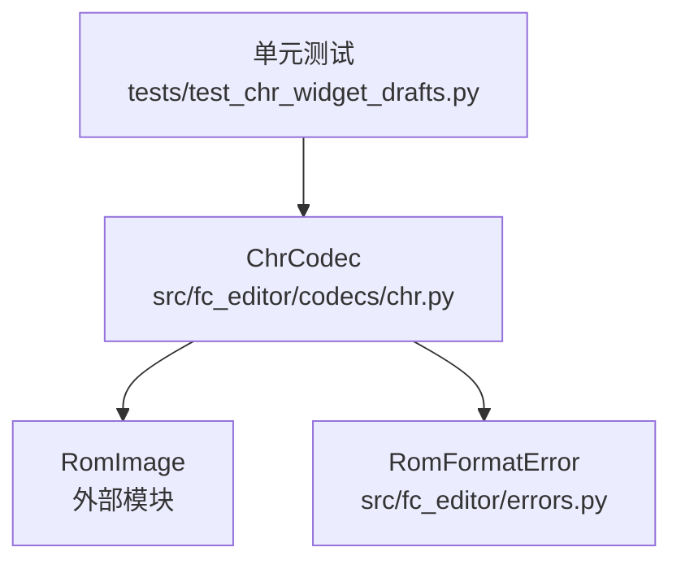
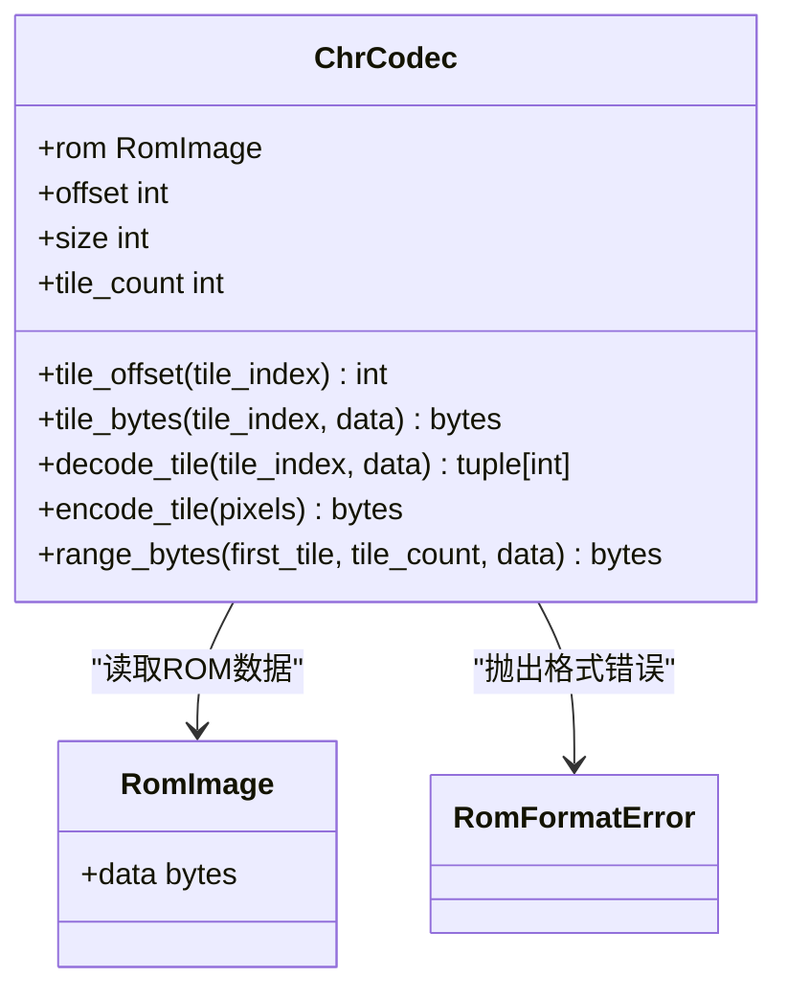
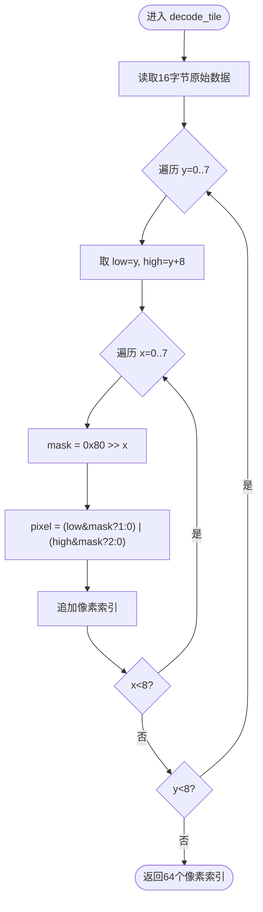
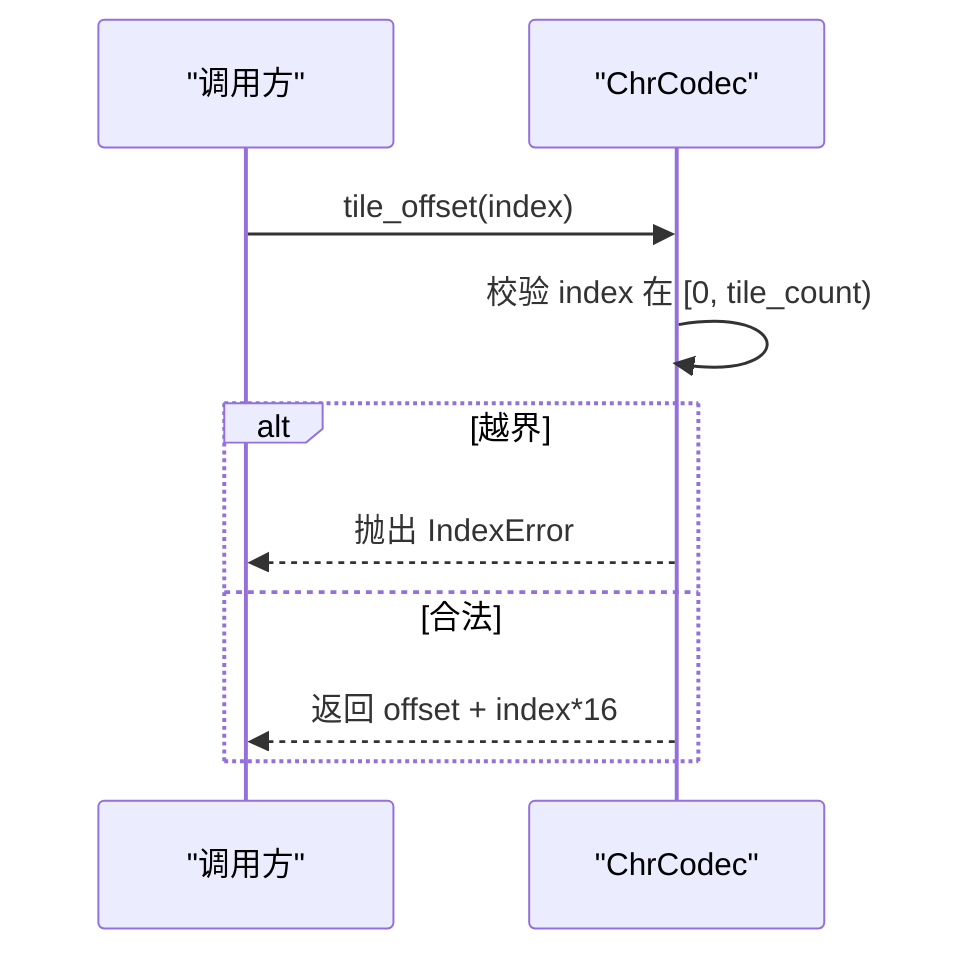
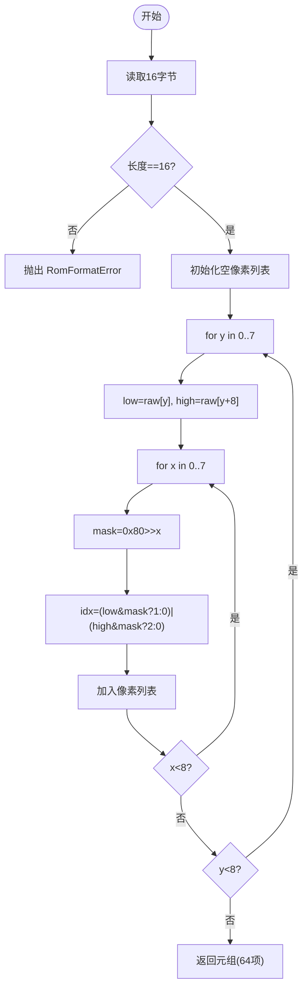
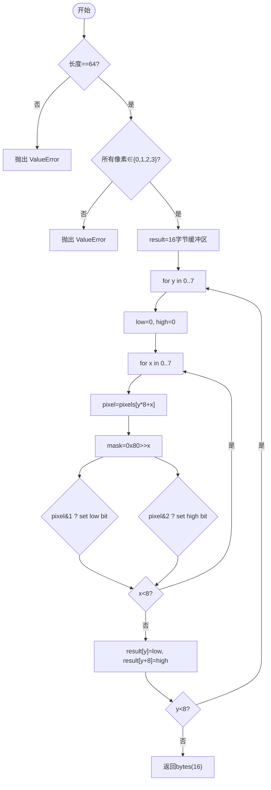
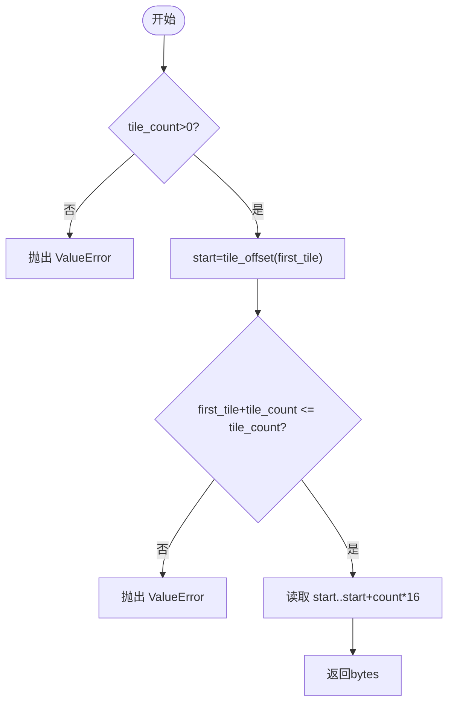
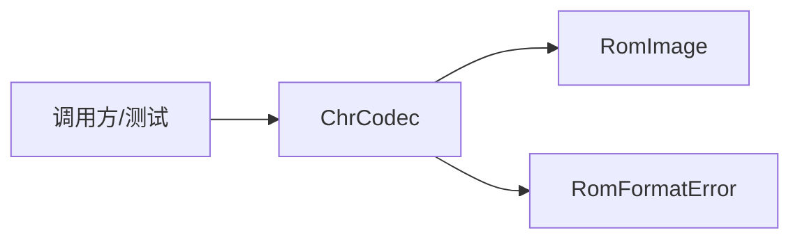

# CHR图块编解码器

<cite>
**本文引用的文件**
- [src/fc_editor/codecs/chr.py](file://src/fc_editor/codecs/chr.py)
- [src/fc_editor/errors.py](file://src/fc_editor/errors.py)
- [tests/test_chr_widget_drafts.py](file://tests/test_chr_widget_drafts.py)
</cite>

## 目录
1. [简介](#简介)
2. [项目结构](#项目结构)
3. [核心组件](#核心组件)
4. [架构总览](#架构总览)
5. [详细组件分析](#详细组件分析)
6. [依赖关系分析](#依赖关系分析)
7. [性能考虑](#性能考虑)
8. [故障排查指南](#故障排查指南)
9. [结论](#结论)
10. [附录](#附录)

## 简介
本技术文档聚焦于 NES CHR-ROM 的 2bpp 图块编解码实现，围绕 ChrCodec 类展开，系统说明：
- 2bpp 像素格式与 8×8 图块结构
- 调色板索引映射机制（0–3 的 4 色索引）
- tile_offset 计算、decode_tile 解码流程、encode_tile 编码流程
- CHR-ROM 内存布局定位、图块边界检查与数据完整性校验
- 典型操作示例：单图块读写、批量图块处理、像素数据转换
- 性能优化策略、内存使用模式、错误处理机制与调试方法

## 项目结构
与 CHR 图块编解码直接相关的代码位于 fc_editor 子包中：
- 编解码核心：src/fc_editor/codecs/chr.py
- 错误类型定义：src/fc_editor/errors.py
- 与 UI/工作流集成的测试用例：tests/test_chr_widget_drafts.py

图表来源
- [src/fc_editor/codecs/chr.py:11-94](file://src/fc_editor/codecs/chr.py#L11-L94)
- [src/fc_editor/errors.py:1-11](file://src/fc_editor/errors.py#L1-L11)
- [tests/test_chr_widget_drafts.py:1-391](file://tests/test_chr_widget_drafts.py#L1-L391)

章节来源
- [src/fc_editor/codecs/chr.py:1-94](file://src/fc_editor/codecs/chr.py#L1-L94)
- [src/fc_editor/errors.py:1-11](file://src/fc_editor/errors.py#L1-L11)
- [tests/test_chr_widget_drafts.py:1-391](file://tests/test_chr_widget_drafts.py#L1-L391)

## 核心组件
- ChrCodec：封装对 iNES CHR-ROM 的只读访问与无损编解码。负责：
  - 解析 ROM 头，定位 CHR-ROM 起始偏移与大小
  - 按图块索引计算字节偏移
  - 读取固定长度的图块原始字节
  - 将 2bpp 原始字节解码为 8×8 像素索引序列
  - 将 8×8 像素索引序列编码为 2bpp 原始字节
  - 提供连续图块范围读取能力

关键常量
- 每个图块 16 字节
- 每个图块 64 像素（8×8）

章节来源
- [src/fc_editor/codecs/chr.py:7-9](file://src/fc_editor/codecs/chr.py#L7-L9)
- [src/fc_editor/codecs/chr.py:11-94](file://src/fc_editor/codecs/chr.py#L11-L94)

## 架构总览
ChrCodec 作为“数据层”组件，向上暴露稳定的 API；向下通过 RomImage 访问 ROM 数据。错误通过自定义异常类型向外传播，便于上层统一处理。

图表来源
- [src/fc_editor/codecs/chr.py:11-94](file://src/fc_editor/codecs/chr.py#L11-L94)
- [src/fc_editor/errors.py:1-11](file://src/fc_editor/errors.py#L1-L11)

## 详细组件分析

### 2bpp 像素格式与 8×8 图块结构
- 一个图块由 16 字节组成，分为上下两个平面：
  - 低平面（low plane）：前 8 字节，每行 1 字节
  - 高平面（high plane）：后 8 字节，每行 1 字节
- 每行 8 个像素，从左到右对应位 7→0
- 每个像素由 low 和 high 两位组合得到 2bpp 索引：
  - 索引 = (high_bit << 1) | low_bit，取值 0–3
- 该索引即调色板索引，最终颜色由 PPU 的调色板寄存器决定

图表来源
- [src/fc_editor/codecs/chr.py:42-57](file://src/fc_editor/codecs/chr.py#L42-L57)

章节来源
- [src/fc_editor/codecs/chr.py:42-57](file://src/fc_editor/codecs/chr.py#L42-L57)

### 调色板索引映射机制
- 像素值域为 {0, 1, 2, 3}，分别对应 4 种调色板索引
- 编码器会严格校验输入像素是否在该范围内，否则抛出参数错误
- 解码器输出为元组形式的 64 个索引，可直接用于渲染或导出

章节来源
- [src/fc_editor/codecs/chr.py:59-64](file://src/fc_editor/codecs/chr.py#L59-L64)

### tile_offset 计算与边界检查
- 构造时从 ROM 头解析 trainer 长度、PRG 数量，计算 CHR-ROM 起始偏移与大小
- 校验 CHR-ROM 大小必须为正且恰好填满剩余空间，且必须是 16 字节的整数倍
- tile_offset 根据图块索引乘以 16 并加上基址，越界则抛索引错误

图表来源
- [src/fc_editor/codecs/chr.py:14-32](file://src/fc_editor/codecs/chr.py#L14-L32)

章节来源
- [src/fc_editor/codecs/chr.py:14-32](file://src/fc_editor/codecs/chr.py#L14-L32)

### decode_tile 像素解码过程
- 读取 16 字节原始数据，逐行提取 low/high 平面位
- 按位生成 0–3 的像素索引，顺序为逐行左到右
- 若原始数据不足 16 字节，抛出格式错误

图表来源
- [src/fc_editor/codecs/chr.py:42-57](file://src/fc_editor/codecs/chr.py#L42-L57)

章节来源
- [src/fc_editor/codecs/chr.py:42-57](file://src/fc_editor/codecs/chr.py#L42-L57)

### encode_tile 像素编码过程
- 输入必须为 64 个像素索引，且每个索引 ∈ {0,1,2,3}
- 按行构建 low/high 平面字节，写入 16 字节结果
- 不合法输入抛出参数错误

图表来源
- [src/fc_editor/codecs/chr.py:59-78](file://src/fc_editor/codecs/chr.py#L59-L78)

章节来源
- [src/fc_editor/codecs/chr.py:59-78](file://src/fc_editor/codecs/chr.py#L59-L78)

### range_bytes 批量图块读取
- 支持一次性读取连续多个图块的原始字节
- 校验图块数量大于零且范围不越界
- 内部复用 tile_offset 计算起点，避免重复开销

图表来源
- [src/fc_editor/codecs/chr.py:80-93](file://src/fc_editor/codecs/chr.py#L80-L93)

章节来源
- [src/fc_editor/codecs/chr.py:80-93](file://src/fc_editor/codecs/chr.py#L80-L93)

### CHR-ROM 内存布局与定位
- 通过 ROM 头确定 trainer 是否存在及 PRG 数量，从而计算 CHR-ROM 起始偏移与大小
- 要求 CHR-ROM 大小必须为正，且正好等于剩余空间，同时必须是 16 字节的整数倍
- 这些约束确保后续图块访问安全且完整

章节来源
- [src/fc_editor/codecs/chr.py:14-27](file://src/fc_editor/codecs/chr.py#L14-L27)

### 数据完整性验证
- 构造阶段：校验 CHR-ROM 大小合法性与对齐性
- 读取阶段：校验单个图块读取长度为 16 字节
- 批量阶段：校验范围不越界
- 编码阶段：校验像素数量与取值范围

章节来源
- [src/fc_editor/codecs/chr.py:14-27](file://src/fc_editor/codecs/chr.py#L14-L27)
- [src/fc_editor/codecs/chr.py:34-40](file://src/fc_editor/codecs/chr.py#L34-L40)
- [src/fc_editor/codecs/chr.py:80-93](file://src/fc_editor/codecs/chr.py#L80-L93)
- [src/fc_editor/codecs/chr.py:59-64](file://src/fc_editor/codecs/chr.py#L59-L64)

## 依赖关系分析
- 外部依赖
  - RomImage：提供 ROM 数据的只读访问
  - RomFormatError：用于报告 ROM 布局不匹配等格式错误
- 内部耦合
  - 编解码逻辑集中在 ChrCodec，职责单一，内聚度高
  - 通过常量定义图块尺寸，避免魔法数字散落

图表来源
- [src/fc_editor/codecs/chr.py:1-94](file://src/fc_editor/codecs/chr.py#L1-L94)
- [src/fc_editor/errors.py:1-11](file://src/fc_editor/errors.py#L1-L11)

章节来源
- [src/fc_editor/codecs/chr.py:1-94](file://src/fc_editor/codecs/chr.py#L1-L94)
- [src/fc_editor/errors.py:1-11](file://src/fc_editor/errors.py#L1-L11)

## 性能考虑
- 时间复杂度
  - decode_tile：O(64)，逐像素位运算
  - encode_tile：O(64)，逐像素位运算
  - range_bytes：O(N×16)，N 为图块数
- 空间复杂度
  - decode_tile：临时列表 O(64)，返回不可变元组
  - encode_tile：固定 16 字节缓冲
- 优化建议
  - 批量处理优先使用 range_bytes，减少多次偏移计算
  - 对高频图块可缓存已解码像素，避免重复解码
  - 使用字节级位运算，避免多余对象创建

[本节为通用指导，不直接分析具体文件]

## 故障排查指南
- 常见错误与触发点
  - 构造失败：CHR-ROM 大小非法或未对齐 → RomFormatError
  - 越界访问：图块索引超出范围 → IndexError
  - 数据不完整：读取图块不足 16 字节 → RomFormatError
  - 编码参数错误：像素数量不为 64 或取值不在 0–3 → ValueError
- 调试建议
  - 打印当前 ROM 头关键字段，确认 trainer/PRG/CHR 定位
  - 对 decode/encode 前后数据进行哈希比对，定位差异位置
  - 使用 range_bytes 导出整段 CHR 数据，用十六进制查看器核对
- 集成行为参考
  - 测试覆盖草稿提交、无效草稿拦截、导入/导出事务回滚等行为，可作为上层集成时的预期行为参考

章节来源
- [src/fc_editor/codecs/chr.py:14-27](file://src/fc_editor/codecs/chr.py#L14-L27)
- [src/fc_editor/codecs/chr.py:29-40](file://src/fc_editor/codecs/chr.py#L29-L40)
- [src/fc_editor/codecs/chr.py:59-64](file://src/fc_editor/codecs/chr.py#L59-L64)
- [tests/test_chr_widget_drafts.py:48-128](file://tests/test_chr_widget_drafts.py#L48-L128)
- [tests/test_chr_widget_drafts.py:240-387](file://tests/test_chr_widget_drafts.py#L240-L387)

## 结论
ChrCodec 以最小依赖实现了 NES CHR-ROM 的 2bpp 图块无损编解码，具备严格的边界检查与数据完整性校验。其清晰的 API 设计便于上层工具进行单图块与批量图块操作，并通过错误类型与测试用例保障健壮性与可维护性。结合批量读取与缓存策略，可在保证正确性的前提下获得良好性能。

[本节为总结性内容，不直接分析具体文件]

## 附录

### 典型操作示例（基于 API 的使用方式）
- 单图块读取与解码
  - 步骤：获取 tile_offset → 读取 16 字节 → decode_tile → 得到 64 个像素索引
  - 适用场景：编辑单个图块、预览、导出 BMP
- 单图块编码与写回
  - 步骤：准备 64 个像素索引 → encode_tile → 写回 ROM（由上层完成）
  - 适用场景：保存修改、导出 .chr/.dcunit
- 批量图块处理
  - 步骤：使用 range_bytes 读取连续 N 个图块 → 批量解码/编码 → 写回
  - 适用场景：整页替换、批量重映射、资产合并

[本节为概念性说明，不直接分析具体文件]