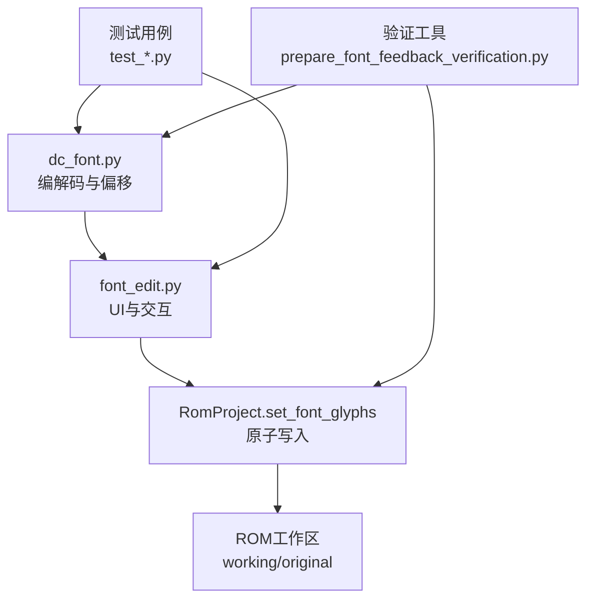
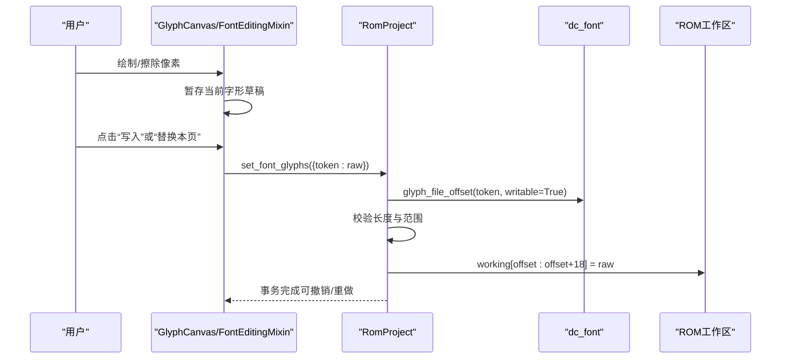
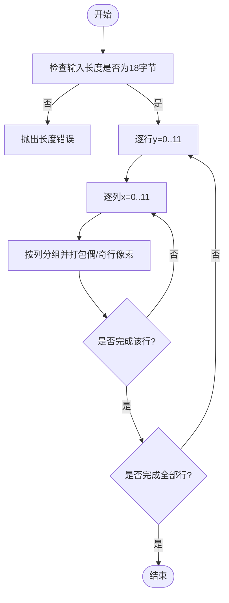
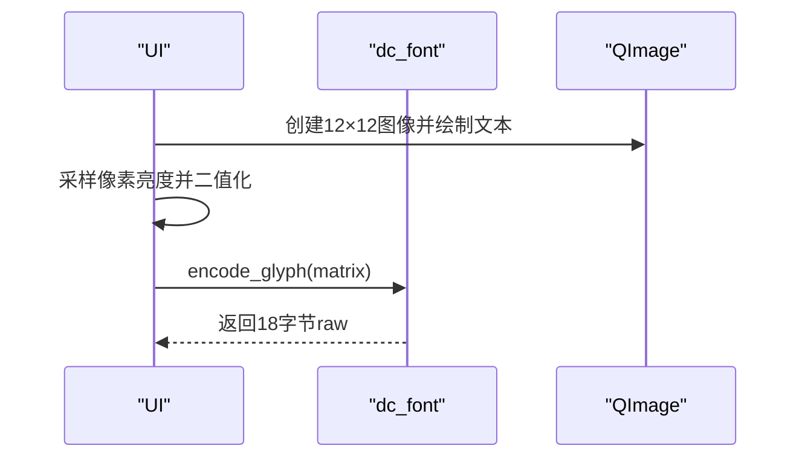
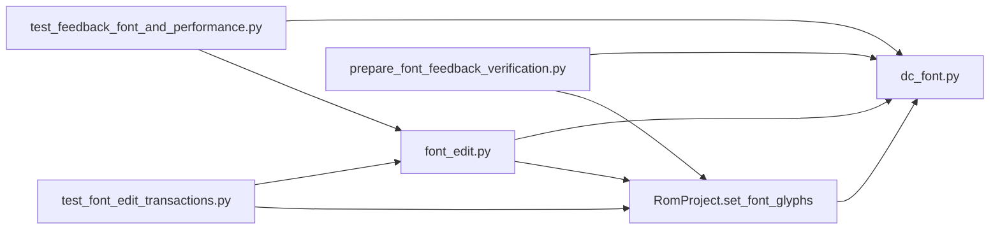

# DC字体编解码器

<cite>
**本文引用的文件**
- [dc_font.py](file://src/fc_editor/codecs/dc_font.py)
- [font_edit.py](file://src/dc_modifier/font_edit.py)
- [fc_rom_editor_core.py](file://src/fc_rom_editor_core.py)
- [test_feedback_font_and_performance.py](file://tests/test_feedback_font_and_performance.py)
- [test_font_edit_transactions.py](file://tests/test_font_edit_transactions.py)
- [prepare_font_feedback_verification.py](file://tools/prepare_font_feedback_verification.py)
</cite>

## 目录
1. [简介](#简介)
2. [项目结构](#项目结构)
3. [核心组件](#核心组件)
4. [架构总览](#架构总览)
5. [详细组件分析](#详细组件分析)
6. [依赖关系分析](#依赖关系分析)
7. [性能与优化](#性能与优化)
8. [故障排除指南](#故障排除指南)
9. [结论](#结论)
10. [附录：导入导出与验证示例](#附录导入导出与验证示例)

## 简介
本技术文档围绕DC项目的自定义字体编解码器，系统性说明其固定尺寸字形格式、字符集映射、字形数据存储结构、解析流程、渲染数据提取、多语言支持机制、压缩策略、缓存与显示优化、导入导出、配置与验证、兼容性处理、性能调优及扩展接口。该实现面向FC（NES）ROM中的字库区域，提供稳定可靠的编辑能力，并通过事务化写入保证一致性。

## 项目结构
- 编解码核心位于 fc_editor/codecs/dc_font.py，定义字形页头、单字大小、页面载荷大小、支持的项目配置文件以及编码/解码函数和偏移计算。
- UI与交互逻辑位于 dc_modifier/font_edit.py，封装了字形画布、批量暂存、导入导出、替换整页等能力。
- ROM工程集成在 fc_rom_editor_core.py 的 RomProject.set_font_glyphs，负责原子性写入与事务记录。
- 测试覆盖编解码往返、边界保护、事务撤销重做、并发冲突检测等关键路径。
- 工具脚本 prepare_font_feedback_verification.py 用于生成最小化的验证ROM与静态报告。

图表来源
- [dc_font.py:1-51](file://src/fc_editor/codecs/dc_font.py#L1-L51)
- [font_edit.py:1-273](file://src/dc_modifier/font_edit.py#L1-L273)
- [fc_rom_editor_core.py:1515-1530](file://src/fc_rom_editor_core.py#L1515-L1530)
- [test_feedback_font_and_performance.py:36-77](file://tests/test_feedback_font_and_performance.py#L36-L77)
- [test_font_edit_transactions.py:52-104](file://tests/test_font_edit_transactions.py#L52-L104)
- [prepare_font_feedback_verification.py:16-67](file://tools/prepare_font_feedback_verification.py#L16-L67)

章节来源
- [dc_font.py:1-51](file://src/fc_editor/codecs/dc_font.py#L1-L51)
- [font_edit.py:1-273](file://src/dc_modifier/font_edit.py#L1-L273)
- [fc_rom_editor_core.py:1515-1530](file://src/fc_rom_editor_core.py#L1515-L1530)

## 核心组件
- 字形页与偏移
  - 支持的页头集合与每字18字节、每页16行×14字的结构，E/F列为0列别名。
  - 通过页头与行列索引计算ROM内绝对偏移，确保写入安全范围。
- 字形编解码
  - 将12×12像素矩阵编码为三列垂直条带（每列4像素宽），每行两像素打包进一个字节（偶行高四位、奇行低四位），零为前景墨点。
  - 解码时按相同规则还原像素矩阵，并保留填充位为全1以保证可逆。
- 页面令牌生成
  - 根据页头生成所有有效token（行×列），用于遍历与批量操作。
- 工程集成
  - RomProject.set_font_glyphs对多个token进行校验后原子写入，使用事务包装以便撤销/重做。

章节来源
- [dc_font.py:10-31](file://src/fc_editor/codecs/dc_font.py#L10-L31)
- [dc_font.py:33-51](file://src/fc_editor/codecs/dc_font.py#L33-L51)
- [fc_rom_editor_core.py:1515-1530](file://src/fc_rom_editor_core.py#L1515-L1530)

## 架构总览
下图展示从UI到ROM的完整调用链：用户在字形画布编辑像素，暂存为草稿；确认提交后，通过RomProject原子写入ROM工作区；测试与工具脚本保障正确性与可验证性。

图表来源
- [font_edit.py:163-186](file://src/dc_modifier/font_edit.py#L163-L186)
- [fc_rom_editor_core.py:1515-1530](file://src/fc_rom_editor_core.py#L1515-L1530)
- [dc_font.py:16-24](file://src/fc_editor/codecs/dc_font.py#L16-L24)

## 详细组件分析

### 字形存储格式与算法
- 数据结构
  - 每个字形18字节，分为三列（x=0..3、4..7、8..11），每列6字节对应12行。
  - 每字节包含相邻两行的各4像素：高位为偶行像素，低位为奇行像素；0表示前景墨点，1为背景。
- 复杂度
  - 编解码均为O(12×12)常数级操作，时间复杂度O(1)，空间复杂度O(1)。
- 错误处理
  - 输入长度校验、像素值域校验、非法页头/列号抛出异常，防止越界与无效数据。

图表来源
- [dc_font.py:33-51](file://src/fc_editor/codecs/dc_font.py#L33-L51)

章节来源
- [dc_font.py:33-51](file://src/fc_editor/codecs/dc_font.py#L33-L51)

### 字符集映射与多语言支持
- 字符集映射
  - 通过页头与行列索引构成的token定位字形，E/F列为0列别名，避免重复存储。
  - 页面令牌生成函数提供所有合法token序列，便于遍历与批量替换。
- 多语言支持
  - UI层使用系统字体生成12×12预览，要求所选字体包含目标字符；若缺失则提示更换字体或直接编辑点阵。
  - 不改变ROM码表，仅替换固定字形数据，因此适用于多种语言的字形替换场景。

章节来源
- [dc_font.py:10-31](file://src/fc_editor/codecs/dc_font.py#L10-L31)
- [font_edit.py:131-143](file://src/dc_modifier/font_edit.py#L131-L143)

### 字体文件解析流程与渲染数据提取
- 解析流程
  - 读取ROM中指定token对应的18字节原始数据。
  - 解码为12×12像素矩阵供UI显示与编辑。
- 渲染数据提取
  - 从QImage采样像素亮度，二值化为0/1矩阵，再编码回18字节以匹配ROM格式。
  - 关闭抗锯齿以确保像素对齐一致。

图表来源
- [font_edit.py:131-143](file://src/dc_modifier/font_edit.py#L131-L143)
- [dc_font.py:40-51](file://src/fc_editor/codecs/dc_font.py#L40-L51)

章节来源
- [font_edit.py:131-143](file://src/dc_modifier/font_edit.py#L131-L143)
- [dc_font.py:40-51](file://src/fc_editor/codecs/dc_font.py#L40-L51)

### 压缩算法与字形缓存策略
- 压缩算法
  - 采用紧凑的二进制打包：每字节承载两个相邻行的各4像素，显著减少存储空间。
  - 无指针与布局移动，固定大小便于随机访问与直接写入。
- 缓存策略
  - UI侧维护当前字形草稿字典，避免频繁写入ROM；仅在确认提交时批量更新。
  - 页面级导入/导出以4032字节为单位（224个18字节字形），跳过E/F别名与行保留字节。

章节来源
- [dc_font.py:1-13](file://src/fc_editor/codecs/dc_font.py#L1-L13)
- [font_edit.py:61-106](file://src/dc_modifier/font_edit.py#L61-L106)
- [font_edit.py:212-249](file://src/dc_modifier/font_edit.py#L212-L249)

### 显示优化技术
- 关闭抗锯齿与固定像素尺寸，确保字形边缘清晰且与ROM格式严格对齐。
- 网格化绘制辅助线，提升编辑精度。
- 批量暂存与一次性提交，降低UI与ROM交互开销。

章节来源
- [font_edit.py:17-41](file://src/dc_modifier/font_edit.py#L17-L41)
- [font_edit.py:155-162](file://src/dc_modifier/font_edit.py#L155-L162)

### 字体兼容性处理
- 支持的项目配置白名单限制可写布局，未经验证的ROM仅允许预览。
- E/F列别名保护：禁止直接写入别名位置，强制编辑0列。
- 原子写入与事务：确保批量修改要么全部成功，要么完全回滚。

章节来源
- [dc_font.py:10-24](file://src/fc_editor/codecs/dc_font.py#L10-L24)
- [fc_rom_editor_core.py:1515-1530](file://src/fc_rom_editor_core.py#L1515-L1530)
- [font_edit.py:61-86](file://src/dc_modifier/font_edit.py#L61-L86)

### 扩展开发接口
- 新增字形页头或布局
  - 扩展GLYPH_PAGE_LEADS与偏移计算逻辑，保持每字18字节与页面载荷结构不变。
- 自定义渲染管线
  - 替换_render_character中的字体与绘制参数，但需保证输出为12×12二值矩阵。
- 批量导入导出
  - 遵循PAGE_PAYLOAD_SIZE与page_tokens约定，确保导入数据不含别名与保留字节。

章节来源
- [dc_font.py:10-31](file://src/fc_editor/codecs/dc_font.py#L10-L31)
- [font_edit.py:131-143](file://src/dc_modifier/font_edit.py#L131-L143)
- [font_edit.py:212-249](file://src/dc_modifier/font_edit.py#L212-L249)

## 依赖关系分析
- 模块耦合
  - font_edit.py依赖dc_font.py提供的编解码与偏移计算。
  - RomProject.set_font_glyphs作为统一入口，集中校验与事务管理。
- 外部依赖
  - PySide6用于UI与图像绘制。
  - RomProject管理ROM工作区与原始数据对比，支持撤销/重做。

图表来源
- [font_edit.py:8-11](file://src/dc_modifier/font_edit.py#L8-L11)
- [fc_rom_editor_core.py:1515-1530](file://src/fc_rom_editor_core.py#L1515-L1530)
- [test_feedback_font_and_performance.py:18-77](file://tests/test_feedback_font_and_performance.py#L18-L77)
- [test_font_edit_transactions.py:18-104](file://tests/test_font_edit_transactions.py#L18-L104)
- [prepare_font_feedback_verification.py:12-43](file://tools/prepare_font_feedback_verification.py#L12-L43)

章节来源
- [font_edit.py:8-11](file://src/dc_modifier/font_edit.py#L8-L11)
- [fc_rom_editor_core.py:1515-1530](file://src/fc_rom_editor_core.py#L1515-L1530)
- [test_feedback_font_and_performance.py:18-77](file://tests/test_feedback_font_and_performance.py#L18-L77)
- [test_font_edit_transactions.py:18-104](file://tests/test_font_edit_transactions.py#L18-L104)
- [prepare_font_feedback_verification.py:12-43](file://tools/prepare_font_feedback_verification.py#L12-L43)

## 性能与优化
- 编解码效率
  - 固定12×12与紧凑打包使编解码为常数时间，适合高频编辑。
- I/O优化
  - 批量暂存减少ROM写入次数；页面级导入导出一次处理4032字节。
- UI响应
  - 关闭抗锯齿与网格绘制提升渲染速度；事件驱动更新仅在像素变化时触发。
- 内存占用
  - 草稿字典仅保存变更字形，避免全量复制。

[本节为通用指导，不直接分析具体文件]

## 故障排除指南
- 常见错误
  - 字形长度非18字节：检查导入文件或编辑过程是否破坏格式。
  - 非法页头或列号：确认token属于支持页头且列号小于14。
  - 并发修改冲突：其他编辑已更改同一字形，需重新打开对话框。
- 诊断步骤
  - 使用测试用例验证编解码往返与边界保护。
  - 通过工具脚本生成最小化验证ROM，检查唯一修改位与撤销重做。
- 恢复策略
  - 利用事务撤销/重做恢复到上一状态。
  - 重新导入原始页面数据或清空页面后重试。

章节来源
- [test_feedback_font_and_performance.py:36-77](file://tests/test_feedback_font_and_performance.py#L36-L77)
- [test_font_edit_transactions.py:88-104](file://tests/test_font_edit_transactions.py#L88-L104)
- [prepare_font_feedback_verification.py:16-67](file://tools/prepare_font_feedback_verification.py#L16-L67)

## 结论
DC字体编解码器以固定尺寸与紧凑打包为核心，结合严格的偏移计算与原子写入，提供了高效、可靠、易用的字形编辑能力。UI层的多语言预览与批量操作提升了用户体验，测试与工具脚本保障了正确性与可验证性。未来扩展可通过增加页头、调整渲染管线与批量I/O策略实现。

[本节为总结，不直接分析具体文件]

## 附录：导入导出与验证示例
- 导入一页点阵
  - 选择4032字节文件，自动映射到当前页的224个字形，跳过E/F别名与保留字节。
  - 参考路径：[import_font_page:212-227](file://src/dc_modifier/font_edit.py#L212-L227)
- 导出一页点阵
  - 导出当前可见内容，包括未提交的当前字形；自动补全后缀为.dcfont。
  - 参考路径：[export_font_page:229-249](file://src/dc_modifier/font_edit.py#L229-L249)
- 字符集配置
  - 通过系统字体选择器设置预览字体，确保包含目标字符；否则提示更换或直接编辑点阵。
  - 参考路径：[choose_font/preview_font_character:155-162](file://src/dc_modifier/font_edit.py#L155-L162)
- 字体文件验证
  - 使用工具脚本生成最小化ROM与静态报告，验证唯一修改位、撤销重做与跨块边界。
  - 参考路径：[main:16-67](file://tools/prepare_font_feedback_verification.py#L16-L67)

章节来源
- [font_edit.py:212-249](file://src/dc_modifier/font_edit.py#L212-L249)
- [font_edit.py:155-162](file://src/dc_modifier/font_edit.py#L155-L162)
- [prepare_font_feedback_verification.py:16-67](file://tools/prepare_font_feedback_verification.py#L16-L67)