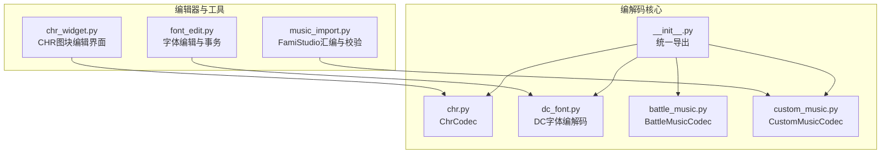
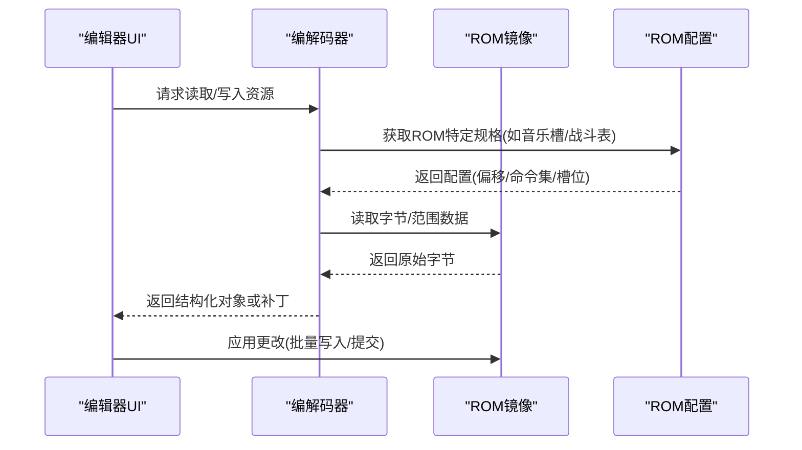
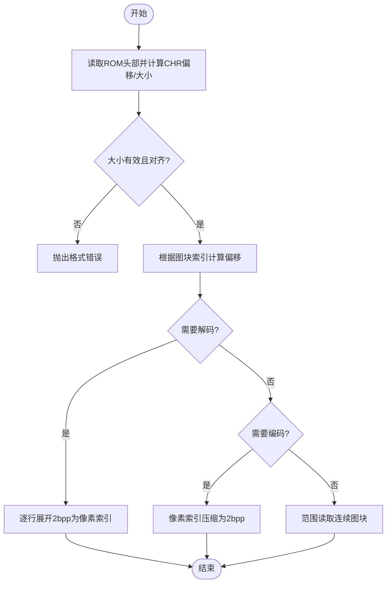
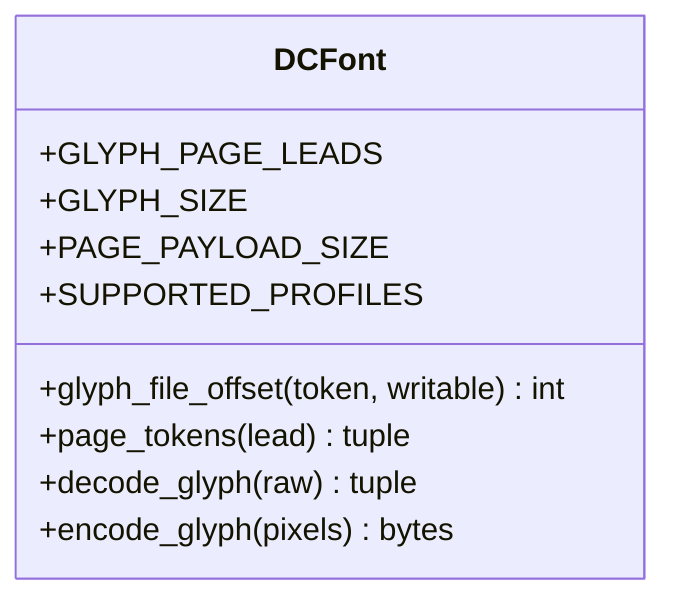
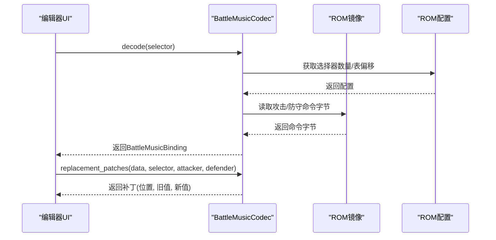
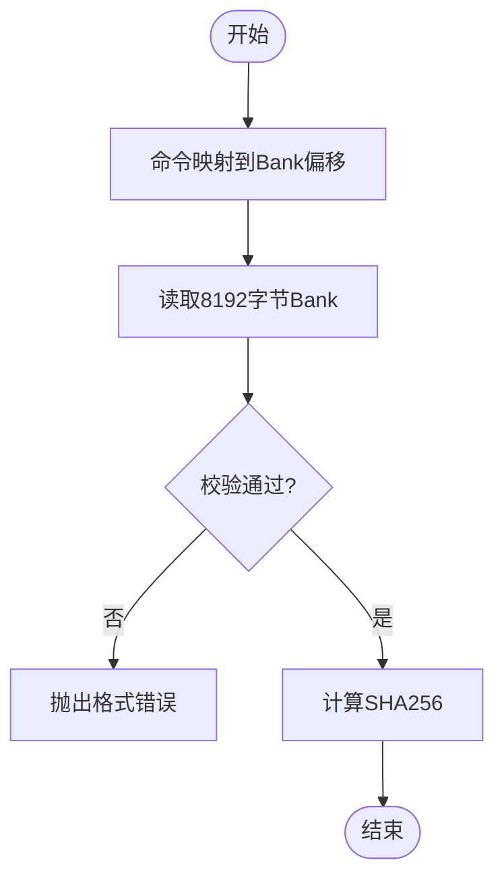
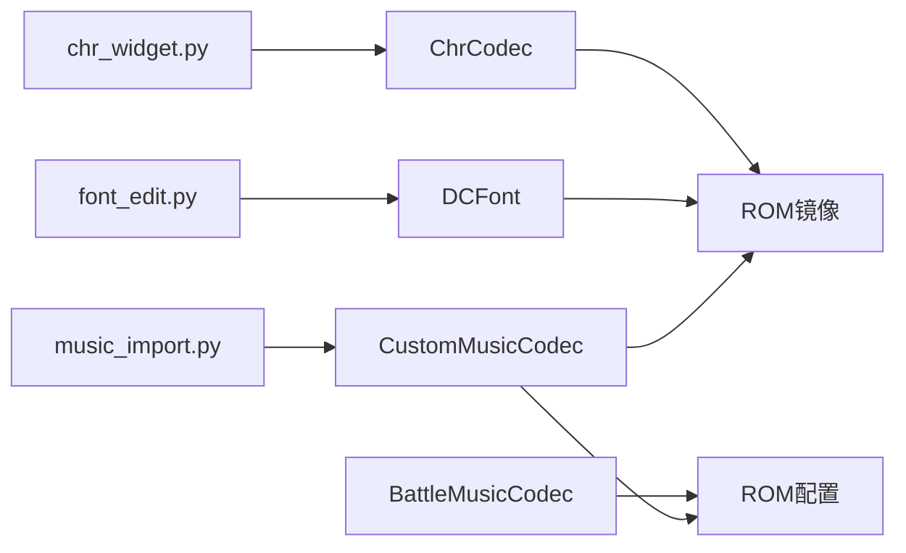

# 媒体编解码器

<cite>
**本文引用的文件**
- [src/fc_editor/codecs/chr.py](file://src/fc_editor/codecs/chr.py)
- [src/fc_editor/codecs/dc_font.py](file://src/fc_editor/codecs/dc_font.py)
- [src/fc_editor/codecs/battle_music.py](file://src/fc_editor/codecs/battle_music.py)
- [src/fc_editor/codecs/custom_music.py](file://src/fc_editor/codecs/custom_music.py)
- [src/fc_editor/codecs/__init__.py](file://src/fc_editor/codecs/__init__.py)
- [src/dc_modifier/chr_widget.py](file://src/dc_modifier/chr_widget.py)
- [src/dc_modifier/font_edit.py](file://src/dc_modifier/font_edit.py)
- [src/dc_modifier/music_import.py](file://src/dc_modifier/music_import.py)
</cite>

## 目录
1. [简介](#简介)
2. [项目结构](#项目结构)
3. [核心组件](#核心组件)
4. [架构总览](#架构总览)
5. [详细组件分析](#详细组件分析)
6. [依赖关系分析](#依赖关系分析)
7. [性能考虑](#性能考虑)
8. [故障排除指南](#故障排除指南)
9. [结论](#结论)
10. [附录：导入导出与转换流程示例](#附录导入导出与转换流程示例)

## 简介
本技术文档聚焦于FC游戏修改器中的媒体编解码实现，覆盖以下关键资源类型与处理流程：
- CHR图块（ChrCodec）：无损编解码NES 2bpp 8×8图块流，像素索引0–3的位平面编码。
- DC字体（DCFont）：固定大小12×12字模记录、页面布局与点阵编解码。
- 战斗音乐（BattleMusic）：攻击方/防守方主题表的选择器与命令替换。
- 自定义音乐（CustomMusic）：FamiStudio音乐数据Bank的校验、读取与哈希。
同时说明像素数据处理、调色板管理、字体编码方案、音频格式转换、资源验证规则、兼容性处理与性能优化策略，并提供导入导出示例与故障排除建议。

## 项目结构
本项目将媒体编解码能力集中在 fc_editor.codecs 包中，并通过 dc_modifier 下的UI与工具模块进行交互与扩展：
- 编解码核心：chr.py、dc_font.py、battle_music.py、custom_music.py
- 统一导出入口：__init__.py
- 图形编辑与批量操作：chr_widget.py
- 字体编辑与事务提交：font_edit.py
- FamiStudio源到Bank的组装与校验：music_import.py

**图表来源**
- [src/fc_editor/codecs/chr.py:11-94](file://src/fc_editor/codecs/chr.py#L11-L94)
- [src/fc_editor/codecs/dc_font.py:10-51](file://src/fc_editor/codecs/dc_font.py#L10-L51)
- [src/fc_editor/codecs/battle_music.py:10-100](file://src/fc_editor/codecs/battle_music.py#L10-L100)
- [src/fc_editor/codecs/custom_music.py:10-66](file://src/fc_editor/codecs/custom_music.py#L10-L66)
- [src/fc_editor/codecs/__init__.py:1-47](file://src/fc_editor/codecs/__init__.py#L1-L47)
- [src/dc_modifier/chr_widget.py:162-630](file://src/dc_modifier/chr_widget.py#L162-L630)
- [src/dc_modifier/font_edit.py:61-273](file://src/dc_modifier/font_edit.py#L61-L273)
- [src/dc_modifier/music_import.py:31-92](file://src/dc_modifier/music_import.py#L31-L92)

**章节来源**
- [src/fc_editor/codecs/__init__.py:1-47](file://src/fc_editor/codecs/__init__.py#L1-L47)

## 核心组件
- ChrCodec：负责定位ROM中的CHR-ROM区域，提供单图块与范围读写、2bpp像素解码/编码、图块计数与偏移计算。
- DC字体：定义字库页头、字模尺寸与页面负载大小；提供字模偏移计算、页面令牌生成、12×12点阵编解码。
- BattleMusicCodec：基于ROM配置的战斗音乐选择器与命令表，支持读取与生成补丁以替换攻击/防守主题。
- CustomMusicCodec：读取并校验FamiStudio音乐Bank（8KiB），验证曲目数、指针范围，提供SHA256哈希。

**章节来源**
- [src/fc_editor/codecs/chr.py:11-94](file://src/fc_editor/codecs/chr.py#L11-L94)
- [src/fc_editor/codecs/dc_font.py:10-51](file://src/fc_editor/codecs/dc_font.py#L10-L51)
- [src/fc_editor/codecs/battle_music.py:10-100](file://src/fc_editor/codecs/battle_music.py#L10-L100)
- [src/fc_editor/codecs/custom_music.py:10-66](file://src/fc_editor/codecs/custom_music.py#L10-L66)

## 架构总览
媒体编解码层通过RomImage与Profile抽象获取ROM数据与配置，UI与工具层调用编解码器完成可视化编辑与批量导入导出。整体流程如下：

**图表来源**
- [src/fc_editor/codecs/battle_music.py:20-100](file://src/fc_editor/codecs/battle_music.py#L20-L100)
- [src/fc_editor/codecs/custom_music.py:10-66](file://src/fc_editor/codecs/custom_music.py#L10-L66)
- [src/fc_editor/codecs/chr.py:11-94](file://src/fc_editor/codecs/chr.py#L11-L94)

## 详细组件分析

### CHR图块编解码（ChrCodec）
- 功能要点
  - 定位CHR-ROM区域：依据iNES头部信息计算偏移与大小，校验完整性与对齐。
  - 图块访问：按图块索引计算偏移，读取16字节原始数据。
  - 像素解码：将2bpp行对（低/高位）展开为8×8像素索引序列（0–3）。
  - 像素编码：将像素索引压缩回16字节2bpp数据。
  - 范围读写：支持连续图块的批量读取，便于导入导出。
- 数据结构与复杂度
  - 图块大小固定16字节，解码/编码时间复杂度O(64)。
  - 范围读取时间复杂度O(N*16)，N为图块数量。
- 错误处理
  - 非法索引、不完整数据、非16字节倍数等抛出明确异常。
- 与UI集成
  - chr_widget.py提供8×8画布、16×16缩略图浏览、PNG导入导出、批量CHR导入导出，并在内存中维护草稿以避免误写。

**图表来源**
- [src/fc_editor/codecs/chr.py:11-94](file://src/fc_editor/codecs/chr.py#L11-L94)
- [src/dc_modifier/chr_widget.py:162-630](file://src/dc_modifier/chr_widget.py#L162-L630)

**章节来源**
- [src/fc_editor/codecs/chr.py:11-94](file://src/fc_editor/codecs/chr.py#L11-L94)
- [src/dc_modifier/chr_widget.py:162-630](file://src/dc_modifier/chr_widget.py#L162-L630)

### DC字体编解码（DCFont）
- 功能要点
  - 字库页头：限定支持的页头前缀集合，确保合法页范围。
  - 字模布局：每页16行×256列，其中每行包含14个18字节字模+4保留字节；E/F列别名0列。
  - 偏移计算：根据页头与行列位置计算文件偏移，支持可写模式校验。
  - 点阵编解码：12×12字模存储为三列垂直条（每列6字节），偶/奇行半字节交错；零为墨色。
- 数据结构与复杂度
  - 字模固定18字节，编解码时间复杂度O(144)。
  - 页面负载大小为16×14×18=4032字节。
- 错误处理
  - 非法令牌、不可写字列、非12×12点阵、颜色值越界等抛出明确异常。
- 与UI集成
  - font_edit.py提供12×12画布、页面级导入导出（.dcfont）、事务暂存与原子提交，避免并发冲突。

**图表来源**
- [src/fc_editor/codecs/dc_font.py:10-51](file://src/fc_editor/codecs/dc_font.py#L10-L51)

**章节来源**
- [src/fc_editor/codecs/dc_font.py:10-51](file://src/fc_editor/codecs/dc_font.py#L10-L51)
- [src/dc_modifier/font_edit.py:61-273](file://src/dc_modifier/font_edit.py#L61-L273)

### 战斗音乐编解码（BattleMusicCodec）
- 功能要点
  - 基于ROM配置的战斗音乐表：选择器数量、攻击/防守命令表偏移。
  - 读取绑定：解析选择器对应的攻击/防守命令及偏移。
  - 生成补丁：返回新旧命令的替换补丁元组，用于安全写入。
  - 命令格式化：将命令码映射为可读显示文本。
- 数据结构与复杂度
  - 选择器与命令映射为常数时间查找。
  - 补丁生成时间复杂度O(1)。
- 错误处理
  - 未验证ROM配置、越界选择器、不支持的命令等抛出异常。

**图表来源**
- [src/fc_editor/codecs/battle_music.py:10-100](file://src/fc_editor/codecs/battle_music.py#L10-L100)

**章节来源**
- [src/fc_editor/codecs/battle_music.py:10-100](file://src/fc_editor/codecs/battle_music.py#L10-L100)

### 自定义音乐编解码（CustomMusicCodec）
- 功能要点
  - 音乐槽映射：命令到Bank偏移的映射，重复命令检测。
  - Bank读取：从ROM指定偏移读取8192字节。
  - 校验逻辑：检查曲目数范围、数据头长度、指针范围（$8000–$9FFF）。
  - 哈希：提供SHA256用于缓存与一致性检查。
- 数据结构与复杂度
  - 校验遍历指针列表，时间复杂度O(S)，S为曲目数。
- 错误处理
  - 无效槽、重复命令、Bank大小不符、指针越界等抛出异常。

**图表来源**
- [src/fc_editor/codecs/custom_music.py:10-66](file://src/fc_editor/codecs/custom_music.py#L10-L66)

**章节来源**
- [src/fc_editor/codecs/custom_music.py:10-66](file://src/fc_editor/codecs/custom_music.py#L10-L66)

### 编辑器与工具集成
- CHR图块编辑（chr_widget.py）
  - 提供8×8像素画布与16×16缩略图浏览器。
  - PNG导入：将图像缩放至8×8，提取颜色并按明度映射到四级索引；若颜色≤4则建立颜色到索引的映射。
  - 批量CHR导入导出：按当前图块起点写入/读取连续图块，支持草稿合并与撤销。
- 字体编辑（font_edit.py）
  - 12×12点阵画布，左键绘制、右键擦除。
  - 页面级导入导出（.dcfont），事务暂存与原子提交，防止并发覆盖。
  - 使用系统字体生成预览点阵，限制无抗锯齿与固定像素尺寸。
- FamiStudio音乐导入（music_import.py）
  - 调用内置ASM6将自包含ASM源汇编为8KiB Bank。
  - 安全限制：禁止include/incbin/base/org指令，限制源文件大小与超时。
  - 最终校验：使用CustomMusicCodec.validate_bank确保输出符合规范。

**章节来源**
- [src/dc_modifier/chr_widget.py:162-630](file://src/dc_modifier/chr_widget.py#L162-L630)
- [src/dc_modifier/font_edit.py:61-273](file://src/dc_modifier/font_edit.py#L61-L273)
- [src/dc_modifier/music_import.py:31-92](file://src/dc_modifier/music_import.py#L31-L92)

## 依赖关系分析
- 编解码器之间相对独立，主要通过RomImage与Profile进行ROM访问与配置获取。
- UI与工具层依赖编解码器提供的API完成具体业务：
  - chr_widget.py依赖ChrCodec进行像素编解码与范围读写。
  - font_edit.py依赖DCFont进行字模偏移计算与点阵编解码。
  - music_import.py依赖CustomMusicCodec进行Bank校验。
- 统一导出入口__init__.py集中暴露公共接口，便于上层模块按需引用。

**图表来源**
- [src/fc_editor/codecs/__init__.py:1-47](file://src/fc_editor/codecs/__init__.py#L1-L47)
- [src/dc_modifier/chr_widget.py:162-630](file://src/dc_modifier/chr_widget.py#L162-L630)
- [src/dc_modifier/font_edit.py:61-273](file://src/dc_modifier/font_edit.py#L61-L273)
- [src/dc_modifier/music_import.py:31-92](file://src/dc_modifier/music_import.py#L31-L92)

**章节来源**
- [src/fc_editor/codecs/__init__.py:1-47](file://src/fc_editor/codecs/__init__.py#L1-L47)

## 性能考虑
- 像素处理
  - 2bpp编解码为固定规模循环，适合CPU直算；批量范围读取减少I/O次数。
  - PNG导入时先判断颜色数量≤4则建立映射，否则按明度快速量化，降低计算开销。
- 字体编辑
  - 页面负载固定4032字节，导入导出直接按页读写，避免逐字模I/O。
  - 事务暂存与原子提交减少中间状态写入，提升一致性与性能。
- 音乐Bank
  - 校验过程线性扫描指针列表，复杂度与曲目数成正比；哈希用于缓存与去重。
  - ASM6汇编设置超时与源大小上限，防止长时间阻塞与恶意输入。
- 内存映射机制
  - 通过RomImage的data属性直接访问字节序列，避免额外拷贝；范围读取使用切片高效获取。
- 加载优化策略
  - 懒加载：仅在需要时计算偏移与读取数据。
  - 草稿机制：在UI层维护可见草稿，提交前不污染工作区，减少回滚成本。

[本节为通用性能讨论，无需具体文件分析]

## 故障排除指南
- CHR图块
  - 现象：导入PNG后颜色异常或无法应用。
  - 排查：确认图像已缩放至8×8；颜色数量超过4时会按明度映射；检查像素索引是否在0–3。
  - 参考路径：[src/dc_modifier/chr_widget.py:459-509](file://src/dc_modifier/chr_widget.py#L459-L509)、[src/fc_editor/codecs/chr.py:60-78](file://src/fc_editor/codecs/chr.py#L60-L78)
- DC字体
  - 现象：E/F列无法编辑或导入失败。
  - 排查：E/F列为0列别名，需在0列编辑；页文件必须为4032字节且不包含保留字节。
  - 参考路径：[src/fc_editor/codecs/dc_font.py:16-31](file://src/fc_editor/codecs/dc_font.py#L16-L31)、[src/dc_modifier/font_edit.py:212-227](file://src/dc_modifier/font_edit.py#L212-L227)
- 战斗音乐
  - 现象：命令替换无效或报错。
  - 排查：确认选择器范围与命令是否被配置收录；检查补丁位置与旧值匹配。
  - 参考路径：[src/fc_editor/codecs/battle_music.py:35-92](file://src/fc_editor/codecs/battle_music.py#L35-L92)
- 自定义音乐
  - 现象：Bank校验失败或指针越界。
  - 排查：检查曲目数范围、数据头长度、指针必须在$8000–$9FFF；确认命令对应槽位存在且唯一。
  - 参考路径：[src/fc_editor/codecs/custom_music.py:37-62](file://src/fc_editor/codecs/custom_music.py#L37-L62)
- FamiStudio汇编
  - 现象：汇编失败或超时。
  - 排查：确认源文件包含music_data_*标签；禁止危险指令；检查ASM6路径与超时设置。
  - 参考路径：[src/dc_modifier/music_import.py:38-91](file://src/dc_modifier/music_import.py#L38-L91)

**章节来源**
- [src/dc_modifier/chr_widget.py:459-509](file://src/dc_modifier/chr_widget.py#L459-L509)
- [src/fc_editor/codecs/chr.py:60-78](file://src/fc_editor/codecs/chr.py#L60-L78)
- [src/fc_editor/codecs/dc_font.py:16-31](file://src/fc_editor/codecs/dc_font.py#L16-L31)
- [src/dc_modifier/font_edit.py:212-227](file://src/dc_modifier/font_edit.py#L212-L227)
- [src/fc_editor/codecs/battle_music.py:35-92](file://src/fc_editor/codecs/battle_music.py#L35-L92)
- [src/fc_editor/codecs/custom_music.py:37-62](file://src/fc_editor/codecs/custom_music.py#L37-L62)
- [src/dc_modifier/music_import.py:38-91](file://src/dc_modifier/music_import.py#L38-L91)

## 结论
本项目实现了针对FC游戏的媒体资源编解码体系，涵盖CHR图块、DC字体、战斗音乐与自定义音乐四大核心类型。通过严格的格式校验、安全的补丁生成与UI层的草稿机制，确保了编辑过程的可逆性与一致性。结合FamiStudio汇编工具链，提供了完整的音乐导入导出流程。建议在大规模编辑时优先使用批量操作与页面级导入导出，以提升效率与稳定性。

[本节为总结性内容，无需具体文件分析]

## 附录：导入导出与转换流程示例

### CHR图块导入导出
- 导入PNG到单个图块
  - 步骤：选择“导入PNG”，图像自动缩放至8×8，颜色映射到0–3索引；预览十六进制字节；点击“应用图块”写入。
  - 参考路径：[src/dc_modifier/chr_widget.py:511-547](file://src/dc_modifier/chr_widget.py#L511-L547)
- 批量导入/导出CHR
  - 步骤：设置起始图块与数量；导入时校验长度与范围；导出时合并草稿并写入.chr文件。
  - 参考路径：[src/dc_modifier/chr_widget.py:549-629](file://src/dc_modifier/chr_widget.py#L549-L629)
- 底层编解码
  - 参考路径：[src/fc_editor/codecs/chr.py:42-78](file://src/fc_editor/codecs/chr.py#L42-L78)

### DC字体导入导出
- 导入/导出页面点阵（.dcfont）
  - 步骤：选择目标页；导入时校验4032字节；导出时按页顺序拼接字模。
  - 参考路径：[src/dc_modifier/font_edit.py:212-249](file://src/dc_modifier/font_edit.py#L212-L249)
- 单字模编辑与暂存
  - 步骤：在画布上绘制；点击“写入”暂存；确定提交时原子写入。
  - 参考路径：[src/dc_modifier/font_edit.py:163-186](file://src/dc_modifier/font_edit.py#L163-L186)
- 底层编解码
  - 参考路径：[src/fc_editor/codecs/dc_font.py:33-51](file://src/fc_editor/codecs/dc_font.py#L33-L51)

### 战斗音乐替换
- 步骤：选择器→读取攻击/防守命令→生成补丁→应用写入。
- 参考路径：[src/fc_editor/codecs/battle_music.py:52-92](file://src/fc_editor/codecs/battle_music.py#L52-L92)

### 自定义音乐导入
- 步骤：选择FamiStudio ASM源→封装并调用ASM6→生成8KiB Bank→校验→写入ROM。
- 参考路径：[src/dc_modifier/music_import.py:38-91](file://src/dc_modifier/music_import.py#L38-L91)
- 校验逻辑
  - 参考路径：[src/fc_editor/codecs/custom_music.py:37-62](file://src/fc_editor/codecs/custom_music.py#L37-L62)

**章节来源**
- [src/dc_modifier/chr_widget.py:511-629](file://src/dc_modifier/chr_widget.py#L511-L629)
- [src/fc_editor/codecs/chr.py:42-78](file://src/fc_editor/codecs/chr.py#L42-L78)
- [src/dc_modifier/font_edit.py:163-249](file://src/dc_modifier/font_edit.py#L163-L249)
- [src/fc_editor/codecs/dc_font.py:33-51](file://src/fc_editor/codecs/dc_font.py#L33-L51)
- [src/fc_editor/codecs/battle_music.py:52-92](file://src/fc_editor/codecs/battle_music.py#L52-L92)
- [src/dc_modifier/music_import.py:38-91](file://src/dc_modifier/music_import.py#L38-L91)
- [src/fc_editor/codecs/custom_music.py:37-62](file://src/fc_editor/codecs/custom_music.py#L37-L62)