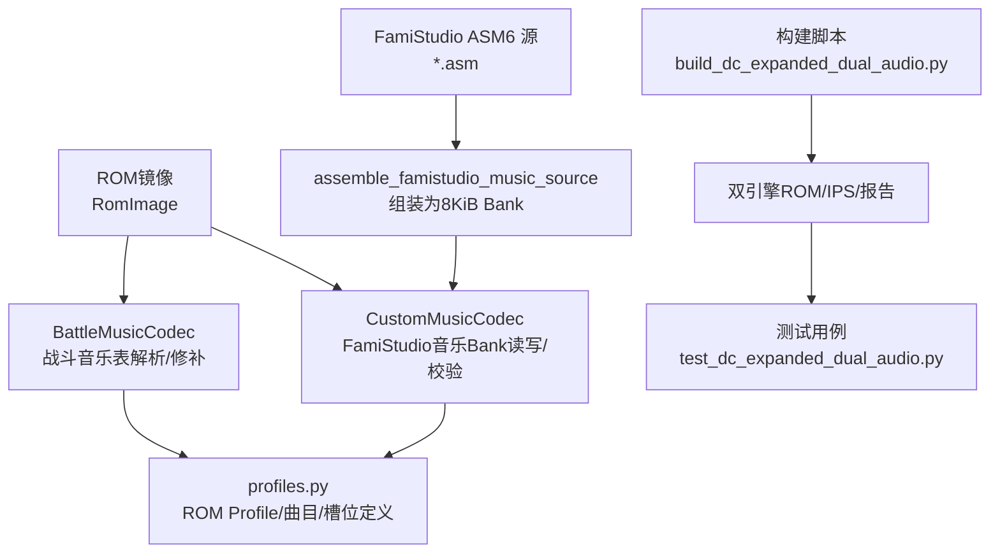
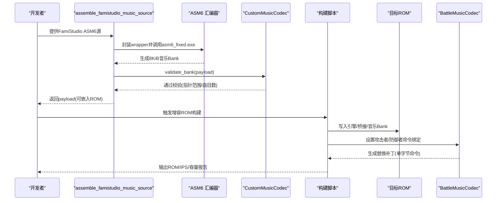
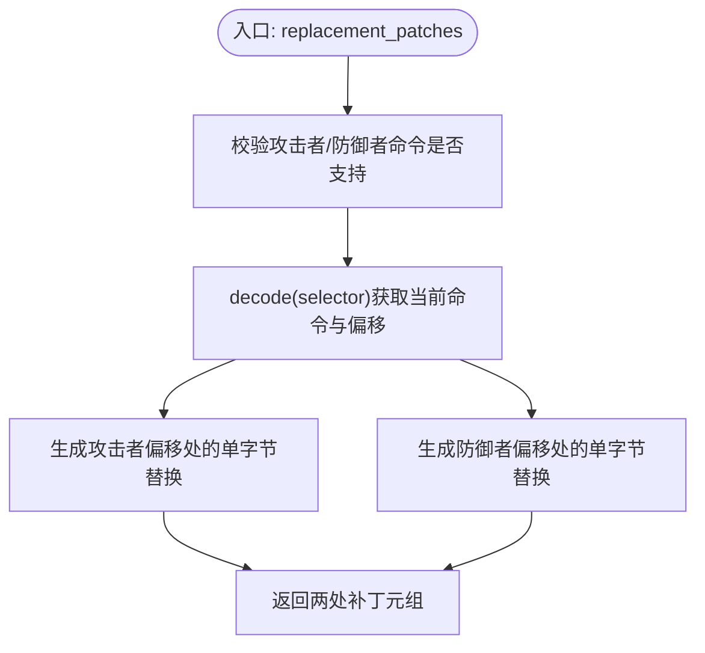
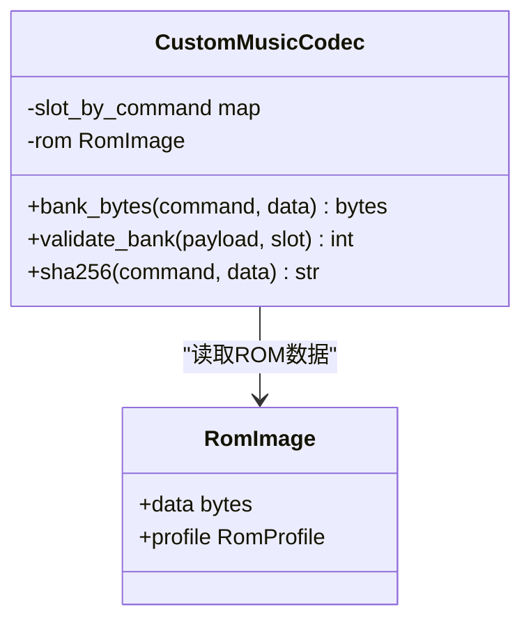
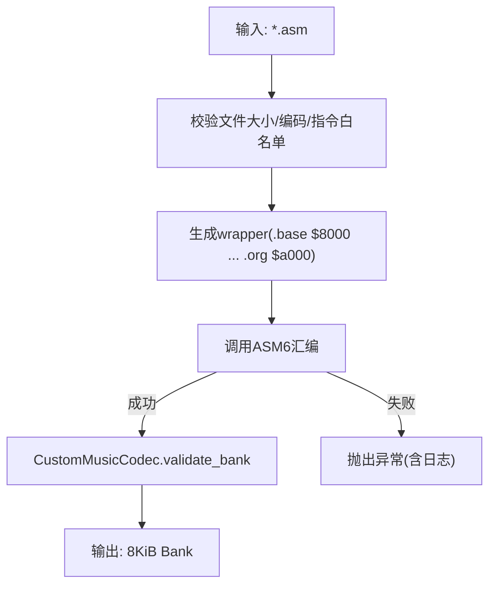
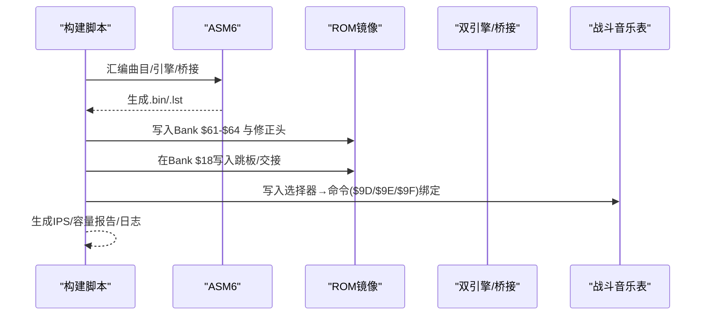
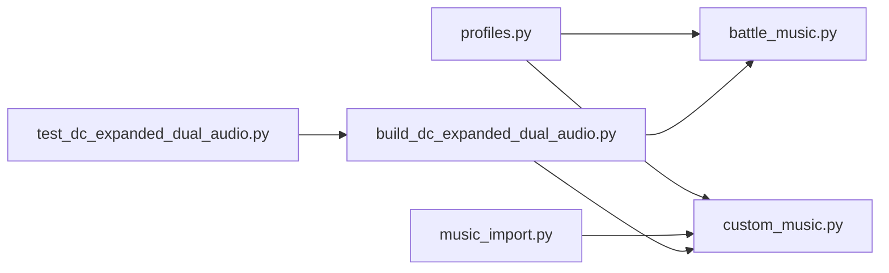

# 战斗音乐编解码器

<cite>
**本文引用的文件**
- [battle_music.py](file://src/fc_editor/codecs/battle_music.py)
- [custom_music.py](file://src/fc_editor/codecs/custom_music.py)
- [music_import.py](file://src/dc_modifier/music_import.py)
- [profiles.py](file://src/fc_editor/profiles.py)
- [build_dc_expanded_dual_audio.py](file://tools/build_dc_expanded_dual_audio.py)
- [test_dc_expanded_dual_audio.py](file://tests/test_dc_expanded_dual_audio.py)
</cite>

## 目录
1. [简介](#简介)
2. [项目结构](#项目结构)
3. [核心组件](#核心组件)
4. [架构总览](#架构总览)
5. [详细组件分析](#详细组件分析)
6. [依赖关系分析](#依赖关系分析)
7. [性能与内存管理](#性能与内存管理)
8. [故障排查指南](#故障排查指南)
9. [结论](#结论)
10. [附录：导入导出与编辑流程](#附录导入导出与编辑流程)

## 简介
本技术文档围绕“战斗音乐编解码器”展开，聚焦 FC（NES）游戏在双音频引擎（原生驱动 + FamiStudio）下的音乐数据解析、音轨绑定、乐器音色定义、音量控制机制，以及 FamiStudio 集成接口、音频格式转换、MIDI 事件映射等关键主题。文档基于仓库中的实际代码与构建脚本，给出可追溯的实现细节、流程图与时序图，并提供音乐导入/导出示例、曲目编辑流程、音效配置方法，以及质量优化、内存管理与兼容性处理建议。

## 项目结构
本项目将“战斗音乐编解码器”能力拆分为三层：
- 编解码层：BattleMusicCodec 负责解析/修补战斗音乐选择表；CustomMusicCodec 负责 FamiStudio 固定大小音乐 Bank 的读取与校验。
- 工具层：music_import.py 提供从 FamiStudio ASM6 源到 8 KiB 音乐 Bank 的组装与校验流程。
- 构建与验证层：build_dc_expanded_dual_audio.py 负责生成增容 ROM、注入双引擎与桥接代码，并输出容量报告；测试用例确保产物一致性。

**图表来源**
- [battle_music.py:20-99](file://src/fc_editor/codecs/battle_music.py#L20-L99)
- [custom_music.py:10-66](file://src/fc_editor/codecs/custom_music.py#L10-L66)
- [music_import.py:31-92](file://src/dc_modifier/music_import.py#L31-L92)
- [profiles.py:86-125](file://src/fc_editor/profiles.py#L86-L125)
- [build_dc_expanded_dual_audio.py:132-165](file://tools/build_dc_expanded_dual_audio.py#L132-L165)

**章节来源**
- [battle_music.py:20-99](file://src/fc_editor/codecs/battle_music.py#L20-L99)
- [custom_music.py:10-66](file://src/fc_editor/codecs/custom_music.py#L10-L66)
- [music_import.py:31-92](file://src/dc_modifier/music_import.py#L31-L92)
- [profiles.py:86-125](file://src/fc_editor/profiles.py#L86-L125)
- [build_dc_expanded_dual_audio.py:132-165](file://tools/build_dc_expanded_dual_audio.py#L132-L165)

## 核心组件
- BattleMusicCodec：根据 ROM Profile 提供的攻击者/防御者战斗音乐表偏移与命令集，解析每个选择器的当前命令，并生成安全替换补丁。
- CustomMusicCodec：针对命令 $9D-$9F 对应的固定 8 KiB FamiStudio 音乐 Bank，提供读取、校验（含指针范围检查）、哈希计算。
- music_import.assemble_famistudio_music_source：将 FamiStudio 导出的 ASM6 源包装为以 $8000 起始、$A000 结束的 8 KiB 数据块，调用内置 asm6_fixed.exe 汇编并校验产出。
- profiles.RomProfile/BattleMusicSpec/CustomMusicSlotSpec：集中声明 ROM 布局、战斗音乐表位置、可用命令与标签、扩展音乐槽位等元数据。
- build_dc_expanded_dual_audio：构建增容 Mapper 194 ROM，注入双引擎、桥接与三首 FamiStudio 曲目，生成 IPS 与容量报告，并通过测试断言保证一致性。

**章节来源**
- [battle_music.py:20-99](file://src/fc_editor/codecs/battle_music.py#L20-L99)
- [custom_music.py:10-66](file://src/fc_editor/codecs/custom_music.py#L10-L66)
- [music_import.py:31-92](file://src/dc_modifier/music_import.py#L31-L92)
- [profiles.py:86-125](file://src/fc_editor/profiles.py#L86-L125)
- [build_dc_expanded_dual_audio.py:410-467](file://tools/build_dc_expanded_dual_audio.py#L410-L467)

## 架构总览
下图展示从“FamiStudio 源”到“ROM 中可播放音乐”的完整链路，包括 ASM6 汇编、Bank 校验、写入 ROM、战斗音乐表绑定与双引擎切换。

**图表来源**
- [music_import.py:38-92](file://src/dc_modifier/music_import.py#L38-L92)
- [custom_music.py:24-66](file://src/fc_editor/codecs/custom_music.py#L24-L66)
- [build_dc_expanded_dual_audio.py:410-467](file://tools/build_dc_expanded_dual_audio.py#L410-L467)
- [battle_music.py:45-92](file://src/fc_editor/codecs/battle_music.py#L45-L92)

## 详细组件分析

### BattleMusicCodec：战斗音乐表解析与补丁
- 功能要点
  - 依据 ROM Profile 的攻击者/防御者表偏移，按选择器索引定位两个单字节命令。
  - decode(selector) 返回包含标签、命令与偏移的结构化结果。
  - replacement_patches(...) 生成两处单字节替换补丁，用于将原命令替换为新命令。
  - format_command(command) 将命令映射为可读显示名（来自 Profile）。
- 复杂度与健壮性
  - 时间复杂度 O(1)，空间复杂度 O(1)。
  - 对越界选择器、不支持命令、超出 ROM 范围的表进行严格校验。

**图表来源**
- [battle_music.py:45-92](file://src/fc_editor/codecs/battle_music.py#L45-L92)

**章节来源**
- [battle_music.py:20-99](file://src/fc_editor/codecs/battle_music.py#L20-L99)
- [profiles.py:86-125](file://src/fc_editor/profiles.py#L86-L125)

### CustomMusicCodec：FamiStudio 音乐 Bank 读写与校验
- 功能要点
  - bank_bytes(command) 从 ROM 指定 PRG Bank 读取 8 KiB 数据。
  - validate_bank(payload) 校验：长度=8192；首字节曲目数 1..32；头指针偏移集合合法；所有指针位于 $8000-$9FFF。
  - sha256(command) 计算 Bank 哈希，便于缓存/比对。
- 设计约束
  - 仅支持命令 $9D-$9F 对应的三个槽位，且命令不可重复。
  - 指针范围限制确保 FamiStudio 运行时不会访问非法地址。

**图表来源**
- [custom_music.py:10-66](file://src/fc_editor/codecs/custom_music.py#L10-L66)

**章节来源**
- [custom_music.py:10-66](file://src/fc_editor/codecs/custom_music.py#L10-L66)
- [profiles.py:120-125](file://src/fc_editor/profiles.py#L120-L125)

### 音乐导入流水线：ASM6 到 8 KiB Bank
- 步骤
  - 读取 ASM6 源，校验大小上限与安全指令白名单。
  - 自动添加 .base $8000 与结束标记 .org $a000，形成固定 8 KiB 数据段。
  - 调用内置 asm6_fixed.exe 汇编，捕获错误日志与超时。
  - 再次调用 CustomMusicCodec.validate_bank 校验产出。
- 关键点
  - 禁止 include/incbin/base/org 等外部依赖指令，确保可复现与路径安全。
  - 要求存在 music_data_* 标签，表明是 FamiStudio 的数据导出。

**图表来源**
- [music_import.py:38-92](file://src/dc_modifier/music_import.py#L38-L92)
- [custom_music.py:37-62](file://src/fc_editor/codecs/custom_music.py#L37-L62)

**章节来源**
- [music_import.py:38-92](file://src/dc_modifier/music_import.py#L38-L92)
- [custom_music.py:37-62](file://src/fc_editor/codecs/custom_music.py#L37-L62)

### 构建与双引擎集成：增容 ROM、桥接与绑定
- 构建过程
  - 编译三首 FamiStudio 曲目与双引擎/桥接/跳板代码为二进制。
  - 在原 ROM 基础上扩展 PRG 至 1 MiB，保留 CHR 位置不变。
  - 在 Bank $18 的已验证空白处写入跳板与交接代码，释放 Bank $60。
  - 将三首曲目分别写入 Bank $61/$62/$63，引擎写入 Bank $64。
  - 更新 iNES 头 PRG 大小与 Mapper 字段，生成 IPS 与容量报告。
- 绑定策略
  - 通过 BattleMusicCodec 或构建脚本直接写入攻击者/防御者表，将选择器映射到命令 $9D/$9E/$9F。
- RAM 复用与保护
  - FamiStudio 仅复用原生音频驱动的认证 RAM 区域（约 165 字节），并在每次更新前后保存/恢复输出缓冲。
  - 桥接代码确保两套引擎不并发更新 APU，切回时在同一 NMI 内复位并重放命令。

**图表来源**
- [build_dc_expanded_dual_audio.py:132-165](file://tools/build_dc_expanded_dual_audio.py#L132-L165)
- [build_dc_expanded_dual_audio.py:410-467](file://tools/build_dc_expanded_dual_audio.py#L410-L467)
- [build_dc_expanded_dual_audio.py:489-678](file://tools/build_dc_expanded_dual_audio.py#L489-L678)

**章节来源**
- [build_dc_expanded_dual_audio.py:132-165](file://tools/build_dc_expanded_dual_audio.py#L132-L165)
- [build_dc_expanded_dual_audio.py:410-467](file://tools/build_dc_expanded_dual_audio.py#L410-L467)
- [build_dc_expanded_dual_audio.py:489-678](file://tools/build_dc_expanded_dual_audio.py#L489-L678)

## 依赖关系分析
- 模块耦合
  - BattleMusicCodec 依赖 profiles.BattleMusicSpec 描述表结构与命令集。
  - CustomMusicCodec 依赖 profiles.CustomMusicSlotSpec 与常量 PRG_BANK_SIZE。
  - music_import 依赖 CustomMusicCodec.validate_bank 与内置 ASM6。
  - 构建脚本依赖 ASM6、列表文件解析、IPS 生成与 SHA256 校验。
- 外部依赖
  - ASM6 汇编器（随项目 vendor 提供）。
  - 模拟器兼容性（Mapper 194 行为差异已在报告中记录）。

**图表来源**
- [profiles.py:86-125](file://src/fc_editor/profiles.py#L86-L125)
- [battle_music.py:20-99](file://src/fc_editor/codecs/battle_music.py#L20-L99)
- [custom_music.py:10-66](file://src/fc_editor/codecs/custom_music.py#L10-L66)
- [music_import.py:31-92](file://src/dc_modifier/music_import.py#L31-L92)
- [build_dc_expanded_dual_audio.py:132-165](file://tools/build_dc_expanded_dual_audio.py#L132-L165)
- [test_dc_expanded_dual_audio.py:33-196](file://tests/test_dc_expanded_dual_audio.py#L33-L196)

**章节来源**
- [profiles.py:86-125](file://src/fc_editor/profiles.py#L86-L125)
- [battle_music.py:20-99](file://src/fc_editor/codecs/battle_music.py#L20-L99)
- [custom_music.py:10-66](file://src/fc_editor/codecs/custom_music.py#L10-L66)
- [music_import.py:31-92](file://src/dc_modifier/music_import.py#L31-L92)
- [build_dc_expanded_dual_audio.py:132-165](file://tools/build_dc_expanded_dual_audio.py#L132-L165)
- [test_dc_expanded_dual_audio.py:33-196](file://tests/test_dc_expanded_dual_audio.py#L33-L196)

## 性能与内存管理
- 内存占用
  - 每首 FamiStudio 曲目占用一个 8 KiB PRG Bank，最多 32 首曲目由头部计数限制。
  - 双引擎共享原生音频驱动认证的约 165 字节 RAM，避免额外开销。
- 运行时性能
  - 桥接代码仅在 NMI 中切换引擎，同一帧内完成复位与命令重放，避免并发 APU 更新。
  - 输出缓冲在 $004C-$0056 范围内入栈保存/出栈恢复，减少跨引擎状态污染。
- 质量与体积平衡
  - 曲目数与指针布局受限于 Bank 头部结构；合理分配曲目数量与长度，避免指针越界。
  - 使用构建脚本输出的容量报告评估各 Bank 已用/空闲字节，指导曲目裁剪与优化。

[本节为通用性能讨论，不直接分析具体文件]

## 故障排查指南
- 常见错误与定位
  - “未找到 ASM6”：确认 tools/vendor/famistudio-4.5.3/Tools/asm6_fixed.exe 存在。
  - “ASM 源超过上限/编码错误”：检查源文件大小与 UTF-8/UTF-8 BOM 编码。
  - “缺少 music_data_* 标签/禁止指令”：确保导出的是纯数据源，不含 include/incbin/base/org。
  - “Bank 校验失败/指针越界”：检查 FamiStudio 导出配置，确保指针落在 $8000-$9FFF。
  - “命令不支持/选择器越界”：核对 profiles 中 battle_music 与 custom_music_slots 的定义。
- 构建与验证
  - 若构建失败，查看生成的 .lst 与构建日志，定位汇编错误或地址冲突。
  - 使用测试用例断言校验 ROM 哈希、IPS 往返、Bank 内容与 RAM 布局一致性。

**章节来源**
- [music_import.py:38-92](file://src/dc_modifier/music_import.py#L38-L92)
- [custom_music.py:37-62](file://src/fc_editor/codecs/custom_music.py#L37-L62)
- [battle_music.py:35-44](file://src/fc_editor/codecs/battle_music.py#L35-L44)
- [build_dc_expanded_dual_audio.py:132-165](file://tools/build_dc_expanded_dual_audio.py#L132-L165)
- [test_dc_expanded_dual_audio.py:33-196](file://tests/test_dc_expanded_dual_audio.py#L33-L196)

## 结论
本项目实现了面向 FC 的双音频引擎战斗音乐系统：通过 BattleMusicCodec 精确解析/修补战斗音乐表，借助 CustomMusicCodec 与 music_import 完成 FamiStudio 曲目的安全导入与 Bank 校验，并由构建脚本统一装配增容 ROM、桥接与绑定。系统在内存与性能方面采用严格的 RAM 复用与 NMI 级切换策略，确保稳定与高效。配合完善的测试与报告机制，可在不同 ROM 变体下保持一致性与可维护性。

[本节为总结性内容，不直接分析具体文件]

## 附录：导入导出与编辑流程
- 音乐导入示例
  - 准备 FamiStudio 导出的 ASM6 数据源（仅包含 music_data_* 标签）。
  - 运行 assemble_famistudio_music_source(path) 得到 8 KiB payload。
  - 将 payload 写入对应 PRG Bank（如 $61/$62/$63），并通过 BattleMusicCodec 将选择器绑定到命令 $9D/$9E/$9F。
- 曲目编辑流程
  - 在 FamiStudio 中调整曲目后重新导出数据。
  - 重新汇编并校验 Bank，对比 SHA256 变化，确认无越界与兼容性问题。
  - 使用 replacement_patches 生成最小补丁，仅修改战斗音乐表中的单字节命令。
- 音效配置方法
  - 双引擎模式下，新曲播放期间的音效由第二套 FamiStudio SFX 播放。
  - 构建脚本与测试用例验证了 SFX 命令数量与 RAM 布局，确保与原驱动共存。
- 质量优化与兼容性
  - 控制曲目数量与长度，使 Bank 头部指针均在 $8000-$9FFF。
  - 保持 Mapper 194 的 PRG 扩展语义，注意部分模拟器（如 FCEUX 2.6.6）的已知不兼容。

**章节来源**
- [music_import.py:38-92](file://src/dc_modifier/music_import.py#L38-L92)
- [custom_music.py:24-66](file://src/fc_editor/codecs/custom_music.py#L24-L66)
- [battle_music.py:45-92](file://src/fc_editor/codecs/battle_music.py#L45-L92)
- [build_dc_expanded_dual_audio.py:489-678](file://tools/build_dc_expanded_dual_audio.py#L489-L678)
- [test_dc_expanded_dual_audio.py:142-188](file://tests/test_dc_expanded_dual_audio.py#L142-L188)