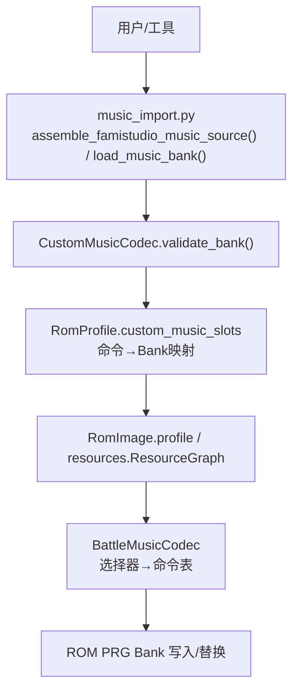
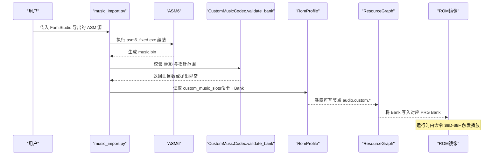
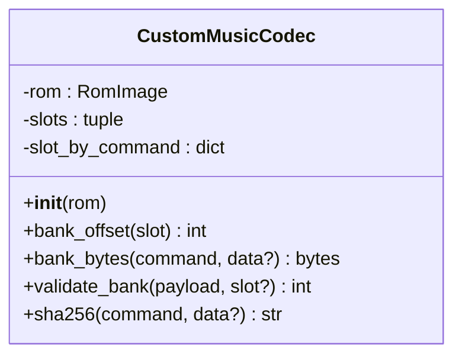
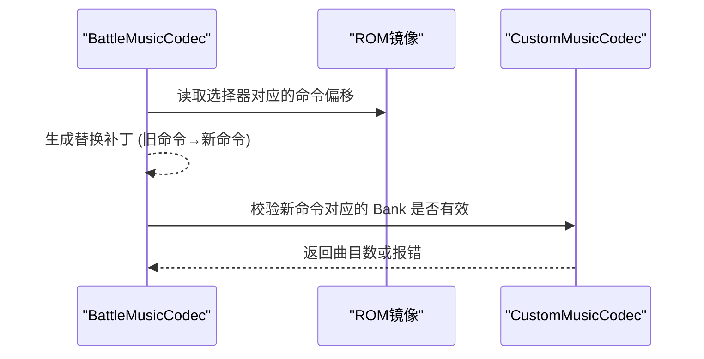
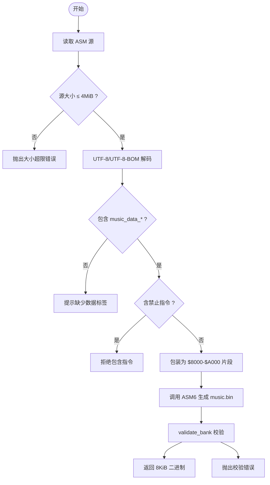
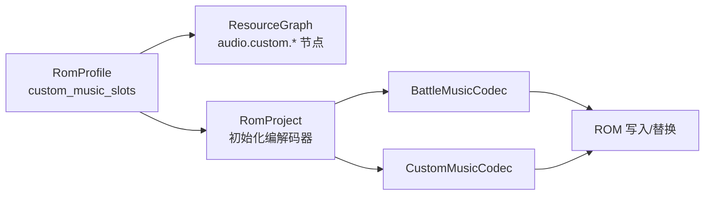
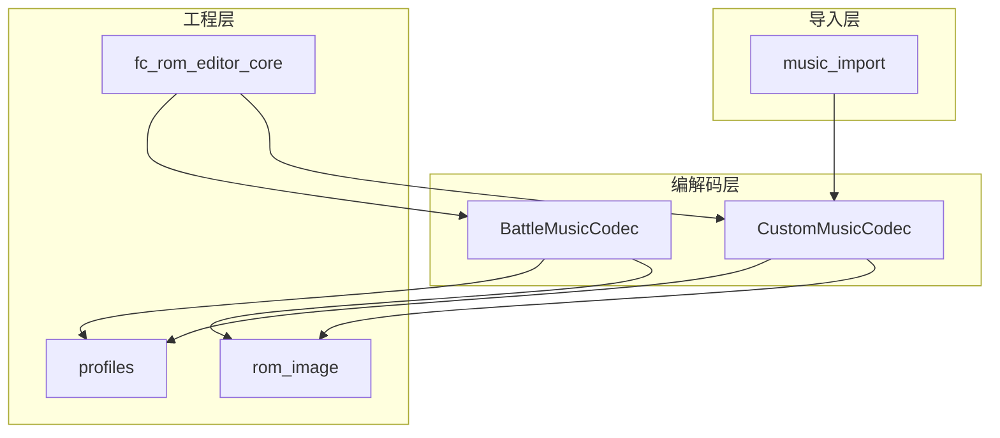

# 自定义音乐编解码器

<cite>
**本文引用的文件**
- [src/fc_editor/codecs/custom_music.py](file://src/fc_editor/codecs/custom_music.py)
- [src/dc_modifier/music_import.py](file://src/dc_modifier/music_import.py)
- [src/fc_editor/codecs/battle_music.py](file://src/fc_editor/codecs/battle_music.py)
- [src/fc_rom_editor_core.py](file://src/fc_rom_editor_core.py)
- [src/fc_editor/profiles.py](file://src/fc_editor/profiles.py)
- [src/fc_editor/resources.py](file://src/fc_editor/resources.py)
- [tests/test_dc_modifier.py](file://tests/test_dc_modifier.py)
</cite>

## 目录
1. [简介](#简介)
2. [项目结构](#项目结构)
3. [核心组件](#核心组件)
4. [架构总览](#架构总览)
5. [详细组件分析](#详细组件分析)
6. [依赖关系分析](#依赖关系分析)
7. [性能与内存优化](#性能与内存优化)
8. [故障诊断与排错](#故障诊断与排错)
9. [结论](#结论)
10. [附录：操作指南与示例](#附录：操作指南与示例)

## 简介
本技术文档围绕“自定义音乐编解码器”展开，聚焦于 FC（NES）ROM 中基于 FamiStudio 的固定大小音乐 Bank 的解析、校验、组装与注入流程。文档解释自定义音乐格式规范、扩展音乐数据结构、动态加载机制，并详细说明 CustomMusicCodec 的架构设计（音乐文件解析、资源分配、运行时加载），以及与主游戏引擎的集成方式、Bank 切换机制、内存占用优化策略。同时提供添加自定义音乐的步骤、格式转换工具使用、测试验证流程，以及文件大小控制、音质平衡、兼容性检查与错误诊断方法。

## 项目结构
本项目将音乐相关能力分为三层：
- 编解码层：CustomMusicCodec、BattleMusicCodec 负责 ROM 内音乐数据的读取、校验与替换。
- 导入/组装层：music_import.py 负责从 FamiStudio ASM6 源生成 8 KiB 音乐 Bank，并进行安全校验。
- 工程与资源层：RomProject/RomImage、profiles、resources 等模块负责 ROM Profile 发现、资源图构建与 Bank 分配。

图表来源
- [src/dc_modifier/music_import.py:31-92](file://src/dc_modifier/music_import.py#L31-L92)
- [src/fc_editor/codecs/custom_music.py:10-66](file://src/fc_editor/codecs/custom_music.py#L10-L66)
- [src/fc_editor/profiles.py:275-308](file://src/fc_editor/profiles.py#L275-L308)
- [src/fc_editor/codecs/battle_music.py:20-99](file://src/fc_editor/codecs/battle_music.py#L20-L99)

章节来源
- [src/dc_modifier/music_import.py:1-92](file://src/dc_modifier/music_import.py#L1-L92)
- [src/fc_editor/codecs/custom_music.py:1-66](file://src/fc_editor/codecs/custom_music.py#L1-L66)
- [src/fc_editor/codecs/battle_music.py:1-100](file://src/fc_editor/codecs/battle_music.py#L1-L100)
- [src/fc_editor/profiles.py:275-308](file://src/fc_editor/profiles.py#L275-L308)

## 核心组件
- CustomMusicCodec：管理“可替换扩展音乐槽”，以命令码为键映射到 PRG Bank 偏移，提供 bank_bytes、validate_bank、sha256 等方法，确保每个 Bank 严格为 8 KiB，且内部指针位于 $8000–$9FFF 范围。
- BattleMusicCodec：管理战斗主题绑定表，根据选择器返回攻击者/防御者的命令偏移，支持替换补丁生成与命令显示格式化。
- music_import：封装 ASM6 组装流程，限制源文件大小、禁止危险指令、包装输出至 $8000–$A000，并调用 validate_bank 进行最终校验。
- RomProfile：声明 custom_music_slots，定义每个命令对应的 PRG Bank 编号与标签，供上层资源图与编辑器使用。
- ResourceGraph：依据 Profile 暴露可写节点（如 audio.custom.9D/9F），用于可视化与容量规划。

章节来源
- [src/fc_editor/codecs/custom_music.py:10-66](file://src/fc_editor/codecs/custom_music.py#L10-L66)
- [src/fc_editor/codecs/battle_music.py:20-99](file://src/fc_editor/codecs/battle_music.py#L20-L99)
- [src/dc_modifier/music_import.py:31-92](file://src/dc_modifier/music_import.py#L31-L92)
- [src/fc_editor/profiles.py:275-308](file://src/fc_editor/profiles.py#L275-L308)
- [src/fc_editor/resources.py:80-80](file://src/fc_editor/resources.py#L80-L80)

## 架构总览
下图展示从“源文件”到“ROM 运行”的完整数据流：FamiStudio 导出 ASM → ASM6 汇编 → 8 KiB Bank → 校验 → 注入 ROM 指定 Bank → 运行时通过命令码触发播放。

图表来源
- [src/dc_modifier/music_import.py:38-92](file://src/dc_modifier/music_import.py#L38-L92)
- [src/fc_editor/codecs/custom_music.py:37-62](file://src/fc_editor/codecs/custom_music.py#L37-L62)
- [src/fc_editor/profiles.py:275-308](file://src/fc_editor/profiles.py#L275-L308)
- [src/fc_editor/resources.py:224-224](file://src/fc_editor/resources.py#L224-L224)

## 详细组件分析

### CustomMusicCodec：固定大小音乐 Bank 编解码
- 职责
  - 维护命令到 Bank 的映射（slot_by_command）。
  - 计算 Bank 在 ROM 中的偏移（bank_offset）。
  - 读取/校验 Bank 内容（bank_bytes、validate_bank）。
  - 计算 Bank 哈希（sha256）用于去重与缓存。
- 关键约束
  - Bank 必须为 8 KiB（PRG_BANK_SIZE）。
  - 首字节为曲目数量，取值范围 1–32。
  - 头长度 = 5 + 曲目数 × 14；所有指针偏移需落在 $8000–$9FFF。
- 复杂度
  - validate_bank 时间复杂度 O(N)，N 为曲目数；空间复杂度 O(1)。
- 错误处理
  - 无可用扩展槽、命令重复、Bank 尺寸不符、曲目数非法、头不完整、指针越界均会抛出明确异常。

图表来源
- [src/fc_editor/codecs/custom_music.py:10-66](file://src/fc_editor/codecs/custom_music.py#L10-L66)

章节来源
- [src/fc_editor/codecs/custom_music.py:10-66](file://src/fc_editor/codecs/custom_music.py#L10-L66)

### BattleMusicCodec：战斗主题绑定与替换
- 职责
  - 根据选择器定位攻击者/防御者命令偏移。
  - 生成替换补丁（replacement_patches）。
  - 将命令码格式化为可读显示名。
- 关键约束
  - 选择器必须在配置范围内。
  - 命令必须属于已收录列表。
- 与 CustomMusicCodec 的关系
  - 两者共同构成“运行时命令→Bank”的映射：BattleMusicCodec 决定用哪个命令，CustomMusicCodec 保证该命令对应的 Bank 合法。

图表来源
- [src/fc_editor/codecs/battle_music.py:20-99](file://src/fc_editor/codecs/battle_music.py#L20-L99)
- [src/fc_editor/codecs/custom_music.py:37-62](file://src/fc_editor/codecs/custom_music.py#L37-L62)

章节来源
- [src/fc_editor/codecs/battle_music.py:20-99](file://src/fc_editor/codecs/battle_music.py#L20-L99)

### 音乐导入与组装流程（music_import）
- 输入：FamiStudio 导出的单一 ASM 源文件。
- 安全限制：
  - 源文件最大 4 MiB。
  - 禁止 .include/.incbin/.base/.org 等指令，避免路径与可复现性问题。
  - 要求存在 music_data_* 标签。
- 组装过程：
  - 自动包裹 .fillvalue $00、.base $8000，并在 $A000 处结束，确保输出恰好 8 KiB。
  - 调用外部 asm6_fixed.exe 生成 music.bin。
  - 再次调用 validate_bank 校验。
- 输出：可直接注入 ROM 的 8 KiB 二进制 Bank。

图表来源
- [src/dc_modifier/music_import.py:38-92](file://src/dc_modifier/music_import.py#L38-L92)
- [src/fc_editor/codecs/custom_music.py:37-62](file://src/fc_editor/codecs/custom_music.py#L37-L62)

章节来源
- [src/dc_modifier/music_import.py:31-92](file://src/dc_modifier/music_import.py#L31-L92)

### 工程与资源集成（profiles、resources、rom_core）
- profiles：定义 custom_music_slots，将命令码与 PRG Bank 编号绑定，并提供 label 描述。
- resources：基于 Profile 构建 ResourceGraph，暴露可写节点（如 audio.custom.9D/9F），便于 UI 与容量统计。
- rom_core：在工程初始化时按需创建 BattleMusicCodec 与 CustomMusicCodec，并将它们纳入项目管理与构建流程。

图表来源
- [src/fc_editor/profiles.py:275-308](file://src/fc_editor/profiles.py#L275-L308)
- [src/fc_editor/resources.py:80-80](file://src/fc_editor/resources.py#L80-L80)
- [src/fc_rom_editor_core.py:15-20](file://src/fc_rom_editor_core.py#L15-L20)
- [src/fc_rom_editor_core.py:601-608](file://src/fc_rom_editor_core.py#L601-L608)

章节来源
- [src/fc_editor/profiles.py:275-308](file://src/fc_editor/profiles.py#L275-L308)
- [src/fc_editor/resources.py:80-80](file://src/fc_editor/resources.py#L80-L80)
- [src/fc_rom_editor_core.py:15-20](file://src/fc_rom_editor_core.py#L15-L20)
- [src/fc_rom_editor_core.py:601-608](file://src/fc_rom_editor_core.py#L601-L608)

## 依赖关系分析
- CustomMusicCodec 依赖：
  - constants（INES_HEADER_SIZE、PRG_BANK_SIZE）
  - profiles（CustomMusicSlotSpec）
  - rom_image（RomImage）
- music_import 依赖：
  - CustomMusicCodec.validate_bank
  - 外部工具 asm6_fixed.exe
- BattleMusicCodec 依赖：
  - profiles（BattleMusicSpec/BattleMusicTrackSpec）
  - rom_image
- 工程集成：
  - fc_rom_editor_core 统一引入并实例化各 Codec。

图表来源
- [src/fc_editor/codecs/custom_music.py:1-8](file://src/fc_editor/codecs/custom_music.py#L1-L8)
- [src/fc_editor/codecs/battle_music.py:1-8](file://src/fc_editor/codecs/battle_music.py#L1-L8)
- [src/dc_modifier/music_import.py:1-10](file://src/dc_modifier/music_import.py#L1-L10)
- [src/fc_rom_editor_core.py:15-20](file://src/fc_rom_editor_core.py#L15-L20)

章节来源
- [src/fc_editor/codecs/custom_music.py:1-8](file://src/fc_editor/codecs/custom_music.py#L1-L8)
- [src/fc_editor/codecs/battle_music.py:1-8](file://src/fc_editor/codecs/battle_music.py#L1-L8)
- [src/dc_modifier/music_import.py:1-10](file://src/dc_modifier/music_import.py#L1-L10)
- [src/fc_rom_editor_core.py:15-20](file://src/fc_rom_editor_core.py#L15-L20)

## 性能与内存优化
- 固定 Bank 大小（8 KiB）：简化内存管理与对齐，降低碎片化风险。
- 指针范围限制（$8000–$9FFF）：确保运行时访问稳定，减少越界风险。
- 曲目数上限（≤32）：控制头部与数据规模，避免过大导致加载卡顿。
- 源文件大小限制（≤4 MiB）：防止极端情况下的长时间编译与内存压力。
- 哈希校验（sha256）：可用于增量更新与缓存命中，减少重复写入。
- 资源图（ResourceGraph）：可视化可写区域与容量，辅助容量规划与冲突检测。

[本节为通用指导，不直接分析具体文件]

## 故障诊断与排错
常见错误与定位方法：
- “当前ROM没有可替换的扩展音乐槽”：检查 Profile 是否定义了 custom_music_slots。
- “扩展音乐槽命令重复”：同一命令被多次映射，需修正配置。
- “音乐Bank 必须正好为8192字节”：ASM 输出未正确限定 $8000–$A000，或打包脚本有误。
- “FamiStudio 曲目数无效”：首字节不在 1–32 范围，检查导出设置。
- “FamiStudio 数据头不完整”：头长度计算错误或导出截断。
- “FamiStudio 指针超出 $8000—$9FFF”：指针越界，检查地址分配与链接脚本。
- “ASM6 组装失败/超时”：检查源语法、外部工具路径、超时阈值。
- “未找到随项目附带的 ASM6”：确认 tools/vendor/famistudio-4.5.3/Tools/asm6_fixed.exe 存在。

章节来源
- [src/fc_editor/codecs/custom_music.py:16-22](file://src/fc_editor/codecs/custom_music.py#L16-L22)
- [src/fc_editor/codecs/custom_music.py:43-62](file://src/fc_editor/codecs/custom_music.py#L43-L62)
- [src/dc_modifier/music_import.py:41-90](file://src/dc_modifier/music_import.py#L41-L90)

## 结论
CustomMusicCodec 以严格的 8 KiB Bank 与指针范围约束，结合 BattleMusicCodec 的命令绑定，实现了稳定、可控的自定义音乐注入方案。配合 music_import 的安全组装流程与工程层的 Profile/ResourceGraph 管理，能够在有限 ROM 空间内高效扩展音乐资源，并通过哈希与容量规划实现可复现与可维护的构建管线。

[本节为总结性内容，不直接分析具体文件]

## 附录：操作指南与示例

### 添加自定义音乐步骤
- 准备 FamiStudio 导出的单一 ASM 源（包含 music_data_* 标签）。
- 使用 music_import.assemble_famistudio_music_source 进行组装，得到 8 KiB 二进制。
- 通过 CustomMusicCodec.validate_bank 校验合法性。
- 将二进制注入到 Profile 指定的 PRG Bank（命令 $9D/$9E/$9F 之一）。
- 使用 BattleMusicCodec 将场景/战斗的选择器绑定到相应命令。

章节来源
- [src/dc_modifier/music_import.py:38-92](file://src/dc_modifier/music_import.py#L38-L92)
- [src/fc_editor/codecs/custom_music.py:37-62](file://src/fc_editor/codecs/custom_music.py#L37-L62)
- [src/fc_editor/codecs/battle_music.py:45-99](file://src/fc_editor/codecs/battle_music.py#L45-L99)

### 格式转换工具使用
- 工具：tools/vendor/famistudio-4.5.3/Tools/asm6_fixed.exe
- 输入：FamiStudio 导出的 ASM 源
- 输出：music.bin（8 KiB）
- 注意：禁止 .include/.incbin/.base/.org；源文件编码 UTF-8/UTF-8-BOM；最大 4 MiB。

章节来源
- [src/dc_modifier/music_import.py:17-28](file://src/dc_modifier/music_import.py#L17-L28)
- [src/dc_modifier/music_import.py:41-90](file://src/dc_modifier/music_import.py#L41-L90)

### 音乐测试验证流程
- 单元测试覆盖：
  - 验证当前战斗音乐绑定（例如 Lyune/Shuu 的命令对）。
  - 验证自定义音乐 Bank 有效性（命令 0x9D/0x9E/0x9F 的 Bank 长度为 0x2000，曲目数≥1）。
  - 资源图节点可写性与容量（audio.custom.9D/9F 节点）。
- 建议流程：
  - 先运行 assemble_famistudio_music_source 生成 Bank。
  - 再调用 validate_bank 校验。
  - 最后通过 BattleMusicCodec 替换选择器命令并构建 ROM。
  - 在模拟器中播放对应场景/战斗，确认音乐正常播放。

章节来源
- [tests/test_dc_modifier.py:147-159](file://tests/test_dc_modifier.py#L147-L159)
- [tests/test_dc_modifier.py:176-186](file://tests/test_dc_modifier.py#L176-L186)

### 文件大小控制与音质平衡策略
- 文件大小控制
  - 限制 ASM 源 ≤ 4 MiB，避免过长编译。
  - 强制 Bank 为 8 KiB，确保对齐与稳定性。
  - 限制曲目数 ≤ 32，控制头部与数据规模。
- 音质平衡
  - 通过曲目数与乐器配置折衷：曲目多则每曲更精简；曲目少则可提升单曲质量。
  - 利用哈希去重与缓存，减少重复写入与加载开销。
  - 借助 ResourceGraph 监控剩余容量，合理分配不同场景的音乐资源。

[本节为通用指导，不直接分析具体文件]

### 兼容性检查与错误诊断
- 兼容性检查
  - 确认 Profile 已定义 custom_music_slots，且命令唯一。
  - 确认 BattleMusicCodec 的配置包含目标命令。
  - 确认 ResourceGraph 暴露的可写节点与目标 Bank 一致。
- 错误诊断
  - 若 validate_bank 失败，优先检查 Bank 尺寸、曲目数、头长度与指针范围。
  - 若 ASM6 组装失败，检查语法、路径、外部工具是否存在。
  - 若运行时无法播放，检查 BattleMusicCodec 的选择器与命令绑定是否正确。

章节来源
- [src/fc_editor/codecs/custom_music.py:16-22](file://src/fc_editor/codecs/custom_music.py#L16-L22)
- [src/fc_editor/codecs/custom_music.py:43-62](file://src/fc_editor/codecs/custom_music.py#L43-L62)
- [src/dc_modifier/music_import.py:41-90](file://src/dc_modifier/music_import.py#L41-L90)
- [src/fc_editor/codecs/battle_music.py:35-49](file://src/fc_editor/codecs/battle_music.py#L35-L49)