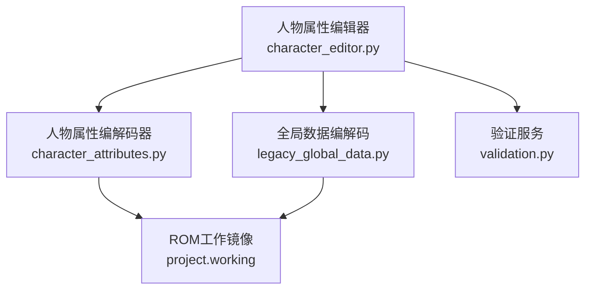
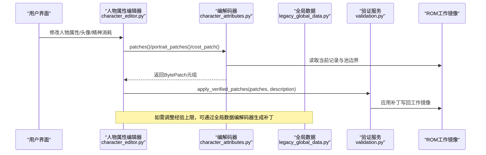
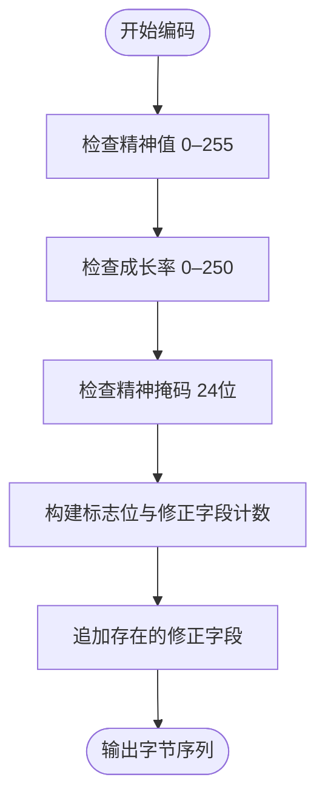
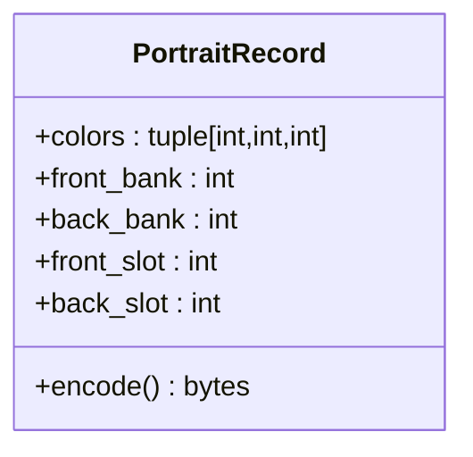
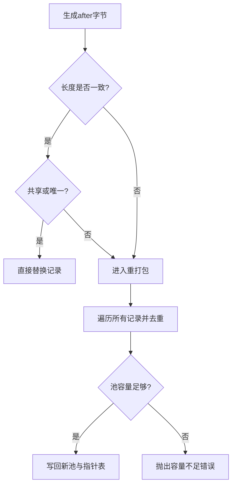
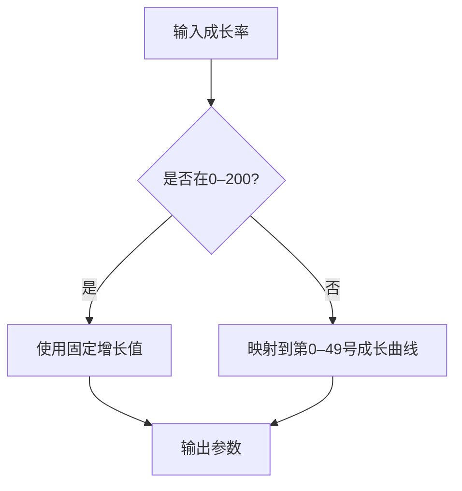
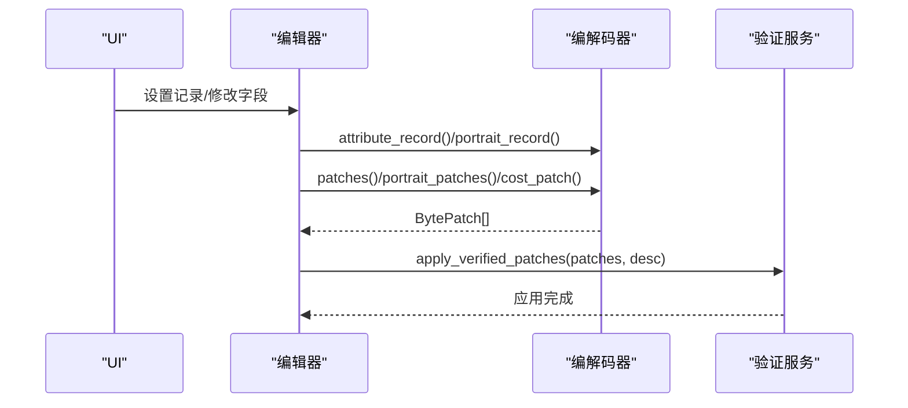
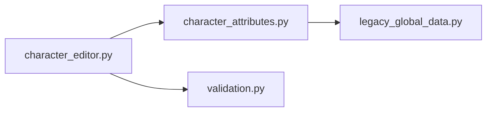

# 人物属性编解码器

<cite>
**本文引用的文件**
- [character_attributes.py](file://src/fc_editor/codecs/character_attributes.py)
- [character_editor.py](file://src/dc_modifier/character_editor.py)
- [legacy_global_data.py](file://src/fc_editor/codecs/legacy_global_data.py)
- [validation.py](file://src/fc_editor/services/validation.py)
</cite>

## 目录
1. [简介](#简介)
2. [项目结构](#项目结构)
3. [核心组件](#核心组件)
4. [架构总览](#架构总览)
5. [详细组件分析](#详细组件分析)
6. [依赖关系分析](#依赖关系分析)
7. [性能考虑](#性能考虑)
8. [故障排查指南](#故障排查指南)
9. [结论](#结论)
10. [附录](#附录)

## 简介
本技术文档聚焦“人物属性(CharacterAttributes)编解码器”，系统性说明：
- 人物基础属性的数据结构、成长曲线编码与初始数值存储方式
- HP、MP（通过精神值体现）、攻击力、防御力等核心属性的字节布局、数值范围限制与溢出处理机制
- 成长率数据的压缩存储、经验值计算公式的参数表示
- 具体的人物属性数据示例、属性变更的计算逻辑、平衡性验证规则
- 性能优化建议与调试技巧

该编解码器面向 FC 游戏 ROM 中的人物属性表与头像表，提供安全读取、校验、补丁生成与批量重打包能力，确保修改不会破坏已验证的运行时上下文。

## 项目结构
围绕人物属性编解码器的关键文件与职责如下：
- src/fc_editor/codecs/character_attributes.py：定义 CharacterAttributes、PortraitRecord 数据模型与 CharacterAttributesCodec 编解码器，负责属性与头像记录的读写、校验、补丁生成与池内重打包
- src/dc_modifier/character_editor.py：UI 层集成，将用户编辑转化为属性记录与头像记录，并调用编解码器生成补丁
- src/fc_editor/codecs/legacy_global_data.py：全局数据编解码，包含累计经验表（经验值上限）的读取与补丁生成
- src/fc_editor/services/validation.py：通用验证服务入口，用于统一执行项目级验证

**图表来源**
- [character_editor.py:165-238](file://src/dc_modifier/character_editor.py#L165-L238)
- [character_attributes.py:78-236](file://src/fc_editor/codecs/character_attributes.py#L78-L236)
- [legacy_global_data.py:680-701](file://src/fc_editor/codecs/legacy_global_data.py#L680-L701)

**章节来源**
- [character_attributes.py:78-236](file://src/fc_editor/codecs/character_attributes.py#L78-L236)
- [character_editor.py:165-238](file://src/dc_modifier/character_editor.py#L165-L238)
- [legacy_global_data.py:680-701](file://src/fc_editor/codecs/legacy_global_data.py#L680-L701)

## 核心组件
- CharacterAttributes：人物属性数据类，包含精神值、成长率、精神掩码、五项修正字段（移动、强度、防御、速度、HP）以及保留标志位；提供 encode() 进行序列化
- PortraitRecord：头像记录数据类，包含颜色索引、正面/背景图库寄存器与位置；提供 encode() 进行序列化
- CharacterAttributesCodec：编解码器，负责：
  - 校验 ROM 上下文一致性（代码签名、指针表起始标记、入口地址）
  - 计算人物记录偏移、读取/写入属性与头像记录
  - 生成单条或共享记录的 BytePatch
  - 在数据池内进行去重与重打包，避免越界与覆盖无关资源
  - 暴露共享 ID 查询、原始记录字节读取、成本表访问等能力

**章节来源**
- [character_attributes.py:30-76](file://src/fc_editor/codecs/character_attributes.py#L30-L76)
- [character_attributes.py:78-236](file://src/fc_editor/codecs/character_attributes.py#L78-L236)

## 架构总览
下图展示从 UI 到 ROM 的数据流与补丁应用流程：

**图表来源**
- [character_editor.py:219-257](file://src/dc_modifier/character_editor.py#L219-L257)
- [character_attributes.py:193-236](file://src/fc_editor/codecs/character_attributes.py#L193-L236)
- [legacy_global_data.py:680-701](file://src/fc_editor/codecs/legacy_global_data.py#L680-L701)

## 详细组件分析

### 人物属性数据结构与字节布局
- 固定头部：
  - 第1字节：精神值（0–255）
  - 第2字节：成长率（0–250；201–250 映射到第0–49号成长曲线）
  - 第3–5字节：24位精神掩码（每位对应一种精神技能）
  - 第6字节：标志位与修正字段计数控制位（低3位为保留标志，高5位指示哪些修正字段存在）
- 可变尾部：
  - 最多5个修正字段：移动补正、强度补正、防御补正、速度补正、HP补正
  - 仅当对应标志位为1时，才占用一个字节
- 溢出与范围限制：
  - 所有单字节字段均限制在 0–255
  - 成长率严格限制在 0–250，超出则抛出错误
  - 精神掩码必须为 24 位整数
  - 保留标志必须保持低三位有效

**图表来源**
- [character_attributes.py:38-56](file://src/fc_editor/codecs/character_attributes.py#L38-L56)

**章节来源**
- [character_attributes.py:30-56](file://src/fc_editor/codecs/character_attributes.py#L30-L56)

### 头像记录结构与位置编码
- 颜色索引：三个 0–63 的调色板索引
- 正面/背景图库寄存器：各占一字节
- 位置编码：
  - 正面位置：以 0xC0 为基，加上 slot×16（slot 范围 0–3，对应显示位置 1–4）
  - 背景位置：以 0x80 为基，加上 slot×16（slot 范围 0–7，对应显示位置 1–8）
- 溢出与范围限制：
  - 颜色索引必须在 0–63
  - 位置编码必须落在已验证范围内，否则视为非法

**图表来源**
- [character_attributes.py:59-76](file://src/fc_editor/codecs/character_attributes.py#L59-L76)

**章节来源**
- [character_attributes.py:59-76](file://src/fc_editor/codecs/character_attributes.py#L59-L76)

### 编解码器核心流程与池内重打包
- 读取流程：
  - 根据人物ID查指针表得到记录偏移
  - 解析标志位确定修正字段数量与顺序
  - 返回 CharacterAttributes 对象
- 写入流程：
  - 生成 after 字节序列
  - 若长度一致且共享或未共享但唯一，直接替换
  - 否则对数据池进行重打包：遍历所有记录，去重后写入新池，更新指针表
- 容量与越界保护：
  - 若重打包后超出池边界，抛出错误提示减少修正或启用共享
  - 未使用的尾部字节保持不变，避免擦除历史数据

**图表来源**
- [character_attributes.py:193-236](file://src/fc_editor/codecs/character_attributes.py#L193-L236)

**章节来源**
- [character_attributes.py:193-236](file://src/fc_editor/codecs/character_attributes.py#L193-L236)

### 经验值与成长曲线参数
- 累计经验表：
  - 固定条目数：99项
  - 每项为小端序16位无符号整数，表示等级上限对应的累计经验值
  - 提供读取与补丁生成接口，用于调整经验上限
- 成长曲线：
  - 成长率 201–250 映射到第0–49号成长曲线
  - 成长率 0–200 表示每级固定增长值
  - 该映射由 UI 工具提示明确说明

**图表来源**
- [character_editor.py:61](file://src/dc_modifier/character_editor.py#L61)
- [character_attributes.py:41-42](file://src/fc_editor/codecs/character_attributes.py#L41-L42)
- [legacy_global_data.py:680-701](file://src/fc_editor/codecs/legacy_global_data.py#L680-L701)

**章节来源**
- [character_editor.py:61](file://src/dc_modifier/character_editor.py#L61)
- [character_attributes.py:41-42](file://src/fc_editor/codecs/character_attributes.py#L41-L42)
- [legacy_global_data.py:680-701](file://src/fc_editor/codecs/legacy_global_data.py#L680-L701)

### 属性变更与补丁应用
- 用户界面收集属性、头像与精神消耗，转换为 CharacterAttributes 与 PortraitRecord
- 调用编解码器生成补丁元组（包含偏移、原始字节、目标字节）
- 通过验证服务统一应用补丁到工作镜像
- 支持还原到原始状态与取消本次窗口改动

**图表来源**
- [character_editor.py:219-257](file://src/dc_modifier/character_editor.py#L219-L257)
- [character_attributes.py:193-236](file://src/fc_editor/codecs/character_attributes.py#L193-L236)

**章节来源**
- [character_editor.py:219-257](file://src/dc_modifier/character_editor.py#L219-L257)
- [character_attributes.py:193-236](file://src/fc_editor/codecs/character_attributes.py#L193-L236)

## 依赖关系分析
- character_editor.py 依赖 character_attributes.py 提供的数据模型与编解码器
- character_attributes.py 依赖 ROM 工作镜像与全局数据（如武器特技相关校验）
- legacy_global_data.py 提供经验上限表的读取与补丁生成，供整体平衡性调整使用
- validation.py 作为统一验证服务入口，确保补丁应用的安全性与一致性

**图表来源**
- [character_editor.py:10-13](file://src/dc_modifier/character_editor.py#L10-L13)
- [character_attributes.py:78-236](file://src/fc_editor/codecs/character_attributes.py#L78-L236)
- [legacy_global_data.py:680-701](file://src/fc_editor/codecs/legacy_global_data.py#L680-L701)

**章节来源**
- [character_editor.py:10-13](file://src/dc_modifier/character_editor.py#L10-L13)
- [character_attributes.py:78-236](file://src/fc_editor/codecs/character_attributes.py#L78-L236)
- [legacy_global_data.py:680-701](file://src/fc_editor/codecs/legacy_global_data.py#L680-L701)

## 性能考虑
- 池内重打包仅在必要时触发，优先尝试原地替换以减少开销
- 去重策略避免重复写入相同记录，降低池膨胀风险
- 未使用尾部字节保持不变，避免不必要的擦写
- 校验代码上下文与指针表起始标记，快速失败于不兼容 ROM 版本，减少后续无效操作

[本节为通用指导，无需特定文件引用]

## 故障排查指南
- 常见错误类型：
  - 数值越界：单字节字段超出 0–255，成长率超出 0–250，颜色索引超出 0–63
  - 格式不匹配：ROM 上下文签名不一致、指针表起始标记无效
  - 容量不足：重打包后超出数据池边界
  - 上传冲突：正面与背景 CHR 图块重叠且内容不同
- 定位方法：
  - 查看原始记录字节与偏移，确认实际写入位置
  - 检查共享 ID 列表，判断是否需要启用共享修改
  - 使用验证服务输出问题清单，逐项修复

**章节来源**
- [character_attributes.py:103-110](file://src/fc_editor/codecs/character_attributes.py#L103-L110)
- [character_attributes.py:231-233](file://src/fc_editor/codecs/character_attributes.py#L231-L233)
- [character_editor.py:240-252](file://src/dc_modifier/character_editor.py#L240-L252)

## 结论
人物属性编解码器通过严谨的数据模型、严格的范围校验与安全的池内重打包机制，确保了人物属性与头像记录的可读、可写与可验证。配合全局经验表与验证服务，可实现平衡性调整与一致性保障。建议在修改过程中充分利用共享记录与去重策略，避免池溢出与冗余写入。

[本节为总结性内容，无需特定文件引用]

## 附录
- 人物属性数据示例（路径参考）：
  - 读取示例：[character_editor.py:176-186](file://src/dc_modifier/character_editor.py#L176-L186)
  - 编码示例：[character_attributes.py:38-56](file://src/fc_editor/codecs/character_attributes.py#L38-L56)
- 头像记录数据示例（路径参考）：
  - 读取示例：[character_attributes.py:174-182](file://src/fc_editor/codecs/character_attributes.py#L174-L182)
  - 编码示例：[character_attributes.py:67-76](file://src/fc_editor/codecs/character_attributes.py#L67-L76)
- 经验值上限调整（路径参考）：
  - 读取与补丁：[legacy_global_data.py:680-701](file://src/fc_editor/codecs/legacy_global_data.py#L680-L701)

[本节为参考指引，无需特定文件引用]